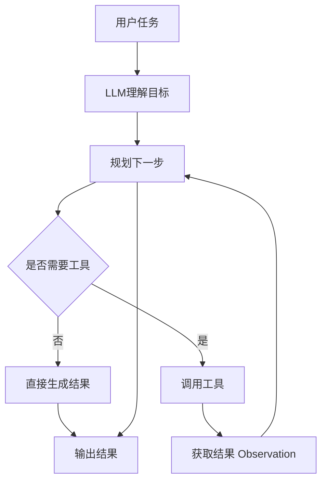
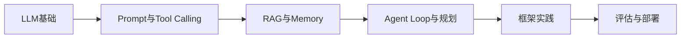
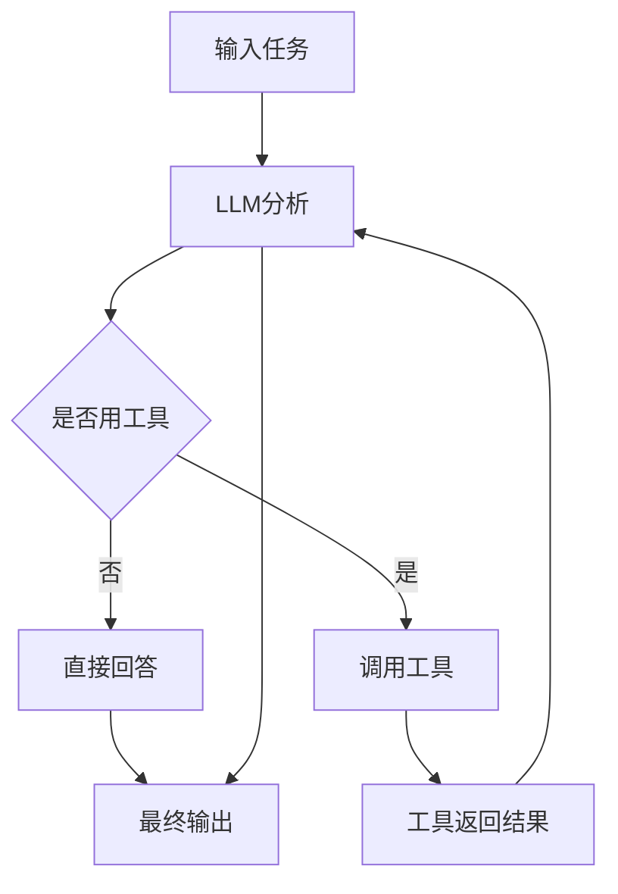

最近在系统学习 Agent 开发，这篇文章主要是把自己当前阶段的理解整理成一份基础笔记，方便后面继续查阅，也希望能给同样刚入门的朋友一个相对清晰的学习框架。

本文偏“学习笔记”风格，不刻意追求特别完整，但会尽量把 Agent 开发里最核心、最容易混淆的内容梳理清楚。

> 参考学习资料：  
> Datawhale 社区公开教程：<https://datawhalechina.github.io/hello-agents/>

---

## 一、我目前对 Agent 的基本理解

### 1. Agent 是什么

目前我对 Agent 的理解可以概括成一句话：

> Agent 是一个以大模型为核心，能够围绕目标进行理解、规划、调用工具并完成任务的系统。

这里面最关键的不是“能聊天”，而是“能完成任务”。

普通的大模型应用很多时候只是：

- 接收输入
- 生成回答
- 返回结果

但 Agent 更强调一个完整闭环：

- 理解目标
- 决定下一步
- 调用工具
- 获取反馈
- 持续执行
- 输出结果

所以 Agent 本质上比“聊天机器人”更像“任务执行助手”。

---

## 二、Agent 和普通大模型应用的区别

这是学习初期最容易混淆的一点。

### 1. 聊天机器人

聊天机器人主要解决的是“问答”问题：

- 用户提问
- 模型生成回答
- 一般不涉及复杂行动

它更像一个“会说话的知识助手”。

### 2. RAG 应用

RAG 的重点是“先检索，再生成”：

- 从知识库或外部文档中找相关内容
- 把检索到的信息交给模型
- 再组织成答案

它主要解决的是大模型知识过时、专业知识不足的问题。

### 3. Workflow 工作流

Workflow 更像一条预设好的流水线：

1. 用户提交任务
2. 系统按固定步骤执行
3. 最后返回结果

它适合规则明确、步骤相对稳定的业务流程。

### 4. Agent

Agent 的特点是：

- 面向目标
- 可以动态决策
- 能够自主调用工具
- 能根据反馈调整下一步行为

### 5. 一个简单对比表

| 类型 | 核心能力 | 工具调用 | 自主决策 | 适合场景 |
|---|---|---:|---:|---|
| 聊天机器人 | 文本问答 | 弱 | 弱 | 对话、写作、总结 |
| RAG | 检索增强回答 | 中 | 弱 | 文档问答、知识库 |
| Workflow | 固定流程自动化 | 强 | 中 | 稳定业务流程 |
| Agent | 动态规划与任务执行 | 强 | 强 | 开放任务、复杂任务 |

---

## 三、Agent 的核心结构

我现在把 Agent 的结构理解成下面几个部分：

- **LLM：大脑**
- **Tools：手和脚**
- **Memory：记忆**
- **Planning：规划**
- **Observation / Feedback：观察与反馈**
- **Guardrails：边界和安全控制**

可以用一张图表示：

这个图里最重要的是中间那个循环：

**理解 -> 决策 -> 行动 -> 反馈 -> 再决策**

这就是 Agent 的核心。

---

## 四、学习 Agent 时需要重点理解的几个模块

---

## 1. LLM：负责理解和决策

LLM 是 Agent 的核心认知模块，负责：

- 理解用户需求
- 结合上下文进行分析
- 决定当前是否需要工具
- 组织输出内容
- 根据工具结果调整后续行为

但需要注意：

> LLM 很强，但并不天然可靠。

常见问题包括：

- 可能会幻觉
- 可能在多轮任务中偏离目标
- 可能不会正确使用工具
- 可能输出不稳定

所以 Agent 开发不能只靠“模型本身”，还要靠系统设计。

---

## 2. Tools：让模型真正具备执行能力

如果没有工具，模型就只能“建议你怎么做”，却不能“替你去做”。

常见工具包括：

- 搜索引擎
- 网页浏览
- 数据库查询
- 本地文件读写
- 邮件发送
- 日历操作
- 天气接口
- 代码执行器
- 企业内部 API

从工程角度看，工具通常就是一个有明确输入输出的函数。

例如：

- `search_web(query)`
- `get_weather(city)`
- `send_email(to, subject, body)`

学习 Agent 时，我觉得要重点关注两个问题：

1. 模型怎么知道什么时候该调用工具
2. 调用之后怎么把结果再反馈给模型

---

## 3. Memory：让 Agent 有“连续性”

记忆模块会直接影响 Agent 的体验。

### 短期记忆
主要用于当前会话：

- 当前任务是什么
- 前一步做了什么
- 工具返回了什么
- 下一步还要继续什么

### 长期记忆
主要用于跨会话：

- 用户偏好
- 历史任务
- 常用配置
- 长期积累的行为信息

我的理解是：

> 没有记忆的 Agent，很多时候只能做一次性任务；有了记忆，才更像真正的助手。

---

## 4. Planning：复杂任务为什么一定要拆解

当任务比较复杂时，Agent 往往不能一步到位。

例如：

> “帮我整理 Agent 开发学习路线，并按基础概念、框架工具、实践项目、评估方法四个部分输出。”

这个任务通常需要拆成多个子任务：

1. 明确输出结构
2. 搜索相关资料
3. 进行内容筛选
4. 分类整理
5. 输出最终总结

所以学习 Agent 时，一定要理解：

- 任务拆解的重要性
- 多步执行的必要性
- 规划和执行不是一回事

---

## 5. Observation / Feedback：为什么要有反馈闭环

很多新手会把 Agent 理解成“更长的 Prompt”，但实际上不是。

Agent 的关键在于它会根据执行结果继续判断。

例如：

- 搜索结果不理想，就继续搜索
- 接口报错，就修改参数重试
- 发现信息不完整，就补充检索
- 发现输出不符合要求，就重新调整

这说明 Agent 不是“一次生成结束”，而是一个会迭代的系统。

---

## 6. Guardrails：为什么安全和边界很重要

当 Agent 可以调用工具、访问外部系统时，就会带来风险。

常见风险包括：

- 误发邮件
- 调用危险接口
- 访问不该访问的数据
- 输出不合规内容
- 无限循环调用工具

因此一个可用的 Agent 系统通常还要有：

- 权限控制
- 工具白名单
- 人工确认机制
- 调用次数限制
- 日志审计
- 敏感内容过滤

这一点在学习阶段容易忽略，但真正做产品时非常重要。

---

## 五、学习 Agent 开发前最好具备的基础

结合自己当前的学习过程，我觉得以下基础非常重要。

---

## 1. Python 基础

目前大多数 Agent 生态都围绕 Python 展开，所以至少要会：

- 函数、类
- 字典、列表、JSON
- 文件读写
- HTTP 请求
- 异常处理

如果基础不稳，后面很多例子都只是“看得懂但写不出来”。

---

## 2. 大模型调用基础

这部分是 Agent 的前置基础，最好先搞清楚：

- Prompt 是什么
- system / user / assistant 的区别
- 温度参数的作用
- 上下文窗口的限制
- 结构化输出怎么做
- Tool Calling / Function Calling 是什么

如果这部分不理解，学 Agent 时会感觉所有概念都比较飘。

---

## 3. Prompt Engineering 基础

虽然 Agent 不只是 Prompt，但 Prompt 依然是重要基础。

一个好的 Agent Prompt 通常会约束：

- 角色设定
- 目标范围
- 工具使用规则
- 输出格式
- 失败处理策略

我的理解是：

> Prompt 不是 Agent 的全部，但它决定了 Agent 的基本行为边界。

---

## 4. RAG 基础

很多 Agent 最终都需要检索外部知识，因此 RAG 很重要。

重点包括：

- 文档切分
- 向量化
- 相似度检索
- 检索结果拼接
- 检索质量优化

尤其在企业知识库、学习助手、内容总结等场景中，RAG 和 Agent 往往会结合使用。

---

## 5. API 和工具封装能力

Agent 真正落地时，很多工作不是“调模型”，而是“接系统”。

需要掌握的能力包括：

- 阅读 API 文档
- 请求认证
- 参数设计
- 异常处理
- 超时与重试
- 日志记录

这部分虽然偏工程，但决定了 Agent 是否真的能用。

---

## 六、我认为比较合理的 Agent 学习路线

目前我会把学习路径分成下面几个阶段：

### 阶段 1：先学大模型基础
重点是把模型本身用明白，而不是一上来就追框架。

### 阶段 2：学习工具调用
这是从“只会回答”走向“具备行动能力”的关键。

### 阶段 3：学习 RAG 和记忆
让 Agent 有知识来源，也有上下文连续性。

### 阶段 4：理解 Agent Loop
这是 Agent 最核心的一步，要理解：

- 如何多步执行
- 如何判断是否完成
- 如何避免死循环
- 如何处理失败

### 阶段 5：再学框架
先理解底层，再学框架会更稳。

### 阶段 6：做评估和部署
从 Demo 走向真实可用系统时，这一步一定不能跳过。

---

## 七、常见框架的初步认识

我目前对常见框架的理解大致如下：

| 框架 | 特点 | 适合场景 |
|---|---|---|
| 原生 API 手写 | 最能理解底层机制 | 入门打基础 |
| LangChain | 组件丰富，生态广 | 快速搭原型 |
| LangGraph | 状态流更清晰 | 复杂 Agent / 多步骤流程 |
| LlamaIndex | 检索和知识组织强 | RAG 场景 |
| AutoGen | 多 Agent 协作明显 | 多角色协同任务 |
| CrewAI | 强调角色分工 | 团队式智能体协作 |

### 当前我的学习倾向

如果是初学阶段，我会建议顺序是：

1. 先手写一个最小 Agent
2. 再看 LangChain / LangGraph
3. 做知识问答类项目时补 LlamaIndex
4. 对多智能体感兴趣再看 AutoGen / CrewAI

---

## 八、一个最小 Agent 的理解框架

学习 Agent 时，我觉得最好先建立最小心智模型。

### 最小流程

1. 用户给出任务
2. 模型理解任务
3. 判断是否需要工具
4. 调用工具
5. 获取工具结果
6. 基于结果继续判断
7. 输出最终结果

可以再用图表示：

这其实就是 Agent 的最小闭环。

---

## 九、学习过程中容易踩的几个坑

### 1. 一上来就想做“通用 Agent”
这是最常见的问题。  
但通用通常意味着：

- 场景不清晰
- 目标太散
- 难以评估
- 难以优化

更适合从垂直场景入手，比如：

- 旅行规划 Agent
- 论文阅读 Agent
- 知识库问答 Agent
- 学习资料整理 Agent

---

### 2. 只关注 Prompt，不关注系统结构
Prompt 很重要，但 Agent 还包括：

- 工具设计
- 状态管理
- 错误恢复
- 记忆机制
- 权限控制

如果只会改 Prompt，很容易遇到瓶颈。

---

### 3. 过度依赖框架
框架只是提高效率，并不能替代理解。

真正需要理解的是：

- Agent 为什么会这样决策
- 为什么调用了这个工具
- 为什么陷入循环
- 为什么结果不稳定

---

### 4. 没有评估体系
没有评估，就很难判断 Agent 到底有没有进步。

至少可以观察：

- 任务完成率
- 工具调用准确率
- 输出质量
- 稳定性
- 成本
- 延迟
- 安全性

---

## 十、我认为适合新手的练手项目

如果只是学习基础，我觉得很适合从一个“小而完整”的项目开始。

### 项目建议：学习资料整理 Agent

#### 功能目标
用户输入一个主题，例如：

> “帮我整理 Agent 开发学习资料，按基础概念、工具框架、实战项目、评估方法四类输出。”

#### 这个项目能练到什么
- 目标理解
- 信息检索
- 内容筛选
- 分类整理
- 结构化输出
- 多步执行

#### 可以逐步迭代
- **v1**：纯 Prompt 输出
- **v2**：接入搜索工具
- **v3**：加入记忆
- **v4**：支持导出 Markdown / Notion

我觉得这类项目很适合用来建立完整认识。

---

## 十一、我当前阶段的总结

学到现在，我对 Agent 的理解越来越清晰：

> Agent 不是一个“更会聊天的大模型”，而是一个围绕目标、具备决策和行动能力的智能系统。

如果再进一步压缩成几个关键词，大概就是：

- **目标**
- **工具**
- **记忆**
- **规划**
- **反馈闭环**

我现在觉得，学习 Agent 开发最重要的不是一开始就追最复杂的框架，而是先建立底层认知：

1. Agent 到底是什么
2. 它和聊天机器人、RAG、Workflow 的区别是什么
3. 它为什么需要工具、记忆和规划
4. 它怎么通过循环执行逐步完成任务

把这些基础概念理顺之后，后面再去看框架、看项目、看产品实现，理解会扎实很多。

---

## 参考资料

- Datawhale 社区公开教程：<https://datawhalechina.github.io/hello-agents/>
- LangChain 官方文档
- LangGraph 官方文档
- LlamaIndex 官方文档
- OpenAI / Anthropic 等模型文档中的 Tool Calling 部分
- ReAct、Toolformer 等相关论文和实践资料

---

## 后续准备继续整理的笔记主题

接下来我可能会继续写几篇更细的学习笔记：

1. **手写一个最小可运行 Agent**
2. **Tool Calling 的基本原理和使用方式**
3. **RAG 在 Agent 系统中的作用**
4. **LangGraph 适合解决什么问题**
5. **如何评估一个 Agent 是否真的可用**

如果后面继续学下去，再把这些笔记逐步补全。
