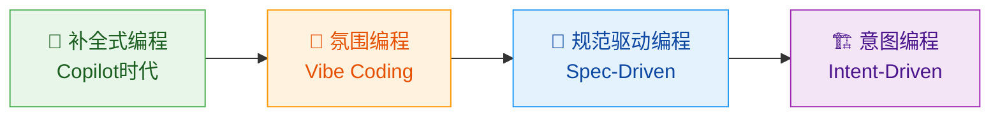
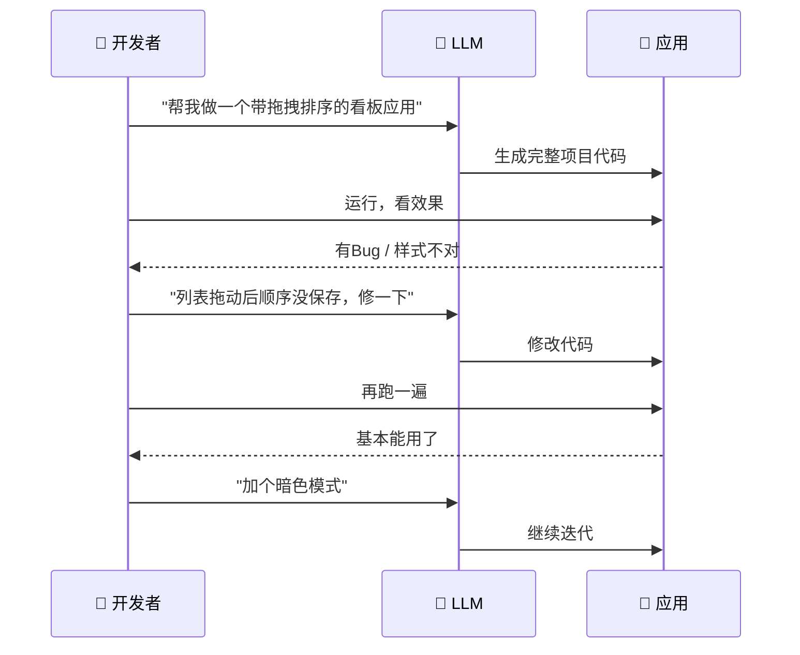
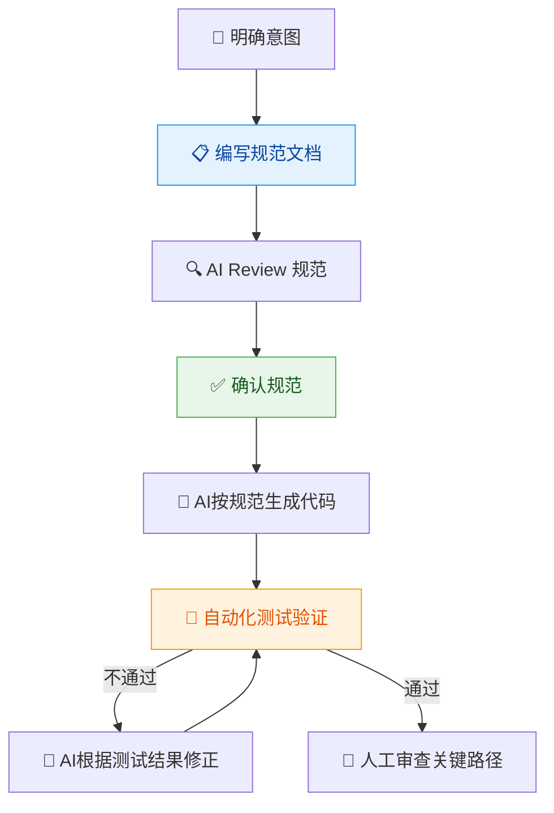
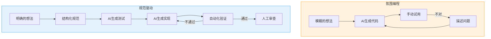
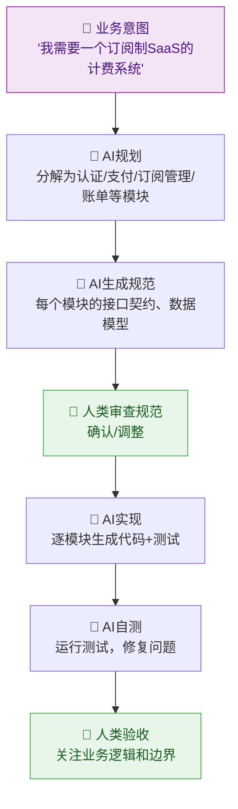
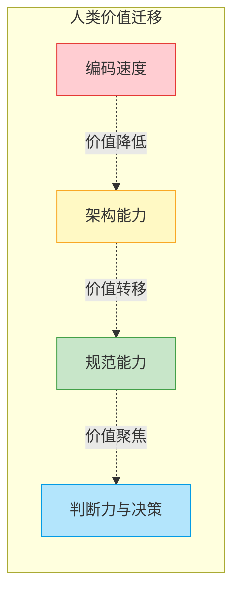

# AI编程的进化之路：从"帮我写段代码"到"帮我构建系统"

> 写这篇文章的起因很简单——上周我用Codex重构了一个老项目，突然意识到自己跟AI协作的方式，和一年前已经完全不一样了。回头一看，这种变化不是突变，而是一条清晰的进化曲线。

---

## 先说结论：AI编程正在经历四个阶段

不是每个人都走完了全程，大部分人可能还卡在第一、第二阶段。但方向已经很明确了。



下面一个一个拆。

---

## 第一阶段：补全式编程——"更聪明的Tab键"

**时间线：** 2022-2023，以GitHub Copilot为代表。

这个阶段的体验本质上是**自动补全的升级版**。你写一行注释，它猜你下一段代码；你敲个函数签名，它把函数体填上。开发者和AI的关系非常明确：**你是主厨，AI是备菜员**。

典型场景长这样：

```python
# 计算两个日期之间的工作日天数
def count_workdays(start_date, end_date):
    # Copilot自动补全 ↓
    count = 0
    current = start_date
    while current <= end_date:
        if current.weekday() < 5:
            count += 1
        current += timedelta(days=1)
    return count
```

**好处是确定的：** 省去了查文档、写boilerplate的时间，体感效率提升大概在20%-30%。

**但局限也很明显：**

- AI的上下文窗口很小，只看得到当前文件的有限范围
- 它不理解你的项目架构，不知道你的业务逻辑
- 本质上是**局部优化**，不改变你写代码的方式

说白了，这个阶段的AI是一个"读过很多代码的实习生"——你告诉它下一步干什么，它能干得又快又像样，但你不能指望它理解全局。

---

## 第二阶段：氛围编程——"先别管细节，跑起来再说"

**时间线：** 2024至今，由Andrej Karpathy命名为"Vibe Coding"。

这个阶段出现了一个有意思的转变：**开发者开始放弃对代码的逐行控制**。

Karpathy自己的描述很精准——"我几乎不看代码本身，只看运行效果。如果报错了，就把错误信息丢给AI，让它修。" 这不是开玩笑，很多人确实在这样工作了。



**氛围编程的核心特征：**

| 维度 | 传统写法 | 氛围编程 |
|------|---------|---------|
| 开发者关注点 | 代码实现 | 运行效果 |
| 质量把控方式 | Code Review | 黑盒测试 / 手动试用 |
| 上下文传递 | 开发者脑子里 | 自然语言对话 |
| 迭代方式 | 改代码→编译→测试 | 描述问题→AI改→看效果 |
| 对代码的态度 | "我要理解每一行" | "能跑就行" |

我不想美化这个阶段。**氛围编程的问题是真实存在的：**

1. **技术债是隐性的。** 你不看代码，不代表代码里没有炸弹。我见过氛围编程搞出来的项目，一个200行的组件里有4种不同的状态管理方式，因为每次AI修bug都是"哪疼治哪"。

2. **调试变成了玄学。** 当你不理解代码结构时，遇到复杂bug就只能反复跟AI描述"就是不太对"，陷入低效循环。

3. **天花板很低。** 做个demo、搞个原型、写个个人小工具——没问题。但凡需要上生产环境、需要多人协作、需要长期维护，氛围编程的代码基本等于一次性用品。

**但我也不想否认它的价值。** 氛围编程真正改变的一件事是：**它把"能不能做出来"的门槛降到了接近于零**。一个产品经理可以在下午茶时间做出一个可交互的原型，一个独立开发者可以在周末上线一个MVP。这在以前是不可想象的。

关键问题是——**然后呢？**

---

## 第三阶段：规范驱动编程——给AI一份"施工图纸"

**时间线：** 2024下半年开始出现苗头，2025年逐渐成为共识。

当人们在氛围编程中反复踩坑之后，一个朴素的想法浮出水面：**如果AI写出来的代码质量不可控，也许问题不在AI，而在我们的输入太模糊**。

这就催生了规范驱动（Spec-Driven）的思路。核心很简单——在写代码之前，先写规范；让AI不是"自由发挥"，而是"照图施工"。



**具体来说，规范驱动编程引入了几层约束：**

### 1. 项目级规范（Project Rules）

在项目根目录放一份 `.cursorrules` 或 `CLAUDE.md` 之类的文件，告诉AI这个项目的"基本法"：

```markdown
# 项目规范

## 技术栈
- 框架：Next.js 14 (App Router)
- 语言：TypeScript，strict模式
- 样式：Tailwind CSS，禁止内联style
- 状态管理：Zustand，禁止prop drilling超过2层

## 代码规范
- 组件文件不超过150行，超出必须拆分
- 所有API调用必须经过统一的request层
- 错误处理必须显式，禁止空catch
- 函数命名：动词开头，如getUserById而非user

## 目录结构
- /features — 按业务域组织，每个feature自包含
- /shared — 跨feature的公共模块
- /lib — 第三方库的封装层
```

### 2. 任务级规范（Task Spec）

每次给AI布置任务时，不是说"帮我加个登录功能"，而是给一份结构化的需求：

```markdown
## 任务：实现用户登录

### 输入
- 邮箱（必填，需验证格式）
- 密码（必填，最少8位）

### 行为
1. 前端校验通过后，调用 POST /api/auth/login
2. 成功：将token存入httpOnly cookie，跳转至/dashboard
3. 失败：在表单下方显示错误信息，不清空已输入内容
4. 连续失败5次：锁定提交按钮60秒

### 边界条件
- 网络超时：显示"网络异常，请重试"
- 账号不存在 vs 密码错误：统一提示"邮箱或密码错误"（安全考虑）

### 不需要做的
- 不要加"记住我"功能（后续迭代）
- 不要加第三方登录（后续迭代）
```

### 3. 验证层（Test as Contract）

规范不是写给人看的——**规范要能被验证**。最好的方式是：先让AI根据规范写测试，再让AI（或同一个AI）写实现。测试充当了"契约"的角色。

```typescript
// 先写测试，这就是"规范的可执行版本"
describe('登录流程', () => {
  it('邮箱格式错误时，不应发起请求', async () => {
    render(<LoginForm />);
    await userEvent.type(screen.getByLabelText('邮箱'), 'not-an-email');
    await userEvent.type(screen.getByLabelText('密码'), 'password123');
    await userEvent.click(screen.getByRole('button', { name: '登录' }));
    
    expect(fetch).not.toHaveBeenCalled();
    expect(screen.getByText('请输入有效的邮箱地址')).toBeInTheDocument();
  });

  it('连续失败5次后应锁定按钮', async () => {
    server.use(
      rest.post('/api/auth/login', (req, res, ctx) => 
        res(ctx.status(401)))
    );
    
    for (let i = 0; i < 5; i++) {
      await submitValidForm();
    }
    
    expect(screen.getByRole('button', { name: '登录' })).toBeDisabled();
  });
});
```

**规范驱动和氛围编程的核心差异，我画了一张对比：**



**实话说，规范驱动不是什么新概念。** TDD、DDD、Design Doc——这些东西在软件工程里存在了几十年。但有意思的是，当AI成为执行者之后，这些"老规矩"反而变得比以前更重要了。

原因很反直觉：**人类程序员可以"意会"，AI只能"言传"。**

一个经验丰富的程序员，你跟他说"加个登录"，他会自动考虑安全性、错误处理、用户体验，因为这些是他的职业本能。但AI没有这种"默认常识"——你不说的，它大概率不会考虑；或者更糟，它会考虑，但做出跟你预期不同的选择。

所以规范驱动本质上是在做一件事：**把人类的隐性知识，变成AI能消费的显性规则**。

---

## 第四阶段：意图编程——"我只管Why，你来搞定How"

**时间线：** 2025年开始出现早期形态，尚未成熟。

如果说规范驱动是"给AI一份施工图纸"，那意图编程就是"给AI一个商业目标，让它自己画图纸再施工"。

这不是科幻。来看看现在已经在发生的事：

- **Devin、OpenHands**：AI Agent自主分解任务、编写代码、运行测试、修复问题、提交PR
- **Claude Code**：在终端里直接操作文件系统、运行命令、自主探索代码库
- **Cursor Agent Mode**：AI主动读取项目结构、理解上下文、跨文件修改



**在这个阶段，人类的角色发生了根本性的转变：**

| 阶段 | 人类角色 | AI角色 | 类比 |
|------|---------|--------|------|
| 补全式 | 写代码 | 补全代码片段 | 程序员 + 智能输入法 |
| 氛围式 | 描述需求、验收 | 生成完整代码 | 甲方 + 外包 |
| 规范驱动 | 写规范、审查 | 按规范实现 | 架构师 + 开发团队 |
| 意图驱动 | 定义目标、决策 | 规划+实现+测试 | CEO + CTO+开发团队 |

我对这个阶段保持**谨慎的兴奋**。谨慎是因为现在的Agent还远没到可靠的程度——它们在简单任务上表现惊艳，但面对复杂系统的模糊性、需要做权衡取舍的架构决策时，还经常犯低级错误。兴奋是因为方向是对的，而且进步速度非常快。

---

## 写在后面：几个不成熟的思考

### 这四个阶段不是互相替代的

更准确地说，它们是**同时存在的工具箱**。我现在的日常大概是这样的：

- 写个快速脚本、处理数据——氛围编程，够了
- 正经项目的新功能——规范驱动，先写spec再生成
- 改个小bug、加个字段——补全式，最高效
- 探索新项目的可行性——有时会试试Agent模式

关键不是"选哪个"，而是**在对的场景用对的方式**。

### "不写代码"不等于"不需要懂代码"

这是我最想说的一点。

每个阶段的演进，表面上看都在让人"离代码更远"。但悖论在于：**你越是不直接写代码，你就越需要理解代码背后的东西**——架构、模式、权衡、约束。

你不需要记住某个API的参数顺序，AI帮你搞定。但你需要知道：

- 什么时候该用消息队列而不是同步调用
- 为什么这个场景下乐观锁比悲观锁更合适
- 这个数据结构在数据量增长到100万时会不会成为瓶颈

**AI消灭的是编码的体力劳动，放大的是工程判断力的价值。**

### 规范能力会成为核心竞争力

在规范驱动和意图驱动的世界里，写一份好的spec的能力，可能比写一手好代码更重要。

什么叫"好的spec"？不是写得多详细——而是**在正确的抽象层级上，把正确的约束讲清楚**。既不能太模糊让AI自由发挥，也不能太具体到等于你自己写了伪代码。

这个能力，说到底，是**对问题域的深刻理解 + 清晰的表达能力**。很难被自动化，反而会越来越值钱。

---



---

写到最后，想起前几天看到的一句话，大意是：**"未来的高手程序员，不是写代码写得最快的人，而是最会跟AI协作的人。"**

我觉得这话对了一半。更完整的说法应该是：**未来的高手，是最清楚什么该交给AI、什么必须自己想明白的人。**

这条边界，正在随着AI的进化不断移动。而我们能做的，就是跟着它一起跑，同时保持清醒。

---

*如果你也在探索AI编程的实践方式，欢迎交流。这个领域变化太快，没有人真的有"标准答案"，但多碰撞总是好的。*
