# 从 MVC 到 CAL：我是如何设计一套适合自己业务的轻量架构

## 前言

最近公司内部启动了一次架构升级，趁着这个机会，我系统地重新学习和梳理了当下主流的几种架构思想：

> MVC · DDD · 六边形架构 · 洋葱圈架构 · 整洁架构 · COLA 架构

看完之后，我的第一感受是：

**这些架构说的其实是同一件事，只是表达方式不同。**

它们都在强调：

```text
以业务为核心
解耦外部依赖
分离业务复杂度和技术复杂度
```

但当我想把这些思想落地到自己团队的项目时，却遇到了一个问题：

**每一套架构拿来都觉得哪里不对。**

要么太重，要么太简单，要么概念太多落地困难。

于是我决定：**不照搬任何一套，而是根据自己的业务特点，融合各家所长，裁剪掉不适合的部分，整理出一套属于自己团队的架构方案。**

这篇文章就是这个过程的完整记录。

---

## 一、重新认识这些架构

在动手设计之前，我先把这几套架构重新梳理了一遍，提炼出各自的核心思想。

### 1.1 MVC：最熟悉的起点

MVC 是大多数人的架构起点，也是很多项目最终停留的地方。

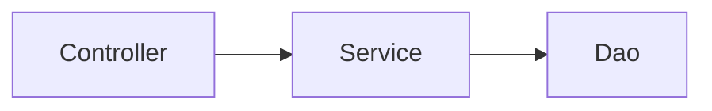

它的优点是简单直接，新手上手快。但随着业务增长，问题也随之暴露：

- Service 越来越臃肿，单个类动辄数千行
- Controller 开始承担业务逻辑
- 模块之间随意互相调用，形成蜘蛛网依赖
- 公共逻辑到处复制粘贴

MVC 本身没有错，错的是**它没有给复杂业务的增长提供足够的扩展空间**。

---

### 1.2 DDD：最有深度的思想

DDD（领域驱动设计）是这几套架构里概念最多、最有深度的一套。

它的核心贡献是：

- 把业务复杂度放在第一位
- 用领域模型来表达业务规则
- 通过聚合根、领域服务、值对象等概念约束业务边界

DDD 的思想非常先进，但问题在于：

- 学习成本极高
- 概念繁多：聚合根、实体、值对象、领域事件、防腐层、限界上下文……
- 需要团队对业务有极深的理解才能正确建模
- 对于 CRUD 为主的中后台系统，引入 DDD 是严重过度设计

我见过太多团队，引入 DDD 之后代码量翻倍，但可维护性并没有提升。

---

### 1.3 六边形架构：最清晰的入口设计

六边形架构（Hexagonal Architecture）也叫端口与适配器架构。

它的核心思想只有一句话：

> **业务核心不依赖任何外部系统，外部系统通过适配器与业务核心交互。**

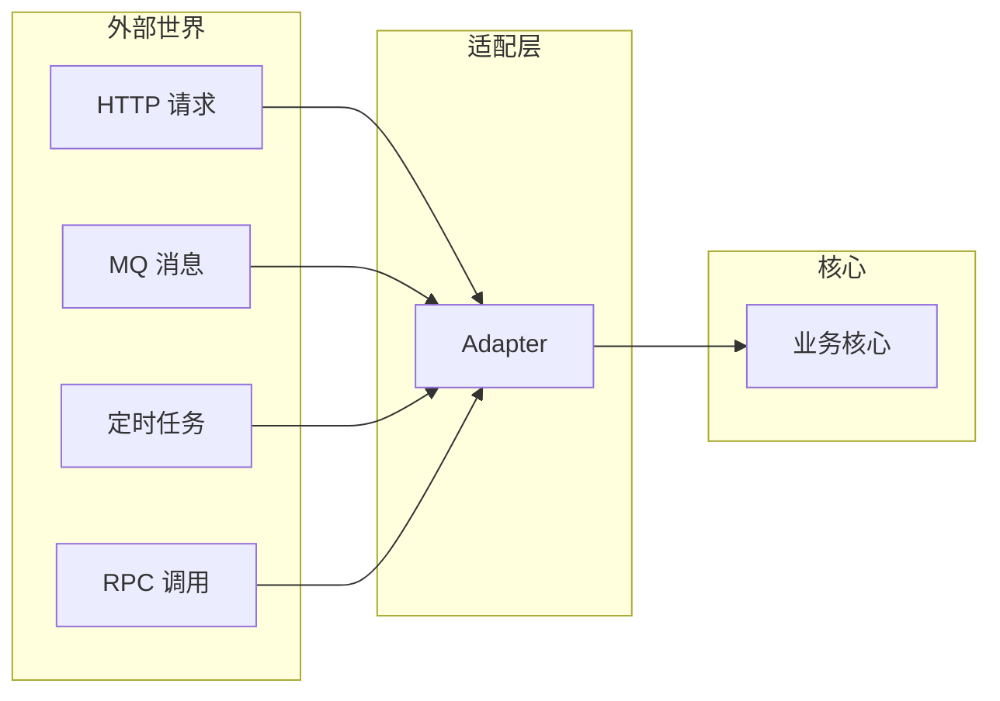

这个思想非常实用，它解决了一个很常见的问题：**业务逻辑和技术细节混在一起，导致测试困难、替换困难**。

六边形架构给了我一个重要启发：**所有外部请求都应该通过统一的入口层进入系统，业务核心不应该感知外部协议的存在**。

---

### 1.4 洋葱圈架构：最直观的依赖方向

洋葱圈架构（Onion Architecture）把系统分成一圈一圈的同心圆，核心规则是：**依赖只能由外向内，内层不依赖外层。**

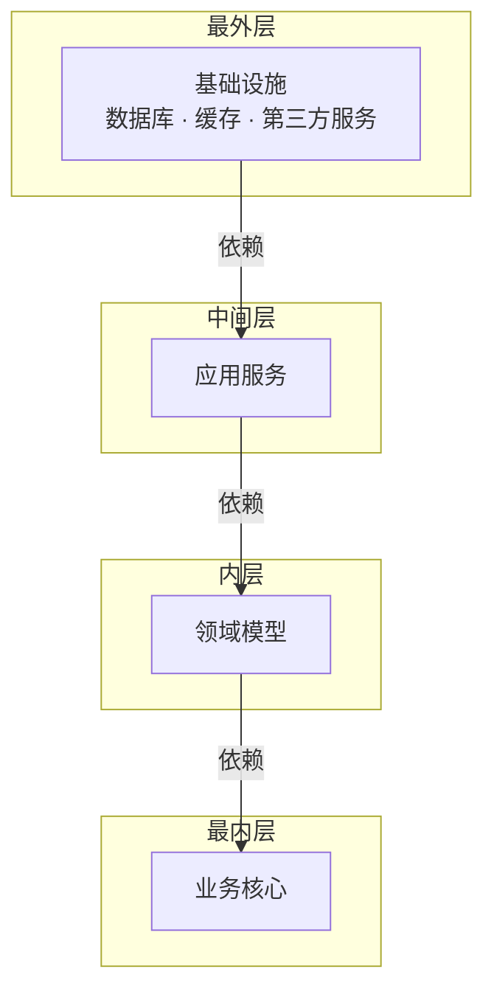

这个模型很直观，依赖方向一目了然。但在实际落地中，它和 DDD 一样对团队的理解能力要求较高。

---

### 1.5 整洁架构：最完整的依赖倒置

整洁架构（Clean Architecture）是 Robert C. Martin 提出的，综合了六边形架构和洋葱圈架构的思想。

它的核心贡献是：**用依赖倒置原则（DIP）彻底解耦业务与技术。**

业务层定义接口，基础设施层实现接口，业务层永远不依赖具体技术实现。这套架构理论上非常完美，但工程落地成本同样不低。

---

### 1.6 COLA：最接近落地的 Java 架构

COLA 是阿里巴巴开源的一套 Java 应用架构，在 DDD 和整洁架构的基础上做了大量工程化简化。

COLA 的贡献是：

- 清晰的分层规范
- Command / Query 职责分离（CQRS）
- Gateway 屏蔴外部依赖
- 规范的包结构和命名约定

COLA 是我研究最深的一套架构，对我的启发也最大。

但对于我们团队的业务场景，它仍然有几处偏重：

- Gateway 层对于纯 CRUD 系统略显冗余
- DomainService 的概念在简单业务中难以界定
- 部分概念对新人不够友好

---

## 二、我们团队真实的问题

在研究完这些架构之后，我重新审视了我们团队的项目现状。

我们的系统是典型的企业中后台：

```text
ERP + OA + CRM 混合系统
80% 是标准 CRUD 操作
20% 有一定的业务复杂度（审批流、权限控制、多租户）
团队规模中等，成员技术水平参差不齐
```

当前面临的核心问题：

| 问题 | 具体表现 |
|------|---------|
| Service 层臃肿 | 单个 Service 文件超过 2000 行 |
| Controller 越权 | 业务逻辑渗透至 Controller 层 |
| 模块循环依赖 | UserService 依赖 OrderService，OrderService 又依赖 UserService |
| 公共逻辑散落 | 通知、权限、审计逻辑在各模块重复编写 |
| 新人上手慢 | 没有统一规范，每个人写法不同 |

这些问题用 DDD 能解决，但代价太大。**我需要一套介于 MVC 和 DDD 之间的方案。**

---

## 三、设计思路：取各家之长，舍复杂之处

确定了目标之后，我开始梳理设计思路。核心原则只有一条：

> **解决我们真实存在的问题，而不是引入我们不需要的概念。**

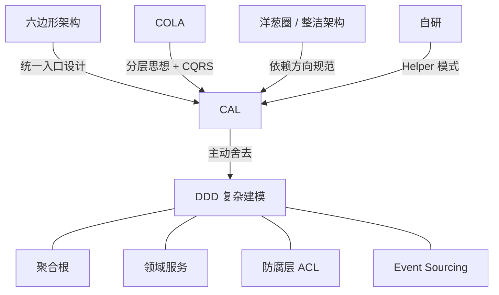

具体取舍如下：

**取：统一入口设计（来自六边形架构）**
所有外部请求统一经过 Adapter 层，业务核心不感知外部协议。

**取：分层思想 + CQRS（来自 COLA）**
清晰的层次划分，Command 负责写，Query 负责读，职责分离互不干扰。

**取：依赖方向规范（来自洋葱圈 / 整洁架构）**
单向依赖，禁止反向，业务模块禁止互相依赖。

**补充：Helper 模式（自研）**
用于承接从 Command / Query 中拆分出的复杂逻辑，也是设计模式的落地空间。

**舍去：DDD 复杂建模**
舍去聚合根、领域服务、防腐层（ACL）、Event Sourcing。

---

## 四、CAL 架构设计

基于以上思路，我整理出了这套架构，命名为 **CAL（COLA Architecture Lite）**。

### 4.1 整体模块结构

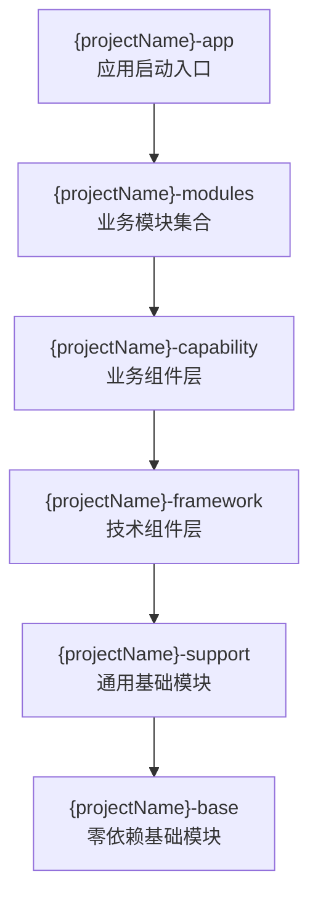

各层定位一览：

| 模块 | 定位 | 典型内容 |
|------|------|---------|
| **base** | 零框架依赖，纯 Java | 常量、枚举、异常、工具类 |
| **support** | 依赖 Spring 的通用能力 | 统一响应、事件封装、全局异常处理 |
| **framework** | 技术组件封装 | Redis、MQ、OSS 等底层封装 |
| **capability** | 业务组件层 | 通知、权限、审计等跨模块能力 |
| **modules** | 具体业务模块 | 按业务对象划分子包 |
| **app** | 启动类 | 仅做装配，无业务逻辑 |

---

### 4.2 三个关键设计决策

#### 决策一：技术能力和业务能力分层

我把中间件层拆成了两层：

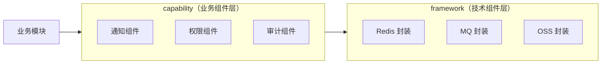

业务模块禁止直接依赖第三方 SDK，统一通过组件调用：

```java
// ❌ 禁止：直接使用底层客户端
redissonClient.getBucket(key).set(value);

// ✅ 正确：通过封装组件调用
redisComponent.set(key, value);
```

这样做的好处：**底层实现随时可换，业务代码完全无感知。**

---

#### 决策二：模块内按业务对象划分子包

传统按层划分的方式，文件散落各处，关联性弱：

```text
❌ 传统方式
controller/
  └── UserController
service/
  └── UserService
mapper/
  └── UserMapper
```

CAL 按业务对象划分子包，子包内保持完整三层结构：

```text
✅ CAL 方式
user/
├── adapter/               # 入口层（Controller / MQ Listener / Job）
│   └── UserController
├── application/           # 应用层
│   ├── command/           # 写操作
│   ├── query/             # 读操作
│   ├── helper/            # 业务辅助逻辑
│   └── model/             # 应用层模型（VO / DTO / Form）
└── infrastructure/        # 基础设施层
    ├── model/             # 数据库实体
    ├── repository/        # 数据访问
    └── config/            # 模块配置
```

**所有与 User 相关的代码都在 `user` 包下，查找、修改、删除都极为方便。**

---

#### 决策三：引入 Helper 层承接复杂逻辑

这是 CAL 最核心的原创设计。

在 COLA 中，复杂逻辑通常放在 DomainService 里，但 DomainService 需要 DDD 建模支撑，引入成本高。我用 **Helper** 来替代：

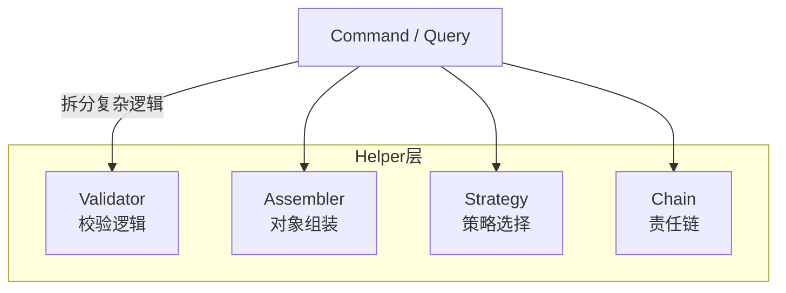

当 Command 变得复杂时，拆分到 Helper：

```java
// Command 保持简洁，只做流程编排
@Component
public class CreateUserCommand {

    @Resource
    private UserValidator userValidator;
    @Resource
    private UserRepository userRepository;

    public Long execute(CreateUserForm form) {
        // 校验
        userValidator.checkUsernameNotExists(form.getUsername());
        userValidator.checkPhoneNotExists(form.getPhone());
        // 转换 & 落库
        User user = UserAssembler.toEntity(form);
        userRepository.save(user);
        return user.getId();
    }
}

// Validator 承载校验逻辑
@Component
public class UserValidator {
    @Resource
    private UserRepository userRepository;

    public void checkUsernameNotExists(String username) {
        if (userRepository.existsByUsername(username)) {
            throw new BizException("用户名已存在");
        }
    }
}
```

Helper 同时也是设计模式的天然容器：

| Helper 类型 | 示例 | 适用场景 |
|------------|------|---------|
| Validator | `UserValidator` | 复杂业务校验 |
| Assembler | `UserAssembler` | 对象转换组装 |
| Strategy | `PayStrategy` | 多支付渠道选择 |
| Chain | `ApprovalChain` | 多级审批流转 |
| Template | `ImportTemplate` | 数据导入模板 |
| StateHandler | `WorkflowState` | 工作流状态流转 |

---

### 4.3 标准调用链

**写操作链路：**

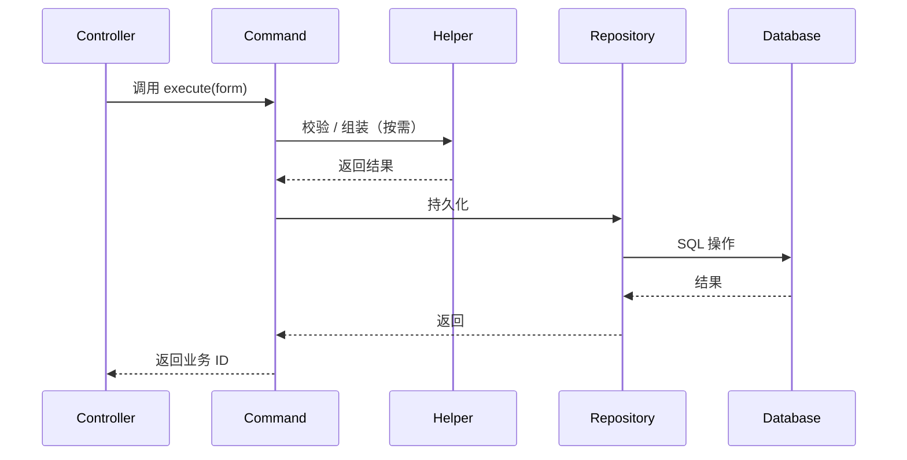

**读操作链路：**

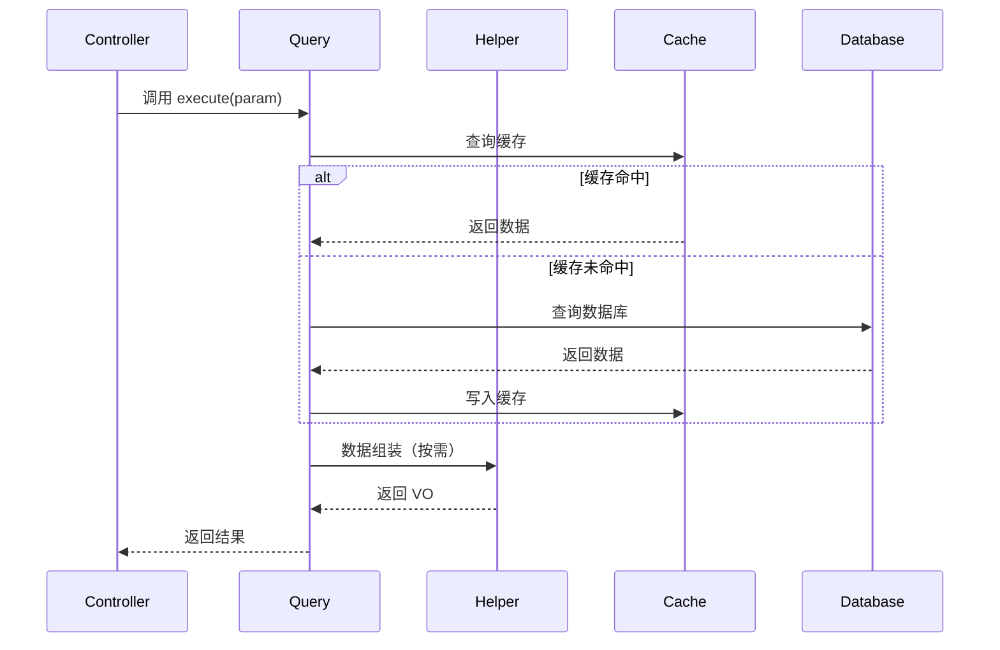

**跨模块联动（事件驱动）：**

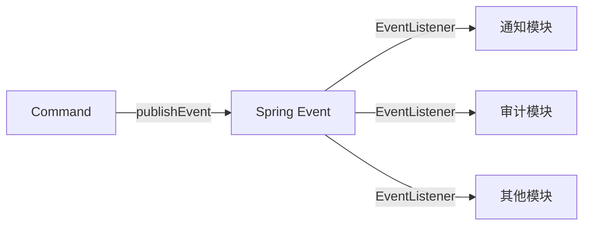

模块间通过事件解耦，**禁止直接互相调用，从根本上杜绝循环依赖**。

---

## 五、与其他架构的对比

| 维度 | 传统三层 | 完整 DDD | **CAL** |
|------|:-------:|:-------:|:-------:|
| 学习成本 | 低 ✅ | 高 ❌ | **低** ✅ |
| 规范程度 | 低 ❌ | 高 ✅ | **高** ✅ |
| 扩展能力 | 弱 ❌ | 强 ✅ | **中强** 🔶 |
| CRUD 适配 | 好 ✅ | 差 ❌ | **好** ✅ |
| 模块解耦 | 差 ❌ | 好 ✅ | **好** ✅ |
| 落地难度 | 易 ✅ | 难 ❌ | **易** ✅ |

我越来越认同一句话：

> **架构没有绝对的好坏，只有是否适合当前业务。**

---

## 六、一些思考

设计完这套架构，我有几点感悟想分享。

**架构不是越复杂越好**

DDD 非常先进，但它是为复杂业务领域设计的。把它用在 CRUD 系统上，就像用手术刀切面包——工具本身没问题，但场景不对。

**好的架构要解决真实问题**

我见过很多团队引入某套架构，只是因为"听说很厉害"或者"大厂在用"。但架构的价值在于解决你团队真实存在的问题，不在于概念多高大上。

**适合自己的才是最好的**

CAL 不一定适合所有团队。如果你的业务足够复杂，DDD 是更好的选择；如果你的团队规模很小，传统三层可能已经够用。架构选型永远要结合实际情况。

**架构是持续演进的**

CAL 是我们当前阶段的最优解，不代表永远正确。随着业务增长，架构也需要跟着演进。重要的是建立清晰的边界和规范，让未来的演进有迹可循。

---

## 七、总结

这次架构升级让我对这些主流架构有了更深的理解。

它们的核心思想是一致的：

```text
业务是核心，技术是手段
复杂度要分离，依赖要单向
边界要清晰，职责要单一
```

CAL 的核心公式：

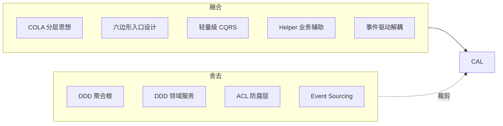

**用最小的架构复杂度，换取最大的可维护性与可扩展性。**

这是 CAL 的设计初衷，也是我对架构设计一直以来的理解。

---

> 完整的 CAL 架构设计文档已整理，包含各层详细设计、调用链路、Repository 规范、设计模式落地方案等，后续会持续更新。
