# 可观测性学习笔记

---

## 前言

在过去十年，软件系统的复杂度发生了质的飞跃。从单体应用到微服务，从物理机到容器，从固定部署到弹性伸缩，系统内部的运行状态越来越难以直接感知。传统的"监控"模式逐渐暴露出严重的局限性——它能告诉我们"出问题了"，却无法回答"为什么出问题"。

**可观测平台**（Observability Platform）正是为解决这一困境而诞生的。它不仅仅是工具的堆叠，更是一套系统化的工程理念，帮助工程师在复杂的分布式环境中快速理解系统行为、定位故障根因、持续改善系统质量。

本文将从以下几个维度系统讲解：

- **为什么需要可观测平台**：理解问题背景和驱动力
- **可观测性理论体系**：掌握核心概念和三大支柱
- **主流技术选型**：对比各类工具的优缺点和适用场景
- **架构设计实践**：学会为不同规模企业设计可观测方案
- **成本优化与最佳实践**：避开常见陷阱，合理控制成本

无论你是开发工程师、运维工程师还是架构师，希望本文都能帮助你建立起完整的可观测性知识体系。

---

## 1 为什么需要可观测平台

### 1.1 传统监控的局限性

#### 传统监控模式

传统监控的核心思路是：**预先定义好需要关注的指标，当指标超出阈值时触发告警**。

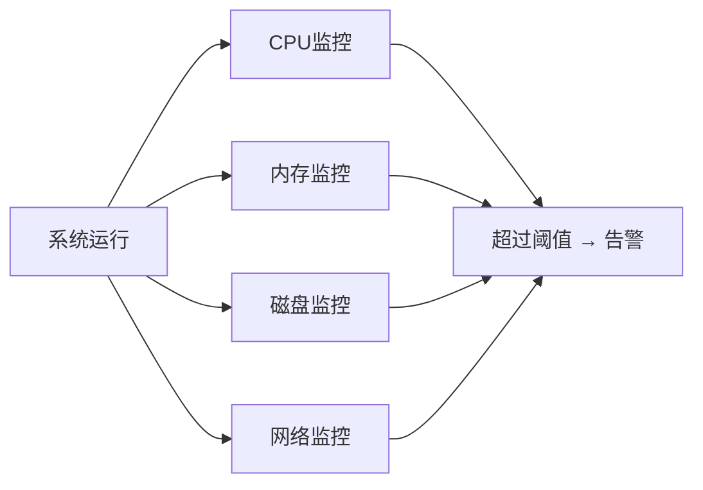

这种模式在单体架构时代工作得相当良好——服务少、调用简单、问题往往直接映射到某个资源指标的异常上。但在微服务和云原生时代，它暴露出了根本性的缺陷：

| 局限性 | 具体表现 |
|--------|----------|
| **只能发现已知问题** | 必须事先知道"哪个指标可能出问题"，无法应对未知故障 |
| **无法定位根因** | 告警只说明"有问题"，不能解释"为什么有问题" |
| **缺乏上下文关联** | CPU高是因为哪个服务哪个接口，无从知晓 |
| **微服务链路盲区** | 几十上百个服务相互调用，传统监控无法还原调用链 |
| **容器动态性挑战** | Pod随时创建销毁，静态配置的监控规则难以跟踪 |

---

### 1.2 一个真实故障案例：Redis连接池耗尽

让我们通过一个典型案例，直观感受传统监控的失效场景。

**故障现象**：某电商平台在大促期间，用户反馈支付失败，但页面没有任何错误提示。

```
用户视角：点击支付 → 页面无响应 → 支付失败
```

**各团队的"正常"判断**：

```
业务团队：订单服务日志没有报错，看起来正常
开发团队：PaymentService健康检查通过，服务运行正常
运维团队：CPU 35%，内存 60%，网络带宽正常，全部绿灯
DBA团队：MySQL连接数正常，慢查询无异常
```

**真实根因**：

```
PaymentService → 调用Redis获取用户会话 → Redis连接池耗尽（配置上限50个）
                                          ↓
                              请求在连接池队列等待超时
                                          ↓
                              支付接口返回超时，但无明确错误日志
```

**传统监控为何失效？**

1. Redis连接池是应用内部状态，没有对外暴露为监控指标
2. Redis服务本身完全正常，服务器资源无异常
3. 没有链路追踪，无法发现"支付请求在哪一步卡住了"
4. 日志没有结构化，"连接池等待"被埋没在大量文本日志中

这个案例揭示了传统监控的本质缺陷：**它关注的是"资源"，而不是"行为"；它能发现"已知的异常"，而无法发现"未预期的状态"**。

---

### 1.3 云原生时代的新挑战

#### 微服务架构：调用链的爆炸式增长

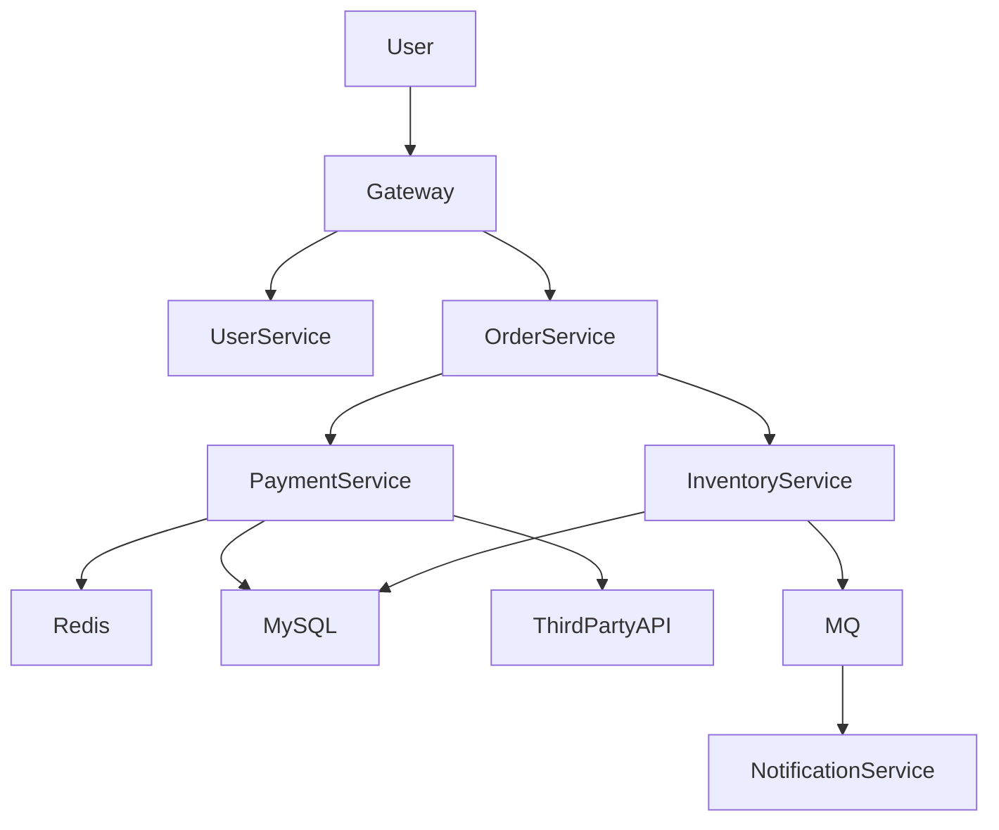

在上述架构中，一次用户下单可能涉及：
- **7个以上**微服务的协同
- **10次以上**的网络调用
- **跨越多个数据库和消息队列**

任何一个环节出现问题，都可能导致整体请求失败。而传统监控只能观察每个服务的"岛屿"，无法还原整条"链路"。

#### Kubernetes：动态性带来的观测困难

```
传统环境：192.168.1.100 → OrderService（稳定不变）

Kubernetes环境：
  Pod-a1b2c3 → OrderService（随时可能被销毁）
  Pod-d4e5f6 → OrderService（新Pod随时创建）
  Service IP → 10.96.0.1（VIP，背后动态变化）
```

Kubernetes带来的观测挑战：

| 挑战 | 描述 |
|------|------|
| **Pod短暂性** | Pod随时销毁重建，历史日志可能随Pod消失 |
| **IP动态变化** | 无法用固定IP标识服务实例 |
| **自动扩缩容** | 实例数量动态变化，监控配置难以实时跟进 |
| **多租户隔离** | 多个团队共享集群，需要Namespace级别的可见性 |
| **Sidecar模式** | Service Mesh引入大量代理容器，增加观测复杂度 |

---

### 1.4 什么是可观测性（Observability）

#### 可观测性的定义

可观测性这个概念来自**控制论**，由匈牙利数学家鲁道夫·卡尔曼（Rudolf Kálmán）在1960年提出：

> **可观测性是指：通过系统的外部输出，推断系统内部状态的能力。**

将这一概念引入软件工程领域，可以理解为：

> **一个系统的可观测性越强，工程师就越能通过系统产生的数据（日志、指标、链路），理解系统的任意内部状态——包括那些从未预料到的状态。**

#### 可观测性 VS 传统监控

这是两种本质不同的工程思维：

| 维度 | 传统监控（Monitoring） | 可观测性（Observability） |
|------|------------------------|--------------------------|
| **核心目标** | 发现已知问题 | 理解系统行为，探索未知问题 |
| **工作方式** | 预定义规则，阈值触发 | 数据驱动，探索式分析 |
| **适用场景** | 已知的、可预测的故障 | 未知的、复杂的、间歇性故障 |
| **数据维度** | 主要是Metrics | Metrics + Logs + Traces |
| **问题视角** | "哪个指标超出阈值" | "用户请求在哪里失败，为什么" |
| **架构适应性** | 适合稳定的单体架构 | 适合动态的分布式架构 |
| **告警质量** | 多噪音，告警风暴频繁 | 基于SLO，精准有效 |

**一句话总结**：监控告诉你"有什么问题"，可观测性帮你回答"为什么有问题，如何修复"。

---

## 2 可观测性的三大支柱

业界公认，可观测性建立在三大支柱之上：**Metrics（指标）**、**Logging（日志）**、**Tracing（链路追踪）**。这三者各有侧重，相互协同，共同构成完整的可观测能力。

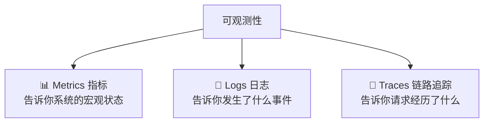

### 2.1 Metrics（指标）

#### 什么是指标

指标是对系统状态的**数值化、时序化**描述。它将系统某一维度的行为压缩为一个随时间变化的数值序列。

**典型的系统指标：**

```
基础资源指标：
  - CPU使用率：node_cpu_usage_percent = 75%
  - 内存使用：node_memory_used_bytes = 4GB
  - 磁盘IO：disk_io_bytes_total = 1.2GB/s

应用业务指标：
  - 每秒请求数（QPS/TPS）：http_requests_per_second = 5000
  - 接口响应时间（RT）：http_request_duration_p99 = 230ms
  - 错误率（Error Rate）：http_error_rate = 0.5%
  - 连接池使用率：db_connection_pool_usage = 85%
```

#### Metrics的数据模型

一个Metric由三个核心要素组成：

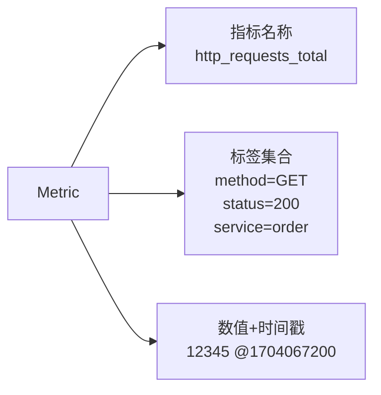

完整示例：

```text
# 指标名称：http_requests_total
# 含义：HTTP请求总数
# 类型：Counter（只增不减的计数器）

http_requests_total{
  method="GET",
  status="200",
  service="order-service",
  endpoint="/api/orders"
} 98765 1704067200000
```

#### Metrics的四种类型

| 类型 | 说明 | 典型用途 |
|------|------|----------|
| **Counter** | 单调递增计数器，只增不减 | 请求总数、错误总数、字节发送量 |
| **Gauge** | 可增可减的当前值 | CPU使用率、内存使用量、连接数 |
| **Histogram** | 将数据分桶统计，计算分位数 | 接口响应时间分布（P50/P90/P99） |
| **Summary** | 类似Histogram，客户端计算分位数 | 请求延迟，精确分位数统计 |

#### Metrics的优缺点

**优点：**
- 存储成本低，数据高度压缩
- 聚合能力强，支持跨维度汇总分析
- 查询效率高，适合实时监控和告警
- 图表展示直观，适合大盘/Dashboard

**缺点：**
- 缺少上下文——只知道"P99延迟是500ms"，不知道"是哪些请求慢"
- 标签基数（Cardinality）过高会导致存储爆炸
- 无法追溯单次请求的完整过程

---

### 2.2 Logging（日志）

#### 日志的分类

```
应用日志：程序运行过程中输出的事件记录
  → 订单创建成功，orderId=888，userId=1001

审计日志：记录用户操作行为，用于合规审计
  → 用户1001在2024-01-01 10:00:00 修改了账户密码

安全日志：记录安全事件，用于威胁分析
  → 来自IP 192.168.1.100 的登录失败，连续5次

系统日志：操作系统和中间件产生的日志
  → kernel: OOM killer invoked, killed process nginx
```

#### 日志的价值：从现象到根因

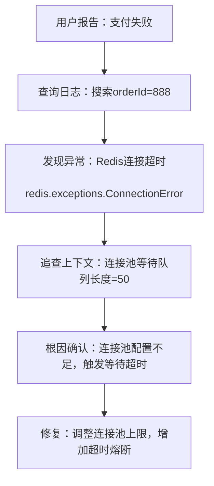

#### 结构化日志 vs 非结构化日志

这是日志实践中最重要的设计决策。

**❌ 不推荐：非结构化文本日志**

```text
2024-01-01 10:00:00 ERROR 用户下单失败，用户1001，订单888，原因是Redis连接超时
2024-01-01 10:00:01 INFO 用户1002下单成功
```

问题：
- 字段提取依赖正则，成本高且脆弱
- 无法直接关联TraceId，难以与链路追踪联动
- 日志格式不统一，聚合分析困难

**✅ 推荐：结构化JSON日志**

```json
{
  "timestamp": "2024-01-01T10:00:00.123Z",
  "level": "ERROR",
  "service": "order-service",
  "traceId": "abc123def456",
  "spanId": "span789",
  "userId": "1001",
  "orderId": "888",
  "action": "create_order",
  "error": "RedisConnectionError",
  "errorMessage": "Connection pool exhausted, timeout after 3000ms",
  "duration": 3001
}
```

优点：
- 字段即索引，查询高效
- TraceId关联，一键跳转链路追踪
- 机器可读，支持复杂聚合分析

#### 日志级别设计规范

```
FATAL：系统级致命错误，服务无法继续运行（需要立即处理）
ERROR：业务错误或技术异常，影响用户体验（需要告警）
WARN：潜在问题或非预期状态，暂时不影响功能（需要关注）
INFO：正常业务流程节点，关键操作记录（正常记录）
DEBUG：调试信息，详细执行过程（仅开发/排障时开启）
TRACE：最详细的执行追踪（一般不在生产使用）
```

---

### 2.3 Tracing（链路追踪）

#### 为什么需要链路追踪

在微服务架构中，一次用户请求往往会触发多个服务的协同工作。当出现问题时，最困难的问题不是"哪个服务有问题"，而是"这次具体的请求，在哪个环节、花了多长时间、发生了什么错误"。

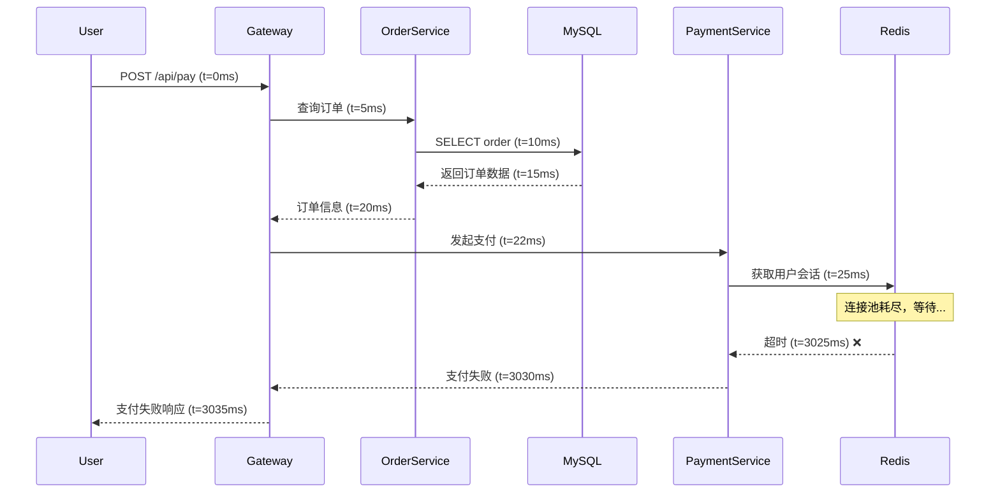

没有链路追踪，你只能看到：
- 用户请求耗时3035ms，失败
- 各服务日志各说各话

有了链路追踪，你能清晰看到：
- 整条链路的时序瀑布图
- **Redis调用耗时3000ms**，是瓶颈所在
- 具体是哪次请求，携带哪些业务参数

#### Trace的核心数据模型

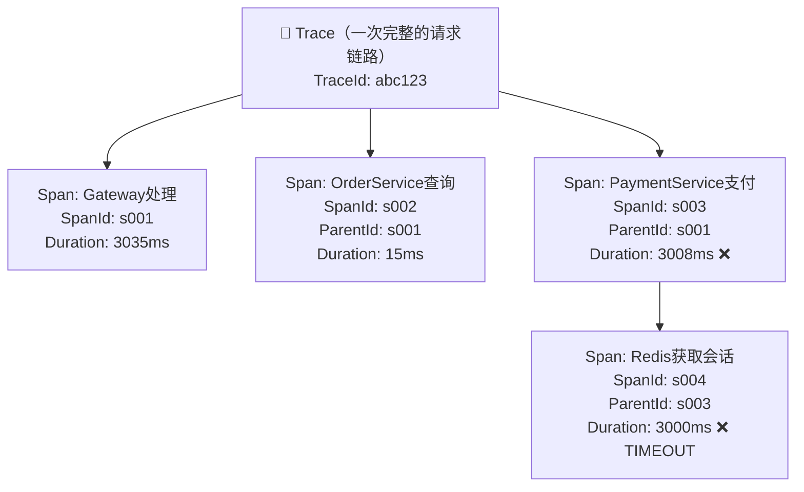

**核心概念详解：**

| 概念 | 说明 | 示例 |
|------|------|------|
| **TraceId** | 全局唯一ID，标识一次完整请求链路 | `abc123def456789` |
| **SpanId** | 当前操作的唯一ID | `span001` |
| **ParentSpanId** | 父操作的SpanId，用于构建调用树 | `gateway001` |
| **Baggage** | 跨服务传递的业务上下文 | `userId=1001` |
| **Tags/Attributes** | Span的键值对属性 | `http.method=POST` |
| **Events** | Span内的时间点事件 | `db.query.start` |

#### 链路追踪的采样策略

全量采集链路数据成本极高，需要合理采样：

```
头部采样（Head-based Sampling）：
  → 在请求入口决定是否采样
  → 优点：实现简单，成本可控
  → 缺点：可能漏掉偶发的慢请求/错误请求

尾部采样（Tail-based Sampling）：
  → 在请求完成后，根据结果决定是否保留
  → 优点：可以保留所有错误请求和慢请求
  → 缺点：需要临时缓存所有Span，内存占用大

混合采样策略（推荐）：
  → 错误请求：100%采样
  → 慢请求（>1s）：100%采样
  → 正常请求：按比例采样（1%~10%）
```

---

### 2.4 三大支柱的协同工作

三大支柱各有侧重，真正的威力在于**相互关联、协同分析**：

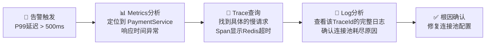

**典型的排障流程：**

1. **Metrics大盘发现异常**：P99延迟告警，PaymentService错误率上升
2. **定位到问题时间窗口**：确定故障发生的时间范围
3. **通过Tracing找到慢请求**：过滤出该时间段内的异常Trace
4. **关联日志深挖根因**：用TraceId在日志系统中搜索完整上下文
5. **确认根因，制定修复方案**

这三者通过**TraceId**串联起来，构成一个完整的故障排查闭环。

---

## 3 可观测平台技术全景图

### 3.1 可观测平台的整体架构

一个完整的可观测平台包含以下层次：

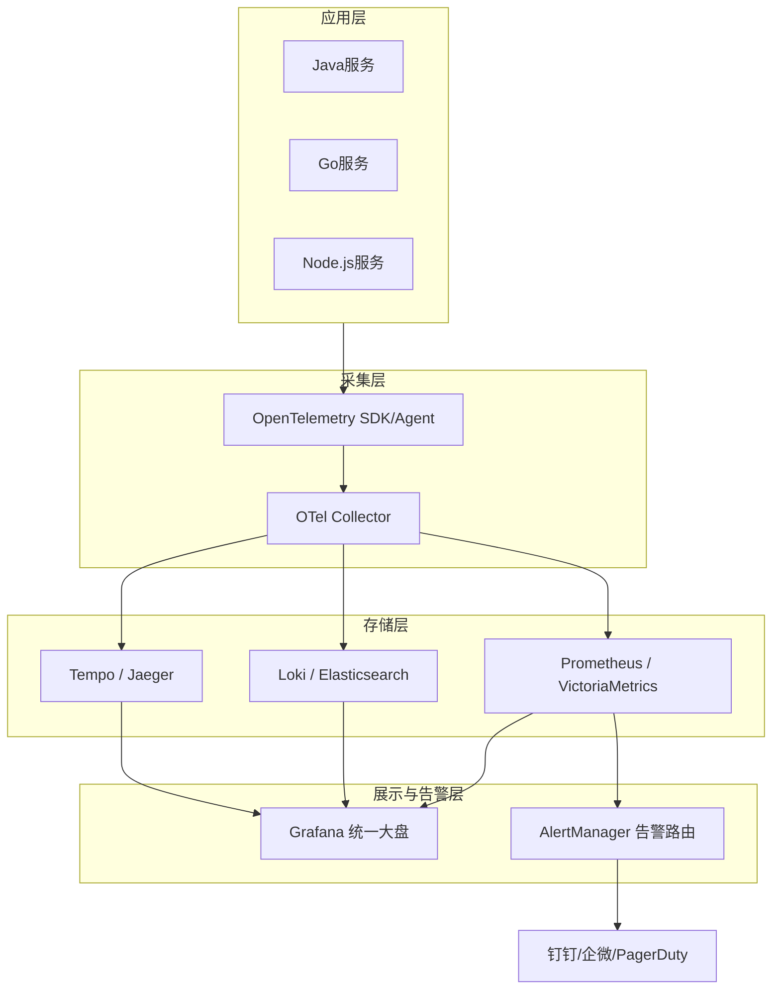

**各层的职责：**

| 层次 | 职责 | 关键组件 |
|------|------|----------|
| **应用层** | 产生原始遥测数据 | 业务应用、中间件 |
| **采集层** | 数据采集、处理、转发 | OTel SDK、OTel Collector、各类Exporter |
| **存储层** | 持久化存储遥测数据 | Prometheus、Loki、Tempo |
| **展示告警层** | 可视化、告警分发 | Grafana、AlertManager |

---

## 4 Metrics技术选型深度解析

### 4.1 Prometheus：CNCF的监控标准

#### Prometheus的工作原理

Prometheus采用**Pull（拉取）模式**，定期主动去抓取各个目标的指标数据。

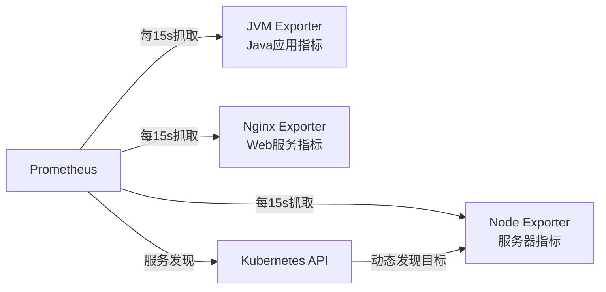

**Pull模式的优势：**
- 采集时间统一，便于数据对比
- Prometheus主动控制采集频率
- 被采集目标无需主动推送，减少耦合

**常用Exporter生态：**

```
node_exporter       → 服务器基础指标（CPU/Memory/Disk/Network）
kube-state-metrics  → Kubernetes资源状态（Pod/Deployment/Node）
blackbox_exporter   → 网络探测（HTTP/TCP/ICMP可用性检测）
mysqld_exporter     → MySQL数据库指标
redis_exporter      → Redis指标
kafka_exporter      → Kafka消费积压等指标
```

#### PromQL：Prometheus查询语言

PromQL是Prometheus的核心竞争力，支持强大的时序数据聚合分析。

**常用PromQL示例：**

```promql
# 计算过去5分钟的HTTP请求速率
rate(http_requests_total[5m])

# 计算各服务的错误率（按服务名分组）
sum(rate(http_requests_total{status=~"5.."}[5m])) by (service)
/
sum(rate(http_requests_total[5m])) by (service)

# P99接口响应时间（Histogram分位数）
histogram_quantile(0.99,
  sum(rate(http_request_duration_seconds_bucket[5m])) by (le, service)
)

# 内存使用率
(node_memory_MemTotal_bytes - node_memory_MemAvailable_bytes)
/ node_memory_MemTotal_bytes * 100
```

#### Prometheus的局限性

| 局限 | 具体问题 |
|------|----------|
| **长期存储弱** | 默认本地存储，建议保留15天内数据 |
| **单机扩展瓶颈** | 单个Prometheus实例处理能力有限 |
| **高可用复杂** | 原生不支持HA，需要借助Thanos/VictoriaMetrics |
| **跨集群查询困难** | 多个Kubernetes集群需要额外方案聚合 |

---

### 4.2 VictoriaMetrics：高性能时序数据库

#### 为什么选择VictoriaMetrics

VictoriaMetrics是俄罗斯团队开发的高性能时序数据库，近年来在国内外大规模应用中得到广泛认可。

**核心优势：**

```
存储压缩率：比Prometheus高5-10倍
  → 相同数据，VictoriaMetrics仅需1/5的磁盘空间

内存占用：比Prometheus低3-5倍
  → 1000万时间序列，VictoriaMetrics约需4GB内存

写入性能：单节点支持每秒数百万指标写入
  → 适合超大规模监控场景

长期存储：原生支持，无需额外组件
  → 可直接保留1年甚至更长时间的数据

兼容性：完全兼容Prometheus API和PromQL
  → 无缝替换，无需修改Grafana Dashboard
```

#### VictoriaMetrics架构

**单机模式（适合中等规模）：**

```
VictoriaMetrics Single Node
  ├── HTTP API（兼容Prometheus接口）
  ├── 内置数据压缩存储
  └── MetricsQL（PromQL超集）
```

**集群模式（适合大规模）：**

```
VictoriaMetrics Cluster
  ├── vminsert（写入层，无状态，可水平扩展）
  ├── vmselect（查询层，无状态，可水平扩展）
  └── vmstorage（存储层，有状态，数据分片）
```

---

### 4.3 Thanos：Prometheus的高可用方案

Thanos是解决Prometheus单机局限性的标准方案，通过在Prometheus之上添加组件，实现：

```
核心能力：
  1. 全局查询视图：跨多个Prometheus实例统一查询
  2. 长期存储：将数据归档到对象存储（S3/OSS/MinIO）
  3. 高可用：多个Prometheus实例数据去重合并
  4. 数据降采样：长期数据自动降分辨率，节省存储

架构组件：
  Thanos Sidecar    → 每个Prometheus旁边的代理
  Thanos Query      → 统一查询入口
  Thanos Store      → 从对象存储读取历史数据
  Thanos Compactor  → 数据压缩和降采样
  Thanos Ruler      → 集中化告警规则
```

---

### 4.4 Metrics技术选型决策

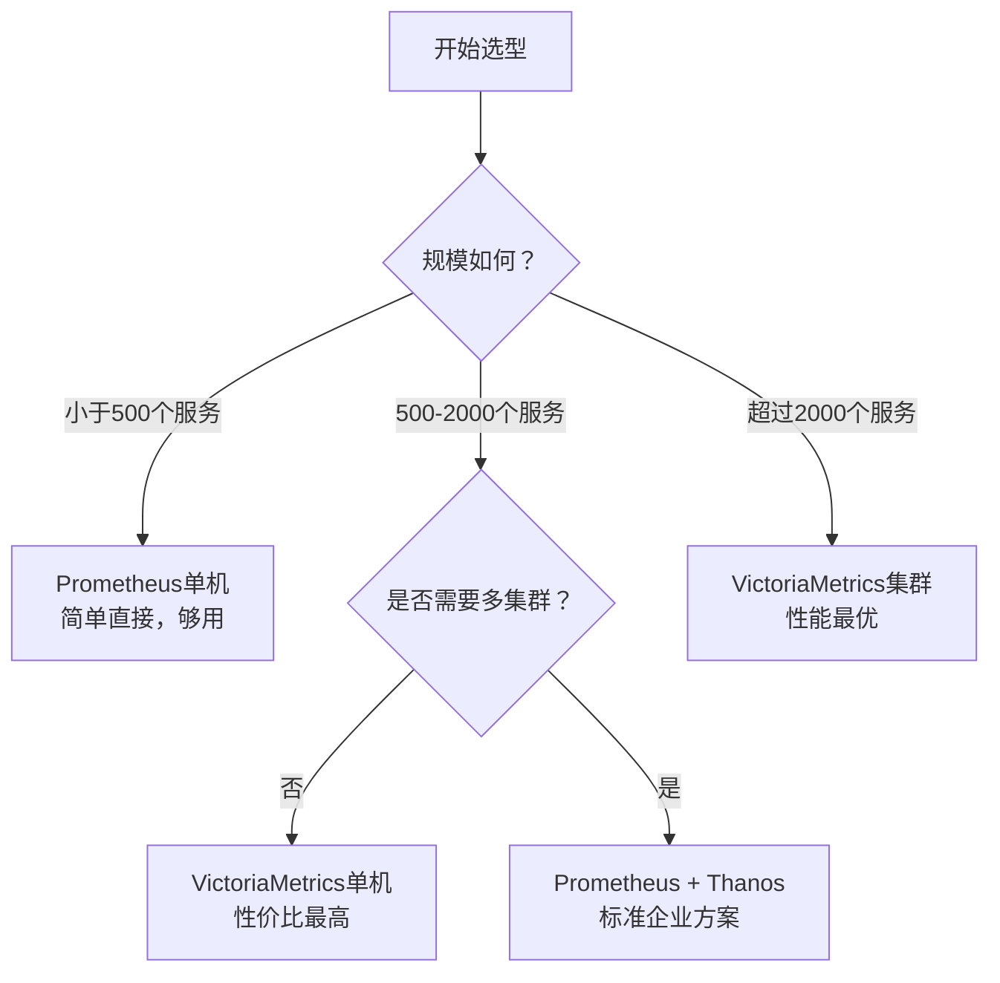

| 方案 | 适合规模 | 成本 | 运维复杂度 |
|------|----------|------|------------|
| Prometheus单机 | 中小团队，<500服务 | 低 | 简单 |
| Prometheus + Thanos | 大型企业，多集群 | 中 | 复杂 |
| VictoriaMetrics单机 | 中大型，单集群 | 低 | 简单 |
| VictoriaMetrics集群 | 超大规模，PB级数据 | 中 | 中等 |

---

## 5 日志平台技术选型深度解析

### 5.1 ELK Stack：功能最强的日志平台

#### ELK架构解析

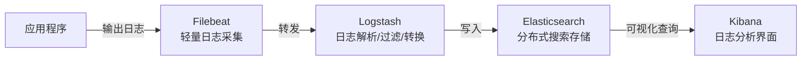

**各组件详解：**

```
Filebeat（采集）：
  → 轻量级Go程序，资源占用极低
  → 支持多种输入：文件、Kafka、Redis
  → 内置背压机制，不会压垮下游

Logstash（处理）：
  → 强大的数据管道，支持200+插件
  → Grok模式解析非结构化日志
  → 支持数据增强、字段转换、条件路由

Elasticsearch（存储）：
  → 基于Lucene的分布式搜索引擎
  → 支持全文检索、聚合分析
  → 近实时查询（NRT，约1秒延迟）

Kibana（展示）：
  → Discover：日志搜索和浏览
  → Dashboard：指标可视化
  → Lens：拖拽式图表创建
  → Alerting：基于日志的告警
```

#### ELK的优缺点

**优点：**
- 功能最完整，搜索能力业界顶尖
- 支持复杂的全文检索和聚合分析
- 生态完善，Beats家族覆盖各类数据源
- APM、SIEM等扩展能力丰富

**缺点：**
- **资源消耗极高**：Elasticsearch JVM堆内存通常需要32GB+
- **运维复杂**：集群管理、索引生命周期、分片策略都需要专业知识
- **成本高昂**：大规模日志场景存储成本惊人
- **写入放大**：Elasticsearch为了检索性能，写入成本高

---

### 5.2 EFK架构：更轻量的选择

EFK用Fluentd/FluentBit替代Logstash，在Kubernetes环境中更为流行。

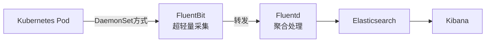

**FluentBit vs Logstash对比：**

| 维度 | Logstash | FluentBit |
|------|----------|-----------|
| 语言 | JVM（Java） | C语言 |
| 内存占用 | 500MB+ | 450KB |
| CPU占用 | 较高 | 极低 |
| Kubernetes友好度 | 一般 | 非常好 |
| 插件生态 | 非常丰富 | 较丰富 |

---

### 5.3 Loki：专为云原生设计的日志系统

#### Loki的设计哲学

Loki由Grafana Labs开发，其核心设计理念用一句话概括：

> **像Prometheus一样索引日志，而不是索引日志内容。**

```
传统日志（Elasticsearch）的索引方式：
  → 对日志内容的每个词建立倒排索引
  → 查询极快，但存储成本极高

Loki的索引方式：
  → 只对Label（标签）建立索引
  → 日志内容以压缩块存储在对象存储
  → 存储成本比ES低10倍以上
  → 代价：全文搜索时需要扫描日志块
```

#### Loki的架构

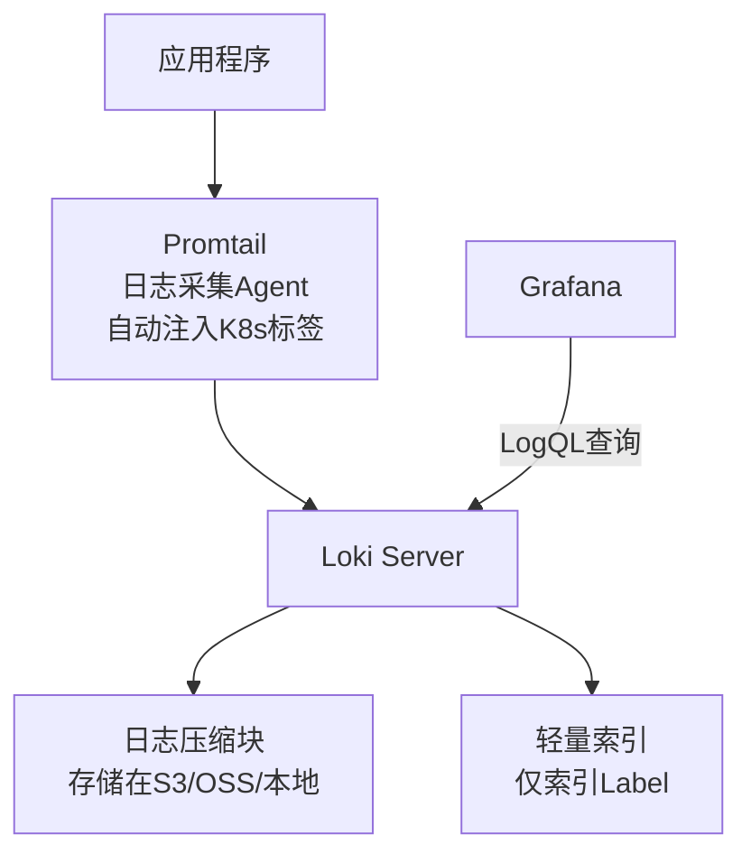

#### LogQL查询语言

```logql
# 基本查询：查看order-service的错误日志
{service="order-service", level="error"}

# 过滤包含特定关键词的日志
{service="order-service"} |= "Redis"

# 按TraceId精确查找
{service="payment-service"} | json | traceId="abc123"

# 统计每分钟错误日志数量（Log Metric）
sum(rate({service="order-service", level="error"}[1m]))

# 提取字段并计算平均响应时间
{service="order-service"} | json | line_format "{{.duration}}"
  | unwrap duration | avg_over_time[5m]
```

#### Loki优缺点

| 维度 | Loki | Elasticsearch |
|------|------|---------------|
| 存储成本 | ⭐⭐⭐⭐⭐ 极低 | ⭐⭐ 较高 |
| 全文搜索 | ⭐⭐⭐ 支持但慢 | ⭐⭐⭐⭐⭐ 极快 |
| 运维复杂度 | ⭐⭐⭐⭐⭐ 简单 | ⭐⭐ 复杂 |
| Grafana集成 | ⭐⭐⭐⭐⭐ 原生 | ⭐⭐⭐ 需配置 |
| 日志解析能力 | ⭐⭐⭐ 中等 | ⭐⭐⭐⭐⭐ 强大 |
| 云原生友好 | ⭐⭐⭐⭐⭐ 非常好 | ⭐⭐⭐ 一般 |

---

### 5.4 日志平台选型建议

| 场景 | 推荐方案 | 原因 |
|------|----------|------|
| **云原生/Kubernetes环境** | Loki | 天然集成，成本极低 |
| **需要复杂全文检索** | Elasticsearch | 搜索能力无可替代 |
| **安全审计/合规场景** | Elasticsearch | 支持精细权限控制和审计 |
| **成本敏感的中小团队** | Loki | 存储成本是ES的1/10 |
| **大数据日志分析** | ELK + Hadoop | 离线分析能力强 |

---

## 6 链路追踪技术选型深度解析

### 6.1 SkyWalking：国内最流行的APM

SkyWalking由华为工程师吴晟创建，目前是Apache顶级项目，在国内企业中有极高的普及率。

#### SkyWalking架构

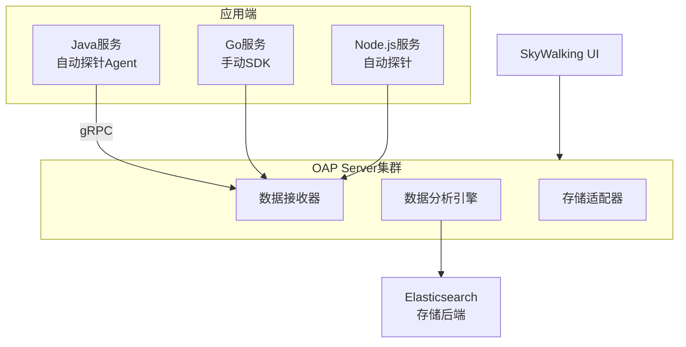

**SkyWalking的核心优势：**

```
1. Java生态覆盖最全：
   → 支持Spring Boot、Dubbo、MyBatis、Redis、MySQL等300+插件
   → 零代码侵入，通过-javaagent自动注入

2. 服务拓扑图：
   → 自动生成服务依赖关系图
   → 直观展示微服务间的调用关系

3. 性能剖析：
   → 无需修改代码，对线程栈进行持续采样
   → 定位方法级别的性能瓶颈

4. 告警能力：
   → 内置告警规则，支持Webhook通知
```

---

### 6.2 Jaeger：CNCF的链路追踪标准

Jaeger由Uber开源，是CNCF的毕业项目，也是云原生环境中的主流选择。

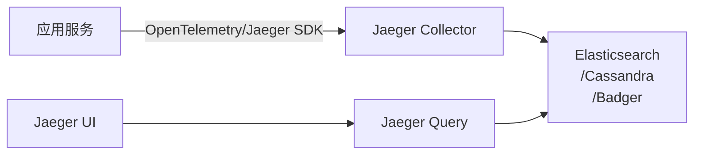

**Jaeger的特点：**
- 原生支持OpenTracing和OpenTelemetry标准
- Kubernetes原生部署，Operator支持良好
- 查询界面专注于Trace分析，简洁高效
- 社区活跃，CNCF背书

---

### 6.3 Tempo：成本最低的Trace存储

Tempo是Grafana Labs开发的链路追踪后端，核心理念与Loki类似：

> **只存储，不索引。通过TraceId直接检索Trace。**

```
Tempo的存储模型：
  → Trace数据以压缩块存储在对象存储（S3/OSS/MinIO）
  → 不建立任何索引
  → 通过TraceId可直接查询（O(1)查找）
  → 存储成本是Elasticsearch的1/15以上

使用方式：
  → 通常与Loki/Prometheus联动
  → 在Grafana中，从日志的TraceId直接跳转到Trace详情
  → 从Metrics的告警中，直接找到对应时间段的慢Trace
```

**Tempo的局限性：**
- 不支持按Service Name、Duration等条件搜索Trace
- 必须知道TraceId才能查询具体Trace
- 需要配合其他数据源（如Loki）使用

---

### 6.4 Tracing方案选型对比

| 方案 | 推荐指数 | 适用场景 |
|------|----------|----------|
| **SkyWalking** | ★★★★☆ | Java为主的团队，需要完整APM能力 |
| **Jaeger** | ★★★★ | 云原生团队，多语言混合，追求标准化 |
| **Tempo** | ★★★★★ | 已使用Grafana生态，追求低成本 |
| **Zipkin** | ★★★ | 轻量级场景，学习和POC使用 |

---

## 7 OpenTelemetry——统一可观测标准

### 7.1 为什么需要OpenTelemetry

#### 碎片化的历史问题

在OTel出现之前，可观测性工具生态极度碎片化：

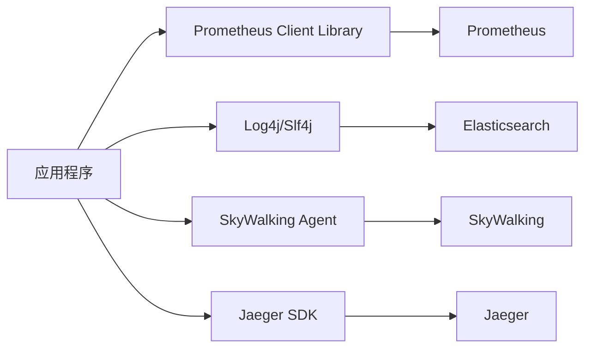

**问题：**
- 每个工具有自己的SDK，应用代码被大量侵入
- 切换工具需要修改业务代码
- 三大支柱数据格式不统一，无法关联分析
- 厂商锁定严重

#### OTel带来的统一

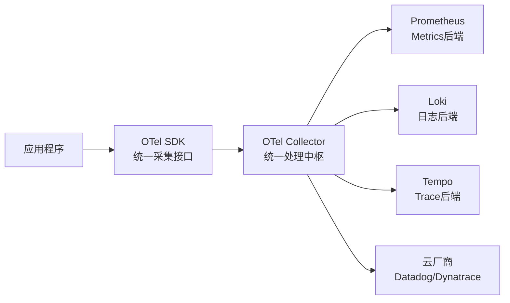

**OTel的价值：**
- **标准化**：一套API，统一三大支柱数据格式
- **解耦**：业务代码与可观测后端完全解耦
- **灵活**：后端可以任意替换，无需修改应用代码
- **自动化**：大量框架自动埋点，零代码侵入

---

### 7.2 OTel核心组件详解

#### API层（规范接口）

```java
// OTel API示例：手动创建Span
Tracer tracer = GlobalOpenTelemetry.getTracer("order-service");

Span span = tracer.spanBuilder("createOrder")
    .setAttribute("userId", userId)
    .setAttribute("orderId", orderId)
    .startSpan();

try (Scope scope = span.makeCurrent()) {
    // 业务逻辑
    orderRepository.save(order);
    span.addEvent("order.saved");
} catch (Exception e) {
    span.recordException(e);
    span.setStatus(StatusCode.ERROR);
    throw e;
} finally {
    span.end();
}
```

#### SDK层（实现层）

SDK负责实际的数据采集、批处理、采样和导出：

```yaml
# OTel Java Agent配置示例（application.yaml）
otel:
  service:
    name: order-service
  exporter:
    otlp:
      endpoint: http://otel-collector:4317
  traces:
    sampler:
      type: parentbased_traceidratio
      arg: "0.1"  # 采样10%
  metrics:
    export:
      interval: 15s
```

#### Collector层（数据处理中枢）

OTel Collector是整个架构的核心枢纽：

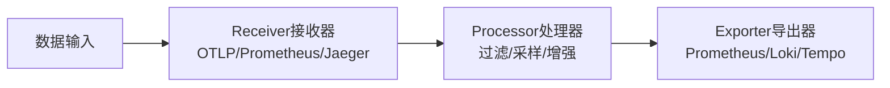

**Collector配置示例：**

```yaml
# otel-collector-config.yaml
receivers:
  otlp:                          # 接收来自应用的OTLP数据
    protocols:
      grpc:
        endpoint: 0.0.0.0:4317
      http:
        endpoint: 0.0.0.0:4318
  prometheus:                    # 抓取Prometheus格式指标
    config:
      scrape_configs:
        - job_name: 'kubernetes-pods'
          kubernetes_sd_configs:
            - role: pod

processors:
  batch:                         # 批量处理，提升吞吐
    timeout: 1s
    send_batch_size: 1024
  memory_limiter:                # 内存限制，防止OOM
    limit_mib: 512
  resource:                      # 添加资源属性
    attributes:
      - key: cluster
        value: production
        action: insert
  tail_sampling:                 # 尾部采样（保留所有错误和慢请求）
    policies:
      - name: error-policy
        type: status_code
        status_code: {status_codes: [ERROR]}
      - name: slow-policy
        type: latency
        latency: {threshold_ms: 1000}

exporters:
  prometheusremotewrite:         # 导出Metrics到VictoriaMetrics
    endpoint: http://victoria-metrics:8428/api/v1/write
  loki:                          # 导出日志到Loki
    endpoint: http://loki:3100/loki/api/v1/push
  otlp:                          # 导出Trace到Tempo
    endpoint: http://tempo:4317

service:
  pipelines:
    traces:
      receivers: [otlp]
      processors: [memory_limiter, batch, tail_sampling]
      exporters: [otlp]
    metrics:
      receivers: [otlp, prometheus]
      processors: [memory_limiter, batch, resource]
      exporters: [prometheusremotewrite]
    logs:
      receivers: [otlp]
      processors: [memory_limiter, batch]
      exporters: [loki]
```

---

### 7.3 Spring Boot接入OTel实践

**方式一：使用Java Agent（推荐，零代码侵入）**

```bash
# 启动命令添加javaagent参数
java -javaagent:opentelemetry-javaagent.jar \
     -Dotel.service.name=order-service \
     -Dotel.exporter.otlp.endpoint=http://otel-collector:4317 \
     -Dotel.traces.sampler=parentbased_traceidratio \
     -Dotel.traces.sampler.arg=0.1 \
     -jar order-service.jar
```

**OTel Java Agent自动支持的框架（部分）：**

```
Spring MVC / Spring WebFlux / Spring Boot
gRPC / Dubbo
HttpClient / OkHttp / Feign
JDBC / MyBatis / Hibernate
Redis (Jedis/Lettuce)
Kafka / RabbitMQ
Elasticsearch Client
```

**Kubernetes中的Deployment配置：**

```yaml
apiVersion: apps/v1
kind: Deployment
metadata:
  name: order-service
spec:
  template:
    spec:
      containers:
        - name: order-service
          image: order-service:v1.0
          env:
            - name: OTEL_SERVICE_NAME
              value: "order-service"
            - name: OTEL_EXPORTER_OTLP_ENDPOINT
              value: "http://otel-collector.monitoring:4317"
            - name: OTEL_RESOURCE_ATTRIBUTES
              value: "deployment.environment=production,k8s.namespace=$(POD_NAMESPACE)"
          volumeMounts:
            - name: otel-agent
              mountPath: /otel-agent
      initContainers:
        - name: otel-agent-init
          image: ghcr.io/open-telemetry/opentelemetry-operator/autoinstrumentation-java:latest
          command: ["cp", "/javaagent.jar", "/otel-agent/javaagent.jar"]
          volumeMounts:
            - name: otel-agent
              mountPath: /otel-agent
      volumes:
        - name: otel-agent
          emptyDir: {}
```

---

## 8 企业级可观测平台架构设计

### 8.1 中小企业方案（50人以下团队）

**场景特点：**
- 服务数量：20-100个
- 日志量：每天10GB以内
- Trace量：每天1000万以内
- 团队规模：1-2人运维

**推荐架构：**

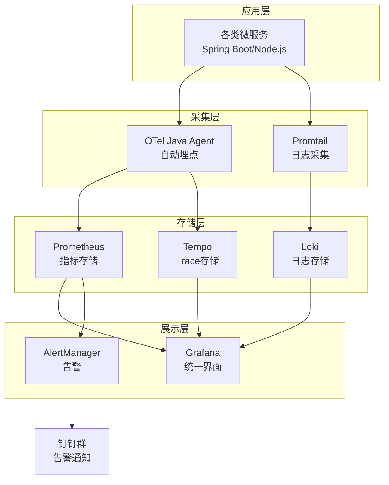

**资源估算：**

```
Prometheus:  4核8GB，200GB SSD
Loki:        4核8GB，500GB SSD（或对接OSS）
Tempo:       4核8GB，对接OSS（成本极低）
Grafana:     2核4GB
AlertManager:1核2GB

总成本估算：约6-8台云服务器，月均2000-4000元
```

---

### 8.2 大型互联网方案（500人以上团队）

**场景特点：**
- 服务数量：500-2000个
- 日志量：每天1TB以上
- Trace量：每天100亿以上
- 多个Kubernetes集群
- 需要数据保留180天+

**推荐架构：**

```mermaid
graph TD
    subgraph Multi_Cluster[多Kubernetes集群]
        Cluster1[生产集群K8s-Prod]
        Cluster2[测试集群K8s-Staging]
        Cluster3[海外集群K8s-US]
    end

    subgraph Collection[采集层]
        Collector1[OTel Collector\nDaemonSet模式\n每个节点部署]
        Collector2[OTel Collector Gateway\n集中处理]
    end

    subgraph Storage[存储层 独立集群]
        VM[VictoriaMetrics Cluster\nvminsert x3 + vmstorage x6]
        LokiCluster[Loki Cluster\n日志写入Kafka→Loki\n对象存储OSS]
        TempoCluster[Tempo\n直接写OSS\n成本极低]
    end

    subgraph Query[查询层]
        Grafana2[Grafana\n多数据源聚合]
        API[统一查询API\n权限控制]
    end

    Cluster1 --> Collector1
    Cluster2 --> Collector1
    Cluster3 --> Collector1
    Collector1 --> Collector2
    Collector2 --> VM
    Collector2 --> LokiCluster
    Collector2 --> TempoCluster
    VM --> Grafana2
    LokiCluster --> Grafana2
    TempoCluster --> Grafana2
```

**关键设计决策：**

```
1. OTel Collector分层部署：
   - 节点级DaemonSet：轻量处理，快速转发
   - Gateway层：集中做尾部采样、数据脱敏、路由

2. Kafka作为日志缓冲：
   - 削峰填谷，避免Loki直接承受突发写入
   - 支持日志数据多路消费（实时告警 + 存储）

3. VictoriaMetrics集群模式：
   - 写入层vminsert无状态，水平扩展
   - 存储层vmstorage数据分片，支持PB级数据

4. 对象存储OSS用于冷数据：
   - Tempo所有数据存OSS（成本最低）
   - Loki热数据在本地SSD，冷数据迁移OSS
   - VictoriaMetrics历史数据导出OSS
```

---

### 8.3 金融行业特殊方案

金融行业在监管合规方面有特殊要求：

```
核心要求：
  1. 数据保留：监控数据至少保留180天，部分监管要求保留5年
  2. 高可用：RTO < 30分钟，RPO < 1小时
  3. 多数据中心：同城双活，异地容灾
  4. 数据安全：敏感字段脱敏，访问权限严格控制
  5. 合规审计：所有查询操作需留存审计日志

特殊设计：
  → 日志脱敏Processor：在OTel Collector中，对手机号、身份证等字段正则替换
  → 多级存储策略：近7天SSD → 7-90天HDD → 90天+磁带/归档存储
  → 异地数据同步：主数据中心→备数据中心实时同步（Kafka镜像/VM复制）
  → RBAC权限：Grafana配置团队级数据隔离，DBA只能看数据库指标
```

---

## 9 告警体系设计

### 9.1 告警分级体系

科学的告警分级是避免告警疲劳的关键：

| 级别 | 名称 | 含义 | 通知方式 | 响应时间 |
|------|------|------|----------|----------|
| **P1** | 紧急 | 核心业务完全不可用，影响大量用户 | 电话+短信+群@所有人 | 5分钟内响应 |
| **P2** | 高 | 核心功能受损，部分用户受影响 | 企微/钉钉群 | 15分钟内响应 |
| **P3** | 中 | 非核心功能异常，有降级措施 | 企微/钉钉通知 | 1小时内响应 |
| **P4** | 低 | 潜在风险，系统仍正常运行 | 工单系统 | 工作时间处理 |

**告警规则示例（Prometheus规则文件）：**

```yaml
groups:
  - name: payment_service
    rules:
      # P1：支付服务错误率超过5%
      - alert: PaymentServiceHighErrorRate_P1
        expr: |
          sum(rate(http_requests_total{service="payment-service",status=~"5.."}[1m]))
          /
          sum(rate(http_requests_total{service="payment-service"}[1m]))
          > 0.05
        for: 2m    # 持续2分钟才告警，避免瞬时抖动
        labels:
          severity: P1
          team: payment
        annotations:
          summary: "支付服务错误率过高：{{ $value | humanizePercentage }}"
          description: "支付服务在过去2分钟内错误率超过5%，请立即排查"
          runbook: "https://wiki.company.com/runbook/payment-error"

      # P2：P99延迟超过1秒
      - alert: PaymentServiceHighLatency_P2
        expr: |
          histogram_quantile(0.99,
            sum(rate(http_request_duration_seconds_bucket{service="payment-service"}[5m]))
            by (le)
          ) > 1.0
        for: 5m
        labels:
          severity: P2
          team: payment
        annotations:
          summary: "支付服务P99延迟过高：{{ $value }}s"
```

---

### 9.2 告警风暴治理

**问题场景：**

```
数据库宕机
   ↓
依赖该数据库的10个微服务全部告警
   ↓
每个微服务触发5条告警规则
   ↓
产生50条告警，全部通知到群里
   ↓
工程师无从下手，告警疲劳
```

**解决方案：AlertManager的分组、抑制、沉默**

```yaml
# alertmanager.yaml
route:
  # 告警分组：同一个service的告警合并成一条通知
  group_by: ['service', 'severity']
  group_wait: 30s        # 等待30秒收集同组告警
  group_interval: 5m     # 同组告警5分钟内只通知一次
  repeat_interval: 4h    # 持续告警4小时内不重复通知

inhibit_rules:
  # 告警抑制：当P1告警存在时，抑制相同服务的P2/P3告警
  - source_match:
      severity: 'P1'
    target_match_re:
      severity: 'P2|P3'
    equal: ['service']   # 必须是同一个服务

  # 告警抑制：数据库告警触发时，抑制依赖服务的连接失败告警
  - source_match:
      alertname: 'DatabaseDown'
    target_match:
      alertname: 'ServiceConnectionError'
    equal: ['database']
```

---

### 9.3 基于SLO的告警：真正面向用户的监控

传统告警关注"系统指标"，SLO告警关注"用户体验"：

```
SLI（Service Level Indicator）：用于衡量服务质量的具体指标
  例：支付成功率 = 成功支付次数 / 总支付次数

SLO（Service Level Objective）：服务质量目标
  例：支付成功率 ≥ 99.9%（月度）

SLA（Service Level Agreement）：服务等级协议（法律约束）
  例：若月度可用率低于99.9%，赔偿客户X%服务费
```

**SLO告警配置示例：**

```yaml
# 错误预算消耗告警
# 30天SLO=99.9%，错误预算 = 30天 × 0.1% = 43.2分钟

- alert: SLO_ErrorBudgetBurn_Fast
  # 过去1小时的错误率，如果按此速度持续，14.4小时内耗尽全月错误预算
  expr: |
    (1 - sum(rate(http_requests_total{status!~"5..",service="payment-service"}[1h]))
        /sum(rate(http_requests_total{service="payment-service"}[1h])))
    > 0.001 * 14.4
  labels:
    severity: P1
  annotations:
    summary: "支付服务SLO错误预算快速消耗，当前速度将在14.4小时内耗尽本月预算"
```

---

## 10 可观测平台成本优化

### 10.1 Metrics成本优化

**问题：高基数Label导致时间序列爆炸**

```
错误示例：
http_requests_total{
  userId="10000001",    ← 百万级用户ID，产生百万条时间序列
  orderId="88888888",  ← 亿级订单ID，产生亿条时间序列！
}

正确做法：Metrics不应携带高基数业务ID
http_requests_total{
  service="order-service",
  endpoint="/api/orders",
  method="POST",
  status="200"
}
```

**时间序列基数优化策略：**

```
1. Label设计原则：
   → Label的值域应该是有限的（建议<1000个唯一值）
   → 排查高基数Label：promtool tsdb analyze
   → 删除不必要的Label：MetricRelabelConfigs

2. 指标数量控制：
   → 定期清理无人使用的指标（Recording Rules+查询日志分析）
   → 设置每个应用的指标上限

3. 存储优化：
   → VictoriaMetrics压缩率是Prometheus的5倍
   → 按时间分层：近期数据高精度，历史数据降采样
```

---

### 10.2 日志成本优化

**日志量往往是可观测平台最大的成本来源。**

```
优化策略1：日志分级，减少无效日志
  → 生产环境关闭DEBUG级别日志
  → 使用动态日志级别（无需重启切换级别）
  → 对于高频但无价值的日志，使用采样输出

优化策略2：热冷数据分层存储
  → 最近7天：SSD（快速查询）
  → 7-30天：HDD（可接受的查询速度）
  → 30-180天：对象存储OSS（极低成本，查询较慢）
  → 180天以上：归档存储（几乎不查询，最低成本）

Loki的分层配置示例：
  schema_config:
    configs:
      - from: 2024-01-01
        store: boltdb-shipper
        object_store: s3        ← 所有数据存OSS
        schema: v12
        index:
          prefix: index_
          period: 24h

优化策略3：日志压缩
  Loki使用Snappy压缩，日志压缩率通常达到10:1
  原始1TB日志 → 约100GB存储

成本对比：
  ELK存储1TB日志/天，30天 ≈ 30TB SSD ≈ 约15万元/月
  Loki存储1TB日志/天，30天 ≈ 3TB OSS ≈ 约300元/月
  成本差异：500倍！
```

---

### 10.3 链路追踪成本优化

**采样策略是Trace成本控制的核心：**

```
全量采样（Bad Practice）：
  → 1000 QPS × 86400秒 × 每个Trace 10个Span × 每个Span 1KB
  → = 864GB/天，成本极高

智能采样策略（Best Practice）：
  1. 错误请求：100%采样（错误必须保留）
  2. 慢请求（>1秒）：100%采样
  3. 正常请求：1%采样

实际成本估算（1000 QPS场景）：
  → 错误请求：假设0.1%错误率，= 1 QPS，100%采样 → 86400个Trace/天
  → 慢请求：假设1%慢请求，= 10 QPS，100%采样 → 864000个Trace/天
  → 正常请求：989 QPS × 1% = 9.89 QPS → 854496个Trace/天
  → 总计：约180万Trace/天
  → 存储：约1.8GB/天（远低于全量的864GB）
```

---

## 11 最佳实践与避坑指南

### 避坑一：不要把日志当数据库

```
错误做法：
  // 把订单详情写入日志，然后通过日志查询来统计
  log.info("订单创建成功，金额：{}, 商品数：{}, 用户：{}", amount, count, userId);
  // 然后用ELK聚合分析每日销售额...

正确做法：
  → 业务统计数据写入数据库或数据仓库
  → 日志只记录运行状态和错误事件
  → 日志系统承担"诊断"职能，不是"分析"职能
```

### 避坑二：避免高基数标签

```
错误：
  metrics.counter("api.calls")
    .tag("userId", userId)    // 百万级用户，时间序列爆炸
    .increment();

正确：
  metrics.counter("api.calls")
    .tag("endpoint", endpoint)   // 有限的端点集合
    .tag("status", status)       // 有限的状态码
    .increment();
```

### 避坑三：TraceId必须全链路透传

```
常见问题：
  → 异步任务丢失TraceId（新线程没有继承上下文）
  → 消息队列消费时TraceId丢失
  → 第三方HTTP调用没有传播TraceId Header

解决方案：
  → 使用OTel的Context Propagation机制
  → 线程池使用OTel的ContextPropagatingExecutorService包装
  → MQ发送时在消息Header中携带traceparent字段

// 正确的异步上下文传播示例
ExecutorService executor = Executors.newFixedThreadPool(10);
// 用OTel包装，自动传播Trace上下文
ExecutorService otelExecutor = Context.taskWrapping(executor);
otelExecutor.submit(() -> {
    // 这里自动继承父Span的TraceId
    processOrder(orderId);
});
```

### 避坑四：日志必须结构化且包含TraceId

```
// 错误：无法与Trace关联
log.error("支付失败");

// 正确：结构化+TraceId，可以从Grafana一键跳转Trace
log.error("支付失败",
    kv("traceId", Span.current().getSpanContext().getTraceId()),
    kv("orderId", orderId),
    kv("errorCode", e.getCode()),
    kv("duration", duration)
);
```

### 避坑五：告警数量要与团队处理能力匹配

```
告警原则：
  → 每个告警必须是可操作的（Actionable）
  → 每个告警必须有对应的处理手册（Runbook）
  → 告警不应超过团队的消化能力（通常每天P1+P2不超过5条）

如何评估告警质量：
  → 告警准确率：告警触发后，真正需要人工干预的比例（目标>80%）
  → 告警及时性：从问题发生到告警触发的延迟（P1目标<1分钟）
  → MTTA（平均应答时间）：团队响应告警的平均时间
  → MTTR（平均修复时间）：从告警到修复完成的平均时间
```

---

## 12 未来趋势

### 12.1 OpenTelemetry统一天下

OTel已成为可观测性领域事实上的标准，主要云厂商（AWS/GCP/Azure/阿里云）均已全面支持。未来趋势：

- **Profiles（性能剖析）**成为OTel第四支柱，统一性能数据格式
- 更多框架内置OTel支持，零配置开箱即用
- 厂商竞争转向后端能力，采集层高度标准化

### 12.2 eBPF：无侵入可观测性的未来

eBPF（Extended Berkeley Packet Filter）允许在Linux内核中安全地运行沙盒程序，无需修改内核代码或应用代码：

```mermaid
graph LR
    App[应用程序] -->|系统调用| Kernel[Linux内核]
    Kernel -->|eBPF Hook| eBPF[eBPF程序\n内核态执行]
    eBPF -->|采集数据| OTel[OTel/Cilium\n数据输出]
    OTel --> Backend[可观测后端]
```

**eBPF的革命性价值：**

```
传统方式：在应用代码中加SDK/Agent
  → 需要重启应用，存在版本兼容问题
  → 无法观测内核行为

eBPF方式：在内核层直接观测所有行为
  → 零代码侵入，无需重启
  → 可以观测任何语言、任何框架
  → 能捕获网络包、系统调用、文件IO等底层行为

代表项目：
  Cilium     → Kubernetes网络+可观测性
  Pixie      → 自动化应用可观测（Google收购）
  Pyroscope  → 持续性能剖析
  Falco      → 基于eBPF的安全威胁检测
```

### 12.3 AIOps：智能运维

```
当前状态：
  告警 → 工程师分析 → 定位根因 → 手动修复

AIOps目标：
  告警 → AI分析根因 → AI推荐修复方案 → 人工确认 → 自动修复

主要技术方向：
  1. 异常检测：无需固定阈值，AI自动学习基线，发现异常波动
  2. 根因分析（RCA）：自动关联多维度数据，给出根因概率排名
  3. 预测性告警：在问题发生前预测风险，提前干预
  4. 自愈能力：对已知故障模式自动执行修复脚本

代表产品：
  Datadog AI Assistant
  Dynatrace Davis AI
  国内：腾讯云AIOps、阿里云可观测平台
```

### 12.4 可观测平台演进路线图

```mermaid
graph LR
    A[传统监控\n2010年代\n阈值告警] --> B[可观测性\n2020年代\n三大支柱]
    B --> C[智能可观测\n2025年代\nAI辅助分析]
    C --> D[自治运维\n2030年代\n自动检测+自动修复]
```

---

## 总结

### 一图看懂现代可观测平台

```mermaid
graph TD
    subgraph Application[应用层]
        App[微服务集群]
    end

    subgraph Collection[采集层]
        OTel[OpenTelemetry\n统一采集标准]
    end

    subgraph Pillars[三大支柱]
        M[📊 Metrics\nVictoriaMetrics]
        L[📄 Logs\nLoki]
        T[🔗 Traces\nTempo]
    end

    subgraph Platform[统一平台]
        Grafana[Grafana\n统一展示+告警]
    end

    App --> OTel
    OTel --> M
    OTel --> L
    OTel --> T
    M --> Grafana
    L --> Grafana
    T --> Grafana
```

---

### 推荐技术组合（2025-2026）

#### 🟢 中小团队（50人以下，<100个服务）

```
采集：OpenTelemetry Java Agent + Promtail
指标：Prometheus（单机）
日志：Loki
链路：Tempo
展示：Grafana
告警：AlertManager → 钉钉/企微

特点：全部开源，单集群部署，月均成本<5000元
```

#### 🔵 中大型企业（500人以下，100-1000个服务）

```
采集：OpenTelemetry Collector（Gateway模式）
指标：VictoriaMetrics（单机或小集群）
日志：Loki（对接OSS冷存储）
链路：Tempo（对接OSS）
展示：Grafana（多租户）
告警：AlertManager + 自研告警平台

特点：成本可控，支持多团队，数据保留90天
```

#### 🔴 大型互联网（500人以上，1000+个服务）

```
采集：OTel Collector（DaemonSet + Gateway分层）
指标：VictoriaMetrics集群（高可用）
日志：Loki集群 + Kafka缓冲（对接OSS）
链路：Tempo + 尾部采样
展示：Grafana Enterprise（多租户+RBAC）
告警：AlertManager + PagerDuty + 自研值班系统

特点：高可用，多集群，全球化，数据保留180天+
```

#### ☕ Java生态企业

```
采集：OpenTelemetry Java Agent（主推）
      SkyWalking Agent（备选，APM能力更强）
指标：Prometheus + VictoriaMetrics（长期存储）
日志：Loki
展示：Grafana

特点：Java框架自动探针覆盖率高，业务可见性强
```

#### ☁️ 云原生最佳实践

```
平台：Kubernetes + Cilium（网络+eBPF可观测）
采集：OpenTelemetry Operator（自动注入）
指标：VictoriaMetrics
日志：Loki
链路：Tempo
展示：Grafana
成本优化：Tempo+Loki全部对接OSS，长期保留成本极低
```

---

### 核心观点回顾

1. **可观测性 ≠ 监控**：监控发现已知问题，可观测性帮你探索未知问题
2. **三大支柱相互协同**：Metrics发现问题 → Trace定位链路 → Log确认根因
3. **OpenTelemetry是未来**：采集层标准化，避免厂商锁定，向任意后端导出
4. **成本控制靠架构**：合理采样、分层存储、Loki替代ES可节省99%日志成本
5. **告警质量 > 告警数量**：基于SLO的告警更贴近用户体验，优于基于阈值的告警
6. **结构化是基础**：结构化日志+TraceId关联，是三大支柱协同的前提

---

> **工具只是手段，理解系统行为才是目的。** 可观测平台建设不是一蹴而就的工程，而是随着业务和团队能力持续演进的过程。从最简单的Prometheus + Grafana开始，随着问题复杂度上升，逐步引入日志关联和链路追踪，才是最务实的落地路径。
