# 如何有效防止代码腐烂

>软件不会“突然”烂掉。它只是在一次又一次看似无害的妥协中，慢慢死去。

当团队开始害怕修改旧代码，当一个简单的需求变更需要触动几十个文件，当新人入职三个月仍无法独立提交——你所面对的从来不是某个程序员的水平问题，而是代码腐烂。它像生态系统的荒漠化，在不起眼的日常中侵蚀生产力根基。

<a name="2"></a>
## 一、什么是代码腐烂？——一个被低估的系统性风险

### 1.1 定义与本质

**代码腐烂（Code Rot / Software Rot）** 指软件系统在持续迭代过程中，由于缺乏有效的结构维护，代码质量逐步退化，导致系统越来越难以理解、修改和扩展的现象。

要真正理解代码腐烂，需要抓住三个本质特征：

**第一，腐烂是渐进的，不是突发的。** 没有哪一次提交会让系统"突然腐烂"。每一次妥协看起来都微不足道——一个 800 行的方法"下次再拆"，一个跨层调用"就这一次"，一个测试"先跳过"。腐烂是这些微小妥协的**复利效应**。这也正是它危险的地方：等你察觉时，往往已经积重难返。

**第二，腐烂是自发的，不腐烂才需要刻意投入。** 这是很多团队的认知盲区。他们默认"只要我们不故意写烂代码，代码就不会烂"。但事实恰恰相反——熵增是软件系统的默认方向。需求会变、人员会换、上下文会丢失，如果没有持续的外力（重构、评审、门禁）对抗混乱，系统必然走向无序。**维持整洁不是"不做什么"，而是"持续做什么"。**

**第三，腐烂的成本以指数增长，而非线性增长。** 混乱的代码不只让当前这一处难改，它还会污染周围的代码：调用者被迫适配它的怪异接口，新代码被迫模仿它的混乱风格，测试被迫绕开它的硬编码依赖。腐烂具有**传染性**。

### 1.2 腐烂的典型症状：如何识别？

腐烂在不同阶段有不同的信号。越早识别，治理成本越低：

| 维度 | 早期信号 | 晚期症状 |
|------|---------|---------|
| **可读性** | 方法超过 50 行，命名模糊 | 没有人能完整描述一个模块的职责 |
| **可修改性** | 改一个需求需要动 5 个文件 | 任何改动都可能引发"蝴蝶效应" |
| **可测试性** | 核心逻辑测试覆盖率低于 30% | 没有测试，没有人敢重构 |
| **依赖关系** | 循环依赖开始出现 | 模块边界完全模糊，牵一发动全身 |
| **交付速度** | 新需求开发时间超预期 20% | 团队速度下降 50%+，修 Bug 制造更多 Bug |
| **团队情绪** | "这块代码有点乱" | "这块代码别碰，碰了就出事" |

其中最值得警惕的是最后一行——**当团队中出现"禁区代码"（没人敢改的模块）时，腐烂已进入晚期**。禁区代码意味着：该模块的知识已经丢失，测试保护已经失效，团队对它只剩恐惧。而业务不会因为你恐惧就绕开它，最终结局往往是"推倒重写"——这是软件工程中成本最高、风险最大的决策。

### 1.3 腐烂的演化过程

一个典型系统从整洁到腐烂的过程通常经历三个阶段。理解这个过程，有助于你判断自己的系统处在哪个位置：

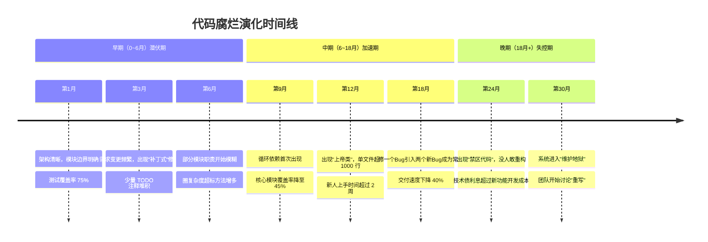

**潜伏期**的特点是：问题存在但不影响交付，团队普遍没有感知，这是治理成本最低的窗口期。**加速期**的特点是：问题开始影响交付速度，但团队往往把原因归结为"需求太多""人手不够"，而非代码质量。**失控期**的特点是：所有人都知道问题在哪，但没有人有能力（或勇气）解决。

### 1.4 危害的量化视角：破窗效应与理解成本

Martin Fowler 在《重构》中指出，腐烂的代码会让团队陷入**破窗效应（Broken Windows Theory）**：当工程师看到已经混乱的代码时，会本能地以同样混乱的方式添加代码——"这里本来就乱，我为什么要认真？"于是混乱加速累积，形成恶性循环。

从成本角度看，腐烂最大的隐性开销是**理解成本**。业界的多项研究表明，开发者阅读代码的时间与编写代码的时间之比约为 **10:1**。在整洁的系统里，理解一个模块可能需要 10 分钟；在腐烂的系统里，同样的理解可能需要半天，而且理解得还不一定对——理解错误又会引入新的 Bug。

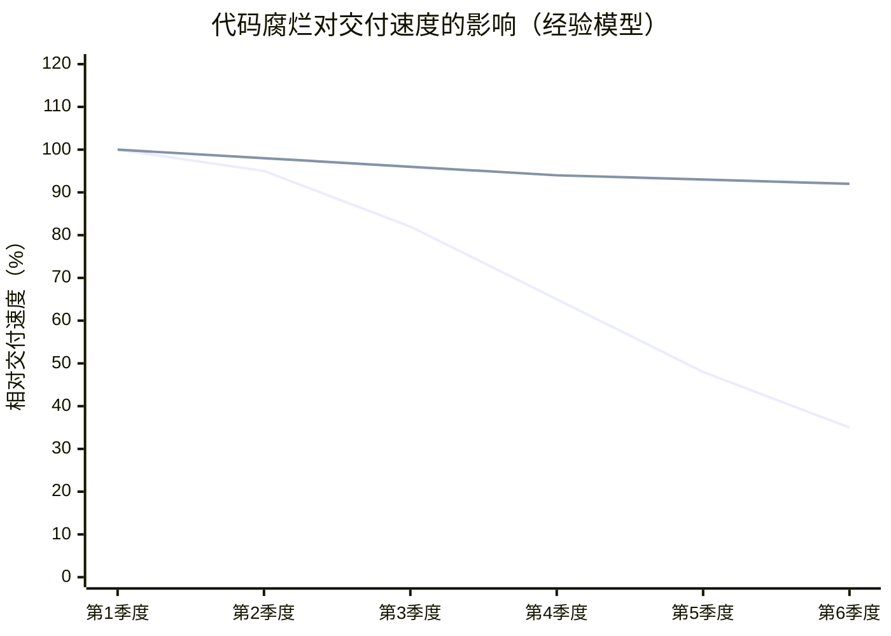

> 📌 红线为放任腐烂的团队，蓝线为持续执行防腐策略的团队。注意两个关键点：（1）前两个季度两者几乎无差异——这解释了为什么防腐投入很难在短期内被"看见"；（2）差距从第 3 季度开始拉开，到第 6 季度相差近 3 倍——防腐的收益是复利式的。

这张图也解释了一个常见的管理层困惑："我们以前跑得很快，为什么现在这么慢？"答案往往不是团队变懒了，而是**团队正在为过去两年的每一次质量妥协支付利息**。

---

<a name="2"></a>
## 二、腐烂的根因分析：五把钝刀

治病先寻因。代码腐烂不是某一个人的错，也不是某一次失误的结果，它是多个系统性因素长期叠加的产物。只有理解根因，防治策略才不会沦为"头痛医头"。

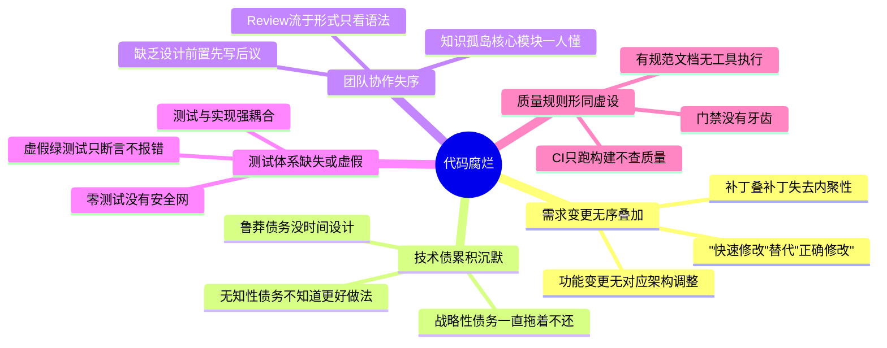

### 根因一：需求变更的无序叠加

需求变更本身无罪——软件（Software）的"Soft"就是指它应该易于改变。真正的问题在于：**需求在变，架构没跟着变**。

举个典型场景：系统最初设计时，"订单"只有一种类型。两年后，业务演化出了普通订单、预售订单、拼团订单、跨境订单。如果每次新增类型时，开发者都只是在原有代码里加 `if-else` 分支，而没有人停下来引入策略模式或重新划分模块边界，那么最初清晰的 `OrderService` 就会逐步膨胀为一个 3000 行、嵌套 6 层的怪物。

每一次"打补丁"在局部看都是理性的（最快、风险最小），但所有局部理性叠加起来，就是全局的灾难。这就是需求变更导致腐烂的机制：**局部最优的累加 ≠ 全局最优**。

**对策方向**：建立"架构与需求同步演化"的机制——当需求变化触及模块边界时，必须触发设计评审（详见第六章的 RFC 机制），而不是默许"先改了再说"。

### 根因二：技术债的累积与沉默

技术债是 Ward Cunningham 提出的经典隐喻：为了短期速度而牺牲代码质量，就像借债——你获得了当下的速度，但要在未来支付利息（每次修改这块代码时的额外成本），如果一直不还本金，利息最终会压垮你。

但并非所有技术债都一样危险。Fowler 用两个维度把技术债分为四个象限：

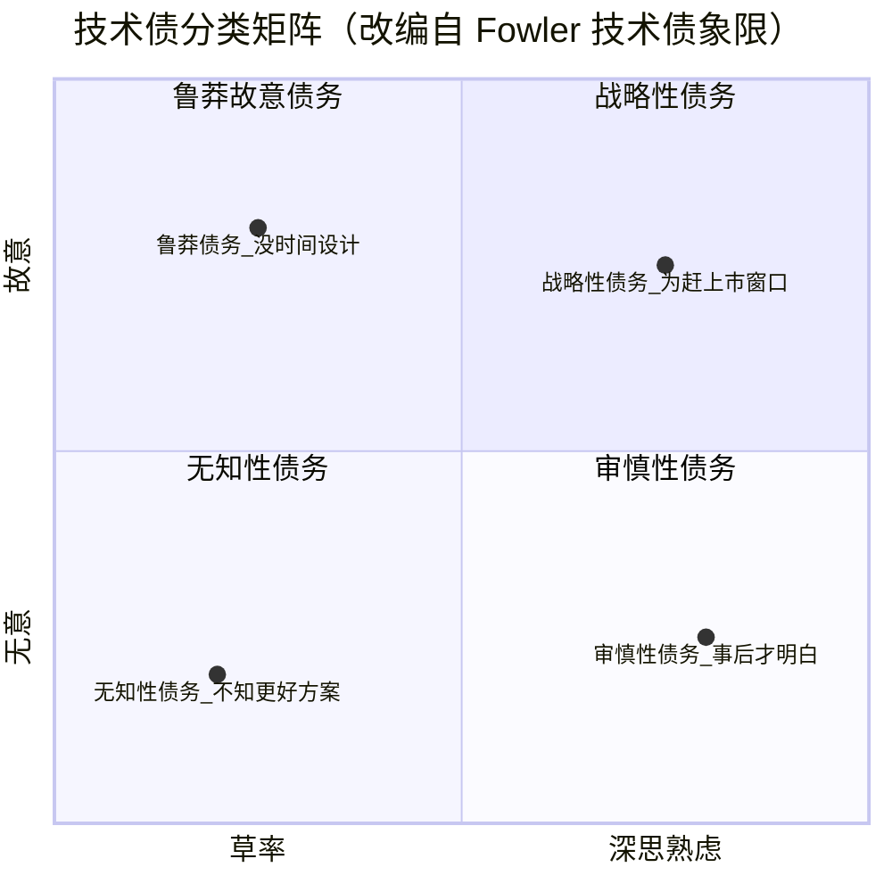

这四类债务的性质截然不同：

- **战略性债务**（故意 + 深思熟虑）："为了赶双十一上线，我们先用简单方案，节后第一个迭代重构。"这是**健康的债务**——前提是真的有还款计划，并且被记录、被追踪。
- **审慎性债务**（无意 + 深思熟虑）："做完之后我们才明白应该怎么设计。"这是**学习的必然代价**，无法完全避免，但可以通过原型验证、设计评审来减少。
- **鲁莽故意债务**（故意 + 草率）："没时间搞设计，直接写！"这是**最需要管理干预的债务**——它反映的不是技术问题，而是团队激励机制问题（只考核交付速度，不考核质量）。
- **无知性债务**（无意 + 草率）："分层？什么是分层？"这反映的是**能力缺口**，对策是培训、结对编程和代码评审中的知识传递。

最危险的是后两类，因为它们**在团队不知情的情况下悄然积累**——没有人记录它们，没有人计划偿还它们，直到某一天它们以生产事故或交付停滞的形式集中爆发。

### 根因三：团队协作失序

代码是团队协作的产物，协作机制的缺陷会直接反映在代码质量上（这是康威定律的推论）。三种典型的协作失序：

**知识孤岛**：核心模块只有一个人完全理解。这个人在的时候，模块"看起来"运转正常；这个人一旦离职或转岗，模块立刻变成"遗迹"——没有文档、没有测试、没有人敢动。知识孤岛的形成往往不是刻意的，而是任务分配长期固化的自然结果（"这块一直是老王负责的"）。

**评审流于形式**：Code Review 存在，但只停留在"变量名拼写""少了个空格"的层面。为什么会这样？因为**审设计比审语法难得多**——审设计需要理解业务上下文、需要投入认知精力、需要敢于提出可能引发争论的意见。在没有明确评审标准和文化支撑的团队里，评审者会自然滑向阻力最小的路径：挑几个格式问题，然后 Approve。

**缺乏设计前置**：先写代码，后讨论方案。此时的"讨论"往往沦为追认——"代码都写完了，总不能让人家推倒重来吧？"于是有问题的设计带着 2000 行已完成的代码强行合入。**评审的时机决定了评审的效力**：在设计阶段，改一个方案的成本是改几行文档；在代码完成后，成本是重写数天的工作。

### 根因四：测试体系缺失或虚假

没有测试的代码库，重构就是"高空走钢丝不系安全绳"——理论上可以走，实际上没人敢走。于是代码只能靠"打补丁"演化，腐烂不可避免。

但比没有测试更危险的，是**虚假的测试**。它有几种典型形态：

- **只断言"不报错"的测试**：`assertDoesNotThrow(...)`——即使业务逻辑完全错误，只要不抛异常就能通过。这种测试贡献了覆盖率数字，却不提供任何保护。
- **过度 Mock 的测试**：把所有依赖都 Mock 掉，最后测试验证的只是"Mock 被调用了"，而不是"业务行为正确"。
- **与实现强耦合的测试**：测试验证的是"内部调用了哪些私有方法"而非"外部可观察的行为"。这种测试在重构时会大面积报错——即使重构完全正确。久而久之，团队会得出"测试阻碍重构"的错误结论，进而抛弃测试。

虚假测试的危害在于**它提供了虚假的安全感**：仪表盘上覆盖率 80%，一片绿色，但当你真正依赖它去重构时，它保护不了你。

### 根因五：质量规则形同虚设

很多团队都有《编码规范》文档，规定了命名规则、方法长度上限、禁止事项……但这些文档往往躺在 Wiki 里无人问津。原因很简单：**没有强制执行机制的规则，等于没有规则**。

在交付压力下，人会自然地选择捷径。这不是道德问题，而是人性——NASA 对挑战者号事故的调查提出了一个概念叫"**偏差正常化**（Normalization of Deviance）"：当违规行为没有立即产生恶果时，它会逐渐被接受为常态。代码质量同理：第一次跳过测试没出事，第二次就更容易跳过，最终"跳过测试"成了团队的默认操作。

对抗偏差正常化的唯一办法，是**把规则交给机器执行**——机器不会疲劳，不会通融，不会因为"这次比较急"而放行。这正是第七章"流水线强制阻断"的理论基础。

---

<a name="3"></a>
## 三、防治策略一：架构防腐——筑起结构性防线

> **核心思想**：让"正确的做法"成为最容易的做法，让"错误的做法"在结构上不可能发生。

### 3.1 为什么架构是防腐的第一道防线？

在所有防腐手段中，架构的杠杆率最高。原因在于：**架构决定了变更的传播范围**。

想象两个系统面对同一个需求变更（比如"把邮件通知改为短信通知"）：

- 在**边界清晰**的系统里，通知逻辑被隔离在一个模块中，通过接口与其他部分交互。变更只需要新增一个实现类，影响范围是 1 个文件。
- 在**边界模糊**的系统里，发邮件的代码散落在 17 个 Service 中，每处的写法还略有不同。变更需要修改 17 个文件，每一处都有引入 Bug 的风险。

这就是架构的本质作用：**好的架构把变更"关"在小范围内，差的架构让变更"漫延"到整个系统**。腐烂的传播也遵循同样的规律——边界清晰的系统里，即使某个模块内部烂掉了，烂也烂在边界之内，随时可以整体替换；边界模糊的系统里，一处的烂会通过依赖关系传染到所有地方。

### 3.2 三个核心原则：分层、依赖方向、依赖倒置

**原则一：分层（Layering）——按"变化的原因"切分代码。**

分层的本质不是"把代码放进不同的文件夹"，而是**按变化频率和变化原因隔离代码**：

- HTTP 协议格式的变化（Controller 层的事）不应该影响业务规则；
- 数据库从 MySQL 换成 PostgreSQL（Infrastructure 层的事）不应该影响业务规则；
- 业务规则的变化（Domain 层的事）才是系统真正的核心，它应该被最严密地保护。

这就是单一职责原则（SRP）在架构层面的体现：**一个模块只应该有一个变化的原因**。

**原则二：依赖方向单向可控。**

依赖意味着"知道"：A 依赖 B，则 A 知道 B 的存在，B 变化时 A 可能被波及。因此依赖关系必须有明确的方向，且指向更稳定的东西。**循环依赖是架构腐烂最典型的标志**——A 依赖 B，B 又依赖 A，意味着两者实际上已经变成了一个模块，边界名存实亡，任何一方的变化都会震荡到另一方。

**原则三：依赖倒置（DIP）——让稳定的核心不依赖易变的细节。**

这是三个原则中最反直觉、也最关键的一个。按照朴素的直觉，业务逻辑要存数据，所以"业务层依赖数据库层"似乎理所当然。但依赖倒置说：**不对，应该反过来**。

具体做法是：由业务层（Domain）定义它需要的接口（如 `IUserRepository`——"我需要一个能保存和查找用户的东西"），基础设施层（Infrastructure）去实现这个接口（如 `JpaUserRepository`）。这样一来：

- 业务规则不知道数据库的存在，换数据库不影响业务层一行代码；
- 业务层可以脱离数据库独立测试（用 Mock 实现接口即可）；
- 依赖箭头从"业务 → 数据库"倒转为"数据库实现 → 业务接口"——**易变的细节依赖稳定的抽象**，而不是反过来。

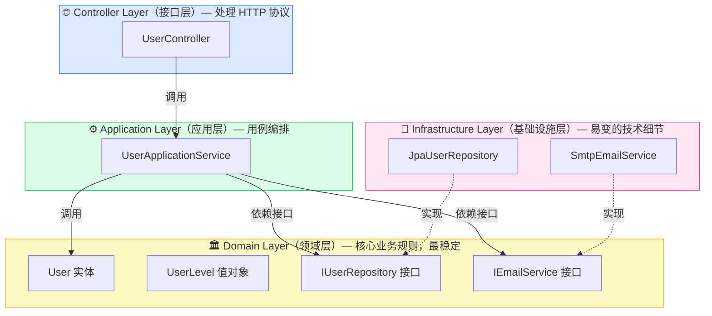

> 📌 **读图要点**：实线为"调用"（依赖），虚线为"实现"。注意 Infrastructure 层的箭头是指向 Domain 层的（实现其接口），而 Domain 层没有任何指向 Infrastructure 的箭头——领域核心对技术细节一无所知。这就是"倒置"。

### 3.3 上帝类：架构腐烂的标志性产物

**上帝类（God Class）** 是指一个承担了过多职责的巨型类——它什么都知道、什么都干，是系统中的"全知全能之神"。

上帝类不是被设计出来的，而是**演化出来的**。它的形成路径高度一致：最初它是一个职责单一的正常类；随着需求增加，每个开发者都发现"往这个类里加个方法"是最省事的做法——不用建新类、不用想放哪、不用改注入配置；于是它一天天膨胀，直到没有人能完整理解它。**上帝类是"阻力最小路径"的必然产物**——如果架构没有对"往哪加代码"施加约束，代码就会流向最方便的地方，而不是最正确的地方。

上帝类的危害是全方位的：它无法被单元测试（依赖太多、副作用太多）；它是并行开发的冲突热点（所有人都在改同一个文件）；它是知识孤岛的温床（只有"老人"知道哪些方法之间有隐秘的耦合）。

下面看一个经典的反面示例，以及正确的拆分方式。

**反面案例：上帝类**

```java
// ❌ 反面示例：一个承担了所有职责的"上帝类"
// 真实项目中见过 3000+ 行的版本，以下是精简的典型片段

@Service
public class UserService {

    // 💀 职责1：直接操作数据库（应属于 Repository 层）
    public User getUserFromDB(String userId) throws Exception {
        Connection conn = DriverManager.getConnection(
            "jdbc:mysql://localhost/db", "root", "hardcoded_pwd_123" // 硬编码密码
        );
        Statement stmt = conn.createStatement();
        ResultSet rs = stmt.executeQuery(
            "SELECT * FROM user WHERE id = '" + userId + "'"        // SQL 注入风险
        );
        // ... 50 行手动 ResultSet 映射
        return user;
    }

    // 💀 职责2：业务逻辑与数据访问纠缠（层次混乱，无法独立测试）
    public String calculateUserLevel(String userId) throws Exception {
        User user = getUserFromDB(userId);       // 业务规则被数据库绑架
        List<Order> orders = getOrdersFromDB(userId);
        if (orders.size() > 100 && user.getTotalAmount() > 10000) {
            return "VIP";                         // 魔法字符串
        } else if (orders.size() > 20) {
            return "SENIOR";
        }
        return "NORMAL";
    }

    // 💀 职责3：发送邮件（应属于 Infrastructure 层）
    public void sendWelcomeEmail(String userId) throws Exception {
        User user = getUserFromDB(userId);
        Properties props = new Properties();
        props.put("mail.smtp.host", "smtp.example.com");
        // ... 30 行 SMTP 细节直接写在业务类里
        message.setText("欢迎，" + user.getName()); // 邮件模板硬编码
        Transport.send(message);
    }

    // 💀 职责4：HTTP 处理（应属于 Controller 层）
    public ResponseEntity<Map<String, Object>> handleRegister(HttpServletRequest req) {
        try {
            // 解析请求 + 业务逻辑 + 格式化响应，全部混在一起
            // ...
        } catch (Exception e) {
            // 吞掉所有异常，不区分业务异常与系统异常
            return ResponseEntity.status(500)
                    .body(Map.of("code", 500, "msg", e.getMessage()));
        }
    }

    // 💀 还有 80 个方法……没有人能完整理解这个类
}
```

请注意这个类的四宗罪，每一宗都对应一种腐烂机制：

1. **数据访问混入业务类** → 业务逻辑无法脱离数据库测试 → 测试缺失 → 无人敢重构；
2. **业务规则用魔法字符串表达** → 规则散落各处、无处溯源 → 修改遗漏 → Bug；
3. **基础设施细节（SMTP）硬编码** → 换邮件服务商要改业务代码 → 变更范围失控；
4. **HTTP 协议处理混入** → 这个类无法被非 HTTP 场景（定时任务、消息消费）复用 → 复制粘贴 → 逻辑分叉。

**正面示例：按职责拆分 + 依赖倒置**

拆分的思路是：把四种职责分别归还到它们应属的层次，让每一层只做一件事，层与层之间通过接口交互。

```java
// ============================================================
// Domain Layer：核心业务规则。不 import 任何框架、任何基础设施。
// 这一层是系统最有价值的部分，必须被最严密地保护。
// ============================================================

// 值对象：Email —— 把"合法邮箱"这个业务规则封装为类型。
// 好处：一旦 Email 对象存在，它就一定是合法的；
// 校验逻辑只写一次，全系统复用，不可能遗漏。
public final class Email {
    private final String value;

    public Email(String value) {
        if (value == null || !value.matches("^[\\w.-]+@[\\w.-]+\\.[a-zA-Z]{2,}$")) {
            throw new InvalidEmailException("邮箱格式不合法: " + value);
        }
        this.value = value.toLowerCase();
    }

    public String getValue() { return value; }
}

// 枚举：UserLevel —— 消灭魔法字符串，让等级规则有类型保护
public enum UserLevel { NORMAL, SENIOR, VIP }

// 领域实体：User —— 业务规则内聚于实体，而非散落在 Service 里
public class User {
    private final UserId id;
    private final Email email;
    private int orderCount;
    private Money totalAmount;

    // "用户等级如何计算"是业务知识，它属于 User 自己。
    // 对比反面示例：同样的规则写在 Service 里、依赖数据库才能执行；
    // 这里它是一个纯函数，无需任何外部依赖即可测试。
    public UserLevel calculateLevel() {
        if (orderCount > 100 && totalAmount.isGreaterThan(Money.of(10_000))) {
            return UserLevel.VIP;
        }
        if (orderCount > 20) {
            return UserLevel.SENIOR;
        }
        return UserLevel.NORMAL;
    }
}

// 依赖倒置的关键一步：接口定义在 Domain 层。
// 它表达的是领域的需求（"我需要能存取用户"），
// 而不是技术的能力（"我有一个 MySQL"）。
public interface IUserRepository {
    Optional<User> findById(UserId id);
    Optional<User> findByEmail(Email email);
    void save(User user);
}

public interface IEmailService {
    void sendWelcomeEmail(User user);
}


// ============================================================
// Application Layer：用例编排。只回答"这个用例分几步"，
// 不含业务规则（规则在 Domain），不含技术细节（细节在 Infra）。
// ============================================================

@Service
@Transactional
public class UserApplicationService {

    private final IUserRepository userRepository;  // 依赖接口，不依赖实现
    private final IEmailService emailService;

    public UserApplicationService(IUserRepository userRepository,
                                   IEmailService emailService) {
        this.userRepository = userRepository;
        this.emailService = emailService;
    }

    // 阅读这个方法就是在阅读用例说明书：
    // 校验邮箱未占用 → 创建用户 → 持久化 → 发欢迎邮件。
    // 它不知道数据库是 MySQL 还是 Mongo，不知道邮件走 SMTP 还是 API。
    public UserDTO registerUser(RegisterUserCommand command) {
        Email email = new Email(command.email());
        userRepository.findByEmail(email).ifPresent(existing -> {
            throw new DuplicateEmailException("邮箱已被注册: " + email.getValue());
        });

        User user = User.create(email, new UserName(command.name()));
        userRepository.save(user);
        emailService.sendWelcomeEmail(user);

        return UserAssembler.toDTO(user);
    }
}


// ============================================================
// Infrastructure Layer：实现 Domain 定义的接口。
// 所有"脏活"（SQL、SMTP、缓存）都被关在这一层。
// 换数据库、换邮件服务商，只改这一层。
// ============================================================

@Repository
public class JpaUserRepository implements IUserRepository {

    private final UserJpaRepository jpa; // Spring Data JPA

    @Override
    public Optional<User> findByEmail(Email email) {
        return jpa.findByEmail(email.getValue()).map(UserMapper::toDomain);
    }

    @Override
    public void save(User user) {
        jpa.save(UserMapper.toPersistence(user));
    }
    // ...
}


// ============================================================
// Controller Layer：只处理 HTTP 协议——解析请求、调用用例、格式化响应。
// 业务规则一行都不许出现在这里。
// ============================================================

@RestController
@RequestMapping("/api/v1/users")
public class UserController {

    private final UserApplicationService userAppService;

    @PostMapping("/register")
    public ResponseEntity<ApiResponse<UserDTO>> register(
            @Valid @RequestBody RegisterUserRequest request) {
        UserDTO dto = userAppService.registerUser(
            new RegisterUserCommand(request.getEmail(), request.getName()));
        return ResponseEntity.status(HttpStatus.CREATED)
                .body(ApiResponse.success(dto));
    }
}
```

拆分后，对比一下四个关键场景的变更成本：

| 变更场景 | 上帝类版本 | 分层版本 |
|---------|-----------|---------|
| 换数据库 | 改遍所有含 SQL 的方法 | 只改 `JpaUserRepository` |
| 换邮件服务商 | 在业务类里改 SMTP 代码 | 新增一个 `IEmailService` 实现 |
| 测试等级计算规则 | 必须连数据库 | `new User(...)` 直接测，毫秒级 |
| 定时任务里复用注册逻辑 | 复制粘贴（因为混了 HTTP） | 直接调用 `UserApplicationService` |

### 3.4 让架构规则可执行：ArchUnit

分层做好了，还有最后一个问题：**如何保证半年后架构不被悄悄破坏？**

靠文档不行——没人看；靠 Review 不完全行——评审者会疲劳、会遗漏。正确答案是：**把架构规则写成测试**。ArchUnit 是 Java 生态中的标准做法，它能扫描字节码，验证包之间的依赖关系是否符合声明的规则，违规即测试失败、CI 阻断。

这样，架构约束就从"共识"变成了"物理定律"——新人即使完全不了解架构设计意图，也不可能提交一个跨层依赖的代码进主干。

```java
// ArchitectureTest.java —— 架构规则即测试，违规 = 测试失败 = CI 阻断

@AnalyzeClasses(packages = "com.example.app")
class ArchitectureTest {

    // 规则1：领域层不能依赖基础设施层（依赖倒置的守卫）
    @ArchTest
    static final ArchRule domainMustNotDependOnInfrastructure =
        noClasses()
            .that().resideInAPackage("..domain..")
            .should().dependOnClassesThat().resideInAPackage("..infrastructure..")
            .because("领域层是系统核心，不能被技术细节污染");

    // 规则2：Controller 不能跳层直接访问 Repository
    @ArchTest
    static final ArchRule controllerMustNotAccessRepository =
        noClasses()
            .that().resideInAPackage("..controller..")
            .should().dependOnClassesThat().resideInAPackage("..repository..")
            .because("必须经过 ApplicationService，否则用例逻辑会散落在 Controller 中");

    // 规则3：禁止循环依赖——架构腐烂最典型的标志
    @ArchTest
    static final ArchRule noCyclicDependencies =
        slices().matching("com.example.app.(*)..")
                .should().beFreeOfCycles();

    // 规则4：领域层禁止 import 任何 Spring 类（保持框架无关）
    @ArchTest
    static final ArchRule domainMustBeFrameworkFree =
        noClasses()
            .that().resideInAPackage("..domain..")
            .should().dependOnClassesThat().resideInAPackage("org.springframework..")
            .because("领域层应该是纯 Java，可以脱离框架独立编译和测试");
}
```

**适用场景**：中大型 Java/Kotlin 项目，团队 ≥ 3 人，有明确分层设计。

**预期效果**：架构违规在 PR 阶段被自动拦截；架构知识从"资深人员的脑子里"转移到"可执行的规则中"；架构退化速度下降 80% 以上。

---

<a name="4"></a>
## 四、防治策略二：编码防腐——从每一行代码开始

> **核心思想**：好的代码不需要注释来解释"做什么"，代码本身就是文档。

### 4.1 为什么微观代码质量如此重要？

架构解决的是"代码放在哪"的问题，编码规范解决的是"每一行代码写成什么样"的问题。即使架构完美，如果每个方法内部都是 100 行的嵌套迷宫，系统依然会腐烂——只是烂在方法内部而已。

编码防腐的理论基础是**认知负荷（Cognitive Load）**。人类工作记忆的容量极其有限（经典研究认为约为 7±2 个信息块）。当一个方法有 6 层嵌套、15 个分支、90 行代码时，理解它所需的工作记忆远超人类极限——读者必须在脑中同时追踪所有分支条件的组合状态，这几乎必然导致理解错误，而理解错误就是 Bug 的温床。

因此，编码防腐的所有手法，本质上都在做同一件事：**把代码的认知负荷压到人类工作记忆能轻松容纳的范围内**。具体来说有四个抓手：

**抓手一：命名——让名字承载业务语义。** 命名是最廉价也最有效的文档。`proc(uid, t, d)` 和 `processWithdrawal(userId, amount)` 的执行结果完全一样，但前者要求读者通读实现才能理解，后者读签名就够了。判断命名好坏的标准很简单：**一个不了解实现的人，能否仅凭名字准确猜出它的行为？**

**抓手二：单一职责 + 小方法——每个方法只讲一件事。** 一个方法应该只在一个抽象层次上工作：要么编排步骤（调用几个子方法），要么执行细节（具体计算），不要混着来。方法长度不是目的而是结果——当你严格执行"一个方法一件事"时，方法自然就短了。经验上限是 30 行，超过就该问自己：这里面是不是藏着几件事？

**抓手三：卫语句（Guard Clause）——用提前返回消灭嵌套。** 深层嵌套的 `if` 是可读性杀手，因为读者必须在脑中维护一个"条件栈"。卫语句的思路是：**把所有异常/边界情况在方法开头逐一检查并提前退出，让主流程保持在缩进的最外层**。这样读者的心智模型从"树状分支"简化为"线性检查清单"，认知负荷骤降。

**抓手四：消灭魔法数字/字符串——让每个值都有名字和归属。** 代码里裸露的 `50000` 有三宗罪：不知道它是什么（提现限额？风控阈值？）、不知道为什么是这个值（监管要求？产品拍的？）、不知道还有哪里用了它（改的时候会不会漏）。把它变成命名常量或配置项，三个问题同时解决。

### 4.2 经典示例：长方法 + 嵌套 if 的重构

下面这段代码是各种编码坏味道的"集大成者"，几乎每个老项目里都有它的变体。请先感受一下阅读它的认知负荷：

```java
// ❌ 反面示例：真实项目中的"祖传代码"
// 圈复杂度 14，长度 90 行，嵌套 6 层——没有人敢动它

public boolean proc(String uid, int t, Map<String, Object> d) {
    boolean r = false;                                    // 💀 r 是什么？
    try {
        ResultSet rs = stmt.executeQuery(
            "SELECT * FROM user WHERE id='" + uid + "'"); // 💀 SQL 注入
        if (rs.next()) {
            if (rs.getInt("status") != 0) {               // 💀 0 是什么状态？
                if (t == 1) {                             // 💀 1 是什么类型？
                    Object amtObj = d.get("amount");
                    if (amtObj != null) {
                        double amount = (double) amtObj;
                        if (amount > 0) {
                            if (rs.getDouble("balance") >= amount) {
                                if (amount <= 50000) {    // 💀 为什么是 50000？
                                    // 执行转账...
                                    r = true;
                                } else {
                                    if (rs.getInt("vip") == 1) {
                                        if (amount <= 100000) {
                                            // 💀 复制粘贴了上面的转账逻辑
                                            r = true;
                                        }
                                    }
                                }
                            }
                        }
                    }
                } else if (t == 2) {
                    // ……另一种交易类型，又是 80 行
                }
            }
        }
    } catch (Exception e) {
        e.printStackTrace();  // 💀 吞掉所有异常，线上出问题无从排查
    }
    return r;                 // 💀 只返回 true/false，失败原因全部丢失
}
```

在动手重构前，先系统地诊断它的问题——**重构不是凭感觉改代码，而是针对明确的坏味道施用明确的手法**：

| 坏味道 | 具体表现 | 对应重构手法 |
|--------|---------|-------------|
| 命名无语义 | `proc`、`t`、`d`、`r` | 重命名，引入意图导向的命名 |
| 魔法数字 | `0`、`1`、`50000`、`100000` | 提取为枚举 / 配置常量 |
| 深层嵌套 | 6 层 if | 卫语句（提前抛出/返回） |
| 职责混杂 | 查库 + 校验 + 执行 + 异常处理混在一起 | 提取方法，每个方法一个职责 |
| 重复代码 | VIP 分支复制了转账逻辑 | 提取限额判断为独立方法 |
| 异常信息丢失 | 返回 boolean、吞异常 | 抛出带业务语义的异常 |
| 弱类型参数 | `Map<String, Object>` | 引入类型化的命令对象 |

**重构后的版本**：

```java
// ✅ 正面示例：重构后，圈复杂度 2~3，每个方法 ≤ 12 行

// === 第一步：消灭魔法数字——用枚举给"状态"和"类型"命名 ===

public enum TransactionType {
    WITHDRAWAL(1), DEPOSIT(2);

    private final int code;
    TransactionType(int code) { this.code = code; }

    public static TransactionType fromCode(int code) {
        return Arrays.stream(values())
                .filter(t -> t.code == code)
                .findFirst()
                .orElseThrow(() -> new InvalidTransactionTypeException("未知交易类型: " + code));
    }
}

// 限额不再是散落代码中的裸数字，而是集中、可配置、自带文档的对象
@ConfigurationProperties(prefix = "transaction.withdrawal")
public record WithdrawalLimitConfig(
    Money standardLimit,   // application.yml: 50000，普通用户单笔提现上限
    Money vipLimit         // application.yml: 100000，VIP 用户单笔提现上限
) {}


// === 第二步：拆分职责——入口方法只做编排，细节下沉到私有方法 ===

@Service
public class TransactionService {

    private final IUserRepository userRepository;
    private final ITransactionRepository transactionRepository;
    private final WithdrawalLimitConfig limitConfig;

    /**
     * 入口方法：读它就像读业务流程说明书。
     * 找用户 → 校验 → 执行。每一步的细节被封装在命名良好的子方法中，
     * 读者可以按需下钻，而不是被迫一次性理解全部细节。
     */
    public TransactionResult processTransaction(UserId userId,
                                                 TransactionType type,
                                                 Money amount) {
        User user = findActiveUser(userId);
        validateTransaction(user, type, amount);
        Transaction tx = executeTransaction(user, type, amount);
        return TransactionResult.success(tx);
    }

    // === 第三步：卫语句——异常情况提前抛出，主流程零嵌套 ===

    private User findActiveUser(UserId userId) {
        User user = userRepository.findById(userId)
                .orElseThrow(() -> new UserNotFoundException(userId));

        if (!user.getStatus().isActive()) {
            throw new InactiveUserException("账户未激活，无法交易: " + userId);
        }
        return user;
    }

    private void validateTransaction(User user, TransactionType type, Money amount) {
        if (amount.isNegativeOrZero()) {
            throw new InvalidAmountException("交易金额必须大于0，实际: " + amount);
        }
        if (type == TransactionType.WITHDRAWAL) {
            validateWithdrawal(user, amount);
        }
    }

    private void validateWithdrawal(User user, Money amount) {
        if (user.getBalance().isLessThan(amount)) {
            throw new InsufficientBalanceException(user.getBalance(), amount);
        }
        Money limit = resolveWithdrawalLimit(user);
        if (amount.isGreaterThan(limit)) {
            throw new ExceedsWithdrawalLimitException(amount, limit);
        }
    }

    // === 第四步：消灭重复——VIP 限额规则只写一次，且有名字 ===
    // 对比反面示例：VIP 分支复制了整段转账逻辑；
    // 这里差异被压缩到真正不同的那一点——限额值。
    private Money resolveWithdrawalLimit(User user) {
        return user.isVip() ? limitConfig.vipLimit() : limitConfig.standardLimit();
    }

    private Transaction executeTransaction(User user, TransactionType type, Money amount) {
        Transaction tx = Transaction.create(user.getId(), type, amount);
        transactionRepository.saveWithBalanceUpdate(tx, user); // 事务由 Infra 层保证
        return tx;
    }
}
```

**重构收益对比**：

| 指标 | 重构前 | 重构后 |
|------|--------|--------|
| 方法长度 | 90 行 | 最长 12 行 |
| 圈复杂度 | 14 | 2~3 |
| 嵌套深度 | 6 层 | 1 层（卫语句） |
| 错误信息 | 返回 `false`（原因未知） | `ExceedsWithdrawalLimitException: 金额¥80000超过限额¥50000` |
| 可测试性 | 必须连数据库 | 每个校验规则可独立单测 |
| VIP 规则修改点 | 散落 2 处（易漏改） | 集中 1 处 |

特别值得注意的是错误处理的变化。反面示例返回 `boolean`，调用方只知道"失败了"，不知道为什么失败——于是排查一个线上问题要靠加日志、重新发布、复现。重构后每种失败都是一个**带业务语义的异常**，异常类型本身就是文档，异常消息直接告诉你原因。这不仅是可读性的提升，更是**可运维性**的提升。

### 4.3 防御式编程：显式处理边界，而非假设一切正常

防御式编程的核心理念是：**不信任任何输入**——无论来自用户、上游服务，还是同事写的其他模块。它与代码腐烂的关系在于：不做防御的代码，其错误会在离出错点很远的地方以莫名其妙的形式爆发（比如三层调用之后的 NPE），排查这类问题的过程往往伴随着"打补丁式"的修改，进一步加速腐烂。

防御式编程有一个关键原则：**尽早失败（Fail Fast）**。在非法状态进入系统的第一时间就拦截并报错，而不是让它在系统里流窜。越早失败，错误离根因越近，排查成本越低。

```java
// ❌ 反面：假设输入永远合法
// 当 user 为 null 或 profile 为 null 时，抛出的是 NullPointerException——
// 它不会告诉你是"哪个用户"缺"什么数据"，排查全靠猜。
public int getUserAge(User user) {
    return Year.now().getValue() - user.getProfile().getBirthYear();
}


// ✅ 正面：显式校验，尽早失败，错误信息有业务语义
public int getUserAge(User user) {
    Objects.requireNonNull(user, "user 不能为空");

    UserProfile profile = user.getProfile();
    if (profile == null) {
        // 异常信息直接回答排查三问：谁？缺什么？该怎么办？
        throw new UserProfileNotFoundException(
            "用户 [" + user.getId() + "] 尚未完善个人资料，无法计算年龄");
    }

    int birthYear = profile.getBirthYear();
    int currentYear = Year.now().getValue();
    if (birthYear < 1900 || birthYear > currentYear) {
        throw new InvalidBirthYearException(
            "出生年份 [" + birthYear + "] 不合法，有效范围: 1900~" + currentYear);
    }

    return currentYear - birthYear;
}


// ✅ 进阶：如果"没有年龄"是正常的业务情形（而非错误），
// 用 Optional 在类型层面明确表达"可能没有"，强迫调用方处理缺失分支
public Optional<Integer> findUserAge(UserId userId) {
    return userRepository.findById(userId)
            .map(User::getProfile)
            .map(UserProfile::getBirthYear)
            .map(birthYear -> Year.now().getValue() - birthYear);
}
```

注意最后一个版本的设计判断：**"资料缺失"到底是异常还是正常情形？** 如果业务上允许用户不填生日，那它就是正常情形，应该用 `Optional` 表达；如果业务上要求必填，那它就是异常，应该抛出。防御式编程不是无脑加判空，而是**在类型和异常的选择中准确表达业务语义**。

**适用场景**：所有项目，尤其是有外部输入（API、表单、第三方数据、消息队列）的系统边界处。

**预期效果**：Bug 在边界处被捕获而非深处爆发；异常信息可直接定位问题；线上排障时间显著缩短。

---

<a name="5"></a>
## 五、防治策略三：测试防腐——让质量可度量、可验证

> **核心思想**：测试不是为了覆盖率数字，而是为了让重构有安全网，让腐烂无处藏身。

### 5.1 测试与防腐的关系：没有安全网就没有重构

要理解测试为什么是防腐体系的支柱，需要先理解一个因果链：

**代码要保持整洁，就必须持续重构**（因为需求在变，昨天合理的结构今天可能不再合理）→ **重构要敢做，就必须有快速、可靠的回归验证**（否则谁知道改完之后有没有把别的东西改坏？）→ **这个回归验证，就是自动化测试**。

反过来推也成立：没有测试 → 不敢重构 → 只能打补丁 → 结构持续劣化 → 代码更难测试 → 更没有测试……这是一个自我强化的死亡螺旋。**测试是打破这个螺旋的唯一支点。**

因此，衡量测试价值的真正标准不是覆盖率，而是这个问题：**"如果我现在对核心模块做一次较大的重构，测试全绿能让我放心上线吗？"** 如果答案是否定的，那么无论覆盖率多高，你的测试体系都是失效的。

### 5.2 测试金字塔：不同层次测试的分工

不是所有测试都一样。按验证范围和成本，测试分为三层，各有不可替代的职责：

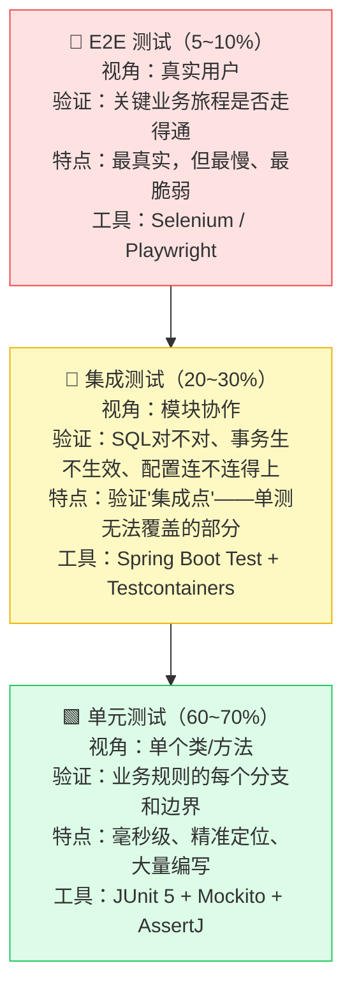

金字塔形状本身就是结论：**底层多、上层少**。原因是成本结构——单元测试运行以毫秒计、失败时能精确指向出错的方法；E2E 测试运行以分钟计、失败时你只知道"流程挂了"，还得花时间定位。常见的反模式是"冰淇淋筒"（倒金字塔）：单测很少，一切都靠手工测试和少量 E2E——这样的团队每次发布都是一场豪赌。

各层的分工可以用一句话概括：**单元测试验证"逻辑对不对"，集成测试验证"接得上接不上"，E2E 测试验证"用户用得了用不了"。** 三者不能互相替代——单测再多也测不出 SQL 语法错误（那是集成测试的事），集成测试再全也不该用来穷举业务规则的边界（那是单测的事，用集成测试穷举太慢太贵）。

### 5.3 虚假绿测试：最危险的腐烂形式

第二章提到过，比没有测试更危险的是虚假的测试。这里深入讲清楚：**什么样的测试是"虚假绿"，如何识别它？**

一个测试的价值等于它的**辨别力**——当代码错误时它变红，代码正确时它变绿。虚假绿测试的问题就在于失去了前半句：**无论代码对错它都是绿的**。它的三种典型形态：

1. **断言过弱**：只断言"不抛异常"或"返回值不为 null"，不验证具体的业务结果。
2. **只测 Happy Path**：正常流程测了，但所有异常分支、边界条件（空集合、金额为 0、并发冲突）一个没测——而 Bug 恰恰藏在这些地方。
3. **不验证副作用**：业务方法的价值往往在副作用（存了数据、发了消息），测试却只看返回值，副作用完全没验证。

识别虚假绿测试有一个简单的思想实验：**"如果我把被测方法的实现改成明显错误的版本，这个测试会变红吗？"** 如果不会——它就是虚假的。（这个思想实验的自动化版本，就是 5.5 节的突变测试。）

**经典对比示例**：

```java
// ❌ 反面：虚假绿测试
// 这个测试贡献了覆盖率，看起来也"测了注册功能"，
// 但请做思想实验：如果 registerUser 内部忘了保存用户、忘了发邮件、
// 甚至返回了别人的信息——这个测试依然是绿的。它什么都保护不了。
@Test
void shouldCreateUser() {
    UserApplicationService service = new UserApplicationService(mockRepo, mockEmail);
    assertDoesNotThrow(() ->
        service.registerUser(new RegisterUserCommand("test@test.com", "Test")));
}


// ✅ 正面：有辨别力的测试
// 三个要点：(1) 验证返回值的业务语义；(2) 验证副作用确实发生；
// (3) 覆盖异常路径，并验证异常路径下副作用【不】发生。
class UserApplicationServiceTest {

    private IUserRepository userRepository;
    private IEmailService emailService;
    private UserApplicationService service;

    @BeforeEach
    void setUp() {
        userRepository = mock(IUserRepository.class);
        emailService = mock(IEmailService.class);
        service = new UserApplicationService(userRepository, emailService);
    }

    @Test
    @DisplayName("注册成功：应保存用户、发送欢迎邮件，并返回正确的用户信息")
    void shouldSaveUserAndSendWelcomeEmailOnSuccess() {
        // Arrange
        given(userRepository.findByEmail(new Email("alice@example.com")))
            .willReturn(Optional.empty());

        // Act
        UserDTO result = service.registerUser(
            new RegisterUserCommand("alice@example.com", "Alice"));

        // Assert 1：返回值的业务语义正确
        assertThat(result.email()).isEqualTo("alice@example.com");
        assertThat(result.level()).isEqualTo(UserLevel.NORMAL.name()); // 新用户默认等级

        // Assert 2：副作用发生了，且内容正确（用 Captor 捕获保存的对象来验证）
        ArgumentCaptor<User> captor = ArgumentCaptor.forClass(User.class);
        verify(userRepository).save(captor.capture());
        assertThat(captor.getValue().getEmail().getValue()).isEqualTo("alice@example.com");

        verify(emailService).sendWelcomeEmail(any(User.class));
    }

    @Test
    @DisplayName("邮箱已被占用：应抛出 DuplicateEmailException，且【不】保存、【不】发邮件")
    void shouldThrowAndNotCauseSideEffectsWhenEmailTaken() {
        given(userRepository.findByEmail(any(Email.class)))
            .willReturn(Optional.of(User.createForTest("existing@example.com")));

        assertThatThrownBy(() ->
                service.registerUser(new RegisterUserCommand("existing@example.com", "Bob")))
            .isInstanceOf(DuplicateEmailException.class)
            .hasMessageContaining("existing@example.com");

        // 关键：失败路径下，副作用必须【不】发生。
        // 这一行断言曾在真实项目中拦截过"校验失败但邮件照发"的 Bug。
        verify(userRepository, never()).save(any());
        verify(emailService, never()).sendWelcomeEmail(any());
    }

    // 参数化测试：用一个测试覆盖一组边界输入，边界即测试用例
    @ParameterizedTest(name = "非法邮箱 [{0}] 应被拒绝")
    @ValueSource(strings = { "notanemail", "", "user@", "user@@example.com", "user @example.com" })
    void shouldRejectInvalidEmailFormats(String invalidEmail) {
        assertThatThrownBy(() ->
                service.registerUser(new RegisterUserCommand(invalidEmail, "Charlie")))
            .isInstanceOf(InvalidEmailException.class);

        verifyNoInteractions(userRepository, emailService);
    }
}
```

### 5.4 覆盖率门槛：必要但不充分的底线

先明确覆盖率的定位：**覆盖率低一定有问题，覆盖率高不一定没问题**。覆盖率只能告诉你"哪些代码从未被测试执行过"（这些代码毫无保护，是确定的风险），但它无法告诉你"被执行过的代码是否被正确验证了"（这要靠突变测试）。

因此正确的用法是：**把覆盖率作为门禁的下限，而不是追求的目标**。一旦把覆盖率本身当 KPI，团队就会写出大量"执行了代码但什么都不断言"的测试来凑数——这正是虚假绿测试的批量生产线。

推荐的门禁策略是**分层设置**——越核心的代码要求越高，同时对**新增代码**设置比存量更高的要求（防止存量债务成为拉低标准的借口）：

```xml
<!-- pom.xml：JaCoCo 覆盖率门禁——不达标则构建失败，而非警告 -->
<plugin>
    <groupId>org.jacoco</groupId>
    <artifactId>jacoco-maven-plugin</artifactId>
    <version>0.8.11</version>
    <executions>
        <execution>
            <id>check</id>
            <phase>verify</phase>
            <goals><goal>check</goal></goals>
            <configuration>
                <rules>
                    <!-- 整体底线：行覆盖 ≥ 80%，分支覆盖 ≥ 75% -->
                    <rule>
                        <element>BUNDLE</element>
                        <limits>
                            <limit>
                                <counter>LINE</counter>
                                <value>COVEREDRATIO</value>
                                <minimum>0.80</minimum>
                            </limit>
                            <limit>
                                <counter>BRANCH</counter>
                                <value>COVEREDRATIO</value>
                                <minimum>0.75</minimum>
                            </limit>
                        </limits>
                    </rule>
                    <!-- 核心层更严：Domain/Application 行覆盖 ≥ 90% -->
                    <rule>
                        <element>PACKAGE</element>
                        <includes>
                            <include>com/example/app/domain/**</include>
                            <include>com/example/app/application/**</include>
                        </includes>
                        <limits>
                            <limit>
                                <counter>LINE</counter>
                                <value>COVEREDRATIO</value>
                                <minimum>0.90</minimum>
                            </limit>
                        </limits>
                    </rule>
                </rules>
            </configuration>
        </execution>
    </executions>
</plugin>
```

### 5.5 突变测试：给测试"考试"

覆盖率的盲区（"测试是否验证了正确的事"），由**突变测试（Mutation Testing）** 来补上。

它的原理非常直观，就是把 5.3 节那个思想实验自动化：工具自动地、系统性地在你的源码中注入小 Bug（称为"突变体"），比如把 `>` 改成 `>=`、把 `return x` 改成 `return null`、删掉某个方法调用——然后运行你的测试套件。**如果测试变红，说明它捕获了这个 Bug（"突变被消灭"）；如果测试依然全绿，说明这类 Bug 你的测试根本发现不了（"突变存活"）**——存活的突变体就是你测试的盲区清单。

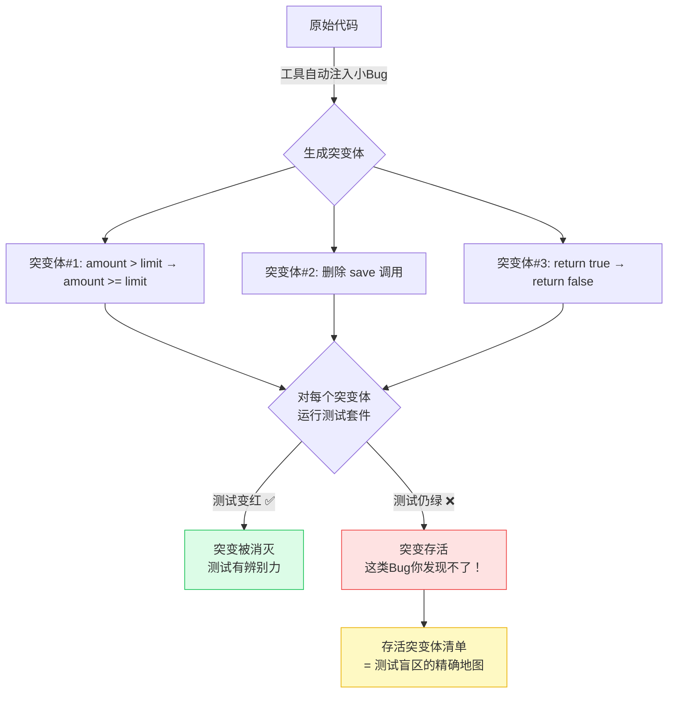

突变测试的代价是运行时间长（每个突变体都要跑一遍测试），所以实践中的策略是：**只对核心领域层开启，并设置合理的消灭率门槛（70% 起步）**，不追求 100%（有些突变体是"等价突变"，逻辑上不可能被检测）。

Java 生态的标准工具是 **PITest**：

```xml
<!-- pom.xml：PITest 突变测试配置 -->
<plugin>
    <groupId>org.pitest</groupId>
    <artifactId>pitest-maven</artifactId>
    <version>1.15.3</version>
    <dependencies>
        <dependency>
            <groupId>org.pitest</groupId>
            <artifactId>pitest-junit5-plugin</artifactId>
            <version>1.2.1</version>
        </dependency>
    </dependencies>
    <configuration>
        <!-- 只对核心层做突变测试，控制运行成本 -->
        <targetClasses>
            <param>com.example.app.domain.*</param>
            <param>com.example.app.application.*</param>
        </targetClasses>
        <!-- 消灭率低于 70% → 构建失败 -->
        <mutationThreshold>70</mutationThreshold>
    </configuration>
</plugin>
```

```bash
mvn org.pitest:pitest-maven:mutationCoverage

# 输出示例：
# >> Line Coverage: 312/340 (92%)     ← 覆盖率很漂亮
# >> Generated 189 mutations
# >> Killed 152 (80%)                 ← 但突变消灭率只有 80%
# >> Survived 37                      ← 这 37 个就是测试盲区的精确坐标
```

上面这个输出很典型：**92% 的覆盖率之下，藏着 37 个测试发现不了的潜在 Bug 类型**。首次在存量项目上运行突变测试的团队，通常会发现 20%~40% 的测试属于无效验证——这个数字本身就是对"覆盖率崇拜"最好的祛魅。

**适用场景**：所有项目做覆盖率门禁；核心领域层追加突变测试。

**预期效果**：测试从"覆盖率数字"变成真正的"重构安全网"；团队获得对测试套件质量的客观度量。

---

<a name="6"></a>
## 六、防治策略四：Code Review 防腐——协作中的最后防线

> **核心思想**：Code Review 不只是审代码，更是审设计、审意图、传播知识。

### 6.1 重新理解 Code Review 的三重价值

很多团队把 Code Review 理解为"找 Bug 的最后一关"，这个理解太窄了。Review 对防腐的价值有三层，重要性依次递增：

**第一层：缺陷拦截**。发现逻辑错误、边界遗漏、安全隐患。这是最直观的价值，但其实是三层中最弱的一层——研究表明人工评审对深层逻辑 Bug 的发现率并不高（那更多是测试的职责）。

**第二层：一致性维护**。确保新代码遵循团队的架构约定和编码风格，防止"每个人一套写法"导致的碎片化。注意：这一层的大部分工作应该交给工具（Checkstyle、ArchUnit），人只处理工具处理不了的部分（比如"这个抽象放这一层合不合适"）。

**第三层：知识传播**。这是最容易被忽视、却对防腐最重要的一层。Review 是团队中成本最低的知识流动机制：评审者被迫理解自己没写的代码——这直接瓦解知识孤岛；作者从评审意见中学到更好的做法——这消灭"无知性债务"；讨论沉淀在 PR 记录里——这成为可追溯的决策文档。**一个 Review 文化健康的团队，不会出现"只有老王懂这个模块"的局面。**

### 6.2 设计前置评审：把评审提前到成本最低的时刻

第二章分析过一个协作失序：先写代码后讨论，讨论沦为追认。解决方案是**把设计评审从"代码完成后"提前到"代码开始前"**——这就是 RFC（Request for Comments）机制。

其背后的原理是软件工程中最古老的定律之一——**变更成本曲线**：同一个设计问题，在设计阶段修正的成本是改几行文档，在编码完成后修正的成本是重写数天的工作，在上线后修正的成本可能是数周的返工加生产事故。**评审发生得越早，单位评审时间产生的价值越高。**

RFC 机制的运作方式：开发者在动手编码前，先写一份轻量的设计文档（背景、目标、方案对比、风险、接口定义），团队异步评审（通常 48 小时窗口），达成共识后再开始编码。此后的 Code Review 只需要关注"实现是否忠于设计"，不会再出现方向性的争论。

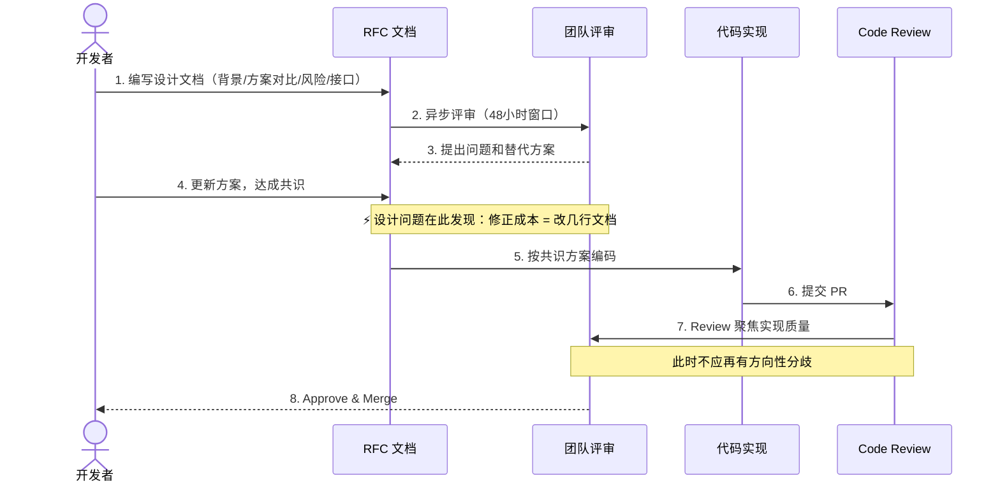

RFC 不是所有变更都需要——对小改动强制 RFC 只会制造官僚主义。团队应明确**触发条件**并写入 Contributing Guide：

- 引入新的外部依赖（每个依赖都是长期维护责任）
- 改变现有 API 契约（影响所有调用方）
- 影响超过 2 个模块的重构
- 预计工作量 > 3 天的新功能
- 任何数据库 Schema 变更（数据结构的错误最难回滚）

### 6.3 用 Checklist 对抗评审疲劳

人工评审的最大敌人是**注意力的不稳定**：同一个评审者，周一早上和周五晚上的评审质量可能天差地别；不同评审者关注的维度也各有侧重和盲区。Checklist 的作用正是把评审质量的下限从"取决于评审者当天状态"提升到"至少覆盖了清单上的所有维度"——这与飞行员起飞前检查单是同一个原理。

Checklist 分两份：一份给**提交者**（提 PR 前自检，把低级问题消灭在评审之前，节约评审者的注意力），一份给**评审者**（确保关键维度不遗漏）。

**提交者自检模板**：

```markdown
<!-- .github/PULL_REQUEST_TEMPLATE.md -->

## 变更描述
<!-- 1~3 句话：做了什么，以及【为什么】这样做 -->

## 关联 Issue / RFC
<!-- Closes #123 | RFC: docs/rfc/xxx.md -->

## 自检清单（提交前逐项确认）

### 代码质量
- [ ] 无遗留 System.out.println / 无孤儿 TODO（TODO 必须关联 Issue）
- [ ] 无硬编码配置（密钥、URL、魔法数字）
- [ ] 方法命名表达业务意图，而非技术动作

### 架构合规
- [ ] 无跨层依赖（本地已跑 ArchUnit 测试）
- [ ] 无循环依赖

### 测试
- [ ] 新增逻辑有对应单测，覆盖正常路径 + 关键异常路径
- [ ] 断言验证了业务结果和副作用，不是"只要不报错就行"

### 安全
- [ ] 用户输入经过校验
- [ ] 日志不含密码、Token 等敏感信息
- [ ] SQL 使用参数化查询

## Reviewer 重点关注
<!-- 主动告诉评审者你最没把握的地方——这是对彼此时间的尊重 -->
```

**评审者的关注维度**（按重要性排序——注意设计排第一，而多数人本能地只看第三、四层）：

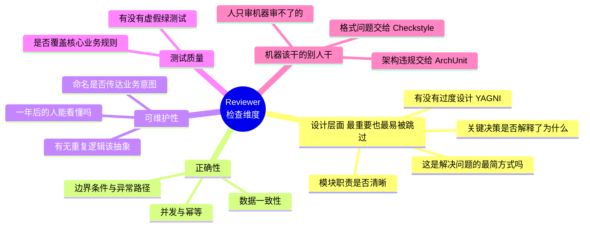

最后一个分支值得强调：**凡是工具能检查的，人不要检查**。如果评审者还在挑"这里少个空格"，说明团队的自动化没做到位——人的注意力是评审中最稀缺的资源，应该全部投给设计和正确性这些机器无能为力的维度。

### 6.4 评审沟通：对代码严格，对人温和

Review 是团队中最高频的书面沟通场景，沟通方式直接决定这个机制能否长期健康运转。糟糕的评审语言会让作者产生防御心理，最终演变成"互相放水"的默契——那是评审机制的死亡。

好的评审意见有一个可复制的结构：**指出问题 → 解释影响 → 给出方向 → 征询意见**。对比：

```java
// ❌ 差："这里写得不好。"
//    ——没有信息量，只有攻击性。

// ❌ 稍好但不够："这个方法太长了。"
//    ——指出了现象，但没有说危害，也没给方向。

// ✅ 好的评审意见（问题 → 影响 → 方向 → 征询）：
//
// [建议] processOrder 目前承担了 4 个职责：校验、算价、扣库存、发通知。
//
// 影响：这 4 块逻辑无法独立测试，后续任何一块的变更都要回归整个方法。
//
// 方向：建议至少拆成 4 个私有方法；如果"下单成功后的通知"未来还会
// 增加渠道，可以考虑用领域事件解耦（参考 PaymentService#onPaymentCompleted
// 的做法）。
//
// 你怎么看？是否有我没考虑到的约束？
```

再配合**评论分级前缀**，让作者一眼分清哪些必须改、哪些可以讨论，避免"每条评论都要来回拉扯"的消耗：

- `[阻塞]`——必须修改才能合并（如安全漏洞、架构违规）
- `[建议]`——建议改但不强制，作者可自行判断
- `[疑问]`——需要作者解释，不预设是问题
- `[学习]`——纯粹的知识分享，无需任何修改

**预期效果**：设计问题在 RFC 阶段被发现（修正成本最低）；Review 讨论聚焦于机器无法判断的设计与正确性问题；知识孤岛被持续瓦解。

---

<a name="7"></a>
## 七、防治策略五：流水线强制阻断——让规则长出牙齿

> **核心思想**：人工 Review 是兜底，自动化检查是基线。凡是机器能检查的，不要依赖人的自觉。

### 7.1 为什么必须"阻断"而不是"警告"？

前面四章建立的所有规范——架构规则、编码规范、覆盖率要求、评审标准——都面临同一个终极问题：**在交付压力下，它们会被绕过吗？**

如果规则的执行依赖人的自觉，答案几乎必然是"会"。回顾第二章讲的"偏差正常化"：第一次违规没出事，第二次就更容易违规，最终违规成为常态。而且这个过程无关个人素质——再自律的工程师，在"今晚必须上线"的压力下也会说服自己"就这一次"。

破解之道只有一个：**把规则的执行权从人转移给机器，并且让违规的后果是"阻断"而不是"警告"**。这里"阻断 vs 警告"的区别是本质性的：

- **警告**会被忽略。任何见过 CI 输出里滚过 500 条 warning 的人都懂——warning 的宿命就是被淹没。允许警告存在，等于宣布规则可以协商。
- **阻断**不可协商。覆盖率不达标就是合不了，架构违规就是进不了主干。没有"下次补"，没有"特事特办"。

阻断机制还有一个微妙但重要的好处：**它把质量冲突从"人际冲突"转化为"人机冲突"**。没有门禁时，阻止低质量代码合入的是某位评审者——他/她要独自承受"卡进度"的压力和人情负担；有门禁后，是流水线说不行——对事不对人，评审者与作者站在同一边，一起想办法让代码达标。这对团队氛围的保护作用，怎么强调都不为过。

当然，阻断机制要可持续，必须满足两个前提：**快**（整条流水线控制在 20 分钟内，否则开发者会想方设法绕过它）和**准**（极少误报，否则"狼来了"效应会摧毁团队对门禁的信任）。这也是下面流水线设计成分阶段、快检查前置的原因。

### 7.2 质量门禁流水线的分层设计

流水线的设计原则是**快速失败（Fail Fast）**：最快、最廉价的检查放在最前面，让明显有问题的提交在 2 分钟内就得到反馈，而不是等 20 分钟跑完全部测试才知道格式没过。

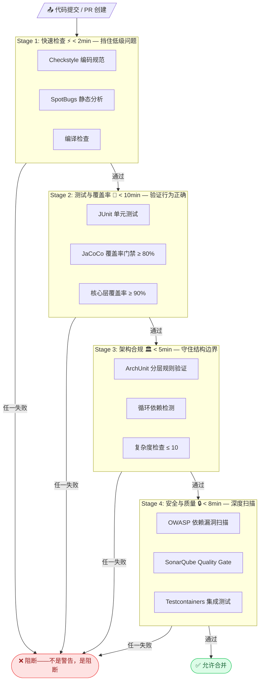

四个阶段各有明确使命：**Stage 1** 用秒级的静态检查过滤格式和明显缺陷，保护后续昂贵阶段不被浪费；**Stage 2** 验证行为正确性并执行覆盖率门禁；**Stage 3** 守卫架构边界——这是防止"结构性腐烂"混入主干的关卡；**Stage 4** 做安全扫描和综合质量评估，把关最后一道。

### 7.3 把编码规范变成机器规则：Checkstyle

第四章讲的编码规范（方法长度、嵌套深度、魔法数字……），在这里全部转化为机器可执行的规则。注意 `severity` 设置为 `error`——违规直接构建失败：

```xml
<!-- checkstyle.xml：编码规范的机器化——每条规则对应第四章的一个原则 -->
<?xml version="1.0"?>
<!DOCTYPE module PUBLIC
    "-//Checkstyle//DTD Checkstyle Configuration 1.3//EN"
    "https://checkstyle.org/dtds/configuration_1_3.dtd">

<module name="Checker">
    <property name="severity" value="error"/> <!-- 违规 = error = 构建失败 -->

    <module name="TreeWalker">
        <!-- 对应"小方法"原则：超过 30 行必须拆分 -->
        <module name="MethodLength">
            <property name="max" value="30"/>
            <property name="countEmpty" value="false"/>
        </module>

        <!-- 对应"认知负荷"原则：圈复杂度 ≤ 10 -->
        <module name="CyclomaticComplexity">
            <property name="max" value="10"/>
        </module>

        <!-- 对应"卫语句"原则：嵌套超 3 层必须重构 -->
        <module name="NestedIfDepth">
            <property name="max" value="3"/>
        </module>

        <!-- 对应"消灭魔法数字"原则 -->
        <module name="MagicNumber">
            <property name="ignoreNumbers" value="-1, 0, 1"/>
            <property name="ignoreAnnotation" value="true"/>
        </module>

        <!-- 参数超过 4 个 → 应引入 Command/Builder 对象 -->
        <module name="ParameterNumber">
            <property name="max" value="4"/>
        </module>

        <!-- 禁止 System.out.println（应使用结构化日志） -->
        <module name="Regexp">
            <property name="format" value="System\.out\.println"/>
            <property name="illegalPattern" value="true"/>
            <property name="message" value="禁止 System.out.println，请使用 Logger"/>
        </module>

        <!-- 禁止空 catch 块（吞异常是排障的噩梦） -->
        <module name="EmptyCatchBlock">
            <property name="exceptionVariableName" value="expected|ignore"/>
        </module>
    </module>
</module>
```

### 7.4 完整流水线示例（GitHub Actions）

```yaml
# .github/workflows/quality-gate.yml
name: 🛡️ Quality Gate

on:
  pull_request:
    branches: [ main, develop ]

concurrency:
  group: ${{ github.workflow }}-${{ github.ref }}
  cancel-in-progress: true

jobs:
  # Stage 1: 快速检查——2分钟内给出第一轮反馈
  quick-checks:
    name: ⚡ Quick Checks
    runs-on: ubuntu-latest
    steps:
      - uses: actions/checkout@v4
      - uses: actions/setup-java@v4
        with: { java-version: '21', distribution: 'temurin', cache: maven }

      - name: Checkstyle 编码规范（违规即失败）
        run: mvn checkstyle:check -q

      - name: SpotBugs 静态分析
        run: mvn spotbugs:check -q

  # Stage 2: 测试 + 覆盖率门禁
  test-coverage:
    name: 🧪 Test & Coverage
    runs-on: ubuntu-latest
    needs: quick-checks
    steps:
      - uses: actions/checkout@v4
      - uses: actions/setup-java@v4
        with: { java-version: '21', distribution: 'temurin', cache: maven }

      - name: 单元测试 + JaCoCo 门禁
        # verify 阶段包含 jacoco:check——覆盖率不达标 = 构建失败
        run: mvn verify -Dskip.integration.tests=true

  # Stage 3: 架构合规——ArchUnit 守卫分层边界
  architecture-check:
    name: 🏛️ Architecture
    runs-on: ubuntu-latest
    needs: quick-checks
    steps:
      - uses: actions/checkout@v4
      - uses: actions/setup-java@v4
        with: { java-version: '21', distribution: 'temurin', cache: maven }

      - name: ArchUnit 架构规则验证
        run: mvn test -Dtest=ArchitectureTest

  # Stage 4: 安全 + SonarQube 综合质量门
  security-sonar:
    name: 🔒 Security & Sonar
    runs-on: ubuntu-latest
    needs: [ test-coverage, architecture-check ]
    steps:
      - uses: actions/checkout@v4
        with: { fetch-depth: 0 }  # Sonar 需要完整 Git 历史
      - uses: actions/setup-java@v4
        with: { java-version: '21', distribution: 'temurin', cache: maven }

      - name: OWASP 依赖漏洞扫描（CVSS ≥ 7 即失败）
        run: mvn dependency-check:check -DfailBuildOnCVSS=7

      - name: SonarQube 扫描 + Quality Gate
        env:
          SONAR_TOKEN: ${{ secrets.SONAR_TOKEN }}
        # qualitygate.wait=true 是关键：
        # 等待 Quality Gate 结果，不通过 → 构建失败（不是警告！）
        run: |
          mvn sonar:sonar \
            -Dsonar.qualitygate.wait=true
```

### 7.5 SonarQube Quality Gate：分开管控"增量"与"存量"

在有历史包袱的项目上引入门禁，最大的现实困境是：**存量代码已经一身债，如果门禁按理想标准要求全量代码，第一天就全线飘红，团队直接放弃。**

解法是把"增量"和"存量"分开管控——这也是 SonarQube "Clean as You Code" 理念的核心：**对新增代码严格要求（它们没有历史包袱，没有理由不干净），对存量代码只要求"不再恶化"**。存量债务另行通过第八章的债务管理机制有计划地偿还。这样门禁从第一天起就可执行，而系统质量随着代码的自然新陈代谢逐步改善。

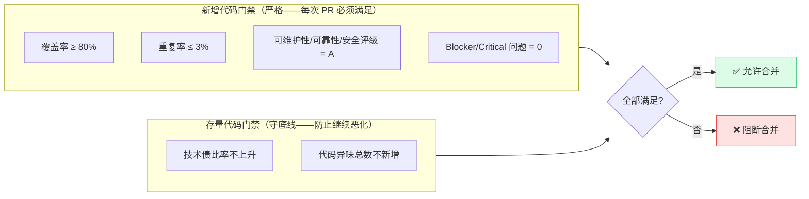

**预期效果**：任何代码都无法绕过质量基线进入主干；质量执行从"靠自觉"变成"靠机制"；评审者从格式警察解放出来，专注设计问题。

---

<a name="8"></a>
## 八、债务管理：量化、偿还与可视化

> 看不见的债务无法被管理。

### 8.1 债务管理的三个原则

前面几章的门禁能防止**新债**产生，但**存量债务**怎么办？放着不管，它的利息（每次触碰这些代码的额外成本）会持续侵蚀团队产能。债务管理有三个原则：

**原则一：量化——把"感觉很烂"变成"债务 167 小时"。** 债务不被量化，就无法进入管理视野：你无法向管理层争取还债时间（"代码有点乱"不是一个能排进 Roadmap 的理由，"核心模块技术债 167 小时、拖累交付速度 30%"才是），也无法判断债务趋势是在好转还是恶化。SonarQube 的技术债估算（把每个代码问题折算为修复工时）虽不完美，但作为趋势指标足够好用——**绝对值不重要，趋势才重要**。

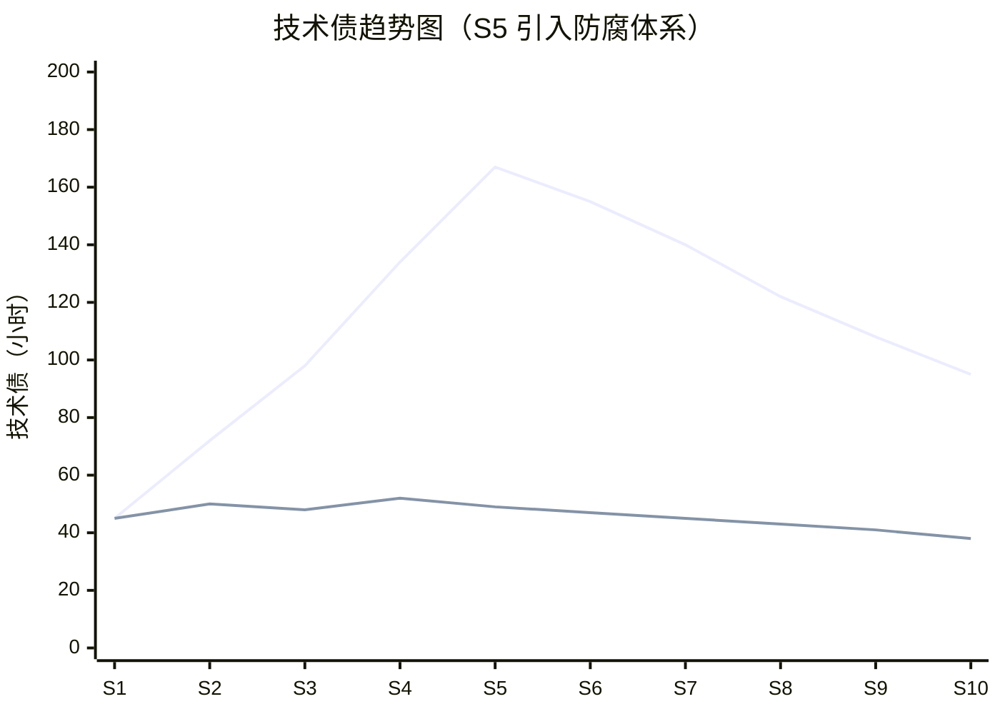

> 📌 红线：无治理，债务持续攀升。蓝线：从项目早期就有门禁，债务始终受控。注意红线在 S5 引入治理后也开始下降——**任何时候开始治理都不晚，但越晚成本越高**。

**原则二：分级——不是所有债务都值得还。** 还债是有成本的，必须把有限的还债时间投给"利息最高"的债务。分级的两个维度是**业务影响**（这块代码被改动的频率 × 出错的后果）和**偿还成本**。一个几乎不再变更的边缘模块，哪怕代码再烂，它的债务利息也接近零——不还也罢；而一个每个迭代都要改的核心模块，哪怕只是中度混乱，也应该优先治理。

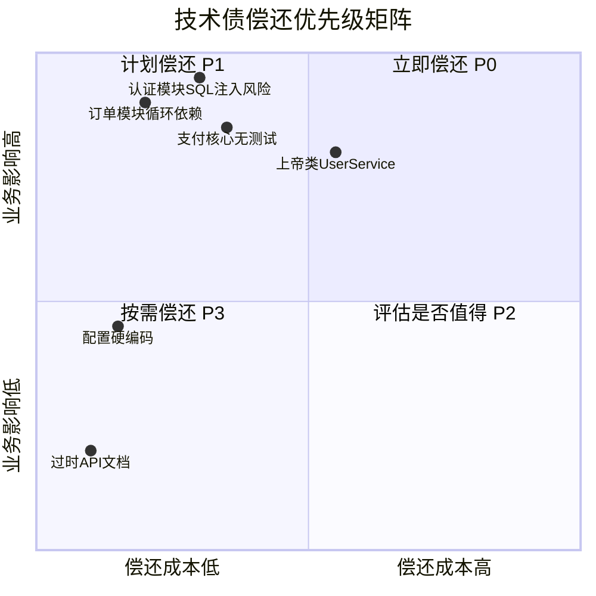

**原则三：制度化偿还——把还债写进 DoD，而不是"有空再说"。** "有空再还债"等于永远不还，因为团队永远不会"有空"。可持续的做法是**每个迭代固定预留 10%~15% 的容量用于还债**，并写入 Definition of Done。这个比例的合理性在于：它小到不会显著影响交付节奏（管理层可接受），又大到足以让债务趋势由升转降（复利方向反转）。

### 8.2 让债务在代码中可见、可追踪

债务记录最常见的失败方式是：记在 Wiki 里，然后被遗忘。更好的做法是**让债务标注生长在它所描述的代码旁边**——改这段代码的人一定会看到它。用自定义注解实现：

```java
// TechDebt.java —— 债务标注注解：让债务与代码共存，可被工具扫描统计

@Retention(RetentionPolicy.SOURCE)
@Target({ElementType.TYPE, ElementType.METHOD})
public @interface TechDebt {
    String value();                                    // 债务描述
    String issue();                                    // 关联 Issue（强制，防止孤儿债务）
    Priority priority() default Priority.MEDIUM;
    int estimatedHours() default 0;                    // 预估偿还工时
    String createdAt();

    enum Priority { LOW, MEDIUM, HIGH, CRITICAL }
}


// 使用示例：任何触碰这段代码的人都会看到债务说明与还债计划
@TechDebt(
    value = "存在 N+1 查询：每个订单单独查一次用户，订单量大时数据库压力剧增。"
          + "应改为按 userId 批量查询后内存组装。",
    issue = "https://github.com/your-org/your-repo/issues/478",
    priority = TechDebt.Priority.CRITICAL,
    estimatedHours = 4,
    createdAt = "2024-03-20"
)
public List<OrderVO> getOrdersWithUserInfo(List<Long> orderIds) {
    return orderIds.stream()
        .map(id -> {
            Order order = orderRepo.findById(id).orElseThrow();
            User user = userRepo.findById(order.getUserId()).orElseThrow(); // N+1!
            return OrderAssembler.toVO(order, user);
        })
        .toList();
}
```

配套在 CI 中统计标注数量，形成趋势监控：

```bash
# CI 中统计债务标注数，写入趋势数据；连续 3 个迭代上升则触发团队告警
grep -rc "@TechDebt" src/main/java | awk -F: '{s+=$2} END {print "当前技术债标注: " s " 处"}'
```

这套机制的价值闭环是：**注解让债务可见 → Issue 让债务可追踪 → CI 统计让趋势可监控 → 迭代预留容量让偿还可执行**。四环缺一，债务管理就会退化回"口头共识"。

---

<a name="9"></a>
## 九、全链路防治体系总结

回顾全文，五大策略不是五个孤立的工具，而是一条覆盖软件交付全生命周期的防线——**每个策略守住一个环节，环环相扣**：

- **设计阶段**，RFC 前置评审在成本最低的时刻拦截方向性错误，分层架构与依赖倒置为系统划定"腐烂无法跨越"的边界；
- **编码阶段**，命名、单一职责、卫语句、防御式编程把每一行代码的认知负荷压到人类可以驾驭的范围；
- **验证阶段**，有辨别力的测试（而非虚假绿测试）构成重构安全网，突变测试给测试本身"考试"，Code Review 完成机器无法完成的设计审查与知识传播；
- **合入阶段**，流水线用"阻断而非警告"的门禁，把前面所有规范从"共识"升格为"物理定律"；
- **运行阶段**，债务量化与制度化偿还，让存量问题有计划地收敛而非无声地积累。

```mermaid
flowchart LR
    subgraph D["📐 设计阶段"]
        D1[RFC 前置评审]
        D2[分层 + 依赖倒置]
    end

    subgraph C["💻 编码阶段"]
        C1[命名/单一职责]
        C2[卫语句/防御式编程]
    end

    subgraph V["✅ 验证阶段"]
        V1[有辨别力的测试]
        V2[突变测试]
        V3[Code Review]
    end

    subgraph P["🚀 合入阶段"]
        P1[Checkstyle/ArchUnit]
        P2[JaCoCo 门禁]
        P3[SonarQube Quality Gate]
    end

    subgraph M["📊 运行阶段"]
        M1[债务量化看板]
        M2[每迭代 15% 还债]
    end

    D --> C --> V --> P --> M
    M -->|趋势反馈驱动改进| D

    style D fill:#dbeafe,stroke:#3b82f6
    style C fill:#dcfce7,stroke:#22c55e
    style V fill:#fef9c3,stroke:#eab308
    style P fill:#fce7f3,stroke:#ec4899
    style M fill:#f3e8ff,stroke:#a855f7
```

**五大策略速查表**：

| 策略 | 防的是什么腐烂 | 核心手段 | 主要工具 | 关键指标 | 见效周期 |
|------|--------------|---------|---------|---------|---------|
| **架构防腐** | 结构性腐烂：边界模糊、依赖失控 | 分层 + DIP + 架构测试 | ArchUnit | 违规依赖 = 0 | 长期（1~3月） |
| **编码防腐** | 微观腐烂：方法内部的认知失控 | 命名 + SRP + 卫语句 | Checkstyle + SpotBugs | 复杂度 ≤ 10，方法 ≤ 30行 | 短期（立即） |
| **测试防腐** | 安全网失效：不敢重构 | 有效断言 + 分层门槛 + 突变测试 | JUnit 5 + JaCoCo + PITest | 覆盖率 ≥ 80%，突变消灭率 ≥ 70% | 中期（1~2月） |
| **Review 防腐** | 协作腐烂：知识孤岛、设计失控 | RFC 前置 + Checklist + 分级评论 | PR 模板 + RFC 流程 | 设计问题在编码前发现 | 中期（1~2月） |
| **流水线阻断** | 规则腐烂：规范被逐步绕过 | 门禁阻断而非警告 | GitHub Actions + SonarQube | 违规代码进主干 = 0 | 短期（1~2周） |

需要强调的是：**这五道防线是互相依赖的，缺任何一环都会让其他环节的投入打折**——只有好架构没有测试，重构寸步难行，架构终将退化；只有高覆盖率但架构混乱，测试维护成本会高到被放弃；只有 Review 没有工具执行，规则会在压力下被绕过；只有门禁没有设计前置，拦下的永远是已经付出成本的错误。

---

<a name="10"></a>
## 十、结语：腐烂是熵增，防腐是意志

写到这里，可以回答开篇的那个隐含问题了：**代码为什么会烂？** 不是因为团队里有人故意写烂代码，而是因为熵增是软件系统的默认方向——需求在变、人员在换、上下文在丢失，每一次"局部合理"的妥协都在为全局的混乱添砖加瓦。**不腐烂，从来不是自然状态，而是持续投入的结果。**

而防腐的全部秘密，浓缩起来就是四句话：

> 🧱 **质量不是速度的对立面，而是可持续速度的基础。**
> 前两个季度看不出差距，第六个季度差三倍——防腐的收益是复利。

> 💳 **技术债不是不能借，而是不能不记账、不还。**
> 健康的债务有记录、有计划、有偿还节奏；沉默的债务终将以事故的形式集中清算。

> 🤖 **让规则长出牙齿，不靠个人英雄主义。**
> 靠自觉的规范会在第一个"今晚必须上线"面前失守；只有机器执行的门禁不会疲劳、不会通融。

> 🌱 **防腐不需要一次性变革，从下一行代码就能开始。**
> 你不需要说服全公司才能行动——下一个 PR 就可以写出第一个 ArchUnit 规则。

### 📋 行动清单：分阶段落地路线

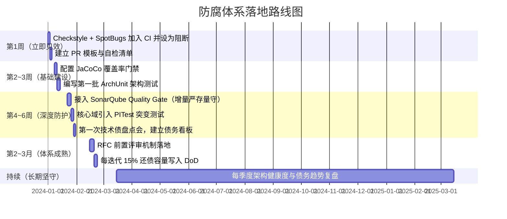

---

代码库是你的团队留给未来自己的礼物，或者，诅咒。

**让代码腐烂的，不是时间，而是缺乏对抗熵增的意志。**

选择权，在你们手中——从下一行代码开始。

---

*如果这篇文章对你有帮助，欢迎转发给你的技术团队。代码腐烂是每个团队都会面临的挑战，欢迎在评论区分享你们的防腐实践与踩坑经历。*
