# 【JVM 深度笔记】《深入理解 Java 虚拟机》第 3 版 

> 说明：这是一份「【JVM 深度笔记】」，基于周志明老师《深入理解 Java 虚拟机》第 3 版 + 自身实战经验 + 部分网络资料整理而成。  
> 目标是做一份**高密度、可落地、能反复查阅**的 JVM 笔记，而不是逐章翻译原书。强烈建议配合原书阅读。

---
# （一）前言与整体认知

## 1.1 为什么要写这份 JVM 深度笔记？

很多 Java 开发都有类似感受：

- 面试时：  
  - “JVM 内存结构？”  
  - “GC 原理？”  
  - “说一下 JMM 和 volatile？”  
  似懂非懂，背得出来，解释不顺畅。
- 工作中：
  - 线上一 OOM，只会 `-Xmx` 调大一点再重启；  
  - GC 日志满屏英文，看到 `Full GC` 只会慌，不知道该看哪行；  
  - 线程池、缓存一多，堆、元空间、直接内存谁在涨说不清；

而《深入理解 Java 虚拟机》是 JVM 方向的“黄埔军校”，但完整从头看到尾，对很多人来说又比较“重”：

- 信息密度大，一遍读完很难形成**体系化认知**；
- 很多细节在当前工作阶段**暂时用不到**；
- 看完一遍，不做总结，三个月后几乎全忘。

所以这份笔记想解决三件事：

1. **建立一张 JVM 的“大地图”**  
   - 读完系列后，你脑中应能画出 JVM 的主要组成与核心流程：  
     - 类加载 → 字节码执行（解释 + JIT）→ 内存与对象 → GC → 监控与调优  
   - 碰到问题能快速定位是**类加载问题 / 内存问题 / 并发问题 / GC 问题**。

2. **把“能背”变成“能用”**  
   - 不只是记住“JVM 有堆、栈、方法区……”，而是搞清：
     - OOM 到底是哪个区？  
     - 为什么有的 OOM 调大堆没用？  
     - 看到一段 GC 日志，能大致判断“正常/异常”。

3. **帮你从“框架驱动开发”走向“虚拟机驱动优化”**  
   - 不再只是“Spring / MyBatis 会用就行”，而是知道：
     - 框架大量使用反射 / 动态代理 / CGLIB 对**类加载和元空间**有什么影响？  
     - 高并发下，对象分配方式、逃逸分析、GC 类型对延迟有何影响？  
     - 容器化部署时，JVM 和 Docker 的内存限制是怎么“互相伤害”的？

简单说：  
**这份笔记不是“看过这篇就不用看原书”**，而是：

- 帮你在读书前先有一张地图；
- 读书中随时有一份“精华索引”；
- 读书后做查阅和实战的“备忘录”。

---

## 1.2 如何高效使用这份笔记？（学习路线 & 实战建议）

不同阶段的读者，使用方式会不一样。

### 1）根据自己阶段选择阅读深度

可以粗分三类读者：

#### a. 0～1 年：刚入职 / 校招生

- 建议重点：
  - 第 2 章：JVM 整体架构  
  - 第 3 章：运行时数据区（堆、栈、方法区）  
  - 第 8 章：GC 基础概念  
- 目标：
  - 面试时能**成体系地讲** JVM 基础；
  - 大致听懂项目里别人聊的“堆内存”、“GC”、“OOM”是什么意思。

#### b. 1～3 年：日常写业务，开始接触性能、问题排查

- 建议重点：
  - 第 3、5、6、7、8、9、10、12 章  
  - 尤其是：内存结构、对象创建 & 布局、JMM、GC、调优、诊断工具
- 目标：
  - 遇到 GC 日志、堆转储、线程栈，不再完全陌生；
  - 能配合 SRE / 运维一起解决一些**常见内存与性能问题**。

#### c. 3 年以上：希望在性能、架构方向更进一步

- 建议重点：
  - 全部章节，尤其：
    - JIT、锁优化、G1/ZGC、容器化下的 JVM、JDK 版本演进  
- 目标：
  - 设计系统时，天然会考虑：
    - 对象生命周期  
    - 内存占用和 GC 模式  
    - 高并发下的锁竞争和内存可见性  
  - 面对线上疑难问题时，有自己的分析路径，而不是瞎试参数。

---

### 2）推荐的使用方式：三遍法

**第一遍：快速通读 + 只记“大图”**

- 用 1～2 天把整个系列快速刷一遍；
- 不纠结每一条参数、每一种收集器细节；
- 重点在于搞清楚：“有哪些东西？”、“大概长什么样？”。

**第二遍：带着问题 + 结合原书和实战**

- 选自己当前最相关的几个主题做“重点突破”，例如：
  - 最近碰到了内存问题 → 集中看：第 3 / 8 / 9 / 10 / 12 章；
  - 最近在做高并发接口优化 → 集中看：第 3 / 6 / 7 / 9 / 11 章；
- 每看完一小节，做几件事：
  - 打开原书对应章节快速对照；
  - 在本地写几段**小代码 + 命令行工具**验证：
    - 用 `javap -v` 看编译结果；
    - 用 `jmap` / `jstack` / `jstat` 监控一次小 demo。

**第三遍：查阅式 + 做自己的“项目备忘录”**

- 以后再遇到问题时，回到这份笔记直接查对应部分；
- 根据自己公司的业务特点，逐渐把：
  - 常用 JVM 参数  
  - 常见 GC 日志模式  
  - 自己遇到过的几个经典问题  
  记在笔记的**边上或尾部**，形成你的“组织知识”。

---

### 3）关于 JDK 版本与环境的建议

阅读和实践时，尽量做到：

- **明确自己当前主要用的 JDK 版本**
  - JDK 8 仍然是很多公司的主力；
  - 新项目尽量向 JDK 11+ 甚至 17 LTS 看齐；
- 本系列会区分：
  - JDK8 时代：PermGen、CMS、默认 GC 是 Parallel  
  - JDK11+：无 PermGen，默认是 G1，ZGC / Shenandoah 逐渐成熟  
- 建议本地至少准备两个 JDK：
  - 一个 JDK8（看大量旧资料、旧项目兼容性）  
  - 一个 JDK11 / 17（理解新 JVM 的默认行为）

---

## 1.3 JVM 在 Java 生态中的定位：一次编写，到处运行的“根基”

我们每天写的 `.java` 文件，到线上机器上到底经历了什么？

从 1 万米高度看，一条最简版的路径是：

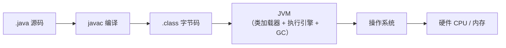

### 1）“一次编写，到处运行”是怎么做到的？

核心思路其实就一句话：

> 把**平台相关性**压到 JVM 实现里，把 **Java 程序本身**和平台解耦。

- Java 源码经过 `javac` 编译成 .class（字节码）；
- 字节码本身是**平台无关**的，只依赖于**JVM 规范**；
- 具体跑在哪个平台（Linux / Windows / ARM / x86），取决于**对应平台上的 JVM 实现**是否遵守同一套规范。

所以：

- 只要有一套遵守 JVM 规范的实现（HotSpot / OpenJ9 / Azul Zing…），
- 不同操作系统、不同 CPU 架构上写的 Java 程序就可以**不改动源码**就运行。

JVM 在这里扮演的角色更像：

- 操作系统之上的“虚拟操作系统”：
  - 提供自己的内存模型、指令集（字节码）、对象模型、异常机制；
- 同时又充当：
  - 语言运行时（Runtime）：负责类加载、解释/编译执行、自动内存管理（GC）。

### 2）JVM 在 Java 技术栈中的位置

再往下细化一点，会是这样的一个生态图：

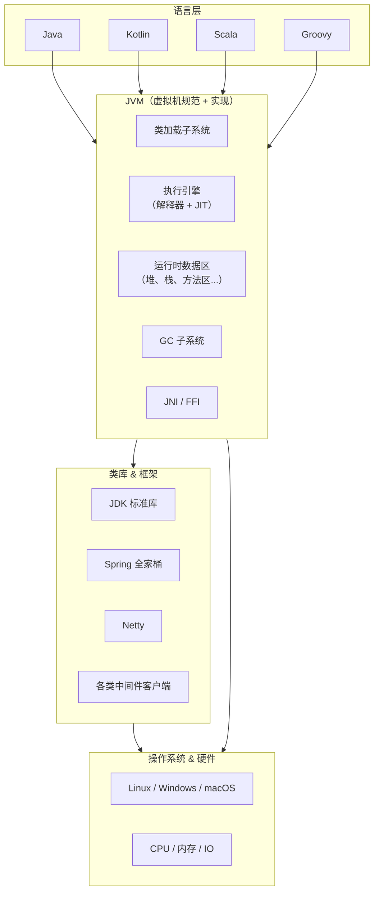

从这张图你可以得到几个直觉：

1. **不止 Java 在用 JVM**
   - Kotlin / Scala / Groovy 等大量 JVM 语言，都是编译成字节码再给 JVM 执行。
   - 所以搞清 JVM，不只是为了 Java，也是在理解整个**JVM 语言家族**。
2. **框架跑得快不快，底层都要算到 JVM 头上**
   - Netty 调优、Redis 客户端性能、Spring Boot 启动速度……
   - 真正的底层瓶颈往往是：GC 频率过高、对象分配过多、锁竞争激烈、JIT 未生效等。
3. **JVM 是“性能和稳定性”的最后一道大门**
   - 当你在业务层、SQL、缓存都优化得差不多后：
     - 想再压榨性能，就绕不过 JVM；
     - 想排查疑难线上问题，也绕不过 JVM。

------

## 1.4 从“会写 Java”到“会用 JVM”要补的三门课

很多人都有这种感受：

> “我业务写得还行，Spring 也很熟，但总觉得对 JVM 很虚。”

其实从“会写 Java”到“会用 JVM”，可以拆成三条相对清晰的主线：**内存 & 对象、执行 & 优化、诊断 & 调优**。

### 1）第一门课：内存与对象 —— 你写的代码在内存里长成了什么样？

关键问题有几个：

- 你的对象到底在什么地方分配？
  - 堆？栈上分配？TLAB？逃逸到老年代？
- JVM 的运行时数据区长什么样？
  - 堆（新生代 / 老年代）、虚拟机栈、本地方法栈、方法区 / 元空间、直接内存…
- 一个对象从 “new” 出来到 “被 GC 回收” 的完整生命周期是怎样的？
- 为什么会出现各种 OOM？
  - `java.lang.OutOfMemoryError: Java heap space`
  - `java.lang.OutOfMemoryError: Metaspace`
  - `java.lang.OutOfMemoryError: Direct buffer memory` …

掌握这一块，你能做到：

- 看到 OOM，**能较快定位是哪个区域的资源耗尽**；
- 回答诸如：
  - “为什么这个内存泄漏调大堆也没用？”
  - “为什么在容器里跑 JVM，明明 -Xmx 设置不大还是被 OOM Kill？”

本系列对应章节：

- 第 3 章：运行时数据区
- 第 6 章：对象的创建、布局与访问
- 第 8 章：垃圾收集基础

------

### 2）第二门课：执行与优化 —— JVM 如何让 Java 跑得既快又稳？

你写的代码从“字节码”变成“CPU 能执行的机器码”，大致经历了：

1. 解释执行（Interpreter）
2. 热点探测（HotSpot）
3. JIT 编译（C1 / C2），并配合各种优化手段：
   - 方法内联（Inlining）
   - 逃逸分析（Escape Analysis）
   - 标量替换 / 栈上分配
   - 锁优化（偏向锁、轻量级锁、自旋）

同时，还要考虑**并发与内存可见性**：

- 为什么在多线程下会出现“看不见别的线程写的值”？
- JMM（Java 内存模型）是如何抽象 CPU 缓存和指令重排序的？
- `volatile` 实际做了哪些事？`synchronized` 在 JVM 层面是如何实现的？
- 锁优化（偏向锁等）对应用性能的影响有多大？

掌握这一块，你能做到：

- 写出更“JVM 友好”的代码：
  - 减少不必要的对象创建、锁竞争；
  - 了解哪些写法会抑制 JIT 优化。
- 回答诸如：
  - “为什么这段理论上 O(1) 的代码在高并发下性能这么差？”
  - “为什么换了 JDK 版本性能就变了？”

本系列对应章节：

- 第 4 章：类文件结构与字节码基础
- 第 7 章：JMM 与并发语义
- 第 11 章：JIT 编译与执行引擎

------

### 3）第三门课：诊断与调优 —— 从“感觉慢”到“知道慢在哪”

真正能拉开差距的，往往不是背了多少 JVM 知识点，而是：

> 遇到线上问题时，你有没有一套**可执行的排查路径**。

这一块包括三部分内容：

#### a. 指标和日志：先“看清楚”再下手

- GC 日志：
  - 不同 GC 对应的日志格式和关键信息（停顿时间、回收前后内存、原因等）；
- JVM 运行时指标：
  - 堆使用率、年轻代/老年代占用、GC 次数和时间；
  - 线程数、类加载数、JIT 编译情况等。

#### b. 工具：把 JVM 当成“黑盒”来剖

JDK 自带工具已经是一整套 APM：

- `jps`：查看当前 Java 进程
- `jstack`：线程栈、死锁排查
- `jmap`：堆转储，配合 MAT / VisualVM 做对象分析
- `jstat`：GC 统计和趋势观察
- `jcmd`：统一诊断入口（JDK8+）

掌握这些工具，意味着：

- 你可以在不重启服务的情况下，**在线观察** JVM 的状态；
- 可以给“CPU 飙高、接口超时、偶发 OOM”这些模糊描述一个更明确的“罪名”。

#### c. 调优：有“原则”和“基线”，而不是拍脑袋

- 堆设多大？
- 新生代和老年代该怎么划分？
- CMS / G1 / ZGC 什么时候用？
- 容器内跑 JVM 时，内存参数怎么配才不会被系统 OOM Kill？

掌握这一块，你能做到：

- 面对性能问题，不再是“乱试参数 + 祈祷”，而是：
  - 先通过日志和工具确认问题在哪一层（GC / 锁 / IO / SQL）；
  - 再针对性调整参数或代码；
  - 用压测验证优化效果。

本系列对应章节：

- 第 8～10 章：GC 及调优
- 第 12 章：性能监控与诊断工具
- 第 15 章：JVM 最佳实践清单

到这里，第一章的目标是：

- 给你一个**全局视角**：JVM 在 Java 生态中的位置；
- 帮你明确：
  - 自己现在大概在哪个阶段；
  - 接下来学 JVM，应该先啃哪几块；
- 让后面的章节都能在这三条主线下理解：
  - 内存 & 对象
  - 执行 & 优化
  - 诊断 & 调优

下一章开始，我们会从这张“大地图”的第一块拼图——**JVM 整体架构和 Java 程序的生命周期**——正式深入

# （二）JVM 整体架构速写：脑中要有一张“总图”

> 这一章的目标：  
> 看完之后，你脑子里应该能画出一张 JVM 的「总图」，知道：
>
> - JVM 大概有哪些模块？
> - Java 代码从 `.java` 到在 CPU 上跑，中间经历了什么？
> - 后面深入时，每一章大致会落在这张图的哪个区域。

---

## 2.1 JVM 高层架构总览

先上一个**高层视图**，别急着抠细节：

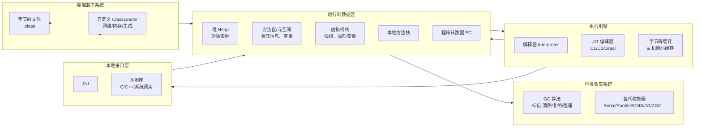

再用一句话概括：

> JVM = 「**类加载子系统**」 + 「**运行时数据区**」 + 「**执行引擎（解释器 + JIT）**」 + 「**GC 系统**」 + 「**本地接口层（JNI）**」。

接下来我们把这张图按“从左到右”的顺序过一遍，再按“Java 程序生命周期”的角度重新整理一遍。

------

## 2.2 从源码到执行：Java 程序生命周期

我们写一个极简的 Java 程序：

```java
// HelloJVM.java
public class HelloJVM {
    public static void main(String[] args) {
        System.out.println("Hello JVM");
    }
}
```

它从 `.java` 到真正跑起来，大致经历了这么几步：

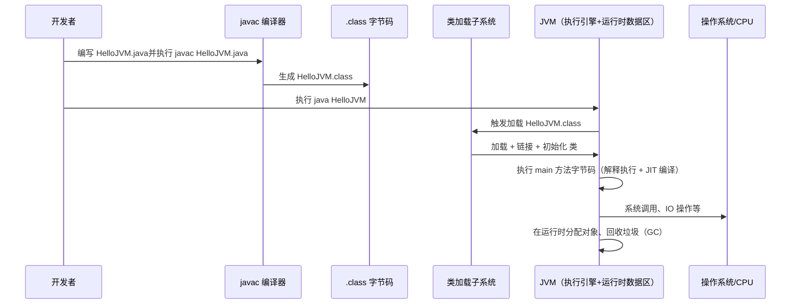

我们可以把整个过程拆成三个阶段来看：

### 1）编译阶段：源码 → 字节码（javac）

- 工具：`javac`（Java 编译器）
- 输入：`.java` 源码
- 输出：`.class` 字节码文件
- 字节码文件是**平台无关**的，只依赖于 JVM 规范。

> 这一块对应本系列的**第 4 章（类文件 & 字节码）**，后面会展开。

------

### 2）类加载 & 链接阶段：字节码 → 运行时元数据

当你执行

```bash
java HelloJVM
```

会发生几件事情：

1. JVM 启动，构建**类加载器**体系；
2. 使用类加载器读取 `HelloJVM.class`；
3. 对类做**加载 → 验证 → 准备 → 解析 → 初始化**等步骤；
4. 将类的信息放入**方法区 / 元空间**中（类元数据、常量池、方法表等）。

> 这一块对应本系列的**第 5 章（类加载子系统）**。

------

### 3）执行阶段：字节码 → 机器码（解释 + JIT）

类加载完成后：

1. JVM 调用 `HelloJVM.main()`；
2. `main` 方法的字节码会先被**解释器**逐条解释执行；
3. 如果某段代码成为“热点代码”（调用频率高）：
   - JVM 会触发 **JIT（Just-In-Time）编译**，
   - 把频繁执行的字节码编译成本地机器码，存到代码缓存里；
4. 之后再执行该热点代码时，就走机器码路径，性能大幅提升。

同时，在执行过程中：

- 对象在**堆**上分配（也可能被优化：栈上分配、标量替换）；
- 线程使用各自的**虚拟机栈、本地方法栈、程序计数器**；
- GC 系统在合适的时机对堆进行垃圾回收。

> 这一块对应本系列的：
>
> - 第 3 章：运行时数据区
> - 第 6 章：对象的创建与布局
> - 第 8～10 章：GC 原理与调优
> - 第 11 章：执行引擎 & JIT

------

## 2.3 关键组件一览：JVM 的「五脏六腑」

再回到第一张总图，我们按功能模块快速扫一遍——**每个模块都有对应的后续章节深入，这里先建立“浅印象”**。

### 2.3.1 类加载子系统：负责把「类」请进来

职责：**把类从各种来源（磁盘、网络、内存）加载进 JVM，并完成链接和初始化。**

主要动作：

1. 加载（Loading）
   - 通过类加载器（ClassLoader）读取 `.class`（或其他字节码来源），转成 `Class` 对象；
2. 验证（Verification）
   - 校验字节码合法性，避免恶意或错误字节码破坏 JVM；
3. 准备（Preparation）
   - 为类变量（静态变量）分配内存并设默认值；
4. 解析（Resolution）
   - 将常量池中的符号引用替换为直接引用（内存地址、偏移）；
5. 初始化（Initialization）
   - 执行 `<clinit>`，即静态变量赋值、静态代码块。

典型特点：

- 双亲委派模型：

  - 先把“能给父加载器干的活”都交上去，避免重复加载和安全问题；

- 支持

  自定义类加载器：

  - 动态加载插件、热部署、隔离不同模块的类空间等。

你需要知道的：

- 类加载问题经常体现在：
  - `ClassNotFoundException` / `NoClassDefFoundError`
  - 多版本冲突（不同 ClassLoader 加载了同名类）
- Web 容器（Tomcat）、Spring Boot 的 fat jar、OSGi 等都会大量利用类加载机制。

> 详细内容后面在**第 5 章**专门展开。

------

### 2.3.2 运行时数据区：JVM 的内存“地形图”

这一部分是 JVM 里最容易被问、也是最常见实际问题所在的地方。

按照**是否线程共享**划分：

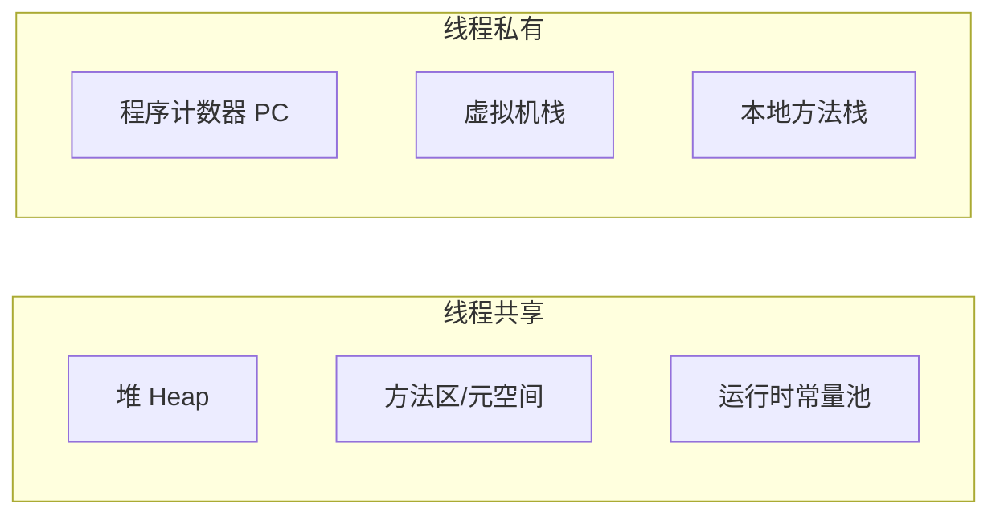

简单说：

- **堆（Heap）**：
  - “绝大多数对象实例”的老家；
  - 按代划分：新生代（Eden + Survivor）/ 老年代；
  - GC 主要围绕堆展开。
- **方法区 / 元空间（Method Area / Metaspace）**：
  - 存放：类元数据、运行时常量池、静态变量、JIT 编译后的代码等；
  - JDK8 之后从堆中的 **PermGen（永久代）迁移为本地内存中的 Metaspace**。
- **虚拟机栈（JVM Stack）**：
  - 每个线程一个栈；
  - 每次调用方法，就会创建一个“栈帧”，内部包含：
    - 局部变量表、操作数栈、动态链接、返回地址等；
  - 递归过深/无限递归会导致 `StackOverflowError`。
- **本地方法栈（Native Method Stack）**：
  - 与虚拟机栈对应，但服务于 native 方法（JNI 调用）。
- **程序计数器（PC 寄存器）**：
  - 每个线程一个，记录“当前执行到哪一行字节码”；
  - 执行本地方法时，其值是未指定（undefined）的。

这块你需要重点记住两件事：

1. 不同内存区域 OOM 的含义不同：

   - Heap OOM、Metaspace OOM、Direct Memory OOM、本地线程栈溢出……
   - 对应的现象和排查思路也不同。
   
2. 后面所有的 GC、对象分配优化、本地内存泄漏等问题，**都可以在这张“地形图”上定位**。

> 本系列**第 3 章**会把这块展开讲清楚；
> 第 6 章会具体讲对象在堆中的布局，以及“堆以外的分配”。

------

### 2.3.3 执行引擎：解释器 + JIT，混合模式跑代码

执行引擎负责做一件事：

> 把**字节码指令**变成**CPU 能跑的机器码**，并尽量跑得快。

JVM 的执行模式通常是**“解释 + 即时编译（JIT）”的混合模式**：


几个核心概念：

- **解释器（Interpreter）**
  - 启动快：类刚加载时，字节码可以立刻解释执行；
  - 但执行效率相对机器码要低。
- **JIT 编译器（Just-In-Time Compiler）**
  - 针对**热点代码**（调用频繁/循环次数多），编译为机器码；
  - 分层编译策略（HotSpot）：
    - C1：客户端编译器，编译速度快，优化少；
    - C2：服务端编译器，编译慢，优化强；
  - 现代 JVM 可能引入 Graal 作为新的 JIT 编译器。
- **热点探测（HotSpot）**
  - 统计方法调用计数、回边（loop）执行次数；
  - 到达阈值后，就会触发 JIT 编译。

你需要知道的：

- Java 不是简单的“解释型语言”，真正高性能的是靠 JIT 支撑；
- 很多性能差异（不同写法 / 不同 JDK 版本）其实是 JIT 优化行为的结果；
- JIT 在做优化时，会用到：
  - 内联、逃逸分析、锁优化等（后面第 11 章详细说）。

------

### 2.3.4 本地接口层（JNI）：JVM 与外部世界的“桥”

虽然 Java 强调“一次编写，到处运行”，但总有一些无法直接用 Java 实现的功能：

- 与特定操作系统/硬件强相关的能力（系统调用、设备访问）；
- 希望复用已有的 C/C++ 库，比如高性能加解密库、压缩库等。

这时就需要：**JNI（Java Native Interface）**。

JNI 提供了一套规范，让：

- Java 代码可以调用本地方法 `native`；
- 本地代码可以反过来回调 JVM，访问 Java 对象。

典型场景：

- Netty 使用本地代码优化网络 IO 和内存分配（DirectBuffer）；
- 一些压缩/加解密类库（如 Zstd、OpenSSL 包装）通过 JNI 封装；
- JDK 本身的部分底层实现也依赖本地代码。

需要注意的是：

- JNI 层出了问题，往往不是 Java 异常，而是：
  - 进程 Crash（`hs_err_pid*.log`）、段错误、Deadlock；
- JNI 也可以分配内存（本地堆、直接内存），会带来**Java Heap 之外的 OOM**。

------

### 2.3.5 垃圾收集系统（GC）：自动内存管理的“大管家”

GC 解决的是两个问题：

1. 哪些对象可以回收？（“谁已经没用了？”）
2. 何时、用什么方式回收？（“什么时候动手，怎么扫？”）

在高层架构里你先记住几件事：

- GC **主要围绕堆（Heap）**进行工作；
- 使用**可达性分析（Reachability Analysis）**来判断对象是否“活着”；
- 为了兼顾吞吐量与停顿时间，引入了：
  - 分代收集（新生代 / 老年代）
  - 不同的收集器组合（Serial / Parallel / CMS / G1 / ZGC / Shenandoah 等）；

在后面章节我们会详细讲：

- 新生代 / 老年代为什么要分开？
- CMS / G1 / ZGC 之间的主要区别是什么？
- 业务上该如何根据延迟 / 吞吐需求选择 GC 策略？

------

## 2.4 不同 JDK / JVM 实现差异：HotSpot 只是“主角之一”

很多人平时只接触 “JDK8/11/17”，往往容易混淆三个概念：

1. **Java 语言规范**；
2. **JVM 规范**；
3. **具体的 JVM 实现（实现 JVM 规范的软件）**。

JVM 规范只规定“**应该长什么样**，至少要支持哪些行为”，但**不规定具体怎么实现**。
在这个规范之下，存在多个 JVM 实现，最常用的是：

- **HotSpot VM**（Oracle/OpenJDK 自带，实现最普及）
- **OpenJ9**（Eclipse 基金会主导，前身 IBM J9）
- 以及其他（Azul Zing/Zulu、GraalVM 等）

本系列默认**以 HotSpot 为主**来讲解，但了解其他实现的差异也能帮助你「不被细节误导」。

### 2.4.1 HotSpot：默认世界观

特点：

- OpenJDK/Oracle JDK 默认采用的虚拟机实现；
- 绝大多数线上 Java 应用跑在 HotSpot 之上；
- 提供多种 GC 实现：
  - Serial / Parallel / CMS（JDK9 之后被标记为 deprecated）
  - G1（JDK9 之后默认 GC）
  - ZGC、Shenandoah（JDK11+ / 之后版本逐渐成熟）；
- 使用 C1 / C2 分层 JIT 编译器（部分新版本可以使用 Graal JIT）。

你在 `java -version` 里看到的大概率就是它。

------

### 2.4.2 OpenJ9：更加节省内存的另一套实现

OpenJ9 是 Eclipse 基金会维护的一个开源 JVM，实现同样的 JVM 规范。

特点（简单感知即可）：

- 目标是**更小的内存占用、更快的启动**；
- 类数据共享（CDS）、AOT（Ahead-of-Time）等方面有不少优化；
- GC、JIT、内存布局等与 HotSpot 有较大不同。

对我们这套笔记的影响是：

- 绝大多数「JVM 规范层面」的内容是通用的；
- 但「实现细节层面」（如对象头布局、具体 GC 参数名）会有实现差异；
- 绝大多数互联网公司、面试题、调优文章都默认以 HotSpot 为前提。

------

### 2.4.3 JDK 版本演进对 JVM 的影响（简单预告）

除了不同 JVM 实现，**同一个 HotSpot 在不同 JDK 版本之间也差异很大**，例如：

- JDK 6 / 7：
  - 有永久代（PermGen）；
  - CMS 仍被大量使用；
- JDK 8：
  - 去掉 PermGen，引入 Metaspace（本地内存）；
  - 默认 GC 仍是 Parallel（吞吐量优先）；
- JDK 9+：
  - G1 成为默认 GC；
  - 引入模块化（Jigsaw），影响类加载与部署方式；
- JDK 11 / 17 / 21：
  - ZGC / Shenandoah 逐步成熟，针对低延迟场景更友好；
  - 对容器/云原生环境有更好的支持（自动感知 cgroup 内存等）。

这也意味着：

- 你在看 JVM 相关资料时，一定要注意**JDK 版本前提**；
- 本系列会在相关章节专门标注 JDK8 / JDK11+ 的关键差异。

------

## 小结：这张“总图”要记住什么？

到这里，「第二章：JVM 整体架构速写」的核心任务就完成了，你应该能：

1. **在脑中画出一张 JVM 的高层结构图**：
   - 类加载子系统 → 运行时数据区 → 执行引擎 → GC → JNI；
2. **知道 Java 程序大致的生命周期**：
   - `javac` 编译 → 类加载/链接/初始化 → 解释执行 + JIT → GC 与本地交互；
3. **对后面各章节有一个“位置感”**：
   - 内存问题 → 看运行时数据区 + GC；
   - 类找不到 / 版本冲突 → 优先想类加载；
   - 性能抖动 / 延迟高 → 执行引擎 + GC + 并发；
   - 本地 Crash / DirectBuffer OOM → 想到 JNI & 本地内存。

下一章（第三章），我们会正式落到这张图里最常见的一块——**运行时数据区：JVM 内存模型速记图**，把“堆、栈、方法区、常量池、直接内存”这些经常被问的概念一次捋清。

# （三）运行时数据区：JVM 内存模型速记图

> 本章目标：  
> - 把“堆、栈、方法区、常量池、直接内存”等常见名词一次讲清；  
> - 建立一张 **JVM 运行时内存“地形图”**，后面所有 GC、OOM、对象优化都在这张图上定位；  
> - 知道不同区域的典型异常（StackOverflowError / 各种 OOM）代表什么。

---

## 3.1 运行时数据区总览：线程共享 vs 线程私有

从 JVM 规范角度，运行时数据区可以画成下面这样：

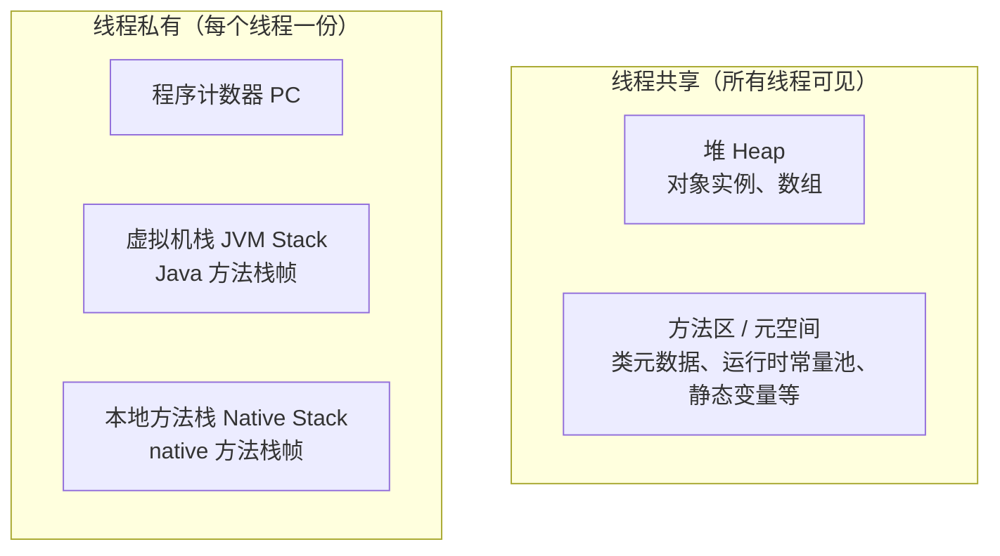

HotSpot 具体实现上还会有：

- **代码缓存（Code Cache）**：存 JIT 编译后的机器码；
- **直接内存（Direct Memory）**：JVM 进程向 OS 申请的堆外内存，不在上述规范区域内，但异常经常“混在一起”。

先做一个“一句话速记”：

- 堆（Heap）：**绝大多数对象的家**，GC 的主战场；
- 方法区 / 元空间：**类长什么样**的信息，以及部分常量、静态变量；
- 虚拟机栈：** Java 方法调用现场**，一个方法一个栈帧；
- 本地方法栈：`native` 方法用的栈；
- 程序计数器：当前线程执行到哪条字节码；
- 直接内存：堆外大块内存，NIO / Netty / 某些中间件常用。

后面所有和 “OOM”、“GC”、“栈溢出”、“类加载太多” 相关的问题，都可回到这张图上定位。

------

## 3.2 堆（Heap）：对象的主要居所

### 3.2.1 堆是什么？

- 所有线程**共享**的一块内存区域；
- Java 中「几乎所有对象实例和数组」都在堆上分配；
- 是 GC 的主要管理范围；
- 可以通过 `-Xms` `-Xmx` 指定堆大小限制。

示意图：

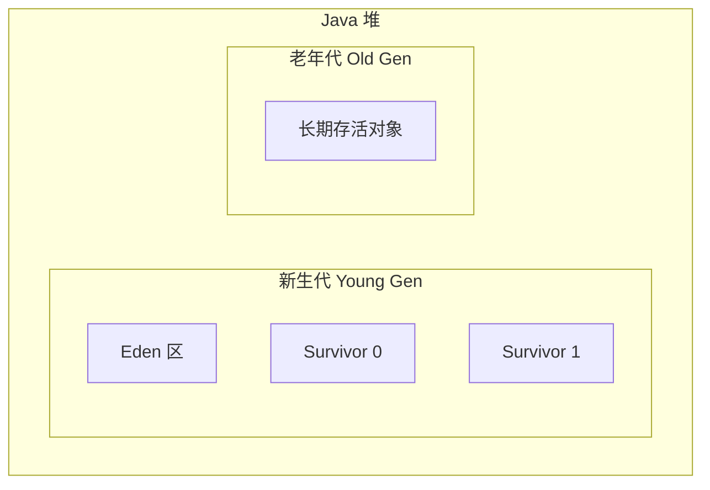

------

### 3.2.2 新生代 / 老年代：为什么要“分代”？

GC 的一个基本经验（“弱分代假说”）：

> 大多数对象“朝生夕死”，只有少数对象会存活较长时间。

基于这个经验，HotSpot 在堆上做了“分代”设计：

- **新生代（Young Generation）**
  - 新对象大多先在这里分配；
  - 又分为：
    - Eden 区：绝大多数新对象第一次分配的位置；
    - Survivor0 / Survivor1：幸存者区，复制算法使用；
  - 垃圾回收多采用**复制算法**（效率高，适合“死得多”的场景）；
  - 回收动作叫 **Minor GC / Young GC**。
- **老年代（Old Generation）**
  - 经过多次 Minor GC 仍然存活、或大对象（根据策略）会晋升到老年代；
  - 对象死亡比例相对低，回收采用 **标记-整理** 或 **标记-清除** 算法；
  - 回收动作通常涉及整堆，停顿时间相对长，称为 **Major GC / Full GC**（实现中含义略有差异）。

分代的好处：

- 把大部分回收压力集中在新生代，用高效的复制算法；
- 尝试减少老年代回收的频率和停顿时间。

------

### 3.2.3 对象分配与 TLAB（Thread Local Allocation Buffer）

HotSpot 上的对象分配大致过程：

1. 在线程本地分配缓冲区（TLAB）上“指针碰撞”：

   - 每个线程在新生代 Eden 划出一小块区域作为自己的 TLAB；
   - 分配对象只需要**移动指针**，无需多线程竞争锁；
   
2. TLAB 用完：

   - 向 Eden 再申请一块新的 TLAB；

3. Eden 空间不足：

   - 触发一次 Minor GC。

示意图：

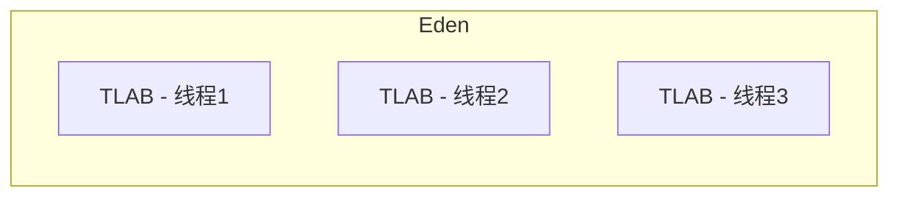

你只需要记住：

- **对象分配非常快**：多数场景就是在一块连续内存上挪指针；
- **多线程分配也很快**：TLAB 避免了大部分锁竞争；
- 当你看到 GC 日志里频繁的 Minor GC，很可能就是：
  - Eden 太小；
  - 对象创建“风暴”（临时对象特别多）。

------

### 3.2.4 堆相关的常见错误与参数

典型错误信息：

- ```
  java.lang.OutOfMemoryError: Java heap space
  ```

  - 通常说明堆空间不够；
  - 也可能是有内存泄漏（对象被引用住，GC 无法回收）。

关键参数（HotSpot）：

```bash
# 设置堆初始大小 & 最大大小
-Xms2g
-Xmx2g

# 新生代大小（JDK8）
-Xmn512m

# JDK8 中，也可以通过比例控制
-XX:NewRatio=3    # 老年代:新生代=3:1

# JDK8 之后，用 G1 时更多通过其他参数控制，不一定直接设 -Xmn
```

调优思路（简化版）：

- 堆太小：
  - 频繁 Full GC / OOM；
  - 解决：合理加大堆、直至达到机器/容器上限；
- 堆过大：
  - Full GC 一次就要停很久（传统收集器下明显）；
  - 容器环境可能被 OS OOM Kill。

后续 GC 章节会基于这块继续展开。

------

## 3.3 虚拟机栈（JVM Stack）：每个线程自己的“调用现场”

### 3.3.1 什么是虚拟机栈？

- 每个 Java 线程启动时，都会创建一个与之对应的 **虚拟机栈**；
- 每执行一个 Java 方法，就会创建一个 **栈帧（Stack Frame）** 入栈；
- 方法执行完毕，栈帧弹出，局部变量等随之销毁。

示意图：

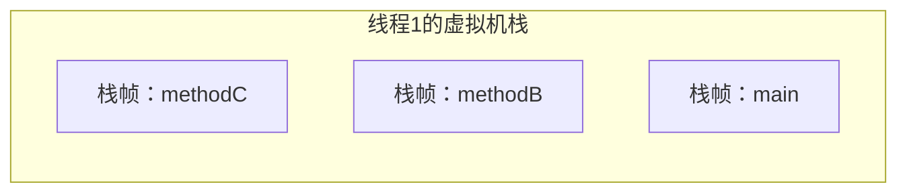

当你在代码里这样调用：

```java
public void a() {
    b();
}

public void b() {
    c();
}

public void c() {
    // ...
}
```

在某一时刻，线程的虚拟机栈上，栈帧顺序近似为：

- `main` → `a` → `b` → `c`（顶部是当前执行的 `c`）。

------

### 3.3.2 栈帧结构：局部变量表、操作数栈等

一个栈帧主要包含：

- **局部变量表（Local Variables）**

  - 存储方法参数、局部变量；
  - 用“槽（slot）”来表示，每个 slot 对应 32 位；
  - `long` / `double` 类型会占用 2 个 slot。

- **操作数栈（Operand Stack）**
- 大部分字节码指令是“操作栈风格”的：
  
  - 指令从局部变量表或常量池中取值，压入栈顶；
  - 运算后结果再压栈或写回局部变量表。

- **动态链接（Dynamic Linking）**

  - 指向当前方法所在类的运行时常量池的引用；
  - 用于支持方法调用、字段访问令牌在运行时的解析。

- **返回地址（Return Address）**

  - 方法结束时，需要返回到上一个栈帧哪里继续执行。

这块内容在后续讲字节码（第 4 章）和 JIT 优化时会更直观，现在只需要有个印象：
**栈帧就是一次方法调用的“运行现场快照”。**

------

### 3.3.3 StackOverflowError vs OutOfMemoryError（栈相关）

与虚拟机栈 & 本地栈相关的常见异常有两种：

1. `java.lang.StackOverflowError`
2. `java.lang.OutOfMemoryError: unable to create new native thread`（或类似）

#### a. StackOverflowError：单个线程栈太深

场景典型如：递归过深 / 无限递归，例如：

```java
public class StackOverflowDemo {
    private static int depth = 0;

    public static void recursive() {
        depth++;
        recursive();
    }

    public static void main(String[] args) {
        try {
            recursive();
        } catch (Throwable e) {
            System.out.println("Depth: " + depth);
            e.printStackTrace();
        }
    }
}
```

特点：

- 当前线程的虚拟机栈空间被用完了；
- 报错：`java.lang.StackOverflowError`；
- 调整方式：
  - 优化递归逻辑；
  - 或适当调大栈容量：`-Xss1m`（每个线程栈大小）。

#### b. unable to create new native thread：线程太多，栈整体撑爆

底层上，每个线程（Java 线程 ↔ OS 线程）都会分配一块栈空间；

- 当你创建太多线程时，系统总栈空间 / 进程可用地址空间被用尽；
- JVM 无法再为新线程分配栈，就会抛出：
  - `java.lang.OutOfMemoryError: unable to create new native thread` 或类似信息。

常见于：

- 线程池参数配置不当；
- 误用 `new Thread()` 频繁创建大量线程。

------

## 3.4 本地方法栈（Native Method Stack）

本地方法栈的功能和虚拟机栈类似，只不过：

- 服务于 **native 方法（JNI 调用）**；
- 线程私有，每个线程一个；
- HotSpot 实现中经常将“虚拟机栈 + 本地方法栈”视为统一的结构来实现，规范上是分开的。

典型异常与虚拟机栈类似：

- 栈深度过深 → `StackOverflowError`；
- 无法为新线程分配栈空间 → `OutOfMemoryError`。

对日常开发的影响：

- 当你大量使用 JNI（如高性能 IO、图像处理、本地库），
  如果出现 native 层崩溃、栈溢出，很可能和本地栈实现有关（一般需要看 `hs_err_pid*.log`）。

------

## 3.5 方法区 / 元空间（Metaspace）：类长什么样，放哪儿？

### 3.5.1 方法区是什么？

JVM 规范中的**方法区（Method Area）**是一个逻辑概念：

> 用于存储已被虚拟机加载的**类型信息、常量、静态变量、JIT 编译后的代码**等数据。

HotSpot 的实现经历了一个演进过程：

- JDK 6 / 7：
  - 使用 **永久代（PermGen）** 作为方法区实现的一部分（在堆里）；
- JDK 8+：
  - 去掉永久代，引入 **元空间（Metaspace）**（使用本地内存）；
  - 类元数据放在 Metaspace，字符串常量池等搬回堆或其他区域。

你可以简单理解为：

- 以前：**类信息在堆里**（PermGen），轻易就 `PermGen space` OOM；
- 现在：**类信息在堆外**（Metaspace），配置得不好就 `Metaspace` OOM。

------

### 3.5.2 从 PermGen 到 Metaspace：为什么要改？

永久代（PermGen）的几个问题：

1. 大小难以设置：
   - 设小了，类多一点或有动态代理，就容易 `OutOfMemoryError: PermGen space`；
   - 设大了，又会挤占堆的空间；
2. 和 HotSpot 实现强绑定：
   - 其他 JVM 实现（如 JRockit）并没有永久代概念；
   - 它更像是 HotSpot 特有的“历史包袱”。

Metaspace 的改动：

- 使用本地内存（Native Memory）来存储类元数据；
- 通过 `-XX:MaxMetaspaceSize` 控制上限；
- 默认情况下会按需增长，直到耗尽系统内存或达到上限。

配置示例（JDK8+）：

```bash
# 元空间初始大小 & 最大值
-XX:MetaspaceSize=128m
-XX:MaxMetaspaceSize=512m
```

JDK7 及之前（已过时，但老项目/老面试题仍会出现）：

```bash
# 永久代大小
-XX:PermSize=128m
-XX:MaxPermSize=256m
```

------

### 3.5.3 方法区里放了什么？对业务有什么影响？

典型内容：

- 类的结构信息：
  - 类名、父类、接口；
  - 字段、方法信息；
  - 方法字节码等；
- 运行时常量池；
- 静态变量（实现中有一定细微差别，这里不深究）；
- JIT 编译后的代码（HotSpot 用单独的 Code Cache 管理，但也可以视作“方法区扩展”）。

实际影响最大的场景：

1. 动态生成大量类 / 频繁加载卸载类
   - 如：框架的动态代理（CGLIB）、字节码增强、模板引擎等；
   - 热部署、插件系统（每次重新加载都会加载新类）；
   - 容器中多应用部署（每个应用自己的 ClassLoader）。

如果类加载了但对应的 ClassLoader 始终被引用着，就可能产生：

- Metaspace 无法回收 → 内存持续增长 → `OutOfMemoryError: Metaspace`。

------

## 3.6 运行时常量池：类和字符串的“常量仓库”

### 3.6.1 常量池 & 运行时常量池

在 Class 文件结构里，有一个重要区域叫 **常量池（Constant Pool）**：

- 存储各种字面量：
  - 字符串常量、整数、浮点数等；
- 以及符号引用：
  - 类和接口的完全限定名；
  - 字段名与描述符；
  - 方法名与描述符。

当类被加载后：

- 这些常量会被放入 **运行时常量池（Runtime Constant Pool）**；
- 运行时常量池是方法区的一部分（JVM 规范层面）。

------

### 3.6.2 字符串常量池的演化（JDK6 / 7 / 8）

Java 对字符串做了大量特殊优化，其中最重要的一点：

> 维护一个**字符串常量池**，相同字面量的 String 对象可以被复用。

在不同版本里的差异：

- **JDK6 及之前**
  - 字符串常量池位于 **永久代（PermGen）** 中；
  - 动态调用 `String.intern()`，新字符串会加入 PermGen 中的常量池；
  - 如果大量使用 `intern()`，很容易 `OutOfMemoryError: PermGen space`。
- **JDK7 之后**
  - 字符串常量池从方法区搬到了 **堆** 上；
  - `intern()` 会把引用指向堆中已有的字符串对象；
  - 大量 `intern()` 引起的 OOM 表现为：`Java heap space`，而不是 PermGen。

简单验证示例（行为在 JDK6/7 有差异）：

```java
public class StringInternDemo {
    public static void main(String[] args) {
        String s1 = new StringBuilder("he").append("llo").toString();
        System.out.println(s1.intern() == s1); // JDK7+ 通常是 true

        String s2 = new StringBuilder("ja").append("va").toString();
        System.out.println(s2.intern() == s2); // 可能是 false，因为 "java" 早已存在
    }
}
```

记住两点即可：

1. JDK7+：字符串常量池在 **堆** 上，不在元空间；
2. 如果你用 `intern()` 做“字符串去重”，要小心堆 OOM。

------

## 3.7 直接内存（Direct Memory）与 NIO：堆外的那块“看不见的”内存

### 3.7.1 直接内存是什么？

直接内存（Direct Memory）并不在 JVM 规范的运行时数据区内，它属于：

- JVM 进程向操作系统申请的一块 **堆外内存（off-heap）**；
- 普通 Java 对象访问不到，只能通过特定 API（如 NIO 的 `ByteBuffer.allocateDirect`）来操作。

优点：

- 避免在 Java 堆 ↔ Native 堆之间来回复制数据；
- 适合大量 IO / 网络通信场景（如 NIO、Netty）。

------

### 3.7.2 NIO 与 DirectByteBuffer

典型用法：

```java
import java.nio.ByteBuffer;

public class DirectBufferDemo {
    public static void main(String[] args) {
        // 堆内缓冲区
        ByteBuffer heapBuffer = ByteBuffer.allocate(1024);

        // 直接缓冲区（堆外）
        ByteBuffer directBuffer = ByteBuffer.allocateDirect(1024);
    }
}
```

- `allocate()`：在 **堆内** 分配，受堆大小限制；
- `allocateDirect()`：在 **直接内存** 分配，受 `MaxDirectMemorySize` 和系统内存限制。

在 HotSpot 中，直接内存的上限可通过参数指定：

```bash
-XX:MaxDirectMemorySize=1g
```

如果不指定，通常默认值约等于堆最大值（不同版本略有差异）。

------

### 3.7.3 Direct Memory OOM：堆还很空，为什么也 OOM？

典型异常信息：

- `java.lang.OutOfMemoryError: Direct buffer memory`

这是一个非常常见但又容易被误解的错误：

- 你可能用 `jmap` / `jstat` 看堆，发现还很空；
- 甚至还有很多老年代空间未用；
- 但应用就是 OOM 了 —— 因为挂的是堆外的 Direct Memory。

常见原因：

1. 频繁创建 DirectByteBuffer，但没及时释放引用
   - DirectBuffer 的释放依赖于 GC 到达其 Java 包装对象（PhantomReference + Cleaner）；
   - 如果应用持有大量 DirectBuffer 引用，或 GC 回收不及时，就会堆积；
2. 容器内内存限制被忽视
   - 容器（Docker/K8s）限制了进程总内存；
   - 你只给 JVM 配了 `-Xmx`，忘了 Direct Memory 还会占系统内存；
   - 合起来超过限制，就会被系统 OOM Kill。

排查建议：

- 注意 GC 日志 & 系统 `dmesg`/监控；
- 使用 `-XX:MaxDirectMemorySize` 主动限制直接内存大小；
- 使用 Netty 等框架时，了解其内存池策略，避免无节制创建直接缓冲区。

------

## 小结：把这张“地形图”刻在脑子里

本章把 JVM 的运行时数据区做了一次系统梳理，你可以用下面这张综合图做一个“压缩版记忆”：

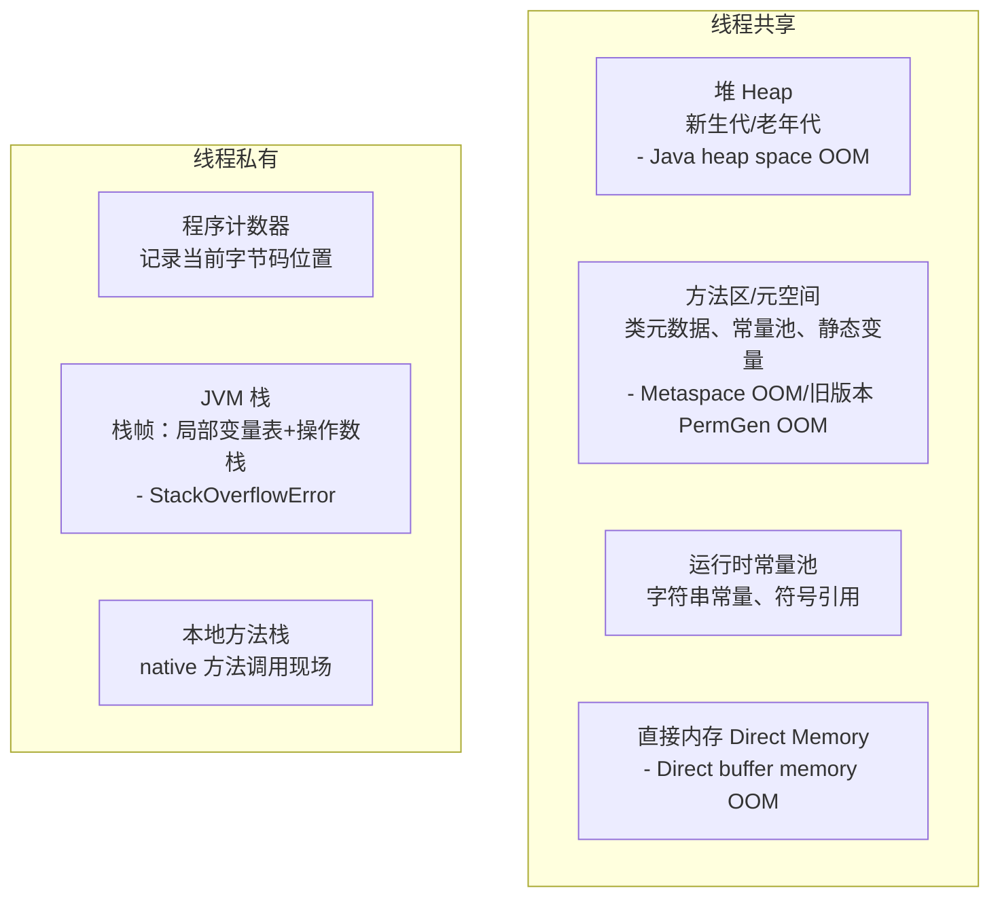

建议至少能做到：

1. 碰到各种 OOM / 栈溢出时，能够在图上**立刻指出大概是哪一块出了问题**；
2. 知道堆、新生代/老年代、Metaspace、直接内存的**基本用途和典型异常**；
3. 后面在学 GC、对象分配、类加载、NIO 时，都能把知识挂到这张图上。

下一章（第 4 章），我们会从“磁盘上的 `.class` 文件”开始，讲清楚 **Class 文件结构和字节码指令**，也就是“JVM 到底在执行什么东西”。

# （四）类文件结构与字节码基础：从 .class 开始剖 JVM

> 本章目标：  
> - 知道 `.class` 里面到底存了什么（Class 文件结构）  
> - 大致看懂一段 `javap` 输出（常量池 & 字节码）  
> - 理解 JVM 是一台**基于栈的虚拟机**，字节码如何操作操作数栈  
> - 对 `invokedynamic` 有一个“知道它干嘛”的初步认识

---

## 4.1 Class 文件整体结构鸟瞰

当你写完 Java 代码，执行：

```bash
javac Hello.java
```

会生成一个 `.class` 文件。
从 JVM 的角度，这个文件就是一段**按规范组织的二进制结构**，结构大致如下：

```tex
ClassFile {
    u4             magic;                 // 魔数，固定是 0xCAFEBABE
    u2             minor_version;         // 次版本号
    u2             major_version;         // 主版本号
    u2             constant_pool_count;   // 常量池大小
    cp_info        constant_pool[...];    // 常量池表
    u2             access_flags;          // 访问标志（public、final 等）
    u2             this_class;            // 当前类
    u2             super_class;           // 父类
    u2             interfaces_count;      // 实现的接口数量
    u2             interfaces[...];       // 接口表
    u2             fields_count;          // 成员变量数量
    field_info     fields[...];           // 字段表
    u2             methods_count;         // 方法数量
    method_info    methods[...];          // 方法表
    u2             attributes_count;      // 属性数量（类级别）
    attribute_info attributes[...];       // 属性表
}
```

可以把它类比为一个「自描述二进制文件」：

- 开头的魔数 & 版本号告诉 JVM：
  “我是一个合法的 Class 文件，版本是 52.0（即 JDK8）”；
- 常量池区像一个“字面量 & 符号引用的大字典”；
- 字段表 / 方法表描述类有哪些变量、方法；
- 属性表是一个扩展机制，很多调试信息、注解、泛型签名、字节码本身都以 attribute 的形式出现。

------

### 4.1.1 快速看一眼十六进制长什么样

写一个极简类：

```java
// Hello.java
public class Hello {
    private int x = 1;

    public int add(int a, int b) {
        return a + b;
    }
}
```

编译后用十六进制打开 `Hello.class`（这里只截一小部分做感受）：

```tex
CA FE BA BE 00 00 00 34 00 0D 0A 00 03 00 0A 07
00 0B 07 00 0C 01 00 01 78 01 00 01 49 01 00 06
<...省略...>
```

- `CA FE BA BE` 就是魔数；
- `00 00 00 34` 表示版本（这里是 52，即 JDK8：`0x0034`）；
- 后面紧跟着的是常量池等内容。

实际开发中**不需要手撸十六进制**，我们更常用的是 `javap`。

------

### 4.1.2 用 javap 看 Class 结构

`javap` 是 JDK 自带的反汇编工具，常用参数：

```bash
# 反编译，展示字节码指令
javap -c Hello

# 展示详细信息（版本、常量池、字段、方法、属性）
javap -v Hello
```

示例（节选输出）：

```bash
$ javap -v Hello
Classfile /.../Hello.class
  Last modified 2025-1-1; size 404 bytes
  MD5 checksum ...
  Compiled from "Hello.java"
public class Hello
  minor version: 0
  major version: 52
  flags: ACC_PUBLIC, ACC_SUPER
Constant pool:
   #1 = Methodref          #4.#16         // java/lang/Object."<init>":()V
   #2 = Fieldref           #3.#17         // Hello.x:I
   #3 = Class              #18            // Hello
   #4 = Class              #19            // java/lang/Object
   ...
{
  public Hello();
    descriptor: ()V
    flags: ACC_PUBLIC
    Code:
      stack=2, locals=1, args_size=1
         0: aload_0
         1: invokespecial #1                  // Method java/lang/Object."<init>":()V
         4: aload_0
         5: iconst_1
         6: putfield      #2                  // Field x:I
         9: return
  ...

  public int add(int, int);
    descriptor: (II)I
    flags: ACC_PUBLIC
    Code:
      stack=2, locals=3, args_size=3
         0: iload_1
         1: iload_2
         2: iadd
         3: ireturn
}
```

这一段里，已经能看到：

- Class 文件版本、访问标志；
- 常量池的若干条目（`#1 Methodref`、`#2 Fieldref` 等）；
- 构造方法和 `add` 方法对应的字节码指令。

接下来我们分别把「常量池」和「字节码指令」拆开讲清楚。

------

## 4.2 常量池：Class 文件的“大字典”

常量池（Constant Pool）是 Class 文件中**最核心的结构之一**，它存了：

- 字面量（String、int、float、double 等常量）
- 各种“符号引用”（类名、方法名和描述符、字段名等）

可以理解为：**字节码里不会直接 hardcode 各种字符串/签名，而是用对常量池的索引来间接引用**。

------

### 4.2.1 常见常量池项类型

常量池是一个数组，数组元素类型是 `cp_info`，不同类型用 tag 区分。
常见的几种（只列开发中常遇到的）：

| 常量类型                    | tag 值 | 描述                                         |
| --------------------------- | ------ | -------------------------------------------- |
| CONSTANT_Class              | 7      | 类或接口的符号引用                           |
| CONSTANT_Fieldref           | 9      | 字段的符号引用                               |
| CONSTANT_Methodref          | 10     | 普通方法的符号引用                           |
| CONSTANT_InterfaceMethodref | 11     | 接口方法的符号引用                           |
| CONSTANT_String             | 8      | 字符串常量                                   |
| CONSTANT_Integer            | 3      | int 常量                                     |
| CONSTANT_Float              | 4      | float 常量                                   |
| CONSTANT_Long               | 5      | long 常量                                    |
| CONSTANT_Double             | 6      | double 常量                                  |
| CONSTANT_NameAndType        | 12     | 字段或方法的名称和描述符对                   |
| CONSTANT_Utf8               | 1      | UTF-8 编码的字符串（类名、方法名、描述符等） |
| CONSTANT_MethodHandle       | 15     | 方法句柄（主要配合 invokedynamic）           |
| CONSTANT_MethodType         | 16     | 方法类型（invokedynamic 相关）               |
| CONSTANT_InvokeDynamic      | 18     | invokedynamic 的引导信息                     |

你可以先记住三大类：

1. **原始字面量**：`Integer/Float/Long/Double/String`

2. 符号引用：

   - 类：`Class`
   - 方法：`Methodref` / `InterfaceMethodref`
   - 字段：`Fieldref`
   
3. 名称 & 描述符相关：

   - `Utf8`：实际上是各种“字符串”基础
- `NameAndType`：把名字和类型配对

------

### 4.2.2 一个常量池小例子

继续用上面的 Hello 类，`javap -v` 中的常量池节选：

```tex
Constant pool:
   #1 = Methodref          #4.#16         // java/lang/Object."<init>":()V
   #2 = Fieldref           #3.#17         // Hello.x:I
   #3 = Class              #18            // Hello
   #4 = Class              #19            // java/lang/Object
   #5 = Utf8               x
   #6 = Utf8               I
   #7 = Utf8               <init>
   #8 = Utf8               ()V
   #9 = Utf8               Code
  #10 = Utf8               LineNumberTable
  #11 = Utf8               LocalVariableTable
  #12 = Utf8               this
  #13 = Utf8               LHello;
  #14 = Utf8               add
  #15 = Utf8               (II)I
  #16 = NameAndType        #7:#8          // "<init>":()V
  #17 = NameAndType        #5:#6          // x:I
  #18 = Utf8               Hello
  #19 = Utf8               java/lang/Object
```

你可以看到几类关系：

- `#3 = Class #18` 和 `#18 = Utf8 Hello`
  → 说明“有一个名为 Hello 的类”。
- `#1 = Methodref #4.#16`，再看：
  - `#4 = Class #19`，`#19 = Utf8 java/lang/Object`
  - `#16 = NameAndType #7:#8`，`#7 = Utf8 <init>`，`#8 = Utf8 ()V`
    → 合起来就是：引用了 `java/lang/Object` 的 `<init>()V` 方法（构造器）。
- `#2 = Fieldref #3.#17`，再看：
  - `#3 = Class #18` → Hello
  - `#17 = NameAndType #5:#6` → `x:I`
    → 表示类 Hello 的 `int x` 字段。

你可以把常量池理解为一张“**多跳索引表**”，id 对 id，最后落到 Utf8 上。

用一张简化的关系图表示：

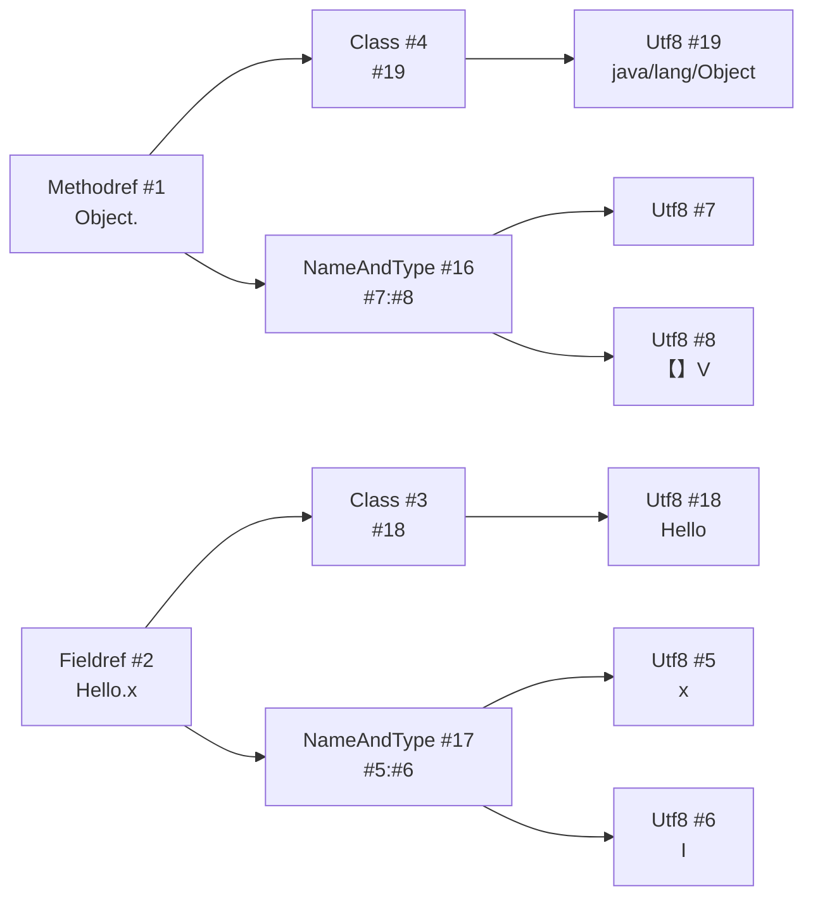

理解常量池的意义在于：

- 看字节码时各种 `#1`、`#2` 都是指向常量池的索引；
- GC 和类加载、动态链接时都会频繁用到常量池里的符号引用。

------

## 4.3 字节码指令集概览：基于栈的虚拟机

JVM 是一台**基于栈的虚拟机**（stack-based VM），这句话的意思是：

> 字节码指令大多数操作的是“**操作数栈**”，而不是像 CPU 指令那样操作寄存器。

特征主要有两点：

1. 指令集紧凑：
   - 大多数指令是 1 字节 opcode + 若干操作数；
2. 操作风格统一：
   - `iload` 把局部变量表中的 int 值压栈；
   - `iadd` 从栈顶弹出两个 int，相加，再把结果压回栈顶；
   - `ireturn` 从栈顶弹出返回值。

------

### 4.3.1 指令的一般形式

```tex
<opcode> [operand1] [operand2] ...
```

例如：

- `bipush 10`：
  - `bipush` 是一个 opcode，表示“把一个字节常量压入栈”；
  - `10` 是操作数。
- `iload_1`：
  - 不带额外操作数，含义是“从局部变量表槽位 1 取一个 int 压栈”。

------

### 4.3.2 常见的指令分类

不用全部记住，只要对主要类别有感知：

1. **加载 / 存储**
   - `iload`, `iload_0`, `aload_0` …
   - `istore`, `astore` …
2. **栈操作**
   - `pop`, `dup`, `dup2`, `swap` …
3. **算术运算**
   - `iadd`, `isub`, `imul`, `idiv` …
   - `ladd`, `fadd`, `dadd` 分别对应 long/float/double。
4. **类型转换**
   - `i2l`, `i2f`, `i2d`, `l2i` …
5. **对象相关**
   - `new`, `getfield`, `putfield`, `getstatic`, `putstatic`
   - `checkcast`, `instanceof` …
6. **控制转移**
   - 条件跳转：`ifeq`, `ifne`, `if_icmpeq`, `ifnonnull` …
   - 无条件跳转：`goto`
   - 多分支：`tableswitch`, `lookupswitch`
7. **方法调用 & 返回**
   - `invokestatic`：调用静态方法
   - `invokevirtual`：调用实例方法，基于虚方法分派
   - `invokespecial`：调用构造器、私有方法、父类方法
   - `invokeinterface`：调用接口方法
   - `invokedynamic`：延迟到运行时的动态调用（后面 4.5 部分专讲）
8. **异常处理相关**
   - `athrow`：抛出异常
   - 异常表由 attribute 表描述，字节码中出现了异常抛出并不意味着你能看见 try/catch 的所有逻辑（异常处理结构在方法属性中）。

掌握这些门类后，再配合 `javap -c`，你就能比较轻松地“读懂”JVM 在执行什么。

------

## 4.4 常见字节码示例解析：用 javap 走读

我们通过几段简短代码，看一下字节码编译后的样子，以及如何解读。

### 4.4.1 一个最简单的加法方法

代码：

```java
public class BytecodeDemo {
    public int add(int a, int b) {
        return a + b;
    }
}
```

编译 & 反汇编：

```bash
javac BytecodeDemo.java
javap -c BytecodeDemo
```

输出节选：

```tex
public int add(int, int);
  Code:
     0: iload_1
     1: iload_2
     2: iadd
     3: ireturn
```

逐行解释：

- `iload_1`：把局部变量表中索引 1 的 int 压入操作数栈（参数 a）。
- `iload_2`：把索引 2 的 int 压栈（参数 b）。
- `iadd`：从栈顶弹出两个值，相加，把结果压回栈顶。
- `ireturn`：从栈顶弹出一个 int，作为返回值。

局部变量表布局（非 static 实例方法）大致是：

| 索引 | 含义         |
| ---- | ------------ |
| 0    | this         |
| 1    | 参数 a (int) |
| 2    | 参数 b (int) |

------

### 4.4.2 if 条件与分支：控制流是怎么编译的？

代码：

```java
public int max(int a, int b) {
    if (a >= b) {
        return a;
    } else {
        return b;
    }
}
```

`javap -c`：

```tex
public int max(int, int);
  Code:
     0: iload_1
     1: iload_2
     2: if_icmplt     9
     5: iload_1
     6: ireturn
     7: iload_2
     8: ireturn
     9: iload_2
    10: ireturn
```

> 不同编译器/优化选项可能生成略有不同的字节码，这里以一种常见情况说明思路。

这里比较典型的形式是：

- ```
  if_icmplt 9
  ```

  - 含义：如果 `栈顶第二个 < 栈顶第一个`，则跳转到 offset=9；
  - 也就是如果 `a < b`，走 else 分支。

一个更直观的写法（实际字节码可能更精简，这里只是近似理解）：

```tex
0: iload_1        // 压入 a
1: iload_2        // 压入 b
2: if_icmplt 9    // if (a < b) goto 9
5: iload_1        // a >= b，返回 a
6: ireturn
9: iload_2        // a < b，返回 b
10: ireturn
```

你可以观察到：

- `if_xxx` 系列都是**条件跳转指令**；
- `goto` 用于无条件跳转（循环、后续逻辑跳过等）。

------

### 4.4.3 循环：for/while 是如何展开的？

代码：

```java
public int sumToN(int n) {
    int sum = 0;
    for (int i = 1; i <= n; i++) {
        sum += i;
    }
    return sum;
}
```

`javap -c`：

```tex
public int sumToN(int);
  Code:
     0: iconst_0
     1: istore_2        // sum = 0
     2: iconst_1
     3: istore_3        // i = 1
     4: iload_3
     5: iload_1
     6: if_icmpgt     19   // if (i > n) goto 19
     9: iload_2
    10: iload_3
    11: iadd
    12: istore_2        // sum += i
    13: iinc          3, 1  // i++
    16: goto          4
    19: iload_2
    20: ireturn
```

可以看到 for 循环概念上被翻译为：

1. 初始化 `sum`、`i`；
2. 先判断条件（`i > n` 结束）；
3. 循环体执行；
4. `i++`；
5. `goto 4` 回到条件判断。

你如果写 while，大致也是同样的结构，只是初始化 & 条件判断位置略有不同。

------

### 4.4.4 方法调用：invokevirtual / invokestatic / invokespecial

示例代码：

```java
public class InvokeDemo {
    public static int staticAdd(int a, int b) {
        return a + b;
    }

    public int instanceAdd(int a, int b) {
        return a + b;
    }

    public void call() {
        int r1 = staticAdd(1, 2);
        int r2 = instanceAdd(3, 4);
    }
}
```

`javap -c` 中 `call()` 的字节码（节选）：

```tex
public void call();
  Code:
     0: iconst_1
     1: iconst_2
     2: invokestatic  #2  // Method staticAdd:(II)I
     5: istore_1
     6: aload_0
     7: iconst_3
     8: iconst_4
     9: invokevirtual #3  // Method instanceAdd:(II)I
    12: istore_2
    13: return
```

解释：`invokestatic`调用静态方法：

- 不需要 `this`，直接用类 + 方法描述符找到目标实现；

- `invokevirtual`调用实例方法：
  - 需要先把 `this`（`aload_0`）压栈；
  - 然后根据“虚方法分派规则”在实际对象的类型上找方法实现。

其他还有：

- `invokespecial`：调用构造器、`super.xxx()`、private 方法等；
- `invokeinterface`：调用接口方法，涉及接口方法表查找；
- `invokedynamic`：动态语言 & Lambda 的关键，下一节专门说。

------

## 4.5 invokedynamic 简述：为 Lambda 与动态语言铺路

`invokedynamic` 是在 Java 7 引入的一条新字节码指令，目的不是为了 Java 自己，而是：

> 为 JVM 上跑的**动态类型语言**（如 JRuby、Groovy 等）提供一个更灵活、高效的调用机制。

后来，JDK 8 的 **Lambda 表达式** 也大量使用了 `invokedynamic`。

------

### 4.5.1 传统的 4 种调用指令的局限

- `invokestatic`：静态绑定（编译期就知道目标方法）
- `invokevirtual` / `invokeinterface`：基于对象类型的虚方法分派
- `invokespecial`：构造器、私有方法、super 调用

这些调用方式的特点：

- **调用目标在编译期基本确定**（最多是虚方法表查找）；
- 不太适合动态语言那种：
  - 运行时改变方法绑定；
  - 根据调用上下文决定调用逻辑的场景。

------

### 4.5.2 invokedynamic 的思路：延迟绑定

`invokedynamic` 把「调用目标的确定」推迟到**第一次执行时**，并通过一个“引导方法（Bootstrap Method）”来完成绑定。

简单理解：

1. 字节码里有一条 `invokedynamic`，指向常量池里的某个 `InvokeDynamic` 项；

2. `InvokeDynamic` 项包含一个“引导方法句柄 + 调用点描述信息”；

3. 第一次执行到这条`invokedynamic`时：

   - JVM 调用引导方法（bootstrap method），交给它来决定：
     - 实际要调用哪个方法实现、用什么调用句柄（`MethodHandle`）；
   
4. 之后再次执行这个调用点时，可以直接使用缓存好的调用句柄，性能接近其他几种调用指令。

示意（非常简化）：

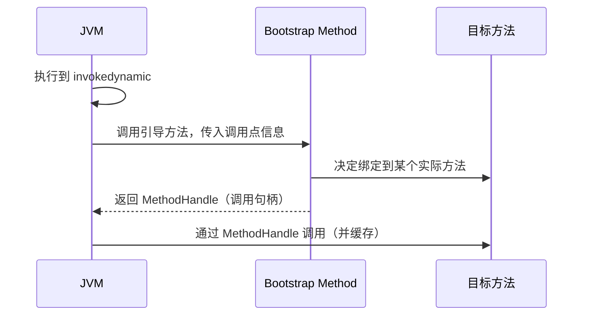

------

### 4.5.3 Lambda 与 invokedynamic（只做直观感知）

写一段 Lambda 代码：

```java
public class LambdaDemo {
    public static void main(String[] args) {
        Runnable r = () -> System.out.println("Hello Lambda");
        r.run();
    }
}
```

JDK8 之后，用 `javap -c -v LambdaDemo`，会在常量池中看到类似：

```tex
#... = InvokeDynamic #0:run()Ljava/lang/Runnable;
```

以及类中生成了一个静态引导方法：

```tex
private static java.lang.Runnable lambda$main$0();
```

整体流程（简化）大概是：

1. 编译器把 Lambda 表达式编译成 `invokedynamic` 调用；
2. JVM 在第一次执行该调用点时，调用 JDK 提供的引导方法（`LambdaMetafactory.metafactory`）；
3. 根据 Lambda 的目标类型（`Runnable`）、函数式接口方法签名等信息，构造一个合适的对象（可能是合成类实例、`MethodHandle` 等）；
4. 返回给 JVM，绑定到调用点上；
5. 下次执行时直接复用。

你暂时只需要知道两点：

1. **Lambda 并不是简单的“匿名内部类语法糖”**，而是借助了 `invokedynamic` 开放的动态调用机制；
2. `invokedynamic` 为各种动态语言 & 框架（动态代理、字节码增强等）提供了很强的扩展空间。

------

## 小结：理解字节码，对你有什么用？

本章我们从 `.class` 文件结构出发，理解了：

1. Class 文件的基本布局

   - 魔数、版本号、常量池、字段表、方法表、属性表；

2. 常量池是所有符号引用的“大字典”

   - 类、方法、字段、字符串等都在这里索引；

3. JVM 是一个基于栈的虚拟机

   - 字节码主要围绕“局部变量表 + 操作数栈”来运算；
   - 不同的调用指令对应不同的分派语义；
   
4. `invokedynamic` 是为动态语言 & Lambda 提供的**延迟绑定调用机制**。

这对日常开发有什么帮助？

- 看 `javap` 输出，能更准确地理解编译器把你的代码**翻译成了什么执行路径**；
- 做性能分析、调优时，知道某些写法为何容易或难以被 JIT 优化（比如内联失败的原因）；
- 看框架源码（尤其是涉及动态代理、字节码增强、Lambda等场景）时，不再停留在“语法糖表面”。

在接下来的第 5 章，我们会把视角从文件系统 & 字节码，转向 **类加载子系统**：
类是如何被加载（加载 → 验证 → 准备 → 解析 → 初始化），双亲委派为什么存在，框架如何自定义 ClassLoader，实现插件化、隔离等高级玩法。

# （五）类加载子系统：类是怎么被“请进来”的？

> 本章目标：  
> - 搞清楚一个类从 `.class` 到“可以被 new / 调用”的完整生命周期  
> - 明白 **双亲委派模型** 是什么、为什么要这么设计  
> - 认识系统内置的几个重要 ClassLoader 以及如何自定义  
> - 知道哪些典型场景会“打破”双亲委派（SPI、容器、插件系统等）  
> - 能从日志和异常中判断常见类加载问题的成因与排查思路

---

## 5.1 类的生命周期：从“字节码”到“可用类型”

JVM 规范中，一个类从字节码到可以正常使用，大致要经历：

> **加载（Loading） → 验证（Verification） → 准备（Preparation） → 解析（Resolution） → 初始化（Initialization） → 使用（Using） → 卸载（Unloading）**

前 5 个阶段就是通常所说的「类加载过程」，我们用一个图先串起来：


下面逐个拆解（重点是：**哪些阶段和我们日常开发强相关**）。

------

### 5.1.1 加载（Loading）：找到类，读进来

加载阶段做三件事：

1. 通过类的全限定名找到并获取字节流
   - 可能是磁盘上的 `.class` 文件
   - 也可能是 jar 包、网络、内存中生成的字节数组，等等；
2. 将字节流转为 JVM 所需的内部数据结构
   - 在 HotSpot 中，会构造一个 `InstanceKlass` 等结构；
3. **在方法区中生成代表该类的 Class 对象**，并把它与类的内部结构关联。

这部分最直接的体现就是：**ClassLoader 的 `findClass()` / `defineClass()` 等方法**。

------

### 5.1.2 验证（Verification）：别让“坏字节码”搞崩 JVM

JVM 必须保证执行的字节码是“安全”的，否则：

- 一个恶意 / 损坏的 `.class` 完全可以破坏虚拟机的安全性；
- Class 文件可能来自网络、动态生成，很容易出问题。

验证阶段大致会做：

1. **文件格式验证**
   - 魔数是否 `0xCAFEBABE`
   - 版本号是否在 JVM 支持范围
   - 各个结构偏移、长度是否正确等；
2. **元数据验证**
   - 是否有非法父类关系（比如继承 final 类）
   - 是否有不存在的字段/方法引用等；
3. **字节码验证**（最复杂）
   - 操作数栈不会下溢/上溢
   - 类型匹配合法（比如不能把 int 当引用用）
   - 确保不会非法访问私有字段/方法等。

一般只有在：

- 加载「非 javac 编译」的字节码（比如手写/ASM 生成）
- 或者来自不可靠渠道的 `.class`

时，这部分才会真正“踩雷”。

------

### 5.1.3 准备（Preparation）：静态变量分配内存，先给“零值”

准备阶段做两件事：

1. **为类变量（static 字段）分配内存（方法区 / 元空间 + 堆的配合）**；
2. **将这些变量初始化为“零值”**（注意，不是你写的初始值）。

零值示例：

- `int` / `short` / `byte` / `long` → 0 / 0L
- `float` / `double` → 0.0f / 0.0d
- `boolean` → false
- 引用类型 → null

示例：

```java
public class Demo {
    public static int a = 1;
    public static final int B = 2;
}
```

在 **准备阶段**：

- `a` 会被分配内存，值为 `0`（零值）；
- `B` 一般会被直接“放入常量池”（编译期常量折叠），不会在这里分配一般静态变量那样的内存。

真正把 `a` 设为 1，是在**初始化阶段**。

------

### 5.1.4 解析（Resolution）：符号引用 → 直接引用

前面在第 4 章讲常量池时提到：

> 字节码中引用类、字段、方法，都是通过**符号引用**（如：`java/lang/Object`、`max:(II)I`）来表示的。

解析阶段就是把这些“字符串形式的引用”变成“可以直接找到内存地址的引用”，比如：

- `CONSTANT_Class` → 类的元数据结构指针；
- `CONSTANT_Methodref` → 具体的方法元数据、入口地址；
- `CONSTANT_Fieldref` → 字段在对象内存布局中的偏移等。

注意：**解析可以在初始化前做完，也可以在使用时懒加载（延迟解析）**，具体行为由 JVM 实现 & 参数决定。

------

### 5.1.5 初始化（Initialization）：执行 `<clinit>`，真正的“静态初始化”

初始化阶段干的主要事情：

> 执行类构造器 `<clinit>` 方法（如果有）

这个 `<clinit>` 方法由编译器自动收集 class 中：

- 所有 **静态变量的显式赋值**；
- 所有 **static 代码块**；

按源码出现顺序合并而成。

示例：

```java
public class InitDemo {
    public static int a = 1;
    static {
        a = 2;
        b = 3;
    }
    public static int b = 4;
}
```

生成的大致 `<clinit>` 逻辑顺序是：

1. `a = 1;`
2. `a = 2;`
3. `b = 3;`
4. `b = 4;`

最终：`a = 2, b = 4`。

------

### 5.1.6 什么时候会触发“初始化”？（主动使用 vs 被动使用）

并不是“加载了类就立刻初始化”，规范中定义了**主动使用**（会触发初始化）和“被动使用”（不会）。

典型会触发类初始化的情况：

1. **new 一个类的实例**

   ```java
new A();
   ```

2. **读取或设置类的静态变量**（非 `final` 编译期常量）

   ```java
   System.out.println(A.value);
   A.value = 10;
   ```
   
3. **调用类的静态方法**

   ```java
A.staticMethod();
   ```

4. **通过反射调用类（`Class.forName` 默认会初始化）**

   ```java
Class.forName("com.example.A");
   ```

5. **当类是程序入口（`main` 所在类）**

不会触发初始化（被动使用）的几个常见例子：

1. 通过子类引用父类的静态字段，只触发**父类**初始化，不初始化子类：

   ```java
System.out.println(SubClass.parentValue);
   ```

2. 使用 `A.class` 获取 `Class` 对象：

   ```java
Class<?> clazz = A.class; // 不会初始化
   ```

3. 访问 `static final` 编译期常量：

   ```java
   // B.CONST 在编译期会被“内联”，访问的是使用处的常量，而非类的静态变量
   int x = B.CONST;

理解这一点，在“静态初始化顺序”、“懒加载单例”等问题中非常重要。

------

### 5.1.7 卸载（Unloading）：Class 何时能被回收？

类的卸载条件比较苛刻：

> 某个类要被卸载，前提是 **加载它的 ClassLoader 本身可被回收**，并且
> 这个类的 `Class` 对象没有任何强引用存在。

也就是说：

- 对于应用主类加载器（AppClassLoader）加载的类：
  - 通常随 JVM 生命周期存在，几乎不会被卸载；
- 通常只有在：
  - 使用自定义 ClassLoader 做**模块热替换**、**插件系统**、**应用服务器中 war/ear 卸载**时，
    才会看到类真正被卸载。

反过来：

- 如果你自己写的框架或容器，在卸载模块时：
  - 没有正确断开 ClassLoader 的引用链（比如线程还持有它，或者静态单例引用到类实例），
    就会引起：
  - ClassLoader 无法回收 → 其加载的所有 Class 和相关元数据也无法回收 → Metaspace / 内存泄漏。

------

## 5.2 类加载的三种主要来源：文件、网络、运行时生成

只要你理解：“类加载器负责根据**类名 → 字节流**的映射”，那就很容易想到，字节流可以来自很多地方：

1. **本地磁盘上的 .class 或 jar 文件**
2. **网络**（如 Applet 时代，从 URL 加载）
3. **运行时生成的字节码**（代理类、字节码增强）

示意图：

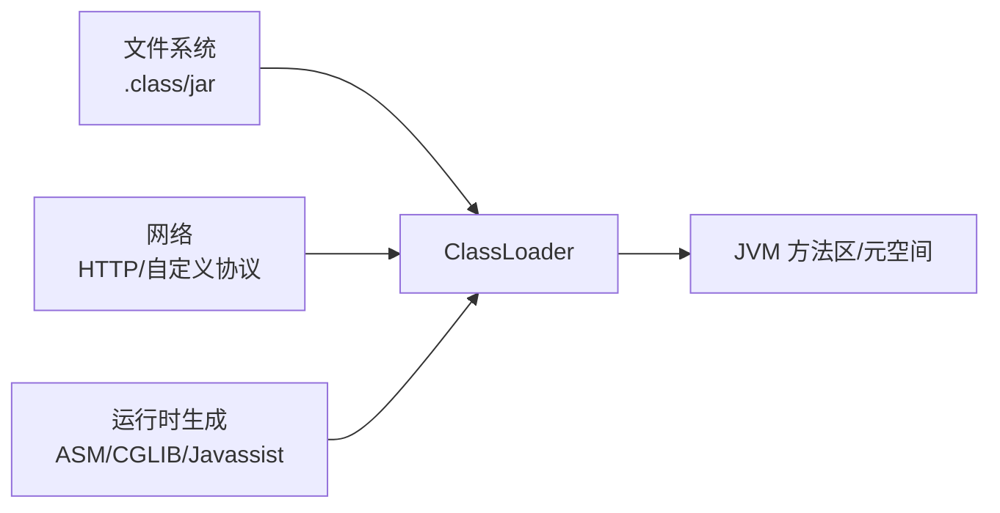

常见例子：

- Spring CGLIB 代理类（`*$EnhancerBySpringCGLIB$*`）；
- MyBatis、Hibernate 等基于字节码增强的 ORM；
- 各种 RPC 框架基于接口动态生成代理 Stub。

> 对我们来说，核心是：
>
> - 这些运行时生成的类 **同样占用 Metaspace**；
> - 若创建过多、又不卸载，容易导致 Metaspace OOM。

------

## 5.3 双亲委派模型：为什么要“先问爸妈”？

所谓双亲委派模型（Parent Delegation Model）就是：

> 每个 ClassLoader 在加载类时，**先把请求交给自己的父 ClassLoader**，
> 只有当父亲说“我也不会”时，自己才尝试加载。

示意图（HotSpot 默认类加载器体系，JDK8 为例）：

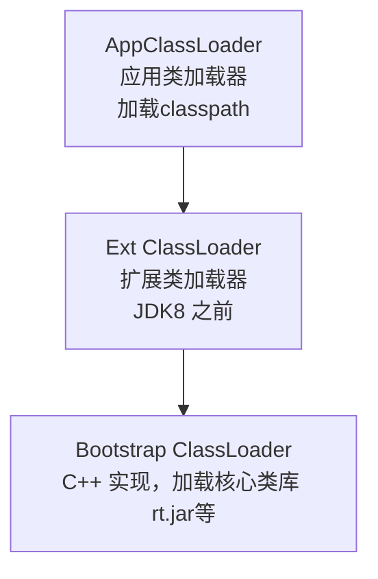

**类加载时的决策流程**（伪代码）：

```java
protected Class<?> loadClass(String name, boolean resolve) {
    // 1. 先检查这个类是否已经被加载过
    Class<?> c = findLoadedClass(name);
    if (c == null) {
        try {
            // 2. 把加载请求委托给父加载器
            if (parent != null) {
                c = parent.loadClass(name, false);
            } else {
                c = findBootstrapClassOrNull(name);
            }
        } catch (ClassNotFoundException e) {
            // 父加载器也加载不了，才轮到自己
        }

        if (c == null) {
            // 3. 自己尝试加载（如从自定义位置找字节码）
            c = findClass(name);
        }
    }
    if (resolve) {
        resolveClass(c);
    }
    return c;
}
```

------

### 5.3.1 为什么要双亲委派？

最重要的目的：**安全 + 一致性**。

1. **避免核心类被“篡改”或“伪装”**

   - 假设没有双亲委派，你可以写一个名为`java.lang.String` 的类，

     如果被你自己的 ClassLoader 先加载，JVM 内部就会出现两个“String”：

     - 一个是 JDK 的，
     - 一个是你的；
     
   - 这会带来巨大混乱和安全隐患。
   
2. **保证基础类库的唯一性**

   - 所有类都会优先使用 Bootstrap ClassLoader 加载的 JDK 类；
   - 避免“同一个全限定类名在同一个 ClassLoader 链中出现多份实现”。

3. **类版本兼容与依赖管理**

   - 上层应用类依赖底层核心库（rt.jar 等），
     通过双亲委派可以确保优先加载底层统一版本。

------

### 5.3.2 “命名空间”的概念：ClassLoader + 类名 才唯一

一个重要结论：

> 在 JVM 里，“是否是同一个类”由 **“ClassLoader 对象 + 全限定类名”** 共同决定。

例如：`Hello`由 AppClassLoader 加载：

- 记为 `(AppClassLoader, com.example.Hello)`；

- 同一个`.class`又由你自定义的 Loader 加载：`(MyClassLoader, com.example.Hello)`。


JVM 认为：

- 这两个是“完全不同的类型”，**不能互相赋值/强转**，否则会 `ClassCastException`。

这在插件系统、容器多应用隔离时非常重要，也是后面讲“打破双亲委派”和“版本冲突”时的理论基础。

------

## 5.4 重要的类加载器：Bootstrap / Ext / App / 自定义

HotSpot（JDK8 以前）的三大“官方”类加载器：

1. **Bootstrap ClassLoader（启动类加载器）**
   - 使用 C/C++ 实现的一部分 JVM 代码；
   - 负责加载 JDK 核心类库：
     - `JAVA_HOME/jre/lib/*` 中的核心 jar（rt.jar 等）；
   - 在 Java 中 **拿不到它的引用**，`getClassLoader()` 返回 null 表示 Bootstrap。
2. **Extension ClassLoader（扩展类加载器）**（JDK8 前）
   - 加载 `JAVA_HOME/jre/lib/ext` 或 `java.ext.dirs` 指定目录中的 jar；
   - 在 JDK9 之后被模块系统替代，逐渐淡出。
3. **Application ClassLoader（系统/应用类加载器）**
   - 又叫 System ClassLoader；
   - 负责加载 `-classpath` / `-cp` 或 `CLASSPATH` 环境变量指定的路径；
   - 大多数我们写的业务代码、第三方依赖 jar，都是它加载的。

示意图（JDK8）：

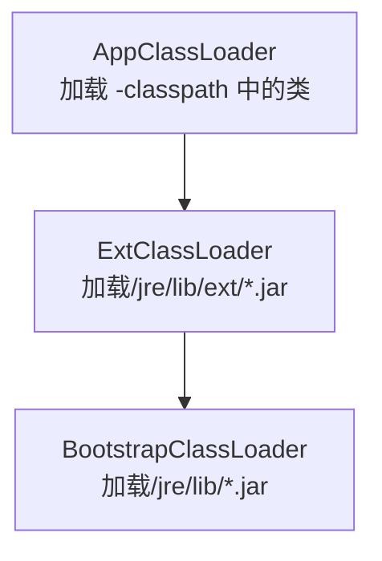

------

### 5.4.1 JDK9+：模块化后的类加载器变化（简单了解）

JDK9 引入模块系统（Jigsaw）后，类加载器体系有部分调整：

- `ExtClassLoader` 被移除，改为 `PlatformClassLoader` 等；
- 模块路径（`--module-path`）分担了部分类查找责任。

常见 API：

```java
ClassLoader boot = Object.class.getClassLoader();          // null，表示 Bootstrap
ClassLoader app  = ClassLoader.getSystemClassLoader();     // AppClassLoader
ClassLoader platform = app.getParent();                    // JDK9+ 是 PlatformClassLoader
```

日常开发中：**主要关注 AppClassLoader（系统类加载器）和自定义类加载器即可**。
模块化本身（`module-info.java`）在兼容旧项目时要注意，但超出本篇重点。

------

### 5.4.2 自定义 ClassLoader 常见用途

重写 ClassLoader 的典型场景：

1. **应用服务器 / 容器**
   - 如 Tomcat、Jetty、JBoss、OSGi 容器等；
   - 不同 web 应用使用不同的 ClassLoader 加载，彼此隔离。
2. **插件系统 / 业务多租户**
   - 比如“一个平台，多个独立插件包动态加载 & 卸载”；
   - 每个插件使用单独 ClassLoader，可以实现版本隔离和热插拔。
3. **加密 / 混淆 / 自定义资源来源**
   - .class 文件不放在常规文件系统，而是放在数据库、网络、压缩包等；
   - 或者先做解密再 defineClass。

简单示例（极简自定义 ClassLoader）：

```java
public class MyClassLoader extends ClassLoader {
    public MyClassLoader(ClassLoader parent) {
        super(parent);
    }

    @Override
    protected Class<?> findClass(String name) throws ClassNotFoundException {
        // 1. 根据类名找到字节码（从文件、网络、加密存储等）
        byte[] bytes = loadClassBytes(name);
        // 2. 调用 defineClass 转为 Class 对象
        return defineClass(name, bytes, 0, bytes.length);
    }

    private byte[] loadClassBytes(String name) {
        // TODO: 实现你自己的查找逻辑
        return new byte[0];
    }
}
```

> 注意：一般不要直接重写 `loadClass`，而是重写 `findClass`，以免破坏双亲委派的基本流程，除非你非常清楚要做什么。

------

## 5.5 打破双亲委派的典型案例

虽然双亲委派是**“默认/推荐”模型**，但现实需求中有不少场景必须绕开它或在某些路径上“打破”：

- 否则无法实现**插件隔离、热部署、SPI 等高级特性**。

### 5.5.1 SPI（Service Provider Interface）与线程 ContextClassLoader

Java 提供了 SPI 机制（`java.util.ServiceLoader`）来做“接口 + 实现解耦”，典型使用方式：

```java
ServiceLoader<JdbcDriver> loader = ServiceLoader.load(JdbcDriver.class);
for (JdbcDriver driver : loader) {
    // 使用 driver
}
```

问题是：

- `ServiceLoader` 自身是由 Bootstrap / Platform ClassLoader 加载的；
- 但驱动实现（如 MySQL JDBC）通常由 AppClassLoader 或自定义 Loader 加载；
- 如果 SPI 只通过自己的 ClassLoader 去加载实现类，容易“看不见”下游类。

解决思路：

> 引入 **线程上下文类加载器（Thread ContextClassLoader）** 概念

- 由上层应用代码设置一个 `ContextClassLoader` 到当前线程；
- 底层框架（SPI 实现）在加载类时，不再只用自己的 ClassLoader，而是优先使用线程上下文加载器。

示例：

```java
ClassLoader appLoader = ...;
Thread.currentThread().setContextClassLoader(appLoader);
```

底层框架的典型代码：

```java
ClassLoader cl = Thread.currentThread().getContextClassLoader();
if (cl == null) {
    cl = ClassLoader.getSystemClassLoader();
}
```

这相当于：

- 一条“向上反向委派”的通路；
- 线程上下文 ClassLoader **反向打破了严格的父子链条**，使得“上层可以为下层决定怎么加载类”。

------

### 5.5.2 Tomcat / Spring Boot / OSGi：多应用、多版本并存

**应用服务器/容器**需要达到的目标：

- 每个 web app 之间类相互隔离：
  - A 应用不能访问 B 应用的内部实现类；
  - 不同应用可以使用不同版本的第三方库；
- 服务器容器本身的类与应用类也要隔离：
  - 避免应用把容器的类“污染”或覆盖。

实现方式通常是：

- 容器启动时先构建自己的 ClassLoader；
- 每个应用（war 包）再构建一个或一组单独的 ClassLoader；
- 加载类时，优先在“当前应用空间”查找，再必要时委派给上层 ClassLoader。

这在实践中对双亲委派做了精细改动：

- 有些路径是 **先自己找，再委派**（打破“完全向上委派”）；
- 有些路径还是遵守原始的父子委派模型。

**OSGi** 甚至在此基础上引入了“模块（Bundle）”和**包级别导入/导出**概念：

- 不同 Bundle 有独立的类空间；
- 通过 import/export 包名来建立联系；
- 本质上是一套更精细化的“类加载 + 版本管理”机制。

------

### 5.5.3 其他“打破”场景一览

1. **热部署 / 热替换**
   - 使用自定义 ClassLoader 承载一个模块的所有类；
   - 卸载时，丢弃整个 ClassLoader，即可达到“卸载所有类”的效果；
   - 再创建一个新的 ClassLoader 加载新版模块，实现热替换。
2. **字节码增强 & 代理框架**
   - 运行时生成的新类（如 `UserService$$EnhancerByCGLIB$$xxx`）常常由一个专门的 ClassLoader 加载；
   - 这样可以避免和原始类的命名空间混淆。
3. **安全沙箱**
   - 某些场景下，为了限制脚本或插件能访问的类范围，会构建带有权限控制的 ClassLoader。

结论：

> 双亲委派是“主干道”，但在工程实践中，我们常常通过“定制支路”来满足复杂的隔离/动态需求。
> 这些支路如果设计不好，就很容易引发：类冲突、版本不一致、ClassLoader 泄漏等问题。

------

## 5.6 类加载相关的常见问题 & 排查思路

类加载问题往往表现为几类典型异常：

1. `ClassNotFoundException`
2. `NoClassDefFoundError`
3. 各种 `LinkageError`（`ClassFormatError`、`UnsupportedClassVersionError`、`NoSuchMethodError` 等）
4. `ClassCastException`（往往是不同 ClassLoader 加载的同名类）
5. Metaspace / PermGen OOM（类加载器泄漏）

下面按症状简单给出“定位思路”。

------

### 5.6.1 ClassNotFoundException vs NoClassDefFoundError

- `ClassNotFoundException`：受检异常（checked）
  - 多由 `Class.forName("xxx")`、`ClassLoader.loadClass("xxx")` 抛出；
  - 表示**在当前类加载器可见范围内找不到这个类**；
  - 常见原因：
    - 缺 jar；
    - 类路径错误；
    - 使用了错误的 ClassLoader；
- `NoClassDefFoundError`：Error
  - 通常是在类**被成功编译 & 验证过一次**，之后某次再用时找不到；
  - 例如：
    - A 类引用了 B 类中的某个方法，但 B 类被替换/删掉了；
    - 运行时类路径和编译时期不一致。

排查时：

- 关注异常堆栈中**到底是哪个类**没找到；
- 看抛出异常的地方是：
  - 手动反射调用？
  - 还是在某个方法执行过程中（JVM 自动解析时）？

------

### 5.6.2 各类 LinkageError：版本冲突 / 定义不一致

`LinkageError` 家族主要出现在**类的“链接”阶段**：

常见类型：

1. `ClassFormatError`：Class 文件格式有问题（非正常 javac 编译产物）；

2. `UnsupportedClassVersionError`：JDK 版本不兼容,用 JDK17 编译、在 JDK8 运行；
   
3. `NoSuchFieldError`/`NoSuchMethodError`：
   - 编译期基于某个版本的 jar；
   - 运行期换了另一个版本，字段/方法签名变化了；

4. `IncompatibleClassChangeError`：类的继承关系或接口实现发生了不兼容变化。

一般是典型的“**编译期依赖和运行期依赖版本不一致**”导致的。
排查方法：

- 确认打包时引用的 jar 版本；
- 确认运行时（启动脚本 / 容器 classpath）实际加载的 jar 版本；
- 使用 `-verbose:class` 或 `-XX:+TraceClassLoading` 观察相关类是被谁，从哪里加载的。

------

### 5.6.3 ClassCastException：往往是“同名不同类加载器”的锅

除了真正类型不兼容外，还有一种非常隐蔽的情况：

> 同一个类名，由两个不同的 ClassLoader 各加载了一份，
> JVM 认为这是“两个完全不同的类型”，互相转换就会 `ClassCastException`。

典型场景：

- 容器中一个类被宿主层和应用层各加载一次；
- 插件系统中不同插件 ClassLoader 之间直接传递对象；
- 某些框架内部使用独立 ClassLoader 加载其依赖类。

排查方法：

1. 打印出参与强转的两个对象的 Class 信息：

```java
System.out.println(obj.getClass() + "@" + obj.getClass().getClassLoader());
```

2. 使用 `-verbose:class` 查看该类到底是由哪个 ClassLoader 从哪儿加载的；

3. 梳理类加载器关系，避免“相同依赖被加载两份又互相传递”。

------

### 5.6.4 Metaspace / PermGen OOM：类加载器泄漏

JDK8+ 常见错误信息：

- `java.lang.OutOfMemoryError: Metaspace`

常见于：

- 热部署 / 热加载环境（Tomcat、Spring Boot DevTools、自己写的插件系统）；
- 动态生成大量类（CGLIB、Javassist 等）但从不卸载（ClassLoader 一直被引用）。

典型原因：

1. 一个模块或应用用单独的 ClassLoader 加载；
2. 卸载时，模块中的：
   - 静态变量、单例对象仍然被外部引用；
   - 线程池中的线程还持有 ContextClassLoader；
   - Timer / ScheduledExecutorService / 缓存等仍引用模块类；
3. 导致 ClassLoader 有引用链，GC 无法回收；
4. 导致其加载的所有 Class + 字节码 + 常量池 + 相关数据无法回收；
5. 随着重载次数增加，Metaspace 持续上涨，最终 OOM。

排查建议：

- 用 `jmap -clstats`（某些版本支持）或 `jcmd VM.classloaders` 看类加载器分布；
- Heap dump 中重点查看：
  - 自定义 ClassLoader 实例数量；
  - 以及是谁在引用它们；
- 优化：
  - 卸载前主动关闭线程池、释放静态资源；
  - 避免使用“长生命周期的线程”持有短生命周期模块的 ClassLoader。

------

## 小结：类加载知识在实战中如何落地？

本章从“类生命周期”和“类加载器体系”出发，讲清了：

1. 类加载的 5 个关键阶段：

   加载 → 验证 → 准备 → 解析 → 初始化

   - 明白了静态变量赋值的时机、类何时会被初始化；

2. **双亲委派模型** 的设计初衷：安全与一致性；

3. HotSpot 中几种重要 ClassLoader 的职责与层级；

4. 在容器 / 插件 / SPI 场景里，为什么需要在局部“打破”双亲委派；

5. 类加载相关的**典型异常 & 排查路径**。

这些知识会直接影响你在下面场景中的表现：

- 从 GC 日志和 OOM 分析中，判断是不是 **Metaspace/类加载器泄漏**；
- 在多模块、多应用环境中，设计合理的 **ClassLoader 隔离策略**；
- 使用 ServiceLoader / SPI / 插件系统时，正确处理 **ContextClassLoader**；
- 阅读 Tomcat / Spring Boot / OSGi 等框架源码时，不再对“层层 ClassLoader”完全迷茫。

下一章（第 6 章），我们会把视角移到“堆上的对象”，深入理解：
**对象是如何被创建、在内存中长成什么样、JIT 如何让一些对象“消失不见”**——这将直接关系到 GC 行为和性能优化。

# （六）对象的创建、布局与访问：搞懂“对象是怎么长出来的”

> 本章目标：  
> - 搞清楚 `new` 背后到底发生了什么  
> - 理解 HotSpot 中 **对象在内存里的真实样子**（对象头、对齐、数组）  
> - 知道 JVM 如何通过“句柄/直接指针”访问对象  
> - 明白逃逸分析、标量替换、栈上分配这些 JIT 优化大致在干什么  
> - 能从“对象太多/没回收”联想到几类典型 OOM & 泄漏模式

---

## 6.1 对象创建流程概览：一次 `new` 的旅程

以最常见的创建方式为例：

```java
User user = new User();
```

在 JVM 内部，大概会经历下面几步：


按顺序稍微展开。

------

### 6.1.1 类加载检查：`new` 之前，必须“认识这个类”

字节码层面，对应指令是 `new`：

```tex
0: new           #2  // class User
3: dup
4: invokespecial #3  // Method User."<init>":()V
7: astore_1
```

执行 `new` 时，JVM 会先检查：

- 这个类对应的元数据是否已经在方法区 / Metaspace 中存在；
- 如果没有，就触发**类加载过程**（上一章讲的加载 → 验证 → 准备 → 解析 → 初始化）。

所以：

- 第一次使用某个类时，常会在 `new` 时顺带完成其 `<clinit>` 静态初始化逻辑；
- 之后再 `new` 该类的实例，就不会再重复这些加载/初始化操作了。

------

### 6.1.2 分配内存：堆上找一块“连续区域”

类已经准备好了，现在要在堆上给这个对象划一块地。

HotSpot 里对象分配主要有两种策略：

1. **指针碰撞（Bump-the-pointer）**
2. **空闲列表（Free List）**

是否使用哪种，取决于：

- 该内存区域是否是“一块规整的连续空间”；
  - 新生代 Eden 通常是连续的 → 用指针碰撞；
  - 老年代可能存在碎片 → 较多采用空闲列表。

#### a. 指针碰撞

示意：

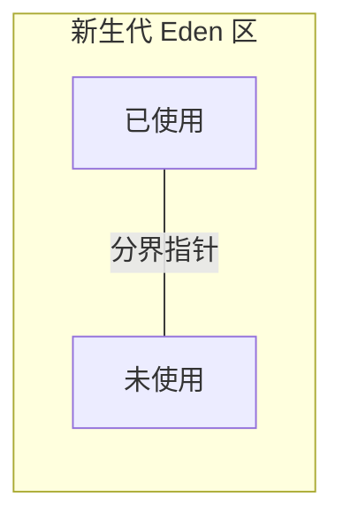

- JVM 维护一个“分界指针”指向当前已用区域的末尾；
- 分配新对象时，只需：
  - 检查剩余空间是否够；
  - 然后把分界指针往后挪对象大小那么多；
- 优点：非常快，基本就是一个“指针自增”。

#### b. 空闲列表

当内存不再是整块时（有碎片），就会维护一个“空闲块链表/树”：

- 分配时，在空闲列表中找到一块足够大的区域；
- 分配后更新该空闲块信息；
- 类似于传统堆分配算法（first fit, best fit 等）。

------

### 6.1.3 TLAB：多线程分配如何避免锁竞争？

在高并发场景下，如果所有线程都抢同一个“分界指针”，势必会有大量 CAS/锁竞争。

所以 HotSpot 引入了 **TLAB（Thread Local Allocation Buffer）**：


- 每个线程在 Eden 里预留一小块区域作为 TLAB；
- 线程内部分配对象时，只在自己的 TLAB 里移动指针，不与其它线程竞争；
- TLAB 用尽，再向 Eden 申请新的 TLAB 块；
- TLAB 外的大对象或特殊对象，才需要走“慢路径”分配。

总结一下：

- 日常大多数对象创建非常便宜 —— 就是在线程本地 TLAB 上**挪一下指针**；
- 这也是 Java 经常被说“创建对象并不贵”的底层原因之一。

------

### 6.1.4 内存布局初始化 + 构造器调用

分配完空间后，JVM 会做三类初始化工作：

1. **零值初始化（Zeroing）**
   - 把对象实例数据部分的每个字段置为零值：
     - 数值型 → 0 / 0L / 0.0f / 0.0d
     - boolean → false
     - 引用 → null
   - 这一步保证了**Java 层面“默认值”语义**。
2. **设置对象头（Header）**
   - 填写 Mark Word（hash、GC 年龄、锁标志等默认值）；
   - 填写 Klass 指针（指向类元数据，以便找到方法表、字段布局等）。
3. **执行构造方法 `<init>`**
   - 字节码指令 `invokespecial` 调用构造器；
   - 执行你在构造器和字段显式初始化中写的代码。

> 小结：
>
> - **零值初始化 + 设置对象头** 是“JVM 层面”的事情；
> - **字段显式初始化 + 构造器** 是“Java 语言层面”的事情。

------

## 6.2 Java 对象内存布局：对象头 + 实例数据 + 对齐填充

在 HotSpot 上，一个典型 Java 对象（非数组）的内存布局可以抽象为：

```tex
+----------------------+  <-- 对象起始地址
| 对象头 (Header)      |
|  - Mark Word         |
|  - Klass Pointer     |
+----------------------+
| 实例数据 (Fields)    |
|  - 各种字段          |
+----------------------+
| 对齐填充 (Padding)   |
+----------------------+
```

数组对象则在对象头和实例数据间多一个“数组长度”字段。

------

### 6.2.1 对象头（Header）：Mark Word + Klass 指针

#### a. Mark Word：对象运行时元信息

在 64 位 HotSpot 上通常占 8 字节（32 位上占 4 字节），内部结构会随状态变化。典型包含：

- 对象的 **哈希码（hashCode）**（可能被延迟计算）；
- GC 年龄（在新生代中经历过多少次回收）；
- 锁状态标志（无锁、偏向锁、轻量级锁、重量级锁）；
- 对应的锁记录或监视器指针等。

你可以把 Mark Word 看成：

> 一块会随着对象状态不断变化的小“tag 区域”。

#### b. Klass Pointer：指向类元数据

- 指向方法区 / Metaspace 中表示该类的 Klass 元数据结构；
- JVM 通过它可以：
  - 知道对象属于哪个类；
  - 找到虚方法表（vtable）；
  - 解析字段在对象内存中的偏移、方法的入口地址等。

64 位环境下，如果开启了 **压缩类指针（UseCompressedClassPointers）**，这个指针占用 4 字节，否则是 8 字节。

------

### 6.2.2 实例数据（Fields）：字段是怎样排布的？

对象的字段在实例数据区域里按一定规则排布：

1. 先排父类的实例字段；
2. 再排子类自己的字段；
3. 同一层次中：
   - HotSpot 会按**字段类型大小**进行重排序（并不完全严格按源码顺序），以减少对齐填充和内存碎片；
   - 一般会让大字段（long/double）对齐到 8 字节边界。

> 这意味着：**不要依赖“字段在内存里的顺序”等未保证行为**做任何逻辑，Java 规范并不承诺这一点。

------

### 6.2.3 对齐填充（Padding）：按 8 字节对齐

HotSpot（64 位）通常要求对象大小为 **8 字节的整数倍**。
因此，如果“对象头 + 实例数据”的总大小不是 8 的倍数，就会在尾部 **填充一些对齐字节**。

示例（大致估算，具体依赖压缩指针等配置）：

```java
class Simple {
    int  a;   // 4 bytes
    long b;   // 8 bytes
    Object ref; // 4 or 8 bytes (压缩指针下为 4)
}
```

假设：

- Mark Word: 8 bytes
- Klass Pointer: 4 bytes（压缩类指针）
- 对象头：12 字节，为对齐一般视作 16

字段大致布局（非严格）：

- `a`：4 字节
- `b`：8 字节（需 8 字节对齐，可能在前面插入 4 字节 padding）
- `ref`：4 字节（压缩 OOP）

最终对象大小可能被对齐到 **24 / 32 字节**（具体可用 JOL 实测）。

------

### 6.2.4 用 JOL 查看对象布局

[JOL（Java Object Layout）](https://openjdk.org/projects/code-tools/jol/) 是一个专门用来分析对象布局的工具。

示例：

```java
public class JolDemo {
    int a;
    long b;
    Object ref;

    public static void main(String[] args) {
        System.out.println(org.openjdk.jol.info.ClassLayout.parseClass(JolDemo.class).toPrintable());
    }
}
```

输出中会详细列出：

- 对象头各部分大小；
- 字段的偏移位置；
- 总体对象大小 & 对齐情况。

> 建议：实际玩一下 JOL，会对“对象内存开销”有非常直观的感受，对后面谈“对象瘦身/内存优化”很有帮助。

------

### 6.2.5 数组对象：比普通对象多一个“长度”

数组对象在布局上和普通对象相似，只是多一个 **length 字段**：

```tex
+----------------------+
| 对象头 (Mark, Klass) |
+----------------------+
| 数组长度 (int)       |
+----------------------+
| 数组元素             |
+----------------------+
| 对齐填充             |
+----------------------+
```

比如 `int[10]` 数组：

- 对象头（12/16 字节）
- `length`（4 字节）
- 10 个 `int`（40 字节）
- 对齐到 8 的倍数。

数组元素本身的布局遵从元素类型规则：

- 原始类型数组：一块连续的原始值；
- 引用类型数组：连续的引用（指针），真正对象在堆的其他位置。

------

## 6.3 对象访问方式：句柄 vs 直接指针

JVM 规范并没有规定“引用”内部必须是指针，具体实现可以自己选。总体有两种典型方案：

```mermaid
graph LR
    subgraph Handle[句柄访问]
        A[引用] --> B[句柄表]
        B --> C[对象实例]
        B --> D[类型信息]
    end

    subgraph Direct[直接指针访问]
        E[引用\n直接指向对象]
        E --> F[对象头（含类型信息指针）]
    end
```

------

### 6.3.1 句柄访问（Handle）

设计：

- 堆上维护一个**句柄池（Handle Table）**；
- Java 引用变量存的是“句柄地址”；
- 句柄中包含：
  - 对象实例数据地址；
  - 类元数据地址（或 Klass 指针）。

优点：

- 对象移动更安全：

  - GC 做压缩/整理时，只需要更新句柄指向的实例地址；
  - Java 中的所有引用仍然指向原句柄位置，无需更新；
  
- 适合对象移动频繁的场景。

缺点：

- 访问多了一次间接寻址：引用 → 句柄 → 对象。

------

### 6.3.2 直接指针访问（Direct Pointer）

HotSpot 采用的是**直接指针访问**方案：

- Java 引用直接存储“对象起始地址”；
- 对象头中包含 Klass 指针等信息，JVM 可以通过对象头查元数据。

优点：

- 访问速度稍快（少一次指针间接）；
- 内存布局更简单。

缺点：

- GC 移动对象时，需要更新所有指向它的引用；
- 这就需要 **GC Root 分析 + 遍历引用图**，但现代 GC 本来就要做这些工作，因此成本可接受。

------

### 6.3.3 对我们意味着什么？

日常开发中：

- 你不需要关心“引用内部是不是指针”；
- 但理解 HotSpot 使用“直接指针访问”有助于你理解：
  - 为什么需要 `压缩指针（Compressed Oops）` 优化空间；
  - 对象头 + Klass 指针布局是如何被利用的；
  - GC 在移动对象时必须更新哪些引用。

------

## 6.4 逃逸分析 & 标量替换：JIT 如何让“对象消失”

当我们写：

```java
public String concat(String a, String b) {
    StringBuilder sb = new StringBuilder();
    sb.append(a);
    sb.append(b);
    return sb.toString();
}
```

直觉上有：

- 一个 `StringBuilder` 对象；
- 若干临时 String 对象等。

但在充分优化后，JIT 有可能做到：

- 不真正分配 `StringBuilder` 对象在堆上；
- 直接把相关逻辑“展开”为栈变量或寄存器中的操作。

关键技术：**逃逸分析（Escape Analysis）** 和基于它的优化：**栈上分配、标量替换、锁消除**。

------

### 6.4.1 什么是“逃逸”？三种层级

逃逸分析关心的是：

> 一个对象是否会“逃出”当前作用域 / 当前线程？

大致分三类：

1. **不逃逸（No Escape）**

   - 对象只在当前方法内部使用，不被返回，不赋值给外部变量；

   - 例如：

     ```java
     void foo() {
         Point p = new Point(1, 2);
         int x = p.x + p.y;
     } // p 在方法结束后再也不需要
     ```
   
2. **方法逃逸（Arg Escape / Method Escape）**

   - 对象被作为参数传递到其他方法；
   - 或被赋值给更大作用域的变量，但仍未跨线程。

3. **线程逃逸（Global Escape）**

   - 对象被存入共享静态变量、逃逸到堆上被其他线程访问；
   - 例如存入全局集合、发布到其他线程。

------

### 6.4.2 基于逃逸分析的几种优化

当 JIT 检测到一个对象**不会逃逸**时，可以做三类优化：

#### a. 栈上分配（Stack Allocation）

- 原本应该在堆上分配的对象，直接在栈帧中分配；
- 方法执行结束后，栈帧销毁，对象随之销毁，**不需要 GC 处理**。

简化效果：

- 减少堆上的对象数量；
- 减少 GC 压力。

> 注意：
>
> - “栈上分配”是一个概念结果；HotSpot 实现中往往更进一步做“标量替换”。

#### b. 标量替换（Scalar Replacement）

如果一个对象不逃逸，而且仅仅作为“若干字段的组合”使用：

- JIT 可以把对象拆解成若干**独立标量变量**（int、long 等）；
- 所有对该对象的操作都被编译期静态化，根本**不再需要这个对象的内存布局**。

示例（概念）：

```java
class Point { int x, y; }

void foo() {
    Point p = new Point();
    p.x = 1;
    p.y = 2;
    int r = p.x + p.y;
}
```

经过标量替换后，相当于：

```java
void foo() {
    int px = 1;
    int py = 2;
    int r = px + py;
}
```

真正运行时**不会存在 Point 这个对象的实例**。

#### c. 锁消除（Lock Elimination）

如果 JIT 发现：

- 某个带有 `synchronized` 的对象锁，
- 关联的对象没有发生线程逃逸（只在当前线程内部使用）；

那么它可以推断：

> 其实不存在“并发访问”这个场景。

于是，可以**消除这部分同步代码开销**。

典型代码：

```java
public String concat(String a, String b) {
    StringBuffer sb = new StringBuffer(); // 内部方法是 synchronized 的
    sb.append(a);
    sb.append(b);
    return sb.toString();
}
```

- 在单线程 & 对象不逃逸的情况下，锁是可以被完全消除的。

------

### 6.4.3 如何观察 & 验证逃逸分析优化？

在生产中你无需显式开启，它默认开启（C2 编译器），但你可以通过参数做一些验证：

常见参数（JDK8 HotSpot，部分在高版本中有调整）：

```bash
# 显式开启/关闭逃逸分析（一般默认是开的）
-XX:+DoEscapeAnalysis
-XX:-DoEscapeAnalysis

# 打印相关优化日志，了解哪些对象被标量替换/锁消除
-XX:+UnlockDiagnosticVMOptions
-XX:+PrintEscapeAnalysis
-XX:+PrintEliminateAllocations
```

一个典型的实践建议：

- 不要过早为了“相信栈上分配/标量替换”而写奇怪代码；
- 但要知道：
  - “短命小对象”在 JVM 下并没有那么可怕；
  - 不要为了减少对象数去写复杂可变代码，反而破坏了 JIT 优化机会。

------

## 6.5 常见 OOM：对象过多 / 引用未释放 / 内存泄漏模式

对象创建 & 布局搞清楚后，自然就会联想到：**对象太多/没回收 → OOM / GC 压力**。

这里先按“现象 → 原因模式”做一个归类，后面 GC & 调优章节会更细讲。

------

### 6.5.1 真·对象太多：业务确实需要那么多数据

典型场景：

- 一次把 1000 万条数据库记录全部 load 到内存；
- 把整个 Excel/图片/文件内容全部读入内存做处理；
- 使用了大量缓存、预加载数据结构，但容量设得过大或没有上限。

表现：

- 堆使用率稳定居高不下；
- GC 频繁且难以回收出可用空间；
- `java.lang.OutOfMemoryError: Java heap space`。

思路：

- 分批处理（流式处理 / 分页 / 迭代器）；
- 限制缓存大小（LRU/LFU/基于容量/基于时间的过期策略）；
- 必要时做数据抽样或降维处理，而不是“什么都全量放内存”。

------

### 6.5.2 “伪泄漏”：短时间对象风暴，GC 跟不上

典型场景：

- 瞬时高并发大流量，产生大量临时对象；
- 日志格式化、JSON 编解码、字符串拼接、集合创建等非常密集；
- 短期内新生代被迅速填满，引发频繁 Minor GC；
- 如果对象晋升速度过快或老年代空间不足，会进一步触发 Full GC。

表现：

- 堆的整体占用在**一段时间跨度上是有起有落的**（没有明显泄漏趋势）；
- 但在短时间窗口内，GC 频率很高，甚至 Full GC；
- 可能伴随着接口延迟抖动。

思路：

- 减少不必要的临时对象创建；
  - 例如：尽量复用 `StringBuilder`、合理设计 DTO、避免过度“装箱/拆箱”；
- 合理配置新生代大小，提高吞吐型 GC 效率；
- 在高并发路径上使用更轻量的序列化格式/库。

------

### 6.5.3 真·内存泄漏：对象本该被回收，却有“暗线引用”

Java 有 GC，并不意味着没有内存泄漏，
它只保证：**没有引用的对象一定能被回收**，但**被错误引用住的“垃圾”没法帮你判断**。

典型“泄漏模式”包括（但不限于）：

#### a. 静态集合持有

```java
public class Cache {
    private static final List<Object> CACHE = new ArrayList<>();
}
```

- 把请求、Session、临时对象、“缓存”全部扔到静态集合里；
- 没有相应的淘汰机制或删除逻辑；
- 随运行时间增长，集合越来越大，最终撑爆堆。

#### b. 监听器 / 回调未注销

- 注册了各种 Listener、Observer；
- 卸载模块/用户退出/请求结束时，并没有从监听列表中移除；
- Listener 一直持有业务对象引用，导致整条引用链无法被回收。

#### c. ThreadLocal 使用不当

ThreadLocal 正常使用：

- 键：ThreadLocal 实例（弱引用）；
- 值：真正需要存放在线程局部的数据（强引用）。

泄漏风险来源：

- 线程（如线程池中的工作线程）是长生命周期的；

- ThreadLocal 不再使用时，如果你不`remove()`：

  - 键可能因为弱引用被 GC 回收，但值仍被 `ThreadLocalMap` 的 Entry 强引用着；
- 线程存活期间，这部分值不会释放。

> 实际上：
>
> - HotSpot 做了清理过期 key 的逻辑（get/set/remove 时会清理）；
> - 但仍然建议：**使用完毕后显式 `remove()`**，尤其在线程池场景。

#### d. 自定义缓存或 LRU 实现不当

- 自己用 `HashMap` 做缓存；
- 没有 TTL / 容量限制，或者键的 equals/hashCode 有 bug；
- 长期运行后缓存逐渐“无上限”增长。

------

### 6.5.4 如何排查“对象相关”的 OOM？

后面 GC & 工具章节会详细展开，这里先给个最小 checklist：

1. **确认是哪类 OOM**

   - `Java heap space` / `Metaspace` / `Direct buffer memory` / `unable to create new native thread` …
   - 确保真的是“对象太多 → 堆不够”，而不是其他区域。

2. **抓一次堆转储（Heap Dump）**

   - 可使用：

   ```bash
   jmap -dump:format=b,file=heap.hprof <pid>
   ```

   - 或在 OOM 时通过 `-XX:+HeapDumpOnOutOfMemoryError -XX:HeapDumpPath=/path` 自动生成。
   
3. **使用 MAT / VisualVM / IDEA Profiler 打开 dump**

   - 看哪种类型的对象最多；
   - 看大对象的引用链（Path to GC Roots）：
     - 是被静态变量持有？
     - 是被某个线程的局部变量/栈帧持有？
     - 是被某个单例/缓存几十万条持有？

4. **定位到具体业务逻辑**

   - 例如定位到某个静态 Map；
   - 再回代码，补上：
     - 容量限制 / 过期策略；
     - 或在适当时机 `clear()`。

------

## 小结：对象视角下的 JVM 认知补全了什么？

本章从“对象”的视角补全了 JVM 里的一些关键拼图：

1. 一次`new` 背后的完整链路：

   - 类加载检查 → 堆上分配（TLAB/指针碰撞/空闲列表） → 对象头 & 零值初始化 → 构造函数；

2. HotSpot 中对象的内存布局：

   - 对象头（MarkWord + Klass 指针） + 实例数据 + 对齐填充；
   - 数组对象比普通对象多一个 length 字段；
   
3. JVM 访问对象的方式：

   - 句柄 vs 直接指针，HotSpot 选择了后者；

4. 逃逸分析 & 标量替换：

   - JIT 能让很多短命小对象“消失”，减少实际堆分配 & GC 压力；

5. 从“对象太多/没释放”联想到几类典型 OOM / 泄漏模式。

这些内容，会在后面讲：

- **GC 算法与收集器**（对象生命周期 & 代际假说）
- **JMM 与并发**（对象头的锁标志位、偏向锁等）
- **调优与诊断**（Heap Dump 分析对象分布）

时不断用到。

下一章（第 7 章），我们将切换到并发视角，系统地梳理 **Java 内存模型（JMM）、happens-before、volatile 与锁优化** —— 也就是“多线程下，对象的读写到底是如何被保证可见、有序、原子的”。

# （七）JMM 与并发语义：从“看不见的重排序”开始

> 本章目标：  
> - 知道为什么需要 **Java 内存模型（JMM）**，它试图解决什么问题  
> - 懂得“主内存 / 工作内存”这个抽象，以及 CPU 缓存与指令重排序的影响  
> - 记住 **原子性 / 可见性 / 有序性** 三大问题  
> - 掌握 **happens-before 规则**，知道 volatile / synchronized 在 JMM 中分别做了什么  
> - 理解偏向锁、轻量级锁等锁优化大致原理  
> - 理解 final 字段的特殊语义与“安全发布”  
> - 能用 JMM 视角分析几种常见并发 Bug 模式（单例乱序、双重检查锁等）

---

## 7.1 为什么需要 Java 内存模型（JMM）？

从单线程转到多线程，刚开始常见的直觉是：

> “所有线程共享一个堆，大家读写同一个变量，应该就是你写我就能立刻看到。”

现实不是这样，原因在于底层硬件 & 编译器做了大量优化：

- CPU 有多级缓存（L1/L2/L3），不同核心的缓存内容不一定立刻同步；
- 编译器（包括 JIT）会进行**指令重排序**，只要不改变“单线程语义”即可；
- 很多指令是**非原子**的，比如 `i++` 实际会被拆成多条机器指令。

结果就是：

- 在没有适当同步的情况下，多线程程序的行为变得“不可预测”；
- 在不同的 CPU / 不同的编译器 / 不同的 JDK 版本上表现还可能不同。

> JMM 的目标：  
> - 定义一个**语言层面的内存模型**，  
> - 在它之上构建“多线程程序的可见性 & 有序性语义”，  
> - 让 Java 程序员不用直接脑补一堆 CPU & 缓存细节。

简单说：

> JMM 是“Java 语言层面”给你的承诺，它告诉你：  
> 在多线程场景下，只要你用了这些同步原语（volatile、synchronized 等），  
> 程序的行为就会在所有平台上都**一致**。

---

## 7.2 主内存与工作内存：线程之间如何“说话”？

JMM 给出了一个抽象模型（与真实硬件不一一对应，但便于理解）：

```mermaid
graph LR
    subgraph Main[主内存 Main Memory]
        V[x 变量的共享值]
        W[其他共享变量...]
    end

    subgraph T1[线程 1]
        L1[工作内存\n（寄存器/CPU 缓存的抽象）]
        L1 -->|读/写| V
    end

    subgraph T2[线程 2]
        L2[工作内存\n（寄存器/CPU 缓存的抽象）]
        L2 -->|读/写| V
    end
```

JMM 抽象出：

- 主内存：

  - 存放所有共享变量（对象字段、静态字段、数组元素）；

- 每个线程都有自己的工作内存：

  - 存的是主内存变量的“拷贝”（或缓存）；
  - 线程只**直接读写自己工作内存中的变量副本**；
  - 最终通过特定协议把修改刷回主内存，让其他线程可见。

一个典型现象：

```java
public class Visibility {
    static boolean running = true;

    public static void main(String[] args) throws Exception {
        Thread t = new Thread(() -> {
            while (running) {
            }
            System.out.println("stopped");
        });
        t.start();

        Thread.sleep(1000);
        running = false; // 修改标志位
    }
}
```

理论预期：

- 1 秒后把 `running` 改为 false，子线程应该跳出循环并打印 “stopped”。

实际在**没有任何同步手段**的前提下：

- 子线程可能**永远循环下去**；
- 因为它在工作内存中一直看到 old value（true），看不到主内存中新值。

JMM 通过：

- volatile、
- synchronized、
- final、
- 显式锁（Lock）、
- 原子类（AtomicXxx，基于 Unsafe / VarHandle）

来规定：**在什么情况下，修改必须从工作内存刷新到主内存、其它线程又必须从主内存重新读取新的值**。

------

## 7.3 原子性、可见性、有序性：并发问题的“三个维度”

### 7.3.1 原子性（Atomicity）

**原子性**：一个操作要么全部执行，要么全部不执行，中间状态对其它线程不可见。

- JVM 保证了 **基本变量类型的单次读/写是原子** 的（long/double 在早期有例外，新 JMM 已保证原子性）；
- 但像 `++`、`+=` 等都是**复合操作**（读-改-写），**不是原子**。

示例：

```java
public class Counter {
    private int count = 0;

    public void incr() {
        count++; // 非原子操作
    }
}
```

在多个线程同时调用 `incr()` 时：

- 期望是 +=1；
- 可能出现“丢失更新”，最后结果小于实际加的次数。

解决方案：

- synchronized（临界区互斥）；
- `AtomicInteger` 等原子类（CAS + 内存语义）。

------

### 7.3.2 可见性（Visibility）

**可见性**：一个线程对共享变量的修改，能够被其他线程“及时”看到。

常见丢失可见性的情况：

- 线程 A 修改了共享变量 x；
- 线程 B 因为一直读自己的工作内存中的旧值，迟迟看不到 A 的修改。

解决方案：

- 使用 volatile：写入 volatile 变量会**强制刷新到主内存**，读 volatile 变量时会**从主内存重新获取**；
- 使用 synchronized / Lock：
  - 释放锁前，JMM 会把工作内存中的变量刷新回主内存；
  - 获取锁后，会从主内存“重新加载”这些变量。

------

### 7.3.3 有序性（Ordering）与指令重排序

**有序性**：程序执行顺序是否与**源码顺序**一致。

编译器 & CPU 允许在不改变**单线程语义**的前提下，对指令进行 **重排序（Reordering）**，例如：

```java
int a = 1;      // 1
int b = 2;      // 2
int c = a + b;  // 3
```

在单线程下，编译器可以重排序为：

```java
int b = 2;
int a = 1;
int c = a + b;
```

甚至某些场景也可以将写入/读取的时机向前/向后挪。

问题在于在多线程下，这种重排序可能改变程序行为：

- 一个线程中语句执行的实际顺序，可能与另一个线程看到的顺序不一致。

JMM 通过 **happens-before 规则** 来规定哪些操作之间**不能重排序**，从而保证程序在多线程下的“合理语义”。

------

## 7.4 happens-before 规则速记

JMM 没有直接规定“具体要怎么做缓存/重排序”，而是用一种更上层的方式表达：

> 如果 A happens-before B，那么在多线程环境下：
>
> - A 的结果对 B 可见，
> - 且 A 与 B 之间不能被重排序。

几个必须记住的规则（简化版）：

### 7.4.1 程序顺序规则（Program Order Rule）

> 在一个线程内，**按照代码顺序**，前面的操作 happens-before 后面的操作。

- 注意：这是**在同一线程内**；
- 编译器和 CPU 在保证“单线程语义”的前提下可以重排序，但 JMM 提供了一种“逻辑顺序”上的约束；
- 对你来说可以理解为：**单线程语义你可以放心依赖**。

------

### 7.4.2 监视器锁规则（Monitor Lock Rule）

> 对一个锁的 **解锁（unlock）** happens-before **后续对这个锁的加锁（lock）**。

即：

- 线程 A 在 synchronized 块中退出（释放锁）之前对共享变量做的修改；
- 对于随后获取同一把锁的线程 B 来说，这些修改是**可见的**。

------

### 7.4.3 volatile 变量规则

> 对一个 volatile 变量的写（write） happens-before 后续对这个变量的读（read）。

- 写 volatile：会把当前线程对该变量的最新值**刷新到主内存**，并建立一定的**顺序性**；
- 读 volatile：会从主内存中**重新获取**最新值。

这是 volatile 提供“可见性 & 有序性”的基础。

------

### 7.4.4 线程启动与终止规则

- 线程启动（Thread Start）规则：

  - 对线程对象 `Thread` 调用 `start()` 之前，对共享变量的写入，
    对新线程来说是可见的；
  
- 线程终止（Thread Join）规则：

  - 一个线程 A 执行 `t.join()` 成功返回后，
  线程 t 内对共享变量的所有写入，对 A 来说都是可见的。

这就是说：

- `start()` 前对共享变量的初始化；
- `join()` 后对线程执行结果的读取；

在 happens-before 关系上是**有保障的**。

------

### 7.4.5 传递性（Transitivity）

> 如果 A happens-before B，B happens-before C，那么 A happens-before C。

这是组合推理的基础：

- 很多复杂的并发类（如 `ConcurrentHashMap`、`CountDownLatch`）内部，
  通过精心设计，让你的业务代码在“最终可见性”上满足 happens-before。

------

### 7.4.6 总结记忆

可以用一句“伪口诀”帮助记忆（不严谨但好用）：

> **单线程内按顺序，锁与 volatile 建桥梁，start/join 连起线程，传递一下就全通。**

------

## 7.5 volatile 的语义与使用边界

### 7.5.1 volatile 提供了什么？

volatile 关键字用于修饰变量（字段），JMM 给予它两种语义：

1. **可见性**：
   - 一个线程写 volatile 变量后，其他线程能“立刻”看到；
   - 实现上通常会生成内存屏障（Memory Barrier），禁止缓存重排序。
2. **有序性（禁止特定重排序）**：
   - 对 volatile 变量的写入，**不会被重排序到其前面**；
   - 对 volatile 变量的读取，**不会被重排序到其后面**；
   - 可以构建一种“轻量级的 happens-before 关系”。

但注意：

> volatile **不保证复合操作原子性**。

示例：

```java
volatile int count = 0;

void incr() {
    count++; // 仍可能竞争，++ 不是原子
}
```

即使加了 volatile：

- 多线程并发执行 `++`，仍会出现“丢失更新”。

------

### 7.5.2 典型正确用法：状态标志 / 配置刷新 / 单例双重检查

#### a. 状态标志

```java
class StopFlag {
    private volatile boolean running = true;

    void worker() {
        while (running) {
            // do work
        }
    }

    void shutdown() {
        running = false;
    }
}
```

- 可见性：其他线程能看到 `running` 从 true → false 的变化；
- 有序性：确保对 `running` 之前的写入对观察者线程可见。

#### b. 配置信息 / 热更新

```java
class ConfigHolder {
    private volatile Config current;

    public Config get() {
        return current;
    }

    public void update(Config newConfig) {
        current = newConfig;
    }
}
```

- 保证最新的 Config 实例能被所有线程及时看到；
- 借助 Config 的不变性（或安全发布），可以做到**无锁读取**。

#### c. 双重检查锁（DCL）单例

经典写法（JDK5 之后 + 正确使用 volatile 才是正确 DCL）：

```java
class Singleton {
    private static volatile Singleton INSTANCE;

    private Singleton() {}

    public static Singleton getInstance() {
        if (INSTANCE == null) {              // 第一次检查（无锁）
            synchronized (Singleton.class) {
                if (INSTANCE == null) {      // 第二次检查（有锁）
                    INSTANCE = new Singleton();
                }
            }
        }
        return INSTANCE;
    }
}
```

volatile 的关键作用：

- 禁止指令重排序把“引用写入 INSTANCE”提前到构造器执行之前；
- 否则可能出现其它线程看到“非空但未完全初始化”的 INSTANCE。

------

### 7.5.3 不要用 volatile 做“所有并发控制”

容易踩坑的做法：

```java
class WrongCounter {
    private volatile int count = 0;

    public void incr() {
        count++; // 仍有竞态
    }
}
```

volatile 不能代替锁，它**只适合用在“状态标志 / 发布对象引用”这类场景**，对于：

- 复合操作（++、累加、check-then-act）；
- 不可分割的状态变更（如从多个字段组合构成的一致性状态）；

仍然需要使用：

- synchronized / Lock；
- 或 AtomicXXX + 合理的 CAS 循环。

------

## 7.6 synchronized 与锁优化：偏向锁 / 轻量级锁 / 重量级锁

### 7.6.1 synchronized 的语义：互斥 + 可见性

`synchronized` 提供两大语义：

1. **互斥**：同一时刻，只允许一个线程持有某个 monitor（锁），进入临界区；

2. 可见性 & 有序性：

   - 释放锁前，JMM 会把工作内存中对共享变量的修改刷新到主内存；
   - 获取锁后，会从主内存中重新加载这些变量；
   - 获取锁的操作 happens-before 随后对同一锁的释放。

字节码层面：

- 进入 synchronized 块 → `monitorenter`
- 退出 synchronized 块（正常或异常）→ `monitorexit`

JDK 实现中，锁对象的**Mark Word** 中会存储当前锁的状态以及持有线程等信息。

------

### 7.6.2 锁的几种状态：无锁 / 偏向锁 / 轻量级锁 / 重量级锁

HotSpot 中，为了减少加锁开销，引入了一套“锁状态升级/降级”机制（JDK15 之后偏向锁默认关闭，但理解概念仍有帮助）：

```mermaid
graph LR
    A[无锁] --> B[偏向锁]
    B --> C[轻量级锁]
    C --> D[重量级锁]
```

- **无锁（Unlocked）**：
  - 对象刚创建时默认状态；
- **偏向锁（Biased Locking）**：
  - 优化“**长时间只被同一个线程使用的锁**”；
  - 第一次加锁会在对象头记录“偏向线程 ID”；
  - 之后同一线程再次进入 synchronized，几乎无开销；
  - 一旦有其他线程参与竞争，再撤销偏向，升级成轻量级锁；
  - JDK15+ 默认禁用，可通过 `-XX:+UseBiasedLocking` 启用（未来版本可能移除）。
- **轻量级锁（Lightweight Locking）**：
  - 利用 CAS + 自旋实现；
  - 当线程尝试获取锁时，使用 CAS 将对象头 Mark Word 替换为指向栈帧中 Lock Record 的指针；
  - 若 CAS 成功，即获取锁；失败则尝试短暂自旋，如果仍失败则膨胀为重量级锁；
  - 适用于“锁竞争短暂、冲突不激烈”的场景。
- **重量级锁（Heavyweight Locking）**：
  - 线程进入阻塞状态，依赖 OS 的 Mutex/Monitor 实现；
  - 线程切换成本高；
  - 适用于“长时间持有锁、竞争激烈”的场景。

总体目标：

> 尽量让大部分 synchronized 在“无竞争/弱竞争”场景下成本很低，
> 需要真正阻塞的场景再升级。

------

### 7.6.3 锁消除（Lock Elimination）与锁粗化（Lock Coarsening）

除了锁的状态优化，JIT 还会做两种典型的锁相关优化：

#### a. 锁消除（Lock Elimination）

如果通过逃逸分析发现：

- 某个加锁对象不会被其它线程访问；
- 或者锁对象完全在当前方法内、不会逃逸；

那么加锁就没有意义，JIT 可以**直接去掉 synchronized**。

例如：

```java
public String concat(String a, String b) {
    StringBuffer sb = new StringBuffer(); // 内部方法是 synchronized 的
    sb.append(a);
    sb.append(b);
    return sb.toString();
}
```

在单线程 & 不逃逸场景下，JIT 可能消除掉内部的锁开销。

#### b. 锁粗化（Lock Coarsening）

有时候源码里重复对同一个对象频繁加解锁，例如：

```java
for (...) {
    synchronized (lock) {
        // 很小的一段代码
    }
}
```

在某些条件满足时（比如这些小块之间没有其他线程介入），JIT 会进行“锁粗化”：

- 将循环中多次短锁合并成一次**大范围的锁**包裹整个循环；
- 减少频繁加解锁的开销。

------

## 7.7 final 语义与“安全发布”

final 除了在语义上表示“不可修改”（对于字段，指**不能被重新赋值**），在 JMM 中还赋予了**特殊的内存语义**，特别是：

- final 字段在对象构造完成后，一旦发布出去，其他线程看到该对象时，**一定能看到 final 字段的正确初始化值**；
- 同时禁止编译器把对 final 字段的写重排序到构造函数之外。

这为**不可变对象（Immutable Object）** 提供了基础。

------

### 7.7.1 final 字段的初始化语义

示例：

```java
class Point {
    final int x;
    final int y;

    Point(int x, int y) {
        this.x = x;
        this.y = y;
    }
}

class Holder {
    static Point p;

    static void init() {
        p = new Point(1, 2);
    }
}
```

JMM 保证：

- 一旦其他线程读到 `Holder.p` 不为 null；
- 那么它看到的 `p.x`、`p.y` 一定是构造函数里写的 `1` 和 `2`，不会看到“0”或旧值。

前提是：

- 构造函数内没有“this 逃逸”行为；
- 即在构造函数执行完毕之前，不要把 `this` 发布出去。

------

### 7.7.2 this 逃逸的坑

错误示例：

```java
class ThisEscape {
    public final int value;

    public ThisEscape(EventSource source) {
        value = 42;
        source.registerListener(e -> {
            // 在这里使用 ThisEscape.this
            doSomething(this);
        });
    }
}
```

问题：

- 在构造函数中，`this` 被注册到外部 `source` 的 listener 中；
- 其他线程可能在构造函数尚未完成时触发回调，访问到“未构造完的对象”；
- JMM 无法保证 final 字段在这种情况下的可见性。

规避方式：

- 使用工厂方法或静态工厂，**在构造函数外完成注册**；
- 或者让构造函数只做“纯初始化”，不发生 `this` 逃逸。

------

### 7.7.3 安全发布（Safe Publication）

**安全发布**：让一个对象在多线程间可见时，保证它处于“完全构造、状态可见”的一致性状态。

常见正确做法（部分）：

1. 通过 **volatile** 或 **AtomicReference** 写入共享引用；

2. 通过 **synchronized** 的释放锁操作把对象写入共享变量；

3. 通过线程启动：

   - 线程执行开始前对共享变量写入，对新线程可见；

4. 使用线程安全容器发布：

   - 把对象放入 `ConcurrentHashMap`、`BlockingQueue` 等。

配合 final 字段和不可变对象，可以构建非常安全、简单的**无锁读模式**。

------

## 7.8 常见并发 Bug 模式与 JMM 视角分析

最后，用 JMM 的视角看几个实际中常见的问题。

### 7.8.1 单例模式中的“半初始化对象”

错误写法（没有 volatile 的 DCL）：

```java
class BadSingleton {
    private static BadSingleton instance;

    private BadSingleton() {}

    public static BadSingleton getInstance() {
        if (instance == null) {             // 1
            synchronized (BadSingleton.class) {
                if (instance == null) {     // 2
                    instance = new BadSingleton(); // 3
                }
            }
        }
        return instance;
    }
}
```

问题在于：`instance = new BadSingleton()`不是原子操作，大致可拆为：

1. 分配内存；
2. 调用构造函数初始化；
3. 把引用赋给 instance；

- 编译器 & CPU 允许把 2 和 3 重排序为：

  - 1. 分配内存；
  - 1. 把引用赋给 instance；
  - 1. 调用构造函数初始化；

在多线程下：

- 线程 A 先执行到重排序后的 1 & 2，使得 instance 已非 null；
- 线程 B 在 1 处看到 instance != null，于是直接返回一个**尚未初始化完成的对象**。

修复方式：

- 给 instance 加 volatile，禁止上述重排序，并提供可见性保障。

------

### 7.8.2 “写标志位不生效”：缺少可见性保证

典型代码（上文已经出现）：

```java
class LoopDemo {
    static boolean stop = false;

    public static void main(String[] args) throws Exception {
        new Thread(() -> {
            while (!stop) {
            }
            System.out.println("stopped");
        }).start();

        Thread.sleep(1000);
        stop = true;
    }
}
```

可能出现：

- `stop` 修改后，子线程仍然无限循环；

从 JMM 视角：

- 写 `stop = true;` 不要求立刻刷到主内存；
- 子线程可一直从工作内存读旧值；
- 解决：给 `stop` 加 volatile 或通过 synchronized 包裹访问。

------

### 7.8.3 “偶现的空指针 / 越界”：并发写读条件竞争

例如：

```java
class Holder {
    int[] data;

    void init() {
        data = new int[10];   // 1
        data[0] = 1;          // 2
    }

    void use() {
        if (data != null) {
            int x = data[0];  // 3
        }
    }
}
```

在缺乏同步的前提下，可能出现：

- 线程 A 在 1 处为 data 分配数组，但由于重排序或可见性问题，B 先看到 `data != null`；
- B 在线程 A 完成 2 之前执行到 3，读到的是默认值 0；
- 更极端情况下，如果数组分配和引用发布有更复杂的模式，甚至可能看到 NPE。

解决方式：

- 对 `data` 使用 volatile 或使用安全发布模式；
- 或用 final + 不可变对象来承载状态。

------

## 小结：JMM 视角下看多线程

本章从 JMM 的角度梳理了多线程的基础语义：

1. 从 **主内存 / 工作内存** 抽象出 CPU 缓存 & 重排序对多线程的影响；
2. 把问题拆成 **原子性 / 可见性 / 有序性** 三个维度；
3. 用 **happens-before** 规则统一描述可见性与顺序约束；
4. 深入理解 **volatile**、**synchronized**、**锁优化**、**final & 安全发布** 的内存语义；
5. 用这些概念分析典型并发 bug（DCL 单例、标志位失效、半初始化对象）。

掌握这些内容之后，你在写并发代码时，可以做到：

- 不再仅凭“感觉”加锁或加 volatile，而是基于 JMM 做决策；
- 遇到诡异的偶发表现（只在某些机器/某些版本出现）时，
  能从“可见性/有序性/重排序”的角度入手分析。

下一章（第 8 章），我们会从“对象生命周期”的角度切换到 **垃圾收集（GC）**：
JVM 怎么判断“哪些对象可以回收”？为什么要分代？不同 GC 算法的核心差异又在哪里？

# （八）垃圾收集基础：JVM 如何知道“谁该死”？

> 本章目标：  
> - 弄清 GC 本质要解决哪两个问题  
> - 理解 JVM 是如何判断“对象死没死”的（可达性分析 & GC Roots）  
> - 区分强 / 软 / 弱 / 虚 四种引用的语义与典型用途  
> - 知道对象从“变成垃圾”到“被回收”大致的判定流程  
> - 掌握标记-清除 / 标记-整理 / 复制 / 分代收集的核心思想  
> - 为后面各具体垃圾收集器（Serial / CMS / G1 / ZGC…）打下基础

---

## 8.1 GC 的两个核心问题

所有垃圾收集（GC）本质上都在解决两个问题：

1. **哪些对象是“垃圾”？** —— 对象存活判定  
2. **什么时候、用什么方式回收？** —— 回收时机与回收算法

第 2 个问题决定了：

- 吞吐量、停顿时间、内存占用等性能特征；

第 1 个问题则是：

> “在不影响程序正确性的前提下，如何**尽可能准确地判断哪些对象已经不再被使用？**”

错误判定的代价非常大：

- 把“活对象”当垃圾回收 → 程序直接崩溃；  
- 把“垃圾”当活对象保留 → 内存泄漏 / OOM。

Java 的 GC 设计目标是“**安全优先**”：宁可多活一些“可以回收的垃圾”（浮动垃圾），也绝不误杀还在使用的对象。

---

## 8.2 如何判断对象“死没死”：引用计数 vs 可达性分析

### 8.2.1 引用计数算法：简单易懂，但有致命缺陷

最直观的想法：

> 给每个对象维护一个 **引用计数器**：  
> - 有一个引用指向它，计数就 +1；  
> - 有一个引用不再指向它，计数就 -1；  
> - 计数为 0 → 说明没有人再引用它，可以回收。

优点：

- 实现简单，回收可以做到非常即时（引用计数为 0 就回收）；
- 在很多语言/框架里仍被采用（例如 CPython 的核心 GC）。

致命缺陷：

- **无法处理循环引用**。

示例（伪代码）：

```java
class Node {
    Node next;
}

Node a = new Node();
Node b = new Node();
a.next = b;
b.next = a;

// 之后把 a 和 b 的外部引用都置 null
a = null;
b = null;
```

此时：

- `a` 和 `b` 之间互相引用，引用计数都不为 0；
- 但从程序的任何根出发都无法再到达它们——它们已经是“垃圾”了；
- 引用计数算法却无法识别这一点，会导致泄漏。

基于这个缺陷，**HotSpot 没有使用引用计数作为主算法**（某些优化场景可能会局部使用），而是采用了**可达性分析**。

------

### 8.2.2 可达性分析（Reachability Analysis）：从 GC Roots 出发“找活人”

可达性分析的核心思想：

> 把“程序可能还会使用的地方”视为根节点（GC Roots），
> 从这些根出发沿着引用关系做图遍历，
> 所有 **可达的对象都是“活的”**，
> 遍历不到的对象就是“垃圾”。

示意图：

```mermaid
graph TD
    R1[GC Root 1\n栈上的局部变量]
    R2[GC Root 2\n静态变量]
    R3[GC Root 3\nJNI 引用]

    R1 --> A[对象 A]
    A  --> B[对象 B]
    R2 --> C[对象 C]
    C  --> D[对象 D]
    E[对象 E\n不可达] --- F[对象 F\n不可达]

    style E fill:#fdd
    style F fill:#fdd
```

- 从 R1、R2、R3 出发做一次 DFS/BFS；
- 能被遍历到的 A、B、C、D 都是**可达对象**；
- E、F 没有任何从根到它们的路径 → **不可达对象（垃圾）**。

可达性分析可以**正确处理循环引用**：

- 即使 E 和 F 互相引用、形成环，只要没有从 GC Roots 通往环的路径，它们就是“死的”。

------

## 8.3 GC Roots 的典型来源

JVM 规范并没有完全固定 GC Roots 的集合，但 HotSpot 通常包括以下几类：

1. **虚拟机栈（JVM Stack）中引用的对象**
   - 各个线程的栈帧中的：
     - 局部变量表（本地变量）、方法参数等；
   - 也包括 JIT 编译器在寄存器里临时保存的引用（抽象为“工作栈”）。
2. **方法区中类的静态字段引用的对象**
   - 被加载类的 `static` 字段指向的对象；
   - 比如：`public static User INSTANCE = new User();`。
3. **方法区中常量引用的对象**
   - 运行时常量池中引用的对象；
   - 如字符串常量池中的常量字符串。
4. **本地方法栈中 JNI 引用的对象**
   - 通过 JNI（native 方法）持有的引用；
   - 如 C 代码中通过 JNI new 出来的对象引用等。
5. **正在运行的线程对象本身**
   - Thread 实例；
   - 以及一些系统级结构（如系统类加载器等）。

可以画成一张简图（不完全）：

```mermaid
graph TB
    subgraph Roots[GC Roots]
        S1[线程1栈帧\n局部变量]
        S2[线程2栈帧\n局部变量]
        ST[静态字段\nstatic 引用]
        CP[运行时常量池\n字符串常量]
        JNI[JNI 本地引用]
    end

    S1 --> A[对象 A]
    S2 --> B[对象 B]
    ST --> C[对象 C]
    CP --> D[对象 D]
    JNI --> E[对象 E]
```

GC 做可达性分析时，从这些 Roots 出发做遍历即可。

------

## 8.4 Java 引用类型的演进：强 / 软 / 弱 / 虚

在 Java 中，“引用”并不只是“指针”这么简单。为更好地控制对象生命周期和缓存行为，JDK 提供了 4 种不同“强度”的引用类型：

1. **强引用（Strong Reference）**
2. **软引用（SoftReference）**
3. **弱引用（WeakReference）**
4. **虚引用（PhantomReference）**

它们都在 `java.lang.ref` 包中，除了 **强引用** 是默认语义外，其它 3 种需要显式使用类封装。

------

### 8.4.1 强引用（Strong Reference）

最常见的引用形式：

```java
Object obj = new Object();
```

特征：

- 只要还有强引用指向一个对象，**GC 永远不会回收它**；
- 即使内存紧张，宁可抛 `OutOfMemoryError` 也不会主动释放强引用对象。

这也是 Java 的默认语义；所有普通变量引用、集合中的元素引用等都是强引用。

------

### 8.4.2 软引用（SoftReference）：适合“缓存但内存不够就扔”

软引用通过 `SoftReference<T>` 表示：

```java
SoftReference<byte[]> ref = new SoftReference<>(new byte[10 * 1024 * 1024]);
```

特征：

- 在没有内存压力时，软引用指向的对象**可以长期存活**；

- 当发生内存紧张（即将 OOM）时，GC 会倾向于回收**只被软引用关联**的对象，以释放空间；

- 典型用于缓存场景：

  - 有就用，没有就重新加载；
- 但内存紧张时希望 GC 能主动回收缓存内容。

注意：

- JDK 的行为在不同版本、不同收集器下具体策略略有差异，但整体语义一致：**“内存不足时优先回收软引用对象”**；
- 软引用配合 `ReferenceQueue` 可以在对象被回收后得到通知。

------

### 8.4.3 弱引用（WeakReference）：更“短命”的引用

弱引用通过 `WeakReference<T>` 表示：

```java
WeakReference<Object> ref = new WeakReference<>(new Object());
```

特征：

- 只要发生 GC（不管是否有内存压力），
  **只被弱引用关联的对象都会被回收**；
- 常用于：
  - 弱键缓存（如 `WeakHashMap`）；
  - 希望对象“不被强引用时尽快回收”。

`WeakHashMap` 示例：

```java
Map<Key, Value> map = new WeakHashMap<>();
// Key 只被 map 的弱引用持有，外界不再强引用时，Key 和对应条目都可被回收
```

弱引用的语义更接近：

> “我不强求你活着，你要是刚好没人要，下一次 GC 就顺带把你收了。”

------

### 8.4.4 虚引用（PhantomReference）：只为“临终通知”

虚引用通过 `PhantomReference<T>` 表示：

```java
ReferenceQueue<Object> queue = new ReferenceQueue<>();
PhantomReference<Object> ref = new PhantomReference<>(new Object(), queue);
```

特征：

- 虚引用本身**完全不影响对象的生命周期**；
- 通过 `ref.get()` 永远拿不到被引用的对象（总返回 null）；
- 主要作用：
  - 在对象真正被 GC 确认回收前，收到一个通知（通过与 `ReferenceQueue` 配合）；
  - 用于做更精细的资源清理/跟踪。

相比 `finalize()`，虚引用 + `ReferenceQueue` 被认为是：

- 更可靠、更可控的“终止通知”机制；
- 在现代 Java 中，清理本地资源（文件句柄、DirectBuffer 等）更推荐用它或 JDK 提供的 `Cleaner`。

------

### 8.4.5 四种引用强度总结

按“从强到弱”的顺序：

```tex
强引用 > 软引用 > 弱引用 > 虚引用
```

- **强引用**：绝不回收（除非 OOM）；
- **软引用**：内存紧张时会回收；
- **弱引用**：下一次 GC 就会回收；
- **虚引用**：不参与可达性判断，只用于“回收前通知”。

------

## 8.5 对象死亡判定流程：finalize 的“二次机会”

在 HotSpot 中，对象真正被 GC 回收前，一般会经历一个“两次标记”的过程（这里是概念流程，真实实现更复杂）：

1. 可达性分析后，找出**所有不可达对象**；

2. 对这些对象做一次“筛选”：

   - 若对象**覆盖了 `finalize()` 方法**，
   - 且还从未调用过（每个对象的 `finalize` 最多调用一次），
   - 则把它们放入一个队列中，交给专门的 Finalizer 线程执行；

3. 在某个时机，Finalizer 线程会异步执行这些对象的 `finalize()` 方法；

4. 执行过程中，如果对象在`finalize()`中“复活了自己”（比如把`this`赋给某个静态变量），

   - 那么这次 GC 就不会回收该对象；

5. 下次 GC 再发现它不可达时，由于 `finalize()` 已经执行过，就不会再给第二次机会，直接回收。

可以画成简化时序：

```mermaid
sequenceDiagram
    participant GC as GC 线程
    participant Obj as 某对象
    participant FQ as Finalizer 队列
    participant FT as Finalizer 线程

    GC->>GC: 可达性分析\n发现 Obj 不可达
    GC->>Obj: 检查是否覆盖 finalize()
    alt 覆盖且未执行过
        GC->>FQ: 把 Obj 放入 Finalizer 队列
        GC->>GC: 本次不回收 Obj
        FT->>Obj: 调用 finalize()
        note over Obj: 有机会“复活自己”
    else 未覆盖或已执行过
        GC->>Obj: 直接回收
    end
```

------

### 8.5.1 finalize 有什么问题？

虽然听起来“给对象一次临终自救机会”很浪漫，但实践证明：

1. **不可预测的调用时机**
   - 什么时候 GC、什么时候处理 Finalizer 队列，完全不受你控制；
   - 对需要及时释放的资源（文件句柄、网络连接等）来说完全不可靠。
2. **执行顺序不确定、容易死锁**
   - `finalize()` 方法里如果写了复杂逻辑、甚至同步代码，很容易引发死锁或长时间阻塞 Finalizer 线程；
   - 其他对象的 finalize 也会被拖延。
3. **严重影响 GC 性能**
   - 需要维护 Finalizer 队列；
   - 在可达性分析阶段要做额外判断；
   - 还要承担“误复活”的副作用。

因此：

> JDK 官方已明确不推荐使用 `finalize()`，在高版本中甚至标注为 **deprecated**。
> 更推荐的替代方案是 **`try-with-resources` / `AutoCloseable` / `Cleaner` / 虚引用 + ReferenceQueue** 等。

------

### 8.5.2 推荐的资源释放方式

1. **实现 AutoCloseable，配合 try-with-resources**

```java
class MyResource implements AutoCloseable {
    @Override
    public void close() {
        // 释放资源
    }
}

try (MyResource res = new MyResource()) {
    // 使用 res
}
```

1. **使用 `java.lang.ref.Cleaner`（JDK9+）**

- Cleaner 结合虚引用和 ReferenceQueue 做了一层封装；
- 可以在对象不可达时执行清理动作，但依旧**不能代替显式 close**，只能作为兜底。

总之：**不要再依赖 finalize 做任何关键逻辑**，甚至最好完全不用。

------

## 8.6 垃圾收集的基本算法

在“如何判断哪些对象是垃圾”之后，另一个问题是：

> 在给定一堆“待回收对象” & 整体堆布局下，该用什么策略回收它们？

HotSpot 经典地实现了几种基础算法：

1. 标记-清除（Mark-Sweep）
2. 标记-整理（Mark-Compact）
3. 复制（Copying）
4. 分代收集（Generational Collection）——思想层面的综合应用

------

### 8.6.1 标记-清除（Mark-Sweep）

过程分两步：

1. **标记（Mark）阶段**：
   - 从 GC Roots 出发，遍历对象图；
   - 把所有可达对象打上“标记”。
2. **清除（Sweep）阶段**：
   - 线性扫描整个堆；
   - 回收所有未被标记的对象（即“垃圾”）。

示意图（极简概念）：

```mermaid
graph TD
    A[堆: 活对象 & 垃圾对象混在一起] --> B[标记: 给活对象打标记] --> C[清除: 回收未标记对象]
```

优点：

- 实现简单；
- 不需要移动对象（适合不希望频繁移动大对象的场景）。

缺点：

1. **内存碎片**
   - 被回收的对象形成很多不连续的小块空闲区域；
   - 下次给大对象分配内存时可能找不到足够的连续空间。
2. **分配效率低**
   - 在有碎片情况下，需要维护空闲列表来管理可用空间；
   - 分配对象需要在空闲列表中做查找。

------

### 8.6.2 标记-整理（Mark-Compact）

为解决标记-清除的“碎片问题”，引入了“整理（压缩）”步骤：

1. 跟标记-清除一样，先标记出所有活对象；
2. 不直接清理，而是将所有活对象**向一端移动/压缩**，保持相对顺序；
3. 移动完成后，直接清理边界之外的所有空间。

示意：

```mermaid
graph TD
    A[标记阶段\n标记活对象] --> B[整理阶段\n移动活对象，压缩到一端] --> C[清理: 边界外全部是可用空间]
```

优点：

- 避免了堆内碎片问题；
- 对象分配可以使用指针碰撞，效率高。

缺点：

- 需要移动对象：

  - 需要更新所有引用到对象的新地址；
  - 伴随比较长的停顿时间（STW，Stop-The-World）；
  
- 对大堆/full GC 场景，整理代价很高。

------

### 8.6.3 复制算法（Copying）

复制算法通常用于**新生代**场景，核心思路：

> 把内存区域一分为二（或多块），每次只在其中一块分配对象。
> 当一块用满时，把其中的“活对象”全部复制到另一块，
> 然后一次性清空原区域。

在 HotSpot 的 Eden + Survivor 实现中，大致是这样：

```mermaid
graph LR
    subgraph Young[新生代]
        E[Eden]
        S0[Survivor From]
        S1[Survivor To]
    end
```

典型过程（简化）：

1. 新对象主要分配在 Eden；
2. Minor GC 时：
   - 从 GC Roots 和 Survivor From 出发标记可达对象；
   - 把存活的对象从 Eden + Survivor From **复制**到 Survivor To；
   - 清空 Eden 和 Survivor From；
3. Survivor To 和 From 角色互换，下次 GC 使用另一对。

优点：

- **没有碎片问题**：存活对象被连续复制；
- 分配方式可以使用指针碰撞，非常快；
- 在“新生代对象大多朝生夕死”的假设下：
  - 每次 GC 要复制的只是**少数存活对象**，复制成本可控。

缺点：

- 需要保留一部分内存作为“空”的 to 区，
  即概念上“只能用一半空间”（HotSpot 实际上做了多种优化，并非简单 1:1）；
- 对象存活率高时复制成本增加，不划算，因此通常不用于老年代。

------

### 8.6.4 分代收集（Generational Collection）：把假设写进设计

分代收集并不是一种独立算法，而是一种**策略**：

> 基于“**大部分对象朝生夕死，少数对象会活很久**”这一经验假设，
> 把堆划分为新生代 / 老年代，并为它们分别选择合适的回收算法和参数，
> 以达到“总体最优”的性能。

典型做法（HotSpot）：

- **新生代（Young Generation）**
  - 对象创建集中在 Eden；
  - 使用复制算法（Copying） + 少量 Survivor 区；
  - 垃圾多，回收频繁，但每次停顿时间短；
- **老年代（Old Generation）**
  - 经多次 Minor GC 仍存活的对象会“晋升”到老年代；
  - 存活率高，体积大；
  - 多使用 标记-清除 / 标记-整理 或更复杂的增量/并发算法；
  - 回收频率较低，但每次回收对服务影响比较大（传统 GC，G1/ZGC 另有机制）。

分代收集的收益：

- 针对不同生命周期的对象采用不同策略：

  - 新生代：复制算法 + 频繁回收；
  - 老年代：标记-整理 + 较少回收；
  
- 避免“一刀切”带来的性能浪费。

这一思想在后续所有 HotSpot 收集器（包括 G1、ZGC 等）中都能看到影子，只是形态和实现上更加复杂。

------

## 小结：GC 基础认知小结 & 过渡

本章从最基础的角度，梳理了垃圾收集的“知识地基”：

1. GC 要解决的两个核心问题：
   - “谁是垃圾？”（可达性分析，GC Roots）
   - “怎么收 & 什么时候收？”（各类回收算法）
2. 对象存活判定：
   - JVM 使用 **可达性分析** 而非单纯引用计数；
   - 准确识别循环引用；
   - 通过 GC Roots 来界定“从程序角度还活着”的对象。
3. 四种引用类型：
   - 强引用 / 软引用 / 弱引用 / 虚引用
   - 理解它们对 GC 判定的影响和适用场景（缓存、弱键 Map、资源清理等）。
4. 对象死亡流程 & finalize 的问题：
   - 两次标记、Finalizer 队列 & 异步执行；
   - finalize 不可预测、难以控制，已被官方不推荐；
   - 实际工程应使用 try-with-resources / Cleaner / ReferenceQueue 等替代方案。
5. 三大基础算法 + 分代思想：
   - 标记-清除：简单、易产生碎片；
   - 标记-整理：压缩避免碎片，需移动对象；
   - 复制：复制少数存活对象，高效但浪费部分空间；
   - 分代收集：基于“朝生夕死”假设，为不同代选择不同算法，提高整体效率。

在这块地基之上，下一章（第 9 章）我们就可以具体地看：

> HotSpot 里那些具体的收集器（Serial / Parallel / CMS / G1 / ZGC / Shenandoah）
> 分别采用了什么组合策略？它们的优缺点是什么？各自适合什么业务场景？

这将直接影响你在实战中如何选 GC、如何读 GC 日志、以及如何进行针对性的 JVM 调优。

# （九）HotSpot 各代垃圾收集器：从 Serial 到 ZGC

> 本章目标：  
> - 搞清楚 HotSpot 里“新生代/老年代”各自都有哪些收集器  
> - 理解 Serial / Parallel / CMS / G1 的核心思路与典型使用场景  
> - 对 ZGC / Shenandoah 这些“低延迟收集器”有一个结构化认识  
> - 能在实际项目中，根据“吞吐量 vs 延迟 vs 堆大小”选择合适的 GC 组合

---

## 9.1 新生代收集器：Serial / ParNew / Parallel Scavenge

新生代特点回顾：

- 对象创建频繁、死亡也快；
- 典型使用**复制算法（Copying）**；
- 回收频繁，但每次回收的存活对象比例低。

HotSpot 中，针对新生代的经典收集器主要有：

- Serial
- ParNew
- Parallel Scavenge

---

### 9.1.1 Serial：单线程、简单可靠

**特点：**

- 最早、最简单的新生代收集器；
- 单线程工作，GC 时 **Stop-The-World（STW）**；
- 使用复制算法回收新生代；
- 适用于：
  - 单核 / 低并发环境；
  - 客户端模式（Client VM）或内存非常小的场景。

示意（简化）：

```mermaid
sequenceDiagram
    participant App as 应用线程
    participant GC as Serial GC

    App->>GC: 触发 Minor GC
    GC-->>App: 暂停所有用户线程(STW)
    GC->>GC: 复制 Eden+SurvivorFrom 中的活对象到 SurvivorTo
    GC-->>App: 恢复用户线程
```

**优点：**

- 实现简单、稳定，调试 & 诊断容易；
- 对单核机器或对停顿不敏感的小应用来说足够用。

**缺点：**

- GC 时完全单线程，无法利用多核；
- 停顿时间与堆大小、新生代大小直接相关。

**启用方式（JDK8）：**

```bash
-XX:+UseSerialGC
```

JDK8 中，如果是 **Client 模式**（32 位客户端 VM），默认就是 Serial；
Server 模式则默认使用 Parallel（或 G1，取决于版本）。

------

### 9.1.2 ParNew：多线程版 Serial

ParNew 几乎可以看作是 Serial 的“多线程加强版”：

- 同样使用复制算法收集新生代；
- 但 GC 时会 **并行使用多个 GC 线程**；
- 典型组合是：**新生代 ParNew + 老年代 CMS**。

```bash
-XX:+UseConcMarkSweepGC       # 启用 CMS 时，默认新生代为 ParNew
-XX:+UseParNewGC              # 显式指定 ParNew（JDK8）
```

**适用场景：**

- CMS 时代，想利用多核提升 Minor GC 吞吐量；
- 对停顿敏感，同时需要低延迟老年代回收（CMS）。

**注意：**

- 随着 CMS 在 JDK9 被标记为 deprecated，并在 JDK14 移除，
  ParNew 也逐渐退出主流舞台；
- 新项目不建议再使用 `UseConcMarkSweepGC`，除非有特殊兼容需求。

------

### 9.1.3 Parallel Scavenge：吞吐量优先的新生代收集器

Parallel Scavenge 也叫“吞吐量优先收集器”（Throughput First）：

- 新生代**多线程复制 GC**；
- 与老年代的 Parallel Old 搭配，形成“全并行”组合；
- JDK8 默认的 Server 模式 GC（除非手动切换）就是 Parallel Scavenge + Parallel Old。

**特点：**

- 目标是最大吞吐量：
  - 尽可能让 CPU 时间都用在“跑业务”而不是“GC”上；
  - 适合后台计算、批处理、对停顿不算极敏感的场景；
- 提供了一些“自适应调节”参数，可以按 GC 停顿 / GC 时间比例自动调整堆结构。

常见参数（JDK8）：

```bash
# 启用 Parallel Scavenge（通常默认）
-XX:+UseParallelGC

# 控制 GC 最大停顿时间（毫秒，目标，并不保证一定达成）
-XX:MaxGCPauseMillis=200

# 控制 GC 时间占总时间的比例（N 表示 GC 时间不超过 1/(1+N)）
-XX:GCTimeRatio=9       # 默认，GC 时间不超过 1 / (1+9) = 10%

# 打开自适应调整（默认开启）
-XX:+UseAdaptiveSizePolicy
```

**适用场景：**

- 批处理 / 大数据计算 / 后台任务；
- 对吞吐量要求高，对单次停顿时间要求一般（如停顿几百毫秒可以接受）。

------

## 9.2 老年代收集器：Serial Old / Parallel Old / CMS

老年代对象特点：

- 存活时间长，体积可能较大；
- 回收频率相对低；
- 一次回收通常需要扫描 & 标记整个老年代，成本较高。

HotSpot 的经典老年代收集器有：

- Serial Old
- Parallel Old
- CMS（Concurrent Mark Sweep）

------

### 9.2.1 Serial Old：单线程标记-整理，历史遗产 & 备用方案

**特点：**

- Serial 的“老年代版本”；
- 使用标记-整理（Mark-Compact）算法；
- 单线程 STW；
- 两大用途：
  1. 在新的 CMS 收集器出现失败（Concurrent Mode Failure）时的**后备 Full GC**；
  2. 在使用 `UseSerialGC` 时，配合 Serial 新生代进行回收。

启用方式（一般不单独使用）：

```bash
-XX:+UseSerialGC   # 新生代 Serial + 老年代 Serial Old
```

对现代服务端来说，Serial Old 更多是“兜底方案”，不会主动选。

------

### 9.2.2 Parallel Old：Parallel Scavenge 的标准搭档

Parallel Old 是老年代的**多线程标记-整理收集器**：

- 与 Parallel Scavenge 搭配，形成“全堆并行”的 GC 组合；
- GC 时新生代 & 老年代各自并行回收，利用多核提升吞吐量。

启用方式（JDK8）：

```bash
-XX:+UseParallelGC     # 新生代 Parallel Scavenge
# 激活后默认老年代使用 Parallel Old，不需额外参数
```

**适合场景：**

- 侧重**吞吐量**而非“极低停顿”的应用；
- 高并发、大计算量、对一次几百毫秒停顿可接受。

------

### 9.2.3 CMS：并发标记-清除，低停顿但问题多

**CMS（Concurrent Mark Sweep）** 诞生的目标是：

> 为老年代提供一种“**尽量并发、尽量减少停顿**”的 GC。

核心流程（简化）：

```mermaid
sequenceDiagram
    participant App as 应用线程
    participant GC as CMS GC

    GC-->>App: 初始标记(STW，标记 GC Roots 直接关联对象)
    App->>GC: 并发标记(应用正常运行，GC 标记对象图)
    GC-->>App: 重新标记(STW，修正并发期间新产生的引用)
    App->>GC: 并发清除(应用运行，GC 清除垃圾对象)
```

四步（经典描述）：

1. **初始标记（Initial Mark）** —— STW，速度较快；
2. **并发标记（Concurrent Mark）** —— 与用户线程并发，耗时较长；
3. **重新标记（Remark）** —— STW，修正“并发标记阶段产生的新引用”；
4. **并发清除（Concurrent Sweep）** —— 与用户线程并发，清除不可达对象。

**优点：**

- 大部分标记 & 清除工作在**并发阶段**完成；
- 减少老年代停顿时间，适合对延迟要求较高的在线业务。

**缺点：**

1. **内存碎片问题**
   - 使用标记-清除，不做压缩；
   - 易产生大量内存碎片；
   - 当需要给大对象分配空间时，碎片可能导致无法找到足够连续空间，引发 Full GC。
2. **“浮动垃圾”**
   - 并发标记 & 清除阶段，有新产生的垃圾对象可能无法在本次 GC 中被标记到；
   - 只能留到下一次 GC 再处理。
3. **Concurrent Mode Failure**
   - CMS 在回收期间，应用线程仍在运行、分配新对象；
   - 如果在 CMS 完成前，老年代就被新对象填满 → 出现“并发模式失败”，
     JVM 只能退回到 Serial Old 进行一次 STW 的 Full GC，停顿时间可能非常长。
4. **调参复杂、对工作负载敏感**
   - 太早或太晚触发 CMS 都会有问题；
   - 容易需要做较多调优才能稳定。

**常见参数（JDK8，已 deprecated，仅做理解用）**：

```bash
-XX:+UseConcMarkSweepGC       # 启用 CMS
-XX:CMSInitiatingOccupancyFraction=70   # 老年代使用率到 70% 时触发 CMS
-XX:+UseCMSInitiatingOccupancyOnly      # 使用上面固定阈值，而不是自适应
-XX:+CMSClassUnloadingEnabled           # 允许 CMS 回收方法区类元数据
```

**状态：**

- JDK9 中 CMS 被标记为 deprecated；
- JDK14 中被彻底移除；
- 新项目不再推荐使用，**G1 / ZGC / Shenandoah** 替代了它的位置。

------

## 9.3 G1 收集器：Region 化 + 可预测停顿

**G1（Garbage-First）收集器** 是 JDK9 之后的默认 GC（Server 模式），目标是：

> 在大堆场景下，通过“分区 + 可预测的停顿控制”
> 同时兼顾**吞吐量**和**低停顿**。

关键点有三个：

1. **Region**：把整个堆划分为许多大小相同的小块（Region）；
2. **逻辑分代**：新生代 / 老年代不再是物理连续的大块，而是若干 Region 的逻辑集合；
3. **按收益优先的回收策略**：每次优先回收“回收收益最高”的 Region（Garbage-First）。

------

### 9.3.1 Region：把大堆切成小块

示意图：

```mermaid
graph LR
    subgraph Heap[Java 堆]
        R1[Region 1\nEden]
        R2[Region 2\nEden]
        R3[Region 3\nSurvivor]
        R4[Region 4\nOld]
        R5[Region 5\nOld]
        R6[Region 6\nHumongous]
    end
```

- 每个 Region 通常大小在 1M～32M（可配置），
  堆总大小 = RegionSize * RegionCount；
- 一个 Region 可以属于：
  - Eden / Survivor / Old / Humongous 等不同逻辑角色；
- 大对象（Humongous）直接占用连续的多个 Region。

这种划分的好处：

- 回收时可以只处理若干个 Region，而不是整个新生代/老年代整块；
- 便于分散停顿时间，做到**可预测的短停顿**。

------

### 9.3.2 Remembered Set（RSet）：跨 Region 引用追踪

Region 化后，新问题是：

> 新生代中的对象可能被老年代对象引用，
> 如果每次 Minor GC 都要扫描整个老年代，会非常慢。

G1 采用 **Remembered Set（RSet）** 来记录“哪些 Region 引用了当前 Region 内的对象”。当进行 GC 时：

- 只需要扫描与当前回收 Region 相关的 RSet，而不必遍历整个堆。

这是一种 **“写屏障 + 卡表（Card Table）”** 方式：

- 对对象引用的写操作，插入写屏障代码，更新 RSet 信息；
- 在 GC 时利用这些信息定位跨 Region 引用。

------

### 9.3.3 G1 的 GC 类型：Young GC & Mixed GC

G1 主要有两个常见 GC 类型：

1. **Young GC**
   - 回收 Eden + 部分 Survivor Region；
   - 类似于传统意义上的 Minor GC；
   - STW，但可并行执行（多线程）。
2. **Mixed GC**
   - 同时回收 Young Region + 部分 Old Region；
   - 不是 Full GC，而是“选择一部分老年代 Region 一起搞掉”；
   - 会在一段时间内连续执行几次 Mixed GC，每次都挑若干“性价比最高”的 Region。

G1 的目标是：

> 在你设定的停顿时间目标（`-XX:MaxGCPauseMillis`）下，
> 尽可能回收**收益最高**的一批 Region。

------

### 9.3.4 停顿时间目标与 G1 调优

常见核心参数：

```bash
# 启用 G1（JDK9+ 一般是默认）
-XX:+UseG1GC

# 期望的最大 GC 停顿时间（毫秒）
-XX:MaxGCPauseMillis=200   # 默认 200ms，可根据需求调整

# G1 启动 Mixed GC 的老年代占用阈值（百分比）
-XX:InitiatingHeapOccupancyPercent=45   # 默认值左右

# 新生代大小与 Region 大小一般不必手动指定，G1 会自适应
```

实战经验（简化）：

- 不要一上来就用大量复杂参数调 G1 的细节；
- 通常只需：
  - 选定 G1；
  - 适当地调 `-Xms` / `-Xmx`（堆大小）；
  - 再少量调整 `MaxGCPauseMillis` 和 `InitiatingHeapOccupancyPercent`；
- 通过 GC 日志观察：
  - Young GC / Mixed GC 次数和停顿时间；
  - 老年代占用率 & 回收效果。

------

### 9.3.5 G1 适合什么场景？

- 中大型堆（几 GB ～ 数十 GB 级别）；
- 需要兼顾**较高吞吐量**与**相对稳定、可控的停顿时间**；
- 大部分在线服务（微服务、Web 应用）在 JDK11+ 环境下使用 G1 是**推荐默认选项**。

不适合/需慎重的情况：

- 极端大堆（几百 GB ～ TB 级别）且对延迟要求极其苛刻 → 考虑 ZGC / Shenandoah；
- 小堆 + 极致吞吐 → Parallel 仍可能更优。

------

## 9.4 ZGC / Shenandoah：低停顿收集器的时代

随着堆内存越来越大（动辄上百 GB 甚至 TB），
传统“以 stop-the-world 为主”的 GC 模式很难满足 SLAs：

> - 即使 G1 把 Full GC 做得很少，
> - 一旦发生 Full GC，几秒甚至几十秒的停顿是不能接受的。

为此，HotSpot 和 RedHat 分别推出了两款**低停顿 GC**：

- ZGC（Z Garbage Collector，Oracle / OpenJDK）
- Shenandoah GC（RedHat 主导，现在也进入 OpenJDK）

它们的目标类似：

> **在非常大的堆上，将 GC 停顿时间控制在“几毫秒 ~ 数十毫秒”级别**，
> 且尽量与堆大小无关。

------

### 9.4.1 ZGC（Z Garbage Collector）

**目标：**

- 超大堆（TB 级别）；
- **最大停顿时间通常在 1~10ms** 量级；
- 适合延迟敏感、内存超大的应用。

核心技术点（简化表述）：

1. **基于 Region 的堆管理**（与 G1 类似，但更细粒度）；
2. 并发标记 & 并发重定位（Relocation）
   - 绝大部分工作在并发阶段完成；
   - STW 停顿极短，只用于一些必要的协调工作。
3. 染色指针（Colored Pointers）
   - 在 64 位指针的高位“偷位”存储对象状态信息（颜色位）；
   - 通过读屏障（Load Barrier）来解码 & 校正指针；
   - 使得在并发移动对象时，能快速判断指针指向的是否是最新位置。

ZGC 的 GC 周期简化示意：

```mermaid
sequenceDiagram
    participant App as 应用线程
    participant GC as ZGC

    App->>GC: 触发 GC
    GC-->>App: 并发标记(标记存活对象)
    App->>GC: 并发重定位(移动对象到新 Region)
    App->>GC: 通过读屏障修正指向旧地址的引用
```

**启用方式（JDK11+，不同版本参数略有差异）：**

```bash
-XX:+UnlockExperimentalVMOptions
-XX:+UseZGC
```

JDK15+ 中 ZGC 已脱离“实验”状态，参数略有调整。

**适用场景：**

- 超大堆（几十 GB ～ TB 级别）；
- 对延迟非常敏感的在线服务；
- 例如大内存缓存服务、实时风控、复杂在线分析。

------

### 9.4.2 Shenandoah：RedHat 的低停顿 GC

**Shenandoah** 是由 RedHat 主导，后并入 OpenJDK 的另一款低停顿 GC。

与 ZGC 的共同点：

- 也采用 **并发标记 & 并发压缩**；
- 也大量使用读屏障；
- 目标同样是：**GC 停顿时间与堆大小基本无关**。

技术要点（简化）：

- 区域化堆（Region-Based）；
- 并发标记；
- 并发重定位；
- 使用读屏障更新引用。

启用方式（按不同 JDK 版本略有差异，一般是）：

```bash
-XX:+UnlockExperimentalVMOptions
-XX:+UseShenandoahGC
```

**对比 ZGC：**

- 实现细节和优化策略有差异；
- 一般来说二者在目标场景和性能特征上比较接近；
- 选择哪一个更多取决于：
  - 使用的 JDK 发行版（Oracle / OpenJDK / RedHat / Azul 等）；
  - 团队对某一实现的稳定性和支持情况的信任。

------

## 9.5 如何选择合适的 GC 策略？典型场景对照

可以用一个“三角”来理解选择 GC 时要权衡的三大维度：

```mermaid
graph TD
    A[吞吐量] --> B[GC 策略选择]
    C[延迟（停顿时间）] --> B
    D[内存占用/堆大小] --> B
```

粗略分几类业务场景（JDK8+/11+）：

| 场景                          | 关注点                         | 建议 GC（默认情况）                         |
| ----------------------------- | ------------------------------ | ------------------------------------------- |
| 小型服务 / 工具类应用         | 简单、稳定，内存不大、并发不高 | JDK8：Parallel；JDK11+：G1（默认即可）      |
| 计算密集型批处理 / 大数据     | 吞吐量优先，对停顿不太敏感     | Parallel Scavenge + Parallel Old            |
| 通用在线服务（Web/微服务）    | 吞吐 + 较低停顿，堆中等或偏大  | JDK11+：G1（默认），适当调 MaxGCPauseMillis |
| 大内存缓存 / 高并发低延迟接口 | 堆很大，需极低停顿（ms 级）    | ZGC / Shenandoah（JDK11+，评估成熟度）      |
| 老系统 / 特殊需求             | 兼容旧 JDK 或依赖 CMS 特性     | JDK8 上谨慎使用 CMS（需充分测试）           |

**实际建议：**

1. **新项目（JDK11+）**：
   - 默认 G1 就很好；
   - 堆超过几十 GB、且延迟要求非常苛刻 → 考虑 ZGC / Shenandoah。
2. **老项目（JDK8）**：
   - 如果现在用的是 Parallel 且停顿可接受，不必强行换；
   - 对停顿敏感又还在用 CMS，可以规划迁移到 G1；
   - 短期内仍要用 CMS 的，务必：
     - 监控老年代占用；
     - 小心调 `CMSInitiatingOccupancyFraction` 防止 Concurrent Mode Failure。
3. **不要过早“花式调优”**：
   - 大部分情况下，**只要选对收集器 + 设好堆大小** 就已经能满足 80% 的需求；
   - 真要调优，应基于：
     - 实际 GC 日志；
     - 压测数据；
     - 业务对延迟 / 吞吐的明确目标。

------

## 小结：从“认识 GC”到“会选 GC”

本章我们从新生代 / 老年代两个维度，把 HotSpot 经典收集器大致过了一遍：

1. 新生代：
   - Serial：单线程，简单稳定，适合小型/客户端；
   - ParNew：多线程版 Serial，主要与 CMS 搭配；
   - Parallel Scavenge：吞吐量优先，JDK8 默认 Server GC。
2. 老年代：
   - Serial Old：单线程标记-整理，主要用于兜底 & Full GC；
   - Parallel Old：与 Parallel Scavenge 搭档的多线程标记-整理；
   - CMS：并发标记-清除，低停顿但有碎片 & 调参复杂，已被弃用。
3. 整堆：
   - G1：Region 化 + 按收益优先回收 + 可预测停顿，JDK9+ 默认；
   - ZGC / Shenandoah：并发标记 + 并发重定位，面向超大堆 & 低停顿。
4. GC 选择的基本思路：
   - 首先看 JDK 版本（8 / 11+）；
   - 其次看业务侧重点（吞吐 / 延迟 / 堆大小）；
   - 在此基础上选择合适收集器，必要时再精细调优。

下一章（第 10 章），我们会结合具体 **GC 日志**，说明：

> 如何打开并读懂 GC 日志？
> 遇到“频繁 Full GC / 停顿时间长 / 老年代涨不动”这些问题时，
> 该看哪些指标、如何一步一步调整 JVM 参数。

# （十）GC 调优实战：从“OOM 日志”到“稳定 SLA”

> 本章目标：  
> - 知道如何在 JDK8 / JDK11+ **打开 GC 日志**  
> - 能按字段拆解一段常见 GC 日志，读出“GC 前后堆占用、耗时、原因”  
> - 掌握几类**常用调优手段**：堆大小、新生代比例、元空间/直接内存等  
> - 对几种典型线上问题（频繁 Full GC / 大对象 / 流量波峰）有基本处理思路  
> - 建立“**不要过度调优**、以指标驱动”的实践意识

---

## 10.1 GC 日志基础与常见参数

GC 调优离不开 GC 日志，  
不看日志谈调优，等于闭着眼睛开飞机。

### 10.1.1 JDK8：`-XX:+PrintGCDetails -Xloggc`

常用的一套配置（JDK8）：

```bash
# 打印 GC 简要信息
-XX:+PrintGC

# 打印 GC 详细信息（推荐）
-XX:+PrintGCDetails

# 打印 GC 发生的时间戳
-XX:+PrintGCDateStamps

# 将 GC 日志输出到文件，而不是标准输出
-Xloggc:/path/to/gc.log

# 防止日志被覆盖（部分 JVM 支持，需要验证）
-XX:+UseGCLogFileRotation
-XX:NumberOfGCLogFiles=5
-XX:GCLogFileSize=50M
```

组合示例：

```bash
JAVA_OPTS="
  -Xms2g -Xmx2g
  -XX:+UseG1GC
  -XX:+PrintGCDetails
  -XX:+PrintGCDateStamps
  -Xloggc:/var/log/app/gc.log
"
```

这会生成类似这样的 GC 日志行（G1 为例）：

```tex
2025-12-01T10:15:30.123+0800: 12.345: [GC pause (G1 Evacuation Pause) (young)
  [Parallel Time: 8.5 ms, GC Workers: 4]
   [Eden: 256.0M(256.0M)->0.0B(256.0M) Survivors: 32.0M->32.0M Heap: 512.0M(2.0G)->288.0M(2.0G)]
 [Times: user=0.03 sys=0.00, real=0.01 secs]
```

------

### 10.1.2 JDK9+：统一日志系统 `-Xlog:gc*`

JDK9 之后引入了 **统一日志系统（Unified Logging）**，GC 日志配置方式统一为 `-Xlog`：

```bash
# 打印所有 GC 相关日志到标准输出
-Xlog:gc*

# 打印 GC 简要信息
-Xlog:gc

# 输出到文件，并轮转
-Xlog:gc*:file=/var/log/app/gc.log:time,uptime,level,tags:filecount=5,filesize=50M
```

示例（JDK11+，G1）：

```bash
-Xlog:gc*:file=/var/log/app/gc.log:time,uptime,level,tags:filecount=10,filesize=100M
```

生成的日志行类似（简化）：

```tex
[2025-12-01T10:15:30.123+0800][info][gc,start    ] GC(0) Pause Young (G1 Evacuation Pause)
[2025-12-01T10:15:30.133+0800][info][gc,heap     ] GC(0) Eden regions: 16->0(18)
[2025-12-01T10:15:30.133+0800][info][gc,heap     ] GC(0) Survivor regions: 0->2(2)
[2025-12-01T10:15:30.133+0800][info][gc,heap     ] GC(0) Old regions: 0->1
[2025-12-01T10:15:30.133+0800][info][gc          ] GC(0) Pause Young (G1 Evacuation Pause) 32M->12M(256M) 10.0ms
```

------

### 10.1.3 辅助工具与在线分析

看 GC 日志可以借助可视化工具，提升效率：

- **GCViewer**：支持多种 GC 格式；
- **GCEasy / GCLogViewer** 等在线分析网站；
- 部分 APM/监控系统（如 Prometheus + Grafana + exporter）也可解析 GC 指标。

但建议：

> 首先学会肉眼大致能看懂“一条 GC 日志”在说什么，
> 工具在此基础上是加速器，而不是替代品。

------

## 10.2 如何读懂一段 GC 日志：字段拆解示例

下面以 JDK8 的 Parallel GC / G1 GC 日志为例，做拆解说明。

### 10.2.1 Parallel GC 日志示例拆解（JDK8）

假设你使用 Parallel GC（默认 Server 模式），一条 Minor GC 日志可能是：

```tex
2025-12-01T10:20:00.123+0800: 30.456: [GC (Allocation Failure)
 [PSYoungGen: 1024K->128K(1536K)] 2048K->1152K(4096K), 0.0056780 secs] [Times: user=0.01 sys=0.00, real=0.01 secs]
```

按部分拆开：

1. **时间信息**

```tex
2025-12-01T10:20:00.123+0800: 30.456:
```

- `2025-12-01T...`：绝对时间（需要 `-XX:+PrintGCDateStamps`）；
- `30.456`：JVM 启动后的运行时间（秒）。

1. **GC 类型和触发原因**

```tex
[GC (Allocation Failure)
```

- `GC`：这通常是一次 **Minor GC**（Young GC）；
- `Allocation Failure`：因为新生代分配失败（空间不够）触发；

1. **新生代与堆变化情况**

```tex
[PSYoungGen: 1024K->128K(1536K)] 2048K->1152K(4096K)
```

解释：

- `PSYoungGen`：Parallel Scavenge 使用的 Young Generation 名称；

- `1024K->128K(1536K)`：新生代使用量，从 1024K 降到 128K，容量 1536K；
  
- `2048K->1152K(4096K)`：整个堆使用量，从 2048K 降到 1152K，堆总容量 4096K。

1. **GC 耗时**

```tex
0.0056780 secs
[Times: user=0.01 sys=0.00, real=0.01 secs]
```

- `0.0056780 secs`：GC 停顿时间（real）；
- `user`：所有 GC 线程在用户态 CPU 时间之和；
- `sys`：系统态（内核态）CPU 时间；
- `real`：墙上时间（wall clock time，即真正暂停时长，大致等于 GC 停顿时间）。

------

### 10.2.2 G1 GC 日志示例拆解（JDK8）

一条 G1 年轻代回收日志：

```tex
2025-12-01T10:25:00.123+0800: 60.789: [GC pause (G1 Evacuation Pause) (young)
   [Parallel Time: 8.5 ms, GC Workers: 4]
   [Eden: 256.0M(256.0M)->0.0B(256.0M) Survivors: 32.0M->32.0M Heap: 512.0M(2.0G)->288.0M(2.0G)]
 [Times: user=0.03 sys=0.00, real=0.01 secs]
```

关键点：

1. **GC 类型**

```tex
[GC pause (G1 Evacuation Pause) (young)
```

- `G1 Evacuation Pause`：G1 的一次“转移暂停”，即复制/疏散对象；
- `(young)`：表示这是一次 Young GC。

1. **并行时间与 GC 线程数**

```tex
[Parallel Time: 8.5 ms, GC Workers: 4]
```

- 有 4 个 GC 线程参与，并行阶段耗时 8.5ms。

1. **各区域占用变化**

```tex
[Eden: 256.0M(256.0M)->0.0B(256.0M) 
 Survivors: 32.0M->32.0M 
 Heap: 512.0M(2.0G)->288.0M(2.0G)]
```

- Eden：从 256M 降至 0（说明 Eden 被清空），容量 256M 不变；
- Survivor：使用量 32M→32M（说明幸存者区中对象存活，可能有新对象晋升）；
- Heap：总使用量 512M→288M，堆总大小 2G 不变。

1. **时间统计**

```tex
[Times: user=0.03 sys=0.00, real=0.01 secs]
```

- real ≈ 10ms，为这次 Young GC 的实际 STW 停顿时间。

------

### 10.2.3 JDK11+ G1 日志示例拆解（统一日志）

JDK11+ 的统一日志格式更“结构化”一些，示例：

```tex
[2025-12-01T10:25:00.123+0800][info][gc,start    ] GC(3) Pause Young (Normal) (G1 Evacuation Pause)
[2025-12-01T10:25:00.133+0800][info][gc,heap     ] GC(3) Eden regions: 10->0(10)
[2025-12-01T10:25:00.133+0800][info][gc,heap     ] GC(3) Survivor regions: 2->3(3)
[2025-12-01T10:25:00.133+0800][info][gc,heap     ] GC(3) Old regions: 5->5
[2025-12-01T10:25:00.133+0800][info][gc,heap     ] GC(3) Humongous regions: 1->1
[2025-12-01T10:25:00.133+0800][info][gc          ] GC(3) Pause Young (Normal) (G1 Evacuation Pause) 128M->80M(512M) 10.0ms
```

可重点关注**最后一行**：

```tex
128M->80M(512M) 10.0ms
```

- 堆使用量从 128M 降到 80M，总容量 512M；
- 这次 GC 停顿时间 10ms。

------

## 10.3 常用调优手段（以 HotSpot/JDK8+/G1 为主）

调优不等于堆参数越多越好，而是：

> 在理解业务规模 & 延迟要求的前提下，
> 通过少量关键参数把 JVM 行为“压”到一个合理区间。

几类常用手段：

1. 堆大小 / 新生代比例
2. 元空间 / 直接内存配置
3. GC 选择与少量关键参数
4. 监控与回归验证（压测）

------

### 10.3.1 堆大小：`-Xms` / `-Xmx`

**原则：**

- 尽量让 **`-Xms` = `-Xmx`**，避免运行时动态扩容/收缩带来的抖动；
- 堆多大取决于：
  - 应用峰值内存占用 + 安全余量；
  - 容器 / 物理机可用内存；
  - 期望的 GC 行为（过大堆也可能导致单次 Full GC 时间很长）。

示例：

```bash
-Xms4g -Xmx4g     # 堆固定 4G
```

需要考虑的上下界：

- 下限：不能小到放不下日常对象，导致频繁 GC；
- 上限：不能大到超过容器限制或机器物理内存，避免 OOM Kill / swap。

------

### 10.3.2 新生代/老年代比例

在 JDK8 Parallel GC 时代，可通过：

```bash
# 老年代:新生代 = 3:1 → 新生代占 1/4 堆
-XX:NewRatio=3

# 直接设置新生代大小（不太建议硬编码）
-Xmn1g
```

在 G1 下，不推荐手动固定新生代大小，G1 会根据`MaxGCPauseMillis`等目标自适应调整。
一般只在非常明确的场景下（如流量模式简单、对象生命周期非常固定）才会手工干预。

思路：

- 新生代太小：
  - Minor GC 频率高；
  - 对象可能过早晋升老年代，造成老年代压力过大；
- 新生代太大：
  - Minor GC 停顿时间可能拉长；
  - 老年代空间压缩，老年代容易触发 Mixed GC / Full GC。

建议：

- JDK11+ + G1：**交给 JVM 自己算即可**，不要过早干预；
- JDK8 + Parallel：在压测后视情况调整 `NewRatio`，让 Minor GC 频率 & 停顿达到平衡。

------

### 10.3.3 元空间（Metaspace）/ 永久代（JDK7-）

JDK8+：

```bash
-XX:MetaspaceSize=256m      # 初始大小（阈值），到达会触发 GC 尝试回收元空间
-XX:MaxMetaspaceSize=512m   # 上限，不设则无限接近系统内存上限
```

建议：

- 若应用有大量类加载 / 动态生成类（反射、CGLIB、字节码增强），
  **务必给 MaxMetaspaceSize 一个合理上限**，防止无限长高；

- 一旦遇到`OutOfMemoryError: Metaspace`：

  - 先分析类加载器泄漏（jmap + 堆 dump），
- 再考虑适当增大 Metaspace，而不是一味调大掩盖问题。

JDK7 及之前的 PermGen（永久代）已过时，这里不展开。

------

### 10.3.4 直接内存（Direct Memory）

NIO / Netty / 部分中间件大量使用**堆外内存**（Direct Memory），默认上限大致等于堆大小。

配置方式：

```bash
-XX:MaxDirectMemorySize=1g
```

实战问题：

- 常见异常：`java.lang.OutOfMemoryError: Direct buffer memory`；
- 容器环境（Docker/K8s）下，如果：
  - `-Xmx` 设得很大，
  - `MaxDirectMemorySize` 又大，
  - 再加上本地栈、JIT 代码缓存等，
  - 很容易超过容器 memory limit，被 OOM Kill。

建议：

- 明确是否大量使用 DirectBuffer（Netty、Kafka 客户端等）；
- 给 `MaxDirectMemorySize` 设置合理上限，并预留足够内存给其他区域；
- 一旦遇到 Direct Memory OOM，
  - 检查代码中是否频繁创建 DirectByteBuffer 而不释放引用；
  - 密切关注 GC 行为和系统 OOM（`dmesg` / 容器事件）。

------

### 10.3.5 选择合适 GC & 基础参数

综合前一章内容，典型推荐（仅作为起点）：

**JDK11+ 通用 Web 服务 / 微服务：**

```bash
-XX:+UseG1GC
-Xms4g -Xmx4g
-XX:MaxGCPauseMillis=200         # 根据 SLA 调整
-Xlog:gc*:file=/var/log/app/gc.log:time,uptime,level,tags:filecount=10,filesize=100M
```

**JDK8 计算密集型/批处理：**

```bash
-XX:+UseParallelGC
-Xms8g -Xmx8g
-XX:+PrintGCDetails -XX:+PrintGCDateStamps -Xloggc:/var/log/app/gc.log
```

**大堆低延迟（JDK11+，ZGC 示例）：**

```bash
-XX:+UnlockExperimentalVMOptions
-XX:+UseZGC
-Xms32g -Xmx32g
-Xlog:gc*:file=/var/log/app/gc.log:time,uptime,level,tags:filecount=10,filesize=100M
```

然后再通过压测 + GC 日志观察效果，进行微调。

------

## 10.4 典型调优场景案例

下面按常见线上问题给出“从症状到思路”的示例。

### 10.4.1 场景一：接口延迟抖动，偶发几百毫秒/秒级停顿

**现象：**

- 大部分时间接口 P99 在几十毫秒以内；
- 偶尔突然 P99 飙升到几百毫秒甚至 1~2 秒；
- 机器 CPU、网络正常。

**排查思路：**

1. **看 GC 日志：是否有明显的 Full GC / Mixed GC 尖峰**
   - JDK8：搜索 `Full GC`、`GC pause`；
   - JDK11+：搜索 `Pause Young` / `Pause Mixed` / `Full`；
2. 对比停顿时间和接口延迟：
   - 若某次 GC real time = 400ms，而对应时间点业务延迟也异常 → 关联度很大。
3. 观察 GC 频率 & 堆情况：
   - Young GC 是否过于频繁；
   - Old GC / Mixed GC 是否频繁且时间较长；
   - 堆使用率曲线是否在某个时间段剧烈波动。

**常见原因 & 对策：**

- 新生代太小，Minor GC 频繁且每次停顿明显：
  - 适当增大堆或新生代比例；
- Old 区使用率居高不下，Mixed GC 每次要回收大量 Region：
  - 找出老年代中“长寿大对象”，是否有缓存/集合使用不当；
- 极偶发 Full GC：
  - 分析 Full GC 前后堆使用情况和触发原因（分配失败 / 元空间空间不足等）；
  - 避免无界集合 / 缓存爆炸。

**建议：**

- 对 24 小时运行的服务，至少拿一段业务高峰期的 GC 日志做一次全面分析；
- 接口延迟抖动通常与 GC/MSO 时间/锁竞争/IO 有关，GC 是最常见之一。

------

### 10.4.2 场景二：频繁 Full GC，CPU 很高，吞吐上不去

**现象：**

- GC 日志中频繁出现 `Full GC`；
- 每次 Full GC 都停顿几百毫秒 ~ 数秒；
- CPU 利用率很高，但业务吞吐明显不及预期。

**排查思路：**

1. 从 GC 日志中确认：
   - Full GC 发生频率；
   - Full GC 前后堆使用情况（对比：回收前 vs 回收后使用量）；
   - 触发 Full GC 的原因（如：`Allocation Failure`、`Metadata GC Threshold`、`System.gc()` 等）。
2. 如果是老年代空间不足：
   - 检查是否有对象持续晋升到老年代；
   - 检查老年代中是否有大量“本该回收却没回收”的对象（缓存 / 静态集合 / 会话）。
3. 如果是 Metaspace / PermGen 触发：
   - 查看是否有类加载器泄漏、动态代理/类增强过多。

**典型原因 & 改善手段：**

- 堆太小 → 调大 `-Xmx`；
- 老年代压力大：
  - 找出大对象 / 长寿对象来源，调整缓存策略；
  - 减少不必要的对象长期引用（如静态 Map、未释放的集合等）；
- 使用了 CMS 且参数不当：
  - 引发 Concurrent Mode Failure → Full GC；
  - 可考虑：
    - 提前触发 CMS（降低 `CMSInitiatingOccupancyFraction`）；
    - 或迁移到 G1。

**注意：**

> 如果 Full GC 频繁且每次回收后老年代使用率仍然很高（回收前后差值小），
> 很可能是真·内存占用过高或泄漏了，而不是“单纯堆太小”。

------

### 10.4.3 场景三：大对象 / 大数组导致 GC 抖动

**现象：**

- 某些请求/任务偶尔会创建**非常大的对象/大数组**（如几十 MB 的 byte[]）；
- 这些对象一旦晋升到老年代，回收成本很高；
- 导致偶发 GC 停顿变长。

**分析点：**

- 在 GC 日志中观察：
  - 是否存在 Humongous Objects（G1）；
  - 是否有频繁的老年代分配失败导致的 Full GC；
- 堆 dump 分析：
  - 查看大对象分布 & 引用链。

**优化手段：**

- 能分片就分片：
  - 不要一次性申请 100MB 数组，改为 10 个 10MB；
- 使用流式处理：
  - 如 `InputStream` / `BufferedInputStream` / `Chunked` 处理，避免全部读入内存；
- 对 G1，可以适当调整对应参数（一般不建议普通业务动太多）：

```bash
# G1 大对象阈值（RegionSize 的倍数）
-XX:G1HeapRegionSize=8m
```

**注意：**

- 大对象不仅影响内存占用，也严重影响 GC 性能，
  尤其是老年代的整理/移动；
- 在设计数据结构时要有“对象粒度意识”。

------

### 10.4.4 场景四：流量突增、内存抖动，偶发 OOM

**现象：**

- 平时平稳，一到“双十一/大促/热点事件”瞬时流量暴涨；
- GC 日志显示：
  - Minor GC 急剧增多；
  - 老年代使用率急速爬升；
- 最终可能出现 `OutOfMemoryError` 或系统 OOM Kill。

**分析思路：**

1. 压测 → 模拟峰值流量，观察：
   - 堆使用峰值；
   - GC 在峰值期间的表现（频率/停顿/老年代走势）；
2. 确认：
   - 是否有随流量线性增长的内存占用（如：每个请求都产生某种缓存）；
   - 是否有**请求排队/堆积**导致大量对象累积在堆中。

**解决手段：**

- 增加实例数：
  - 通过水平扩展分摊单机压力；
- 合理设计限流 / 拒绝策略：
  - 避免系统在极端情况“把所有请求都接下来”；
- JVM 侧：
  - 适当增大堆 & 新生代，保证突发流量下仍有足够内存缓冲；
  - 但注意不要超过容器/物理机上限，避免 OOM Kill。

这类问题往往不是“单纯 JVM 参数问题”，
更多是**架构 / 流量管理 / 容量规划**需要协同考虑。

------

## 10.5 关于 GC 调优的几句“反鸡汤”

很多人对 GC 调优有一种误解：

> “把各种 -XX 参数抄一堆上去，就是调优。”

实际工程经验更偏向于：

1. **先看 GC 日志 & 监控，再谈调优**
   - 没有事实数据支撑的调优，风险大于收益。
2. **优先选择合适的 GC 实现**
   - 对于 JDK11+ 的典型 Web 服务，选 G1 并给出合适堆大小，
     基本就能满足大部分需求；
   - ZGC/Shenandoah 不要因为“酷炫”就上，要看：
     - JDK 版本、成熟度、团队经验。
3. **以解决问题为目标，不迷信“某套万能参数”**
   - 线上遇到问题时，从“现象 → 日志 → 指标 → 原因 → 调整”走一遍；
   - 不同业务、不同版本、不同硬件/容器环境，参数并不通用。
4. **调优的优先级：业务 > 架构 > JVM 参数**
   - 很多“GC 问题”本质上是：
     - 无界缓存；
     - 大对象读写；
     - 不合理的线程模型/排队策略；
   - JVM 参数只是**缓解**，很少能从根本上“治愈”。
5. **别忘了压测**
   - 任何一次可能影响 GC 行为的调整，都应该：
     - 在测试环境/压测环境先跑一遍；
     - 看清楚在高水位负载下的表现；
   - 绝不要在生产直接“拍脑袋改 GC 参数”。

------

到这里，GC 的“基础 + 收集器 + 调优”三块内容已经连起来了：

- 第 8 章：垃圾收集基础（如何判死、基本算法）
- 第 9 章：各代收集器的实现与适用场景
- 第 10 章：如何用 GC 日志和参数，在实际项目中定位 & 优化 GC 问题

后面在第 11 章，我们会把目光从“内存 & 回收”转向 **执行引擎与 JIT 编译**：
理解解释器 / C1 / C2 / Graal 是如何协同工作，
以及 JIT 如何依赖“热点探测 & 逃逸分析”等优化，让 Java 程序在长期运行中越跑越快。

# （十一）JIT 编译与执行引擎：为什么 Java 能跑得这么快？

> 本章目标：  
> - 搞清楚「解释执行 vs 编译执行」以及 HotSpot 的**混合模式**  
> - 理解 C1 / C2（和 Graal）各自的角色、Tiered Compilation（分层编译）机制  
> - 知道 JVM 如何做**热点探测**，以及方法内联在性能优化中的核心地位  
> - 建立对「逃逸分析 → 栈上分配 / 标量替换 / 锁消除」的整体认知  
> - 了解一些常用 JIT 参数（`-Xint` / `-Xcomp` / `-Xmixed`、`-XX:+PrintCompilation` 等）  
> - 知道在实战中如何**观察 JIT 行为**，以及为什么性能测试应该用 JMH

---

## 11.1 解释执行 vs 编译执行：混合模式

JVM 执行字节码的方式主要有两种：

1. **解释执行（Interpreter）**
2. **编译执行（JIT：Just-In-Time Compiler）**

HotSpot 采用的是 **“解释 + 即时编译”混合模式**，大致流程如下：

```mermaid
flowchart LR
    B[字节码] --> I[解释器\nInterpreter]
    I -->|统计执行情况\n收集 profile| H[热点探测 HotSpot]
    H --> C[JIT 编译器\nC1/C2/Graal]
    C --> M[机器码缓存\nCode Cache]
    M --> E[直接执行机器码]
    E -->|必要时| D[反优化\nDeoptimization -> 回退解释]
```

### 11.1.1 解释执行：启动快，单次执行慢

解释器的工作方式：

- 逐条读取字节码指令；
- 解析 opcode；
- 执行对应的本地逻辑（C/C++ 函数）。

优点：

- **启动快**：
  不需要等待编译，Class 一加载完就能开始执行；
- 简单稳定，便于快速启动短命应用；

缺点：

- 性能有限：
  每条指令都需要经过“解释 → 调用”的开销，很难接近原生机器代码的速度；
- 无法利用复杂优化（内联、循环展开、逃逸分析等）。

------

### 11.1.2 JIT 编译：启动慢一点，热起来飞

JIT 编译器的思路是：

> 对频繁执行的“热点代码”进行**本地化编译**，
> 生成针对当前运行环境优化过的机器码，并缓存起来。

优势：

1. **长期运行时性能非常高**：
   - 可以利用运行时信息做激进优化；
   - 性能往往可以接近（甚至在某些场景下超过）C/C++；
2. **可利用 profile 做“有信息的优化”**：
   - 哪些分支经常走？
   - 哪个虚方法 99% 的时间调用的是哪个实现？
   - 哪些对象几乎从不逃逸？
     JIT 可以基于这些统计做很多**带假设的优化**，并在假设失效时做反优化（Deopt）。

代价：

- 编译本身也要消耗 CPU 时间和内存（Code Cache）；
- 程序启动早期，大量代码还没编译好，容易出现“**预热阶段性能不稳定**”。

------

### 11.1.3 混合模式（-Xmixed）：默认的平衡选择

HotSpot 默认使用**混合模式**（`-Xmixed`）：

- 热门方法：解释执行一段时间后，JIT 编译成机器码；

- 非热点代码：一直由解释器执行，避免浪费编译资源；

- 同时支持On-Stack Replacement（OSR）：

  - 对长时间运行的热点循环，可以在循环体中途“换上编译后的版本”。

你可以用两个极端参数来感受区别：

```bash
# 纯解释执行（几乎关闭 JIT）
-Xint

# 尽可能全部编译执行（启动会变慢，不一定更快）
-Xcomp
```

一般不建议在生产环境用这两个模式，
它们主要用于 **debug / 实验 / 对比测试**。

------

## 11.2 C1 / C2 编译器分工：分层编译（Tiered Compilation）

HotSpot 传统上有两个 JIT 编译器：

- C1：Client Compiler
- C2：Server Compiler

### 11.2.1 C1：编译快、优化少

C1 的设计目标：

- 编译速度优先；
- 做一些基础优化（如常量折叠、简单内联）；
- 输出“还不错”的机器码。

适用场景：

- 客户端应用；
- 对启动速度敏感；
- 或代码不常有“长时间热点”。

------

### 11.2.2 C2：编译慢、优化激进

C2 的目标：

- 编译成本（时间）可以高一些；
- 换取更激进的优化：
  - 深度方法内联；
  - 循环优化；
  - 逃逸分析驱动的栈上分配 / 标量替换 / 锁优化；
  - 各种高阶优化（公用子表达式消除、范围检查消除等）。

适合：

- 长期运行的服务端应用（Server 模式）；
- 需要在运行一段时间后**跑得非常快**。

------

### 11.2.3 分层编译（Tiered Compilation）：两者兼得

从 JDK7/8 开始，HotSpot 引入 **Tiered Compilation（分层编译）**，即：

> C1 + C2 协同工作，根据方法“热度”逐级升级编译层次。

简化示意：

```mermaid
flowchart LR
    I[解释执行] -->|执行计数达到阈值| C1[Client 编译\n快速但优化有限]
    C1 -->|更热、更多 profile| C2[Server 编译\n慢但优化多]
```

典型模式（Tiered 5 层，仅做概念感知）：

1. Tier 0：解释执行
2. Tier 1：C1 简单编译（无 profiling）
3. Tier 2：C1 带 profiling（记录类型分布等）
4. Tier 3：C1 高级优化
5. Tier 4：C2 高优化编译（使用前面层级收集到的 profile）

> 你可以理解为：
>
> - 热度不够的方法，最多由 C1 编译一下即可；
> - 极热的方法（被大量调用）会“升级”为 C2 高优化版本。

参数控制（JDK8，了解即可）：

```bash
# 是否启用分层编译（默认开启）
-XX:+TieredCompilation
-XX:-TieredCompilation   # 关闭，通常不要这么干
```

高版本（JDK11+）默认也是启用的，C2 仍扮演主要“高阶优化器”的角色。
部分新发行版或特定场景下也可以将 **Graal** 作为 JIT 编译器接入，这里不展开。

------

## 11.3 热点探测与方法内联：JIT 的“灵魂操作”

JIT 只有在“足够热”的代码上编译/优化才值得，这需要：

1. **热点探测（HotSpot）** —— 知道哪些方法/循环频繁执行；
2. **方法内联（Inlining）** —— 把多层调用“摊平”，为后续优化打开空间。

### 11.3.1 热点探测：计数器 & profile

HotSpot 用了几种办法来判断一段代码是否是“热点”：

1. **方法调用计数**

   - 每个方法在解释执行时都有一个“调用计数器”；
   - 当计数器超过阈值（`CompileThreshold`）时，触发 JIT 编译。

2. **回边计数（Back-edge Counter）**

   - 对于循环，JVM 会记录“从循环尾跳回循环头”的次数；

   - 如果循环执行足够多次，即使方法本身调用次数不多，也会被判定为热点；

   - 这就是所谓的OSR（On-Stack Replacement，栈上替换）场景：

     - 在循环执行中途，将解释执行“切换”为编译后版本。

这些统计结果不仅用于决定“编不编”，
还会用于编译期优化的 **profile 信息**，例如：

- 分支预测：这个 `if` 的 true/false 各自出现了多少次；
- 虚方法调用：该调用点的目标类型分布（单态/双态/多态？）；
- 循环次数估计等。

------

### 11.3.2 方法内联：一切优化的起点

几乎所有现代 JIT/静态编译器都会重视“方法内联”，原因很简单：

> 只有把调用逻辑**内联进来**，才能看到“上下文”，
> 才有机会做更多全局优化。

举个简单例子：

```java
int add1(int x) {
    return x + 1;
}

int foo(int a, int b) {
    int x = add1(a);
    int y = add1(b);
    return x + y;
}
```

内联前：

- 每次调用 `add1()` 都是一次方法调用；
- JIT 很难跨方法分析 x + y 的整体表达式结构。

内联后：

```java
int foo(int a, int b) {
    int x = a + 1;
    int y = b + 1;
    return (a + 1) + (b + 1);
}
```

进一步优化甚至可以折叠为：

```java
return a + b + 2;
```

对更复杂的逻辑：

- 内联可以暴露更多“不可达代码”、“常量分支”等；
- 进而触发 **常量折叠、死码消除、循环优化、逃逸分析** 等一系列优化。

------

### 11.3.3 内联条件 & 内联失败的常见原因

HotSpot 在决定是否内联时会考虑多种因素：

1. **方法大小**
   - 过大的方法内联会导致代码膨胀（Code Bloat）；
   - JVM 有一系列阈值（如 `MaxInlineSize`、`FreqInlineSize` 等）；
   - 小方法（getter/setter、小工具方法）更容易被内联。
2. **调用次数（热度）**
   - 热点方法 & 热点调用点更容易得到内联优待；
   - 冷门代码不值得膨胀。
3. **多态程度**
   - 对象调用点是否单态（Monomorphic）/双态/多态：
     - 单态：几乎总是一个具体类型 → 易内联；
     - 多态：多种实现类型混杂 → 可能只内联最热的几个实现，其他保留为调用；
   - 这依赖于运行时 profile 信息。
4. **递归 & 自调用**
   - 深度递归通常不能简单内联（否则会无限展开）；
   - JVM 对递归内联有严格限制。

你可以用（JDK8）：

```bash
-XX:+UnlockDiagnosticVMOptions
-XX:+PrintCompilation
-XX:+PrintInlining
```

来观察：

- 哪些方法被编译了；
- 在编译时哪些调用点被内联，哪些因何原因被拒绝（如 `too big`、`rejected` 等）。

------

## 11.4 逃逸分析驱动的优化：同步消除 / 标量替换 / 栈上分配

在第 6 章中我们已经从“对象视角”讲过逃逸分析，这里从“JIT 优化链条”的角度再串一次。

### 11.4.1 再看一眼逃逸分析（Escape Analysis）

JIT 在编译某个方法时，会分析方法内新建的对象（`new`）是如何被使用的：

- 若对象只在**当前方法内部**使用，且不会被返回/赋值到外部 → 不逃逸；
- 若对象被传到其他方法，但仍仅在当前线程内流转 → 方法逃逸；
- 若对象被保存到静态变量、共享集合、跨线程传递 → 线程逃逸（全局逃逸）。

只有“不逃逸”的对象，才能被安全地进行以下优化：

1. 栈上分配
2. 标量替换
3. 锁消除

------

### 11.4.2 栈上分配（Stack Allocation）

概念：原本该在堆上的对象，直接在栈上“模拟”分配，方法退出时一并销毁。

结果：

- 对这类短命对象，**不再需要 GC 回收**；
- 减轻堆压力，减少 Minor GC 频率。

实际上，HotSpot 更常见的是进一步做 **标量替换**，而不是“真实的栈上对象”。

------

### 11.4.3 标量替换（Scalar Replacement）：让对象彻底消失

如果 JIT 发现某个对象：

- 不逃逸；
- 对外不可见；
- 只是一堆字段的组合（比如简单 DTO）；

那么可以直接把它拆成若干局部变量（标量），根本不需要这个对象的内存布局。

例如：

```java
class Point {
    int x, y;
}

int calc() {
    Point p = new Point();
    p.x = 1;
    p.y = 2;
    return p.x + p.y;
}
```

在 JIT 看来可以转为：

```java
int calc() {
    int px = 1;
    int py = 2;
    return px + py;
}
```

最终运行时**没有任何 Point 对象**创建 —— “对象在源码中存在，在运行时被消掉了”。

------

### 11.4.4 锁消除（Lock Elimination）：不需要锁就别上锁

配合逃逸分析，JIT 还可以发现：

> 某个带有 synchronized 的对象，实际上只在当前线程内部使用，
> 并不会被其他线程访问。

例如：

```java
public String concat(String a, String b) {
    StringBuffer sb = new StringBuffer(); // 方法内局部变量
    sb.append(a);
    sb.append(b);
    return sb.toString();
}
```

- `StringBuffer` 的方法是 synchronized 的；
- 但 sb 如无逃逸，就不可能被其他线程并发访问；
- JIT 会在编译时 **直接消除锁相关指令**，避免加解锁开销。

------

### 11.4.5 如何打开相关日志观察？

JDK8 示例：

```bash
-XX:+UnlockDiagnosticVMOptions
-XX:+DoEscapeAnalysis
-XX:+PrintEscapeAnalysis
-XX:+EliminateAllocations
-XX:+PrintEliminateAllocations
```

你会在日志中看到类似：

```tex
Eliminated: Allocate Point
```

表示某个新建对象被优化掉。

> 实战中不建议频繁打开这些诊断参数，它们会产生大量日志，
> 适合在做性能实验 / 深度调优时使用。

------

## 11.5 常见 JIT 相关参数（了解即可）

平时业务开发中，**很少需要直接去改 JIT 编译策略**，
但了解一些关键参数，有助于你理解 Java 程序在不同模式下的行为差异。

### 11.5.1 -Xint / -Xcomp / -Xmixed

```bash
# 纯解释执行（几乎禁用 JIT）
-Xint

# 尽可能全部编译执行（遇到问题可能退回解释）
-Xcomp

# 默认：混合模式（解释 + JIT）
-Xmixed
```

使用建议：

- `-Xint`：适合 debug 或对比“JIT 对性能的影响”；
- `-Xcomp`：测试在极端 aggressive 编译下的行为，但通常不适合生产；
- 生产环境一般保持默认 `-Xmixed`。

------

### 11.5.2 与 C1/C2/Tiered Compilation 相关（JDK8）

```bash
# 开关分层编译（默认开启）
-XX:+TieredCompilation
-XX:-TieredCompilation

# 控制一个方法被解释执行多少次后触发编译
-XX:CompileThreshold=10000   # 只是示例，不建议乱调
```

一般无需修改，只有在做非常特殊的性能研究或调试 JVM 行为时才会尝试调整。

------

### 11.5.3 观察 JIT 编译行为的诊断参数

```bash
# 打印方法编译日志
-XX:+UnlockDiagnosticVMOptions
-XX:+PrintCompilation

# 打印内联决策
-XX:+PrintInlining

# 打印反优化（deoptimization）信息
-XX:+LogCompilation     # JDK8 需要额外解析工具
```

示例（PrintCompilation 输出）：

```tex
    100   1       3       com.example.Foo::bar (10 bytes)
    105   2       4       com.example.Baz::qux (35 bytes)
```

含义：

- 第 100 次编译任务，使用 C1/C2 某一层级，对 `Foo::bar` 进行编译；
- 输出中会标记出编译层级、是否 OSR 编译等信息。

------

## 11.6 实战中如何观察 JIT 行为（概要）

日常业务开发中，你不需要“盯着 JIT 细节写代码”，
但在做性能排查 & 优化时，知道从哪里入手很有帮助。

### 11.6.1 典型的“预热（Warmup）”效应

JIT 需要时间收集 profile 并编译代码，所以：

- 程序刚启动时多数代码还在解释执行；
- 随着运行时间增长，热点路径逐渐被 JIT 编译优化；
- 性能曲线通常会经历一个**预热过程**，开始较慢，然后趋于稳定。

这也是为什么：

> 做 Java 性能测试时，不能只跑 1～2 秒就下结论，
> 而要允许 JVM 预热，再在稳定阶段采样。

**建议：用 JMH 做微基准测试**

- JMH（Java Microbenchmark Harness）是官方基准测试框架；
- 自动处理预热、采样、多线程、JIT 干扰等复杂因素；
- 不要自己用 `System.currentTimeMillis()` 写 while 循环测性能。

------

### 11.6.2 当性能突然变化时，JIT 可能在背后“捣鬼”

你可能见过这样的现象：

- 同一个接口，刚启动时比运行一段时间后慢得多；
- JDK 升级后，某段代码的性能出现明显变化；
- 某次线上问题中，CPU 突然飙高但线程栈看起来没什么变化。

背后可能的原因：

- JIT 对某个热点方法做了新的优化 / 反优化（deoptimization）；
- 某个分支或数据分布改变，导致之前的 profile 失效；
- 某次类加载/配置变化，影响了多态调用点的类型分布，导致内联失效。

分析工具：

- `-XX:+PrintCompilation` + `-XX:+PrintInlining` 观察编译 & 内联变化；
- `jfr`（Java Flight Recorder，JDK11+ 内置）记录方法采样、编译事件等；
- 高级 profiler（Async-profiler）结合 `perf` 等观察热点路径。

------

### 11.6.3 写出“JIT 友好”的代码

并不是要你为 JIT 写代码，而是：

> 避免某些明显会“抑制优化”的写法。

示例意识：

1. **避免滥用反射 / 动态代理** 在性能关键路径：
   - 反射调用无法被正常内联；
   - 动态生成的代理类可内联，但过于复杂的调用层级会增加优化成本。
2. 小心使用异常控制流程：
   - 大量使用异常作为正常逻辑（如“没有数据就抛异常”）会影响 JIT 优化；
   - 异常路径通常被视为冷路径，不会经过激进优化。
3. 使用合理的数据结构：
   - 避免在热点路径上大量装箱/拆箱；
   - 过多小对象链表 vs 紧凑数组/自定义结构体（JDK17+ 的 Valhalla/inline class 将进一步改善这一点）。
4. 逻辑清晰、可预测：
   - 清晰的分支结构更容易被分支预测；
   - 公共逻辑前置，冷门路径后置，有利于内联和分支优化。

------

## 小结：JIT 之后，再看 Java 性能的“第二层”

本章我们从执行引擎的视角，补全了 JVM 中另一条关键主线：

1. JVM 不只是解释器，还是一个 **自适应的高级 JIT 编译器**；
2. C1 / C2 + 分层编译机制，使得 JVM 能在“启动速度”和“长期性能”之间找到平衡；
3. 热点探测 + 方法内联，是所有 JIT 优化的基础；
4. 逃逸分析带来的栈上分配 / 标量替换 / 锁消除，让很多“对象/锁”在运行时彻底消失；
5. 常见 JIT 参数更多是用来**观察 & 实验**，生产中很少需要大改；
6. 性能测试应充分考虑 JIT 的**预热**特性，推荐使用 JMH 做微基准。

在这三条主线（内存 & 对象、GC 与调优、并发与执行引擎）都铺开之后，
接下来在第 12 章，我们会聚焦到 **“监控与诊断工具”**：
如何用 `jps/jstat/jstack/jmap/jcmd` 等工具，在真实线上环境中**抓住问题的“现场证据”**，完成从现象到原因的闭环分析。

# （十二）性能监控与诊断工具：JDK 自带就是一整套 APM

> 本章目标：  
> - 认识 JDK 自带的几大经典诊断工具：`jps / jinfo / jstat / jstack / jmap / jcmd`  
> - 能用 `jstack` 分析线程栈，排查死锁、业务线程卡顿  
> - 能用 `jmap + 堆转储工具（MAT / VisualVM 等）` 分析内存占用 / 泄漏  
> - 能用 `jstat` 快速观察 GC 情况与趋势  
> - 了解 `jcmd` 作为统一入口的强大能力  
> - 汇总几种**线上紧急问题**（CPU 飙高、OOM、响应慢）的标准排查套路

---

## 12.1 jps / jinfo / jstat / jstack / jmap 工具概览

所有这些工具都在 `$JAVA_HOME/bin` 下，前提是机器安装了 **JDK**（不是只装 JRE）。

### 12.1.1 jps：列出当前 JVM 进程

`jps`（Java Virtual Machine Process Status Tool）相当于 Java 版 `ps`，常用于 **找出要操作的进程 PID**。

```bash
jps [-l] [-v]
```

常见用法示例：

```bash
$ jps -l
12345 com.example.MyApplication
12346 org.apache.catalina.startup.Bootstrap
12347 Jps
```

参数说明：

- `-l`：显示主类的完全限定名 / jar 路径；
- `-v`：显示启动参数。

> 实战建议：
> 后续所有 `jstack` / `jmap` / `jstat` 命令都需要 PID，
> 通常先 `jps -l` 找到目标进程。

------

### 12.1.2 jinfo：查看 JVM 配置参数

`jinfo` 用于 **查看正在运行的 JVM 参数、系统属性**，部分参数甚至可动态调整（取决于 JDK 版本 & 参数本身）。

```bash
jinfo [options] <pid>
```

示例：

```bash
$ jinfo -flags 12345
Attaching to process ID 12345, please wait...
Debugger attached successfully.
Server compiler detected.
JVM version is 25.292-b10
Non-default VM flags: -XX:+UseG1GC -XX:MaxGCPauseMillis=200 ...
Command line:  -Xms4g -Xmx4g -XX:+UseG1GC -jar app.jar
```

常用选项：

- `-flags`：查看 JVM 启动参数（包括默认 & 非默认）；
- `-sysprops`：查看系统属性（相当于 `System.getProperties()`）。

------

### 12.1.3 jstat：轻量级 GC & 内存统计

`jstat` 是一个非常轻量的 **JVM 运行时统计工具**，适合：

- 快速查看某个进程的 **GC 情况、堆使用率**；
- 做简单的 **趋势观察**（按一定间隔打印）。

基本格式：

```bash
jstat [option] <pid> [interval] [count]
```

示例：每 1 秒打印一次 GC 统计，共 10 次：

```bash
jstat -gc 12345 1000 10
```

输出示例（节选）：

```tex
 S0C    S1C    S0U   S1U    EC       EU       OC       OU     MC      MU     CCSC    CCSU   YGC   YGCT   FGC  FGCT  GCT
1024.0 1024.0  0.0  512.0 8192.0   4096.0  16384.0  8192.0  4480.0  4321.0  512.0   456.0     5   0.123    1  0.456 0.579
```

字段含义（简要）：

- `S0C/S1C`：Survivor0/1 容量（KB）
- `S0U/S1U`：Survivor0/1 使用量
- `EC/EU`：Eden 容量 / 使用量
- `OC/OU`：Old 容量 / 使用量
- `YGC/YGCT`：Young GC 次数 / 耗时
- `FGC/FGCT`：Full GC 次数 / 耗时
- `GCT`：GC 总时间

> `jstat` 是线上快速“看一眼内存 & GC 状况”的利器，
> 不依赖额外 agent，对性能影响很低。

------

### 12.1.4 jstack：线程栈快照

`jstack` 用于 **导出 Java 进程中所有线程的栈信息**，是排查：

- 线程死锁；
- 业务线程卡住（长时间不返回）；
- CPU 飙高（分析热点线程）；

的核心工具。

基本用法：

```bash
jstack [-l] <pid> > thread.dump
```

参数说明：

- `-l`：输出额外的锁信息（推荐总是加上）；
- 有时需 `sudo` 或相同用户权限。

------

### 12.1.5 jmap：堆转储 & 堆内对象统计

`jmap` 能对 JVM 进程做两类关键操作：

1. **导出堆转储（Heap Dump）**；
2. 查看堆中对象的分布统计。

常见命令：

```bash
# 导出 Heap Dump 到文件（hprof 格式）
jmap -dump:format=b,file=heap.hprof <pid>

# 查看堆中各类对象数量 & 占用大小
jmap -histo <pid> | head -n 20

# 查看类加载器信息（某些版本支持）
jmap -clstats <pid>
```

> Heap Dump 通常配合 **MAT（Eclipse Memory Analyzer）/ VisualVM / IDEA Profiler** 等工具分析，
> 是排查内存泄漏/大对象问题的核心手段。

------

### 12.1.6 jcmd：统一入口的“瑞士军刀”

`jcmd` 是 JDK8+ 提供的统一诊断工具，可以：

- 替代/整合部分 `jmap / jstack / jinfo / jstat` 功能；
- 支持更多更细粒度的诊断命令（如触发 GC、导出 JFR 等）。

典型用法：

```bash
# 查看当前 JVM 支持的所有 jcmd 命令
jcmd <pid> help

# 打印线程栈
jcmd <pid> Thread.print

# 打印堆摘要
jcmd <pid> GC.heap_info

# 导出 heap dump
jcmd <pid> GC.heap_dump /path/to/heap.hprof

# 打印系统属性
jcmd <pid> VM.system_properties

# 打印 JVM 参数
jcmd <pid> VM.flags
```

> 在新版本 JDK 中，`jcmd` 越来越成为官方推荐的诊断入口，
> 建议熟悉它的基本用法。

------

## 12.2 jstack：线程栈分析（死锁 & 卡顿）

`jstack` 是线上排查“线程相关问题”的首选工具。

### 12.2.1 基本用法与输出结构

命令：

```bash
jstack -l 12345 > thread.dump
```

输出大致结构（简化示例）：

```tex
"http-nio-8080-exec-1" #35 daemon prio=5 os_prio=0 tid=0x00007f... nid=0x1234 waiting on condition [0x00007f...]
   java.lang.Thread.State: WAITING (parking)
    at sun.misc.Unsafe.park(Native Method)
    at java.util.concurrent.locks.LockSupport.park(LockSupport.java:175)
    at java.util.concurrent.FutureTask.awaitDone(FutureTask.java:429)
    ...

"pool-1-thread-1" #12 prio=5 os_prio=0 tid=0x00007f... nid=0x5678 runnable [0x00007f...]
   java.lang.Thread.State: RUNNABLE
    at com.example.service.OrderService.doSomething(OrderService.java:123)
    at ...

"Finalizer" #3 daemon prio=8 os_prio=0 tid=0x00007f... nid=0x9abc in Object.wait() [0x00007f...]
   java.lang.Thread.State: WAITING (on object monitor)
    at java.lang.Object.wait(Native Method)
    at java.lang.ref.ReferenceQueue.remove(ReferenceQueue.java:143)
    ...

"main" #1 prio=5 os_prio=0 tid=0x00007f... nid=0x1 in Object.wait() [0x00007f...]
   java.lang.Thread.State: WAITING (on object monitor)
    ...

Found one Java-level deadlock:
=============================
"thread-1":
  waiting to lock monitor 0x000000000...
  which is held by "thread-2"
"thread-2":
  waiting to lock monitor 0x000000000...
  which is held by "thread-1"
```

关键关注点：

1. 每个线程块的开头行（线程名、优先级、nid 等）；
2. `java.lang.Thread.State`（RUNNABLE / BLOCKED / WAITING / TIMED_WAITING 等）；
3. 栈顶几行调用（业务代码路径）；
4. 结尾的 `Found one Java-level deadlock` 字段。

------

### 12.2.2 排查线程死锁

当存在 Java 层 monitor 死锁时（如两个线程互相持有对方需要的锁），`jstack` 会直接给出摘要：

```tex
Found one Java-level deadlock:
=============================
"thread-1":
  waiting to lock monitor 0x..., object <0x...> (a java.lang.Object)
  which is held by "thread-2"
"thread-2":
  waiting to lock monitor 0x..., object <0x...> (a java.lang.Object)
  which is held by "thread-1"
```

处理思路：

1. 立刻保存线程 dump 文件归档；
2. 查看涉及死锁的几个线程的调用栈 & 相关业务代码；
3. 通常是 **锁顺序不一致 / 不当的嵌套锁 / 粗粒度锁引入复杂依赖**；
4. 调整代码逻辑，统一加锁顺序或拆分锁粒度。

------

### 12.2.3 定位“某个接口卡住”的业务线程栈

当线上某个接口/任务长时间不返回（如超时、卡死）时：

1. 找到相关线程
   - 如果是 Web 容器（Tomcat/Jetty），线程名通常是类似：
     - `http-nio-8080-exec-XX`
     - `http-bio-8080-exec-XX`
   - 如果是业务线程池，注意自定义线程名，便于识别：

```java
new ThreadFactoryBuilder().setNameFormat("biz-worker-%d").build()
```

1. 用 `jstack` 导出线程：

```bash
jstack -l 12345 > thread.dump
   ```

2. 在 dump 中搜索该线程名：

   - 看栈顶是：
     - 在等待锁？（`BLOCKED` / `waiting to lock monitor`）
     - 在进行 IO？（如 `SocketInputStream.socketRead0` / `FileInputStream.readBytes`）
     - 在执行某段业务逻辑（卡在某个循环/递归）？

3. 如果不确定是哪条线程，可多抓几次线程 dump（间隔几秒）：

   - 观察哪些线程栈在重复出现在同一位置；
   - 这些线程更可能是“卡住”的线程。

------

### 12.2.4 CPU 飙高时配合 top/ps 查热点线程

步骤：

1. 先用 `top -H -p <pid>`（Linux）查看 **进程内各线程 CPU 使用率**；

2. 将线程 ID（十进制）转换为十六进制（nid）：

```bash
printf "%x\n" <tid>
   ```

3. 在 `jstack` 导出的线程 dump 中查找 `nid=0x...`；

4. 找到对应线程栈，即可知道是哪个代码路径导致 CPU 高。

例如

```tex
"pool-1-thread-7" #25 prio=5 os_prio=0 tid=0x00007f... nid=0x3e9 runnable [0x00007f...]
   java.lang.Thread.State: RUNNABLE
    at com.example.service.LoopService.spin(LoopService.java:42)
    ...
```

> 这是排查“热循环 / 死循环 / 空轮询”等问题的标准动作。

------

## 12.3 jmap：堆转储与对象占用分析

### 12.3.1 导出 Heap Dump

Heap Dump 是排查内存泄漏/大对象的“现场快照”，建议在 **内存使用率较高/发生 OOM 前后** 抓取。

**在线导出：**

```bash
jmap -dump:format=b,file=/tmp/heap-`date +%s`.hprof <pid>
```

**自动在 OOM 时导出：**

在 JVM 启动参数中加入：

```bash
-XX:+HeapDumpOnOutOfMemoryError
-XX:HeapDumpPath=/path/to/dump/dir
```

当发生任何 `OutOfMemoryError` 时，JVM 会自动导出堆快照。

> 注意：
>
> - Heap Dump 文件可能非常大（几百 MB～数 GB），请预留磁盘空间；
> - 导出时需要 STW，对线上可能有短时间影响（特别是大堆）。

------

### 12.3.2 使用 jmap -histo 观察对象分布

不想立刻导出大 heap 文件时，可先用 `-histo` 快速看一眼对象分布

```bash
jmap -histo <pid> | head -n 30
```

输出示例（节选）：

```tex
 num     #instances         #bytes  class name
----------------------------------------------
   1:        5000000      160000000  [C
   2:        2000000       96000000  java.lang.String
   3:         300000       72000000  [B
   4:         100000       24000000  java.util.HashMap$Node
   5:          80000       19200000  com.example.User
  ...
```

解读要点：

- 按 `#bytes` 排序可以看到哪种类占用内存最多；
- `[C`：char 数组；
- `[B`：byte 数组；
- `java.lang.String`：字符串对象；
- 某些业务类（如 `com.example.User`）如果数量或大小异常多，需要重点关注。

> `-histo:live` 变体可以只统计“活对象”（需要触发一次 GC），但对线上有一定影响，谨慎使用。

------

### 12.3.3 用 MAT / VisualVM 分析 heap dump

导出 heap dump 之后，一般不会直接看二进制文件，而是借助可视化工具。

**MAT（Eclipse Memory Analyzer Tool）** 步骤简要：

1. 安装 MAT（独立应用或 Eclipse 插件）；

2. 打开 `File -> Open Heap Dump`，选择 `.hprof` 文件；

3. 首先查看Overview，看：

   - 堆大小；
- 最大对象；
   - 是否有明显的“泄漏嫌疑”提示；

4. 使用 **Histogram** 按类查看对象数量 & 大小；

5. 对某个大对象类：

   - 右键 → `List Objects -> with incoming references`；
   - 看“**Path to GC Roots**”，即：是谁在引用它们、阻止 GC 回收。

常见泄漏模式：

- 静态 Map 持有大量业务对象；
- 自定义缓存未设置大小上限；
- 线程本地变量（ThreadLocal）或线程池中的 Runnable 持有大量引用；
- 生命周期已结束的模块仍被某个单例/监听器引用。

> 关键是：
>
> - 找到“最大占用者”；
> - 顺藤摸瓜看“引用链”；
> - 落到实际代码（通常是集合/缓存）。

------

## 12.4 jstat：GC 统计与趋势观察

前面已经介绍过基本用法，这里总结一下 **实践中使用 jstat 的几个常见场景**：

### 12.4.1 持续观察 GC 行为

```bash
# 每 1 秒打印一次 GC 概况
jstat -gc 12345 1000
```

你可以观察：

- YGC（Young GC 次数）是否增长过快；
- FGC（Full GC 次数）是否频繁；
- OU（Old 使用量）是否持续上升不回落——可能有泄漏；

例如：

```tex
  S0C    S1C    S0U   S1U    EC       EU       OC       OU      YGC   YGCT   FGC  FGCT   GCT
 5120.0 5120.0 512.0 1024.0 40960.0  10240.0  81920.0  16384.0   10   0.25    1   0.30   0.55
 ...
```

------

### 12.4.2 快速确认“是不是 GC 在背锅”

当线上反馈“系统卡顿”时：

- 可以打开一个终端，用 `jstat -gcutil`（利用率视图）观察一段时间：

```bash
jstat -gcutil 12345 1000
```

输出示例：

```tex
  S0     S1     E      O      M     CCS    YGC   YGCT   FGC  FGCT   GCT
 10.00   0.00  50.00  40.00  80.00  75.00    10   0.25     1  0.30  0.55
```

- 如果在卡顿时刻，`YGC/FGC` 突然剧增、`GCT` 急剧上升，就有理由怀疑是 GC 导致；
- 如果 GC 行为比较平稳，可能更多是：
  - DB / 外部服务慢；
  - 线程竞争/锁等待；
  - CPU 打满等其他问题。

------

## 12.5 jcmd：JDK8+ 的统一诊断利器

许多新版本支持/新功能优先在 `jcmd` 中出现，了解它的基础用法可以大大提升排障能力。

### 12.5.1 查看支持的命令

```bash
jcmd <pid> help
```

示例输出节选：

```tex
12345:
  VM.version
  VM.flags
  VM.system_properties
  Thread.print
  GC.heap_info
  GC.heap_dump
  GC.run
  GC.run_finalization
  JFR.configure
  JFR.start
  JFR.dump
  JFR.stop
  ...
```

------

### 12.5.2 等价于 jstack / jmap / jinfo 的常用子命令

部分常用：

```bash
# 打印线程栈（类似 jstack）
jcmd <pid> Thread.print > thread.dump

# 打印堆信息（概况）
jcmd <pid> GC.heap_info

# 触发 Full GC
jcmd <pid> GC.run

# 导出 Heap Dump（类似 jmap -dump）
jcmd <pid> GC.heap_dump /tmp/heap.hprof

# 打印 JVM 参数（类似 jinfo -flags）
jcmd <pid> VM.flags

# 打印系统属性
jcmd <pid> VM.system_properties
```

比 `jstack/jmap/jinfo` 的好处：

- 接口统一，语义更清晰；
- 新命令更完全、更细粒度；
- 在 Docker / 容器环境下部分发行版对 `jcmd` 支持更好。

------

## 12.6 常见“线上紧急问题”排查套路

最后用一个“小清单”把本章工具串起来：
遇到线上紧急问题时，大致按照如下路径处理。

### 12.6.1 问题一：CPU 飙高

**现象：**

- 某实例 CPU 接近 100%；
- 业务反馈接口响应慢或超时。

**排查步骤：**

1. `top` 看是哪个进程 CPU 高：

   - 确认是 Java 进程，而不是 DB / Nginx / 其他服务。

2. `top -H -p <pid>` 看是 JVM 内哪些线程 CPU 高：

   - 记录几个最占 CPU 的 TID（线程 ID，十进制）。

3. 把线程 ID 转十六进制：

```bash
printf "%x\n" <tid>
   ```

4. 用 `jstack -l <pid> > thread.dump` 导出线程栈；

5. 在 dump 中查找 `nid=0x...`，定位到具体线程栈；

6. 看栈顶调用：

   - 是否是死循环 / 递归；
   - 是否是频繁 GC 线程（GC Thread）——那要去看 GC 日志；
   - 是否是某个业务方法在做大量计算或错误逻辑。

**可能的解决方案：**

- 修复死循环/过度计算的业务代码；
- 减少热点路径上的复杂操作（如 JSON 解析、加解密等）；
- 若是 GC 线程高 CPU，则按第 10 章思路调优 GC 或排查内存问题。

------

### 12.6.2 问题二：内存持续上涨 / OOM / 容器被 OOM Kill

**现象：**

- 堆使用率持续上升，不回落；
- 或 JVM 抛出 OOM（heap/metaspace/direct memory）；
- 或容器日志中有 OOM Kill 记录。

**排查步骤：**

1. 看异常类型：
   - `Java heap space` → 堆；
   - `Metaspace` → 元空间；
   - `Direct buffer memory` → 直接内存；
   - `unable to create new native thread` → 线程太多/本地内存不足。
2. 使用 `jstat -gc` 持续观察一段时间：
   - OU（老年代使用量）是否越来越高；
   - Full GC 频率 & 效果（回收前后差值）。
3. 在内存占用高峰或刚 OOM 前：
   - 用 `jmap -dump` 或 `jcmd GC.heap_dump` 导出 heap dump；
   - 用 MAT/VisualVM 分析：
     - 最大几个类；
     - 最大几个对象；
     - 看 GC Roots 引用链，定位哪个静态字段/缓存/线程/集合持有大量对象。
4. 容器 OOM Kill 时：
   - 同时关注：
     - `-Xmx` + 其他内存区域（Metaspace/Direct/线程栈）的总和；
     - 容器 memory limit；
     - `dmesg` / 容器事件查看 OOM Kill 记录。

**解决方向：**

- 修复内存泄漏（释放集合、清理 ThreadLocal、关闭连接等）；
- 合理设置堆/元空间/直接内存上限；
- 在容器中留出足够“非堆空间”，避免整体超过 limit。

------

### 12.6.3 问题三：接口响应慢 / 99 分位抖动

**现象：**

- 平均响应正常，P99/P999 偶尔拉高；
- CPU/内存整体还好。

**排查步骤：**

1. 对照时间点，查看 GC 日志：

   - 是否有对应时刻的 Full GC / Mixed GC / 较长 Young GC 停顿；
   - 若有，按 GC 调优思路优化堆 & GC 参数。

2. 若 GC 正常：

   - 用`jstack`对“请求慢时刻”连续抓几次线程 dump：

     - 看业务线程是否大量 `WAITING` 在某个锁上（synchronized / ReentrantLock）；
   - 是否阻塞在 DB / 外部 RPC 调用上（`SocketRead` / JDBC 等）。
   
3. 结合应用日志/APM：

   - 确定是否是下游服务/数据库慢导致。

**解决方向：**

- 若是 GC 导致：
  - 优化对象分配、堆大小、新生代比例、GC 算法等；
- 若是锁竞争：
  - 减少临界区范围、拆分锁、使用无锁/弱锁结构；
- 若是下游慢：
  - 做降级/超时控制/熔断/缓存。

------

### 12.6.4 问题四：线程数暴涨 / unable to create new native thread

**现象：**

- 监控中线程数突然暴涨；
- 或出现 `OutOfMemoryError: unable to create new native thread`。

**排查步骤：**

1. `jstack -l` 看线程 dump：
   - 是否大量相似的线程名（如 `http-nio-8080-exec-xxxx`、`pool-1-thread-xxxx`）；
   - 是否有很多 `BLOCKED / WAITING` 线程堆积。
2. 结合业务代码：
   - 是否错误使用 `new Thread()` 而不是线程池；
   - 线程池核心/最大线程数是否过大，或拒绝策略错误导致大量任务排队/堆积。
3. 操作系统层面：
   - 查看 `ulimit -u`（最大进程/线程数限制）；
   - 查看系统整体线程数是否接近上限。

**解决方向：**

- 严格用线程池管理线程数；
- 正确配置线程池参数（核心/最大/队列/拒绝策略）；
- 在 OS 层面合理配置 `max user processes`。

------

## 小结：把工具变成“日常习惯”

本章我们从工具视角完成了 JVM 诊断主线的最后一块：

1. 熟悉了 JDK 自带的 6 大经典工具：
   - `jps`：找进程
   - `jinfo`：看参数
   - `jstat`：看 GC/堆趋势
   - `jstack`：看线程
   - `jmap`：看堆 & dump
   - `jcmd`：统一诊断入口
2. 知道如何用 `jstack`：
   - 排查死锁；
   - 分析业务线程卡住原因；
   - 结合 `top -H` 找高 CPU 线程栈。
3. 知道如何用 `jmap` + 可视化工具：
   - 导出 heap dump；
   - 找出“最大占用者” & 内存泄漏根源。
4. 会用 `jstat` 快速感知：
   - GC 是否异常频繁；
   - 老年代是否持续上涨。
5. 建立了几种典型线上问题的 **标准排查路径**：
   - CPU 高、OOM、接口慢、线程数暴涨等。

实践建议：

> 不要等到线上出大故障才临时学这些工具，
> 在日常开发/测试阶段就多用它们“看一眼自己的程序”，
> 一方面帮你更了解系统行为，一方面也为真正的紧急场景积累经验。

接下来的第 13 章，我们会把视角放到 **JDK9+ 的模块化与类加载新世界**，
理解模块系统（Jigsaw）如何改变类路径/模块路径、对旧项目迁移和多版本并存带来哪些影响，以及在 JVM 层面对类加载/隔离的影响。

# （十三）类加载、模块化与多版本并存：JDK9+ 新世界

> 本章目标：  
> - 理解 Java 9 引入的**模块系统（Project Jigsaw）**对 JVM 的影响  
> - 搞清楚 **模块路径（module-path） vs 类路径（classpath）** 的关系  
> - 知道多版本 JDK 并存、编译/运行时如何选择版本  
> - 了解旧项目迁移到新 JDK（11/17）时，与模块系统相关的几个坑点与应对思路

---

## 13.1 Java 模块系统（Jigsaw）对 JVM 的影响

在 JDK8 及之前，整个 JDK 标准库基本被打包在一个大号 `rt.jar` 里。  
模块化的目标可以概括为几句：

1. **强封装（Strong Encapsulation）**
   - 不再允许随意访问 JDK 内部实现类（`sun.*` 等）；
2. **可靠配置（Reliable Configuration）**
   - 明确模块之间的依赖关系；
3. **更小的运行时**  
   - 为云原生/嵌入式/容器等场景构建“裁剪版 JRE”（如 `jlink`）；
4. **统一的服务发现机制**
   - 用 `uses` / `provides` 语法替代很多自定义 SPI 方式。

JVM 视角下，模块系统主要引入了：

- 一个新的“顶层抽象”：**Module（模块）** —— 在 package 之上的逻辑单元；
- 一个“模块图”（module graph）：  
  - 表示“谁依赖谁”、“谁导出哪些包给谁”；
- 更严格的**访问控制规则**：
  - 不在导出包中的类，即便 public 也不能被其它模块直接访问；
  - 反射访问也受到模块边界约束。

---

### 13.1.1 module-info.java：模块声明文件

每个显式模块通常在源码根目录下有一个 `module-info.java`，  
类似于“模块的清单文件”（有点像 Java 世界的 `package-info.java` + Maven POM 的结合体）。

一个简单示例：

```java
// module-info.java
module com.example.app {

    // 声明依赖的模块
    requires java.sql;
    requires com.example.service;

    // 导出（export）自己的哪些包给其他模块使用
    exports com.example.app.api;

    // 开放（open）某些包用于反射（比如 JSON 框架、JPA 等）
    opens com.example.app.entity to com.fasterxml.jackson.databind;

    // 声明使用的服务（SPI 消费者）
    uses com.example.spi.PaymentService;

    // 声明提供的服务实现（SPI 提供者）
    provides com.example.spi.PaymentService
            with com.example.impl.WechatPaymentService;
}
```

几个关键关键字快速记：

- `requires`：依赖其他模块；

- `exports`：导出包（允许其他模块访问该包中的 public 类型）；

- `opens`：开放包（主要为了**反射**访问字段/方法）；

- `uses`/`provides ... with`：
  - 模块化的 ServiceLoader 机制（SPI）声明。

> 注意：
>
> - `exports` 是“编译期 + 运行时访问控制”；
> - `opens` 更偏向“运行时反射访问控制”；
> - 可以 `exports` 一个包但不 `opens`，也可以只 `opens` 而不 `exports`。

------

### 13.1.2 模块在 JVM 层面的几个要点

在 JVM 里，每个类从一开始就被“归属”到一个特定模块中：

- 模块身份成为类的一个静态属性（类似于“类加载器 + 包名”的再上一层）；
- 模块信息在类加载时被解析、并加入到**模块图**中。

模块对 JVM 带来的几项变化：

1. **访问控制更严格**
   - 在没有模块系统时，只要类是 public、在 classpath 上能找到，就能被访问；
   - 现在需要同时满足：
     - 包所在的模块导出了该包（`exports`）；
     - 调用方模块“可读”（`requires`）该模块。
2. **反射访问限制**
   - 以前可以对任意 public/private 成员反射访问（只要有权限）；
   - 模块系统引入后：
     - 未 `opens` 的包在运行时反射访问时可能抛 `InaccessibleObjectException`；
     - 旧框架（如早期版本 Spring、Hibernate）大量使用反射，会在 JDK9+ 上出现 “illegal reflective access” 警告甚至失败。
3. **JDK 自身的模块化**
   - JDK 标准库被拆成数十个模块（`java.base`、`java.sql`、`java.xml` 等）；
   - 原先的一些内部 API 被**强封装**（只在核心模块间可见），外部使用需显式打开。

你可以用下面命令查看当前 JDK 所有模块：

```bash
java --list-modules
```

输出类似（节选）：

```tex
java.base@17.0.1
java.logging@17.0.1
java.sql@17.0.1
java.xml@17.0.1
...
```

------

## 13.2 模块化与类路径、模块路径的关系

JDK9+ 引入了 **模块路径（module-path）** 概念，与原有的 **类路径（classpath）** 并存。
要理解旧项目如何与模块系统共存，必须先搞清这俩的关系。

------

### 13.2.1 先回顾：JDK8 之前只有 classpath

在 JDK8 时代，代码组织和查找路径很简单：

- 所有 class/jar 都放在 **classpath** 上；

- 类加载器按顺序在 classpath 中扫描，找到第一个匹配的类就加载；

- 包名只是命名空间，

  JVM 不强制同一包的所有类在同一个 Jar/模块内：

  - 所以“split package（拆分包）”很常见：同一个包拆在多个 Jar 里。

这会导致：

- 运行时发生类冲突时，很难从结构上解决；
- 内部实现类很容易被外部依赖（各种 `sun.*`、`com.sun.*` 被到处引用）；
- JDK 自身也难以被拆分裁剪 —— `rt.jar` 太大。

------

### 13.2.2 JDK9+：classpath + module-path 并存

升级到 JDK9+ 后，我们运行程序既可以：

- 仍然像以前一样，只用 classpath（**完全忽略模块系统**）；
- 也可以开始使用 module-path，引入模块化。

一个典型的 Java 命令可能是：

```bash
# 仅使用类路径（旧世界）
java -cp libs/*:app.jar com.example.Main

# 使用模块路径（新世界）
java --module-path mods:libs \
     --module com.example.app/com.example.Main
```

这里：

- `--module-path`：指定模块搜索路径（类似旧的 `-cp`）；
- `--module`：指定启动模块及其主类，格式为：`模块名/主类全限定名`。

同时存在三种“模块状态”：

1. **命名模块（named module）**
   - 有 `module-info.class`（编译自 `module-info.java`）；
   - 由 module-path 上的 Jar 或目录提供；
   - 模块名来源于 `module-info` 中的 `module xxx {}` 声明。
2. **自动模块（automatic module）**
   - 放在 module-path 上 **但没有 `module-info`** 的传统 Jar；
   - JVM 会基于 Jar 文件名推导出一个模块名；
   - 该模块会自动 `exports` 所有包，并自动 `requires` `java.base` 和其它模块；
   - 是为迁移平滑期提供的“过渡模式”。
3. **未命名模块（unnamed module）**
   - classpath 上的所有类/包都属于一个大的“未命名模块”；
   - 这与原来的 classpath 语义**基本相同**；
   - 未命名模块可以访问所有命名模块导出的包，但反之不行。

> 简单记忆：
>
> - classpath → 统统进“未命名模块”；
> - module-path + `module-info` → 命名模块；
> - module-path + 传统 jar → 自动模块。

------

### 13.2.3 模块层（ModuleLayer）与类加载

JVM 启动时会创建一个 **boot module layer**，里面包含：

- 所有系统模块（`java.*`、`jdk.*` 等）；
- 应用模块（如果使用 module-path 启动）。

ModuleLayer 与 ClassLoader 的关系大致是：

- 每个 Module 都由某个 ClassLoader 加载其类；
- Boot Layer 中的模块通常由：
  - Bootstrap ClassLoader / PlatformClassLoader / AppClassLoader 等加载；
- 你也可以在运行时使用 `Layer.defineModules*` 系列 API 创建新的模块层，
  用于插件系统或动态加载模块（高级玩法）。

在大多数业务中，你只需要记住：

> 使用 module-path 启动后，JVM 会先基于模块信息构建模块图，
> 再结合类加载器加载类，并根据模块边界进行访问控制。

------

## 13.3 多版本 JDK 并存与运行时选择

现在常见的生产环境会同时存在：

- 旧项目：仍在 JDK8 上运行；
- 新项目：规划或已经升级到 JDK11 / JDK17（LTS）。

理解“多版本 JDK 并存”有两个维度：

1. 机器上如何安装 & 切换多个 JDK；
2. 编译 & 运行时如何**明确指定使用哪个 JDK**。

------

### 13.3.1 本机多版本 JDK 管理

常见做法：

1. **手动管理：多个目录 + 环境变量切换**

   ```bash
   /usr/lib/jvm/jdk1.8.0_202
   /usr/lib/jvm/jdk-11.0.16
   /usr/lib/jvm/jdk-17.0.4
   ```
   
   通过 `.bashrc` / `.zshrc` 等脚本切换 `JAVA_HOME` 和 PATH：
   
   ```bash
   export JAVA_HOME=/usr/lib/jvm/jdk-17.0.4
   export PATH=$JAVA_HOME/bin:$PATH
   ```
   
2. **使用 JDK 版本管理工具**

   - Linux/macOS：
     - [`jenv`](https://github.com/jenv/jenv)
     - [`SDKMAN!`](https://sdkman.io/)
   - Windows：
     - Scoop / Chocolatey + 手动配置变量；
   - 这些工具可以按目录/项目设置 JDK 版本，避免全局切换。

------

### 13.3.2 编译时指定目标版本

假设你开发机器是 JDK17，
但要编译出能在 JDK8 上运行的 class 文件，需要两步注意：

1. 使用 `--release`（推荐，JDK9+）：

   ```bash
   javac --release 8 -cp libs/* -d out $(find src -name "*.java")
   ```

   这会限制：
   
   - 生成 class 文件的版本号不超过 52（JDK8）；
   - 使用的 API 必须是 JDK8 公开的 API，防止误用高版本 API。
   
2. JDK8 时代常见的 `-source` + `-target` + `-bootclasspath` 组合已经不推荐使用：

   ```bash
   javac -source 1.8 -target 1.8 ...
   ```

   容易出现“编译时指向错误的 rt.jar”之类的问题。

**Maven / Gradle 中配置示例：**

Maven（JDK9+，推荐使用 `maven-compiler-plugin` 的 `release` 属性）：

```xml
<plugin>
  <artifactId>maven-compiler-plugin</artifactId>
  <version>3.8.1</version>
  <configuration>
    <release>8</release>
  </configuration>
</plugin>
```

Gradle（Java 插件）：

```groovy
java {
    toolchain {
        languageVersion = JavaLanguageVersion.of(8)
    }
}
```

------

### 13.3.3 运行时选择 JDK：容器与本机的差异

在容器化时代，运行时选择 JDK 更常见于：

- 选择不同的基础镜像：

  - `eclipse-temurin:8-jre` / `eclipse-temurin:11-jre` / `eclipse-temurin:17-jre`；

- 确保构建镜像与本地编译环境一致：

  - 避免“本地 JDK17 编译，镜像里用 JDK8 运行”这种隐性错误。

Dockerfile 示例（JDK17 + 模块化）：

```dockerfile
FROM eclipse-temurin:17-jre

WORKDIR /app
COPY target/app.jar /app/app.jar

ENTRYPOINT ["java", "-jar", "/app/app.jar"]
```

对于同时运行多版本服务的机器，只要分别用不同镜像/不同安装目录即可，无需过多纠结系统全局 `JAVA_HOME`。

------

## 13.4 旧项目迁移到新 JDK 的常见坑点

**迁移目标：**
从 JDK8 → JDK11 / 17（LTS），并逐步适应模块化带来的新规则。

迁移中会遇到的问题大致分两类：

1. JDK 本身 API / 行为变更（如 GC 默认策略、移除 `java.se.ee` 等）；
2. 模块系统 & 封装导致的访问/反射问题（本章重点）。

这里只聚焦第二类。

------

### 13.4.1 JDK 内部 API 被强封装（`sun.*` 等）

在 JDK8 时代，很多库/业务代码会直接使用：

- `sun.misc.Unsafe`；
- `com.sun.crypto.*`；
- `sun.reflect.*` 等内部类。

JDK9+ 模块化后：

- 这些内部 API 被强封装在特定模块内部；
- 默认不再对外可见；
- 使用时会在编译/运行时看到警告，甚至 `IllegalAccessError`。

**解决方式优先级：**

1. **首选：找官方公开 API 替代**

   - 如 JDK9 提供 `VarHandle` API 替代部分 Unsafe 用途；
   - 使用 `java.time` 替代 `java.util.Date/Calendar` 等。

2. **若确实短期无法替代：使用 `--add-exports` / `--add-opens` 打开封装**

   例如：

   ```bash
   # 允许 module java.base 导出 sun.nio.ch 包给你的模块（或未命名模块）
   --add-exports=java.base/sun.nio.ch=ALL-UNNAMED
   
   # 允许对 java.base/java.lang 的反射访问
   --add-opens=java.base/java.lang=ALL-UNNAMED
   ```
   
   - `...=ALL-UNNAMED` 表示对所有未命名模块（即 classpath 上的代码）开放；
   - 应谨慎使用，长期目标仍应迁移到正式 API。

------

### 13.4.2 非法反射访问（illegal reflective access）

当你运行旧框架（如早期 Spring/Hibernate/Netty 等）在 JDK9+ 上时，
很可能看到类似警告：

```tex
WARNING: An illegal reflective access operation has occurred
WARNING: Illegal reflective access by org.springframework.cglib.core.ReflectUtils ...
WARNING: Please consider reporting this to the maintainers...
WARNING: All illegal access operations will be denied in a future release
```

含义：

- 某些代码试图通过反射访问非导出/未 opens 的包中的类型或成员；
- 当前版本仅给出警告，将来版本可能会**直接禁止**。

JDK9～15 期间，你可以通过：

```bash
--illegal-access=permit   # 默认，允许并给出警告
--illegal-access=warn     # 只警告
--illegal-access=deny     # 直接禁止
```

来控制行为。
但 **JDK16 开始已移除此选项**，默认就是更严格的行为。

**应对策略：**

1. 尽量升级到 **支持 JDK11/17 的新版本框架**；

2. 在确实需要的地方使用 `--add-opens` 打开特定包给未命名模块：

   ```bash
   --add-opens=java.base/java.lang=ALL-UNNAMED
   --add-opens=java.base/java.io=ALL-UNNAMED
   # 具体包根据警告信息调整
   ```

> 长期视角：
>
> - 不要依赖“非法反射”行为；
> - 用模块声明/opens 显式表达需要反射访问的包。

------

### 13.4.3 split package（拆分包）问题

在模块系统中，**同一个包名不能被两个不同模块同时拥有**。
这种情况称为 split package，会在模块解析阶段报错。

示例：

- module A 中有 `com.example.util.Foo`；
- module B 中也有 `com.example.util.Bar`；
- 这在 JDK8 时代可以共存（因为只是两个 jar 放在 classpath 上）；
- 在模块化中则会报错。

**解决方案：**

- 对包进行重命名或合并；
- 在模块化过程中尽量**避免**或消除 split package。

对于仍跑在 classpath 上的旧项目，这不是问题；
但一旦打算迁移到 `module-path`，必须面对。

------

### 13.4.4 “先跑起来，再模块化”的建议路线

实务经验上，把旧项目迁移到新 JDK 的合理路径是：

1. **第一步：先不动模块系统，只迁移 JDK 版本**
   - 使用 JDK11/17 运行，仍然只用 classpath（未命名模块）；
   - 解决：
     - 编译器/运行时错误；
     - 内部 API 访问问题（通过改代码或 `--add-exports/--add-opens` 兜底）；
     - 第三方依赖升级到兼容版本。
2. **第二步：再考虑是否需要模块化**
   - 视项目规模 & 需求而定：
     - 小项目未必要显式使用 module-info；
     - 大型系统/平台级产品可以渐进地给核心组件加上模块描述。
   - 模块化过程中：
     - 先从“叶子依赖模块”（没有太多上游依赖的工具库）开始；
     - 再逐渐给核心模块增加 module-info；
     - 及时解决 split package & 依赖声明问题。

> 简化建议：
>
> - “升级 JDK” 与 “全面模块化” 不要一股脑儿同时做；
> - 把它拆成**两个阶段**：
>   1）JDK 版本迁移；
>   2）是否+如何模块化。

------

## 小结：模块系统带来的不仅是“语法糖”

模块系统对 JVM 与项目工程带来的变化，可以总结为：

1. **更强的封装与访问控制**：
   - JDK 内部 API 不再“裸奔”，访问必须显式声明；
   - 应用模块之间的依赖关系可以在 module-info 中清晰表达。
2. **classpath 与 module-path 并存的过渡期**：
   - 旧项目可以继续按 classpath 方式跑（未命名模块）；
   - 需要模块化时，可以逐步引入 module-info / 自动模块。
3. **多版本 JDK 并存变得更常态化**：
   - 通过工具/容器基础镜像管理 JDK 版本；
   - 编译时通过 `--release` / toolchain 等保证向下兼容。
4. **迁移路线需要控制节奏**：
   - 优先完成 JDK 版本升级（保证能在 JDK11/17 上平稳运行）；
   - 再根据需要考虑模块化改造，解决 split package、非法反射等问题。

从 JVM 深度学习的角度，模块系统是 **类加载与访问控制演进的自然下一步**：
它把原本“约定俗成”的依赖/封装关系，通过 module 图变成了“**由虚拟机强约束的事实**”。

在下一章（第 14 章），我们会站在时间轴的视角，梳理 **JDK6 → JDK21** 期间 JVM 的重要演进：
包括 PermGen → Metaspace、默认 GC 的变迁、ZGC / Shenandoah 的成熟、以及版本中各类与虚拟机相关的“坑点与红利”。

# （十四）JVM 进化史：从 JDK6 到 JDK21，我们失去了什么又得到了什么？

> 本章目标：  
> - 从时间线角度梳理 JDK6 → JDK8 → JDK11 → JDK17 → JDK21 期间的 **JVM 关键变更**  
> - 重点理解：PermGen → Metaspace、默认 GC 从 Parallel → G1 的演化，以及 ZGC / Shenandoah 的引入  
> - 列出若干**关键 JVM 参数的版本差异 / 弃用信息**  
> - 帮你在选择 JDK 版本时，有一套**工程化的决策思路**

---

## 14.1 主要版本中的 JVM 相关大变更速览

先给一张“鸟瞰表”，再分版本说明。

### 14.1.1 时间线概览（只关注 JVM 相关）

| 版本 | 发布时间（大致） | JVM 相关关键词                                               |
| ---- | ---------------- | ------------------------------------------------------------ |
| 6    | 2006             | CMS 成熟使用、PermGen、Parallel GC                           |
| 7    | 2011             | G1 正式引入（实验）、`invokedynamic`、NIO2                   |
| 8    | 2014             | **Lambda** / `invokedynamic` 普及、**Metaspace 替代 PermGen**、默认 Parallel GC |
| 9    | 2017             | **模块系统（Jigsaw）**、**G1 成为默认 GC**、统一日志 `-Xlog` |
| 11   | 2018（LTS）      | 移除部分旧模块（`java.se.ee`）、ZGC（实验）、继续 G1 默认    |
| 17   | 2021（LTS）      | ZGC / Shenandoah 更成熟、JFR 内置、弃用/移除若干旧特性       |
| 21   | 2023（LTS）      | ZGC / Shenandoah 再迭代、虚拟线程（Project Loom）等          |

下面按“对 JVM 行为影响最大”的变化进行说明。

---

### 14.1.2 JDK6/7：PermGen + CMS 时代

**关键点：**

1. **永久代（PermGen）仍存在**
   - 存储：类元数据、运行时常量池、部分 JIT 信息等；
   - 配置参数：
     ```bash
     -XX:PermSize=128m
     -XX:MaxPermSize=256m
     ```
   - 在大量动态类加载场景（CGLIB代理、热部署）下，经常 `OutOfMemoryError: PermGen space`。

2. **CMS（Concurrent Mark Sweep）广泛使用**
   - 配置：
     ```bash
     -XX:+UseConcMarkSweepGC
     -XX:+UseParNewGC
     ```
   - 优点：降低老年代停顿时间；
   - 缺点：内存碎片、调参复杂、Concurrent Mode Failure 风险。

3. **Parallel GC 是主力吞吐量收集器**
   - 对于对停顿不太敏感的业务，大量使用 Parallel Scavenge + Parallel Old。

4. **JDK7 引入 G1（实验状态）**
   - 参数：
     ```bash
     -XX:+UseG1GC
     ```
   - 当时仍不成熟，多用于测试和小规模尝试。

**对我们现在的意义：**

- 很多现在仍在跑的“老项目”是以 JDK6/7 为起点设计的，  
  在迁移到 JDK8+ 时，需要额外关注：  
  - PermGen → Metaspace 的行为变化；  
  - CMS 状态变更；  
  - G1 的引入与参数差异。

---

### 14.1.3 JDK8：从 PermGen 到 Metaspace，仍默认 Parallel GC

JDK8 是一个重要分水岭。

**1）PermGen → Metaspace**

- 永久代移除，类元数据改存到 **本地内存中的 Metaspace**；
- 典型参数变化：

  ```bash
  # JDK7 及之前
  -XX:PermSize=128m
  -XX:MaxPermSize=256m
  
  # JDK8+
  -XX:MetaspaceSize=256m
  -XX:MaxMetaspaceSize=512m

- Metaspace 默认“可按需扩展直到耗尽系统内存”；
- 如果不设 `MaxMetaspaceSize`，类加载泄漏可能会导致“系统整体内存被蚕食”，而不再是 PermGen 空间 OOM。

**2）默认 GC 仍是 Parallel（Server 模式）**

- 默认新生代使用 Parallel Scavenge，老年代 Parallel Old；
- 若无特别配置，GC 策略与 JDK7 相比变化不大；
- G1 在 JDK8 中已基本可用，但不是默认。

**3）Lambda / Stream / `invokedynamic`**

- Lambda 广泛引入，底层大量使用 `invokedynamic`；
- 对执行引擎（JIT / invokedynamic 调用点）带来更多复杂度；
- 对 GC 来说：Lambda 类、动态方法句柄、内部类等会影响类加载 & 元空间使用。

------

### 14.1.4 JDK9：模块化与 G1 成为默认 GC

JDK9 带来两大对 JVM 行为有明显影响的变化：

**1）模块系统（Jigsaw）**

- 已在第 13 章详细讲，这里提醒两点：
  - JDK 自身拆分为大量模块（`java.base` 等），不再是一个大 `rt.jar`；
  - 访问 JDK 内部类（`sun.*`）被强封装，需要通过 `--add-exports` / `--add-opens` 显式开放。

**2）G1 成为默认 GC**

- 在 Server 模式下，默认使用：

```bash
-XX:+UseG1GC
  ```

- Parallel 退居“非默认选项”；

- G1 设计目标：在大堆场景下提供**可预测停顿时间**；

- 一些与 G1 相关的新参数开始成为调优重点，例如：

```bash
-XX:MaxGCPauseMillis=200
  -XX:InitiatingHeapOccupancyPercent=45
```

**3）统一日志系统 `-Xlog`**

- 传统的`-XX:+PrintGCDetails`等在 JDK9+ 被逐步整合为统一日志：

  ```bash
  -Xlog:gc*
  ```
  
- 对 GC 日志解析工具/习惯有一定影响。

------

### 14.1.5 JDK11：LTS + ZGC（实验）出现

JDK11 是继 JDK8 后的下一个 LTS（长期支持）版本，现今大部分大型项目的目标版本之一。

**关键点：**

1. **继续默认使用 G1**

   - G1 的性能与稳定性进一步提升。

2. **ZGC 以实验特性引入（Linux/x64 首发）**

```bash
-XX:+UnlockExperimentalVMOptions
   -XX:+UseZGC
```
   
   - 目标：超大堆（数十 GB～TB）下的低停顿（ms 级）；
   - 采用并发标记 + 并发重定位 + 染色指针等技术；
   - 起初仅支持少数平台，后续版本支持范围逐步扩大。

3. **移除部分旧模块 & API**

   - 如 `java.se.ee`（包含 JAXB/JAX-WS 等）被移出 JDK；
   - 一些 `sun.misc` 等内部 API 进一步收紧访问。

------

### 14.1.6 JDK17：新一代 LTS，ZGC/Shenandoah 更成熟

JDK17 是当前（2025 年之前）业界推荐使用的最新 LTS。

**1）GC 方面：**

- G1 仍是默认；
- **ZGC、Shenandoah** 不再仅限于“实验”，在多数发行版中已经达到“可在生产使用”的成熟度；
- ZGC 支持更多平台（Linux / Windows / macOS 等）；
- Shenandoah 作为 RedHat 等发行版的主推低延迟 GC 之一，也愈加稳定。

**2）其他与 JVM 相关的改动：**

- JFR（Java Flight Recorder）开源 & 内置，更容易做性能分析；
- 一些旧的 GC（如 CMS）在更早版本中已经被移除，在 JDK17 上不再可用；
- 一些过时的 JDK 工具/API 完全删除，需要使用新版工具替代（如 `jhat` 等过时工具被弃用）。

------

### 14.1.7 JDK21：再一步的低延迟与新特性

JDK21 是最新 LTS，主要趋势：

- ZGC / Shenandoah 再优化：
  - 更低的延迟、更好的吞吐、更多平台支持；
- 与虚拟机相关的新语言特性（虚拟线程、结构化并发等）依赖大量虚拟机内部改造；
- 统一、精简了一些老旧配置参数，进一步推动统一日志系统和现代 GC 的使用。

对 JVM 参数层面的详细变化会在 14.2 中具体列部分例子。

------

## 14.2 不同版本参数变更与弃用汇总（部分）

不必死记所有参数，但几个“容易踩的点”要知道。

### 14.2.1 PermGen 参数被移除（JDK8+）

**JDK7 及之前：**

```bash
-XX:PermSize=128m
-XX:MaxPermSize=256m
```

**JDK8 开始：**

- 以上参数被完全移除，使用会报错；
- 改用 Metaspace：

```bash
-XX:MetaspaceSize=256m
-XX:MaxMetaspaceSize=512m
```

迁移时注意：

- 原来 PermGen OOM 的场景，现在通常表现为 `OutOfMemoryError: Metaspace`；
- 排查 & 调优方法类似，但泄漏影响的是本地内存而非 Java 堆。

------

### 14.2.2 CMS 被标记为 deprecated 并最终移除

**JDK8：**

- CMS 仍可用，很多系统使用：

```bash
-XX:+UseConcMarkSweepGC
  -XX:+UseParNewGC
```

**JDK9：**

- CMS 被标记为 deprecated，计划移除；
- 官方推荐改用 G1。

**JDK14：**

- CMS 已被彻底移除；
- 再使用上述参数会启动失败。

迁移建议：

- 还在 JDK8 上、且使用 CMS 的项目，
  如规划升级到 11/17，应同步考虑从 CMS 迁移到 G1 或 ZGC。

------

### 14.2.3 GC 日志参数从 PrintGCDetails → -Xlog:gc*

**JDK8 及之前：**

```bash
-XX:+PrintGC
-XX:+PrintGCDetails
-XX:+PrintGCDateStamps
-Xloggc:/path/to/gc.log
```

**JDK9+：统一日志系统**

```bash
# 打印 GC 日志到文件，带时间戳
-Xlog:gc*:file=/path/to/gc.log:time,uptime,level,tags:filecount=10,filesize=50M
```

迁移时注意：

- 老参数在 JDK9+ 可能仍有兼容，但已不推荐；
- 新项目尽量使用 `-Xlog`，格式更统一，也能为其他日志（JIT、classload 等）提供统一配置。

------

### 14.2.4 内部 API 访问相关参数：--add-exports / --add-opens / --illegal-access

**JDK8 之前：**

- 几乎不限制访问 JDK 内部包（`sun.*`）；
- 大量框架直连这些内部 API。

**JDK9+：**

新增参数 & 行为：

```bash
# 对所有未命名模块开放 java.base/sun.nio.ch 包
--add-exports=java.base/sun.nio.ch=ALL-UNNAMED

# 对所有未命名模块开放反射访问 java.base/java.lang
--add-opens=java.base/java.lang=ALL-UNNAMED
```

JDK9～15 还存在：

```bash
--illegal-access=permit|warn|deny
```

- `permit`：允许非法访问，并打印一次全局警告（默认）；
- `deny`：直接拒绝非法访问。

JDK16+ 已删除 `--illegal-access`，统一采用更严格策略：
不允许非法反射访问未开放包，必须使用 `--add-opens` 或升级代码/框架。

------

### 14.2.5 G1 / ZGC / Shenandoah 部分参数变更（简述）

GC 相关参数在不同版本间变动较多，这里只点几个典型概念：

1. **G1 参数演化：**

   - 早期有许多“孵化期参数”，在新版本中被重命名/合并；

   - 一般建议只使用少量关键参数，如：

     ```bash
     -XX:+UseG1GC
     -XX:MaxGCPauseMillis=200
     -XX:InitiatingHeapOccupancyPercent=45
     ```
   
2. **ZGC 参数变化：**

   - 早期版本需要 `-XX:+UnlockExperimentalVMOptions` 才能使用；
   - 新版本中已去掉“实验”标记，参数也有一部分简化；
   - 一些早期控制 ZPage 大小、并发线程数的参数逐步稳定。

3. **Shenandoah 参数：**

   - 不同 JDK 发行版提供的参数略有差异；
   - RedHat/Temurin 等对 Shenandoah 支持程度不同；
   - 使用前需查阅对应 JDK 的官方文档。

> 总结：
>
> - **不要盲目照搬网络上某个版本的 GC “终极参数”**；
> - 在使用 G1 / ZGC / Shenandoah 时，优先参考**对应 JDK 版本**的官方文档/发行版说明。

------

## 14.3 选择 JDK 版本时的工程化考量

现实中，选择 JDK 版本既是技术问题，也是管理/风险/成本问题。
可以从以下几个维度考虑。

### 14.3.1 功能与特性需求

1. **语言特性需求**
   - 需要 Lambda？→ JDK8+
   - 需要模块化？→ JDK9+
   - 需要新 switch / var / record / sealed class 等？→ JDK14+ / 17+
   - 需要虚拟线程（Loom）？→ JDK21+（或更高）
2. **JVM 特性需求**
   - 需要 ZGC / Shenandoah？→ JDK11+ / 17+
   - 需要 JFR / JMC 深度分析？→ JDK11+ 更友好
   - 需要 G1 默认 GC？→ JDK9+

很多“JDK8 足够用”的团队，其实卡的是语言特性和依赖兼容，而不是 JVM 本身不够。

------

### 14.3.2 生态与依赖兼容性

- 你所使用的框架/中间件/监控系统：
  - 是否已支持 JDK11 / 17？
  - 如 Spring Boot、MyBatis、Netty、Kafka Client、Jedis、Dubbo 等；
- 如果有闭源中间件/老旧 SDK：
  - 是否存在 JDK8 绑定或内部大量使用 `sun.*` API？

通常情况下：

- Spring Boot 2.x 开始就较好支持 JDK11；
- 新版 3.x 对 JDK17 支持更完整，且开始放弃对 JDK8 的支持。

因此，**应用升级路线往往要和框架自身的升级路线一致规划**。

------

### 14.3.3 运维与平台支持

- 你的运行平台（K8s 集群 / PaaS 平台 / 云厂商托管环境）提供哪些 JDK 版本？
- 公司 SRE/运维是否对新版本 JDK 的监控/告警/运维手册做好适配？
- 安全 & 漏洞修复：
  - 老版本 JDK（如 8uXX）可能不再有免费安全更新；
  - 选择 LTS + 定期更新版（如 8u3xx / 11.0.x / 17.0.x）更有利于安全。

------

### 14.3.4 性能与稳定性

- 一般而言：
  - **同一语言代码在新版本 JDK 上往往能获得更好的性能**（GC/JIT/内存管理改善）；
  - 但也存在个别场景：新版本某些优化导致特定写法变慢或行为差异，需要实测。

工程实践建议：

1. 选定候选版本（比如 11、17、21）；
2. 用对应 JDK 编译并在测试/预发环境跑一段时间；
3. 做至少一次较严肃的压测，对比：
   - 吞吐量（QPS/OPS）；
   - P95/P99 延迟；
   - GC 次数 & 停顿时间；
   - 内存占用曲线；
4. 若性能有差异，再进一步用 JFR / profiler 分析原因。

------

### 14.3.5 团队认知曲线与迁移成本

升级 JDK 往往伴随着：

- 需要统一 IDE / 构建工具（Maven/Gradle）配置；
- 需要培训团队了解：
  - 新特性使用；
  - 新 GC 行为；
  - 模块化相关的坑点；
- 需要更新线上诊断工具链（某些旧版本 jmap/jstack 对应老 JDK）。

因此一个相对安全的公司级路线是：

1. **中长期规划**：
   - 决定公司主力后端 JDK 版本（如统一到 11 / 17）；
   - 给出新项目强制要求的最低 JDK 版本。
2. **分阶段推进**：
   - 先从边缘服务/新服务试点升级；
   - 再逐步迁移核心服务；
   - 对于难升级的老系统，用容器/虚拟化做“隔离运行”，避免牵扯过多精力。
3. **文档和经验沉淀**：
   - 将迁移过程中发现的模块化问题、GC 行为差异、性能回归等
     写入内部 Wiki / 指南，形成可复用的“升级手册”。

------

## 小结：理解版本演进，是为了做“有信息的选择”

通过这一章的时间线回顾，你可以更有全局感地看 JVM：

1. 从 **PermGen + CMS** 的年代走到 **Metaspace + G1/ZGC** 的现在，
   虚拟机在内存管理 & GC 上有了极大改进。
2. JDK9 的模块化不仅仅是“多了个 module-info”，
   它实际改变了：
   - JDK 自身的结构；
   - 类加载 & 访问控制规则；
   - 旧项目在新 JDK 上的兼容性边界。
3. JDK11 / 17 / 21 等 LTS 版本在：
   - 性能；
   - GC；
   - 工具链（JFR / jcmd / 统一日志）；
     上都远超 JDK8，而升级成本则在逐渐降低。
4. 选择 JDK 版本不能只看“新不新”，
   应该综合：
   - 语言/框架需求；
   - 依赖兼容；
   - 运维能力；
   - 性能表现；
   - 团队认知曲线；
     做出一个“有信息的工程化决策”。

到此为止，我们已经从 **内存 & 对象**、**执行引擎 & GC**、**并发语义 & 工具诊断**、一直到 **版本演进 & 模块化**，
搭建起了一整套 JVM 知识的大框架。

最后一篇（第 15 章），我们会把这些内容浓缩成一份 **“JVM 最佳实践清单”**：
以 checklist 的形式列出在编码、部署、运维、排障各阶段，**可以直接落地执行的建议**，方便你在实际项目中查阅使用。

# （十五）JVM 最佳实践清单：可直接落地的经验总结

> 本章目标：  
> - 给出一套「**可直接复制使用**」的 JVM 参数基线（按场景划分）  
> - 总结在编码阶段应该具备的 JVM 意识（避免挖坑）  
> - 说明云原生/容器环境下 JVM 配置与传统物理机的差异  
> - 列出压测/容量规划时需要关注的 JVM 维度  
> - 提供一份**线上排障 checklist**：遇事不慌，有步骤可遵循

---

## 15.1 生产环境 JVM 参数推荐基线（按场景）

先强调几个**总原则**：

1. **少即是多**：  
   - 不要一上来就堆一大堆 -XX 参数；  
   - 先把：JDK 版本、堆大小、GC 类型、GC 日志配好，再逐步微调。

2. **`-Xms` = `-Xmx`**：  
   - 避免运行时动态扩容/收缩堆带来的抖动。

3. **用新 GC 的默认值往往已经不错**（G1、ZGC 等）：
   - 先观察，再调整。

下面给出几类常见场景的“起步配置”。

---

### 15.1.1 通用 Web / 微服务（JDK11+，G1）

**前提：**

- JDK11+（推荐 11/17/21 LTS）  
- 单实例内存限制 4–16G  
- 对延迟有要求，追求「较高吞吐 + 稳定 P99」

**建议参数模板：**

```bash
JAVA_OPTS="
  # 1. 堆大小（根据实例资源调整）
  -Xms4g
  -Xmx4g

  # 2. GC：G1（JDK9+ 默认，一般无需显式指定）
  -XX:+UseG1GC
  -XX:MaxGCPauseMillis=200        # 目标停顿时间（按业务调整 100~300ms）

  # 3. 元空间（类较多 / 代理多时适当放宽）
  -XX:MetaspaceSize=256m
  -XX:MaxMetaspaceSize=512m

  # 4. GC 日志（JDK11+ 统一日志）
  -Xlog:gc*,safepoint:file=/var/log/app/gc.log:time,uptime,level,tags:filecount=10,filesize=100M

  # 5. 线程栈（非大量线程场景下一般默认 1M 足够）
  # -Xss1m

  # 6. 显式关闭 System.gc()
  -XX:+DisableExplicitGC
"
```

**调优入口：**

- 发现Full GC 频繁 / Mixed GC 停顿长→ 首先：

  - 看堆是否太小 / 对象是否过多持久存活；
- 再视情况微调 `MaxGCPauseMillis` 与 `InitiatingHeapOccupancyPercent`。

------

### 15.1.2 计算密集型 / 批处理任务（JDK8/11，吞吐优先）

**前提：**

- 不对单次停顿时间特别敏感（接受数百毫秒甚至秒级）
- 重点在「单位时间完成更多任务」

**建议参数模板（JDK8 示例）：**

```bash
JAVA_OPTS="
  -Xms8g
  -Xmx8g

  # 吞吐量优先 GC
  -XX:+UseParallelGC

  # GC 日志
  -XX:+PrintGCDetails
  -XX:+PrintGCDateStamps
  -Xloggc:/var/log/app/gc.log

  # 元空间
  -XX:MetaspaceSize=256m
  -XX:MaxMetaspaceSize=512m

  -XX:+DisableExplicitGC
"
```

**JDK11+** 下可以继续使用 Parallel，或者直接让 G1 处理，一般对吞吐差距不会太大，需通过压测实际对比。

------

### 15.1.3 大内存缓存 / 低延迟服务（ZGC / Shenandoah）

**前提：**

- 单实例堆几十 GB 甚至接近 TB
- 对 GC 停顿极其敏感（要求 <10ms）
- 使用 JDK11+/17+，且平台对 ZGC / Shenandoah 支持成熟

**建议模板（ZGC，JDK17+）：**

```bash
JAVA_OPTS="
  -Xms32g
  -Xmx32g

  -XX:+UseZGC

  -Xlog:gc*,safepoint:file=/var/log/app/gc.log:time,uptime,level,tags:filecount=10,filesize=100M

  -XX:MetaspaceSize=512m
  -XX:MaxMetaspaceSize=1g

  -XX:+DisableExplicitGC
"
```

**说明：**

- ZGC / Shenandoah 的调优高度依赖版本，**强烈建议阅读对应 JDK 的官方文档**；
- 上线前必须经过严格压测，对延迟分布做统计。

------

### 15.1.4 其他通用建议

1. **不要乱动 `-XX:MaxTenuringThreshold` 等细粒度 GC 参数**，除非你非常明确地知道要做什么；

2. 堆不要占满容器内存：

   - 容器总内存 = 堆 + 元空间 + 直接内存 + 线程栈 + JIT 代码缓存 + native 代码/库；
- 一般建议：堆 ≈ 容器内存的 50%～70%，剩余给其他部分。

------

## 15.2 编码阶段应有的 JVM 意识

许多“JVM 问题”在编码阶段就已经埋好雷了。
下面是一份「写代码时应该有的 JVM 意识清单」。

### 15.2.1 避免“对象风暴”：关注生命周期和数量

- 不要在高频调用路径中频繁 new 大对象：
  - 日志格式化、JSON 编解码、String 拼接时尽量复用 buffer；
  - 使用 `StringBuilder` 而不是频繁 `+` 拼接；
- 集合容量要估算：
  - 对 `ArrayList` / `HashMap` 等，明知会放 1w 条数据，就不要用默认容量；
- 不要“过度缓存”：
  - 业务缓存必须有上限（容量/时间），避免 OOM；
  - 用 `Caffeine` / `Guava Cache` 等时，把 eviction 策略设计好。

------

### 15.2.2 谨慎使用反射 / 动态代理

- 反射、CGLIB 动态代理、字节码增强等：
  - 会增加类的数量 & 元空间占用；
  - 可能触发更多类加载开销；
  - 在热点路径上影响 JIT 内联。
- 建议：
  - 把动态行为“推到边缘”，业务主路径尽量保持「普通方法调用」；
  - 使用框架时，注意是否存在“每次请求都生成代理类/写 class 文件”的错误模式。

------

### 15.2.3 正确使用 ThreadLocal 与线程池

- ThreadLocal 使用原则：
  - 必须成对：`set()` 后在 finally 中 `remove()`；
  - 用于**与线程绑定、可复用的对象**（如 DateFormat、连接句柄等），不要放大对象图。
- 线程池：
  - 始终使用线程池（`Executors` 工厂类慎用，最好手动 new ThreadPoolExecutor）；
  - 配置合理的 core/max/queue 拒绝策略，避免线程数爆炸或队列无限增长；
  - 自定义 ThreadFactory，给线程取有意义的名字，方便 jstack 分析。

------

### 15.2.4 资源管理：不要依赖 finalize

- 所有资源（文件、网络连接、数据库连接等）都应该显式关闭：

  - 实现 `AutoCloseable`，配合 try-with-resources 使用；

- 不要再使用`finalize()` 做任何资源清理：

  - 不可预期、性能差，且新版本中已 deprecated；
- 替代方式：Cleaner / PhantomReference / 显式 close。

------

### 15.2.5 并发与 JMM：少造“轮子”

- 避免自己写“锁/队列/池”等基础组件：
  - 优先使用 JDK 并发包：`ConcurrentHashMap`、`BlockingQueue`、`Semaphore`、`CountDownLatch`、`CompletableFuture` 等；
- 不要滥用 volatile：
  - `volatile` 不保证 ++ 的原子性；
  - 仅适用于**状态标志** / **发布不可变对象引用** 等场景；
- 打好“线程安全设计”的基本功：
  - 了解 happens-before、可见性、有序性；
  - 设计数据结构时尽量保持不变性（immutable）。

------

## 15.3 容器 & 云原生环境下的 JVM 参数新思路

容器里跑 JVM 和物理机/虚机直跑有几个关键差异。

### 15.3.1 让 JVM 感知 cgroup 限制

- 旧版本（JDK8 早期）**默认忽略 cgroup**，认为可以使用宿主机全部内存/CPU；
- 新版本（JDK8u191+、11+）默认开启容器支持。

检查/配置：

```bash
# JDK8 新版
-XX:+UseContainerSupport

# 限制 CPU 使用（K8s 配置为主，JVM 内部一般不需特殊参数）
```

建议：**尽量使用支持容器感知的 JDK 版本**，并确认 `UseContainerSupport` 已开启（通常默认已开）。

------

### 15.3.2 堆大小与容器内存配比

容器 limit，例如 4G，建议：

- 堆（Xmx）设置为 2.5–3G 左右；
- 预估：
  - Metaspace：200–500M
  - Direct Memory：看业务情况（如 Netty/Kafka，可 256–512M）
  - 线程栈 & 其他 native：预留数百 MB
- 不要让 `Xmx + MaxDirectMemorySize + MaxMetaspaceSize` 接近 limit。

示例：

```bash
# 容器 4G
-Xms3g
-Xmx3g
-XX:MaxMetaspaceSize=512m
-XX:MaxDirectMemorySize=512m   # 如使用 Netty/NIO
```

------

### 15.3.3 CPU 与 GC：避免错误的“核数假设”

- 容器中限制 CPU 为 2 核，但宿主机是 32 核；
- 某些旧版本 JVM 可能仍按宿主机核心数来设定 GC 线程/并行度；
- 新版一般已按 cgroup 计算，但在混合版本环境中需确认。

建议：

- 对非常敏感的场景，可显式设置并行 GC 线程数：

```bash
-XX:ParallelGCThreads=2
-XX:ConcGCThreads=1    # G1/ZGC 并发 GC 线程
```

- 一般微服务不需要过度调整，保持默认即可，以压测为准。

------

### 15.3.4 镜像体积与 JRE 裁剪（jlink）

- 对极致镜像体积有要求时，可使用：

```bash
jlink --module-path $JAVA_HOME/jmods:your_modules \
      --add-modules java.base,java.sql,com.example.app \
      --output custom-jre
```

- 得到一个只包含必要模块的自定义 JRE，减小镜像尺寸。

------

## 15.4 压测与容量规划中的 JVM 关注点

压测不仅是“看 QPS”，还应该对 JVM 行为做一次“体检”。

### 15.4.1 压测前准备

1. **配置与生产尽量一致**：
   - JDK 版本、JVM 参数、容器 limit；
   - 线程池/连接池大小。
2. **准备可用的监控**：
   - GC：次数、停顿时间、堆使用率；
   - 线程数、CPU 使用率、Load；
   - 响应时间分布（P50/P90/P99/P999）。
3. **打开 GC 日志**，便于压测后分析。

------

### 15.4.2 压测过程关注点

**1）预热阶段（Warmup）**

- JIT 需要时间收集 profile、编译热点方法；
- 不要用预热阶段的指标当结论数据；
- 可以：
  - 先跑 5–15 分钟预热；
  - 再正式采样 10–30 分钟数据。

**2）GC 行为**

- 关注：
  - Young GC 频率 & 停顿时间；
  - Mixed / Full GC 是否出现、是否频繁；
  - 堆使用曲线是否「上升—GC—下降」呈锯齿，而不是持续上涨。

**3）堆与老年代**

- 如果在稳定负载下，老年代使用率缓慢上升：
  - 可能存在内存泄漏/过大缓存；
- 如果 Full GC 后老年代仍接近 100%：
  - 堆本身太小 / 内存需求远超设计。

------

### 15.4.3 容量规划建议

- 在压测中找到「最大稳态负载」：

  - 即在给定资源配置下，系统各项指标（响应、GC、CPU）维持在可接受范围的最大 QPS；

- 给上线环境留出：

  - **安全余量**（如 30%~50%），避免线上峰值直踩极限；

- 容量规划应包含：

  - 横向扩容策略（实例数）；
  - 穿透流量的限流/熔断方案；
  - JVM 相关上限（堆/线程/连接数）配置。

------

## 15.5 日常排障 checklist：先看什么，再看什么？

给出一份实用「故障排查顺序」，当线上出问题时不至于乱。

### 15.5.1 故障类型 A：CPU 飙高

1. **OS 级别**
   - `top` ：进程 CPU；
   - 确认是 Java 进程还是别的进程。
2. **JVM 内部**
   - `top -H -p <pid>` 找高 CPU 线程 TID；
   - `printf "%x\n" <tid>` 转 nid；
   - `jstack -l <pid> > thread.dump`；
   - 在线程 dump 中搜索 `nid=0x...`，看栈顶调用。
3. **下一步**
   - 是 GC 线程高 → 看 GC 日志；
   - 是业务线程高 → 优化对应逻辑 / 避免死循环；

------

### 15.5.2 故障类型 B：内存上涨 / OOM / OOM Kill

1. **确认 OOM 类型**
   - `Java heap space` / `Metaspace` / `Direct buffer memory` / `unable to create new native thread`；
   - 容器内则配合 `kubectl describe pod` / `dmesg` 看 OOM Kill 记录。
2. **运行中观察**
   - `jstat -gcutil <pid> 1000`：看堆与 GC 趋势；
   - 若老年代持续上涨且 Full GC 无法回收：高危。
3. **抓 Heap Dump**
   - 手动：`jmap -dump` 或 `jcmd GC.heap_dump`；
   - 或依赖 `-XX:+HeapDumpOnOutOfMemoryError` 自动导出。
4. **离线分析**
   - 用 MAT / VisualVM 打开 dump，查看：
     - Top N 类的实例数量 & 占用；
     - Top N 大对象；
     - 跟踪 Path to GC Roots，锁定具体持有者（静态变量/缓存/线程等）。
5. **修复 & 回归压测**
   - 修改代码释放引用/限制缓存；
   - 压测验证问题是否消失。

------

### 15.5.3 故障类型 C：接口响应慢 / P99 抖动

1. **GC 日志**

   - 对比慢时段与 GC，是否存在长暂停（Young / Mixed / Full GC）；
   - 若有，多半与 GC 有关 → 按第 10 章调优。

2. **线程栈**

   - 慢时段连续多次 `jstack`，查看：

     - 线程是否卡在 DB/RPC IO 上；
     - 是否大量 BLOCKED 在线程锁上；
     - 是否卡在某个热循环。
   
3. **外部依赖**

   - 检查 DB 慢查询、下游服务延迟、网络丢包等。

------

### 15.5.4 故障类型 D：线程数暴涨 / unable to create new native thread

1. **确认线程数**
   - `jstack` 看线程数量与名称分布；
   - `ps -L -p <pid> | wc -l` 统计线程总数。
2. **代码层面**
   - 检查是否滥用 `new Thread()`；
   - 检查线程池 maxPoolSize/queue 策略是否合理；
   - 是否某些请求/任务创建了过多线程。
3. **系统层面**
   - `ulimit -u` / `cat /proc/sys/kernel/threads-max` 检查系统线程限制。

------

## 15.6 小结：把这些清单融入日常工程实践

本章从「可落地」的角度给出了一套 JVM 最佳实践：

1. 按场景给出了 **JVM 参数基准模板**；
2. 列出了编码阶段应有的 **JVM 意识**（对象、并发、ThreadLocal、反射、资源管理等）；
3. 对容器/云原生环境下的 JVM 配置做了特别说明（cgroup、内存配比、CPU）；
4. 讲清楚了在压测/容量规划中应该观测哪些 JVM 指标；
5. 最后给了一份「**线上排障 checklist**」，帮助你在压力场景下有条不紊地定位问题。

建议你在自己的项目中：

- 拿一份当前线上 JVM 参数，对照本章清单做一次梳理；
- 再结合前面章节的知识（内存结构、GC、JMM、JIT、工具链），
  写出一份适合你团队/业务的 **JVM 使用规范 & 故障处理手册**。

下一篇（第 16 章）会做一个全书视角的总结，并给出**进阶学习与实践路径**：
如果你已经把这些内容都消化得差不多，下一步可以往哪几个方向更深入（HotSpot 源码、GC 专题、JFR 分析、性能工程体系等）。

# （十六）总结与进阶方向

> 本章目标：  
> - 把前面 15 章内容**压缩成一张“心智地图”**  
> - 帮你再明确一次 JVM 学习的三条主线  
> - 给出进一步深入的建议：书单、源码、专题方向  
> - 说明如何把 JVM 知识真正应用到性能工程与架构设计中

---

## 16.1 全书重点回顾：三条主线再梳理

如果把本系列的内容压缩成一句话，就是：

> “把 Java 从 **语言+框架**，拉回到 **虚拟机+运行时** 的视角”。

可以拆成三条主线：

---

### 16.1.1 主线一：内存与对象 —— “你的代码在内存里长成什么样？”

对应章节：第 3、6、8、9、10 章（数据区、对象、GC 基础、收集器、调优）

关键问题：

1. **JVM 内存结构**
   - 堆 / 新老年代 / 方法区 / 元空间 / 运行时常量池 / 虚拟机栈 / 本地栈 / 程序计数器 / 直接内存；
   - 各区域的典型异常：
     - `Java heap space`、`Metaspace`、`Direct buffer memory`、`StackOverflowError` 等。

2. **对象生命周期**
   - `new` 发生了什么：类加载检查 → TLAB 分配 → 零值初始化 → 对象头 → `<init>`；
   - 对象内存布局：对象头（MarkWord + Klass Pointer）+ 字段 + 对齐填充；
   - 逃逸分析：一些“写在源码里”的对象，在运行时被 JIT 优化掉（栈上分配/标量替换）。

3. **GC 基础与算法**
   - 可达性分析 & GC Roots；
   - 标记-清除 / 标记-整理 / 复制 / 分代收集；
   - 四种引用（强/软/弱/虚）对应的 GC 行为。

4. **各代收集器 & 调优实践**
   - 新生代：Serial / ParNew / Parallel Scavenge；
   - 老年代：Serial Old / Parallel Old / CMS（已退役）；
   - 整堆：G1 / ZGC / Shenandoah；
   - 调优：GC 日志 → 分析 → 堆大小 & GC 策略微调 → 回归压测；
   - 容器场景下：堆与容器内存配比、Direct Memory、Metaspace 上限。

只要你能做到：

- 看到 OOM 日志能快速想到是“哪个内存区域”；
- 看到一段 GC 日志能看懂“回收前后堆占用 & 停顿时间”；
- 知道大致该用 Parallel / G1 / ZGC 中的哪一个，

就说明这条主线已经打通了 7 成。

---

### 16.1.2 主线二：执行与优化 —— “JVM 为什么能让 Java 跑得很快？”

对应章节：第 2、4、5、7、11 章（整体架构、类文件 & 字节码、类加载、JMM、执行引擎 & JIT）

关键问题：

1. **从源代码到指令**
   - `javac` 编译成字节码，`.class` 内部结构（魔数、版本、常量池、方法表、属性表）；
   - JVM 是“基于栈的虚拟机”：局部变量表 + 操作数栈；
   - 常见指令分类：加载/存储、算术运算、控制转移、方法调用、对象操作。

2. **类加载与双亲委派**
   - 生命周期：加载 → 验证 → 准备 → 解析 → 初始化；
   - 双亲委派：安全性 & 一致性；
   - 自定义 ClassLoader、插件系统、容器隔离、SPI、ContextClassLoader；
   - 类加载器泄漏与 Metaspace OOM。

3. **JMM 与并发语义**
   - 主内存 / 工作内存、原子性 / 可见性 / 有序性；
   - happens-before：程序顺序、锁、volatile、线程启动/终止、传递性；
   - volatile 的作用边界，synchronized 的锁语义与锁优化；
   - final & 安全发布，双重检查锁单例的正确写法。

4. **执行引擎 & JIT**
   - 解释执行 vs 即时编译（JIT），混合模式；
   - C1 / C2 / 分层编译（Tiered Compilation）；
   - 热点探测：方法调用计数 & 回边计数；
   - 方法内联、逃逸分析、标量替换、锁消除；
   - 用 `-XX:+PrintCompilation` / `-XX:+PrintInlining` 等观察 JIT 行为。

你如果能解释：

- 为什么 Java 一开始比 C++ 慢、但长期跑起来后又能接近甚至超越部分 C++ 实现；
- 为什么 `volatile` 能保证可见性，但不能替代锁；
- 为什么很多“面向对象”的写法，JIT 优化后根本不产生实际对象分配；

那这条主线也已经打通大半。

---

### 16.1.3 主线三：诊断与调优 —— “出问题时，你能做什么？”

对应章节：第 8–10、12、15 章（GC 实战、诊断工具、最佳实践）

关键问题：

1. **工具栈**
   - `jps`：找进程；
   - `jinfo` / `jcmd VM.flags`：看 JVM 参数；
   - `jstat`：持续观察 GC & 堆使用率；
   - `jstack`：线程栈快照，定位卡顿/死锁/高 CPU 线程；
   - `jmap` / `jcmd GC.heap_dump`：Heap Dump + MAT 分析；
   - `jcmd`：统一入口（线程、堆、系统属性、JFR、GC 操作等）。

2. **GC 日志与调优思路**
   - JDK8：`-XX:+PrintGCDetails -Xloggc`；
   - JDK9+：`-Xlog:gc*`；
   - 拆读一条 GC 日志：GC 类型、原因、前后使用量、停顿时间；
   - 常见场景：
     - 频繁 Full GC；
     - 老年代持续上涨；
     - 大对象 / Humongous Region；
     - Metaspace / Direct Memory OOM。

3. **线上排障套路**
   - CPU 高：`top -H` → 找 nid → `jstack` 看线程栈；
   - OOM：看类型→ `jstat` 观察趋势→ Heap Dump → MAT；
   - 接口慢：GC 日志对比时间点 → 若非 GC，则 `jstack` + 应用日志；
   - 线程数暴涨：`jstack` 看线程名分布 + 线程池配置。

4. **参数与实践**
   - 不乱用 -XX，尽量少但“关键”：堆大小、GC 类型、GC 日志、Metaspace/DirectMemory 上限；
   - 容器内：让 JVM 感知 cgroup，堆不要占满全部内存；
   - 压测必看：吞吐量 + 延迟分布 + GC 行为 + 内存曲线。

当你做到：

- 线上出问题时，不是立刻重启，而是先抓一套：GC 日志 + jstack + heap dump；
- 可以在大多数情况下解释“问题可能在 GC / IO / 锁 / 线程数 / 内存泄漏的哪一类”；

那这条主线也算基本稳定了。

---

## 16.2 下一步建议阅读与实践路径

如果你已经把本系列看完，并在项目中试着用了一些方法，  
接下来可以按以下几个层次继续深入。

---

### 16.2.1 加深理解层：官方资料 + 进阶书籍

1. **《深入理解 Java 虚拟机》第 3 版**（周志明）
   - 建议二刷/三刷，重点对照本系列的「心智地图」；
   - 第一遍读时不懂的内容，此时再看会有全然不同的感觉。

2. **HotSpot 官方文档 & OpenJDK Wiki**
   - [OpenJDK 官网](https://openjdk.org/)  
   - GC 相关文档（G1 / ZGC / Shenandoah）；
   - JVM 选项说明（`-XX` 参数表）；
   - JFR / JDK Flight Recorder 文档。

3. **性能调优书籍 / 资源（可选）**
   - 《Java Performance》 (Scott Oaks)  
   - 《Java Performance Tuning》系列  
   - 各 GC 的设计论文 / 演讲（可按需选读）。

---

### 16.2.2 源码与实现层：HotSpot 源码入口

如果你希望走得更底层，可以从这几个切入口接触 HotSpot 源码：

1. **GC 实现**
   - 选一款：G1 / ZGC / Shenandoah；
   - 看核心数据结构（Region / RSet / ZPage 等）和主要 GC 周期实现；
   - 结合 GC 日志理解每个阶段做了什么。

2. **解释器 & C1/C2**
   - 从字节码解释器入手，理解解释器 loop；
   - 查看简单优化（常量折叠）和内联逻辑；
   - 可借助调试工具在编译阶段打断点。

3. **类加载 & JIT 接口**
   - 探索类加载路径、`ClassLoader` 交互；
   - 理解 Class 文件解析 & 常量池解析代码。

建议：

- 一开始不必指望“看懂整个 HotSpot”，  
  而是带着具体问题，集中在某一块（如 G1 的 region 管理）上慢慢啃。

---

### 16.2.3 专题实践方向

结合日常工作，你可以挑几个方向做更系统的实践：

1. **GC 专题**
   - 为特定业务压测不同 GC（G1 vs ZGC vs Parallel）；
   - 用统一指标模板对比：吞吐、P99 延迟、GC 次数与总时间；
   - 总结一份「本业务场景 GC 策略选型与参数建议」。

2. **JFR + 性能剖析**
   - 在测试/预发环境开启 Java Flight Recorder：
     - 记录一段高负载期间的 profile；
   - 使用 JDK Mission Control 分析：
     - 方法热点、锁竞争、GC 事件、IO 等；
   - 把 JFR 报告与 GC 日志、业务监控对照，  
     写出一份“**性能体检报告**”。

3. **内存泄漏演练**
   - 在测试环境故意写几种典型泄漏代码（静态集合、ThreadLocal、Listener 未注销等）；
   - 触发 OOM 后，用 Heap Dump 工具再走一遍排查流程；
   - 把整个分析过程文档化，形成团队培训材料。

4. **容器内 JVM 优化**
   - 在 K8s 中部署一套服务，  
     分别测试不同堆大小/DirectMemory 配置下的行为；
   - 分析：
     - 容器内存使用曲线；
     - OOM Kill 恶劣情况；
     - GC 行为差异。

---

## 16.3 如何把 JVM 知识应用到架构与性能设计中？

JVM 知识真正的价值，不在于面试能答多少，而在于：

> 你在设计系统 & 排查问题时，是否天然会考虑“虚拟机层的成本”。

几个具体例子：

---

### 16.3.1 设计数据结构和缓存策略时

- 明白大对象 / 长寿对象会给老年代带来多大压力；
- 能够回答：
  - 这个缓存应该放多少条？  
  - 缓存过期策略用 LRU / TTL / 手动清理？  
  - 缓存对象的平均大小 × 条数 ≈ 占多少 MB？  
- 大量小对象 vs 少量大对象，对 GC 的影响不同：
  - 频繁创建小对象浓集在新生代，复制成本小；  
  - 大对象直接进老年代/大对象区，整理成本高。

---

### 16.3.2 设计线程模型与并发方案时

- 在线程池大小和任务拆分策略上：
  - 既考虑 CPU/IO 比例，也考虑上下文切换 & 栈空间消耗；
- 在选择锁 vs 无锁结构时：
  - 能够预期锁竞争带来的阻塞/自旋开销；
  - 明白某个 critical section 对 JIT 内联 & 优化的影响；
- 在使用异步/响应式框架时：
  - 能从“线程数 vs 堆栈深度 vs GC 行为”的角度评估收益与成本。

---

### 16.3.3 系统容量规划与 SLO 设计时

- 对「单实例承载多少 QPS」的回答不再只是“拍脑袋”：
  - 能结合 CPU / 堆 / GC / 线程 / 连接数做整体评估；
- 在设定 SLO（如 P99 < 200ms）时：
  - 能提前考虑 GC 停顿的极值，以及如何通过 GC 参数/堆大小减少极值；
- 在评估“要不要上 ZGC / Shenandoah”时：
  - 看得清：现有方案的延迟瓶颈到底是不是 GC；
  - 而不是“因为它很新，所以想用”。

---

### 16.3.4 排查“疑难杂症”时

- 当日志与 APM 都指向不明原因的抖动时：
  - 能主动想到用 `jstack/jmap/jstat/jcmd/JFR` 抓现场；
- 能在多次 dump / 日志 / 监控之间建立联系：
  - 某次业务高峰 → GC 行为变化 → 堆增长 → 线程数变化 → 下游依赖波动；
- 在和 SRE/运维沟通时：
  - 使用统一的技术语言（GC 类型/堆分布/线程状态），减少扯皮成本。

---

## 16.4 尾声：把 JVM 当作“你的底层运行时伙伴”

回顾一下你刚走过的路：

- 从 JVM 整体架构到各内存区的细节；
- 从 `.class` / 字节码到类加载与模块化；
- 从对象创建到 GC 算法与具体收集器；
- 从 JMM / volatile / synchronized 到锁优化与 JIT；
- 从工具使用到线上故障排查路径；

如果要用一句话概括本系列想传达的核心态度，那就是：

> 不要把 JVM 当成一个“神秘黑盒”，  
> 而要把它视作**与你一起工作、需要你理解与调教的运行时伙伴**。

建议你做的最后一件事是：

- 回到自己的一个真实项目：  
  - 列出 JVM 参数；  
  - 用 jstat/jstack/jmap/jcmd 看一遍当前运行情况；  
  - 对照本系列，找出可以小幅改进的空间（哪怕只是加上 GC 日志）。

在下次遇到“线上问题”或“性能瓶颈”时，  
你就不仅仅是“会写 Java 的业务工程师”，  
而是可以从虚拟机层面给出建设性结论的 **JVM 友好型工程师**。

---

> 如果你希望把这一系列整理成自己的“知识树”：  
> - 建议用一张脑图或文档，把**16 章的标题 & 核心要点**按三条主线挂起来；  
> - 再逐步往每个节点下补充你的实践案例与踩坑记录；  
> - 那将是一份极具个人价值的 JVM 知识资产。