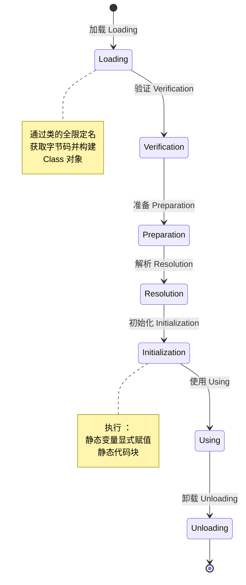
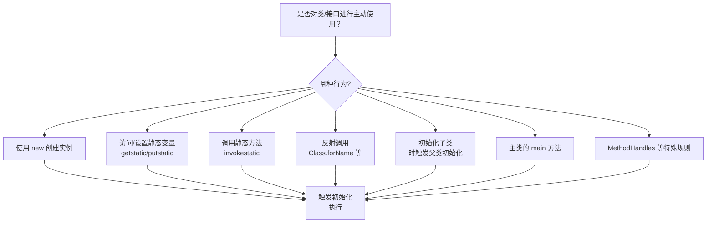
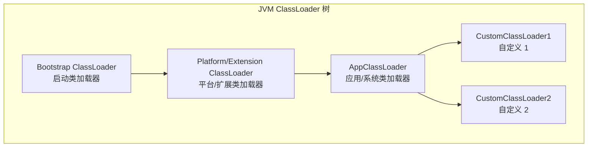
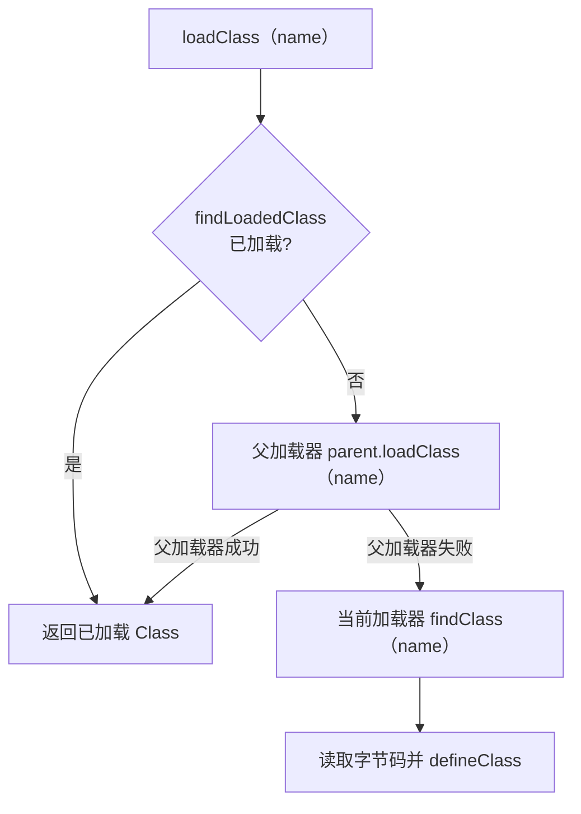
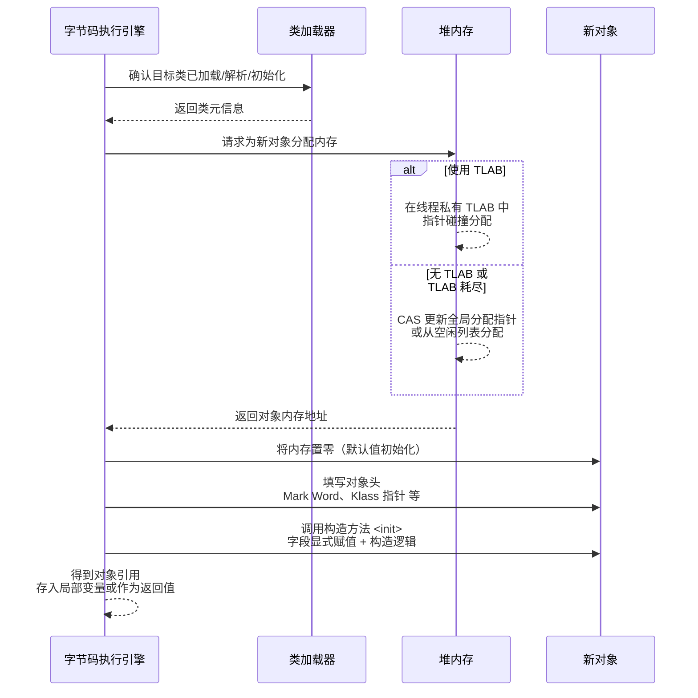
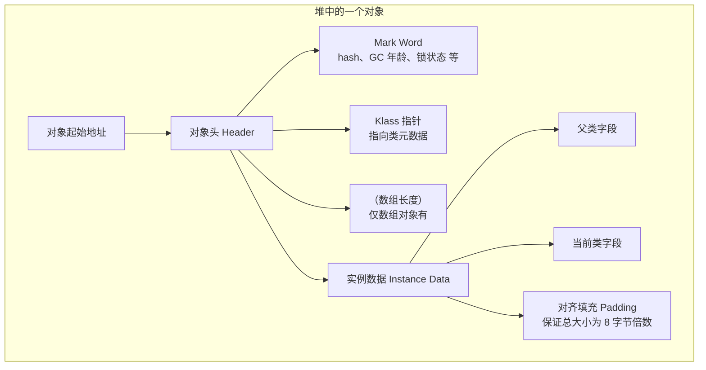
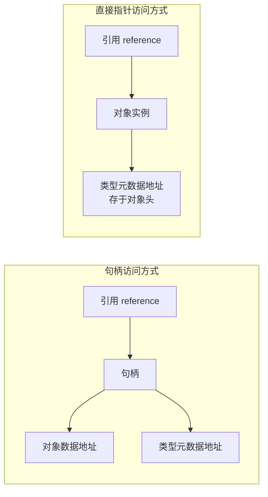

作为 Java 开发者，我们每天都在创建类和对象，但你是否真正理解过这些过程在 JVM 中是如何运作的？从编写代码到程序运行，JVM 在背后做了大量复杂而精妙的工作。本文将带你深入 JVM 内部，揭开类加载和对象创建的神秘面纱。

---

## 一、类加载机制

### 1.1 类的生命周期

先看 JVM 视角下，一个类从出生到死亡大致要经历哪些阶段。

JVM 规范中，一个类的生命周期包括：

1. **加载（Loading）**
2. **连接（Linking）**
   - 验证（Verification）
   - 准备（Preparation）
   - 解析（Resolution）
3. **初始化（Initialization）**
4. 使用（Using）
5. 卸载（Unloading）

用一张状态图表示：



各阶段职责简述：

- **加载**：把 `.class` 字节码读进来，放进方法区/元空间中，并在堆上创建 `java.lang.Class` 对象。
- **验证**：校验字节码是否符合 JVM 规范，是否安全。
- **准备**：为静态变量分配内存，并设置**默认初始值**（不是你写的赋值）。
- **解析**：将常量池中的符号引用（String 形式）替换为直接引用（可以直接定位到目标的指针/句柄）。
- **初始化**：执行 `<clinit>`，也就是静态变量显式赋值和静态代码块。
- **使用**：平时我们写代码使用类，就是这个阶段。
- **卸载**：在符合条件时，由 GC 回收类元数据和对应的 `Class` 对象。

后面 1.3 会详细展开每个阶段在做什么。

### 1.2 类加载的时机

一个常见误区：**类加载 == 类初始化**。实际上这两个阶段是分开的。

- “加载”“验证”“准备”“解析”可以在**需要时**或**提前**完成；
- “初始化”则有严格的触发条件。

JVM 规范定义了“**对类或接口的主动使用（active use）**”会触发其初始化：

- 使用 `new` 创建该类的实例
- 读取或设置类的静态变量（`getstatic` / `putstatic`）  
  - 不包括编译期常量的读取（后面会讲）
- 调用类的静态方法（`invokestatic`）
- 使用反射调用该类（如 `Class.forName("com.example.Foo", true, cl)`）
- 初始化一个类时，如果其父类尚未初始化，会先初始化父类
- JVM 启动时，包含 `main` 方法的主类
- 一些涉及 `MethodHandles` 的特殊用法

用一个小流程图表示：



#### 被动引用不会触发初始化

例如：

```java
public class Parent {
    public static int v = 1;
    static {
        System.out.println("Parent init");
    }
}

public class Child extends Parent {
    static {
        System.out.println("Child init");
    }
}

public class Test {
    public static void main(String[] args) {
        System.out.println(Child.v);
    }
}
```

输出：

```text
Parent init
1
```

- 通过子类 `Child` 访问父类 `Parent` 的静态字段，只会触发父类初始化；
- 子类没有被“主动使用”，不会初始化。

这一点经常出现在面试题与类加载行为分析中。

### 1.3 类加载过程详解

#### 1）加载（Loading）

加载阶段主要做三件事情：

1. 通过类的**全限定名**获取字节流：
   - 本地 `.class` 文件；
   - JAR 包；
   - 网络、数据库；
   - 运行期生成（ASM、CGLIB 等）。
2. 把字节流读到内存中，并转换为**方法区中的数据结构**（类元信息）。
3. 在 Java 堆中生成一个 `java.lang.Class` 对象，作为该类的**运行时表示**。

这一步由 ClassLoader 完成，具体实现因不同加载器而异。

#### 2）验证（Verification）

目标是确保字节码“长得正常且不会瞎搞”，通常分为四类检查：

- **文件格式验证**
  - `0xCAFEBABE` 魔数；
  - 主/次版本号；
  - 常量池结构等。
- **元数据验证**
  - 类是否有合法父类（除 `Object` 外不能没有父类）；
  - final 类不能被继承；
  - 抽象类/接口的实现是否完整。
- **字节码验证**
  - 类型安全：不会把一个对象当成完全不兼容的类型使用；
  - 局部变量在使用前是否已初始化；
  - 操作数栈深度是否溢出；
  - 跳转指令目标是否在方法体范围内。
- **符号引用验证**
  - 常量池中的类、字段、方法引用，在当前 ClassLoader 环境中能否被解析；
  - 访问权限检查。

这一步是安全基线，生产环境几乎不会去关闭。

#### 3）准备（Preparation）

准备阶段的任务：

> 为**类变量（静态变量）**分配内存，并设置**默认初始值**。

例如：

```java
public static int a;       // 默认 0
public static Object obj;  // 默认 null
```

注意：此时不会执行你写的赋值语句和静态代码块，那些属于后面的“初始化”阶段。

##### 编译期常量的特殊行为

```java
public class ConstDemo {
    public static final int A = 1;           // 编译期常量
    public static final String S = "hi";     // 编译期常量
    public static final Object O = new Object(); // 运行期才能确定
}
```

- 对于基本类型和字符串，且能在编译期确定值（如 `1`、`"hi"`），编译器会把它们“内联”到使用它们的类常量池；  
  读取这些值时，不一定会触发 `ConstDemo` 初始化。
- 对于 `O` 这种引用常量，需要在运行期调用构造方法才能得到；  
  访问它一定会触发 `ConstDemo` 的 `<clinit>`。

#### 4）解析（Resolution）

解析阶段：

> 将常量池中的**符号引用**替换为**直接引用**。

- 符号引用（Symbolic Reference）只是一个“名字”，例如：
  - `"java/lang/String"`；
  - `"println(Ljava/lang/String;)V"`。
- 直接引用（Direct Reference）则是可以直接指向目标内存地址的结构：
  - 指向方法区/元空间中某个类、字段或方法的指针/句柄。

解析一般分为：

- 类或接口解析；
- 字段解析；
- 方法解析；
- 接口方法解析。

解析不一定要 **一次性** 完成，JVM 常会对某些符号引用做延迟解析，以提升启动速度。

#### 5）初始化（Initialization）

初始化是整个类加载过程中**对程序行为影响最大**的阶段：

- 执行 `<clinit>` 方法；
- 完成静态变量显式赋值和静态代码块的执行。

编译器会将类似下面的代码：

```java
public class InitDemo {
    public static int a = 1;
    static {
        a = 2;
    }
}
```

编译为一个 `<clinit>` 方法，`javap -c InitDemo` 可以看到类似：

```text
0: iconst_1
1: putstatic     #x    // InitDemo.a
4: iconst_2
5: putstatic     #x    // InitDemo.a
8: return
```

##### `<clinit>` 的线程安全性

JVM 保证：

- 同一个类的 `<clinit>` 至多只会被执行一次；
- 若多个线程同时触发类初始化：
  - 只有一个线程执行 `<clinit>`；
  - 其他线程要么阻塞等待，要么直接看到已完成的初始化结果。

因此：

- 不要在静态初始化中做复杂逻辑（远程调用、文件 IO、重锁等待等），否则容易引发**初始化死锁**或**初始化超时**；
- 如果必须做，建议拆到运行期的懒加载逻辑，而不是 `<clinit>` 中。

### 1.4 类加载器

类加载器（ClassLoader）决定了**类从哪儿加载、由谁管理**，也是很多“类冲突问题”的核心。

#### 1.4.1 几种常见 ClassLoader

以 HotSpot 为例，常见的类加载器有：

- **Bootstrap ClassLoader（启动类加载器）**
  - 由 C/C++ 实现，不是 Java 对象；
  - 负责加载 JDK 核心类库，如 `java.lang.*`、`java.util.*` 等。
- **Platform / Extension ClassLoader（平台/扩展类加载器）**
  - JDK 9 前称为扩展类加载器，用于加载扩展库；
  - JDK 9 后改名 Platform ClassLoader，加载平台相关模块。
- **AppClassLoader（应用/系统类加载器）**
  - 负责加载应用 classpath 下的类；
  - `ClassLoader.getSystemClassLoader()` 返回它。
- **自定义 ClassLoader**
  - 你可以继承 `java.lang.ClassLoader`，实现自定义的 `findClass`：
    - 从指定目录、网络、数据库加载类；
    - 对类字节码做加解密、增强（AOP、监控）等。

用一张图看不同 ClassLoader 之间的关系：



#### 1.4.2 双亲委派模型

`ClassLoader.loadClass(String name)` 的默认实现体现了**双亲委派模型**：

1. 先检查此类是否已经被加载过，若是，直接返回缓存；
2. 否则把类加载请求委托给父加载器；
3. 若父加载器都无法完成加载，再由当前加载器尝试 `findClass`。

用流程图表示：



**好处：**

- 安全性：
  - 无法用自定义类替换 JDK 核心类；
- 一致性：
  - 核心类由 Bootstrap 统一加载，避免重复加载产生“多份核心类”。

#### 1.4.3 何时会“打破”双亲委派？

现实世界中，有些场景需要“绕开一部分双亲委派”，典型如：

- **JDBC SPI**
  - `DriverManager` 在核心类库中，由 Bootstrap 加载；
  - 具体的 JDBC 驱动类在应用 ClassLoader 中；
  - Bootstrap 看不见下层的驱动类；
  - 解决方案：使用 **线程上下文类加载器（Thread Context ClassLoader）**，由上层业务代码把应用 ClassLoader 传给底层框架使用。

- **应用服务器/OSGi/插件系统**
  - 需要将不同应用、不同插件的类做**隔离**；
  - 同一个类的不同版本要能并存；
  - 典型做法：
    - 为每个应用/插件单独创建 ClassLoader；
    - 定义更复杂的类加载拓扑，而不是单一上的父子关系。

- **热部署/热更新**
  - 通过**丢弃旧 ClassLoader**（及其加载的所有类），再创建新 ClassLoader 加载新版本类，实现“热部署”；
  - 因此很多元空间泄漏，本质上是：ClassLoader 没被回收。

#### 1.4.4 “类的唯一性”：类名 + ClassLoader

在 JVM 中，一个类的身份由两部分共同确定：

> **类的全限定名 + 加载它的 ClassLoader 实例**

这会带来一些有趣的现象：

- 即使两个 `.class` 文件**字节码完全一致**，只要是不同 ClassLoader 加载，它们就是**两个不同的类**；
- 你可能见过这样诡异的异常：

```text
java.lang.ClassCastException: com.example.Foo
  cannot be cast to com.example.Foo
```

两个 `Foo` 来自不同 ClassLoader，因此在 JVM 看来是两种完全不同的类型，这在插件框架、容器环境（Tomcat、Spring Boot Loader 等）中非常常见。

---

## 二、对象创建过程

有了类，才能创建对象。下面来看一个对象从 `new` 出来，到在堆中“站稳脚跟”的完整过程。

### 2.1 对象创建的步骤

先看一个最简单的示例：

```java
public class ObjectCreateDemo {
    public static void main(String[] args) {
        Object obj = new Object();
    }
}
```

用 `javap -c ObjectCreateDemo` 可以看到类似的字节码：

```text
0: new           #2   // class java/lang/Object
3: dup
4: invokespecial #1   // Method java/lang/Object."<init>":()V
7: astore_1
```

含义：

1. `new`：在堆上为 `Object` 分配内存，但还未执行构造方法；
2. `dup`：复制引用，构造方法用一份，局部变量保存一份；
3. `invokespecial`：调用 `<init>` 构造方法；
4. `astore_1`：将引用存入本地变量表（也就是 `obj`）。

整体过程可以抽象为以下几个阶段，用时序图表示：



分解说明：

#### 2.1.1 类加载检查

执行 `new` 指令前，JVM 需要确认：

- 目标类已经被**加载、验证、准备、解析**；
- 如果还未初始化，则先触发该类的初始化（即执行 `<clinit>`）。

因此，“第一次 new 某个类的对象”通常会触发类的初始化。

#### 2.1.2 在堆上分配内存

JVM 会在堆上为对象分配一块连续内存，常见两种分配策略：

1. **指针碰撞（Bump-the-pointer）**
   - 堆被视为一块连续空间，已用和未用部分中间有个分界指针；
   - 分配时，只需将分界指针向空闲一侧移动一个对象大小的距离；
   - 实现简单、速度极快；
   - 一般配合“复制/压缩”的 GC 算法，保持堆空间相对规整。

2. **空闲列表（Free List）**
   - 堆内存存在很多空洞，维护一个记录空闲块的列表；
   - 分配时从空闲块中挑出一块足够大的；
   - 更适合存在大量不同大小对象、以及碎片的场景；
   - 分配速度相对略慢，逻辑复杂。

##### 线程安全与 TLAB

多线程同时分配对象，会产生并发问题。HotSpot 的典型做法：

- 在共享堆上通过 **CAS + 重试** 更新分配指针；
- 同时为每个线程在新生代里划出一小块 **TLAB（Thread Local Allocation Buffer）**：
  - 在线程自己的 TLAB 内，对象分配可以直接“指针碰撞”，无需加锁；
  - TLAB 用尽时，再回到共享堆拿一块新的 TLAB。

许多文章说“new 很慢”，但在 TLAB、新生代 GC、JIT 优化加持下，小对象分配其实非常快，这也是“**敢于 new**”的底气。

#### 2.1.3 内存置零（默认初始化）

分配到对象内存后，JVM 会对其进行**零值初始化**：

- `int` → 0
- `boolean` → false
- 引用类型 → null
- 其他基本类型也各有对应的默认零值。

这一步保证了，只要对象被创建成功，其实例字段在 Java 语义下就已经具备合法的默认值。

#### 2.1.4 设置对象头

对象头通常包含：

- **Mark Word**
  - hashCode；
  - GC 年龄（分代年龄）；
  - 锁状态（无锁、偏向锁、轻量级锁、重量级锁）；
  - GC 标记等。
- **Klass 指针**
  - 指向类的元数据，用于确定对象属于哪个类、有哪些字段/方法。
- **数组长度（若是数组对象）**

这些信息是在对象创建时就确定好的一部分基础元信息。

#### 2.1.5 执行构造方法 `<init>`

接下来通过 `invokespecial` 调用构造方法 `<init>`。在这里会：

- 隐式或显式调用 `super()` 构造父类；
- 按声明顺序对当前类的实例字段做显式赋值；
- 执行构造器方法体内你写的那段逻辑。

**实例字段的真实初始化顺序** 一般是：

1. 父类实例字段：默认值 → 显式赋值 → 父类构造方法；
2. 当前类实例字段：默认值（之前的“清零”）；
3. 当前类实例字段：显式赋值、实例初始化块 `{}`；
4. 当前类构造方法体代码。

理解这个顺序，对于排查一些“明明赋值了为什么还是 null”的场景非常有帮助。

### 2.2 对象的内存布局

一个 Java 对象在堆中的样子，大致可以抽象为三部分：

- 对象头（Header）
- 实例数据（Instance Data）
- 对齐填充（Padding）

用图表示：



#### 2.2.1 对象头（Header）

**Mark Word**：

- 未加锁时：
  - 存放对象的哈希码（可能是延迟计算）；
  - 分代年龄；
  - GC 标记等。
- 加锁时：
  - 存放偏向锁、轻量级锁、重量级锁相关信息。

**Klass 指针**：

- 指向方法区/元空间中的“类元数据”（Klass 结构）；
- 通过它可以找到该对象所属的类、字段布局、方法表等。

**数组长度**（仅数组有）：

- 存放数组元素个数，JVM 访问数组元素时需要这项信息进行边界检查。

#### 2.2.2 实例数据（Instance Data）

- 包含当前类和父类所有实例字段；
- 字段的实际排布顺序不仅和源代码声明顺序有关，也受：
  - 字段类型大小；
  - 对齐策略；
  - JIT 编译器优化策略  
    等因素影响。

要想详细观察某个类的对象布局，可以使用 JOL（Java Object Layout）：

```xml
<dependency>
    <groupId>org.openjdk.jol</groupId>
    <artifactId>jol-core</artifactId>
    <version>0.17</version>
</dependency>
```

示例：

```java
public class Foo {
    int a;
    long b;
    Object ref;
}

public static void main(String[] args) {
    System.out.println(ClassLayout.parseClass(Foo.class).toPrintable());
}
```

JOL 会打印出对象头、各字段的偏移量、对象总大小等信息。

#### 2.2.3 对齐填充（Padding）

大多数 JVM 要求对象大小是 **8 字节的整数倍**（也有其他对齐策略，取决于实现和启动参数）。如果对象头 + 实例数据之和不是 8 的倍数，则会在末尾自动填充若干无意义字节，以保证对齐。

对齐的好处：

- 提升 CPU 访问效率；
- 更好利用缓存行。

### 2.3 对象的访问定位

JVM 规范并没有规定 “引用” 必须长成什么样，因此不同实现可以选择不同的对象访问方式。

两种典型方案：



#### 2.3.1 句柄访问（Handle）

- 堆里会维护一块“句柄池”；
- 每个对象对应一个句柄；
- Java 引用中保存的是**句柄地址**；
- 句柄中保存：
  - 对象数据地址；
  - 类型元数据地址。

**优点：**

- 对象在 GC 移动时，只需修改句柄中的地址；
- 所有引用仍然指向原来的句柄，不需要逐个更新。

**缺点：**

- 每次访问对象，多一次“句柄 → 对象”的间接寻址，略有性能损耗。

#### 2.3.2 直接指针访问（Direct Pointer）

- Java 引用直接保存**对象在堆中的地址**；
- 对象头中再保存指向类型元数据的指针。

**优点：**

- 访问路径短，性能略优；
- 对象头统一保存对象元数据入口，结构清晰。

**缺点：**

- 对象移动时，必须更新所有引用该对象的地方；
- 实现 GC 时更复杂，但现代 JVM 已经把这件事处理得很成熟了。

HotSpot 主流实现采用**直接指针**的方式，但在 JNI 等场景仍会内部维护句柄表。

---

## 三、实战案例

概念讲完，再看几个典型的实战场景，帮助把知识和日常开发建立联系。

### 案例一：`ClassNotFoundException` vs `NoClassDefFoundError`

**现象一：**

```text
java.lang.ClassNotFoundException: com.example.Foo
    at java.lang.Class.forName0(Native Method)
    at java.lang.Class.forName(Class.java:348)
    ...
```

- 多发生在显式 `Class.forName("com.example.Foo")` 或 `ClassLoader.loadClass("...")` 时；
- 表示：在当前 ClassLoader 的搜索范围内，找不到这个类的定义；
- 常见原因：
  - classpath 中缺少对应 JAR；
  - JAR 放到容器的“错误位置”，没被应用 ClassLoader 加载。

**现象二：**

```text
java.lang.NoClassDefFoundError: com/example/Foo
    at com.example.Bar.useFoo(Bar.java:10)
    ...
Caused by: java.lang.ExceptionInInitializerError
    ...
```

- 是 `Error`，由 JVM 抛出；
- 含义：编译期存在的类，在运行时“无法完成定义”：
  - 典型情况：类初始化（静态代码块 / 静态字段赋值）时抛异常，导致初始化失败；
  - 之后再使用这个类，就会抛 `NoClassDefFoundError`。

**排查思路：**

- `ClassNotFoundException`：  
  - 看“谁”在加载这个类（哪个 ClassLoader）；  
  - 检查依赖是否在正确的 classpath 下；
- `NoClassDefFoundError`：  
  - 通常要往上翻栈，看是否有 `ExceptionInInitializerError`；  
  - 多半是静态初始化逻辑有问题。

### 案例二：静态初始化导致的“类初始化死锁”

```java
public class A {
    static {
        System.out.println("A init");
        B.doSomething();
    }
    public static void doSomething() {}
}

public class B {
    static {
        System.out.println("B init");
        A.doSomething();
    }
    public static void doSomething() {}
}
```

在多线程环境下，如果两个线程分别首次使用 `A` 和 `B`（触发 `<clinit>`）：

- JVM 会为每个类的初始化加锁；
- 一个线程拿着 A 的 `<clinit>` 锁，等待 B 初始化；
- 另一个线程拿着 B 的 `<clinit>` 锁，等待 A 初始化；
- 容易造成**死锁或长时间卡顿**。

经验建议：

- 尽量保持 `<clinit>` 简单，不做跨系统调用、IO、锁等待等复杂逻辑；
- 如果必须做复杂初始化逻辑，建议用懒加载的方式，在普通方法中进行，并明确控制并发与超时。

### 案例三：ClassLoader 泄漏导致 Metaspace OOM（Web 容器）

很多 Web 容器（Tomcat、Jetty、Spring Boot Loader）支持应用热部署：

- 每次部署都会为应用创建一个新的 ClassLoader；
- 老 ClassLoader 若仍被某处引用，就无法回收；
- 对应的所有类元数据都“悬挂”在元空间中；
- 重复几次部署，最终导致 **Metaspace OOM**。

常见原因：

- 应用代码中有 **静态字段** 保存线程、线程池、`Timer`、全局缓存等；
- 这些线程的 contextClassLoader 指向老的应用 ClassLoader；
- 导致老 ClassLoader 被线程强引用，无法被 GC。

排查方向：

- 使用 `jmap -clstats`、`jcmd VM.classloader_stats` 等命令查看 ClassLoader 数量；
- 使用 MAT / VisualVM 等工具分析谁在引用这些 ClassLoader；
- 避免在应用代码中创建**长生命周期的静态线程池/定时器**而不释放。

---

## 四、性能优化建议

围绕“类加载”和“对象创建”，有几条比较通用、实践性强的性能建议。

### 4.1 避免在静态初始化中做重活

- 不要在静态代码块中做：
  - 大量 IO（读配置、远程调用）；
  - 复杂依赖初始化；
  - 高风险同步逻辑。
- 否则会拖慢应用启动，甚至引发初始化死锁。
- 更好的做法：
  - 使用懒加载（按需初始化）；
  - 使用单例模式 + 双重检查锁定 + `volatile` 等方式实现。

### 4.2 不要盲目“对象池化”，合理利用 new 的性能

在现代 JVM 上，小对象 `new` 的成本往往非常低：

- TLAB 减少了分配锁竞争；
- 新生代 GC 成本极小；
- 逃逸分析 + 标量替换还能让很多对象根本“不上堆”。

错误的对象池化可能带来：

- 额外的锁竞争或 CAS 开销；
- 池大小过大导致内存占用飙升；
- 对象复用时忘记 reset 状态，导致脏数据。

合理策略：

- 普通业务对象（DTO、VO、简单 domain）：**放心 `new`**；
- 池化适合的对象：
  - 连接（数据库、网络）；
  - 大数组、大对象；
  - 构建成本极高，且有复用价值的对象。

### 4.3 帮助 JVM 做逃逸分析与栈上分配

JIT 编译器会尝试分析对象是否“逃出”方法或线程：

- 不逃逸的对象有机会：
  - 分配在栈上，而非堆中；
  - 或被拆分成几个局部变量（标量替换）。

开发者要做的是：

- 尽量让对象“局部化”使用；
- 避免把不必要的对象暴露给外部方法或全局状态；
- 减少对对象的不必要复制与缓存。

### 4.4 避免频繁、重复的类加载操作

- 频繁使用反射加载类时：
  - 建议对 `Class<?>` / `Method` / `Field` 等进行缓存；
  - 避免每次都 `Class.forName` + `getMethod`。
- 在某些服务框架中，可考虑在启动阶段“预热”关键类和方法的加载与解析。

### 4.5 针对对象创建与 GC 做有节制的参数调优

- 一般情况下，不建议随意调整 JVM 参数；
- 但在经过压测与分析后，可以酌情：
  - 调整堆大小及新生代/老年代比例；
  - 选择合适的 GC 算法（G1、ZGC、Shenandoah 等）；
  - 监控对象分配速率和 GC 停顿时间，以验证参数调整效果。

---

## 五、常见面试题

结合前面的内容，列几个常见的面试题，并给出简要要点（不展开论述，方便自测）。

1. **简述类加载的整个过程？**
   - 加载 → 验证 → 准备 → 解析 → 初始化 → 使用 → 卸载；
   - 重点说清每个阶段做什么，尤其是准备/解析/初始化。

2. **什么时候会触发类的初始化？**
   - new、访问/设置静态变量、调用静态方法、反射主动加载、初始化子类/主类等；
   - 什么是被动引用：如通过子类访问父类静态字段，不会触发子类初始化。

3. **`static final` 常量是否一定会触发类初始化？**
   - 编译期常量（基本类型 + String 且值在编译期可确定）：通常不会触发；
   - 运行期常量（如 `new Object()`）：访问时会触发初始化。

4. **双亲委派模型是什么？有什么好处？**
   - 加载请求自下而上委托，优先父加载器；
   - 保证核心类库不会被篡改，保证类在 JVM 中的一致性。

5. **怎么“破坏”双亲委派？有哪些实际场景？**
   - 自定义 ClassLoader 重写 `loadClass` 或通过线程上下文类加载器；
   - 场景：JDBC SPI、应用服务器、OSGi、插件系统、热部署等。

6. **类的唯一性是如何确定的？**
   - 由“类的全限定名 + 加载它的 ClassLoader”共同决定；
   - 因此会出现 `Foo cannot be cast to Foo` 的情况。

7. **简述一个对象从 `new` 到真正可用的过程？**
   - 类加载检查；
   - 堆上分配内存（指针碰撞 / 空闲列表 + TLAB）；
   - 内存置零；
   - 设置对象头；
   - 执行构造方法 `<init>`；
   - 得到对象引用。

8. **对象在 JVM 中是如何访问的？**
   - 句柄访问 vs 直接指针访问；
   - HotSpot 采用直接指针。

9. **解释 `ClassNotFoundException` 和 `NoClassDefFoundError` 的区别？**
   - 前者是受检异常，多在显式加载类时抛出；
   - 后者是 Error，多在类初始化失败后再次使用它时抛出。

10. **对象一定分配在堆上吗？**
    - 理论上不一定；
    - 通过逃逸分析，可能出现栈上分配和标量替换；
    - 这是 JIT 的优化行为，对开发者透明。

---

## 六、总结

类加载与对象创建，是 JVM 里最基础、也是最容易“只停留在背诵层面”的两个主题。

- 从**类加载机制**看：
  - 理解生命周期（加载、连接、初始化……）能帮助你分析各种类冲突、初始化异常；
  - 理解类加载器和双亲委派，能帮你定位容器中的类隔离问题和 ClassLoader 泄漏。
- 从**对象创建过程**看：
  - 理解对象创建的每一步，能帮助你理解 GC 行为、锁优化，以及“new 的真实成本”；
  - 理解对象内存布局和访问方式，是进一步理解锁实现与性能调优的基础。

建议的下一步：

1. 结合《深入理解 Java 虚拟机》第 2、3、7 章，再把文中的概念系统过一遍；
2. 用 `javap` 看一下你自己代码的字节码，尤其是类初始化和对象创建相关指令；
3. 写一个简单的自定义 ClassLoader，体会“类名 + ClassLoader = 唯一类”的含义；
4. 在测试环境中，用 jol 观察几个类的对象布局，理解对象头和对齐填充。

当你能在脑子里清晰地画出那些 Mermaid 图，而不仅仅是“记住几个词”时，JVM 相关的问题就不再神秘，而且会成为你定位线上疑难问题时非常趁手的“内功”。

### 推荐资源

**书籍**

- 《深入理解 Java 虚拟机（第3版）》周志明
- 《Java 性能权威指南》
- 《Java 并发编程实战》