> 为什么两个线程同时执行 `count++` 一万次，结果却不是两万？为什么一个线程修改了共享变量，另一个线程却"视而不见"？为什么看起来顺序执行的代码，实际运行时却"乱了套"？
>
> 这篇文章将带你从计算机硬件架构出发，深入理解Java内存模型（JMM），彻底搞懂并发编程中的"三大恶魔"——可见性、原子性、有序性问题的本质，以及Java提供的各种解决方案。

------

## 前言

在我刚开始学习Java并发编程的时候，经常被各种概念搞得晕头转向：什么是可见性？volatile到底解决了什么问题？synchronized和Lock有什么区别？为什么有了synchronized还需要volatile？

后来我发现，很多人学不好并发编程，是因为**只学了"是什么"，没有理解"为什么"**。比如说，很多教程会告诉你"volatile保证可见性"，但如果你不理解可见性问题是怎么产生的，你就很难真正理解volatile的作用，更不用说在实际开发中正确使用它了。

所以这篇文章，我会从**问题的根源**讲起，带你理解：


```mermaid
flowchart LR
    A["🔍 硬件架构"] --> B["💡 问题根源"] --> C["📐 JMM规范"] --> D["🛠️ 解决方案"]
    
    style A fill:#e8f5e9
    style B fill:#fff3e0
    style C fill:#e3f2fd
    style D fill:#fce4ec
```

话不多说，让我们开始吧！

------

## 一、从一个诡异的Bug说起

在讲理论之前，我们先来看一个实际的例子。请你先思考一下，下面这段代码的运行结果是什么：

```java
public class VisibilityProblem {
    
    private static boolean running = true;
    
    public static void main(String[] args) throws InterruptedException {
        
        // 启动一个工作线程
        Thread worker = new Thread(() -> {
            System.out.println("Worker thread started...");
            int count = 0;
            while (running) {
                count++;
            }
            System.out.println("Worker thread stopped. Count = " + count);
        });
        
        worker.start();
        
        // 主线程等待1秒后，尝试停止工作线程
        Thread.sleep(1000);
        running = false;
        System.out.println("Main thread set running = false");
    }
}
```

这段代码的逻辑非常简单：主线程启动一个工作线程，工作线程在一个while循环里不断累加计数器；1秒后，主线程把`running`标志设为`false`，期望工作线程能够退出循环并结束。

**你觉得结果会是什么？**

如果你在自己的电脑上运行这段代码（建议使用`-server`模式或者在生产环境的JVM配置下运行），你很可能会发现：**工作线程永远不会停止！** 控制台会输出"Main thread set running = false"，但"Worker thread stopped"这行永远不会打印出来。

这就奇怪了，主线程明明已经把`running`设为`false`了，为什么工作线程还在傻傻地执行while循环呢？难道工作线程"看不见"主线程对`running`的修改吗？

**没错，工作线程确实"看不见"！** 这就是并发编程中最经典的**可见性问题**。

要理解这个问题，我们需要先了解一些计算机硬件的知识。

------

## 二、线程安全问题的根源：硬件架构的"锅"

很多人觉得并发编程难，是因为它不仅涉及软件层面的知识，还涉及硬件层面的原理。但其实，只要你理解了硬件架构为什么要这样设计，并发编程的很多问题就变得顺理成章了。

### 2.1 CPU与内存的速度鸿沟

现代计算机的核心矛盾之一，就是**CPU的速度远远快于内存的速度**。

为了让你对这个速度差异有一个直观的感受，我们来做一个类比。假设CPU访问自己的寄存器需要1秒钟，那么：

| 存储层级  | 实际访问延迟 | 类比时间    | 说明                  |
| --------- | ------------ | ----------- | --------------------- |
| CPU寄存器 | ~0.3ns       | 1秒         | CPU内部，速度最快     |
| L1缓存    | ~1ns         | 3秒         | 每个核心私有，约64KB  |
| L2缓存    | ~3ns         | 10秒        | 每个核心私有，约256KB |
| L3缓存    | ~12ns        | 40秒        | 多核共享，约8-32MB    |
| 主内存    | ~65ns        | **3.5分钟** | 所有核心共享          |
| SSD硬盘   | ~150μs       | **5.8天**   | 持久化存储            |

你看到了吗？CPU访问主内存的时间，相当于访问L1缓存的**60多倍**！如果CPU每次读写数据都要访问主内存，那CPU的大部分时间都会浪费在等待内存上，性能会非常低下。

这就好比你是一个超级高效的厨师（CPU），但每次需要食材（数据）都要跑到几公里外的超市（主内存）去买，那你再厉害也没用，大部分时间都花在路上了。

### 2.2 解决方案：多级缓存架构

为了解决这个问题，计算机科学家们设计了**多级缓存架构**。在CPU和主内存之间，加入了多层高速缓存（Cache），把CPU近期要使用的数据先缓存起来。

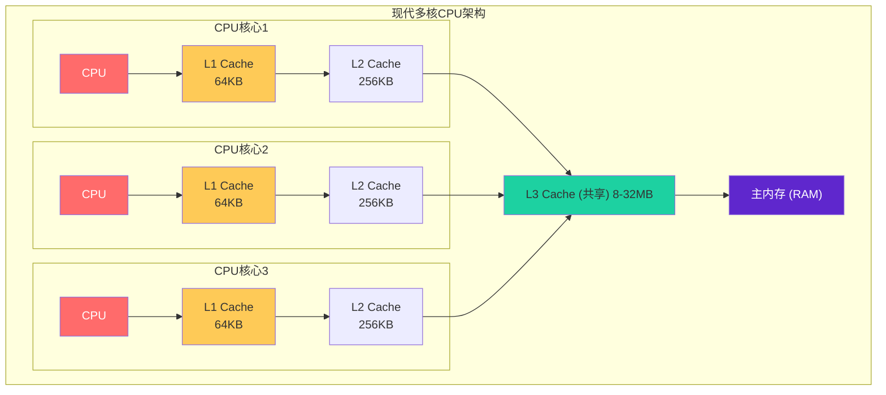
```mermaid
graph TB
    subgraph "现代多核CPU架构"
        subgraph Core1["CPU核心1"]
            CPU1["CPU"]
            L1_1["L1 Cache<br/>64KB"]
            L2_1["L2 Cache<br/>256KB"]
        end
        
        subgraph Core2["CPU核心2"]
            CPU2["CPU"]
            L1_2["L1 Cache<br/>64KB"]
            L2_2["L2 Cache<br/>256KB"]
        end
        
        subgraph Core3["CPU核心3"]
            CPU3["CPU"]
            L1_3["L1 Cache<br/>64KB"]
            L2_3["L2 Cache<br/>256KB"]
        end
        
        L3["L3 Cache (共享) 8-32MB"]
        RAM["主内存 (RAM)"]
    end
    
    CPU1 --> L1_1 --> L2_1 --> L3
    CPU2 --> L1_2 --> L2_2 --> L3
    CPU3 --> L1_3 --> L2_3 --> L3
    L3 --> RAM
    
    style CPU1 fill:#ff6b6b,color:#fff
    style CPU2 fill:#ff6b6b,color:#fff
    style CPU3 fill:#ff6b6b,color:#fff
    style L1_1 fill:#feca57
    style L1_2 fill:#feca57
    style L1_3 fill:#feca57
    style L3 fill:#1dd1a1
    style RAM fill:#5f27cd,color:#fff
```

继续用刚才的厨师类比：现在你不用每次都跑超市了，你有了一个小冰箱（L1缓存）放在灶台边上，一个中冰箱（L2缓存）放在厨房里，还有一个大冰柜（L3缓存）放在院子里。常用的食材就放在小冰箱里，随手就能拿到。

这个设计大大提升了CPU的工作效率。但是，**它也带来了一个新的问题：缓存一致性问题**。

### 2.3 多核缓存带来的问题

在单核CPU时代，只有一个CPU，只有一份缓存，不存在一致性问题。但现在我们的电脑都是多核的，每个核心都有自己的L1、L2缓存。问题来了：**如果两个核心同时缓存了同一个变量，其中一个核心修改了这个变量，另一个核心怎么知道呢？**

让我们回到开头那个诡异的Bug，用图来解释一下发生了什么：

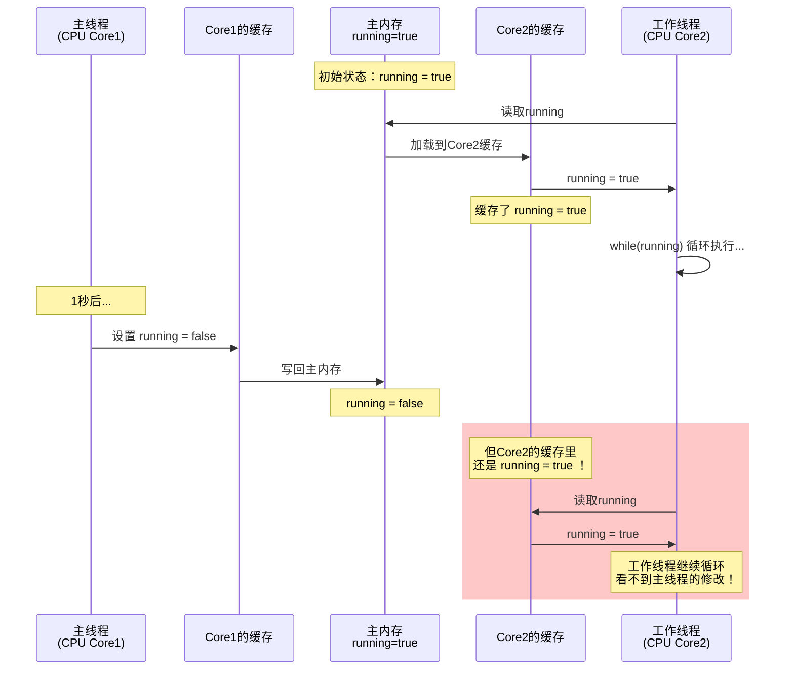
```mermaid
sequenceDiagram
    participant T1 as 主线程<br/>(CPU Core1)
    participant C1 as Core1的缓存
    participant M as 主内存<br/>running=true
    participant C2 as Core2的缓存
    participant T2 as 工作线程<br/>(CPU Core2)
    
    Note over M: 初始状态：running = true
    
    T2->>M: 读取running
    M->>C2: 加载到Core2缓存
    C2->>T2: running = true
    Note over C2: 缓存了 running = true
    
    T2->>T2: while(running) 循环执行...
    
    Note over T1: 1秒后...
    T1->>C1: 设置 running = false
    C1->>M: 写回主内存
    Note over M: running = false
    
    rect rgb(255, 200, 200)
        Note over C2: 但Core2的缓存里<br/>还是 running = true ！
        T2->>C2: 读取running
        C2->>T2: running = true
        Note over T2: 工作线程继续循环<br/>看不到主线程的修改！
    end
```

现在你应该明白了：工作线程运行在Core2上，它在自己的缓存里保存了`running = true`这个值。主线程虽然修改了`running`并写回了主内存，但Core2并不知道这件事，它还在傻傻地读自己缓存里的旧值。这就是**可见性问题**的本质。

### 2.4 编译器和CPU的"自作主张"

除了缓存问题，还有另一个让并发编程变得复杂的因素：**指令重排序**。

为了提升程序执行效率，编译器和CPU都会对指令进行优化和重排序。只要在**单线程环境下**，重排序后的执行结果与顺序执行的结果一致，编译器和CPU就认为这种重排序是合法的。

这个优化原则叫做**as-if-serial语义**：不管怎么重排序，单线程程序的执行结果不能被改变。

举个例子：

```java
int a = 1;     // 语句1
int b = 2;     // 语句2
int c = a + b; // 语句3
```

语句1和语句2之间没有依赖关系，所以编译器可能会把它们的顺序调换。但语句3依赖语句1和语句2的结果，所以语句3一定会在它们之后执行。这种重排序在单线程下没有任何问题。

**但在多线程环境下，重排序就可能导致严重的问题。** 我们稍后会详细讨论这一点。

### 2.5 小结：三大根源

到这里，我们已经找到了线程安全问题的三大根源：

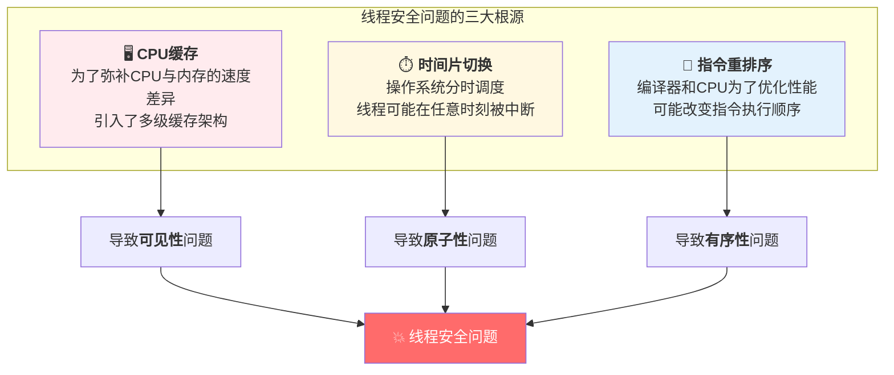
```mermaid
flowchart TB
    subgraph ROOT["线程安全问题的三大根源"]
        A["🖥️ <b>CPU缓存</b><br/>为了弥补CPU与内存的速度差异<br/>引入了多级缓存架构"]
        B["⏱️ <b>时间片切换</b><br/>操作系统分时调度<br/>线程可能在任意时刻被中断"]
        C["🔀 <b>指令重排序</b><br/>编译器和CPU为了优化性能<br/>可能改变指令执行顺序"]
    end
    
    A --> D["导致<b>可见性</b>问题"]
    B --> E["导致<b>原子性</b>问题"]
    C --> F["导致<b>有序性</b>问题"]
    
    D & E & F --> G["💥 线程安全问题"]
    
    style A fill:#ffebee
    style B fill:#fff8e1
    style C fill:#e3f2fd
    style G fill:#ff6b6b,color:#fff
```

这三个根源，分别对应并发编程中的"三大恶魔"：**可见性、原子性、有序性**。接下来，我们来详细分析每一个问题。

------

## 三、并发编程的三大恶魔

### 3.1 第一恶魔：可见性（Visibility）

#### 什么是可见性？

**可见性**是指：当一个线程修改了共享变量的值，其他线程能够**立即**看到这个修改。

在单核CPU时代，所有线程都在同一个核心上执行，共享同一份缓存，所以可见性问题并不突出。但在多核CPU时代，每个核心都有自己的缓存，可见性问题就变得非常普遍了。

我们在开头已经看过一个可见性问题的例子。让我再来解释一下为什么那个工作线程会"看不见"主线程的修改。

#### JIT编译器的激进优化

你可能会问：CPU缓存虽然有延迟，但总会在某个时刻同步吧？为什么工作线程永远看不到修改？

这是因为，除了CPU缓存之外，JIT编译器（Just-In-Time Compiler，即时编译器）也可能对代码进行优化。在那个例子中，JIT编译器分析while循环后发现：

1. 循环体内没有修改`running`变量
2. `running`没有被`volatile`修饰
3. 没有任何同步操作

基于这些观察，JIT编译器认为可以进行一个优化：把`running`的值"提升"到循环外面，避免每次循环都去读取它。优化后的代码可能变成这样：

```java
// 优化前
while (running) {
    count++;
}

// JIT优化后（伪代码）
if (running) {
    while (true) {  // 直接变成死循环！
        count++;
    }
}
```

这个优化在单线程下是完全正确的——既然循环体内没有修改`running`，那它的值就不会变，为什么要每次都读呢？但在多线程下，这个优化就是灾难性的。

#### 如何解决可见性问题？

最直接的解决方案就是使用`volatile`关键字：

```java
private static volatile boolean running = true;
```

加上`volatile`之后，编译器和CPU就知道这个变量可能被多个线程访问，不能对它进行某些优化，每次读取都必须从主内存获取最新值，每次修改都必须立即刷回主内存。

### 3.2 第二恶魔：原子性（Atomicity）

#### 什么是原子性？

**原子性**是指：一个操作或者多个操作，要么全部执行且在执行过程中不被任何因素打断，要么全部不执行。

来看一个经典的例子：

```java
public class AtomicityProblem {
    
    private static int count = 0;
    
    public static void main(String[] args) throws InterruptedException {
        
        Runnable task = () -> {
            for (int i = 0; i < 10000; i++) {
                count++;  // 问题出在这里
            }
        };
        
        Thread t1 = new Thread(task);
        Thread t2 = new Thread(task);
        
        t1.start();
        t2.start();
        t1.join();
        t2.join();
        
        // 期望结果：20000
        // 实际结果：通常小于20000，每次运行结果还不一样
        System.out.println("Count = " + count);
    }
}
```

两个线程，各自执行10000次`count++`，按理说最终结果应该是20000。但如果你运行这段代码，会发现结果几乎总是小于20000，而且每次运行结果都不一样。

#### 为什么count++不是原子操作？

表面上看，`count++`只是简单的一行代码。但在底层，这一行代码实际上包含了三个步骤：

1. **读取**：从内存中读取count的当前值
2. **计算**：将读取的值加1
3. **写回**：将计算结果写回内存

我们可以通过查看字节码来验证这一点。使用`javap -c`命令反编译后，`count++`对应的字节码如下：

```tex
0: getstatic     #2    // 第1步：从常量池读取静态变量count
3: iconst_1            // 将常量1压入操作数栈
4: iadd                // 第2步：执行加法
5: putstatic     #2    // 第3步：将结果写回静态变量count
```

**问题就在于：这三个步骤不是原子的，线程可能在任意两个步骤之间被中断！**

让我们用一个详细的时序图来说明问题是如何发生的：

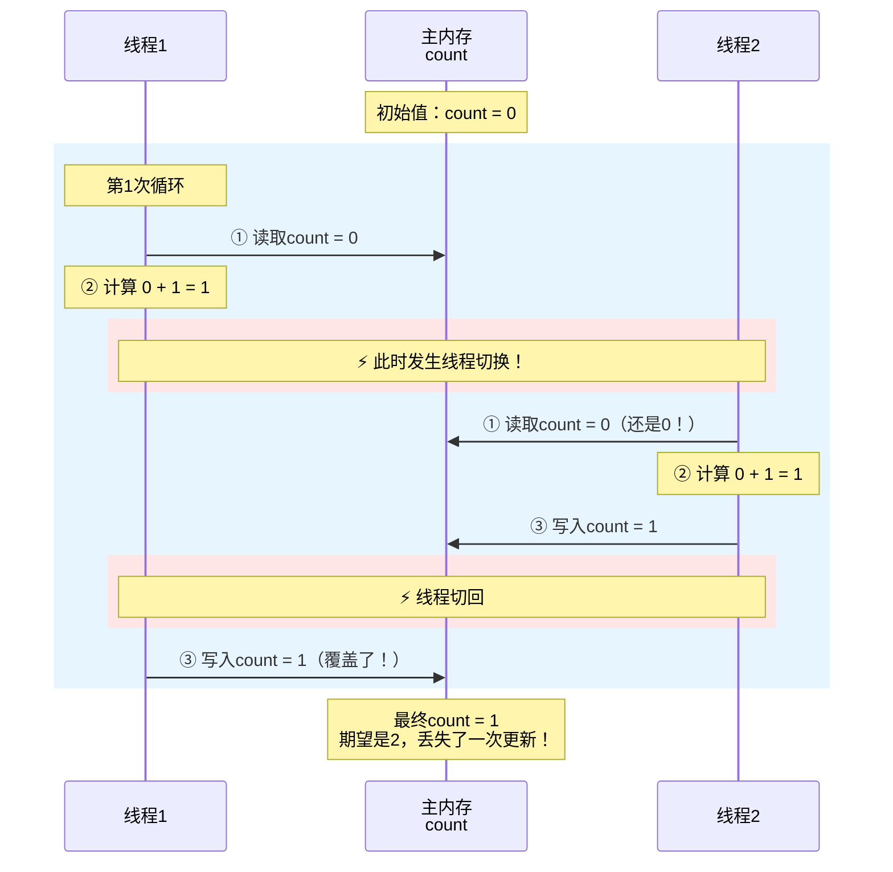
```mermaid
sequenceDiagram
    participant T1 as 线程1
    participant M as 主内存<br/>count
    participant T2 as 线程2
    
    Note over M: 初始值：count = 0
    
    rect rgb(230, 245, 255)
        Note over T1: 第1次循环
        T1->>M: ① 读取count = 0
        Note over T1: ② 计算 0 + 1 = 1
        
        rect rgb(255, 230, 230)
            Note over T1,T2: ⚡ 此时发生线程切换！
        end
        
        T2->>M: ① 读取count = 0（还是0！）
        Note over T2: ② 计算 0 + 1 = 1
        T2->>M: ③ 写入count = 1
        
        rect rgb(255, 230, 230)
            Note over T1,T2: ⚡ 线程切回
        end
        
        T1->>M: ③ 写入count = 1（覆盖了！）
    end
    
    Note over M: 最终count = 1<br/>期望是2，丢失了一次更新！
```

你看到问题了吗？线程1读取了`count = 0`之后，还没来得及写回，就被切换出去了。线程2进来后，也读取到`count = 0`（因为线程1还没写呢），加1后写回1。然后线程1切回来，把它之前计算好的1也写回去。结果，两个线程各执行了一次`count++`，但`count`只增加了1。

这就是经典的**丢失更新（Lost Update）** 问题。

#### 为什么volatile不能解决原子性问题？

有人可能会想：既然`volatile`能保证可见性，让线程每次都读取最新值，那是不是就能解决`count++`的问题呢？

**答案是不能！**

`volatile`确实能保证每次读取都能获取最新值，但`count++`的问题不在于读取旧值，而在于**读取-计算-写回这三个步骤不是原子的**。即使线程1读取的是最新值，在它计算和写回的过程中，线程2仍然可以插进来，导致丢失更新。

让我们把上面的时序图改成使用`volatile`的版本：

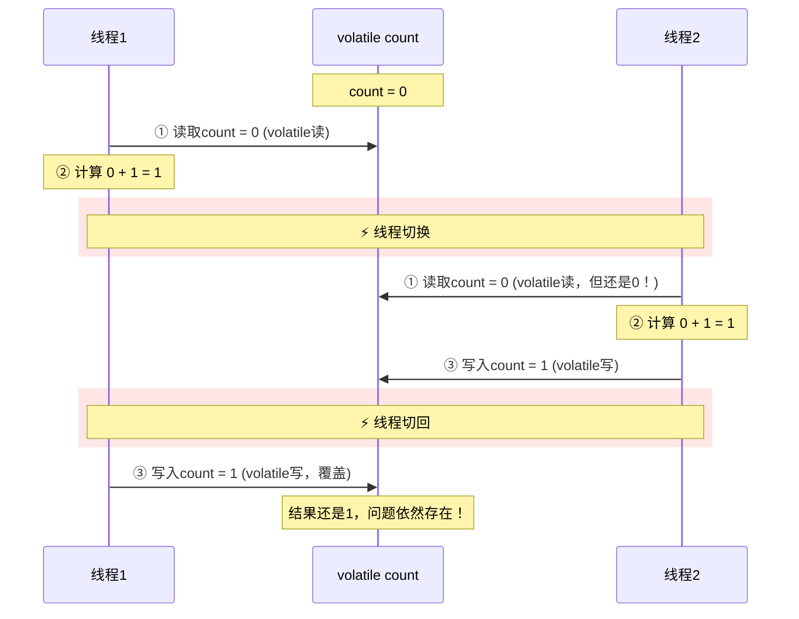
```mermaid
sequenceDiagram
    participant T1 as 线程1
    participant M as volatile count
    participant T2 as 线程2
    
    Note over M: count = 0
    
    T1->>M: ① 读取count = 0 (volatile读)
    Note over T1: ② 计算 0 + 1 = 1
    
    rect rgb(255, 230, 230)
        Note over T1,T2: ⚡ 线程切换
    end
    
    T2->>M: ① 读取count = 0 (volatile读，但还是0！)
    Note over T2: ② 计算 0 + 1 = 1
    T2->>M: ③ 写入count = 1 (volatile写)
    
    rect rgb(255, 230, 230)
        Note over T1,T2: ⚡ 线程切回
    end
    
    T1->>M: ③ 写入count = 1 (volatile写，覆盖)
    
    Note over M: 结果还是1，问题依然存在！
```

问题的关键在于：**线程1读取和写入之间，没有任何机制阻止线程2插进来**。`volatile`保证的是可见性和有序性，但不保证原子性。

#### 如何解决原子性问题？

有两种主要方案：

**方案一：使用synchronized或Lock**

```java
private static int count = 0;
private static final Object lock = new Object();

// 使用synchronized
public static void increment() {
    synchronized (lock) {
        count++;
    }
}
```

`synchronized`保证了同一时刻只有一个线程能执行临界区代码，从而保证了`count++`的原子性。

**方案二：使用原子类（推荐）**

```java
private static AtomicInteger count = new AtomicInteger(0);

public static void increment() {
    count.incrementAndGet();  // 原子自增
}
```

`AtomicInteger`使用CAS（Compare-And-Swap）操作来保证原子性，性能比`synchronized`更好。我们后面会详细介绍CAS。

### 3.3 第三恶魔：有序性（Ordering）

#### 什么是有序性？

**有序性**是指：程序执行的顺序按照代码的先后顺序执行。

在单线程环境下，我们编写的代码是按顺序执行的：先执行语句A，再执行语句B，然后执行语句C。这符合我们的直觉。

但在多线程环境下，由于**编译器优化**和**CPU乱序执行**，程序的实际执行顺序可能与代码顺序不一致，这就是**指令重排序**。

#### 重排序的三个层次


```mermaid
flowchart LR
    A["源代码"] --> B["编译器重排序<br/>(编译期)"] --> C["CPU指令重排序<br/>(运行期)"] --> D["内存系统重排序<br/>(运行期)"] --> E["最终执行序列"]
    
    style B fill:#feca57
    style C fill:#48dbfb
    style D fill:#1dd1a1
```

1. **编译器重排序**：编译器在不改变单线程程序语义的前提下，可以重新安排语句的执行顺序。
2. **CPU指令重排序**：现代处理器采用指令级并行技术，可以将多条指令重叠执行。如果不存在数据依赖，处理器可以改变语句对应的机器指令的执行顺序。
3. **内存系统重排序**：由于处理器使用缓存和读/写缓冲区，使得加载和存储操作看起来像是在乱序执行。

#### 一个反直觉的例子

下面这个例子可以帮助你理解重排序的威力：

```java
public class ReorderingExample {
    
    private static int x = 0, y = 0;
    private static int a = 0, b = 0;
    
    public static void main(String[] args) throws InterruptedException {
        
        int iteration = 0;
        
        while (true) {
            iteration++;
            
            // 重置变量
            x = 0; y = 0;
            a = 0; b = 0;
            
            Thread t1 = new Thread(() -> {
                a = 1;   // 语句1
                x = b;   // 语句2
            });
            
            Thread t2 = new Thread(() -> {
                b = 1;   // 语句3
                y = a;   // 语句4
            });
            
            t1.start();
            t2.start();
            t1.join();
            t2.join();
            
            // 按照程序顺序，x=0且y=0是不可能的！
            // 但实际上，这种情况真的会发生
            if (x == 0 && y == 0) {
                System.out.println("第 " + iteration + " 次迭代发现了重排序！");
                System.out.println("x = " + x + ", y = " + y);
                break;
            }
        }
    }
}
```

让我们来分析一下：按照正常的程序执行顺序，不可能出现`x=0`且`y=0`的情况。为什么呢？

- 如果语句1先于语句4执行，那么`y = a`时，`a`已经是1了，所以`y=1`
- 如果语句3先于语句2执行，那么`x = b`时，`b`已经是1了，所以`x=1`
- 无论怎么交替执行，`x`和`y`至少有一个是1

**但是**，如果发生了重排序：

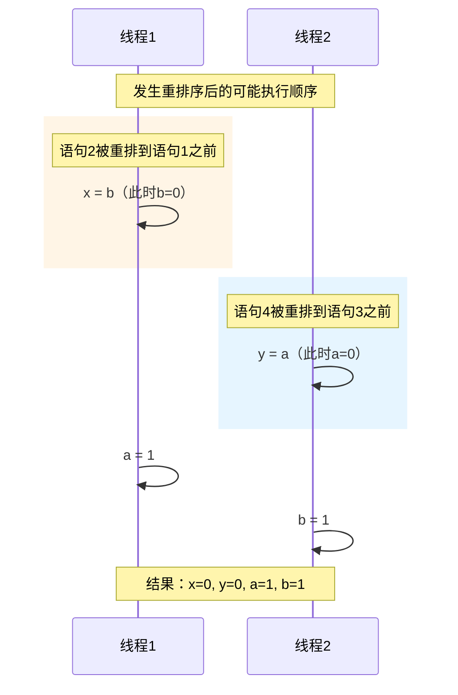
```mermaid
sequenceDiagram
    participant T1 as 线程1
    participant T2 as 线程2
    
    Note over T1,T2: 发生重排序后的可能执行顺序
    
    rect rgb(255, 245, 230)
        Note over T1: 语句2被重排到语句1之前
        T1->>T1: x = b（此时b=0）
    end
    
    rect rgb(230, 245, 255)
        Note over T2: 语句4被重排到语句3之前
        T2->>T2: y = a（此时a=0）
    end
    
    T1->>T1: a = 1
    T2->>T2: b = 1
    
    Note over T1,T2: 结果：x=0, y=0, a=1, b=1
```

在单线程视角下，语句1和语句2之间没有数据依赖（语句2用的是`b`，不是`a`），所以编译器或CPU认为把它们的顺序调换是安全的。语句3和语句4同理。

但在多线程视角下，这种重排序就可能导致意料之外的结果。

#### 双重检查锁定（DCL）问题

有序性问题最著名的案例就是**双重检查锁定单例模式**（Double-Checked Locking，简称DCL）：

```java
public class Singleton {
    
    private static Singleton instance;  // 注意：没有volatile！
    
    private Singleton() {
        // 私有构造函数
    }
    
    public static Singleton getInstance() {
        if (instance == null) {                  // 第一次检查
            synchronized (Singleton.class) {
                if (instance == null) {          // 第二次检查
                    instance = new Singleton();  // 问题在这里！
                }
            }
        }
        return instance;
    }
}
```

这段代码看起来很完美：第一次检查避免了不必要的同步开销，第二次检查避免了重复创建对象。但实际上，这段代码是有问题的。

问题出在`instance = new Singleton()`这一行。我们觉得它只是简单的一行代码，但在JVM层面，它实际上包含三个步骤：

```java
memory = allocate();        // 步骤1：分配对象的内存空间
ctorInstance(memory);       // 步骤2：调用构造函数，初始化对象
instance = memory;          // 步骤3：将instance指向分配的内存地址
```

由于步骤2和步骤3之间不存在数据依赖（从JVM的角度来看），编译器或CPU可能会对它们进行重排序：

```java
memory = allocate();        // 步骤1：分配对象的内存空间
instance = memory;          // 步骤3：将instance指向内存（此时对象还未初始化！）
ctorInstance(memory);       // 步骤2：初始化对象
```

这个重排序会导致什么问题呢？

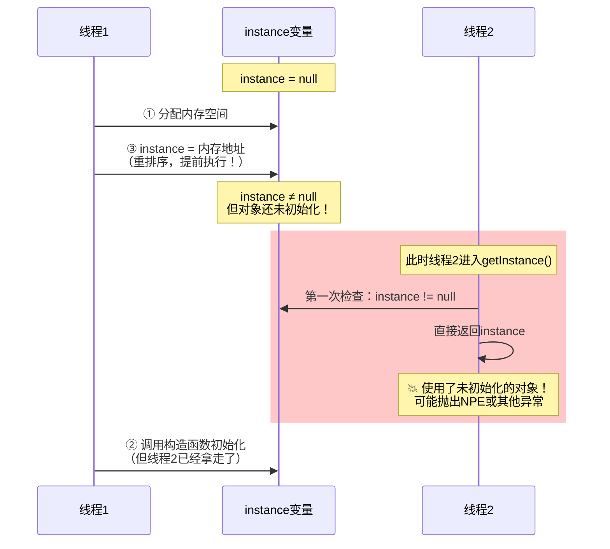
```mermaid
sequenceDiagram
    participant T1 as 线程1
    participant M as instance变量
    participant T2 as 线程2
    
    Note over M: instance = null
    
    T1->>M: ① 分配内存空间
    T1->>M: ③ instance = 内存地址<br/>（重排序，提前执行！）
    
    Note over M: instance ≠ null<br/>但对象还未初始化！
    
    rect rgb(255, 200, 200)
        Note over T2: 此时线程2进入getInstance()
        T2->>M: 第一次检查：instance != null
        T2->>T2: 直接返回instance
        Note over T2: 💥 使用了未初始化的对象！<br/>可能抛出NPE或其他异常
    end
    
    T1->>M: ② 调用构造函数初始化<br/>（但线程2已经拿走了）
```

你看到问题了吗？线程1执行到步骤3时，`instance`已经不是null了，但对象还没有完成初始化。这时线程2进来，看到`instance != null`，就直接返回了这个未初始化的对象。如果线程2使用这个对象，就可能遇到各种奇怪的问题。

**解决方案：给instance加上volatile**

```java
private static volatile Singleton instance;
```

`volatile`会禁止上述的重排序，保证步骤2一定在步骤3之前执行。这样，当其他线程看到`instance != null`时，对象一定是完全初始化好的。

------

## 四、Java内存模型（JMM）

前面我们从硬件层面分析了线程安全问题的根源。但Java是一门跨平台的语言，它运行在各种不同的硬件架构上，这些架构的内存模型可能各不相同。如果Java程序员需要针对每种硬件编写不同的并发代码，那就太痛苦了。

为了解决这个问题，Java定义了自己的内存模型——**Java Memory Model（JMM）**。

### 4.1 JMM是什么？

**JMM是一种规范**，它定义了Java程序中各种变量（主要是共享变量）的访问规则，以及在JVM中将变量存储到内存和从内存中读取变量的底层细节。

你可以把JMM理解为Java程序员与JVM实现者之间的一份"契约"：

- **对于程序员**：JMM告诉你，按照什么规则编写代码，就能保证线程安全
- **对于JVM实现者**：JMM告诉他们，必须满足什么约束，才能让程序员的代码正确运行

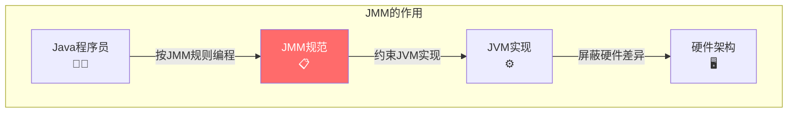
```mermaid
flowchart TB
    subgraph "JMM的作用"
        P["Java程序员<br/>👨‍💻"]
        JMM["JMM规范<br/>📋"]
        JVM["JVM实现<br/>⚙️"]
        HW["硬件架构<br/>🖥️"]
    end
    
    P -->|"按JMM规则编程"| JMM
    JMM -->|"约束JVM实现"| JVM
    JVM -->|"屏蔽硬件差异"| HW
    
    style JMM fill:#ff6b6b,color:#fff
```

JMM的核心价值在于：**它屏蔽了不同硬件和操作系统的内存访问差异，让Java程序在各种平台下都能达到一致的内存访问效果。**

### 4.2 JMM的抽象结构

JMM定义了一个抽象的内存模型，主要包含两个概念：

- **主内存（Main Memory）**：所有线程共享的内存区域，存储着共享变量
- **工作内存（Working Memory）**：每个线程私有的内存区域，存储着该线程使用到的共享变量的副本

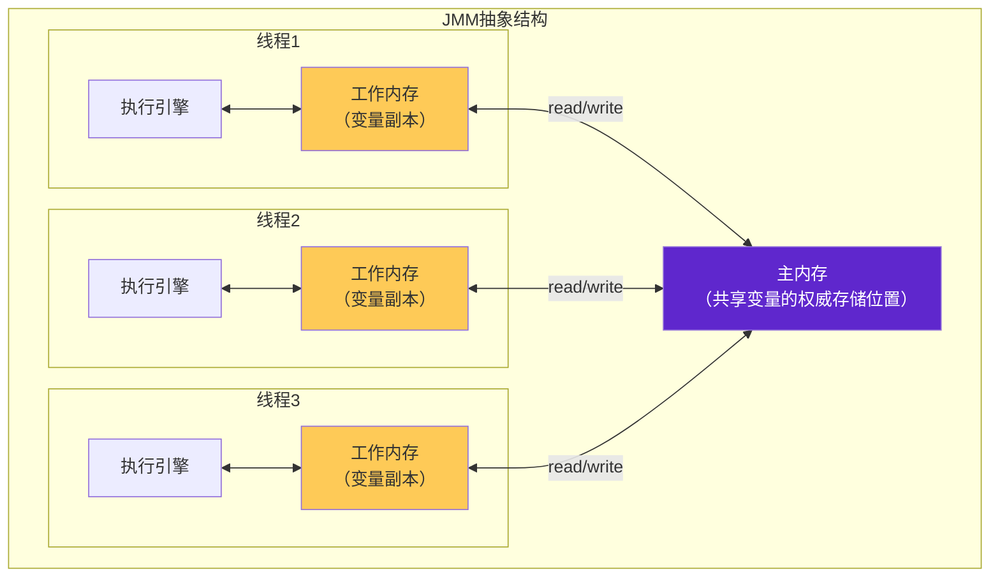
```mermaid
graph TB
    subgraph "JMM抽象结构"
        subgraph T1["线程1"]
            WM1["工作内存<br/>（变量副本）"]
            OP1["执行引擎"]
        end
        
        subgraph T2["线程2"]
            WM2["工作内存<br/>（变量副本）"]
            OP2["执行引擎"]
        end
        
        subgraph T3["线程3"]
            WM3["工作内存<br/>（变量副本）"]
            OP3["执行引擎"]
        end
        
        MM["主内存<br/>（共享变量的权威存储位置）"]
    end
    
    OP1 <--> WM1
    OP2 <--> WM2
    OP3 <--> WM3
    
    WM1 <-->|"read/write"| MM
    WM2 <-->|"read/write"| MM
    WM3 <-->|"read/write"| MM
    
    style MM fill:#5f27cd,color:#fff
    style WM1 fill:#feca57
    style WM2 fill:#feca57
    style WM3 fill:#feca57
```

**需要注意的是**：主内存和工作内存是JMM的抽象概念，并不直接对应物理硬件。但你可以大致这样理解：

| JMM概念  | 可能对应的硬件  |
| -------- | --------------- |
| 主内存   | 物理内存（RAM） |
| 工作内存 | CPU缓存、寄存器 |

根据JMM的规定，**线程对共享变量的所有操作都必须在工作内存中进行**，不能直接读写主内存。线程之间也无法直接访问对方的工作内存，必须通过主内存来传递。

### 4.3 JMM定义的八种内存操作

JMM定义了8种原子操作，用于完成主内存与工作内存之间的交互：

| 操作               | 作用位置 | 说明                                     |
| ------------------ | -------- | ---------------------------------------- |
| **lock（锁定）**   | 主内存   | 把变量标识为一个线程独占的状态           |
| **unlock（解锁）** | 主内存   | 释放锁定状态                             |
| **read（读取）**   | 主内存   | 把变量的值从主内存传输到工作内存         |
| **load（载入）**   | 工作内存 | 把read操作读取的值放入工作内存的变量副本 |
| **use（使用）**    | 工作内存 | 把变量的值传递给执行引擎                 |
| **assign（赋值）** | 工作内存 | 把执行引擎的值赋给工作内存的变量         |
| **store（存储）**  | 工作内存 | 把变量的值传送到主内存                   |
| **write（写入）**  | 主内存   | 把store操作的值写入主内存的变量          |

一个完整的读取流程：`read → load → use`

一个完整的写入流程：`assign → store → write`

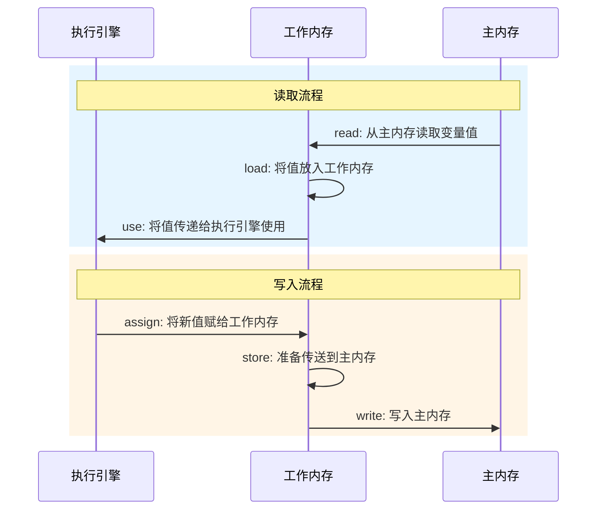
```mermaid
sequenceDiagram
    participant E as 执行引擎
    participant W as 工作内存
    participant M as 主内存
    
    rect rgb(230, 245, 255)
        Note over E,M: 读取流程
        M->>W: read: 从主内存读取变量值
        W->>W: load: 将值放入工作内存
        W->>E: use: 将值传递给执行引擎使用
    end
    
    rect rgb(255, 245, 230)
        Note over E,M: 写入流程
        E->>W: assign: 将新值赋给工作内存
        W->>W: store: 准备传送到主内存
        W->>M: write: 写入主内存
    end
```

### 4.4 happens-before：JMM的核心规则

JMM的核心是**happens-before**规则（先行发生原则）。这是判断数据是否存在竞争、线程是否安全的主要依据。

**happens-before的定义**：如果操作A happens-before 操作B，那么：

1. A的执行结果对B可见
2. A的执行顺序排在B之前（从内存可见性的角度来看）

JMM定义了8条happens-before规则，我们来逐一了解：

#### 规则1：程序顺序规则（Program Order Rule）

在一个线程内，按照程序代码的顺序，前面的操作happens-before后面的操作。

```java
int a = 1;        // 操作A
int b = a + 1;    // 操作B
// A happens-before B
// 所以操作B在执行时，一定能看到a=1
```

注意：这只保证单线程内的可见性，不保证实际执行顺序。编译器仍可能重排序，只要不影响单线程执行结果。

#### 规则2：锁规则（Monitor Lock Rule）

对一个锁的unlock操作happens-before后面对同一个锁的lock操作。

```java
synchronized (lock) {
    x = 10;  // 操作A
}  // unlock

// ... 其他线程 ...

synchronized (lock) {  // lock
    int y = x;  // 操作B，能看到x=10
}
```

这条规则保证了：当一个线程释放锁时，它对共享变量的修改对后续获取该锁的线程是可见的。

#### 规则3：volatile变量规则（Volatile Variable Rule）

对一个volatile变量的写操作happens-before后面对这个变量的读操作。

```java
volatile boolean flag = false;
int data = 0;

// 线程1
data = 42;        // 操作A
flag = true;      // 操作B (volatile写)

// 线程2
if (flag) {       // 操作C (volatile读)
    int x = data; // 操作D，能看到data=42
}
```

这条规则还有一个重要的推论：volatile写之前的所有操作，对volatile读之后的操作都是可见的。这就是volatile的"内存屏障"效果。

#### 规则4：传递性规则（Transitivity）

如果A happens-before B，B happens-before C，那么A happens-before C。

```java
int a = 1;        // A
volatile int v = 2;  // B
int b = a + v;    // C

// A hb B（程序顺序规则）
// B hb C（程序顺序规则 + volatile规则）
// 所以 A hb C（传递性）
```

#### 规则5：线程启动规则（Thread Start Rule）

Thread对象的start()方法happens-before此线程的每一个动作。

```java
int x = 10;
Thread t = new Thread(() -> {
    int y = x;  // 能看到x=10
});
t.start();
```

#### 规则6：线程终止规则（Thread Termination Rule）

线程中的所有操作都happens-before对此线程的终止检测。

```java
Thread t = new Thread(() -> {
    x = 10;  // 操作A
});
t.start();
t.join();      // 等待线程终止
int y = x;     // 能看到x=10
```

#### 规则7：线程中断规则（Thread Interruption Rule）

对线程interrupt()方法的调用happens-before被中断线程检测到中断事件的发生。

#### 规则8：对象终结规则（Finalizer Rule）

一个对象的构造函数执行结束happens-before它的finalize()方法的开始。

------

## 五、解决方案详解

了解了问题的根源和JMM的规范，现在让我们来看看Java提供的各种解决方案。

### 5.1 volatile关键字

#### volatile的作用

`volatile`是Java提供的最轻量级的同步机制，它有两个作用：

1. **保证可见性**：对一个volatile变量的读，总是能看到任意线程对这个变量最后的写入
2. **禁止指令重排序**：volatile变量的读写操作不会被重排序

但要注意：**volatile不保证原子性**！

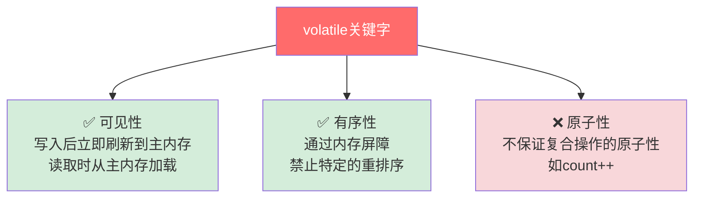
```mermaid
flowchart TB
    V["volatile关键字"]
    
    V --> V1["✅ 可见性<br/>写入后立即刷新到主内存<br/>读取时从主内存加载"]
    V --> V2["✅ 有序性<br/>通过内存屏障<br/>禁止特定的重排序"]
    V --> V3["❌ 原子性<br/>不保证复合操作的原子性<br/>如count++"]
    
    style V fill:#ff6b6b,color:#fff
    style V1 fill:#d4edda
    style V2 fill:#d4edda
    style V3 fill:#f8d7da
```

#### volatile的内存语义

当写一个volatile变量时，JMM会把该线程对应的工作内存中的共享变量值刷新到主内存。

当读一个volatile变量时，JMM会把该线程对应的工作内存置为无效，从主内存中读取共享变量。

从内存屏障的角度来看：

- **volatile写**：在写操作前插入StoreStore屏障，在写操作后插入StoreLoad屏障
- **volatile读**：在读操作后插入LoadLoad屏障和LoadStore屏障

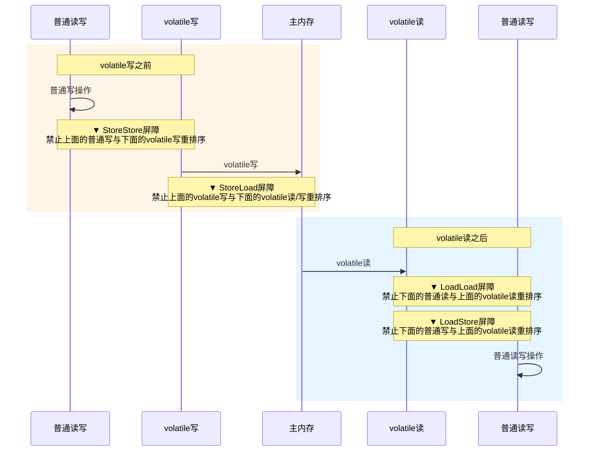
```mermaid
sequenceDiagram
    participant N1 as 普通读写
    participant VW as volatile写
    participant M as 主内存
    participant VR as volatile读
    participant N2 as 普通读写
    
    rect rgb(255, 245, 230)
        Note over N1,VW: volatile写之前
        N1->>N1: 普通写操作
        Note over N1,VW: ▼ StoreStore屏障<br/>禁止上面的普通写与下面的volatile写重排序
        VW->>M: volatile写
        Note over VW,M: ▼ StoreLoad屏障<br/>禁止上面的volatile写与下面的volatile读/写重排序
    end
    
    rect rgb(230, 245, 255)
        Note over VR,N2: volatile读之后
        M->>VR: volatile读
        Note over VR,N2: ▼ LoadLoad屏障<br/>禁止下面的普通读与上面的volatile读重排序
        Note over VR,N2: ▼ LoadStore屏障<br/>禁止下面的普通写与上面的volatile读重排序
        N2->>N2: 普通读写操作
    end
```

#### volatile的适用场景

`volatile`适用于以下场景：

**场景1：状态标志**

```java
// 非常适合：一个线程写，多个线程读
volatile boolean shutdownRequested = false;

public void shutdown() {
    shutdownRequested = true;
}

public void doWork() {
    while (!shutdownRequested) {
        // 执行任务
    }
}
```

**场景2：一次性安全发布**

```java
// 配置对象只初始化一次，之后只读
volatile Config config;

public void init() {
    config = loadConfig();  // 只写一次
}

public Config getConfig() {
    return config;  // 之后只读
}
```

**场景3：双重检查锁定**

```java
private volatile Singleton instance;

public Singleton getInstance() {
    if (instance == null) {
        synchronized (this) {
            if (instance == null) {
                instance = new Singleton();
            }
        }
    }
    return instance;
}
```

**不适合的场景**：需要原子性的场景

```java
// ❌ 错误：volatile不能保证count++的原子性
volatile int count = 0;

public void increment() {
    count++;  // 仍然不是线程安全的！
}
```

### 5.2 synchronized关键字

`synchronized`是Java中最基本的同步机制，它能同时保证原子性、可见性和有序性。

#### synchronized的三种用法

```java
public class SynchronizedDemo {
    
    private int count = 0;
    private static int staticCount = 0;
    private final Object lock = new Object();
    
    // 用法1：修饰实例方法，锁是当前实例对象
    public synchronized void instanceMethod() {
        count++;
    }
    
    // 用法2：修饰静态方法，锁是当前类的Class对象
    public static synchronized void staticMethod() {
        staticCount++;
    }
    
    // 用法3：修饰代码块，锁是指定的对象
    public void blockMethod() {
        synchronized (lock) {
            count++;
        }
    }
}
```

#### synchronized的实现原理

让我们通过字节码来看看`synchronized`是如何实现的。

对于同步代码块，编译后会生成`monitorenter`和`monitorexit`指令：

```tex
public void blockMethod();
    Code:
       0: aload_0
       1: getfield      #3    // lock对象
       4: dup
       5: astore_1
       6: monitorenter        // 🔒 获取锁
       7: aload_0
       8: dup
       9: getfield      #2    // count
      12: iconst_1
      13: iadd
      14: putfield      #2    // count
      17: aload_1
      18: monitorexit         // 🔓 释放锁
      19: goto          27
      22: astore_2
      23: aload_1
      24: monitorexit         // 🔓 异常时也释放锁（保证不会死锁）
      25: aload_2
      26: athrow
      27: return
```

每个Java对象都有一个与之关联的Monitor（监视器锁）。当线程执行到`monitorenter`指令时，会尝试获取对象的Monitor：

- 如果Monitor的进入数为0，线程成功获取锁，并将进入数设为1
- 如果线程已经持有这个Monitor，进入数加1（这就是synchronized的可重入性）
- 如果其他线程持有这个Monitor，当前线程阻塞等待

#### synchronized的锁升级

在JDK 1.6之前，`synchronized`是一个重量级锁，每次加锁都需要操作系统介入，性能较差。从JDK 1.6开始，JVM对`synchronized`进行了大量优化，引入了**偏向锁**和**轻量级锁**。

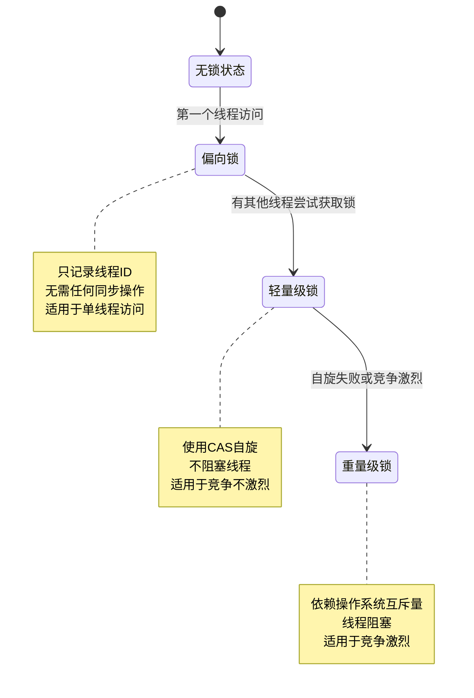
```mermaid
stateDiagram-v2
    [*] --> 无锁状态
    无锁状态 --> 偏向锁: 第一个线程访问
    偏向锁 --> 轻量级锁: 有其他线程尝试获取锁
    轻量级锁 --> 重量级锁: 自旋失败或竞争激烈
    
    note right of 偏向锁: 只记录线程ID<br/>无需任何同步操作<br/>适用于单线程访问
    note right of 轻量级锁: 使用CAS自旋<br/>不阻塞线程<br/>适用于竞争不激烈
    note right of 重量级锁: 依赖操作系统互斥量<br/>线程阻塞<br/>适用于竞争激烈
```

**偏向锁（Biased Locking）**

偏向锁的核心思想是：如果一个同步块只有一个线程访问，那就不需要真正的同步操作。

当第一个线程访问同步块时，会在对象头中记录这个线程的ID。之后该线程再次进入同步块时，只需要检查线程ID是否匹配，不需要任何CAS操作。

如果有其他线程尝试获取锁，偏向锁就会被撤销，升级为轻量级锁。

**轻量级锁（Lightweight Locking）**

轻量级锁使用CAS操作来加锁。线程在进入同步块之前，会在自己的栈帧中创建一个锁记录（Lock Record），然后尝试用CAS把对象头中的Mark Word替换为指向锁记录的指针。

如果CAS成功，线程获得锁。如果CAS失败（说明有竞争），线程会自旋重试几次。如果自旋也失败，轻量级锁就会膨胀为重量级锁。

**重量级锁（Heavyweight Locking）**

重量级锁依赖操作系统的互斥量（Mutex）来实现。当线程无法获取锁时，会被阻塞，由操作系统来调度。这涉及到用户态和内核态的切换，开销较大。

### 5.3 Lock接口

从JDK 5开始，Java提供了`java.util.concurrent.locks.Lock`接口，作为`synchronized`的补充。

#### Lock vs synchronized

| 特性             | synchronized             | Lock                          |
| ---------------- | ------------------------ | ----------------------------- |
| 获取锁的方式     | 隐式，进入同步块自动获取 | 显式，调用lock()方法          |
| 释放锁的方式     | 隐式，退出同步块自动释放 | 显式，必须调用unlock()        |
| 是否可中断       | 不可中断，只能等待       | 可以，使用lockInterruptibly() |
| 是否可以尝试获取 | 不可以                   | 可以，使用tryLock()           |
| 是否支持超时     | 不支持                   | 支持，使用tryLock(timeout)    |
| 是否支持公平锁   | 不支持（非公平）         | 支持（ReentrantLock可选）     |
| 条件变量         | 只有一个（wait/notify）  | 可以有多个Condition           |

#### ReentrantLock的使用

```java
public class ReentrantLockDemo {
    
    private final ReentrantLock lock = new ReentrantLock();
    
    // 基本用法
    public void basicUsage() {
        lock.lock();  // 获取锁
        try {
            // 临界区代码
        } finally {
            lock.unlock();  // 必须在finally中释放锁！
        }
    }
    
    // 可中断地获取锁
    public void interruptiblyLock() throws InterruptedException {
        lock.lockInterruptibly();
        try {
            // 临界区代码
        } finally {
            lock.unlock();
        }
    }
    
    // 尝试获取锁（非阻塞）
    public boolean tryLockUsage() {
        if (lock.tryLock()) {
            try {
                // 临界区代码
                return true;
            } finally {
                lock.unlock();
            }
        } else {
            // 获取锁失败，执行其他逻辑
            return false;
        }
    }
    
    // 超时获取锁
    public boolean timedLock() throws InterruptedException {
        if (lock.tryLock(1, TimeUnit.SECONDS)) {
            try {
                return true;
            } finally {
                lock.unlock();
            }
        }
        return false;
    }
}
```

**⚠️ 重要提醒**：使用Lock时，一定要在finally块中释放锁！否则如果临界区代码抛出异常，锁就永远不会被释放，会导致死锁。

#### 公平锁与非公平锁

```java
// 非公平锁（默认）
ReentrantLock unfairLock = new ReentrantLock();
// 或
ReentrantLock unfairLock = new ReentrantLock(false);

// 公平锁
ReentrantLock fairLock = new ReentrantLock(true);
```

**公平锁**：多个线程按照申请锁的顺序来获取锁，先到先得，就像排队一样。

**非公平锁**：多个线程获取锁的顺序不是按照申请顺序，有可能后申请的线程比先申请的线程先获取锁（"插队"）。

为什么默认是非公平锁？因为非公平锁的性能更好。公平锁需要维护一个等待队列，按顺序唤醒线程；非公平锁直接让线程竞争，减少了线程切换的开销。

#### Condition条件变量

`Condition`提供了类似于`Object.wait()`和`Object.notify()`的功能，但更加灵活：一个Lock可以创建多个Condition。

```java
public class BoundedBuffer<T> {
    
    private final Object[] items;
    private int putIndex, takeIndex, count;
    
    private final Lock lock = new ReentrantLock();
    private final Condition notEmpty = lock.newCondition();  // 非空条件
    private final Condition notFull = lock.newCondition();   // 非满条件
    
    public BoundedBuffer(int capacity) {
        items = new Object[capacity];
    }
    
    // 生产者：放入元素
    public void put(T item) throws InterruptedException {
        lock.lock();
        try {
            // 队列满时，在notFull条件上等待
            while (count == items.length) {
                notFull.await();
            }
            items[putIndex] = item;
            if (++putIndex == items.length) putIndex = 0;
            count++;
            // 放入元素后，通知在notEmpty条件上等待的消费者
            notEmpty.signal();
        } finally {
            lock.unlock();
        }
    }
    
    // 消费者：取出元素
    @SuppressWarnings("unchecked")
    public T take() throws InterruptedException {
        lock.lock();
        try {
            // 队列空时，在notEmpty条件上等待
            while (count == 0) {
                notEmpty.await();
            }
            T item = (T) items[takeIndex];
            if (++takeIndex == items.length) takeIndex = 0;
            count--;
            // 取出元素后，通知在notFull条件上等待的生产者
            notFull.signal();
            return item;
        } finally {
            lock.unlock();
        }
    }
}
```

### 5.4 原子类（Atomic Classes）

Java的`java.util.concurrent.atomic`包提供了一系列原子类，它们使用**CAS（Compare-And-Swap）** 操作来保证原子性，比锁的性能更好。

#### CAS操作原理

CAS是一种无锁算法，它包含三个操作数：

- **V**：要更新的变量（内存值）
- **E**：预期值（Expected）
- **N**：新值（New）

CAS的语义是：如果V等于E，就把V更新为N并返回true；否则什么都不做并返回false。

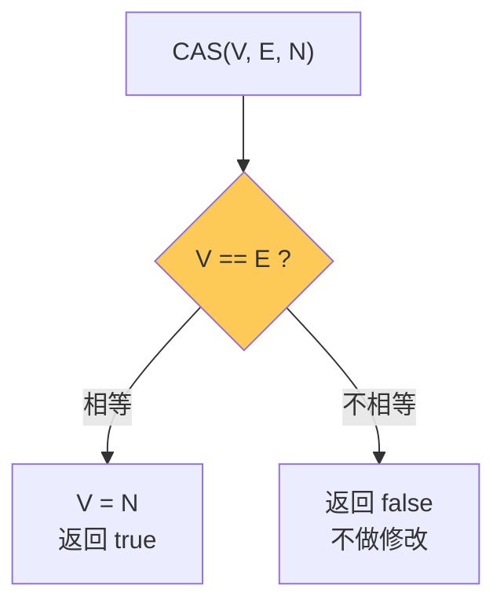
```mermaid
flowchart TB
    A["CAS(V, E, N)"]
    B{"V == E ?"}
    C["V = N<br/>返回 true"]
    D["返回 false<br/>不做修改"]
    
    A --> B
    B -->|"相等"| C
    B -->|"不相等"| D
    
    style B fill:#feca57
```

CAS操作是由CPU提供的原子指令实现的（如x86的`cmpxchg`指令），所以它本身是原子的。

#### 原子类的使用

**AtomicInteger示例**：

```java
public class AtomicIntegerDemo {
    
    private AtomicInteger count = new AtomicInteger(0);
    
    // 原子自增
    public void increment() {
        count.incrementAndGet();  // 相当于++count
        // 或者
        count.getAndIncrement();  // 相当于count++
    }
    
    // 原子加法
    public void add(int delta) {
        count.addAndGet(delta);
    }
    
    // CAS更新
    public boolean compareAndSet(int expect, int update) {
        return count.compareAndSet(expect, update);
    }
    
    // 复杂计算的原子更新
    public void complexUpdate() {
        count.updateAndGet(x -> x * 2 + 1);
    }
}
```

#### AtomicInteger的源码分析

让我们来看看`AtomicInteger.incrementAndGet()`是如何实现的：

```java
public class AtomicInteger extends Number implements java.io.Serializable {
    
    // Unsafe类提供了CAS等底层操作
    private static final Unsafe unsafe = Unsafe.getUnsafe();
    
    // value字段在内存中的偏移量
    private static final long valueOffset;
    
    // 使用volatile保证可见性
    private volatile int value;
    
    public final int incrementAndGet() {
        return unsafe.getAndAddInt(this, valueOffset, 1) + 1;
    }
}

// Unsafe.getAndAddInt的实现（自旋CAS）
public final int getAndAddInt(Object o, long offset, int delta) {
    int v;
    do {
        v = getIntVolatile(o, offset);  // 读取当前值
    } while (!compareAndSwapInt(o, offset, v, v + delta));  // CAS尝试更新
    return v;  // 返回旧值
}
```

可以看到，`incrementAndGet()`使用的是自旋CAS：不断尝试更新，直到成功为止。

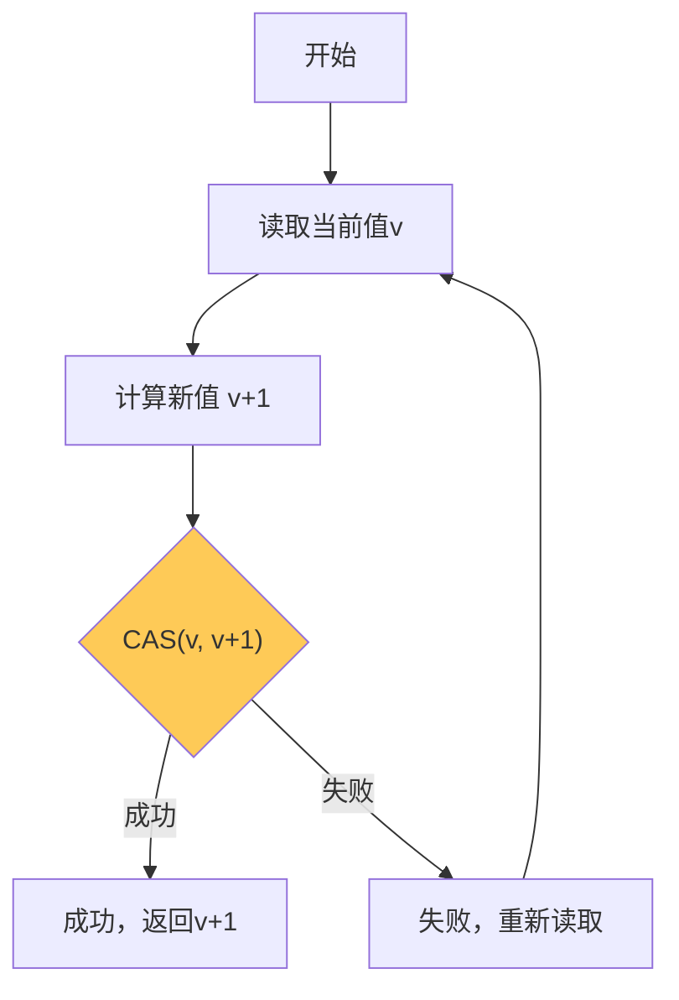
```mermaid
flowchart TB
    A["开始"]
    B["读取当前值v"]
    C["计算新值 v+1"]
    D{"CAS(v, v+1)"}
    E["成功，返回v+1"]
    F["失败，重新读取"]
    
    A --> B --> C --> D
    D -->|"成功"| E
    D -->|"失败"| F
    F --> B
    
    style D fill:#feca57
```

#### ABA问题

CAS有一个著名的问题叫**ABA问题**：

假设变量V的值为A，线程1读取到A，准备执行CAS(A, C)。在此期间，线程2把V从A改成B，又从B改回A。当线程1执行CAS时，发现V仍然是A，认为没有被修改过，CAS成功。

但实际上，V的值已经被改过了！

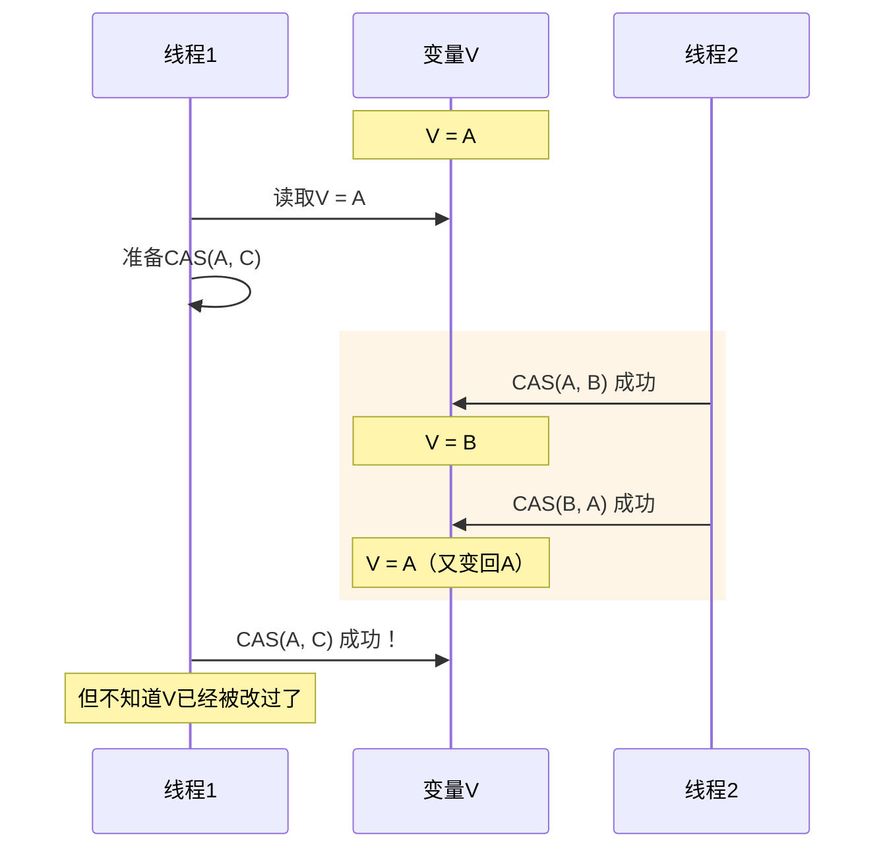
```mermaid
sequenceDiagram
    participant T1 as 线程1
    participant V as 变量V
    participant T2 as 线程2
    
    Note over V: V = A
    
    T1->>V: 读取V = A
    T1->>T1: 准备CAS(A, C)
    
    rect rgb(255, 245, 230)
        T2->>V: CAS(A, B) 成功
        Note over V: V = B
        T2->>V: CAS(B, A) 成功
        Note over V: V = A（又变回A）
    end
    
    T1->>V: CAS(A, C) 成功！
    Note over T1: 但不知道V已经被改过了
```

对于大多数场景，ABA问题并不会造成实际影响。但在某些场景下（如无锁数据结构），ABA问题可能导致严重错误。

**解决方案：AtomicStampedReference**

```java
AtomicStampedReference<Integer> ref = 
    new AtomicStampedReference<>(100, 0);  // 值为100，版本号为0

int[] stampHolder = new int[1];
Integer value = ref.get(stampHolder);  // 获取值和版本号
int stamp = stampHolder[0];

// CAS时同时检查值和版本号
boolean success = ref.compareAndSet(value, 101, stamp, stamp + 1);
```

#### 高并发计数器：LongAdder

在高并发场景下，`AtomicLong`的性能可能不够好，因为所有线程都在竞争同一个变量。JDK 8引入了`LongAdder`，它使用**分段**的思想来提高性能。

```java
// LongAdder的使用非常简单
LongAdder counter = new LongAdder();

// 增加
counter.increment();
counter.add(10);

// 获取值（可能不是精确值，因为可能有并发更新）
long sum = counter.sum();
```

`LongAdder`的原理是：在内部维护多个Cell，不同的线程更新不同的Cell，从而减少竞争。需要获取总数时，再把所有Cell的值加起来。

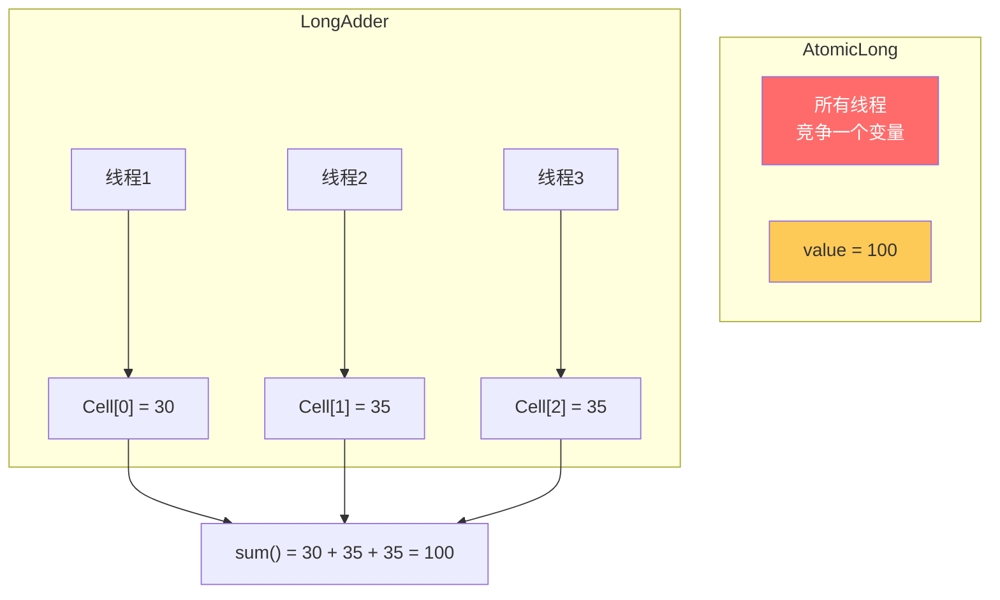
```mermaid
flowchart TB
    subgraph "AtomicLong"
        A1["所有线程<br/>竞争一个变量"]
        V1["value = 100"]
    end
    
    subgraph "LongAdder"
        A2["线程1"]
        A3["线程2"]
        A4["线程3"]
        C1["Cell[0] = 30"]
        C2["Cell[1] = 35"]
        C3["Cell[2] = 35"]
        
        A2 --> C1
        A3 --> C2
        A4 --> C3
    end
    
    SUM["sum() = 30 + 35 + 35 = 100"]
    
    C1 --> SUM
    C2 --> SUM
    C3 --> SUM
    
    style A1 fill:#ff6b6b,color:#fff
    style V1 fill:#feca57
```

### 5.5 final关键字

`final`关键字不仅仅用于定义常量，它还有重要的内存语义，可以用于保证线程安全。

#### final的内存语义

JMM对`final`字段有特殊的规定：

1. 在构造函数内对一个final字段的写入，与随后把这个被构造对象的引用赋值给一个引用变量，这两个操作之间不能重排序
2. 初次读一个包含final字段的对象的引用，与随后初次读这个final字段，这两个操作之间不能重排序

简单来说：**如果对象被正确构造（构造函数中没有"this逃逸"），那么当其他线程看到这个对象时，该对象的final字段一定已经被正确初始化了。**

```java
public class FinalFieldExample {
    
    private final int x;
    private final List<String> list;
    
    public FinalFieldExample() {
        x = 10;
        list = new ArrayList<>();
        list.add("hello");
    }
}
```

当其他线程获取到`FinalFieldExample`对象的引用时，它一定能看到`x = 10`和`list`已经初始化（包含"hello"元素）。

#### this逃逸问题

但要注意，这个保证有一个前提：**对象必须被正确构造**。如果在构造函数中发生了"this逃逸"，就无法保证final字段的可见性。

```java
// ❌ 错误示例：this逃逸
public class ThisEscape {
    
    private final int x;
    
    public ThisEscape() {
        // ⚠️ 在构造函数完成之前就发布了this引用
        EventManager.register(this);  // 其他线程可能通过这个引用访问x
        x = 10;  // final字段还没初始化！
    }
}
```

在上面的例子中，`EventManager.register(this)`可能会把`this`引用交给其他线程。此时构造函数还没执行完，`x`还没被赋值，其他线程看到的`x`可能是0（默认值）而不是10。

**正确做法：使用工厂方法**

```java
// ✅ 正确示例：使用工厂方法避免this逃逸
public class SafeConstruction {
    
    private final int x;
    
    private SafeConstruction() {
        x = 10;  // 构造函数中初始化final字段
    }
    
    public static SafeConstruction create() {
        SafeConstruction obj = new SafeConstruction();  // 构造完成
        EventManager.register(obj);  // 然后才发布引用
        return obj;
    }
}
```

------

## 六、选型指南与最佳实践

### 6.1 如何选择同步机制？

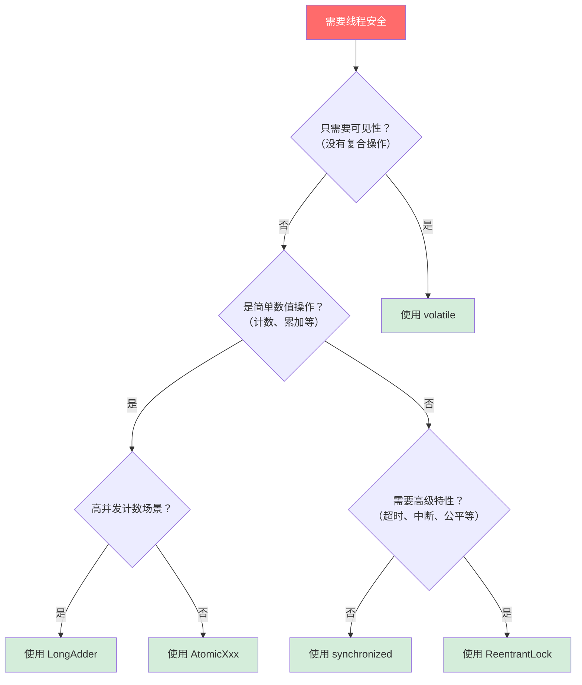
```mermaid
flowchart TB
    START["需要线程安全"]
    
    Q1{"只需要可见性？<br/>（没有复合操作）"}
    Q2{"是简单数值操作？<br/>（计数、累加等）"}
    Q3{"高并发计数场景？"}
    Q4{"需要高级特性？<br/>（超时、中断、公平等）"}
    
    A1["使用 volatile"]
    A2["使用 AtomicXxx"]
    A3["使用 LongAdder"]
    A4["使用 synchronized"]
    A5["使用 ReentrantLock"]
    
    START --> Q1
    Q1 -->|"是"| A1
    Q1 -->|"否"| Q2
    Q2 -->|"是"| Q3
    Q3 -->|"是"| A3
    Q3 -->|"否"| A2
    Q2 -->|"否"| Q4
    Q4 -->|"否"| A4
    Q4 -->|"是"| A5
    
    style START fill:#ff6b6b,color:#fff
    style A1 fill:#d4edda
    style A2 fill:#d4edda
    style A3 fill:#d4edda
    style A4 fill:#d4edda
    style A5 fill:#d4edda
```

### 6.2 最佳实践建议

**1. 优先使用更高层次的并发工具**

Java并发包（`java.util.concurrent`）提供了很多高层次的并发工具，如`ConcurrentHashMap`、`BlockingQueue`、`CountDownLatch`等。优先使用这些工具，而不是自己用低级原语（如`synchronized`、`wait/notify`）来实现。

```java
// ✅ 推荐：使用ConcurrentHashMap
Map<String, String> map = new ConcurrentHashMap<>();

// ❌ 不推荐：自己加锁
Map<String, String> map = new HashMap<>();
synchronized (map) {
    map.put(key, value);
}
```

**2. 缩小同步范围**

同步的代码越少越好，这可以减少锁的持有时间，提高并发性能。

```java
// ✅ 好：只同步必要的代码
public void process() {
    // 不需要同步的预处理
    Object data = prepareData();
    
    synchronized (lock) {
        // 只同步必须同步的部分
        updateSharedState(data);
    }
    
    // 不需要同步的后处理
    notifyListeners();
}

// ❌ 不好：同步整个方法
public synchronized void process() {
    Object data = prepareData();
    updateSharedState(data);
    notifyListeners();
}
```

**3. 优先使用不可变对象**

不可变对象天生就是线程安全的，因为它们的状态不能被修改。

```java
// ✅ 不可变类
public final class ImmutablePoint {
    private final int x;
    private final int y;
    
    public ImmutablePoint(int x, int y) {
        this.x = x;
        this.y = y;
    }
    
    public int getX() { return x; }
    public int getY() { return y; }
    
    // 返回新对象而不是修改现有对象
    public ImmutablePoint moveTo(int newX, int newY) {
        return new ImmutablePoint(newX, newY);
    }
}
```

**4. 使用线程安全的发布方式**

当需要把一个对象共享给其他线程时，要确保使用安全的发布方式：

- 在静态初始化器中初始化对象引用
- 将对象引用存储到volatile字段或AtomicReference中
- 将对象引用存储到正确构造对象的final字段中
- 将对象引用存储到由锁保护的字段中

```java
// ✅ 安全发布示例
public class SafePublication {
    
    // 方式1：静态初始化
    public static final Map<String, String> MAP = 
        Collections.unmodifiableMap(initMap());
    
    // 方式2：volatile
    private volatile Config config;
    
    // 方式3：final字段
    private final List<String> list = new CopyOnWriteArrayList<>();
    
    // 方式4：锁保护
    private Object state;
    private final Object lock = new Object();
    
    public void setState(Object newState) {
        synchronized (lock) {
            this.state = newState;
        }
    }
}
```

------

## 七、总结

让我们用一张思维导图来回顾本文的核心内容：

```mermaid
mindmap
  root((Java并发编程核心知识))
    问题根源
      CPU缓存
        每个核心有自己的缓存
        缓存之间数据不一致
        导致可见性问题
      时间片切换
        线程在任意时刻可能被中断
        复合操作被打断
        导致原子性问题
      指令重排序
        编译器优化
        CPU乱序执行
        导致有序性问题
    JMM内存模型
      主内存与工作内存
      八种内存操作
      happens-before规则
        程序顺序规则
        锁规则
        volatile规则
        传递性规则
        线程启动/终止规则
    解决方案
      volatile
        保证可见性
        禁止重排序
        不保证原子性
        适用场景：状态标志、DCL
      synchronized
        保证三大特性
        锁升级机制
        简单易用
      Lock
        更灵活的控制
        可中断、可超时
        公平锁选项
        多Condition支持
      原子类
        CAS无锁算法
        性能更好
        ABA问题及解决
        LongAdder高并发计数
      final
        不可变性保证
        安全发布
        避免this逃逸
```

### 核心要点回顾

1. **理解根源**：线程安全问题源于硬件架构的设计——CPU缓存导致可见性问题，时间片切换导致原子性问题，指令重排序导致有序性问题。
2. **理解JMM**：Java内存模型是一种规范，它屏蔽了底层硬件差异，为程序员提供了一致的内存可见性保证。掌握happens-before规则是理解JMM的关键。
3. **合理选型**：
   - 只需要可见性 → `volatile`
   - 简单数值操作 → `AtomicXxx`
   - 高并发计数 → `LongAdder`
   - 一般同步 → `synchronized`
   - 需要高级特性 → `ReentrantLock`
4. **遵循最佳实践**：优先使用高层次并发工具，缩小同步范围，优先使用不可变对象，确保安全发布。

------

## 写在最后

> “真正的并发大师，从来不是能写出最复杂的锁，而是能让代码根本不需要锁。” —— 你，十年后的自己

并发编程确实是Java开发中的一个难点，但它并不是不可征服的。关键在于理解问题的本质——为什么会有这些问题，而不仅仅是记住解决方案。

当你理解了CPU缓存为什么会导致可见性问题，你就能明白volatile是如何解决这个问题的；当你理解了"读取-计算-写回"不是原子操作，你就能明白为什么volatile不能解决原子性问题，以及为什么需要CAS或锁。

希望这篇文章能帮助你建立起对Java并发编程的系统认识。如果你觉得有帮助，欢迎点赞、收藏、分享！

有任何问题，欢迎在评论区讨论交流！

------

> **参考资料**：
>
> - 《Java并发编程的艺术》- 方腾飞
> - 《Java并发编程实战》- Brian Goetz
> - JSR-133: Java Memory Model and Thread Specification
