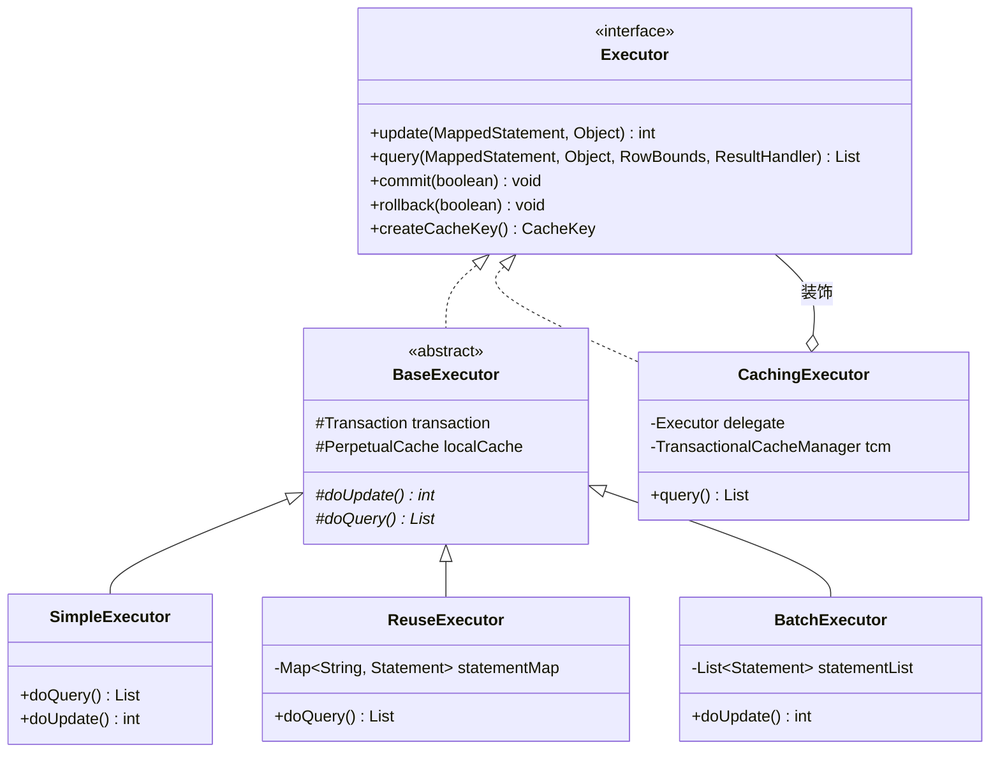

## 1. MyBatis 架构概述

### 1.1 什么是 MyBatis

MyBatis 是一款优秀的**半自动化 ORM 框架**，它避免了几乎所有的 JDBC 代码和手动设置参数以及获取结果集的工作。

### 1.2 整体架构图


### 1.3 三层架构说明


------

## 2. 核心组件详解

### 2.1 核心组件关系图


### 2.2 核心组件类图


### 2.3 Executor 继承体系



------

## 3. 初始化流程

### 3.1 初始化时序图


### 3.2 配置文件解析流程


### 3.3 MappedStatement 结构


### 3.4 初始化源码解析

```java
/**
 * SqlSessionFactoryBuilder - 入口类
 */
public class SqlSessionFactoryBuilder {
    
    public SqlSessionFactory build(InputStream inputStream) {
        return build(inputStream, null, null);
    }
    
    public SqlSessionFactory build(InputStream inputStream, 
                                   String environment, 
                                   Properties properties) {
        try {
            // 1. 创建 XML 配置解析器
            XMLConfigBuilder parser = new XMLConfigBuilder(
                inputStream, environment, properties);
            
            // 2. 解析配置文件，返回 Configuration 对象
            Configuration config = parser.parse();
            
            // 3. 创建 DefaultSqlSessionFactory
            return build(config);
        } catch (Exception e) {
            throw ExceptionFactory.wrapException("Error building SqlSession.", e);
        }
    }
    
    public SqlSessionFactory build(Configuration config) {
        return new DefaultSqlSessionFactory(config);
    }
}

/**
 * XMLConfigBuilder - 解析 mybatis-config.xml
 */
public class XMLConfigBuilder extends BaseBuilder {
    
    public Configuration parse() {
        if (parsed) {
            throw new BuilderException("Each XMLConfigBuilder can only be used once.");
        }
        parsed = true;
        
        // 从根节点 <configuration> 开始解析
        parseConfiguration(parser.evalNode("/configuration"));
        
        return configuration;
    }
    
    private void parseConfiguration(XNode root) {
        try {
            // 按顺序解析各个子节点
            propertiesElement(root.evalNode("properties"));
            Properties settings = settingsAsProperties(root.evalNode("settings"));
            typeAliasesElement(root.evalNode("typeAliases"));
            pluginElement(root.evalNode("plugins"));
            objectFactoryElement(root.evalNode("objectFactory"));
            settingsElement(settings);
            environmentsElement(root.evalNode("environments"));
            typeHandlerElement(root.evalNode("typeHandlers"));
            mapperElement(root.evalNode("mappers"));  // ⭐ 解析 Mapper
        } catch (Exception e) {
            throw new BuilderException("Error parsing SQL Mapper Configuration.", e);
        }
    }
}
```

------

## 4. SQL 执行流程

### 4.1 SQL 执行时序图


### 4.2 执行器工作流程


### 4.3 四大处理器协作


### 4.4 DefaultSqlSession 核心代码

```java
/**
 * DefaultSqlSession - SQL 执行入口
 */
public class DefaultSqlSession implements SqlSession {
    
    private final Configuration configuration;
    private final Executor executor;
    
    @Override
    public <E> List<E> selectList(String statement, Object parameter) {
        return this.selectList(statement, parameter, RowBounds.DEFAULT);
    }
    
    @Override
    public <E> List<E> selectList(String statement, Object parameter, 
                                  RowBounds rowBounds) {
        try {
            // 1. 获取 MappedStatement
            MappedStatement ms = configuration.getMappedStatement(statement);
            
            // 2. 调用 Executor 执行查询
            return executor.query(ms, wrapCollection(parameter), 
                                  rowBounds, Executor.NO_RESULT_HANDLER);
        } catch (Exception e) {
            throw ExceptionFactory.wrapException("Error querying database.", e);
        }
    }
    
    @Override
    public int update(String statement, Object parameter) {
        try {
            dirty = true;
            MappedStatement ms = configuration.getMappedStatement(statement);
            return executor.update(ms, wrapCollection(parameter));
        } catch (Exception e) {
            throw ExceptionFactory.wrapException("Error updating database.", e);
        }
    }
    
    @Override
    public <T> T getMapper(Class<T> type) {
        return configuration.getMapper(type, this);
    }
}
```

### 4.5 SimpleExecutor 执行逻辑

```java
/**
 * SimpleExecutor - 简单执行器
 */
public class SimpleExecutor extends BaseExecutor {
    
    @Override
    public <E> List<E> doQuery(MappedStatement ms, Object parameter,
                               RowBounds rowBounds, ResultHandler resultHandler,
                               BoundSql boundSql) throws SQLException {
        Statement stmt = null;
        try {
            Configuration configuration = ms.getConfiguration();
            
            // 1. 创建 StatementHandler
            StatementHandler handler = configuration.newStatementHandler(
                wrapper, ms, parameter, rowBounds, resultHandler, boundSql);
            
            // 2. 预处理 Statement
            stmt = prepareStatement(handler, ms.getStatementLog());
            
            // 3. 执行查询
            return handler.query(stmt, resultHandler);
            
        } finally {
            closeStatement(stmt);
        }
    }
    
    private Statement prepareStatement(StatementHandler handler, Log statementLog)
            throws SQLException {
        Statement stmt;
        
        // 1. 获取数据库连接
        Connection connection = getConnection(statementLog);
        
        // 2. 创建 Statement
        stmt = handler.prepare(connection, transaction.getTimeout());
        
        // 3. 设置参数
        handler.parameterize(stmt);
        
        return stmt;
    }
}
```

------

## 5. 动态代理机制

### 5.1 Mapper 代理原理图


### 5.2 动态代理时序图


### 5.3 MapperProxy 类结构


### 5.4 MapperProxy 源码解析

```java
/**
 * MapperProxy - Mapper 接口的代理处理器
 */
public class MapperProxy<T> implements InvocationHandler, Serializable {
    
    private final SqlSession sqlSession;
    private final Class<T> mapperInterface;
    private final Map<Method, MapperMethodInvoker> methodCache;
    
    /**
     * 代理方法调用入口
     */
    @Override
    public Object invoke(Object proxy, Method method, Object[] args) 
            throws Throwable {
        try {
            // 1. 如果是 Object 类的方法，直接调用
            if (Object.class.equals(method.getDeclaringClass())) {
                return method.invoke(this, args);
            }
            
            // 2. 如果是接口的默认方法（Java 8+）
            if (method.isDefault()) {
                return invokeDefaultMethod(proxy, method, args);
            }
            
        } catch (Throwable t) {
            throw ExceptionUtil.unwrapThrowable(t);
        }
        
        // 3. 获取或创建 MapperMethodInvoker，然后执行
        final MapperMethodInvoker invoker = cachedInvoker(method);
        return invoker.invoke(proxy, method, args, sqlSession);
    }
    
    /**
     * 缓存方法调用器
     */
    private MapperMethodInvoker cachedInvoker(Method method) throws Throwable {
        return methodCache.computeIfAbsent(method, m -> {
            if (m.isDefault()) {
                return new DefaultMethodInvoker(getMethodHandle(method));
            } else {
                return new PlainMethodInvoker(
                    new MapperMethod(mapperInterface, method, 
                                    sqlSession.getConfiguration()));
            }
        });
    }
}

/**
 * MapperMethod - 封装方法执行逻辑
 */
public class MapperMethod {
    
    private final SqlCommand command;
    private final MethodSignature method;
    
    /**
     * 执行方法
     */
    public Object execute(SqlSession sqlSession, Object[] args) {
        Object result;
        
        switch (command.getType()) {
            case INSERT: {
                Object param = method.convertArgsToSqlCommandParam(args);
                result = rowCountResult(sqlSession.insert(command.getName(), param));
                break;
            }
            case UPDATE: {
                Object param = method.convertArgsToSqlCommandParam(args);
                result = rowCountResult(sqlSession.update(command.getName(), param));
                break;
            }
            case DELETE: {
                Object param = method.convertArgsToSqlCommandParam(args);
                result = rowCountResult(sqlSession.delete(command.getName(), param));
                break;
            }
            case SELECT:
                if (method.returnsVoid() && method.hasResultHandler()) {
                    executeWithResultHandler(sqlSession, args);
                    result = null;
                } else if (method.returnsMany()) {
                    result = executeForMany(sqlSession, args);
                } else if (method.returnsMap()) {
                    result = executeForMap(sqlSession, args);
                } else {
                    Object param = method.convertArgsToSqlCommandParam(args);
                    result = sqlSession.selectOne(command.getName(), param);
                }
                break;
            default:
                throw new BindingException("Unknown execution method for: " 
                    + command.getName());
        }
        
        return result;
    }
}
```

------

## 6. 缓存机制

### 6.1 两级缓存架构


### 6.2 缓存查询流程


### 6.3 缓存装饰器模式


### 6.4 一级缓存实现

```java
/**
 * 一级缓存 - BaseExecutor 中的实现
 */
public abstract class BaseExecutor implements Executor {
    
    // 一级缓存
    protected PerpetualCache localCache;
    
    @Override
    public <E> List<E> query(MappedStatement ms, Object parameter, 
                             RowBounds rowBounds, ResultHandler resultHandler,
                             CacheKey key, BoundSql boundSql) throws SQLException {
        
        // 如果配置了 flushCache=true，清空缓存
        if (queryStack == 0 && ms.isFlushCacheRequired()) {
            clearLocalCache();
        }
        
        List<E> list;
        try {
            queryStack++;
            
            // 从一级缓存获取结果
            list = resultHandler == null 
                   ? (List<E>) localCache.getObject(key) 
                   : null;
                   
            if (list != null) {
                // 缓存命中
                handleLocallyCachedOutputParameters(ms, key, parameter, boundSql);
            } else {
                // 缓存未命中，查询数据库
                list = queryFromDatabase(ms, parameter, rowBounds, 
                                         resultHandler, key, boundSql);
            }
        } finally {
            queryStack--;
        }
        
        return list;
    }
    
    /**
     * 创建缓存 Key
     */
    @Override
    public CacheKey createCacheKey(MappedStatement ms, Object parameterObject,
                                   RowBounds rowBounds, BoundSql boundSql) {
        CacheKey cacheKey = new CacheKey();
        
        // 缓存 Key 由以下几部分组成
        cacheKey.update(ms.getId());                // Statement ID
        cacheKey.update(rowBounds.getOffset());     // 分页偏移
        cacheKey.update(rowBounds.getLimit());      // 分页大小
        cacheKey.update(boundSql.getSql());         // SQL 语句
        
        // 参数值
        List<ParameterMapping> parameterMappings = boundSql.getParameterMappings();
        for (ParameterMapping pm : parameterMappings) {
            if (pm.getMode() != ParameterMode.OUT) {
                Object value = /* 获取参数值 */;
                cacheKey.update(value);
            }
        }
        
        return cacheKey;
    }
}
```

### 6.5 二级缓存实现

```java
/**
 * 二级缓存 - CachingExecutor (装饰器模式)
 */
public class CachingExecutor implements Executor {
    
    private final Executor delegate;              // 被装饰的执行器
    private final TransactionalCacheManager tcm = new TransactionalCacheManager();
    
    @Override
    public <E> List<E> query(MappedStatement ms, Object parameterObject, 
                             RowBounds rowBounds, ResultHandler resultHandler,
                             CacheKey key, BoundSql boundSql) throws SQLException {
        
        // 获取 MappedStatement 对应的二级缓存
        Cache cache = ms.getCache();
        
        if (cache != null) {
            flushCacheIfRequired(ms);
            
            if (ms.isUseCache() && resultHandler == null) {
                // 从二级缓存获取结果
                List<E> list = (List<E>) tcm.getObject(cache, key);
                
                if (list == null) {
                    // 二级缓存未命中，查询一级缓存/数据库
                    list = delegate.query(ms, parameterObject, rowBounds, 
                                          resultHandler, key, boundSql);
                    
                    // 将结果放入二级缓存（暂存）
                    tcm.putObject(cache, key, list);
                }
                
                return list;
            }
        }
        
        return delegate.query(ms, parameterObject, rowBounds, 
                             resultHandler, key, boundSql);
    }
    
    @Override
    public void commit(boolean required) throws SQLException {
        delegate.commit(required);
        tcm.commit();  // 提交时才真正写入二级缓存
    }
    
    @Override
    public void rollback(boolean required) throws SQLException {
        try {
            delegate.rollback(required);
        } finally {
            if (required) {
                tcm.rollback();  // 回滚时清空暂存区
            }
        }
    }
}
```

### 6.6 缓存配置示例

```xml
<!-- 开启二级缓存 -->
<mapper namespace="com.example.mapper.UserMapper">
    
    <!-- 配置二级缓存 -->
    <cache 
        eviction="LRU"           
        flushInterval="60000"    
        size="1024"              
        readOnly="false"/>       
    
    <!-- 
        eviction: 淘汰策略 (LRU/FIFO/SOFT/WEAK)
        flushInterval: 刷新间隔（毫秒）
        size: 缓存数量
        readOnly: 只读（true返回相同实例，false返回拷贝）
    -->
    
    <select id="selectById" resultType="User" useCache="true">
        SELECT * FROM user WHERE id = #{id}
    </select>
    
    <update id="updateById" flushCache="true">
        UPDATE user SET name = #{name} WHERE id = #{id}
    </update>
    
</mapper>
```

------

## 7. 插件机制

### 7.1 插件原理


### 7.2 插件执行流程


### 7.3 插件类结构


### 7.4 自定义插件示例

```java
/**
 * SQL 执行时间统计插件
 */
@Intercepts({
    @Signature(
        type = Executor.class, 
        method = "query",
        args = {MappedStatement.class, Object.class, 
                RowBounds.class, ResultHandler.class}
    ),
    @Signature(
        type = Executor.class, 
        method = "update",
        args = {MappedStatement.class, Object.class}
    )
})
public class SqlExecutionTimePlugin implements Interceptor {
    
    private static final Logger log = LoggerFactory.getLogger(
        SqlExecutionTimePlugin.class);
    
    private long slowSqlThreshold = 1000; // 慢 SQL 阈值（毫秒）
    
    @Override
    public Object intercept(Invocation invocation) throws Throwable {
        // 1. 获取执行信息
        MappedStatement ms = (MappedStatement) invocation.getArgs()[0];
        String sqlId = ms.getId();
        
        // 2. 记录开始时间
        long startTime = System.currentTimeMillis();
        
        try {
            // 3. 执行原方法
            return invocation.proceed();
        } finally {
            // 4. 计算执行时间
            long executionTime = System.currentTimeMillis() - startTime;
            
            // 5. 慢 SQL 告警
            if (executionTime > slowSqlThreshold) {
                log.warn("慢SQL告警 - ID: {}, 耗时: {}ms", sqlId, executionTime);
            } else {
                log.debug("SQL执行 - ID: {}, 耗时: {}ms", sqlId, executionTime);
            }
        }
    }
    
    @Override
    public Object plugin(Object target) {
        // 只代理 Executor
        if (target instanceof Executor) {
            return Plugin.wrap(target, this);
        }
        return target;
    }
    
    @Override
    public void setProperties(Properties properties) {
        String threshold = properties.getProperty("slowSqlThreshold");
        if (threshold != null) {
            this.slowSqlThreshold = Long.parseLong(threshold);
        }
    }
}

/**
 * 分页插件示例
 */
@Intercepts({
    @Signature(
        type = StatementHandler.class, 
        method = "prepare", 
        args = {Connection.class, Integer.class}
    )
})
public class PaginationPlugin implements Interceptor {
    
    @Override
    public Object intercept(Invocation invocation) throws Throwable {
        StatementHandler statementHandler = (StatementHandler) invocation.getTarget();
        
        // 使用 MetaObject 操作对象属性
        MetaObject metaObject = SystemMetaObject.forObject(statementHandler);
        
        // 获取原始 SQL
        String sql = (String) metaObject.getValue("delegate.boundSql.sql");
        
        // 获取参数对象
        Object parameterObject = metaObject.getValue("delegate.boundSql.parameterObject");
        
        // 判断是否需要分页
        if (parameterObject instanceof PageParam) {
            PageParam page = (PageParam) parameterObject;
            
            // 修改 SQL
            String pageSql = sql + " LIMIT " + page.getOffset() 
                           + ", " + page.getPageSize();
            
            metaObject.setValue("delegate.boundSql.sql", pageSql);
        }
        
        return invocation.proceed();
    }
}
```

### 7.5 Plugin 核心源码

```java
/**
 * Plugin - 创建代理对象的工具类
 */
public class Plugin implements InvocationHandler {
    
    private final Object target;
    private final Interceptor interceptor;
    private final Map<Class<?>, Set<Method>> signatureMap;
    
    /**
     * 包装目标对象
     */
    public static Object wrap(Object target, Interceptor interceptor) {
        // 1. 获取拦截器的签名信息
        Map<Class<?>, Set<Method>> signatureMap = getSignatureMap(interceptor);
        
        // 2. 获取目标对象的类型
        Class<?> type = target.getClass();
        
        // 3. 获取目标对象需要被代理的接口
        Class<?>[] interfaces = getAllInterfaces(type, signatureMap);
        
        // 4. 如果有需要代理的接口，创建代理对象
        if (interfaces.length > 0) {
            return Proxy.newProxyInstance(
                type.getClassLoader(),
                interfaces,
                new Plugin(target, interceptor, signatureMap));
        }
        
        return target;
    }
    
    /**
     * 代理方法调用
     */
    @Override
    public Object invoke(Object proxy, Method method, Object[] args) 
            throws Throwable {
        try {
            // 获取当前接口的可拦截方法
            Set<Method> methods = signatureMap.get(method.getDeclaringClass());
            
            // 如果当前方法需要被拦截
            if (methods != null && methods.contains(method)) {
                // 调用拦截器的 intercept 方法
                return interceptor.intercept(new Invocation(target, method, args));
            }
            
            // 不需要拦截，直接调用原方法
            return method.invoke(target, args);
            
        } catch (Exception e) {
            throw ExceptionUtil.unwrapThrowable(e);
        }
    }
    
    /**
     * 解析 @Intercepts 注解获取签名信息
     */
    private static Map<Class<?>, Set<Method>> getSignatureMap(Interceptor interceptor) {
        Intercepts interceptsAnnotation = interceptor.getClass()
            .getAnnotation(Intercepts.class);
            
        if (interceptsAnnotation == null) {
            throw new PluginException("No @Intercepts annotation was found");
        }
        
        Signature[] sigs = interceptsAnnotation.value();
        Map<Class<?>, Set<Method>> signatureMap = new HashMap<>();
        
        for (Signature sig : sigs) {
            Set<Method> methods = signatureMap.computeIfAbsent(
                sig.type(), k -> new HashSet<>());
            
            Method method = sig.type().getMethod(sig.method(), sig.args());
            methods.add(method);
        }
        
        return signatureMap;
    }
}
```

------

## 8. 总结

### 8.1 MyBatis 完整执行流程

```mermaid
flowchart TB
    subgraph Init["1. 初始化阶段"]
        A1[mybatis-config.xml] --> A2[XMLConfigBuilder]
        A2 --> A3[Configuration]
        A4[Mapper.xml] --> A5[XMLMapperBuilder]
        A5 --> A6[MappedStatement]
        A6 --> A3
        A3 --> A7[SqlSessionFactory]
    end
    
    subgraph Execute["2. 执行阶段"]
        B1[调用Mapper方法] --> B2[MapperProxy<br/>JDK动态代理]
        B2 --> B3[MapperMethod]
        B3 --> B4[SqlSession<br/>selectOne/insert...]
        B4 --> B5[Executor<br/>执行器]
        
        B5 --> B6{缓存}
        B6 -->|命中| B7[返回结果]
        B6 -->|未命中| B8[StatementHandler]
        
        B8 --> B9[ParameterHandler<br/>设置参数]
        B9 --> B10[TypeHandler<br/>类型转换]
        B10 --> B11[(Database)]
        B11 --> B12[ResultSetHandler<br/>结果映射]
        B12 --> B13[TypeHandler<br/>类型转换]
        B13 --> B7
    end
    
    Init --> Execute
```

### 8.2 核心设计模式

```mermaid
mindmap
  root((MyBatis<br/>设计模式))
    创建型
      工厂模式
        SqlSessionFactory
        MapperProxyFactory
      建造者模式
        SqlSessionFactoryBuilder
        XMLConfigBuilder
      单例模式
        Configuration
        ErrorContext
    结构型
      代理模式
        MapperProxy
        Plugin
      装饰器模式
        Cache装饰器
        CachingExecutor
      组合模式
        SqlNode树
        ResultMap
    行为型
      模板方法
        BaseExecutor
        BaseTypeHandler
      策略模式
        Executor类型
        StatementHandler类型
      责任链模式
        插件机制
        InterceptorChain
      迭代器模式
        PropertyTokenizer
```

### 8.3 核心组件职责

| 组件                         | 职责                | 生命周期   |
| ---------------------------- | ------------------- | ---------- |
| **SqlSessionFactoryBuilder** | 解析配置，创建工厂  | 用后即弃   |
| **SqlSessionFactory**        | 创建 SqlSession     | 应用级单例 |
| **SqlSession**               | 执行SQL，获取Mapper | 请求级别   |
| **Executor**                 | 管理缓存，执行SQL   | 请求级别   |
| **StatementHandler**         | 操作Statement       | 单次执行   |
| **ParameterHandler**         | 设置SQL参数         | 单次执行   |
| **ResultSetHandler**         | 处理结果集          | 单次执行   |
| **TypeHandler**              | Java/JDBC类型转换   | 应用级别   |

### 8.4 缓存对比

```mermaid
flowchart LR
    subgraph L1["一级缓存"]
        direction TB
        L1A[作用域: SqlSession]
        L1B[默认开启]
        L1C[无法关闭]
        L1D[事务内有效]
        L1E[HashMap存储]
    end
    
    subgraph L2["二级缓存"]
        direction TB
        L2A[作用域: Mapper Namespace]
        L2B[默认关闭]
        L2C[需手动开启]
        L2D[跨Session有效]
        L2E[装饰器链存储]
    end
    
    L1 -.-> L2
```

### 8.5 关键要点

```java
/**
 * MyBatis 核心要点总结
 */
public class MyBatisSummary {
    
    /*
     * ⭐ 初始化
     *    1. 解析 XML 配置文件 → Configuration
     *    2. 解析 Mapper.xml → MappedStatement
     *    3. 注册 Mapper 接口 → MapperRegistry
     *    4. 创建 SqlSessionFactory
     *
     * ⭐ Mapper 代理
     *    1. getMapper() → MapperProxyFactory.newInstance()
     *    2. JDK 动态代理创建代理对象
     *    3. 方法调用 → MapperProxy.invoke()
     *    4. 解析方法类型 → 调用 SqlSession 对应方法
     *
     * ⭐ SQL 执行
     *    1. Executor: 执行入口，管理缓存
     *    2. StatementHandler: 操作 JDBC Statement
     *    3. ParameterHandler: 设置 SQL 参数
     *    4. ResultSetHandler: 处理查询结果
     *    5. TypeHandler: Java ↔ JDBC 类型转换
     *
     * ⭐ 缓存机制
     *    1. 一级缓存: SqlSession 级别，默认开启
     *    2. 二级缓存: Mapper 级别，需要手动开启
     *    3. 装饰器模式: 灵活组合缓存功能
     *    4. 事务缓存: 保证数据一致性
     *
     * ⭐ 插件机制
     *    1. 基于 JDK 动态代理实现
     *    2. 可拦截: Executor, StatementHandler, 
     *              ParameterHandler, ResultSetHandler
     *    3. 责任链模式处理多个插件
     *    4. 使用 @Intercepts + @Signature 声明拦截点
     */
}
```

