## 1. Kafka 概述与应用场景

### 1.1 什么是 Kafka？

**Apache Kafka** 是由 LinkedIn 开发并开源的**分布式流处理平台**，最初被设计为一个高吞吐量的分布式消息系统。它具有以下核心特性：

| 特性         | 说明                     |
| ------------ | ------------------------ |
| **高吞吐量** | 单机可达百万级 TPS       |
| **低延迟**   | 毫秒级延迟               |
| **高可用**   | 分布式架构，支持副本机制 |
| **持久化**   | 消息持久化到磁盘         |
| **可扩展**   | 水平扩展能力强           |
| **流处理**   | 支持实时流处理           |

### 1.2 Kafka vs 传统消息队列

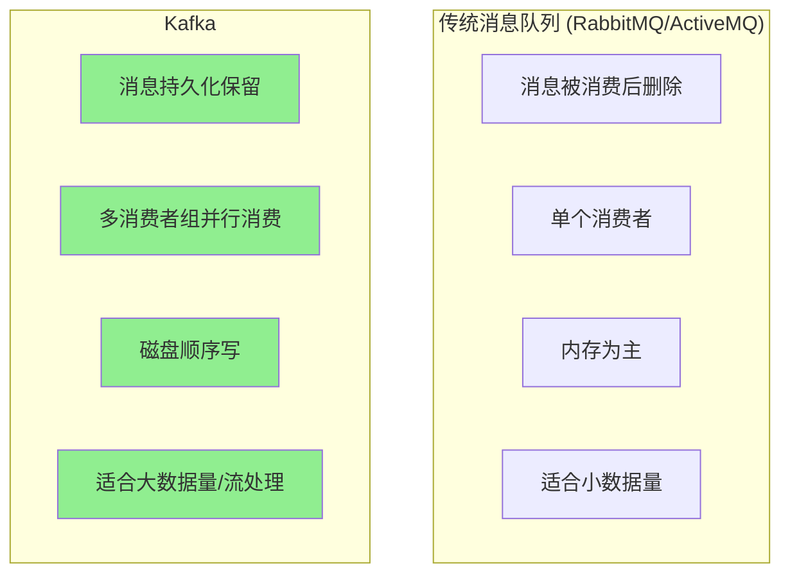

**核心差异解释：**

1. **消息保留策略**：传统MQ消费后删除，Kafka基于时间/大小保留
2. **消费模式**：Kafka支持多消费者组独立消费同一份数据
3. **存储设计**：Kafka专为磁盘顺序I/O优化，吞吐量极高
4. **定位不同**：传统MQ侧重解耦，Kafka侧重数据管道和流处理

### 1.3 典型应用场景

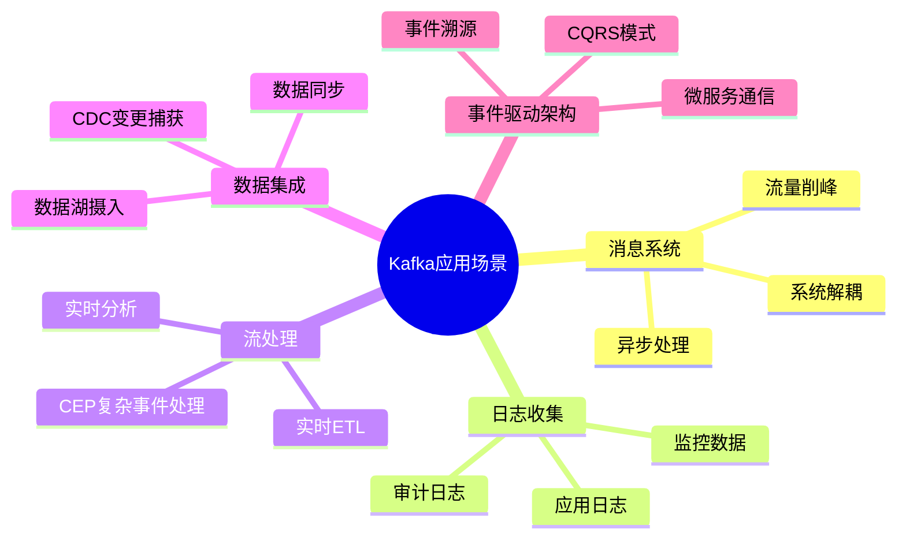

---

## 2. 核心概念与术语

### 2.1 概念全景图

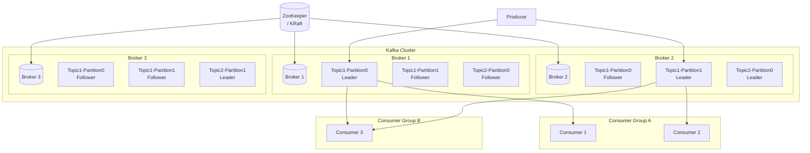

### 2.2 核心术语详解

| 术语               | 英文             | 详细说明                                                     |
| ------------------ | ---------------- | ------------------------------------------------------------ |
| **Broker**         | 代理服务器       | Kafka服务实例，负责接收、存储、转发消息。一个Kafka集群由多个Broker组成，每个Broker有唯一ID |
| **Topic**          | 主题             | 消息的逻辑分类，类似于数据库的表。生产者向Topic发消息，消费者从Topic订阅消息 |
| **Partition**      | 分区             | Topic的物理分片，是Kafka并行度的基本单位。每个Partition是有序的、不可变的消息序列 |
| **Replica**        | 副本             | Partition的备份，分为Leader和Follower。保证数据高可用        |
| **Leader**         | 领导者副本       | 负责处理该Partition所有的读写请求                            |
| **Follower**       | 跟随者副本       | 被动从Leader同步数据，当Leader宕机时可被选举为新Leader       |
| **Producer**       | 生产者           | 消息的发送方，负责将消息发布到指定Topic                      |
| **Consumer**       | 消费者           | 消息的接收方，从Topic订阅并处理消息                          |
| **Consumer Group** | 消费者组         | 一组Consumer的集合，组内Consumer共同消费Topic，实现负载均衡  |
| **Offset**         | 偏移量           | 消息在Partition中的唯一标识，是一个递增的长整数              |
| **ISR**            | In-Sync Replicas | 与Leader保持同步的副本集合，包括Leader本身                   |
| **HW**             | High Watermark   | 高水位，消费者能看到的最大offset                             |
| **LEO**            | Log End Offset   | 日志末端偏移量，下一条消息将要写入的位置                     |

### 2.3 消息模型图解

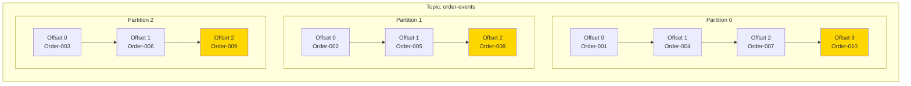

**关键理解：**
- 每个Partition内消息严格有序，但跨Partition不保证顺序
- Offset在每个Partition内独立编号
- 新消息追加到Partition末尾（Append-Only）

---

## 3. 整体架构设计

### 3.1 完整架构图

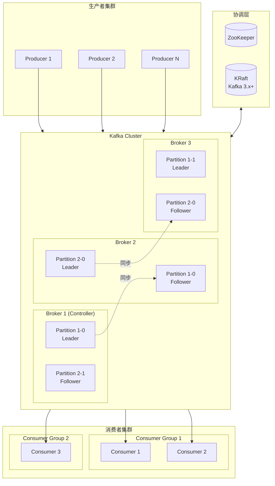

### 3.2 数据流转过程

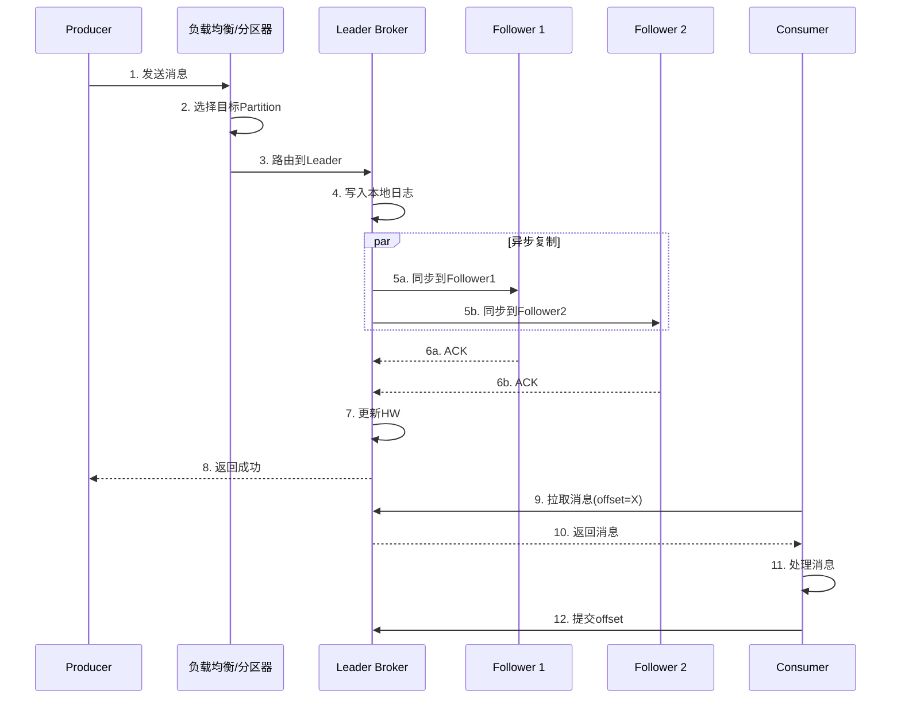

**流程详解：**

1. **发送阶段**：Producer将消息发送到Kafka
2. **路由阶段**：根据分区策略确定目标Partition
3. **Leader写入**：只有Leader副本接收写请求
4. **本地持久化**：消息写入Leader的本地日志文件
5. **副本同步**：Follower从Leader拉取数据进行同步
6. **确认机制**：根据acks配置决定何时返回成功
7. **消费拉取**：Consumer主动从Broker拉取消息
8. **Offset管理**：Consumer定期提交消费进度

---

## 4. Topic 与 Partition 机制

### 4.1 Partition 设计原理

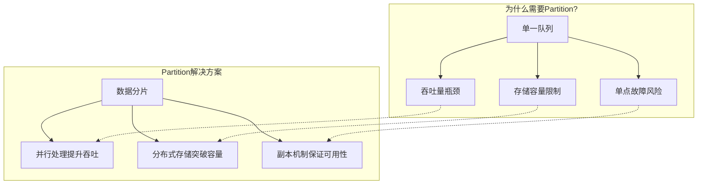

**Partition 核心价值：**

1. **水平扩展**：数据分布在多个Broker上，突破单机存储和性能限制
2. **并行处理**：多个Consumer可以并行消费不同Partition
3. **顺序保证**：单Partition内消息严格有序
4. **负载均衡**：消息均匀分布到各Partition

### 4.2 分区分配策略

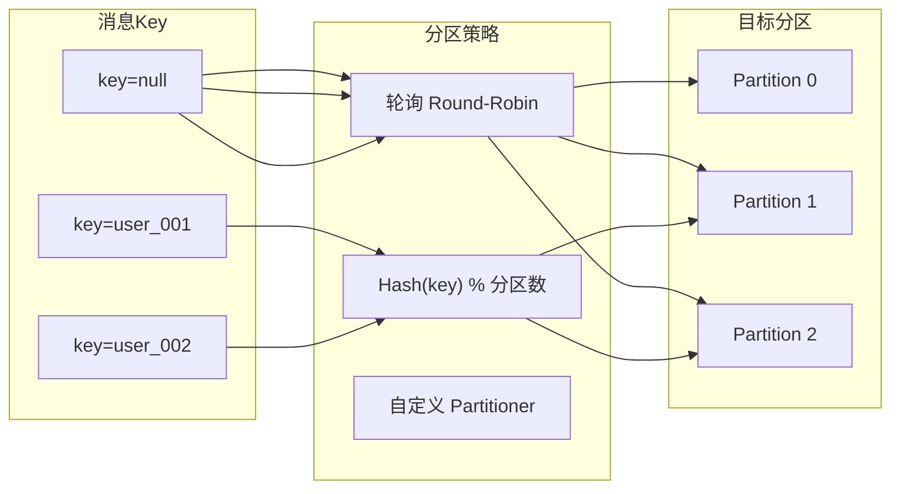

**分区策略详解：**

| 策略                 | 适用场景          | 说明                              |
| -------------------- | ----------------- | --------------------------------- |
| **轮询(RoundRobin)** | 无需保证顺序      | key为null时默认使用，消息均匀分布 |
| **Key Hash**         | 相同key需保证顺序 | 相同key的消息路由到同一分区       |
| **粘性分区**         | Kafka 2.4+ 默认   | 批量发送到同一分区，减少请求数    |
| **自定义**           | 特殊业务需求      | 实现Partitioner接口               |

### 4.3 分区数量选择

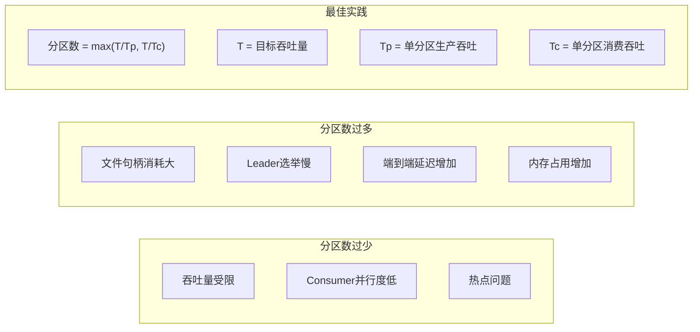

**分区数经验公式：**
```
分区数 = max(预期吞吐量/单分区生产吞吐量, 预期吞吐量/单分区消费吞吐量)
```

**建议原则：**
- 起步建议：分区数 = Broker数量 × 2~3
- 单个分区吞吐约 10MB/s ~ 30MB/s
- 分区数建议为Broker数量的整数倍

---

## 5. 生产者原理

### 5.1 生产者架构

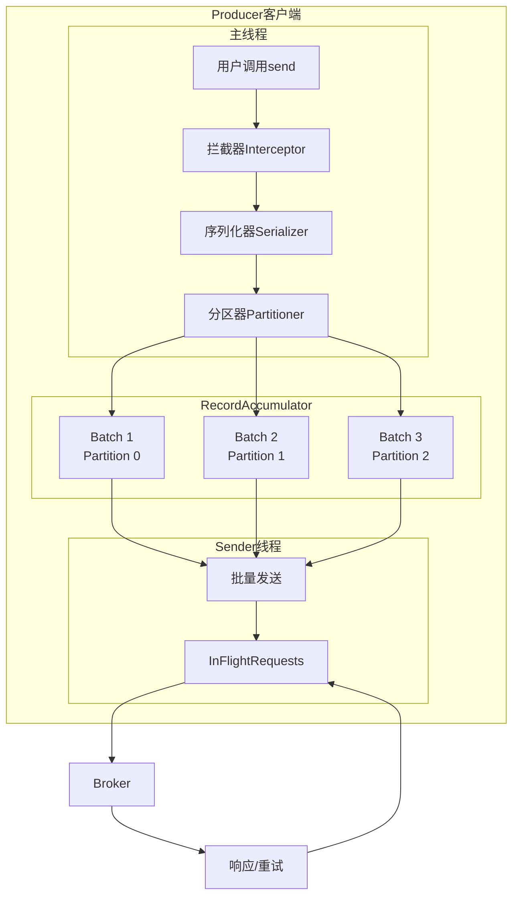

### 5.2 发送流程详解

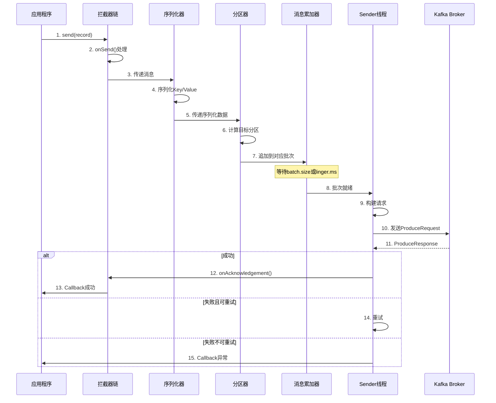

### 5.3 核心配置参数

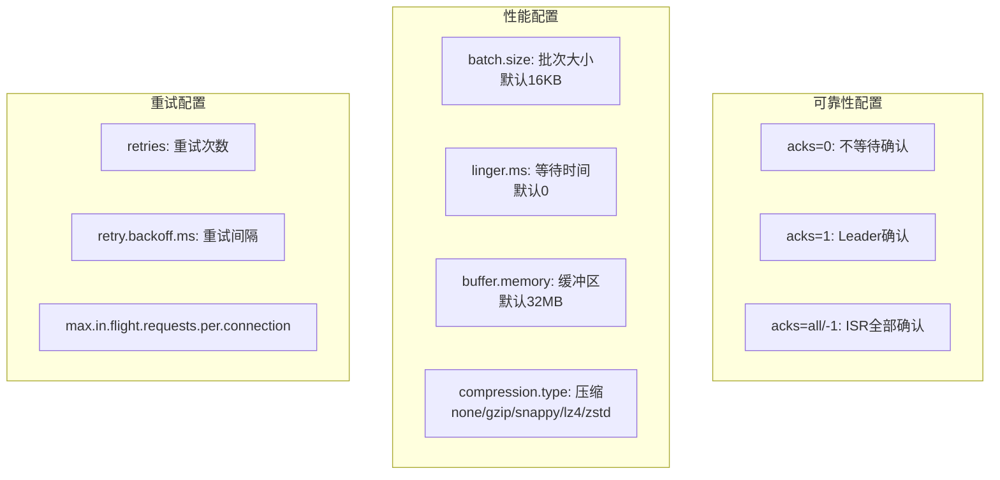

### 5.4 ACK机制详解

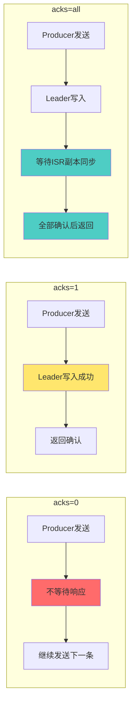

| acks值 | 可靠性 | 吞吐量 | 说明                                     |
| ------ | ------ | ------ | ---------------------------------------- |
| 0      | 最低   | 最高   | 发送即忘，可能丢消息                     |
| 1      | 中等   | 中等   | Leader确认，可能因Leader宕机丢消息       |
| all/-1 | 最高   | 最低   | ISR全部确认，配合min.insync.replicas使用 |

### 5.5 幂等与事务

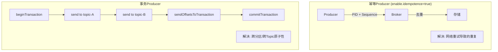

**幂等原理：**
- 每个Producer分配唯一PID（Producer ID）
- 每条消息携带递增的Sequence Number
- Broker通过<PID, Partition, SeqNum>去重
- 解决单分区内的重复问题

**事务原理：**
- 引入Transaction Coordinator协调者
- 通过两阶段提交保证原子性
- 支持跨分区、跨Topic的事务

---

## 6. 消费者原理

### 6.1 消费者组机制

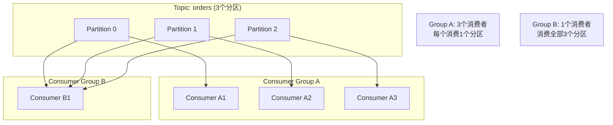

**核心规则：**
1. **组内互斥**：一个分区只能被组内一个Consumer消费
2. **组间独立**：不同组独立消费，互不影响
3. **最大并行度**：Consumer数量 ≤ 分区数（多余Consumer空闲）

### 6.2 分区分配策略

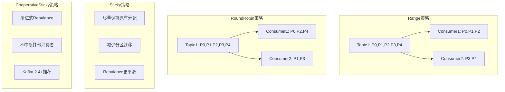

| 策略                  | 特点                    | 适用场景          |
| --------------------- | ----------------------- | ----------------- |
| **Range**             | 按Topic分配，可能不均匀 | 单Topic场景       |
| **RoundRobin**        | 全局轮询，较均匀        | 多Topic场景       |
| **Sticky**            | 尽量维持原分配          | 减少Rebalance开销 |
| **CooperativeSticky** | 增量式Rebalance         | Kafka 2.4+ 推荐   |

### 6.3 消费流程

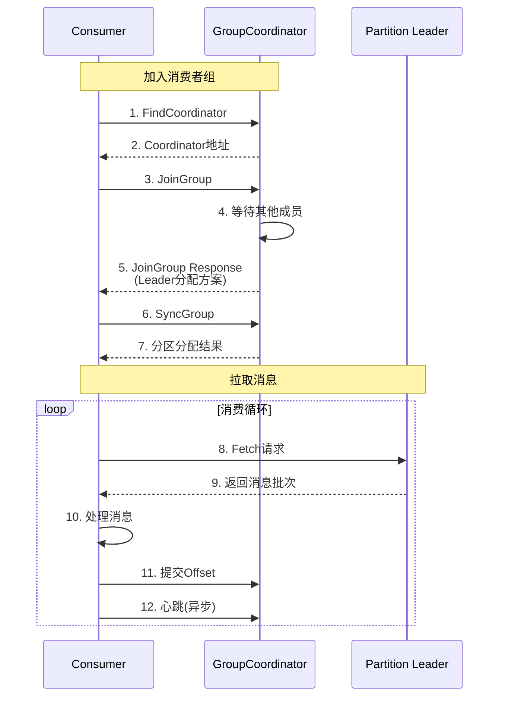

### 6.4 Offset 管理

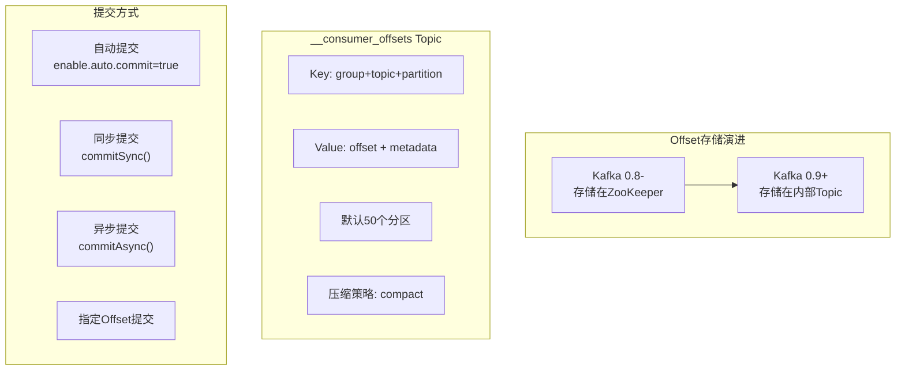

### 6.5 Rebalance 机制

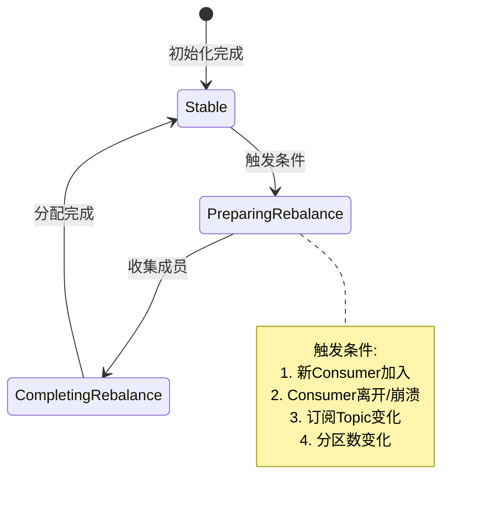

**Rebalance 问题与优化：**

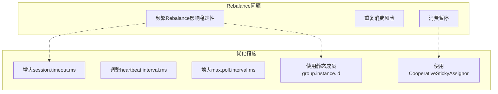

---

## 7. 消息存储机制

### 7.1 存储结构

```mermaid
graph TB
    subgraph "磁盘目录结构"
        Root["/kafka-logs"]
        T1["topic1-0/"]
        T2["topic1-1/"]
        T3["topic2-0/"]
        
        Root --> T1
        Root --> T2
        Root --> T3
        
        subgraph "Partition目录"
            S1["00000000000000000000.log<br/>(数据文件)"]
            S2["00000000000000000000.index<br/>(偏移量索引)"]
            S3["00000000000000000000.timeindex<br/>(时间戳索引)"]
            S4["00000000000000368769.log"]
            S5["00000000000000368769.index"]
        end
        
        T1 --> S1
        T1 --> S2
        T1 --> S3
        T1 --> S4
        T1 --> S5
    end
```

### 7.2 日志分段机制

```mermaid
flowchart LR
    subgraph "LogSegment 分段"
        Seg1["Segment 1<br/>offset: 0-368768"]
        Seg2["Segment 2<br/>offset: 368769-737537"]
        Seg3["Segment 3 (Active)<br/>offset: 737538-..."]
        
        Seg1 --> Seg2 --> Seg3
    end
    
    New[新消息] --> Seg3
    
    subgraph "分段条件"
        C1["log.segment.bytes=1GB"]
        C2["log.roll.hours=168"]
        C3["log.roll.ms"]
    end
```

**分段好处：**
1. 方便删除旧数据，直接删除整个Segment文件
2. 提高查询效率，只需搜索相关Segment
3. 支持并发读写

### 7.3 索引机制

```mermaid
graph LR
    subgraph "稀疏索引"
        I1["Offset 0 -> Position 0"]
        I2["Offset 1024 -> Position 32768"]
        I3["Offset 2048 -> Position 65536"]
    end
    
    subgraph "查找过程"
        Q1["查找Offset 1500"]
        Q2["二分查找索引<br/>定位到1024"]
        Q3["从Position 32768<br/>顺序扫描"]
        Q4["找到Offset 1500"]
        
        Q1 --> Q2 --> Q3 --> Q4
    end
```

### 7.4 消息格式

```mermaid
graph TB
    subgraph "消息格式 V2 (Kafka 0.11+)"
        subgraph "RecordBatch (批次)"
            B1["baseOffset: 8字节"]
            B2["batchLength: 4字节"]
            B3["magic: 1字节"]
            B4["crc: 4字节"]
            B5["attributes: 2字节<br/>(压缩/事务/时间戳类型)"]
            B6["lastOffsetDelta"]
            B7["producerId/epoch"]
            B8["Records[]"]
        end
        
        subgraph "Record (单条消息)"
            R1["length: varint"]
            R2["attributes: 1字节"]
            R3["timestampDelta"]
            R4["offsetDelta"]
            R5["keyLength + key"]
            R6["valueLength + value"]
            R7["Headers[]"]
        end
    end
```

### 7.5 日志清理策略

```mermaid
graph TB
    subgraph "Delete策略"
        D1["基于时间: log.retention.hours=168"]
        D2["基于大小: log.retention.bytes=-1"]
        D3["删除整个过期Segment"]
    end
    
    subgraph "Compact策略"
        C1["相同Key保留最新Value"]
        C2["用于Changelog/状态存储"]
        C3["__consumer_offsets使用此策略"]
    end
    
    subgraph "Compact过程"
        Before["Key1:V1, Key2:V1, Key1:V2, Key3:V1, Key2:V2"]
        After["Key1:V2, Key2:V2, Key3:V1"]
        Before -->|压缩| After
    end
```

---

## 8. 高可用与副本机制

### 8.1 副本架构

```mermaid
graph TB
    subgraph "Topic: orders, 副本因子=3"
        subgraph "Partition 0"
            P0L["Broker1<br/>Leader"]
            P0F1["Broker2<br/>Follower"]
            P0F2["Broker3<br/>Follower"]
            
            P0L --> P0F1
            P0L --> P0F2
        end
        
        subgraph "Partition 1"
            P1L["Broker2<br/>Leader"]
            P1F1["Broker3<br/>Follower"]
            P1F2["Broker1<br/>Follower"]
        end
    end
    
    Producer --> P0L
    Producer --> P1L
    
    style P0L fill:#90EE90
    style P1L fill:#90EE90
```

### 8.2 ISR 机制

```mermaid
stateDiagram-v2
    [*] --> ISR: Follower启动同步
    
    ISR --> OSR: 落后超过replica.lag.time.max.ms
    OSR --> ISR: 追上Leader
    
    note right of ISR
        ISR (In-Sync Replicas)
        - 与Leader同步的副本集合
        - 包括Leader自身
        - 只有ISR成员可被选为Leader
    end note
    
    note right of OSR
        OSR (Out-of-Sync Replicas)
        - 同步落后的副本
        - 不参与Leader选举
        - 不影响消息确认
    end note
```

### 8.3 HW 与 LEO

```mermaid
graph TB
    subgraph "Leader"
        L1[Msg0]
        L2[Msg1]
        L3[Msg2]
        L4[Msg3]
        L5[Msg4]
        L_LEO["LEO=5"]
        L_HW["HW=3"]
    end
    
    subgraph "Follower1"
        F1_1[Msg0]
        F1_2[Msg1]
        F1_3[Msg2]
        F1_LEO["LEO=3"]
    end
    
    subgraph "Follower2"
        F2_1[Msg0]
        F2_2[Msg1]
        F2_3[Msg2]
        F2_4[Msg3]
        F2_LEO["LEO=4"]
    end
    
    Note1["HW = min(所有ISR的LEO) = 3"]
    Note2["Consumer只能消费到HW位置"]
```

**概念解释：**
- **LEO (Log End Offset)**：日志末端偏移量，下一条待写入消息的位置
- **HW (High Watermark)**：高水位，Consumer可见的最大偏移量
- **HW = min(所有ISR副本的LEO)**

### 8.4 Leader Epoch

```mermaid
sequenceDiagram
    participant L1 as 原Leader
    participant F as Follower
    participant L2 as 新Leader
    
    Note over L1,F: Epoch=0
    L1->>F: 消息 offset=100
    L1->>L1: 崩溃!
    
    Note over F,L2: Epoch=1, Follower成为新Leader
    F->>L2: 变为新Leader
    L2->>L2: 记录(Epoch=1, StartOffset=101)
    
    Note over L1,L2: 原Leader恢复
    L1->>L2: 请求LeaderEpoch
    L2-->>L1: Epoch=1从101开始
    L1->>L1: 截断到offset=100
    L1->>L2: 开始同步
```

**Leader Epoch 作用：**
解决由于日志截断导致的数据不一致问题，替代原来基于HW的方式。

### 8.5 Controller 角色

```mermaid
graph TB
    subgraph "Controller职责"
        A[Broker上下线管理]
        B[Topic创建删除]
        C[Partition Leader选举]
        D[副本分配]
        E[元数据管理]
    end
    
    subgraph "Controller选举"
        F[所有Broker竞争]
        G[ZK创建临时节点]
        H[成功者成为Controller]
        I[失败者Watch节点]
    end
    
    F --> G --> H
    G --> I
    
    subgraph "故障转移"
        J[Controller宕机]
        K[ZK节点消失]
        L[其他Broker收到通知]
        M[重新竞争Controller]
    end
    
    J --> K --> L --> M
```

---

## 9. ZooKeeper/KRaft 的作用

### 9.1 ZooKeeper 在 Kafka 中的作用

```mermaid
graph TB
    subgraph "ZooKeeper存储的元数据"
        A["/brokers/ids<br/>Broker注册信息"]
        B["/brokers/topics<br/>Topic配置"]
        C["/controller<br/>Controller选举"]
        D["/admin/delete_topics<br/>待删除Topic"]
        E["/config<br/>动态配置"]
    end
    
    subgraph "核心功能"
        F[Broker发现与注册]
        G[Controller选举]
        H[Topic配置管理]
        I[ACL权限存储]
    end
    
    A --> F
    C --> G
    B --> H
    E --> I
```

### 9.2 KRaft 模式 (Kafka 3.x+)

```mermaid
graph TB
    subgraph "KRaft架构"
        subgraph "Controller Quorum"
            C1[Controller 1<br/>Active]
            C2[Controller 2<br/>Standby]
            C3[Controller 3<br/>Standby]
        end
        
        subgraph "Broker层"
            B1[Broker 1]
            B2[Broker 2]
            B3[Broker 3]
        end
        
        C1 --> B1
        C1 --> B2
        C1 --> B3
        
        C1 <--> C2
        C1 <--> C3
        C2 <--> C3
    end
    
    subgraph "优势"
        A1[移除ZK依赖]
        A2[简化部署运维]
        A3[更快的元数据传播]
        A4[更大的分区规模支持]
    end
```

**ZooKeeper vs KRaft 对比：**

| 方面           | ZooKeeper模式  | KRaft模式                     |
| -------------- | -------------- | ----------------------------- |
| 依赖           | 需要独立ZK集群 | 无外部依赖                    |
| 运维复杂度     | 高             | 低                            |
| 元数据存储     | ZK             | 内部Topic(__cluster_metadata) |
| 分区上限       | ~20万          | 数百万                        |
| Controller切换 | 较慢           | 更快                          |

---

## 10. 消息可靠性保障

### 10.1 端到端可靠性

```mermaid
flowchart LR
    subgraph "生产端可靠性"
        P1["acks=all"]
        P2["retries=MAX"]
        P3["enable.idempotence=true"]
        P4["max.in.flight.requests=1 或 5"]
    end
    
    subgraph "Broker端可靠性"
        B1["replication.factor≥3"]
        B2["min.insync.replicas≥2"]
        B3["unclean.leader.election.enable=false"]
    end
    
    subgraph "消费端可靠性"
        C1["enable.auto.commit=false"]
        C2["手动提交offset"]
        C3["处理完成后再提交"]
    end
    
    P1 & P2 & P3 & P4 --> B1 & B2 & B3 --> C1 & C2 & C3
```

### 10.2 消息丢失场景分析

```mermaid
graph TB
    subgraph "生产者丢失"
        PA1["acks=0: 发送即忘"]
        PA2["acks=1: Leader崩溃"]
        PA3["网络异常未重试"]
    end
    
    subgraph "Broker丢失"
        BA1["单副本,Broker宕机"]
        BA2["ISR全部落后时Leader切换"]
        BA3["unclean选举"]
    end
    
    subgraph "消费者丢失"
        CA1["自动提交后处理失败"]
        CA2["先提交后消费"]
    end
    
    subgraph "解决方案"
        S1["acks=all + min.insync.replicas"]
        S2["replication.factor≥3"]
        S3["手动提交 + 幂等消费"]
    end
    
    PA1 & PA2 -.-> S1
    BA1 & BA2 -.-> S2
    CA1 & CA2 -.-> S3
```

### 10.3 消息重复场景

```mermaid
graph TB
    subgraph "重复产生"
        D1["生产者重试导致"]
        D2["Rebalance后重复消费"]
        D3["消费失败后重试"]
    end
    
    subgraph "解决方案"
        S1["Producer幂等性<br/>enable.idempotence=true"]
        S2["业务幂等设计<br/>唯一ID+去重表"]
        S3["Exactly-Once语义<br/>事务Producer+Consumer"]
    end
```

### 10.4 消息顺序保证

```mermaid
graph TB
    subgraph "顺序保证级别"
        O1["分区内有序 ✓"]
        O2["全局有序 ✗ (单分区可实现)"]
    end
    
    subgraph "实现分区内有序"
        S1["相同Key到相同分区"]
        S2["max.in.flight.requests=1"]
        S3["或开启幂等性(可设为5)"]
    end
    
    subgraph "全局有序方案"
        G1["单分区(损失吞吐)"]
        G2["业务层排序"]
        G3["使用消息时间戳"]
    end
```

---

## 11. 性能优化原理

### 11.1 高性能设计

```mermaid
mindmap
  root((Kafka高性能))
    顺序IO
      磁盘顺序写
      Append-Only日志
      预读/后写优化
    零拷贝
      sendfile系统调用
      避免用户态内核态切换
      减少数据复制
    批量处理
      Producer批量发送
      Consumer批量拉取
      Broker批量写入
    压缩
      端到端压缩
      批量压缩效率高
      多种算法选择
    分区并行
      多分区并行读写
      Consumer并行消费
    PageCache
      利用操作系统缓存
      读写都受益
```

### 11.2 顺序 IO 优化

```mermaid
graph LR
    subgraph "随机IO"
        R1[寻道时间长]
        R2[磁头频繁移动]
        R3[~100 IOPS]
    end
    
    subgraph "顺序IO"
        S1[连续数据块]
        S2[预读取优化]
        S3[~10万+ IOPS]
    end
    
    R1 --> |"Kafka优化"| S1
    
    subgraph "Kafka实现"
        K1[Append-Only写入]
        K2[Segment文件连续]
        K3[索引稀疏存储]
    end
```

### 11.3 零拷贝原理

```mermaid
graph TB
    subgraph "传统拷贝 (4次)"
        T1["磁盘 → 内核缓冲区"]
        T2["内核缓冲区 → 用户空间"]
        T3["用户空间 → Socket缓冲区"]
        T4["Socket缓冲区 → 网卡"]
        T1 --> T2 --> T3 --> T4
    end
    
    subgraph "零拷贝 sendfile (2次)"
        Z1["磁盘 → 内核缓冲区"]
        Z2["内核缓冲区 → 网卡"]
        Z1 --> Z2
        Z3["(DMA直接传输)"]
    end
    
    style Z1 fill:#90EE90
    style Z2 fill:#90EE90
```

### 11.4 批量与压缩

```mermaid
graph LR
    subgraph "Producer批量"
        P1[单条消息]
        P2[累积到batch.size]
        P3[或等待linger.ms]
        P4[批量发送]
        P1 --> P2 --> P4
        P1 --> P3 --> P4
    end
    
    subgraph "压缩效果"
        C1["消息1"]
        C2["消息2"]
        C3["消息N"]
        C4["压缩批次"]
        C1 & C2 & C3 --> C4
        C5["压缩比: 2~10倍"]
    end
```

**压缩算法对比：**

| 算法   | 压缩比 | 压缩速度 | 解压速度 | CPU消耗 |
| ------ | ------ | -------- | -------- | ------- |
| none   | 1      | -        | -        | 无      |
| gzip   | 高     | 慢       | 中       | 高      |
| snappy | 中     | 快       | 快       | 低      |
| lz4    | 中     | 很快     | 很快     | 低      |
| zstd   | 很高   | 中       | 快       | 中      |

---

## 12. 实战配置与调优

### 12.1 核心配置全景

```mermaid
graph TB
    subgraph "Broker配置"
        B1["num.partitions=3"]
        B2["default.replication.factor=3"]
        B3["min.insync.replicas=2"]
        B4["log.retention.hours=168"]
        B5["log.segment.bytes=1GB"]
        B6["num.io.threads=8"]
        B7["num.network.threads=3"]
    end
    
    subgraph "Producer配置"
        P1["acks=all"]
        P2["batch.size=16384"]
        P3["linger.ms=5"]
        P4["buffer.memory=33554432"]
        P5["compression.type=lz4"]
        P6["retries=2147483647"]
    end
    
    subgraph "Consumer配置"
        C1["enable.auto.commit=false"]
        C2["max.poll.records=500"]
        C3["fetch.min.bytes=1"]
        C4["fetch.max.wait.ms=500"]
        C5["session.timeout.ms=45000"]
        C6["heartbeat.interval.ms=15000"]
    end
```

### 12.2 生产环境配置示例

```properties
# ============ Broker 核心配置 ============
# Broker唯一标识
broker.id=0

# 监听地址
listeners=PLAINTEXT://0.0.0.0:9092
advertised.listeners=PLAINTEXT://kafka-broker-1:9092

# 日志目录
log.dirs=/data/kafka-logs

# ZooKeeper/KRaft配置
zookeeper.connect=zk1:2181,zk2:2181,zk3:2181/kafka
# 或 KRaft模式
# process.roles=broker,controller
# controller.quorum.voters=1@host1:9093,2@host2:9093,3@host3:9093

# 分区与副本
num.partitions=6
default.replication.factor=3
min.insync.replicas=2

# 日志保留
log.retention.hours=168
log.retention.bytes=-1
log.segment.bytes=1073741824

# 线程配置
num.network.threads=8
num.io.threads=16

# ============ Producer 配置 ============
# 可靠性
acks=all
retries=2147483647
enable.idempotence=true

# 性能
batch.size=65536
linger.ms=10
buffer.memory=67108864
compression.type=lz4

# 超时
request.timeout.ms=30000
delivery.timeout.ms=120000

# ============ Consumer 配置 ============
# 消费组
group.id=my-consumer-group

# Offset管理
enable.auto.commit=false
auto.offset.reset=earliest

# 拉取配置
max.poll.records=500
fetch.min.bytes=1
fetch.max.bytes=52428800
fetch.max.wait.ms=500

# 会话管理
session.timeout.ms=45000
heartbeat.interval.ms=15000
max.poll.interval.ms=300000

# 分区分配
partition.assignment.strategy=org.apache.kafka.clients.consumer.CooperativeStickyAssignor
```

### 12.3 调优决策树

```mermaid
flowchart TB
    Start[性能问题] --> Q1{吞吐量不足?}
    
    Q1 -->|是| A1[增加分区数]
    Q1 -->|是| A2[调大batch.size]
    Q1 -->|是| A3[增加linger.ms]
    Q1 -->|是| A4[启用压缩]
    Q1 -->|是| A5[增加Consumer数]
    
    Q1 -->|否| Q2{延迟过高?}
    
    Q2 -->|是| B1[减小batch.size]
    Q2 -->|是| B2[减小linger.ms=0]
    Q2 -->|是| B3[减少压缩]
    Q2 -->|是| B4[增加网络线程]
    
    Q2 -->|否| Q3{消息丢失?}
    
    Q3 -->|是| C1[acks=all]
    Q3 -->|是| C2[min.insync.replicas≥2]
    Q3 -->|是| C3[关闭unclean选举]
    Q3 -->|是| C4[手动提交offset]
    
    Q3 -->|否| Q4{Rebalance频繁?}
    
    Q4 -->|是| D1[增大session.timeout.ms]
    Q4 -->|是| D2[增大max.poll.interval.ms]
    Q4 -->|是| D3[使用静态成员ID]
    Q4 -->|是| D4[用CooperativeSticky策略]
```

### 12.4 监控指标

```mermaid
graph TB
    subgraph "Broker监控"
        B1["UnderReplicatedPartitions<br/>副本不足分区数"]
        B2["ActiveControllerCount<br/>Controller状态"]
        B3["OfflinePartitionsCount<br/>离线分区"]
        B4["RequestsPerSec<br/>请求QPS"]
        B5["BytesInPerSec/BytesOutPerSec<br/>网络吞吐"]
    end
    
    subgraph "Producer监控"
        P1["record-send-rate<br/>发送速率"]
        P2["record-error-rate<br/>错误率"]
        P3["request-latency-avg<br/>请求延迟"]
        P4["batch-size-avg<br/>批次大小"]
    end
    
    subgraph "Consumer监控"
        C1["records-lag<br/>消费延迟"]
        C2["records-consumed-rate<br/>消费速率"]
        C3["commit-rate<br/>提交速率"]
        C4["rebalance-rate<br/>Rebalance频率"]
    end
```

---

## 总结

### 核心要点回顾

```mermaid
mindmap
  root((Kafka核心))
    架构
      分布式设计
      Broker集群
      分区机制
      副本容灾
    存储
      顺序写入
      日志分段
      稀疏索引
      压缩清理
    生产者
      批量发送
      分区路由
      ACK机制
      幂等事务
    消费者
      消费者组
      分区分配
      Offset管理
      Rebalance
    可靠性
      副本同步
      ISR机制
      HW/LEO
      Leader选举
    性能
      零拷贝
      PageCache
      批量压缩
      并行处理
```

### 学习路径建议

1. **入门阶段**：理解核心概念，搭建单机环境，完成基本收发消息
2. **进阶阶段**：深入理解存储机制、副本机制、消费者组原理
3. **高级阶段**：掌握性能调优、生产问题排查、Kafka Streams/Connect
4. **专家阶段**：源码分析、定制开发、架构设计

