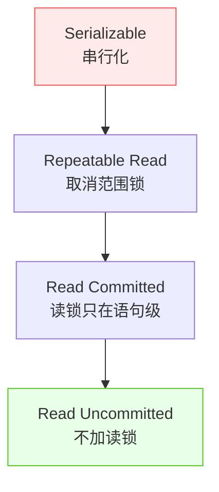
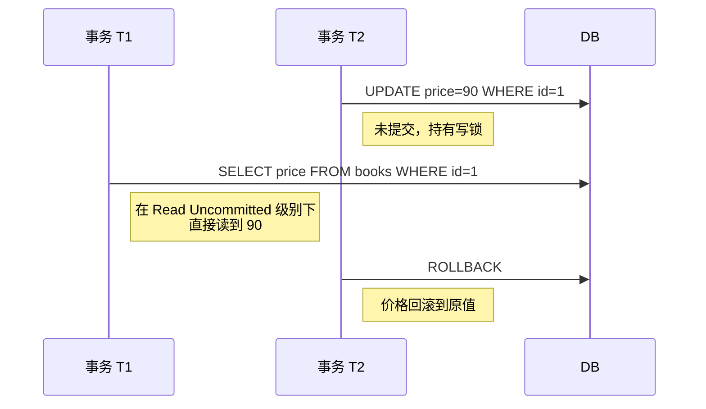
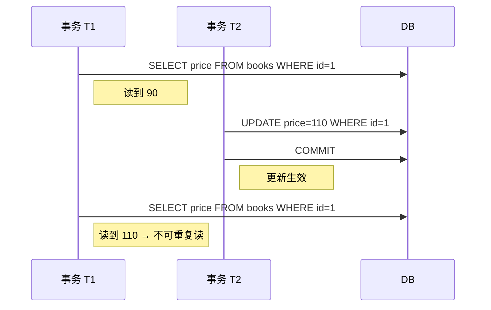
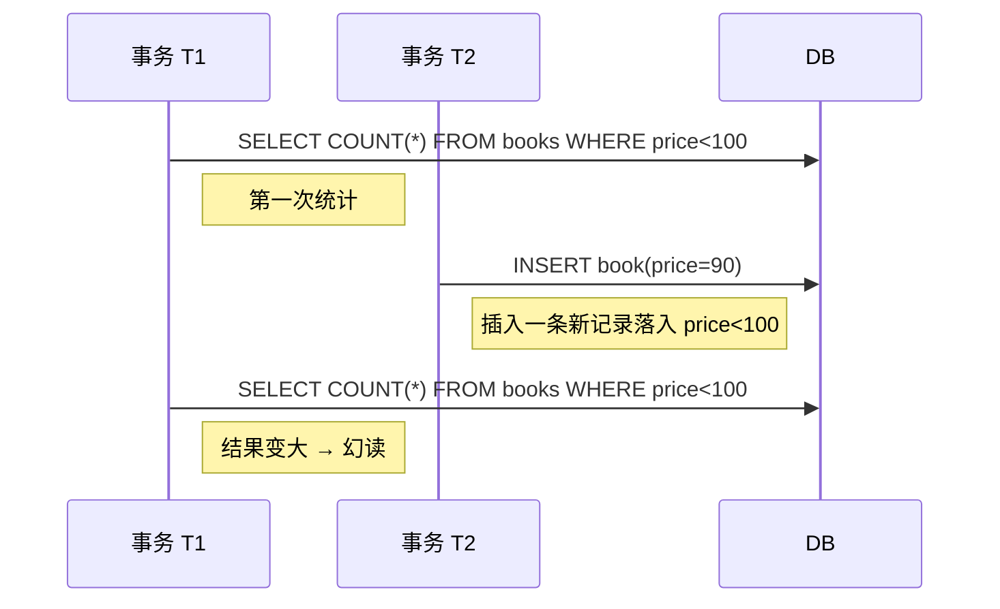
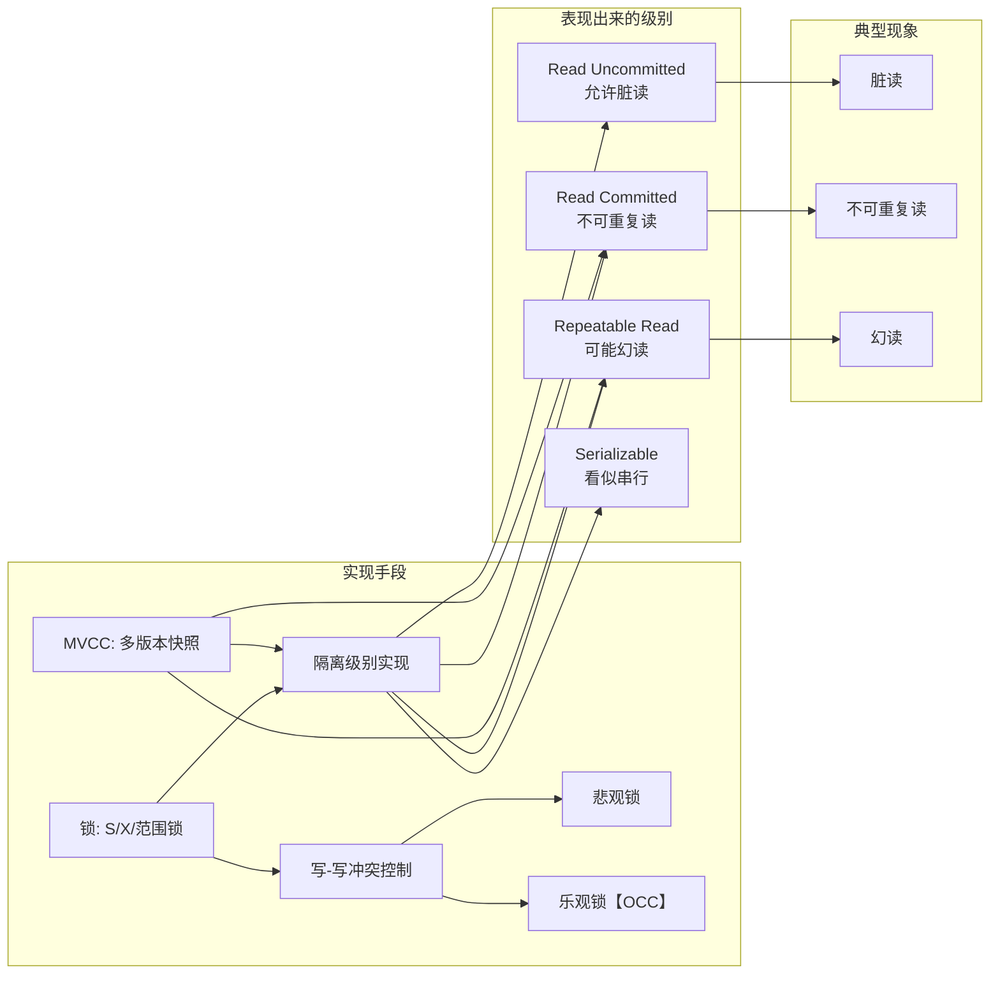

> 本文基于《凤凰架构》整理，结合个人理解深入探讨数据库事务隔离性的实现机制。

---

很多人学事务隔离时，是这样记的：

> Serializable 最安全、Repeatable Read 次之、Read Committed 再次、Read Uncommitted 最弱，
>
> 然后死记「脏读 / 不可重复读 / 幻读」分别对应哪个级别。

记是记住了，但写代码时往往不知道自己该选哪个隔离级别，也搞不清楚 MySQL / PostgreSQL 这些数据库跟理论讲的是不是一回事。

我更推荐的理解方式是：

> **所有隔离级别，都是不同加锁 / 版本策略的组合。**  
> 幻读 / 不可重复读 / 脏读，只是这些组合在并发下显露出的「副作用」。

下面就从「锁」和「MVCC」两个维度，把这件事讲透。

---

## 一、从开发者视角重新理解「隔离」

ACID 里四个特性：

- A 原子性：要么全成功，要么全失败。
- C 一致性：事务前后，数据从一个合法状态到另一个合法状态。
- I 隔离性：看上去像在「一个一个」地执行事务。
- D 持久性：一旦提交，就不会丢。

其中 **隔离性** 是在「并发 + 共享数据」的前提下，防止事务互相踩脚。没有并发，其实就没有隔离问题。

所以隔离 = 并发控制。  
而并发控制 = 锁策略 + 版本管理。

---

## 二、锁的视角：隔离级别本质是「什么时候加锁、锁多久」

从程序员习惯的视角看数据库，先只记三种最核心的锁：

### 2.1 写锁（X Lock / 排他锁）

- 一旦某行被事务 T1 加上写锁：
  - 只有 T1 能写；
  - 其他事务既不能写，也不能再对这行加读锁。
- 用途：保护写，避免「别人边读边改」。

你可以把它想象成 synchronized 包住了这条记录。

### 2.2 读锁（S Lock / 共享锁）

- 多个事务可以同时对同一行加读锁；
- 但有任意读锁存在时，别人不能加写锁；
- 某些实现允许「自己唯一的读锁 → 升级为写锁」。

用途：保护“我正在读的东西，在我整个事务期间不要变”。

### 2.3 范围锁（Range Lock）

这个是很多书略过但很关键的一种锁。

- 对「一个范围条件」加锁，而不是对现有的某几行加锁。
- 效果：
  - 范围内原有记录不能改；
  - 新记录也**不能插入到这个范围中**，旧记录也不能从这范围里「消失」。

例如：

```sql
SELECT * FROM books WHERE price < 100 FOR UPDATE;
```

在支持范围锁的实现中，这条语句会对 `price < 100` 这个区间加一把锁，  
别人既不能修改这些记录的 price，把它们移出 <100 的范围，也不能插入 price=90 之类的新记录。

**重点：**  
范围锁 ≠「对现有所有行加一堆 X 锁的集合」，  
它多保护了「**那些还没出现、但可能落到这个范围的行**」。

这正是它能解决「幻读」的关键。

---

## 三、四种隔离级别：先记表，再连到锁

先用一张表把四个级别的「现象」和「粗略锁策略」放在一起：

| 隔离级别                     | 允许的问题               | 读锁持有时间           | 是否范围锁 | 能否读到未提交数据 |
| ---------------------------- | ------------------------ | ---------------------- | ---------- | ------------------ |
| Serializable（可串行化）     | 无                       | 整个事务               | 是         | 否                 |
| Repeatable Read（可重复读）  | 幻读                     | 整个事务               | 否         | 否                 |
| Read Committed（读已提交）   | 不可重复读 + 幻读        | 每条查询期间，立刻释放 | 否         | 否                 |
| Read Uncommitted（读未提交） | 脏读 + 不可重复读 + 幻读 | 不加读锁               | 否         | 是                 |

你可以把它想成是「对读的保护措施逐步放松」的过程：



下面逐个说说。

### 3.1 Serializable：用锁硬怼出“看起来串行”

理论上的最高级隔离，就是：

> 任意并发执行的结果，都等价于“某种顺序”的串行执行。

最经典的实现方式是「**两阶段锁协议（2PL）+ 读写锁 + 范围锁**」：

- 所有需要访问的记录，在读/写之前先加锁；
- 加锁阶段只加不放（Expanding phase）；
- 一旦开始释放锁，后续不能再新加锁（Shrinking phase）；
- 范围查询还要加范围锁，禁止范围内的插入/删除。

代价也很明显：阻塞严重，并发吞吐量低。

现实中真正用 Serializable 的场景相对少，更多是做金融级强一致性，或者在逻辑上很难让业务方接受“看到中间状态”的场景。

不过注意：

- 一些数据库的 Serializable 实现**并不一定完全靠锁**，如 PostgreSQL 有基于乐观并发控制的 Serializable（Serializable Snapshot Isolation）。
- 但对应用层来说，你可以近似认为：**性能最差、隔离最强**。

### 3.2 Repeatable Read：锁住我看过的行，但不锁范围

可重复读的目标是：

> 在一个事务内，多次用主键 / 唯一键读到同一行，结果必须一样。

手段：

- 对读取过的行加读锁，并且持有到事务结束；
- 但对「范围」不再加锁。

因此：

- 再次读取同一行，不会变（解决不可重复读）；
- 但同样的范围查询，两次可能返回不同数量的行（新增/删除行的**幻影**）→ **幻读**。

实际数据库里有点差异：

- MySQL InnoDB 默认隔离级别是 Repeatable Read，但**配合 MVCC + 间隙锁（Gap Lock）/Next-Key Lock**，  
  在很多只读场景下实际上不出现幻读；
- 如果同时有写操作，就仍可能遇到「幻读意义上的问题」，例如批量更新范围内的数据，期间又插入了新的行。

后面讲 MVCC 时会细说。

### 3.3 Read Committed：大部分系统的“够用默认”

读已提交的目标是：

> 每次读到的数据，至少都是“**当时已经提交过**”的状态。

手段：

- 每次查询前对需要的行加读锁；
- 查询结束后立即释放读锁；
- 写锁依然要持有到事务结束。

结果：

- 避免了脏读（不会读到未提交的数据）；
- 但两次读同一行，中间如果有人更新并提交了，就会看到不同值 → **不可重复读**。

多人协作时经常会遇到这种「被别人悄悄改了」的情况，  
在很多业务里这并不算 bug（例如后台管理页面看到最新配置），  
所以 **很多数据库选择 Read Committed 作为默认隔离级别**（如 PostgreSQL、Oracle）。

### 3.4 Read Uncommitted：几乎只用于特殊需求

读未提交的特点：

- 不加读锁；
- 允许读到别人的未提交修改。

所以会有：

- 脏读；
- 不可重复读；
- 幻读。

它的价值更多在于**极少数分析/监控场景**：  
例如你只想大致看一下系统当前的数据规模/走势，即便有点误差也无所谓，这时能少一点锁开销。

**但不建议用于绝大多数业务逻辑**。一旦协议、价格、审批状态一类的东西被脏读，就很难解释清楚。

---

## 四、三大现象：从「谁在改」+「什么时候改」来区分

很多资料只给「定义 + SQL 示例」，不容易在脑子里形成清晰画面。  
我比较喜欢这样分类：

- 维度 1：是**单行**还是**范围**？
- 维度 2：是读到了**未提交**，还是**已提交但中途被改**？

可以画成一个小表：

|                | 读到未提交数据 | 读到已提交但中途被改的数据 |
| -------------- | -------------- | -------------------------- |
| 针对单行       | 脏读           | 不可重复读                 |
| 针对范围结果集 | 脏读 + 幻读    | 幻读                       |

再配合一个顺序图，看得更直观。

### 4.1 脏读（Dirty Read）

> 读到了别人「后来又回滚」的数据。



真实业务里，这类情况破坏用户信任感非常强：  
用户刚看到 90 元，下一页刷新变成 110，还说刚才是“看错了”。

### 4.2 不可重复读（Non-Repeatable Read）

> 同一事务两次读同一行，中间被别人「提交过修改」。



这在很多场景下可以接受（看到的是**最新**状态），  
但在财务结算 / 审计 / 长事务读取处理中，就经常是 bug。

### 4.3 幻读（Phantom Read）

> 同一事务里，两次按同一条件做范围查询，行数变了。



有的同学会问：  
我做的很多业务，好像幻读也没那么可怕？

要看场景：

- 如果你只是分页查列表，第二页多/少几条，这确实算正常；
- 但如果你要做「先统计再批量处理这批数据」之类的逻辑，幻读会摧毁你对数据集边界的所有假设。

---

## 五、MVCC：把读和写「拆开」处理

上面的所有分析，其实默认是「**读也要靠锁来保护**」。

但现实业务中，典型是「**读远多于写**」：

- 如果读操作每次都要加锁、阻塞写，就会浪费大量性能；
- 更糟糕的是：长事务中的读会占很久的锁，把写全堵住。

所以出现了一个极其重要的优化思路：

> **读操作不抢锁，而是读“历史快照”。**  
> 写操作不覆盖旧版本，而是生成新版本 → 「多版本并发控制（MVCC）」。

### 5.1 一句话直觉版理解

你可以把 MVCC 想象成：  
每行记录背后排着一串“时间线”，每次更新只是往后追加一格，而不是「在原地擦掉改写」。

读的时候，只需回答两个问题：

1. 这次查询对应的「时间点」是何时？（事务开始时？还是每条语句执行时？）
2. 在这个时间点，我“有资格”看到哪一个版本？（根据事务 ID、是否提交等规则）

所以：

- **读** 不一定要加锁，只在版本链里筛一个合适的版本；
- **写** 依然需要通过锁来避免写写冲突。

### 5.2 抽象模型：CREATE_VERSION / DELETE_VERSION

原文给了一个很经典的抽象模型，我们再延伸一点：

每行数据有两个隐藏字段：

- `CREATE_VERSION`：创建该版本的事务 ID；
- `DELETE_VERSION`：删除该版本的事务 ID（如果还没被删，则为空）。

对于不同操作：

- 插入：
  - 新版本：`CREATE_VERSION = 当前事务 ID`，`DELETE_VERSION = NULL`。
- 删除：
  - 被删版本：`DELETE_VERSION = 当前事务 ID`。
- 更新：
  - 旧版本：`DELETE_VERSION = 当前事务 ID`；
  - 新版本：`CREATE_VERSION = 当前事务 ID`，`DELETE_VERSION = NULL`。

查询时：

- 按照数据库的隔离策略，找到对当前事务「可见」的版本：
  - 版本创建时间不能晚于我的“观察时间点”；
  - 版本的删除时间不能早于我的“观察时间点”。

### 5.3 Repeatable Read vs Read Committed 在 MVCC 下的差异

如果引入一个概念：**快照点（Snapshot / Read View）**：

- **Read Committed**（语句级快照）：
  - 每条 SELECT 开始时新建一份快照；
  - 这条语句看到的是「截至本语句开始时，已经提交的最新版本」；
  - 所以两次 SELECT 的视角可能不一致 → 不可重复读。

- **Repeatable Read**（事务级快照，典型如 InnoDB）：
  - 事务第一次 SELECT 时创建快照；
  - 整个事务里后续的 SELECT，都基于这份快照；
  - 所以同一行的值不会变 → 可重复读。

因此，在 MVCC 下，**即便不靠读锁，也能做到「可重复读」**。  
这就是 modern DB 和经典教科书实现上的一大差别。

### 5.4 幻读与 MVCC：只读 vs 当前读

一个经常引起困惑的点：

- 在 MVCC + Repeatable Read 下：
  - 普通 SELECT（快照读）通常不会出现幻读；
  - 但带 `FOR UPDATE` / `LOCK IN SHARE MODE` 等当前读，仍然可能遇到写写冲突，  
    这时数据库会用「间隙锁 / Next-Key Lock + MVCC」来一起防止幻读和丢更新。

以 MySQL InnoDB 为例：

- Repeatable Read + 普通 SELECT：基本上就是「事务级快照读取」，读到的世界是一个静态快照；
- 如果你要更新范围内的数据，InnoDB 会：
  - 通过锁（Record Lock + Gap Lock）来禁止别人往这个范围里插入新行；
  - 结合 MVCC 确保你更新的是基于某个一致快照的版本。

所以可以这样理解：

> MVCC 主要解决「读 + 写」的并发问题，让读几乎不用抢锁；  
> 幻读更多是「范围 + 写」的配合问题，现代数据库通常是「MVCC + 特殊锁」一起用来解决。

---

## 六、写 + 写：乐观锁 vs 悲观锁

MVCC 对读帮助很大，但**对写写冲突几乎没法优化**，  
因为最终落到磁盘上的数据不能同时是两个版本。

这就回到两个经典策略：

### 6.1 悲观锁：先锁了再说

- 认为「肯定会冲突」，一开始就加锁；
- 某条记录一旦被我加写锁，其它写都要排队；
- 前面讲的 X 锁 / 范围锁 / 2PL，都是悲观范式。

适合：

- 高并发热点数据：比如秒杀库存扣减、同一账户余额修改；
- 冲突概率本来就极高，用乐观锁反复重试反而更慢。

### 6.2 乐观锁：先试着改，冲突了再补救

- 认为「大多数情况下不会冲突」；
- 读取数据时带出一个版本号或时间戳；
- 更新时加上乐观条件：

```sql
UPDATE account
SET balance = balance - 100, version = version + 1
WHERE id = 1 AND version = 10;
```

- 如果影响行数为 0 → 说明别人先一步更新了 → 这次更新失败；
- 应用层可以：
  - 给用户提示“信息已被修改，请刷新重试”；
  - 或者后台任务自动重试几次。

适合：

- 大部分数据都是低竞争：例如用户编辑自己资料、修改配置；
- 冲突属于小概率事件，重试成本可以接受。

**不要迷信「乐观一定比悲观快」**：  
- 冲突少 → 乐观往往更高效；
- 冲突多 → 乐观会陷入频繁重试，悲观锁反而省事。

---

## 七、从实战出发：开发者到底该怎么选？

理解原理的目的，是在实际项目中做出合理选择，而不是背面试题。

### 7.1 隔离级别怎么选？

一些常见经验（不是绝对）：

1. **一般 OLTP 业务（MySQL InnoDB）**
   - 默认 Repeatable Read + InnoDB 的 MVCC + next-key locks；
   - 对大部分业务来说，够用且性能好；
   - 如果实在搞不清楚幻读/当前读之类，宁可先保守一点，用默认。

2. **PostgreSQL / Oracle**
   - 默认 Read Committed + snapshot isolation；
   - 实际行为经常比“理论的 Read Committed”强，尤其是避免脏读上；
   - 对开发者来讲比较符合直觉：每次查询看到的是「最新已提交」的世界。

3. **分析类、大批量报表（OLAP）**
   - 多用大事务、长查询；
   - 一般读多写少，容易配合 MVCC；
   - 很少真的需要 Serializable，多数时候保证“基于同一快照”就够了。

4. **极端金融级场景**
   - 会慎重考虑 Serializable + 明确的业务约束；
   - 或者在应用层做「串行队列」，例如把某个账户相关的操作串行化。

### 7.2 写代码时的几个实践建议

1. **事务尽量短小**  
   - 在一个事务里做太多事情，会长时间持锁；
   - 读/写锁持有时间越长，对并发越不友好。

2. **避免“查一遍再慢慢处理”的大事务**  
   - 比如先查出 10w 行，再一条条更新；
   - 更好的方式往往是拆成批次，或用单条 SQL 直接更新。

3. **搞清楚何时需要“当前读”**  
   - `SELECT ... FOR UPDATE` 是强烈信号：你不仅要读，还要对这些行之后的修改负责；
   - 只做展示的话，能快照读就快照读。

4. **账户转账的经典例子**

不恰当写法（Read Committed 下容易出问题）：

```sql
BEGIN;
SELECT balance FROM account WHERE id = :from;
-- 中间如果别人改了 balance 并提交，这个结果就旧了
UPDATE account SET balance = balance - :amount WHERE id = :from;
UPDATE account SET balance = balance + :amount WHERE id = :to;
COMMIT;
```

更合理的写法（悲观锁 + 当前读）：

```sql
BEGIN;
SELECT balance FROM account WHERE id = :from FOR UPDATE;
-- 读的同时锁住这行，防止别人并发修改
UPDATE account SET balance = balance - :amount WHERE id = :from;
UPDATE account SET balance = balance + :amount WHERE id = :to;
COMMIT;
```

或者用乐观锁，在账户表加 version 字段，根据业务取舍。

---

## 八、一张总览图：把前面的点串起来



可以把这张图当作脑中的“路线图”：

1. 现实里你感受到的是：**某种隔离级别 + 某种现象（幻读/脏读等）**；
2. 往下一层，其实都是 **锁 + MVCC** 的组合；
3. 再往下一层，是 **写-写冲突** 时选择悲观 / 乐观的策略。
