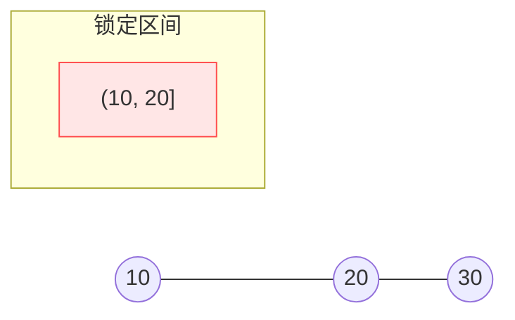
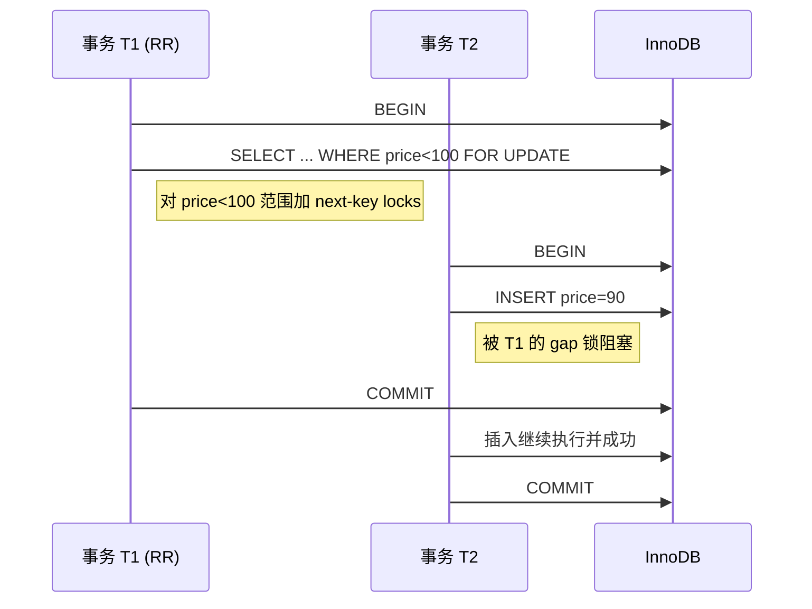

这篇是前一篇「原理篇」的 InnoDB 实战补充：不再只讲理论上的四个隔离级别，而是聚焦：

- InnoDB 实际是怎么实现隔离的？
- MySQL 的默认 Repeatable Read 跟教科书里的有什么不一样？
- gap lock / next-key lock、MVCC、Read View 这些词，跟我们日常写 SQL 有什么关系？
- 实战开发中，哪些写法会踩坑、哪些是推荐模式？

---

## 一、InnoDB 的事务与隔离配置：先看你站在哪个「地板」

### 1.1 怎么看当前隔离级别？

在 MySQL 5.7 以前：

```sql
SELECT @@tx_isolation;
```

在 MySQL 8.0：

```sql
SELECT @@transaction_isolation;
```

常见结果：

- `REPEATABLE-READ`（InnoDB 默认）
- `READ-COMMITTED`
- `READ-UNCOMMITTED`
- `SERIALIZABLE`

### 1.2 怎么设置隔离级别？

只对当前会话生效：

```sql
SET SESSION TRANSACTION ISOLATION LEVEL REPEATABLE READ;
-- 或
SET SESSION TRANSACTION ISOLATION LEVEL READ COMMITTED;
```

全局默认（谨慎修改）：

```sql
SET GLOBAL TRANSACTION ISOLATION LEVEL READ COMMITTED;
```

注意：  
修改全局默认只影响**之后新建立的连接**，已有连接不受影响。

### 1.3 autocommit 与显式事务

- `autocommit=1`（默认）：每条 SQL 语句是一个独立事务。
- 显式事务：

```sql
SET autocommit = 0;
BEGIN;  -- 或 START TRANSACTION;
-- 一系列语句
COMMIT; -- 或 ROLLBACK;
```

InnoDB 的隔离语义，都是在“事务”的边界内定义的。  
如果你从来不用显式事务，很多理论问题在实践里就会被「每条语句都是独立事务」掩盖掉。

---

## 二、InnoDB 的 MVCC：理论里的 CREATE_VERSION / DELETE_VERSION，在这里长什么样？

上一篇我们用抽象的 `CREATE_VERSION` / `DELETE_VERSION` 来理解 MVCC。  
在 InnoDB 里，真实实现是这样：

### 2.1 每行隐藏了几个列

InnoDB 在每一行记录上，额外保存了几个隐藏字段（简化版理解）：

- `DB_TRX_ID`：最后一次修改这行的事务 ID；
- `DB_ROLL_PTR`：指向 undo log 的指针，undo 链上挂着旧版本；
- `DB_ROW_ID`：如果表没有主键，用它做隐式聚簇索引主键。

可以类比到我们之前的抽象模型：

- `DB_TRX_ID` ≈ CREATE_VERSION；
- undo 链上的历史版本，带有「被谁删除」的信息 ≈ DELETE_VERSION + 历史 CREATE_VERSION。

### 2.2 版本链长什么样？

简单画一下，一行记录的版本演化：


- 最右边是最新版本（V2，事务 20 修改的结果）；
- 通过 `DB_ROLL_PTR` 可以追溯到旧版本（V1 → V0）；
- 清理（purge）线程会在确认没有事务再需要 V0 这种旧版本后，真正物理删除。

### 2.3 Read View：决定「我能看到哪些版本」的快照

核心概念：**Read View（读视图）**

- 里面记录了当时系统中**活跃事务的 ID 列表**；
- 还有几个关键值：
  - `low_limit_id`：最小未提交事务 ID；
  - `up_limit_id`：当前已分配的下一个事务 ID（上界）。

InnoDB 的可见性规则（简化）：

对一条记录的某个版本（版本上的 `DB_TRX_ID = trx_id`），在当前 Read View 下是否可见，大致规则是：

1. 如果 `trx_id < low_limit_id`：  
   表示这个版本的事务在视图创建之前就提交了 → **可见**。

2. 如果 `trx_id >= up_limit_id`：  
   这个版本在视图创建之后才启动 → **不可见**。

3. 如果 `low_limit_id <= trx_id < up_limit_id`：  
   说明这个事务在视图创建时还活着：
   - 如果 `trx_id` 在活跃事务列表里 → **不可见**；
   - 如果不在（已经提交） → **可见**。

如果当前版本不可见，就沿着 undo 链往前找，直到找到一个可见版本或者确定整条链都不可见（说明这行当时对我“不可见”，比如还没插入或已经被删了）。

这样，不用加读锁，也能做到「读出对自己来说一致的历史状态」。

### 2.4 RR 与 RC 下 Read View 有何不同？

- 在 **Repeatable Read** 隔离级别下：
  - 一个事务第一次执行快照读（普通 SELECT）时，会创建一个 Read View；
  - 整个事务后续的快照读，都共享这个 Read View → **事务级快照**。

- 在 **Read Committed** 隔离级别下：
  - 每条 SELECT 都会新建一个 Read View；
  - 每条语句看的都是「当时最新已提交」的状态 → **语句级快照**。

这就是为什么：

- InnoDB 的 RR 下，同一事务中多次 SELECT 同一记录，结果不变；
- InnoDB 的 RC 下，多次 SELECT 能读到别的事务已经提交的新值。

---

## 三、InnoDB 的两种读取方式：快照读 vs 当前读

理解 InnoDB 时，一个关键点是分清：

> - **一致性读（Consistent Read, 快照读）**
> - **当前读（Current Read, 加锁读）**

### 3.1 一致性读（快照读）

特征：

- 不加行锁、不加 gap 锁；
- 通过 Read View + MVCC，从版本链里选出对当前事务可见的版本；
- 常见语句：
  - 不带锁字句的 `SELECT`：
    ```sql
    SELECT * FROM t WHERE id = 1;
    ```

在 RR / RC 下，普通 SELECT 默认就是一致性读。

### 3.2 当前读（加锁读）

特征：

- 要读的必须是「当前最新版本」，并且我要保证后续操作的正确性，因此要加锁；
- 会在索引记录上加行锁（Record Lock）、间隙锁（Gap Lock）、next-key lock 等；
- 常见语句：
  - `SELECT ... FOR UPDATE`
  - `SELECT ... LOCK IN SHARE MODE`（MySQL 8 后建议用 `FOR SHARE`）
  - `UPDATE ... WHERE ...`
  - `DELETE ... WHERE ...`
  - 一些 `INSERT` 场景（检测唯一约束/外键等）也会加 gap 锁。

例子：

```sql
-- 快照读，不加锁，看历史视图
SELECT balance FROM account WHERE id = 1;

-- 当前读，读最新值，并锁住这行
SELECT balance FROM account WHERE id = 1 FOR UPDATE;
```

两者区别，体现在：

- 前者在 RR 下，即使别的事务改了并提交，只要你的 Read View 没变，读到的还是老值；
- 后者会阻塞/抢锁，一定要看到最新的已提交值，并且阻止别人并发修改。

---

## 四、InnoDB 锁模型：Record / Gap / Next-Key / Insert Intention

InnoDB 在索引层面实现行级锁，几种常见锁类型：

### 4.1 记录锁（Record Lock）

- 锁住索引中的**某一个具体记录**；
- 典型场景：按主键等值查询并更新：

```sql
UPDATE user SET name = 'A' WHERE id = 10;
-- 给 (id=10) 这一条聚簇索引记录加记录锁
```

### 4.2 间隙锁（Gap Lock）

- 锁住**两个索引记录之间的“空隙”**，不包括现有记录本身；
- 关键用途：阻止别人往这个间隙插入新记录，防止幻读、避免某些并发异常。

比如索引上有值：10, 20, 30  
某个查询锁住 `(10, 20)` 这个间隙，别人就不能插入 value=11,15,19 等记录。

### 4.3 Next-Key Lock（记录锁 + 间隙锁）

- InnoDB 默认在 RR 级别，搜索索引范围时使用 next-key lock；
- 表示「锁住**当前索引记录 + 之前的间隙**」这整个区间；

例如索引值：10, 20, 30  
锁住 20 这个 next-key 时，实际锁住 `(10,20]` 这个范围。

示意图：



意义是：

- 不仅当前这行（20）不能被修改；
- `(10,20)` 间隙里也不能插入新值，防止有人插入一个 15，导致范围结果集“变形”。

### 4.4 插入意向锁（Insert Intention Lock）

- 一种特殊的 gap 锁；
- 当事务准备在某个间隙里插入记录时，会在该间隙上加插入意向锁；
- 多个插入意向锁通常是兼容的，真正冲突的是“谁最终真的插入成功”。

日常你很少需要直接操心“插入意向锁”这个名词，但在分析死锁日志时经常会看到它。

---

## 五、InnoDB 各隔离级别的「实际行为」：跟教科书哪里不一样？

### 5.1 Repeatable Read（默认）：比理论里的 RR“强一点”

官方默认隔离级别：`REPEATABLE READ`

其实际行为：

1. 快照读：
   - 第一次 SELECT 时创建 Read View；
   - 之后所有快照读共用这个视图；
   - 因此快照读层面**可重复读**，且不会出现幻读（因为你始终在看同一个历史切片）。

2. 当前读：
   - 对 `SELECT ... FOR UPDATE` 等当前读，会用 next-key locks；
   - 在范围查询 + 更新/删除场景下，通过锁范围防止“幻影行”的插入；
   - 实际上，在很多有写操作的场景下，InnoDB 的 RR 接近「防幻读」。

简短对比：

- 理论 RR：不加范围锁 → **会有幻读**；
- InnoDB RR：加 next-key lock + MVCC → 大部分情况下也**避免了幻读**。

因此经常有人说：

> InnoDB 的 RR 实际隔离强度介于“传统 RR”和“Serializable”之间。

### 5.2 Read Committed：每条语句一个快照，gap 锁更少

在 InnoDB 的 RC 隔离级别下：

1. 快照读：
   - 每条 SELECT 新建 Read View；
   - 事务中多次 SELECT 可能看到别人已提交的新值 → **不可重复读**。

2. 锁策略变化：
   - InnoDB 在 RC 下**大幅减少 gap 锁使用**：
     - 普通 SELECT 基本不加 gap 锁；
     - UPDATE/DELETE 对满足条件的记录仍然会加行锁；
     - 除了外键约束检查、唯一索引检查等少数情况，gap 锁不再普遍启用；
   - 结果：在范围更新/查询场景下，更容易出现幻读，但并发性能较好。

RC 往往用于：

- 读一致性要求没有那么强；
- 但写入繁忙，希望减少锁冲突。

### 5.3 Read Uncommitted：允许脏读，少见

- InnoDB 在 RU 下：
  - 快照读会直接读“最新版本”，即便写事务尚未提交；
  - 实际上变相关闭了 MVCC 的大部分隔离保护功能；
- 几乎不会在严肃业务中使用，除非有特定需求（粗略监控/分析等）。

### 5.4 Serializable：把 SELECT 也「锁起来」

在 InnoDB 中：

- 将隔离级别设为 Serializable 后：
  - 普通 `SELECT` 也会被隐式转换为 `SELECT ... LOCK IN SHARE MODE`；
  - 事务之间几乎无法并发访问同一批数据，只能「排队」；
- 性能代价极高，仅适用于极少数强一致性场景。

---

## 六、实战案例一：InnoDB 的 RR 下，幻读还在吗？

### 6.1 只读场景：快照读下「看不到幻读」

表结构：

```sql
CREATE TABLE books (
  id INT PRIMARY KEY AUTO_INCREMENT,
  name VARCHAR(100),
  price INT,
  KEY idx_price (price)
) ENGINE=InnoDB;
```

事务 T1（RR 隔离级别）：

```sql
BEGIN;
SELECT COUNT(*) FROM books WHERE price < 100;  -- 快照读1
-- 此时 Read View 已创建
```

事务 T2：

```sql
BEGIN;
INSERT INTO books(name, price) VALUES ('新书', 90);
COMMIT;
```

事务 T1 再查一次：

```sql
SELECT COUNT(*) FROM books WHERE price < 100;  -- 快照读2
COMMIT;
```

在 InnoDB RR 下：

- 两次快照读看到的**结果相同**；
- 即使 T2 插入了 price=90 的记录，T1 也看不到 → 没有幻读。

这是因为：T1 一开始就固定了自己的 Read View，而 T2 的插入发生在 view 之后，不在 T1 的视图里。

### 6.2 带 FOR UPDATE 的当前读：用锁来防幻读

改一改 T1：

```sql
BEGIN;
SELECT * FROM books WHERE price < 100 FOR UPDATE;
-- 对 price<100 范围内的索引记录加 next-key locks
```

这时候 T2：

```sql
BEGIN;
INSERT INTO books(name, price) VALUES ('新书', 90);
-- 在 price<100 的间隙插入，会被 T1 持有的 gap/next-key 锁阻塞
COMMIT;
```

在这种情况下：

- T2 的插入会被阻塞，直到 T1 提交或回滚；
- 也就不可能产生“幻影行”。

简单时序图：



可以看到：

- 快照读：用 MVCC 避免幻读（读到的是一致快照）；
- 当前读：用 next-key 锁阻止别人插入“幻影行”。

---

## 七、实战案例二：范围更新 + 不同扫描顺序 → 死锁

常见死锁场景：

```sql
CREATE TABLE user (
  id INT PRIMARY KEY AUTO_INCREMENT,
  score INT,
  KEY idx_score(score)
) ENGINE=InnoDB;
```

事务 T1：

```sql
BEGIN;
UPDATE user SET score = score + 10 WHERE score BETWEEN 10 AND 20;
-- 假设走 idx_score，从小到大扫描，加 next-key locks
```

事务 T2：

```sql
BEGIN;
UPDATE user SET score = score + 5 WHERE score BETWEEN 15 AND 25;
-- 也走 idx_score，但具体加锁顺序可能导致交叉等待
```

如果两边扫描、锁记录的顺序不同，很容易出现：

- T1 先锁住分数 10~15 的区间；
- T2 先锁住 20~25 的区间；
- 然后：
  - T1 想去锁 15~20，但那部分被 T2 持有；
  - T2 想去锁 15~20，但另外一部分又被 T1 持有；
- InnoDB 检测到循环等待，主动回滚其中一个事务 → 死锁。

**实践建议：**

- 对范围更新/删除操作要格外小心，尽量：
  - 保证访问顺序一致（例如总是从小到大扫描）；
  - 尽量缩小范围；
  - 优先使用**等值更新**而不是大范围模糊条件；
  - 必须大范围操作时，考虑拆批处理（分段 WHERE 条件 + 多次事务）。

---

## 八、实战案例三：如何排查锁等待和死锁

### 8.1 看谁在等锁：SHOW PROCESSLIST

```sql
SHOW PROCESSLIST;
```

能看到：

- 正在执行的 SQL；
- 是否处于 `Locked` 状态；
- 等待了多久。

### 8.2 看 InnoDB 锁状态：SHOW ENGINE INNODB STATUS

```sql
SHOW ENGINE INNODB STATUS\G
```

在输出中能看到：

- 最近一次死锁的详细信息：
  - 哪两个事务；
  - 各自持有哪些锁，正在等待哪些锁；
  - 哪个被选中回滚。
- 当前锁等待情况。

这份输出比较长，实战里常做法是：

- 在应用报错日志中抓到 `Deadlock found when trying to get lock`；
- 立刻执行 `SHOW ENGINE INNODB STATUS\G`；
- 从中对应 SQL 和事务 ID，分析具体冲突源头。

### 8.3 information_schema / performance_schema

在一些版本中，还可以用：

```sql
SELECT * FROM information_schema.INNODB_TRX;
SELECT * FROM information_schema.INNODB_LOCKS;
SELECT * FROM information_schema.INNODB_LOCK_WAITS;
```

或 MySQL 8 的 performance_schema 的相关视图，来更精细地分析当前活跃事务和锁等待情况。

---

## 九、实战建议与常见坑

### 9.1 控制事务粒度：越短越好

- 不要在事务中做：
  - 网络调用；
  - 等待用户操作；
  - 长时间计算；
- 事务应该只包围「必要的几条 SQL」，越短越好。

否则锁占用时间很长，极易放大锁冲突。

### 9.2 小心 WHERE 条件 + 索引

- 对于 UPDATE/DELETE：
  - 没有合适索引 → InnoDB 可能对表全表扫描并加大量锁；
  - 有合适索引 → 锁定范围更精准，只锁必要区域。
- 常见反模式：

```sql
-- 没有给 email 建索引
UPDATE user SET status = 1 WHERE email LIKE '%@example.com';
-- 可能导致大量锁，低效且容易冲突
```

建议：

- 尽量使用可利用索引的精确/前缀条件；
- 对经常参与事务更新/删除的字段建立合适索引。

### 9.3 正确认识 autocommit

- `autocommit=1`：
  - 每条 SQL 自成一个事务；
  - 很多「事务隔离问题」直接被属性掩盖（你想象中的一整个操作，其实被拆成多次事务）。
- 如果业务逻辑天然是一个「多步的一致性操作」，一定要显式：

```sql
SET autocommit = 0;
BEGIN;
-- 多条 SQL
COMMIT;
```

并结合隔离级别 + FOR UPDATE 等控制并发行为。

### 9.4 账户类操作：先锁，再算

经典错误写法（在 RC 下尤其危险）：

```sql
BEGIN;
SELECT balance FROM account WHERE id = 1;
-- 应用层判断余额是否足够
UPDATE account SET balance = balance - 100 WHERE id = 1;
COMMIT;
```

正确写法之一（悲观锁）：

```sql
BEGIN;
SELECT balance FROM account WHERE id = 1 FOR UPDATE;
-- 在同一事务中判断并更新
UPDATE account SET balance = balance - 100 WHERE id = 1;
COMMIT;
```

或者配合乐观锁 + 版本号字段，二选一，视并发冲突概率和业务需求而定。

---

## 十、总结：把「理论篇」和「InnoDB 实战篇」连起来

在 SQL-92 理论里：

- 隔离级别通过「不同读写锁持有时间 + 是否加范围锁」来刻画；
- 幻读/不可重复读/脏读只是不同组合下的副作用。

在 InnoDB 实际实现里：

- 引入 MVCC + Read View：
  - 让大部分 SELECT 变成「无锁快照读」；
  - RR / RC 的本质区别变成**快照的生命周期**（事务级 vs 语句级）。
- 对当前读则用 Record Lock + Gap Lock + Next-Key Lock：
  - 再配合 RR / RC 的隔离策略，决定是否以及如何防止幻读。
- 结果是：
  - InnoDB 的 Repeatable Read 比教科书的 RR 要强；
  - 实战中遇到的现象（能不能看到别人新插入的数据、会不会死锁），跟你使用的读方式（快照读 vs 当前读）、索引设计、SQL 写法关系非常大。

如果你能：

1. 分清楚当前场景是在做「快照读」还是「当前读」；
2. 搞清楚自己用的是 RR 还是 RC；
3. 大致理解 InnoDB 在索引上的锁模型（Record / Gap / Next-Key）；

那么在大多数事务并发问题上，你就已经站在了正确的理解高度。遇到死锁/锁等待时，再用 `SHOW ENGINE INNODB STATUS\G` 做针对性分析，就能做到「知其所以然」，而不只是「再试一次碰运气」。