> 📝 本文将带你从零开始学习 Elasticsearch，涵盖核心概念、集群架构、查询语法到实战应用，助你快速上手这款强大的分布式搜索引擎。

---

## 一、开篇：为什么要学 Elasticsearch？

### 1.1 什么是 Elasticsearch

**Elasticsearch**（简称 ES）是一个基于 **Apache Lucene** 构建的开源、分布式、RESTful 风格的搜索和分析引擎。

用一句话概括：

> 🎯 **Elasticsearch = 分布式 + 实时搜索 + 实时分析**

它能够在海量数据中实现**毫秒级**的搜索响应，这是传统关系型数据库难以企及的。

```
┌─────────────────────────────────────────────────────────────┐
│                     Elasticsearch                            │
│  ┌─────────────┐  ┌─────────────┐  ┌─────────────────────┐  │
│  │  分布式存储  │  │  全文检索   │  │  实时数据分析        │  │
│  └─────────────┘  └─────────────┘  └─────────────────────┘  │
│                           │                                  │
│                    ┌──────▼──────┐                          │
│                    │ Apache Lucene│                          │
│                    └─────────────┘                          │
└─────────────────────────────────────────────────────────────┘
```

**举个实际例子**：

假设你在淘宝搜索"iPhone 15 Pro 手机壳"：
- 商品库有**数十亿**条数据
- 搜索结果在 **100ms 内**返回
- 还能按销量、价格、评分排序
- 同时展示品牌、价格区间等筛选项

这背后就是 Elasticsearch 在发挥作用！

---

### 1.2 ES 的发展历程与生态（ELK Stack）

#### 发展历程

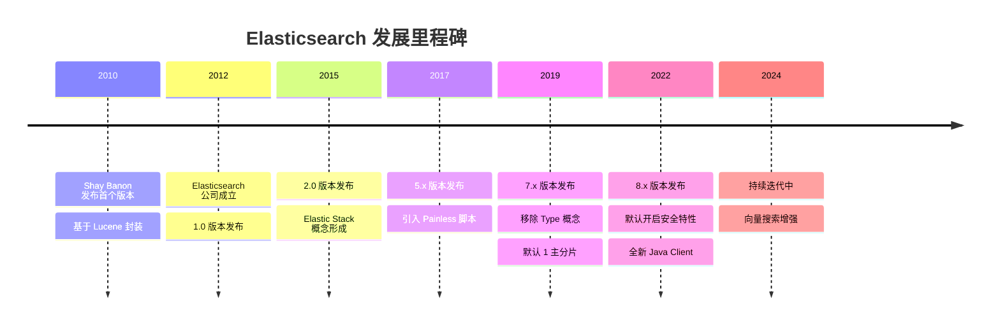

#### Elastic Stack 生态（原 ELK Stack）

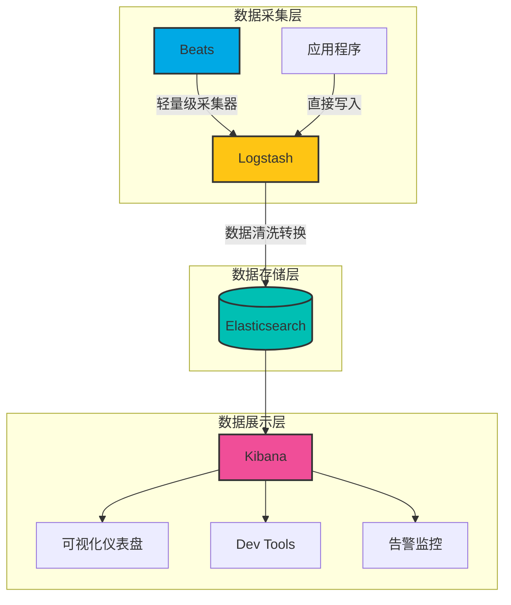

| 组件              | 作用             | 一句话描述                     |
| ----------------- | ---------------- | ------------------------------ |
| **Elasticsearch** | 存储、搜索、分析 | 核心引擎，负责数据存储和检索   |
| **Logstash**      | 数据处理管道     | ETL 工具，数据清洗转换         |
| **Kibana**        | 可视化平台       | 图表展示、查询界面、管理工具   |
| **Beats**         | 轻量级采集器     | 部署在服务器上采集日志、指标等 |

---

### 1.3 核心特性与优势

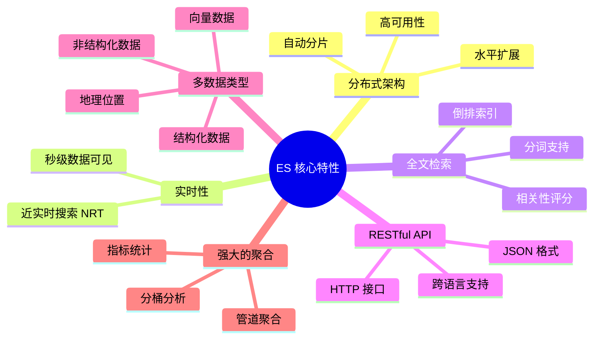

#### 核心优势详解

| 特性            | 说明                       | 优势体现                   |
| --------------- | -------------------------- | -------------------------- |
| **分布式**      | 数据自动分片存储在多个节点 | 无单点故障，支持 PB 级数据 |
| **高可用**      | 副本机制 + 自动故障转移    | 节点宕机不影响服务         |
| **近实时**      | 写入后 1 秒内可搜索        | 满足实时业务需求           |
| **Schema Free** | 支持动态映射               | 灵活应对数据结构变化       |
| **RESTful**     | 纯 HTTP + JSON 交互        | 任何语言都能轻松接入       |
| **可扩展**      | 插件机制丰富               | 自定义分词器、脚本等       |

---

### 1.4 典型应用场景

#### 场景一：全文搜索（最核心场景）

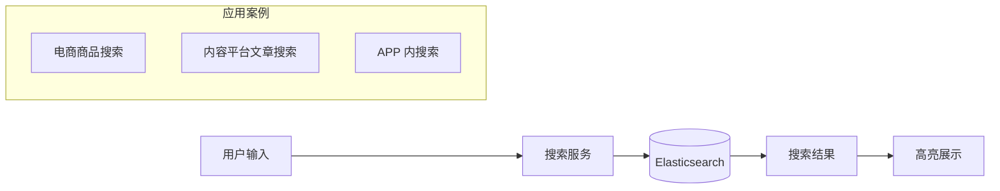

**典型案例**：
- **电商平台**：淘宝、京东的商品搜索
- **内容平台**：知乎、掘金的文章搜索
- **代码搜索**：GitHub、GitLab 的代码检索

#### 场景二：日志分析（ELK 经典场景）

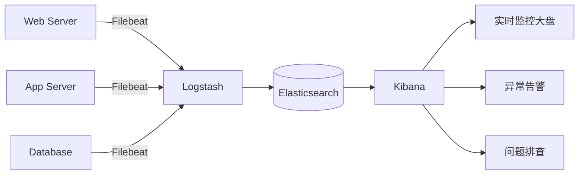

**解决的问题**：

- 分布式系统日志统一收集
- 海量日志快速检索（比 grep 快 N 倍）
- 可视化分析，快速定位问题

#### 场景三：指标监控与分析

```javascript
// 存储服务器指标数据
{
  "@timestamp": "2024-01-15T10:30:00Z",
  "host": "web-server-01",
  "cpu_usage": 75.5,
  "memory_usage": 82.3,
  "disk_io": 1024,
  "network_in": 10485760,
  "network_out": 5242880
}
```

**应用场景**：
- APM（应用性能监控）
- 基础设施监控
- 业务指标分析

#### 场景四：安全分析（SIEM）

- 安全事件收集与关联分析
- 威胁检测与告警
- 合规审计日志

---

### 1.5 ES vs 传统数据库 vs 其他搜索引擎

#### ES vs MySQL 对比

| 对比维度     | Elasticsearch     | MySQL                   |
| ------------ | ----------------- | ----------------------- |
| **数据模型** | 文档型（JSON）    | 关系型（行列）          |
| **查询语言** | Query DSL（JSON） | SQL                     |
| **全文搜索** | ⭐⭐⭐⭐⭐ 原生支持    | ⭐⭐ 需要 LIKE 或全文索引 |
| **复杂关联** | ⭐⭐ 不擅长 JOIN    | ⭐⭐⭐⭐⭐ 原生支持          |
| **事务支持** | ❌ 不支持 ACID     | ✅ 完整事务              |
| **实时性**   | 近实时（1秒延迟） | 实时                    |
| **扩展性**   | 水平扩展简单      | 垂直扩展为主            |
| **数据规模** | PB 级             | TB 级                   |

> 💡 **最佳实践**：MySQL 作为主数据库，ES 作为搜索引擎，各司其职！

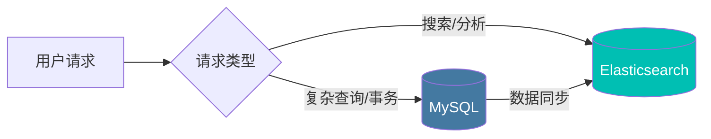

#### ES vs 其他搜索引擎

| 对比维度       | Elasticsearch | Solr           | Meilisearch |
| -------------- | ------------- | -------------- | ----------- |
| **基于**       | Lucene        | Lucene         | Rust 自研   |
| **分布式**     | 原生支持      | 需要 SolrCloud | 单机为主    |
| **实时性**     | 近实时        | 近实时         | 实时        |
| **学习曲线**   | 中等          | 较陡           | 简单        |
| **社区活跃度** | ⭐⭐⭐⭐⭐         | ⭐⭐⭐            | ⭐⭐⭐⭐        |
| **适用场景**   | 通用搜索+分析 | 传统搜索       | 轻量级搜索  |
| **中文支持**   | 插件丰富      | 插件支持       | 基础支持    |

---

## 二、核心概念：理解 ES 的世界观

> 🎯 本章是理解 Elasticsearch 的基础，务必掌握！

### 2.1 基本概念类比（与 MySQL 对比）

为了便于理解，我们先用熟悉的 MySQL 概念来类比：

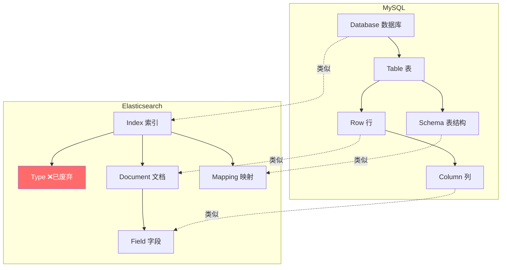

#### 概念对照表

| MySQL         | Elasticsearch      | 说明                                  |
| ------------- | ------------------ | ------------------------------------- |
| Database      | Index（索引）      | 数据的逻辑命名空间                    |
| Table         | ~~Type~~（已废弃） | 7.x 版本后移除，一个索引只有一个 Type |
| Row           | Document（文档）   | 一条数据记录，JSON 格式               |
| Column        | Field（字段）      | 文档中的一个属性                      |
| Schema        | Mapping（映射）    | 定义字段类型和属性                    |
| Index（索引） | 倒排索引           | 注意区分，ES 的"索引"是名词           |

#### 📝 示例对比

**MySQL 中的一条数据：**

```sql
-- 建表
CREATE TABLE products (
    id INT PRIMARY KEY,
    name VARCHAR(200),
    price DECIMAL(10,2),
    description TEXT
);

-- 插入数据
INSERT INTO products VALUES (1, 'iPhone 15', 7999.00, '苹果最新款手机');
```

**Elasticsearch 中的一条文档：**

```json
// PUT /products/_doc/1
{
  "id": 1,
  "name": "iPhone 15",
  "price": 7999.00,
  "description": "苹果最新款手机"
}
```

#### ⚠️ 关于 Type 的废弃说明

| ES 版本    | Type 状态                      |
| ---------- | ------------------------------ |
| 5.x 及之前 | 一个 Index 可以有多个 Type     |
| 6.x        | 一个 Index 只能有一个 Type     |
| 7.x        | Type 默认为 `_doc`，参数被废弃 |
| 8.x        | 完全移除 Type                  |

**为什么废弃？**

最初设计时，Type 类比数据库的表，但这个类比是**有问题的**：
- 不同 Type 中相同名称的字段实际上是**同一个 Lucene 字段**
- 容易造成字段类型冲突
- 增加了系统复杂度

---

### 2.2 倒排索引原理（核心！）

> 🔥 这是 Elasticsearch 能够快速搜索的核心秘密！

#### 正排索引 vs 倒排索引

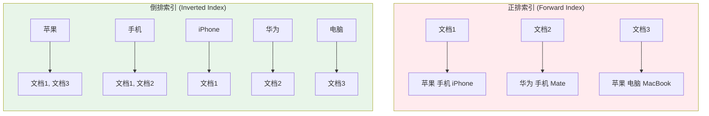

| 索引类型     | 思路                          | 适用场景           |
| ------------ | ----------------------------- | ------------------ |
| **正排索引** | 文档 → 词条（通过文档找内容） | 已知文档ID查询内容 |
| **倒排索引** | 词条 → 文档（通过内容找文档） | 搜索关键词定位文档 |

#### 倒排索引的结构

倒排索引由两部分组成：

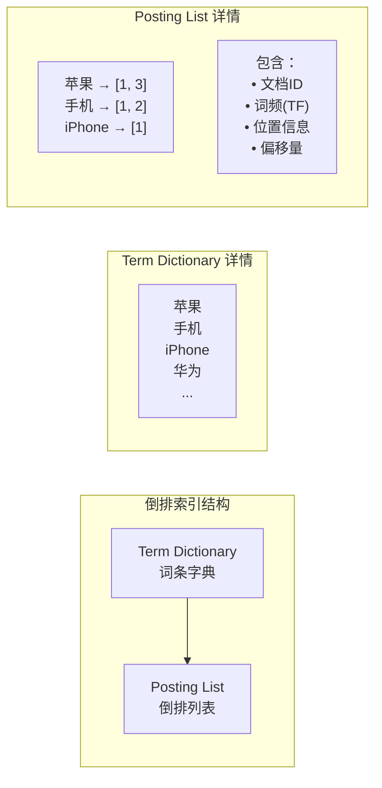

#### 完整的倒排索引示例

假设我们有以下 3 个文档：

| Doc ID | 内容                        |
| ------ | --------------------------- |
| 1      | 苹果手机 iPhone 15 非常好用 |
| 2      | 华为手机 Mate 60 性能强大   |
| 3      | 苹果电脑 MacBook Pro 很流畅 |

经过**分词**和**索引**后，生成的倒排索引：

| Term（词条） | Posting List（倒排列表）                     |
| ------------ | -------------------------------------------- |
| 苹果         | [(Doc:1, TF:1, Pos:0), (Doc:3, TF:1, Pos:0)] |
| 手机         | [(Doc:1, TF:1, Pos:1), (Doc:2, TF:1, Pos:1)] |
| iphone       | [(Doc:1, TF:1, Pos:2)]                       |
| 15           | [(Doc:1, TF:1, Pos:3)]                       |
| 华为         | [(Doc:2, TF:1, Pos:0)]                       |
| mate         | [(Doc:2, TF:1, Pos:2)]                       |
| 电脑         | [(Doc:3, TF:1, Pos:1)]                       |
| macbook      | [(Doc:3, TF:1, Pos:2)]                       |
| ...          | ...                                          |

#### 搜索过程图解

当用户搜索 **"苹果 手机"** 时：

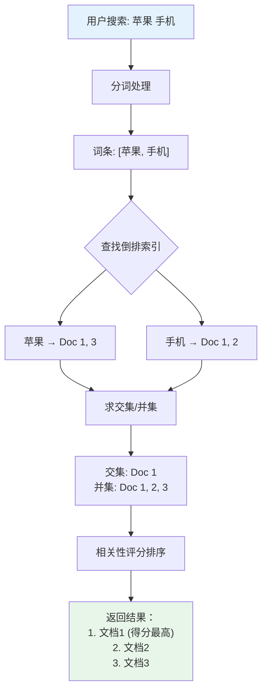

#### 倒排索引的存储优化

ES 使用了多种技术来优化倒排索引：

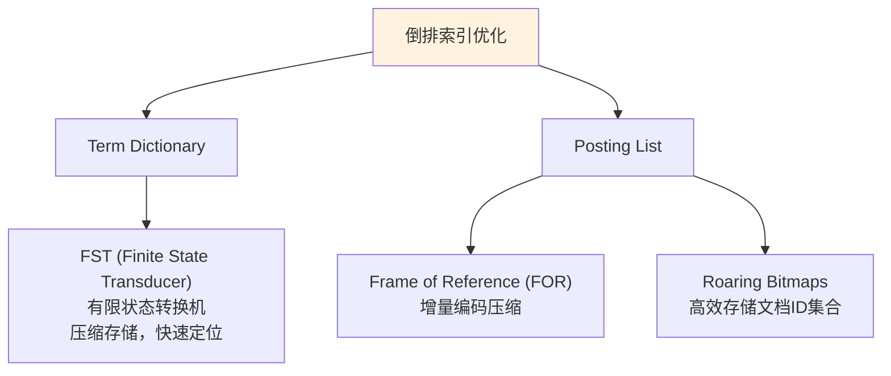

---

### 2.3 分片（Shard）与副本（Replica）

#### 为什么需要分片？

单机存储和处理能力有限，分片解决两个核心问题：

1. **水平扩展**：数据量太大，一台机器存不下
2. **性能提升**：搜索请求可以并行处理

#### 分片与副本的概念

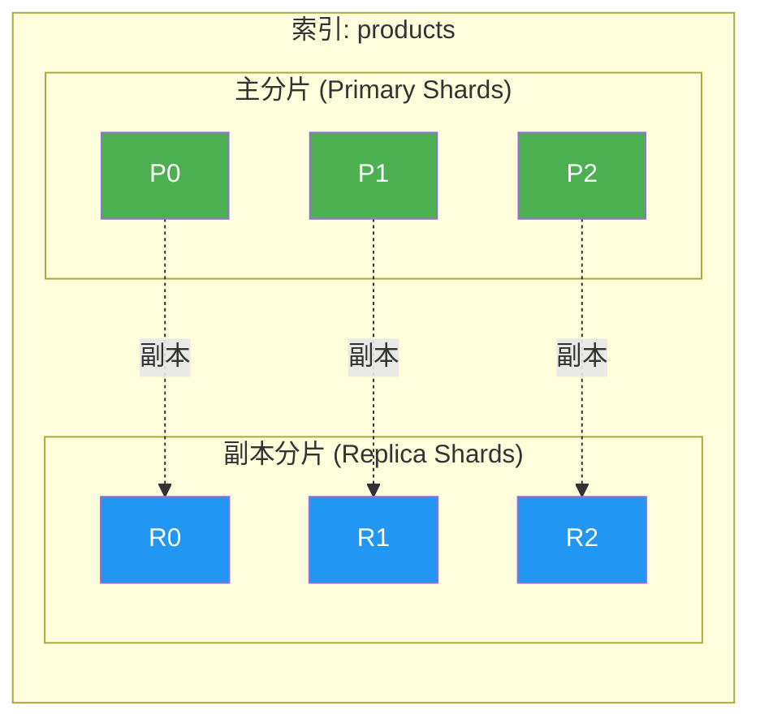

| 概念                   | 说明           | 特点                       |
| ---------------------- | -------------- | -------------------------- |
| **主分片 (Primary)**   | 数据的原始分片 | 创建后数量**不可更改**     |
| **副本分片 (Replica)** | 主分片的复制   | 数量可动态调整，提供高可用 |

#### 分片在集群中的分布

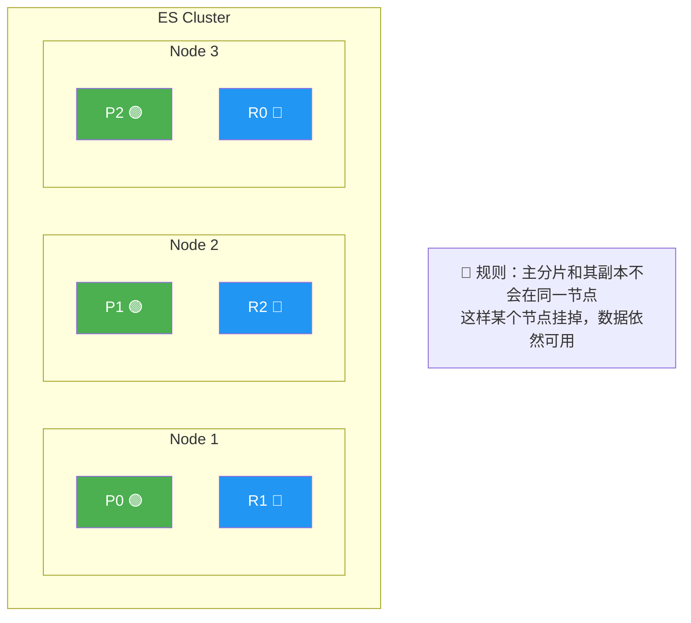

#### 创建索引时指定分片

```json
PUT /products
{
  "settings": {
    "number_of_shards": 3,      // 主分片数量（不可更改）
    "number_of_replicas": 1     // 每个主分片的副本数（可动态调整）
  }
}
```

#### 分片路由算法

文档存储在哪个分片？ES 使用公式：

```
shard = hash(routing) % number_of_primary_shards
```

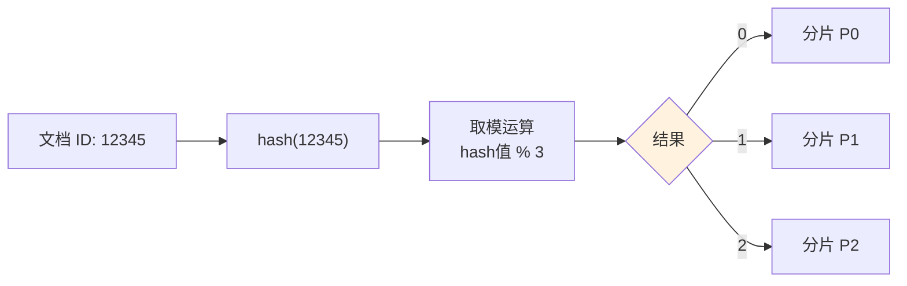

> ⚠️ **这就是为什么主分片数量创建后不能修改！** 如果修改了分片数量，路由公式结果会变化，导致找不到原来的数据。

#### 分片数量规划建议

| 场景                | 建议分片数   | 说明                    |
| ------------------- | ------------ | ----------------------- |
| 小数据量 (<1GB)     | 1 个主分片   | 避免过度分片            |
| 中等数据量 (1-50GB) | 1-5 个主分片 | 每个分片 10-50GB        |
| 大数据量 (>50GB)    | 根据容量计算 | 单个分片建议不超过 50GB |

**计算公式**：
```
主分片数 = 预估数据量 / 单分片目标大小(30-50GB)
```

---

### 2.4 文档评分机制（TF-IDF / BM25）

> 当搜索返回多个文档时，如何决定排序？答案是：**相关性评分**

#### 评分算法演进

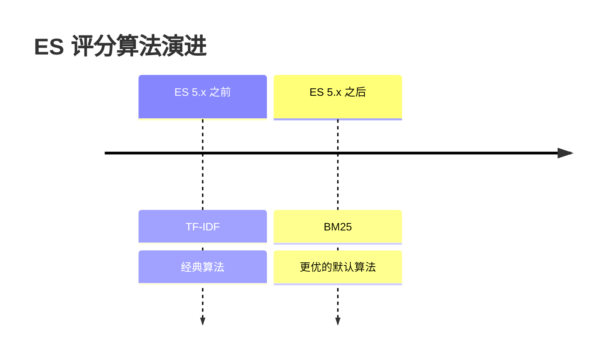

#### TF-IDF 算法

**TF-IDF = TF × IDF**

| 指标    | 全称                       | 含义                       | 计算方式               |
| ------- | -------------------------- | -------------------------- | ---------------------- |
| **TF**  | Term Frequency             | 词频：词在文档中出现的次数 | 出现次数越多，得分越高 |
| **IDF** | Inverse Document Frequency | 逆文档频率：词的稀有程度   | 越稀有的词，得分越高   |

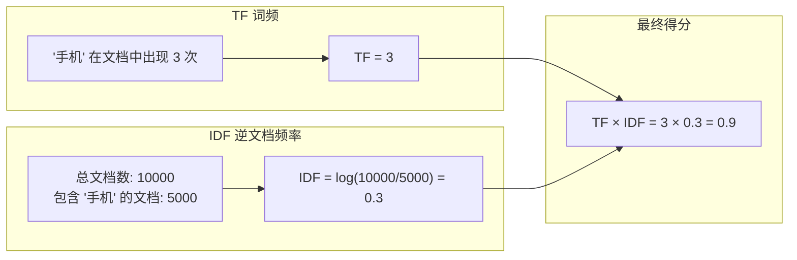

**TF-IDF 的问题**：
- 词频增加时，得分线性增长（高频词权重过高）
- 没有考虑文档长度

#### BM25 算法（ES 默认）

BM25 是 TF-IDF 的改进版本，解决了上述问题：

```
score = IDF × (TF × (k1 + 1)) / (TF + k1 × (1 - b + b × docLen/avgDocLen))
```

参数说明：
- **k1**：控制词频饱和度（默认 1.2）
- **b**：控制文档长度的影响（默认 0.75）

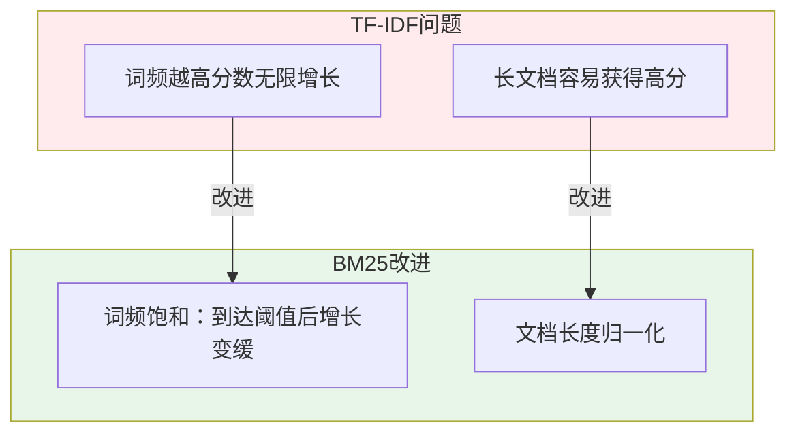

#### 查看文档评分详情

使用 `explain` 参数查看评分细节：

```json
GET /products/_search
{
  "explain": true,
  "query": {
    "match": {
      "name": "苹果手机"
    }
  }
}
```

响应结果（简化版）：

```json
{
  "hits": {
    "hits": [
      {
        "_id": "1",
        "_score": 5.123,
        "_explanation": {
          "value": 5.123,
          "description": "sum of:",
          "details": [
            {
              "value": 2.456,
              "description": "weight(name:苹果 in 0) [BM25]",
              "details": [
                {
                  "description": "idf, computed as log(1 + (N - n + 0.5) / (n + 0.5))",
                  "value": 1.234
                },
                {
                  "description": "tf, computed as freq / (freq + k1 * (1 - b + b * dl / avgdl))",
                  "value": 1.988
                }
              ]
            },
            {
              "value": 2.667,
              "description": "weight(name:手机 in 0) [BM25]"
            }
          ]
        }
      }
    ]
  }
}
```

#### 自定义评分参数

```json
PUT /my_index
{
  "settings": {
    "index": {
      "similarity": {
        "my_bm25": {
          "type": "BM25",
          "k1": 1.5,    // 调整词频饱和度
          "b": 0.5      // 调整文档长度影响
        }
      }
    }
  },
  "mappings": {
    "properties": {
      "title": {
        "type": "text",
        "similarity": "my_bm25"
      }
    }
  }
}
```

---

## 本章小结

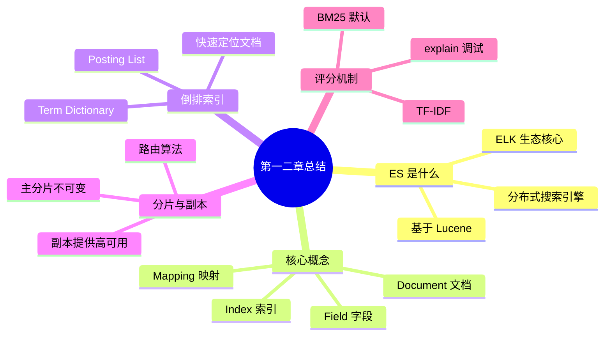

---


## 三、环境搭建：三种方式任你选

> 🎯 工欲善其事，必先利其器。本章将介绍三种 ES 环境搭建方式，推荐入门者使用 Docker 方式快速上手。

### 3.1 Docker 快速部署（推荐入门）

Docker 部署是最简单快捷的方式，几分钟即可拥有完整的 ES + Kibana 环境，非常适合学习和开发测试使用。

#### 3.1.1 前置条件

首先确保你的机器已安装 Docker 和 Docker Compose。可通过以下命令验证：

```bash
# 检查 Docker 版本
docker --version
# Docker version 24.0.7, build afdd53b

# 检查 Docker Compose 版本
docker-compose --version
# Docker Compose version v2.23.0
```

如果尚未安装，可参考 Docker 官方文档进行安装：https://docs.docker.com/get-docker/

#### 3.1.2 单节点快速启动

**方式一：直接使用 docker run 命令**

这种方式适合快速体验，一行命令即可启动：

```bash
# 创建网络，便于 ES 和 Kibana 通信
docker network create elastic

# 启动 Elasticsearch 8.x（单节点模式）
docker run -d \
  --name elasticsearch \
  --net elastic \
  -p 9200:9200 \
  -p 9300:9300 \
  -e "discovery.type=single-node" \
  -e "xpack.security.enabled=false" \
  -e "ES_JAVA_OPTS=-Xms512m -Xmx512m" \
  elasticsearch:8.11.0

# 启动 Kibana
docker run -d \
  --name kibana \
  --net elastic \
  -p 5601:5601 \
  -e "ELASTICSEARCH_HOSTS=http://elasticsearch:9200" \
  kibana:8.11.0
```

参数说明：
- `discovery.type=single-node`：单节点模式，跳过集群发现
- `xpack.security.enabled=false`：关闭安全认证（仅开发环境使用）
- `ES_JAVA_OPTS=-Xms512m -Xmx512m`：限制 JVM 堆内存，避免占用过多资源

启动后等待约 1-2 分钟，访问以下地址验证：
- Elasticsearch：http://localhost:9200
- Kibana：http://localhost:5601

#### 3.1.3 Docker Compose 部署（推荐）

相比单独的 docker run 命令，Docker Compose 更易于管理和维护。创建 `docker-compose.yml` 文件：

```yaml
version: '3.8'

services:
  elasticsearch:
    image: elasticsearch:8.11.0
    container_name: elasticsearch
    environment:
      # 单节点模式
      - discovery.type=single-node
      # 关闭安全认证（生产环境请开启）
      - xpack.security.enabled=false
      # JVM 堆内存设置（建议设置为可用内存的 50%，但不超过 32GB）
      - ES_JAVA_OPTS=-Xms1g -Xmx1g
      # 集群名称
      - cluster.name=es-docker-cluster
      # 节点名称
      - node.name=es-node-1
    ports:
      - "9200:9200"   # HTTP API 端口
      - "9300:9300"   # 节点间通信端口
    volumes:
      # 数据持久化
      - es-data:/usr/share/elasticsearch/data
      # 插件目录（如 IK 分词器）
      - es-plugins:/usr/share/elasticsearch/plugins
    networks:
      - elastic
    # 健康检查
    healthcheck:
      test: ["CMD-SHELL", "curl -f http://localhost:9200/_cluster/health || exit 1"]
      interval: 30s
      timeout: 10s
      retries: 5

  kibana:
    image: kibana:8.11.0
    container_name: kibana
    environment:
      - ELASTICSEARCH_HOSTS=http://elasticsearch:9200
      - I18N_LOCALE=zh-CN   # 中文界面
    ports:
      - "5601:5601"
    networks:
      - elastic
    depends_on:
      elasticsearch:
        condition: service_healthy

volumes:
  es-data:
    driver: local
  es-plugins:
    driver: local

networks:
  elastic:
    driver: bridge
```

启动和管理命令：

```bash
# 启动（后台运行）
docker-compose up -d

# 查看日志
docker-compose logs -f elasticsearch
docker-compose logs -f kibana

# 查看容器状态
docker-compose ps

# 停止服务
docker-compose stop

# 停止并删除容器（保留数据卷）
docker-compose down

# 停止并删除容器和数据卷（谨慎使用）
docker-compose down -v
```

#### 3.1.4 安装 IK 中文分词器

ES 默认的分词器对中文支持很差，会把中文逐字拆分。IK 分词器是最常用的中文分词插件：

```bash
# 方式一：进入容器安装
docker exec -it elasticsearch bash
./bin/elasticsearch-plugin install https://github.com/medcl/elasticsearch-analysis-ik/releases/download/v8.11.0/elasticsearch-analysis-ik-8.11.0.zip
exit

# 重启 ES 使插件生效
docker restart elasticsearch
```

```bash
# 方式二：挂载本地插件目录（推荐）
# 1. 下载插件并解压到本地 plugins 目录
mkdir -p ./plugins/ik
cd ./plugins/ik
wget https://github.com/medcl/elasticsearch-analysis-ik/releases/download/v8.11.0/elasticsearch-analysis-ik-8.11.0.zip
unzip elasticsearch-analysis-ik-8.11.0.zip

# 2. 修改 docker-compose.yml，添加挂载
volumes:
  - ./plugins:/usr/share/elasticsearch/plugins
```

验证 IK 分词器安装成功：

```bash
# 查看已安装插件
curl http://localhost:9200/_cat/plugins?v

# 测试分词效果
curl -X POST "localhost:9200/_analyze?pretty" -H 'Content-Type: application/json' -d'
{
  "analyzer": "ik_max_word",
  "text": "中华人民共和国国歌"
}'
```

#### 3.1.5 常见启动问题排查

**问题一：ES 启动后立即退出**

查看日志定位原因：
```bash
docker logs elasticsearch
```

常见原因及解决方案：

| 错误信息                                                     | 原因             | 解决方案                                 |
| ------------------------------------------------------------ | ---------------- | ---------------------------------------- |
| `max virtual memory areas vm.max_map_count [65530] is too low` | 虚拟内存设置过低 | `sudo sysctl -w vm.max_map_count=262144` |
| `Java heap space` / `OOM`                                    | 内存不足         | 减小 ES_JAVA_OPTS 中的堆内存设置         |
| `AccessDeniedException`                                      | 数据目录权限问题 | `chmod 777 ./data` 或调整挂载目录权限    |

**问题二：Kibana 无法连接 ES**

```bash
# 检查 ES 是否正常运行
curl http://localhost:9200

# 检查网络连通性
docker exec kibana curl http://elasticsearch:9200

# 确认 Kibana 配置的 ES 地址正确
docker exec kibana cat /usr/share/kibana/config/kibana.yml
```

**问题三：访问速度慢或超时**

这通常是资源不足导致的。ES 对内存要求较高，建议：
- 开发环境：至少 4GB 可用内存
- 生产环境：至少 16GB 以上

---

### 3.2 Linux 手动安装

如果需要更精细的控制，或者在生产环境部署，可以选择手动安装方式。以下以 CentOS 7 / Ubuntu 为例。

#### 3.2.1 系统环境准备

**1. 安装 JDK（ES 8.x 内置 JDK，可跳过此步）**

ES 7.x 及以上版本自带 OpenJDK，无需单独安装。如果你使用的是旧版本，需要安装 JDK 11+：

```bash
# CentOS
yum install -y java-11-openjdk java-11-openjdk-devel

# Ubuntu
apt-get install -y openjdk-11-jdk

# 验证
java -version
```

**2. 创建专用用户**

出于安全考虑，ES 不允许使用 root 用户运行，需要创建专用用户：

```bash
# 创建用户组和用户
groupadd elasticsearch
useradd -g elasticsearch -M -s /sbin/nologin elasticsearch

# 或者创建可登录的用户
useradd -g elasticsearch elasticsearch
passwd elasticsearch
```

**3. 系统参数调优**

ES 对系统参数有特定要求，需要进行以下调整：

```bash
# 1. 修改最大文件描述符数量
echo "* soft nofile 65536" >> /etc/security/limits.conf
echo "* hard nofile 65536" >> /etc/security/limits.conf

# 2. 修改最大虚拟内存区域数量（重要！）
echo "vm.max_map_count=262144" >> /etc/sysctl.conf
sysctl -p

# 3. 修改最大线程数
echo "* soft nproc 4096" >> /etc/security/limits.conf
echo "* hard nproc 4096" >> /etc/security/limits.conf

# 验证配置
ulimit -n   # 应该显示 65536
sysctl vm.max_map_count   # 应该显示 262144
```

#### 3.2.2 下载与安装

```bash
# 创建安装目录
mkdir -p /opt/elasticsearch
cd /opt/elasticsearch

# 下载 ES（以 8.11.0 为例）
wget https://artifacts.elastic.co/downloads/elasticsearch/elasticsearch-8.11.0-linux-x86_64.tar.gz

# 解压
tar -xzf elasticsearch-8.11.0-linux-x86_64.tar.gz
cd elasticsearch-8.11.0

# 修改目录所有者
chown -R elasticsearch:elasticsearch /opt/elasticsearch
```

#### 3.2.3 配置文件详解

ES 的主要配置文件位于 `config/` 目录下：

| 文件                | 作用                           |
| ------------------- | ------------------------------ |
| `elasticsearch.yml` | 主配置文件，集群、网络、路径等 |
| `jvm.options`       | JVM 参数配置，堆内存等         |
| `log4j2.properties` | 日志配置                       |

**编辑 `config/elasticsearch.yml`：**

```yaml
# ======================== 集群配置 ========================
# 集群名称，同一集群内的节点必须一致
cluster.name: my-elasticsearch

# 节点名称，集群内唯一
node.name: node-1

# ======================== 路径配置 ========================
# 数据存储路径（建议使用 SSD）
path.data: /opt/elasticsearch/data

# 日志存储路径
path.logs: /opt/elasticsearch/logs

# ======================== 网络配置 ========================
# 绑定的 IP 地址，0.0.0.0 表示允许所有 IP 访问
network.host: 0.0.0.0

# HTTP API 端口
http.port: 9200

# 节点间通信端口
transport.port: 9300

# ======================== 集群发现配置 ========================
# 单节点模式（开发测试用）
discovery.type: single-node

# 多节点集群配置（生产环境）
# discovery.seed_hosts: ["192.168.1.101", "192.168.1.102", "192.168.1.103"]
# cluster.initial_master_nodes: ["node-1", "node-2", "node-3"]

# ======================== 安全配置 ========================
# 关闭安全认证（仅开发环境！生产环境必须开启）
xpack.security.enabled: false
xpack.security.enrollment.enabled: false
xpack.security.http.ssl.enabled: false
xpack.security.transport.ssl.enabled: false

# ======================== 内存配置 ========================
# 锁定内存，防止 swap（生产环境建议开启）
# bootstrap.memory_lock: true

# ======================== 跨域配置 ========================
# 允许跨域访问（开发环境方便调试）
http.cors.enabled: true
http.cors.allow-origin: "*"
```

**编辑 `config/jvm.options`：**

```bash
# 堆内存设置（建议设置为物理内存的 50%，但不超过 32GB）
# 最小堆内存和最大堆内存设置相同，避免运行时调整
-Xms4g
-Xmx4g

# 如果内存较小，可以设置为
# -Xms1g
# -Xmx1g
```

JVM 堆内存设置原则：
1. **最小和最大设置相同**：避免运行时堆大小调整带来的性能开销
2. **不超过物理内存的 50%**：留给 Lucene 文件系统缓存
3. **不超过 32GB**：超过后无法使用压缩指针优化

#### 3.2.4 启动与验证

```bash
# 切换到 elasticsearch 用户
su - elasticsearch

# 前台启动（可查看日志，Ctrl+C 退出）
cd /opt/elasticsearch/elasticsearch-8.11.0
./bin/elasticsearch

# 后台启动（daemon 模式）
./bin/elasticsearch -d -p pid

# 查看进程
ps -ef | grep elasticsearch
# 或
cat pid

# 停止服务
kill $(cat pid)
# 或
pkill -F pid
```

验证服务是否正常：

```bash
# 检查集群健康状态
curl http://localhost:9200/_cluster/health?pretty

# 查看节点信息
curl http://localhost:9200/_cat/nodes?v

# 查看集群信息
curl http://localhost:9200
```

成功响应示例：

```json
{
  "name" : "node-1",
  "cluster_name" : "my-elasticsearch",
  "cluster_uuid" : "abc123...",
  "version" : {
    "number" : "8.11.0",
    "build_type" : "tar",
    "build_hash" : "...",
    "build_date" : "2023-11-04T10:04:57.184859352Z",
    "lucene_version" : "9.8.0",
    ...
  },
  "tagline" : "You Know, for Search"
}
```

#### 3.2.5 配置为系统服务

为了方便管理，可以将 ES 配置为 systemd 服务：

```bash
# 创建服务文件
sudo vim /etc/systemd/system/elasticsearch.service
```

```ini
[Unit]
Description=Elasticsearch
Documentation=https://www.elastic.co
Wants=network-online.target
After=network-online.target

[Service]
Type=notify
RuntimeDirectory=elasticsearch
PrivateTmp=true
Environment=ES_HOME=/opt/elasticsearch/elasticsearch-8.11.0
Environment=ES_PATH_CONF=/opt/elasticsearch/elasticsearch-8.11.0/config
Environment=PID_DIR=/var/run/elasticsearch

User=elasticsearch
Group=elasticsearch

ExecStart=/opt/elasticsearch/elasticsearch-8.11.0/bin/elasticsearch -p ${PID_DIR}/elasticsearch.pid

# 资源限制
LimitNOFILE=65535
LimitNPROC=4096
LimitAS=infinity
LimitFSIZE=infinity

# 超时设置
TimeoutStopSec=0
KillMode=process
KillSignal=SIGTERM
SendSIGKILL=no
SuccessExitStatus=143

[Install]
WantedBy=multi-user.target
```

```bash
# 重载 systemd 配置
sudo systemctl daemon-reload

# 启动服务
sudo systemctl start elasticsearch

# 开机自启
sudo systemctl enable elasticsearch

# 查看状态
sudo systemctl status elasticsearch

# 查看日志
sudo journalctl -u elasticsearch -f
```

---

### 3.3 Kibana 可视化工具安装

Kibana 是 Elastic Stack 的可视化平台，提供了丰富的功能用于数据探索、可视化和管理 ES 集群。

#### 3.3.1 安装 Kibana

**Docker 方式**（前面已介绍）

**手动安装方式**：

```bash
cd /opt/elasticsearch

# 下载 Kibana（版本需与 ES 一致）
wget https://artifacts.elastic.co/downloads/kibana/kibana-8.11.0-linux-x86_64.tar.gz

# 解压
tar -xzf kibana-8.11.0-linux-x86_64.tar.gz
cd kibana-8.11.0
```

**配置 `config/kibana.yml`**：

```yaml
# Kibana 服务端口
server.port: 5601

# 绑定的 IP 地址
server.host: "0.0.0.0"

# Kibana 服务名称
server.name: "my-kibana"

# Elasticsearch 地址
elasticsearch.hosts: ["http://localhost:9200"]

# 界面语言设置为中文
i18n.locale: "zh-CN"

# 如果 ES 开启了安全认证，需要配置用户名密码
# elasticsearch.username: "kibana_system"
# elasticsearch.password: "your_password"
```

```bash
# 启动 Kibana
./bin/kibana

# 后台启动
nohup ./bin/kibana > /dev/null 2>&1 &
```

启动后访问 http://localhost:5601 即可进入 Kibana 界面。

#### 3.3.2 Kibana 核心功能介绍

Kibana 左侧菜单包含以下主要功能模块：

| 模块                 | 功能说明                     | 使用频率 |
| -------------------- | ---------------------------- | -------- |
| **Discover**         | 数据探索，搜索和查看原始文档 | ⭐⭐⭐⭐⭐    |
| **Dashboard**        | 仪表盘，组合多个可视化图表   | ⭐⭐⭐⭐     |
| **Dev Tools**        | 开发工具，执行 REST API 请求 | ⭐⭐⭐⭐⭐    |
| **Management**       | 管理，索引模式、用户权限等   | ⭐⭐⭐⭐     |
| **Visualize**        | 可视化，创建各类图表         | ⭐⭐⭐      |
| **Canvas**           | 画布，创建动态演示文稿       | ⭐⭐       |
| **Maps**             | 地图，地理数据可视化         | ⭐⭐       |
| **Machine Learning** | 机器学习（需要许可证）       | ⭐⭐       |

#### 3.3.3 Dev Tools 使用详解

Dev Tools 是我们学习和调试 ES 最常用的工具，可以直接执行各种 ES API 请求。

进入方式：左侧菜单 → Management → Dev Tools

**基本使用方法**：

```
# 左侧输入请求，右侧显示响应
# 格式：HTTP方法 路径
# 请求体（JSON格式）

# 示例：查看集群健康状态
GET /_cluster/health

# 示例：创建索引
PUT /my_index
{
  "settings": {
    "number_of_shards": 1,
    "number_of_replicas": 0
  }
}

# 示例：插入文档
POST /my_index/_doc/1
{
  "title": "Hello Elasticsearch",
  "content": "This is my first document"
}

# 示例：搜索文档
GET /my_index/_search
{
  "query": {
    "match": {
      "title": "elasticsearch"
    }
  }
}
```

**快捷键**：
- `Ctrl + Enter` 或 点击绿色三角：执行当前请求
- `Ctrl + /`：注释/取消注释
- `Ctrl + I`：自动缩进
- `Ctrl + Space`：自动补全

**自动补全功能**：

Dev Tools 提供了强大的自动补全功能，输入时会自动提示可用的 API、参数和字段。这对于学习 ES 的各种 API 非常有帮助。

---

### 3.4 常用客户端工具推荐

除了 Kibana Dev Tools，还有一些其他工具可以帮助我们操作和管理 ES。

#### 3.4.1 命令行工具

**cURL**：最基础的命令行工具，适合脚本化操作。

```bash
# GET 请求
curl -X GET "localhost:9200/_cluster/health?pretty"

# POST 请求（带请求体）
curl -X POST "localhost:9200/my_index/_doc?pretty" \
  -H 'Content-Type: application/json' \
  -d '{"title": "Test", "content": "Hello World"}'

# PUT 请求
curl -X PUT "localhost:9200/my_index?pretty" \
  -H 'Content-Type: application/json' \
  -d '{"settings": {"number_of_shards": 1}}'

# DELETE 请求
curl -X DELETE "localhost:9200/my_index?pretty"
```

小技巧：添加 `?pretty` 参数可以格式化输出 JSON。

#### 3.4.2 可视化管理工具

**Cerebro**：轻量级的 ES 集群管理工具，功能包括集群状态查看、索引管理、分片查看等。

```bash
# Docker 启动
docker run -d --name cerebro \
  -p 9000:9000 \
  lmenezes/cerebro:0.9.4

# 访问 http://localhost:9000
# 输入 ES 地址：http://host.docker.internal:9200（Docker 环境）
# 或：http://你的IP:9200
```

**ElasticHQ**：另一个流行的 ES 管理界面。

```bash
docker run -d --name elastichq \
  -p 5000:5000 \
  elastichq/elasticsearch-hq

# 访问 http://localhost:5000
```

**Elasticvue**：现代化的 ES 管理工具，支持浏览器插件。

- Chrome/Edge 插件：在应用商店搜索 "Elasticvue" 安装
- 独立应用：https://elasticvue.com/

#### 3.4.3 工具选择建议

| 场景         | 推荐工具                          |
| ------------ | --------------------------------- |
| 日常开发调试 | Kibana Dev Tools（最方便）        |
| 脚本自动化   | cURL / HTTP 客户端库              |
| 集群运维监控 | Cerebro / Kibana Stack Monitoring |
| 快速数据浏览 | Elasticvue 浏览器插件             |

#### 3.4.4 验证环境搭建成功

完成环境搭建后，执行以下验证：

```bash
# 1. 检查 ES 状态
curl http://localhost:9200

# 2. 检查集群健康（应为 green 或 yellow）
curl http://localhost:9200/_cluster/health

# 3. 创建测试索引
curl -X PUT "localhost:9200/test_index?pretty"

# 4. 插入测试文档
curl -X POST "localhost:9200/test_index/_doc?pretty" \
  -H 'Content-Type: application/json' \
  -d '{"message": "Hello Elasticsearch!"}'

# 5. 搜索测试
curl "localhost:9200/test_index/_search?q=hello&pretty"

# 6. 删除测试索引
curl -X DELETE "localhost:9200/test_index?pretty"
```

如果以上步骤都能正常执行，恭喜你，ES 环境已经搭建成功！

---

### 本章小结

本章介绍了三种 ES 环境搭建方式：

1. **Docker 部署**：最简单快捷，推荐入门使用，几分钟即可完成
2. **Linux 手动安装**：适合生产环境，可以进行精细化配置
3. **Kibana 安装**：可视化管理平台，Dev Tools 是学习 ES 的利器

关键配置要点：
- 单节点开发环境设置 `discovery.type=single-node`
- 系统参数 `vm.max_map_count` 必须调整为 262144
- JVM 堆内存设置为物理内存的 50%，不超过 32GB
- 开发环境可关闭安全认证，生产环境必须开启

下一章，我们将学习索引管理和 Mapping 映射，开始真正操作 ES！

---


## 四、索引管理：数据的容器

> 🎯 索引（Index）是 ES 中存储数据的逻辑容器，类似于关系型数据库中的"数据库"概念。本章将详细介绍索引的创建、配置、映射以及管理技巧。

### 4.1 索引的 CRUD 操作

#### 4.1.1 创建索引

创建索引是使用 ES 的第一步。你可以创建一个空索引，也可以在创建时指定配置和映射。

**最简单的创建方式**：

```json
PUT /my_index
```

这会创建一个使用默认配置的索引：1 个主分片、1 个副本分片、动态映射。

**带配置的创建方式**：

```json
PUT /products
{
  "settings": {
    "number_of_shards": 3,
    "number_of_replicas": 1,
    "refresh_interval": "1s",
    "max_result_window": 10000
  }
}
```

settings 常用配置项说明：

| 配置项               | 默认值 | 说明                             | 是否可动态修改   |
| -------------------- | ------ | -------------------------------- | ---------------- |
| `number_of_shards`   | 1      | 主分片数量                       | ❌ 创建后不可修改 |
| `number_of_replicas` | 1      | 每个主分片的副本数               | ✅ 可动态修改     |
| `refresh_interval`   | 1s     | 刷新间隔，数据写入后多久可被搜索 | ✅ 可动态修改     |
| `max_result_window`  | 10000  | from + size 的最大值             | ✅ 可动态修改     |
| `analysis`           | -      | 自定义分析器配置                 | ❌ 创建后不可修改 |

**带配置和映射的完整创建**：

```json
PUT /products
{
  "settings": {
    "number_of_shards": 3,
    "number_of_replicas": 1
  },
  "mappings": {
    "properties": {
      "id": {
        "type": "long"
      },
      "name": {
        "type": "text",
        "analyzer": "ik_max_word",
        "search_analyzer": "ik_smart"
      },
      "price": {
        "type": "double"
      },
      "category": {
        "type": "keyword"
      },
      "create_time": {
        "type": "date",
        "format": "yyyy-MM-dd HH:mm:ss||epoch_millis"
      }
    }
  }
}
```

#### 4.1.2 查看索引信息

ES 提供了多种方式查看索引信息，从简洁的列表到详细的配置都可以获取。

**查看所有索引列表**：

```json
GET /_cat/indices?v
```

输出示例：
```
health status index    uuid                   pri rep docs.count docs.deleted store.size pri.store.size
green  open   products abc123...              3   1       1000            0      1.2mb          600kb
yellow open   logs     def456...              1   1       5000           10      5.5mb          5.5mb
```

各列含义：
- `health`：索引健康状态（green/yellow/red）
- `status`：索引状态（open/close）
- `pri`：主分片数量
- `rep`：副本数量
- `docs.count`：文档数量
- `store.size`：总存储大小（包括副本）

**查看单个索引的详细信息**：

```json
// 查看索引的完整配置（settings + mappings + aliases）
GET /products

// 只查看 settings
GET /products/_settings

// 只查看 mappings
GET /products/_mapping

// 查看索引统计信息
GET /products/_stats
```

**使用通配符查看多个索引**：

```json
// 查看所有以 log 开头的索引
GET /log*/_settings

// 查看多个指定索引
GET /products,orders/_mapping
```

#### 4.1.3 修改索引设置

索引创建后，部分配置可以动态修改，部分则不可更改。

**可动态修改的配置**：

```json
// 修改副本数量
PUT /products/_settings
{
  "number_of_replicas": 2
}

// 修改刷新间隔（批量写入时可设为 -1 禁用自动刷新以提升性能）
PUT /products/_settings
{
  "refresh_interval": "30s"
}

// 批量导入时的优化配置
PUT /products/_settings
{
  "refresh_interval": "-1",
  "number_of_replicas": 0
}

// 导入完成后恢复
PUT /products/_settings
{
  "refresh_interval": "1s",
  "number_of_replicas": 1
}
```

**不可修改的配置**（如需修改，必须重建索引）：
- `number_of_shards`：主分片数量
- `analysis`：分析器配置

#### 4.1.4 删除索引

```json
// 删除单个索引
DELETE /products

// 删除多个索引
DELETE /products,orders

// 使用通配符删除（危险操作！）
DELETE /log-2023-*

// 删除所有索引（极度危险！生产环境禁用）
DELETE /_all
DELETE /*
```

为了防止误删除，建议在 `elasticsearch.yml` 中禁用通配符删除：

```yaml
action.destructive_requires_name: true
```

#### 4.1.5 索引的打开与关闭

关闭索引可以释放资源，关闭后的索引不能读写，但数据会保留。

```json
// 关闭索引
POST /products/_close

// 打开索引
POST /products/_open

// 查看索引状态
GET /_cat/indices/products?v
```

关闭索引的应用场景：
- 历史数据归档，暂时不需要查询
- 索引出问题需要临时禁用
- 节省集群资源

---

### 4.2 Mapping 映射详解

Mapping 是 ES 中定义文档结构的方式，类似于关系型数据库的 Schema。它决定了字段如何被索引和存储。

#### 4.2.1 动态映射 vs 显式映射

**动态映射（Dynamic Mapping）**

ES 默认开启动态映射，当你写入一个新字段时，ES 会自动推断其类型并创建映射：

```json
// 直接写入文档，ES 自动创建索引和映射
POST /auto_index/_doc/1
{
  "name": "张三",
  "age": 25,
  "price": 99.9,
  "is_active": true,
  "create_time": "2024-01-15T10:30:00Z",
  "tags": ["技术", "编程"]
}

// 查看自动生成的映射
GET /auto_index/_mapping
```

自动推断的结果：
```json
{
  "auto_index": {
    "mappings": {
      "properties": {
        "name": { "type": "text", "fields": { "keyword": { "type": "keyword" } } },
        "age": { "type": "long" },
        "price": { "type": "float" },
        "is_active": { "type": "boolean" },
        "create_time": { "type": "date" },
        "tags": { "type": "text", "fields": { "keyword": { "type": "keyword" } } }
      }
    }
  }
}
```

动态映射的类型推断规则：

| JSON 类型        | ES 推断类型               |
| ---------------- | ------------------------- |
| `null`           | 不添加字段                |
| `true` / `false` | `boolean`                 |
| 浮点数字         | `float`                   |
| 整数数字         | `long`                    |
| 日期格式字符串   | `date`                    |
| 普通字符串       | `text` + `keyword` 子字段 |
| 对象             | `object`                  |
| 数组             | 取决于第一个非空元素类型  |

**动态映射的问题**：
1. 类型推断可能不准确（比如 "123" 会被识别为 text 而非数字）
2. 字符串默认创建 text 和 keyword 两种类型，浪费存储空间
3. 无法使用自定义分析器

**显式映射（Explicit Mapping）**

生产环境强烈建议使用显式映射，明确定义每个字段的类型和属性：

```json
PUT /products
{
  "mappings": {
    "properties": {
      "id": { "type": "long" },
      "name": {
        "type": "text",
        "analyzer": "ik_max_word"
      },
      "brand": { "type": "keyword" },
      "price": { "type": "scaled_float", "scaling_factor": 100 },
      "stock": { "type": "integer" },
      "on_sale": { "type": "boolean" },
      "create_time": { "type": "date" }
    }
  }
}
```

**控制动态映射行为**：

```json
PUT /strict_index
{
  "mappings": {
    "dynamic": "strict",  // 遇到新字段直接报错
    "properties": {
      "name": { "type": "text" }
    }
  }
}
```

`dynamic` 参数可选值：

| 值        | 说明                                   |
| --------- | -------------------------------------- |
| `true`    | 默认值，自动添加新字段                 |
| `false`   | 新字段可以写入但不会被索引（不能搜索） |
| `strict`  | 遇到新字段直接报错拒绝写入             |
| `runtime` | 新字段作为运行时字段（7.11+）          |

#### 4.2.2 核心数据类型详解

**1. 字符串类型：text vs keyword**

这是最容易混淆也是最重要的类型区分：

| 类型      | 是否分词 | 适用场景                       | 支持的查询              |
| --------- | -------- | ------------------------------ | ----------------------- |
| `text`    | ✅ 会分词 | 全文搜索：文章内容、商品描述   | match、match_phrase     |
| `keyword` | ❌ 不分词 | 精确匹配：状态、标签、ID、邮箱 | term、terms、排序、聚合 |

```json
PUT /blog
{
  "mappings": {
    "properties": {
      "title": {
        "type": "text",           // 全文搜索
        "analyzer": "ik_max_word", // 索引时使用的分词器
        "search_analyzer": "ik_smart" // 搜索时使用的分词器
      },
      "status": {
        "type": "keyword"          // 精确匹配
      },
      "author": {
        "type": "text",
        "fields": {
          "keyword": {             // 多字段类型
            "type": "keyword",
            "ignore_above": 256
          }
        }
      }
    }
  }
}
```

多字段类型（Multi-fields）说明：`author` 字段同时支持全文搜索（`author`）和精确匹配、聚合（`author.keyword`）。

**2. 数值类型**

| 类型           | 范围           | 存储大小              | 使用建议         |
| -------------- | -------------- | --------------------- | ---------------- |
| `byte`         | -128 ~ 127     | 1 字节                | 很小的整数       |
| `short`        | -32768 ~ 32767 | 2 字节                | 小整数           |
| `integer`      | -2^31 ~ 2^31-1 | 4 字节                | 一般整数         |
| `long`         | -2^63 ~ 2^63-1 | 8 字节                | 大整数、ID       |
| `float`        | 32位浮点       | 4 字节                | 一般精度小数     |
| `double`       | 64位浮点       | 8 字节                | 高精度小数       |
| `half_float`   | 16位浮点       | 2 字节                | 低精度小数       |
| `scaled_float` | 缩放浮点       | 取决于 scaling_factor | 价格等固定小数位 |

`scaled_float` 类型特别适合存储价格：

```json
{
  "price": {
    "type": "scaled_float",
    "scaling_factor": 100  // 存储时乘以 100，9.99 存储为 999
  }
}
```

**3. 日期类型**

```json
{
  "create_time": {
    "type": "date",
    "format": "yyyy-MM-dd HH:mm:ss||yyyy-MM-dd||epoch_millis"
  }
}
```

ES 内部会将日期转换为 UTC 时间戳（毫秒）存储，支持多种格式：
- ISO 8601：`2024-01-15T10:30:00Z`
- 自定义格式：`2024-01-15 10:30:00`
- 时间戳：`1705315800000`

**4. 布尔类型**

```json
{
  "is_active": { "type": "boolean" }
}
```

接受的值：`true`、`false`、`"true"`、`"false"`

**5. 对象类型与嵌套类型**

普通对象（object）：

```json
PUT /users
{
  "mappings": {
    "properties": {
      "name": { "type": "text" },
      "address": {
        "type": "object",
        "properties": {
          "city": { "type": "keyword" },
          "street": { "type": "text" }
        }
      }
    }
  }
}

// 写入文档
POST /users/_doc/1
{
  "name": "张三",
  "address": {
    "city": "北京",
    "street": "朝阳区建国路"
  }
}
```

对象数组的问题：

```json
// 包含对象数组的文档
POST /orders/_doc/1
{
  "order_id": "1001",
  "items": [
    { "name": "iPhone", "quantity": 1 },
    { "name": "iPad", "quantity": 2 }
  ]
}
```

ES 内部会将对象数组"扁平化"存储：
```json
{
  "items.name": ["iPhone", "iPad"],
  "items.quantity": [1, 2]
}
```

这会导致查询 `name=iPhone AND quantity=2` 能够匹配，即使实际上并没有这样的组合。

**嵌套类型（nested）解决这个问题**：

```json
PUT /orders
{
  "mappings": {
    "properties": {
      "order_id": { "type": "keyword" },
      "items": {
        "type": "nested",
        "properties": {
          "name": { "type": "keyword" },
          "quantity": { "type": "integer" }
        }
      }
    }
  }
}
```

nested 类型会将每个对象作为独立的隐藏文档存储，保持对象的完整性。

**6. 地理位置类型**

```json
PUT /shops
{
  "mappings": {
    "properties": {
      "name": { "type": "text" },
      "location": { "type": "geo_point" }
    }
  }
}

// 写入位置数据（多种格式都支持）
POST /shops/_doc/1
{
  "name": "星巴克朝阳店",
  "location": {
    "lat": 39.9042,
    "lon": 116.4074
  }
}

// 或使用数组格式 [经度, 纬度]
POST /shops/_doc/2
{
  "name": "星巴克海淀店",
  "location": [116.3074, 39.9842]
}

// 或使用字符串格式
POST /shops/_doc/3
{
  "name": "星巴克西城店",
  "location": "39.9142,116.3574"
}
```

#### 4.2.3 字段参数配置

除了类型，还可以为字段配置各种参数来控制其行为：

```json
PUT /articles
{
  "mappings": {
    "properties": {
      "title": {
        "type": "text",
        "analyzer": "ik_max_word",    // 索引分词器
        "search_analyzer": "ik_smart", // 搜索分词器
        "boost": 2.0,                  // 权重提升
        "index": true                  // 是否索引
      },
      "content": {
        "type": "text",
        "analyzer": "ik_max_word"
      },
      "author_id": {
        "type": "keyword",
        "doc_values": true,            // 用于排序和聚合
        "index": true
      },
      "internal_code": {
        "type": "keyword",
        "index": false,                // 不索引，仅存储
        "doc_values": false
      },
      "metadata": {
        "type": "object",
        "enabled": false               // 不索引不解析，原样存储
      },
      "tags": {
        "type": "keyword",
        "ignore_above": 100            // 超过 100 字符的值不索引
      }
    }
  }
}
```

常用字段参数说明：

| 参数              | 适用类型  | 说明                                |
| ----------------- | --------- | ----------------------------------- |
| `index`           | 所有      | 是否索引该字段，false 则不能搜索    |
| `doc_values`      | 非 text   | 是否启用 doc_values，用于排序和聚合 |
| `store`           | 所有      | 是否额外存储原始值                  |
| `enabled`         | object    | 是否解析对象字段                    |
| `analyzer`        | text      | 索引时使用的分词器                  |
| `search_analyzer` | text      | 搜索时使用的分词器                  |
| `boost`           | 所有      | 字段权重                            |
| `copy_to`         | 所有      | 将字段值复制到目标字段              |
| `ignore_above`    | keyword   | 超过指定长度的字符串不索引          |
| `null_value`      | 多种      | 空值的替代值                        |
| `coerce`          | 数值/布尔 | 是否强制类型转换                    |

**copy_to 的妙用**：

```json
PUT /articles
{
  "mappings": {
    "properties": {
      "title": {
        "type": "text",
        "copy_to": "full_text"
      },
      "content": {
        "type": "text",
        "copy_to": "full_text"
      },
      "full_text": {
        "type": "text"
      }
    }
  }
}
```

这样可以通过搜索 `full_text` 字段同时匹配标题和内容。

#### 4.2.4 Mapping 修改的限制与解决方案

ES 对已存在字段的 Mapping 有严格限制，以下操作是不允许的：

- ❌ 修改已有字段的类型（如 text 改为 keyword）
- ❌ 修改已有字段的分析器
- ❌ 删除已有字段

**允许的操作**：

- ✅ 添加新字段
- ✅ 为已有字段添加 `multi-fields`
- ✅ 修改 `ignore_above` 参数

**添加新字段**：

```json
PUT /products/_mapping
{
  "properties": {
    "new_field": {
      "type": "keyword"
    }
  }
}
```

**解决方案：Reindex 重建索引**

如果必须修改字段类型，只能通过重建索引的方式：

```json
// 1. 创建新索引（使用新的 Mapping）
PUT /products_v2
{
  "mappings": {
    "properties": {
      "name": { "type": "text", "analyzer": "ik_smart" },  // 修改了分析器
      "price": { "type": "double" }  // 修改了类型
    }
  }
}

// 2. 使用 Reindex API 迁移数据
POST /_reindex
{
  "source": { "index": "products" },
  "dest": { "index": "products_v2" }
}

// 3. 确认数据迁移完成后，删除旧索引
DELETE /products

// 4. 使用别名指向新索引（推荐做法，见 4.4 节）
POST /_aliases
{
  "actions": [
    { "add": { "index": "products_v2", "alias": "products" } }
  ]
}
```

---

### 4.3 索引模板（Index Template）

当你需要创建大量具有相同配置的索引时（如按日期滚动的日志索引），索引模板可以大大简化工作。

#### 4.3.1 模板的作用与应用场景

索引模板定义了一套规则：当创建的索引名称匹配某个模式时，自动应用预设的 settings 和 mappings。

典型场景：
- 日志索引：`logs-2024-01-15`、`logs-2024-01-16`...
- 按月归档：`orders-2024-01`、`orders-2024-02`...
- 多租户索引：`tenant_001_data`、`tenant_002_data`...

#### 4.3.2 创建索引模板

**传统索引模板**（ES 7.8 之前的方式，仍然支持）：

```json
PUT /_template/logs_template
{
  "index_patterns": ["logs-*"],
  "order": 1,
  "settings": {
    "number_of_shards": 3,
    "number_of_replicas": 1,
    "refresh_interval": "5s"
  },
  "mappings": {
    "properties": {
      "@timestamp": { "type": "date" },
      "level": { "type": "keyword" },
      "message": { "type": "text" },
      "host": { "type": "keyword" },
      "service": { "type": "keyword" }
    }
  },
  "aliases": {
    "logs_current": {}
  }
}
```

**可组合索引模板**（ES 7.8+ 推荐方式）：

```json
// 1. 创建组件模板 - settings
PUT /_component_template/logs_settings
{
  "template": {
    "settings": {
      "number_of_shards": 3,
      "number_of_replicas": 1
    }
  }
}

// 2. 创建组件模板 - mappings
PUT /_component_template/logs_mappings
{
  "template": {
    "mappings": {
      "properties": {
        "@timestamp": { "type": "date" },
        "level": { "type": "keyword" },
        "message": { "type": "text" },
        "host": { "type": "keyword" }
      }
    }
  }
}

// 3. 创建索引模板，组合多个组件模板
PUT /_index_template/logs_template
{
  "index_patterns": ["logs-*"],
  "priority": 100,
  "composed_of": ["logs_settings", "logs_mappings"],
  "template": {
    "aliases": {
      "logs_current": {}
    }
  }
}
```

可组合模板的优势：
- 组件可复用
- 便于维护和更新
- 更灵活的优先级控制

#### 4.3.3 模板管理操作

```json
// 查看所有索引模板
GET /_index_template

// 查看特定模板
GET /_index_template/logs_template

// 查看组件模板
GET /_component_template/logs_settings

// 删除索引模板
DELETE /_index_template/logs_template

// 删除组件模板
DELETE /_component_template/logs_settings

// 测试模板效果（模拟创建索引）
POST /_index_template/_simulate_index/logs-2024-01-15
```

#### 4.3.4 模板优先级

当多个模板匹配同一索引时，按优先级合并配置：

| 模板类型   | 优先级参数 | 说明               |
| ---------- | ---------- | ------------------ |
| 传统模板   | `order`    | 数字越大优先级越高 |
| 可组合模板 | `priority` | 数字越大优先级越高 |

可组合模板优先级高于传统模板。

---

### 4.4 索引别名（Alias）的妙用

索引别名是指向一个或多个索引的虚拟名称，是 ES 中非常实用的功能。

#### 4.4.1 别名的概念与基本操作

**创建别名**：

```json
// 创建索引时指定别名
PUT /products_v1
{
  "aliases": {
    "products": {},
    "active_products": {
      "filter": {
        "term": { "status": "active" }
      }
    }
  }
}

// 为已存在的索引添加别名
POST /_aliases
{
  "actions": [
    { "add": { "index": "products_v1", "alias": "products" } }
  ]
}
```

**查看别名**：

```json
// 查看所有别名
GET /_aliases

// 查看特定别名指向的索引
GET /_alias/products

// 查看特定索引的别名
GET /products_v1/_alias
```

**删除别名**：

```json
POST /_aliases
{
  "actions": [
    { "remove": { "index": "products_v1", "alias": "products" } }
  ]
}
```

#### 4.4.2 别名的应用场景

**场景一：零停机重建索引**

这是别名最经典的用法。当需要修改索引 Mapping 或迁移数据时，可以做到对应用透明：

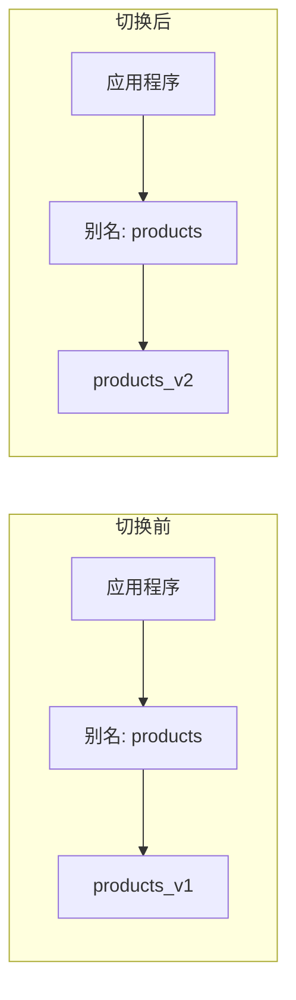

操作步骤：

```json
// 步骤 1：创建新索引
PUT /products_v2
{
  "mappings": { ... }
}

// 步骤 2：迁移数据
POST /_reindex
{
  "source": { "index": "products_v1" },
  "dest": { "index": "products_v2" }
}

// 步骤 3：原子切换别名（关键！）
POST /_aliases
{
  "actions": [
    { "remove": { "index": "products_v1", "alias": "products" } },
    { "add": { "index": "products_v2", "alias": "products" } }
  ]
}

// 步骤 4：验证无误后删除旧索引
DELETE /products_v1
```

由于别名切换是原子操作，应用程序无需做任何改动，也不会有请求失败。

**场景二：多索引聚合查询**

别名可以指向多个索引，实现跨索引查询：

```json
// 创建指向多个索引的别名
POST /_aliases
{
  "actions": [
    { "add": { "index": "logs-2024-01", "alias": "logs_recent" } },
    { "add": { "index": "logs-2024-02", "alias": "logs_recent" } },
    { "add": { "index": "logs-2024-03", "alias": "logs_recent" } }
  ]
}

// 查询时只需指定别名
GET /logs_recent/_search
{
  "query": { "match_all": {} }
}
```

**场景三：带过滤条件的别名**

别名可以附带过滤条件，实现数据视图的效果：

```json
POST /_aliases
{
  "actions": [
    {
      "add": {
        "index": "products",
        "alias": "active_products",
        "filter": {
          "term": { "status": "active" }
        }
      }
    },
    {
      "add": {
        "index": "products",
        "alias": "expensive_products",
        "filter": {
          "range": { "price": { "gte": 1000 } }
        }
      }
    }
  ]
}
```

通过 `active_products` 别名查询时，会自动过滤出 status=active 的商品。

**场景四：写入别名（is_write_index）**

当别名指向多个索引时，默认不能通过别名写入。可以指定一个索引为写入索引：

```json
POST /_aliases
{
  "actions": [
    { "add": { "index": "logs-2024-02", "alias": "logs", "is_write_index": false } },
    { "add": { "index": "logs-2024-03", "alias": "logs", "is_write_index": true } }
  ]
}

// 通过别名写入时，数据会写入 logs-2024-03
POST /logs/_doc
{
  "@timestamp": "2024-03-15T10:30:00Z",
  "message": "This is a log message"
}
```

---

## 五、文档操作：CRUD 实战

> 🎯 文档是 ES 中数据的基本单位，本章将详细介绍文档的增删改查操作。

### 5.1 新增文档

#### 5.1.1 指定 ID 创建（PUT）

使用 PUT 方法时，需要指定文档 ID：

```json
PUT /products/_doc/1
{
  "name": "iPhone 15 Pro",
  "brand": "Apple",
  "price": 9999.00,
  "category": "手机",
  "stock": 100,
  "on_sale": true,
  "tags": ["5G", "旗舰", "iOS"],
  "create_time": "2024-01-15T10:30:00Z"
}
```

响应结果：

```json
{
  "_index": "products",
  "_id": "1",
  "_version": 1,
  "result": "created",       // created 表示新建，updated 表示更新
  "_shards": {
    "total": 2,
    "successful": 2,
    "failed": 0
  },
  "_seq_no": 0,
  "_primary_term": 1
}
```

如果文档已存在，PUT 会覆盖整个文档（全量更新）。如果想防止覆盖已存在的文档，可以使用 `_create` 端点：

```json
PUT /products/_create/1
{
  "name": "iPhone 15 Pro",
  ...
}
// 如果文档 1 已存在，会返回 409 Conflict 错误
```

或者使用 `op_type` 参数：

```json
PUT /products/_doc/1?op_type=create
{
  "name": "iPhone 15 Pro",
  ...
}
```

#### 5.1.2 自动生成 ID（POST）

使用 POST 方法且不指定 ID 时，ES 会自动生成一个唯一 ID：

```json
POST /products/_doc
{
  "name": "小米14 Ultra",
  "brand": "Xiaomi",
  "price": 6499.00,
  "category": "手机"
}
```

响应结果：

```json
{
  "_index": "products",
  "_id": "a1b2c3d4e5f6...",   // 自动生成的 ID（ULID 格式）
  "_version": 1,
  "result": "created",
  ...
}
```

自动生成的 ID 是时间有序的 ULID（Universally Unique Lexicographically Sortable Identifier），长度为 20 个字符。

#### 5.1.3 批量写入（_bulk API）

`_bulk` API 是提升写入性能的关键，可以在一次请求中执行多个操作：

```json
POST /_bulk
{"index": {"_index": "products", "_id": "2"}}
{"name": "华为 Mate 60 Pro", "brand": "Huawei", "price": 6999.00, "category": "手机"}
{"index": {"_index": "products", "_id": "3"}}
{"name": "OPPO Find X7", "brand": "OPPO", "price": 4299.00, "category": "手机"}
{"create": {"_index": "products", "_id": "4"}}
{"name": "vivo X100 Pro", "brand": "vivo", "price": 4999.00, "category": "手机"}
{"update": {"_index": "products", "_id": "1"}}
{"doc": {"stock": 99}}
{"delete": {"_index": "products", "_id": "100"}}
```

_bulk 格式说明：
- 每个操作占两行（delete 除外，只需一行）
- 第一行是操作元数据（action + metadata）
- 第二行是文档数据（source）
- 每行必须以换行符结尾，包括最后一行
- 不同操作可以混合在一起

支持的操作类型：
| 操作     | 说明                 |
| -------- | -------------------- |
| `index`  | 创建或全量替换文档   |
| `create` | 仅创建，已存在则失败 |
| `update` | 部分更新             |
| `delete` | 删除文档             |

响应结果：

```json
{
  "took": 30,
  "errors": false,   // 是否有错误
  "items": [
    {
      "index": {
        "_index": "products",
        "_id": "2",
        "result": "created",
        "status": 201
      }
    },
    {
      "index": {
        "_index": "products",
        "_id": "3",
        "result": "created",
        "status": 201
      }
    },
    ...
  ]
}
```

**_bulk 使用最佳实践**：

1. **批量大小**：建议每批 1000-5000 条，或 5-15MB
2. **错误处理**：部分失败不会导致整体失败，需检查每个 item 的状态
3. **性能优化**：批量导入时可临时关闭副本和自动刷新

```json
// 导入前
PUT /products/_settings
{
  "refresh_interval": "-1",
  "number_of_replicas": 0
}

// 批量导入...

// 导入后恢复
PUT /products/_settings
{
  "refresh_interval": "1s",
  "number_of_replicas": 1
}

// 强制刷新使数据可搜索
POST /products/_refresh
```

---

### 5.2 查询文档

#### 5.2.1 根据 ID 查询单个文档

```json
GET /products/_doc/1
```

响应结果：

```json
{
  "_index": "products",
  "_id": "1",
  "_version": 1,
  "_seq_no": 0,
  "_primary_term": 1,
  "found": true,           // 是否找到
  "_source": {             // 文档原始内容
    "name": "iPhone 15 Pro",
    "brand": "Apple",
    "price": 9999.00,
    ...
  }
}
```

如果文档不存在：

```json
{
  "_index": "products",
  "_id": "999",
  "found": false
}
```

**只检查文档是否存在（不返回内容）**：

```json
HEAD /products/_doc/1
// 存在返回 200 OK
// 不存在返回 404 Not Found
```

#### 5.2.2 批量查询（_mget）

一次请求获取多个文档：

```json
// 方式一：在请求体中指定索引
GET /_mget
{
  "docs": [
    { "_index": "products", "_id": "1" },
    { "_index": "products", "_id": "2" },
    { "_index": "orders", "_id": "1001" }
  ]
}

// 方式二：在 URL 中指定索引（同一索引的多个文档）
GET /products/_mget
{
  "ids": ["1", "2", "3"]
}
```

响应结果：

```json
{
  "docs": [
    {
      "_index": "products",
      "_id": "1",
      "found": true,
      "_source": { ... }
    },
    {
      "_index": "products",
      "_id": "2",
      "found": true,
      "_source": { ... }
    },
    {
      "_index": "products",
      "_id": "999",
      "found": false
    }
  ]
}
```

#### 5.2.3 _source 字段过滤

有时我们只需要文档的部分字段，可以通过 `_source` 参数过滤：

```json
// 只返回指定字段
GET /products/_doc/1?_source=name,price

// 排除某些字段
GET /products/_doc/1?_source_excludes=tags,description

// 包含和排除组合
GET /products/_doc/1?_source_includes=name,price&_source_excludes=description

// 不返回 _source（只要元数据）
GET /products/_doc/1?_source=false

// 只返回 _source（不要元数据）
GET /products/_source/1
```

在搜索请求中同样可以使用：

```json
GET /products/_search
{
  "_source": ["name", "price", "brand"],
  "query": {
    "match_all": {}
  }
}

// 或使用对象形式
GET /products/_search
{
  "_source": {
    "includes": ["name", "price", "brand"],
    "excludes": ["description"]
  },
  "query": {
    "match_all": {}
  }
}
```

---

### 5.3 更新文档

ES 提供了多种更新文档的方式，适用于不同场景。

#### 5.3.1 全量更新（PUT）

PUT 方法会完全替换文档内容：

```json
PUT /products/_doc/1
{
  "name": "iPhone 15 Pro Max",
  "brand": "Apple",
  "price": 10999.00,
  "category": "手机",
  "stock": 50
}
```

注意：原文档中的其他字段（如 tags、on_sale）不会保留，这是**完全替换**。

#### 5.3.2 部分更新（_update）

`_update` API 只更新指定的字段，其他字段保持不变：

```json
POST /products/_update/1
{
  "doc": {
    "price": 8999.00,
    "stock": 80
  }
}
```

响应结果：

```json
{
  "_index": "products",
  "_id": "1",
  "_version": 2,
  "result": "updated",   // 如果内容没有变化，会返回 "noop"
  ...
}
```

**检测是否需要更新**：

如果提交的字段值与现有值相同，默认会返回 `noop`（no operation）。可以通过 `detect_noop` 参数控制：

```json
POST /products/_update/1
{
  "doc": {
    "price": 8999.00
  },
  "detect_noop": false   // 即使值相同也执行更新（会增加版本号）
}
```

#### 5.3.3 脚本更新（Painless Script）

对于复杂的更新逻辑，可以使用 Painless 脚本：

```json
// 简单数值操作
POST /products/_update/1
{
  "script": {
    "source": "ctx._source.stock -= params.count",
    "params": {
      "count": 1
    }
  }
}

// 添加数组元素
POST /products/_update/1
{
  "script": {
    "source": "ctx._source.tags.add(params.tag)",
    "params": {
      "tag": "热销"
    }
  }
}

// 移除数组元素
POST /products/_update/1
{
  "script": {
    "source": "ctx._source.tags.remove(ctx._source.tags.indexOf(params.tag))",
    "params": {
      "tag": "热销"
    }
  }
}

// 条件更新
POST /products/_update/1
{
  "script": {
    "source": """
      if (ctx._source.stock > 0) {
        ctx._source.stock -= 1;
        ctx._source.sales += 1;
      } else {
        ctx.op = 'noop';  // 不执行操作
      }
    """
  }
}

// 根据条件删除文档
POST /products/_update/1
{
  "script": {
    "source": """
      if (ctx._source.stock <= 0) {
        ctx.op = 'delete';
      }
    """
  }
}
```

`ctx._source` 访问文档内容，`ctx.op` 控制操作类型（index/delete/noop）。

#### 5.3.4 upsert 操作

upsert = update + insert，如果文档存在则更新，不存在则创建：

```json
POST /products/_update/999
{
  "script": {
    "source": "ctx._source.stock += params.count",
    "params": { "count": 1 }
  },
  "upsert": {
    "name": "新商品",
    "stock": 1,
    "create_time": "2024-03-15T10:00:00Z"
  }
}
```

如果文档 999 存在，执行脚本增加库存；不存在则创建 upsert 中定义的文档。

**简化的 upsert**：

```json
POST /products/_update/999
{
  "doc": {
    "name": "新商品",
    "stock": 10
  },
  "doc_as_upsert": true   // 文档不存在时，使用 doc 作为新文档
}
```

#### 5.3.5 根据查询条件更新（_update_by_query）

批量更新符合条件的文档：

```json
POST /products/_update_by_query
{
  "query": {
    "term": {
      "category": "手机"
    }
  },
  "script": {
    "source": "ctx._source.on_sale = true"
  }
}
```

可选参数：
| 参数          | 说明                                  |
| ------------- | ------------------------------------- |
| `conflicts`   | 冲突处理策略：abort（默认）或 proceed |
| `refresh`     | 更新后是否刷新索引                    |
| `scroll_size` | 每批处理的文档数，默认 1000           |
| `slices`      | 并行切片数，auto 表示自动             |

```json
// 并行更新提升性能
POST /products/_update_by_query?conflicts=proceed&slices=auto
{
  "query": { "match_all": {} },
  "script": {
    "source": "ctx._source.update_time = params.now",
    "params": { "now": "2024-03-15T12:00:00Z" }
  }
}
```

---

### 5.4 删除文档

#### 5.4.1 根据 ID 删除

```json
DELETE /products/_doc/1
```

响应结果：

```json
{
  "_index": "products",
  "_id": "1",
  "_version": 3,
  "result": "deleted",   // deleted 或 not_found
  "_shards": {
    "total": 2,
    "successful": 2,
    "failed": 0
  }
}
```

#### 5.4.2 根据查询条件删除（_delete_by_query）

```json
POST /products/_delete_by_query
{
  "query": {
    "range": {
      "create_time": {
        "lt": "2023-01-01"
      }
    }
  }
}
```

响应结果：

```json
{
  "took": 147,
  "timed_out": false,
  "total": 100,       // 符合条件的文档数
  "deleted": 100,     // 成功删除的文档数
  "batches": 1,
  "version_conflicts": 0,
  "noops": 0,
  "retries": {
    "bulk": 0,
    "search": 0
  },
  "failures": []
}
```

**异步执行大量删除**：

```json
POST /products/_delete_by_query?wait_for_completion=false
{
  "query": { "match_all": {} }
}
```

返回任务 ID，可以通过任务 API 查看进度：

```json
GET /_tasks/任务ID
```

---

### 5.5 文档版本控制与并发处理

在并发场景下，多个客户端可能同时更新同一文档，ES 提供了乐观锁机制来处理并发冲突。

#### 5.5.1 版本控制的演进

ES 的版本控制经历了几个阶段：

| 版本          | 机制           | 参数                            |
| ------------- | -------------- | ------------------------------- |
| ES 6.x 及之前 | version 版本号 | `version` + `version_type`      |
| ES 6.7+       | 序列号         | `if_seq_no` + `if_primary_term` |

目前推荐使用序列号机制（if_seq_no + if_primary_term）。

#### 5.5.2 乐观锁机制

每个文档都有两个关键元数据：
- `_seq_no`：序列号，每次文档变更时递增
- `_primary_term`：主分片任期号，主分片切换时递增

```json
// 获取文档时会返回这两个值
GET /products/_doc/1

{
  "_index": "products",
  "_id": "1",
  "_seq_no": 5,
  "_primary_term": 1,
  "_source": { ... }
}
```

**使用乐观锁更新**：

```json
// 只有当 seq_no 和 primary_term 与指定值匹配时才更新
PUT /products/_doc/1?if_seq_no=5&if_primary_term=1
{
  "name": "iPhone 15 Pro",
  "price": 8999.00
}
```

如果版本不匹配（文档已被其他请求修改），会返回 409 Conflict 错误：

```json
{
  "error": {
    "type": "version_conflict_engine_exception",
    "reason": "[1]: version conflict, required seqNo [5], primary term [1]. current document has seqNo [6] and primary term [1]"
  },
  "status": 409
}
```

#### 5.5.3 并发冲突处理流程

下面是处理并发更新的推荐流程：

```
┌──────────────────────────────────────────────────────────────────┐
│                        并发更新处理流程                          │
├──────────────────────────────────────────────────────────────────┤
│  1. 获取文档（记录 seq_no 和 primary_term）                      │
│                          ↓                                       │
│  2. 客户端修改数据                                               │
│                          ↓                                       │
│  3. 提交更新（带上 if_seq_no 和 if_primary_term）                │
│                          ↓                                       │
│  4. 检查是否成功                                                 │
│         ├── 成功：更新完成                                       │
│         └── 失败（409 Conflict）：                               │
│                    ├── 重新获取最新文档                          │
│                    ├── 合并变更                                  │
│                    └── 重试更新                                  │
└──────────────────────────────────────────────────────────────────┘
```

**代码示例（伪代码）**：

```python
def update_product_stock(product_id, delta):
    max_retries = 3
    for attempt in range(max_retries):
        # 1. 获取当前文档
        doc = es.get(index="products", id=product_id)
        seq_no = doc["_seq_no"]
        primary_term = doc["_primary_term"]
        current_stock = doc["_source"]["stock"]
        
        # 2. 计算新值
        new_stock = current_stock + delta
        
        # 3. 尝试更新
        try:
            es.update(
                index="products",
                id=product_id,
                body={"doc": {"stock": new_stock}},
                if_seq_no=seq_no,
                if_primary_term=primary_term
            )
            return True  # 成功
        except ConflictError:
            # 4. 冲突，重试
            continue
    
    return False  # 重试次数用尽
```

#### 5.5.4 外部版本控制

如果你的数据有自己的版本管理系统（如数据库中的版本字段），可以使用外部版本：

```json
PUT /products/_doc/1?version=10&version_type=external
{
  "name": "iPhone 15 Pro",
  "price": 8999.00
}
```

`version_type` 可选值：
| 值             | 说明                                     |
| -------------- | ---------------------------------------- |
| `internal`     | 默认值，使用 ES 内部版本                 |
| `external`     | 使用外部版本，提供的版本必须大于当前版本 |
| `external_gte` | 外部版本，提供的版本必须大于等于当前版本 |

#### 5.5.5 使用 retry_on_conflict 自动重试

对于简单的更新操作，可以让 ES 自动处理冲突重试：

```json
POST /products/_update/1?retry_on_conflict=3
{
  "script": {
    "source": "ctx._source.stock += params.delta",
    "params": { "delta": -1 }
  }
}
```

`retry_on_conflict=3` 表示遇到冲突时最多重试 3 次。这对于不依赖读取当前值的更新操作特别有用。

---

### 本章小结

本章详细介绍了索引和文档的操作，这是使用 ES 的基础技能：

**索引管理要点**：

1. **创建索引**时应该明确指定 settings 和 mappings
2. **Mapping 规划**要在创建索引前完成，字段类型创建后不能修改
3. **text vs keyword** 是最重要的类型区分，决定了字段能否分词搜索
4. **索引模板**适合管理大量相似结构的索引（如日志索引）
5. **索引别名**是实现零停机迁移的关键技术

**文档操作要点**：

1. **PUT 指定 ID，POST 自动生成 ID**
2. **_bulk 批量操作**显著提升写入性能
3. **部分更新用 _update**，全量更新用 PUT
4. **Painless 脚本**支持复杂的更新逻辑
5. **乐观锁机制**通过 if_seq_no + if_primary_term 处理并发冲突

下一章我们将深入学习 ES 最核心的功能——搜索查询（Query DSL）！

---


## 六、搜索进阶：Query DSL 深度解析

> 🎯 搜索是 Elasticsearch 的核心能力。Query DSL（Domain Specific Language）是 ES 提供的基于 JSON 的查询语言，功能强大且灵活。本章将深入讲解各类查询的使用方法和最佳实践。

### 6.1 搜索 API 基础

#### 6.1.1 两种搜索方式

ES 支持两种搜索方式：URI Search 和 Request Body Search。

**URI Search（简单查询）**：

将查询参数放在 URL 中，适合简单快速的查询：

```bash
# 搜索所有文档
GET /products/_search?q=*

# 搜索包含 "iPhone" 的文档
GET /products/_search?q=name:iPhone

# 多条件查询
GET /products/_search?q=name:iPhone AND price:>5000

# 指定返回字段
GET /products/_search?q=name:iPhone&_source=name,price

# 分页
GET /products/_search?q=name:手机&from=0&size=10

# 排序
GET /products/_search?q=name:手机&sort=price:desc
```

URI Search 使用 Lucene 查询语法，虽然简洁但功能有限，且特殊字符需要 URL 编码，容易出错。

**Request Body Search（推荐）**：

将查询条件放在请求体中，功能完整且结构清晰：

```json
GET /products/_search
{
  "query": {
    "match": {
      "name": "iPhone"
    }
  },
  "from": 0,
  "size": 10,
  "sort": [
    { "price": "desc" }
  ],
  "_source": ["name", "price", "brand"]
}
```

本文后续内容都使用 Request Body Search 方式。

#### 6.1.2 搜索响应结构解析

理解响应结构对于正确处理搜索结果至关重要：

```json
{
  "took": 5,                    // 查询耗时（毫秒）
  "timed_out": false,           // 是否超时
  "_shards": {                  // 分片信息
    "total": 3,                 // 总分片数
    "successful": 3,            // 成功查询的分片数
    "skipped": 0,               // 跳过的分片数
    "failed": 0                 // 失败的分片数
  },
  "hits": {                     // 命中结果
    "total": {
      "value": 100,             // 命中文档总数
      "relation": "eq"          // eq=精确值，gte=大于等于（超过10000时）
    },
    "max_score": 1.5678,        // 最高相关性得分
    "hits": [                   // 文档列表
      {
        "_index": "products",   // 索引名
        "_id": "1",             // 文档ID
        "_score": 1.5678,       // 相关性得分
        "_source": {            // 文档内容
          "name": "iPhone 15 Pro",
          "price": 9999.00
        }
      },
      // ... 更多文档
    ]
  }
}
```

关于 `hits.total` 的说明：默认情况下，当匹配文档超过 10000 条时，ES 不会精确计算总数（出于性能考虑），此时 `relation` 会返回 `gte`。如果需要精确总数：

```json
GET /products/_search
{
  "track_total_hits": true,  // 精确统计总数
  "query": { "match_all": {} }
}

// 或设置上限
{
  "track_total_hits": 100000,
  "query": { "match_all": {} }
}
```

#### 6.1.3 分页查询

ES 提供三种分页方式，适用于不同场景。

**方式一：from + size（浅分页）**

最常用的分页方式，类似于 SQL 的 LIMIT offset, size：

```json
GET /products/_search
{
  "from": 0,      // 起始位置（从0开始）
  "size": 10,     // 每页数量
  "query": { "match_all": {} }
}

// 第二页
{
  "from": 10,
  "size": 10,
  "query": { "match_all": {} }
}
```

**深分页问题**：from + size 有一个重要限制，默认 `from + size <= 10000`。这是因为 ES 需要在每个分片上获取 `from + size` 条数据，然后在协调节点上进行全局排序。假设有 5 个分片，查询第 10000 页（from=99990, size=10），每个分片需要返回 100000 条数据，总共 500000 条，会消耗大量内存和网络带宽。

虽然可以通过修改 `max_result_window` 参数突破这个限制，但强烈不建议这样做：

```json
// 不推荐！
PUT /products/_settings
{
  "max_result_window": 100000
}
```

**方式二：search_after（深分页推荐）**

search_after 使用上一页最后一条记录的排序值作为游标，避免了深分页的性能问题：

```json
// 第一页
GET /products/_search
{
  "size": 10,
  "query": { "match_all": {} },
  "sort": [
    { "create_time": "desc" },
    { "_id": "asc" }           // 必须有一个唯一字段作为 tiebreaker
  ]
}

// 假设第一页最后一条记录的排序值是 [1705315800000, "abc123"]
// 查询下一页
GET /products/_search
{
  "size": 10,
  "query": { "match_all": {} },
  "sort": [
    { "create_time": "desc" },
    { "_id": "asc" }
  ],
  "search_after": [1705315800000, "abc123"]
}
```

search_after 的特点：
- 不能跳页，只能顺序翻页
- 适合"加载更多"类型的无限滚动
- 排序必须包含唯一字段（如 _id）以确保排序稳定

**方式三：scroll（批量导出）**

scroll 适合导出大量数据，不适合实时搜索：

```json
// 初始化 scroll，设置快照保持时间
POST /products/_search?scroll=5m
{
  "size": 1000,
  "query": { "match_all": {} }
}

// 响应中包含 _scroll_id
{
  "_scroll_id": "DXF1ZXJ5QW5kRmV0Y2gBA...",
  "hits": { ... }
}

// 使用 scroll_id 获取后续数据
POST /_search/scroll
{
  "scroll": "5m",
  "scroll_id": "DXF1ZXJ5QW5kRmV0Y2gBA..."
}

// 处理完毕后清除 scroll 上下文
DELETE /_search/scroll
{
  "scroll_id": "DXF1ZXJ5QW5kRmV0Y2gBA..."
}
```

scroll 的工作原理是创建一个数据快照，后续查询都基于这个快照，因此不会看到新增或修改的数据。

**三种分页方式对比**：

| 方式         | 适用场景         | 优点           | 缺点                 |
| ------------ | ---------------- | -------------- | -------------------- |
| from + size  | 前几页数据       | 简单，支持跳页 | 深分页性能差         |
| search_after | 深分页、无限滚动 | 性能稳定       | 不能跳页             |
| scroll       | 批量数据导出     | 可处理大量数据 | 占用资源，数据非实时 |

---

### 6.2 Query Context vs Filter Context

理解这两种上下文是编写高效查询的关键。

#### 6.2.1 核心区别

ES 查询分为两种上下文：

| 对比项     | Query Context（查询上下文） | Filter Context（过滤上下文） |
| ---------- | --------------------------- | ---------------------------- |
| 核心问题   | 这个文档有多匹配？          | 这个文档是否匹配？           |
| 相关性评分 | ✅ 计算 _score               | ❌ 不计算，得分为 0           |
| 结果缓存   | ❌ 不缓存                    | ✅ 自动缓存                   |
| 性能       | 相对较慢                    | 更快                         |
| 适用场景   | 全文搜索、相关性排序        | 精确过滤、范围筛选           |

**Query Context 示例**：

```json
GET /products/_search
{
  "query": {
    "match": {
      "name": "苹果手机"
    }
  }
}
```

这个查询会计算每个匹配文档的相关性得分：包含"苹果"和"手机"的文档得分更高，只包含其中一个词的得分较低。

**Filter Context 示例**：

```json
GET /products/_search
{
  "query": {
    "bool": {
      "filter": [
        { "term": { "brand": "Apple" } },
        { "range": { "price": { "gte": 5000, "lte": 10000 } } }
      ]
    }
  }
}
```

过滤查询只关心"是否匹配"，不计算得分，且结果会被缓存，重复查询时速度更快。

#### 6.2.2 如何选择

一个简单的原则：**全文搜索用 Query，精确过滤用 Filter**。

实际业务中通常两者结合使用：

```json
GET /products/_search
{
  "query": {
    "bool": {
      "must": [
        {
          "match": {                    // Query Context：全文搜索，影响得分
            "name": "苹果手机"
          }
        }
      ],
      "filter": [                       // Filter Context：精确过滤，不影响得分
        { "term": { "status": "on_sale" } },
        { "range": { "price": { "gte": 3000, "lte": 8000 } } },
        { "term": { "category": "手机" } }
      ]
    }
  }
}
```

这个查询的逻辑是：搜索名称包含"苹果手机"的商品，同时必须是在售状态、价格在 3000-8000 之间、属于手机类别。搜索词影响排序，过滤条件只做筛选。

---

### 6.3 全文搜索查询

全文搜索是 ES 最核心的能力，会对搜索词进行分词处理，然后匹配倒排索引。

#### 6.3.1 match 查询

match 是最常用的全文搜索查询，会对输入的文本进行分词：

```json
// 基本用法
GET /products/_search
{
  "query": {
    "match": {
      "name": "苹果手机"
    }
  }
}
```

假设使用 IK 分词器，"苹果手机"会被分为["苹果", "手机"]，然后匹配包含任意一个词的文档（默认是 OR 关系）。

**控制匹配逻辑**：

```json
// 必须同时包含所有词（AND 关系）
GET /products/_search
{
  "query": {
    "match": {
      "name": {
        "query": "苹果 手机",
        "operator": "and"
      }
    }
  }
}

// 使用 minimum_should_match 控制最少匹配词数
GET /products/_search
{
  "query": {
    "match": {
      "name": {
        "query": "苹果 华为 手机 旗舰",
        "minimum_should_match": "75%"   // 至少匹配 75% 的词（3个）
      }
    }
  }
}

// minimum_should_match 也可以用数字
{
  "match": {
    "name": {
      "query": "苹果 华为 手机",
      "minimum_should_match": 2         // 至少匹配 2 个词
    }
  }
}
```

**模糊匹配（容错）**：

```json
// 允许拼写错误
GET /products/_search
{
  "query": {
    "match": {
      "name": {
        "query": "iphon",              // 少打了一个 e
        "fuzziness": "AUTO"            // 自动模糊匹配
      }
    }
  }
}
```

fuzziness 取值说明：
- `0`、`1`、`2`：允许的编辑距离
- `AUTO`：根据词长度自动设置（1-2字符不允许，3-5字符允许1次编辑，>5字符允许2次编辑）

#### 6.3.2 match_phrase 短语查询

match_phrase 要求词语按顺序出现，适合搜索固定短语：

```json
GET /articles/_search
{
  "query": {
    "match_phrase": {
      "content": "人工智能技术"
    }
  }
}
```

这个查询要求"人工"、"智能"、"技术"按顺序连续出现。

**slop 参数**：允许词之间有一定间隔

```json
GET /articles/_search
{
  "query": {
    "match_phrase": {
      "content": {
        "query": "人工智能 应用",
        "slop": 2                      // 允许中间最多间隔 2 个词
      }
    }
  }
}
```

这样可以匹配"人工智能的实际应用"（"人工智能"和"应用"之间有 2 个词）。

#### 6.3.3 multi_match 多字段查询

同时在多个字段中搜索：

```json
// 基本用法
GET /products/_search
{
  "query": {
    "multi_match": {
      "query": "苹果手机",
      "fields": ["name", "description", "brand"]
    }
  }
}

// 设置字段权重（boost）
GET /products/_search
{
  "query": {
    "multi_match": {
      "query": "苹果手机",
      "fields": ["name^3", "description^2", "brand"]   // name 权重是 brand 的 3 倍
    }
  }
}

// 使用通配符匹配字段
GET /products/_search
{
  "query": {
    "multi_match": {
      "query": "苹果手机",
      "fields": ["name", "desc*"]                      // 匹配所有 desc 开头的字段
    }
  }
}
```

**multi_match 的类型（type）**：

```json
// best_fields（默认）：取得分最高的字段
{
  "multi_match": {
    "query": "苹果手机",
    "type": "best_fields",
    "fields": ["name", "description"],
    "tie_breaker": 0.3                 // 其他字段得分的权重（0-1）
  }
}

// most_fields：累加所有字段得分
{
  "multi_match": {
    "query": "苹果手机",
    "type": "most_fields",
    "fields": ["name", "name.pinyin", "name.keyword"]
  }
}

// cross_fields：将多个字段当作一个字段处理
{
  "multi_match": {
    "query": "张三 北京",
    "type": "cross_fields",
    "fields": ["name", "address"],
    "operator": "and"
  }
}

// phrase：短语匹配
{
  "multi_match": {
    "query": "人工智能技术",
    "type": "phrase",
    "fields": ["title", "content"]
  }
}
```

type 类型对比：

| 类型            | 说明                 | 适用场景                     |
| --------------- | -------------------- | ---------------------------- |
| `best_fields`   | 取最佳匹配字段的得分 | 默认，多字段冗余存储相同内容 |
| `most_fields`   | 累加所有字段得分     | 多种分析方式的同一字段       |
| `cross_fields`  | 跨字段匹配           | 姓名+地址、标题+正文         |
| `phrase`        | 短语匹配             | 精确短语搜索                 |
| `phrase_prefix` | 短语前缀匹配         | 搜索建议                     |

#### 6.3.4 query_string 查询

query_string 支持 Lucene 查询语法，功能强大但需要注意用户输入的安全性：

```json
GET /products/_search
{
  "query": {
    "query_string": {
      "default_field": "name",
      "query": "(苹果 OR 华为) AND 手机"
    }
  }
}

// 多字段查询
GET /products/_search
{
  "query": {
    "query_string": {
      "fields": ["name", "description"],
      "query": "name:苹果 AND description:旗舰"
    }
  }
}
```

支持的语法：
- `AND`、`OR`、`NOT`：布尔运算
- `+`（必须包含）、`-`（必须不包含）
- `*`、`?`：通配符
- `~`：模糊匹配
- `"..."`：短语匹配
- `field:value`：指定字段

**simple_query_string**：更安全的版本，不会因语法错误而报错

```json
GET /products/_search
{
  "query": {
    "simple_query_string": {
      "query": "苹果 + 手机 -华为",    // + 表示必须，- 表示排除
      "fields": ["name", "description"],
      "default_operator": "AND"
    }
  }
}
```

---

### 6.4 精确值查询

精确值查询用于 keyword、数值、日期、布尔等类型的精确匹配，不会进行分词处理。

#### 6.4.1 term 查询

term 用于精确匹配单个值：

```json
// 精确匹配品牌
GET /products/_search
{
  "query": {
    "term": {
      "brand": {
        "value": "Apple"
      }
    }
  }
}

// 简写形式
GET /products/_search
{
  "query": {
    "term": {
      "brand": "Apple"
    }
  }
}
```

**常见陷阱：对 text 字段使用 term 查询**

```json
// 假设 name 是 text 类型
// 这个查询可能匹配不到任何结果！
GET /products/_search
{
  "query": {
    "term": {
      "name": "iPhone 15 Pro"
    }
  }
}
```

原因是 text 字段存储时会被分词，"iPhone 15 Pro" 会被拆分为 ["iphone", "15", "pro"]（还会转小写）。而 term 查询不会对查询词分词，直接用 "iPhone 15 Pro" 去匹配，自然找不到。

解决方案：
1. 对 text 字段使用 match 查询
2. 使用 keyword 子字段：`name.keyword`

```json
// 正确做法
GET /products/_search
{
  "query": {
    "term": {
      "name.keyword": "iPhone 15 Pro"    // 使用 keyword 子字段
    }
  }
}
```

#### 6.4.2 terms 查询

匹配多个值中的任意一个（相当于 SQL 的 IN）：

```json
GET /products/_search
{
  "query": {
    "terms": {
      "brand": ["Apple", "Huawei", "Xiaomi"]
    }
  }
}

// 也可以从另一个文档获取值（Terms Lookup）
GET /products/_search
{
  "query": {
    "terms": {
      "category": {
        "index": "user_preferences",
        "id": "user_123",
        "path": "favorite_categories"
      }
    }
  }
}
```

#### 6.4.3 range 范围查询

用于数值、日期类型的范围筛选：

```json
// 数值范围
GET /products/_search
{
  "query": {
    "range": {
      "price": {
        "gte": 1000,      // 大于等于
        "lte": 5000       // 小于等于
      }
    }
  }
}

// gt: 大于，lt: 小于，gte: 大于等于，lte: 小于等于

// 日期范围
GET /logs/_search
{
  "query": {
    "range": {
      "@timestamp": {
        "gte": "2024-01-01",
        "lt": "2024-02-01",
        "format": "yyyy-MM-dd"           // 指定日期格式
      }
    }
  }
}

// 使用日期数学表达式
GET /logs/_search
{
  "query": {
    "range": {
      "@timestamp": {
        "gte": "now-7d/d",               // 7 天前，向下取整到天
        "lt": "now/d"                    // 今天开始
      }
    }
  }
}
```

日期数学表达式说明：
- `now`：当前时间
- `+1d`、`-1d`：加减时间
- `/d`：向下取整到天
- 支持的单位：y（年）、M（月）、w（周）、d（天）、h（小时）、m（分钟）、s（秒）

```json
// 更多日期表达式示例
"gte": "now-1M/M"          // 上个月初
"lt": "now/M"              // 本月初
"gte": "2024-01-01||+1M"   // 2024年2月1日
```

#### 6.4.4 exists 查询

检查字段是否存在（非 null 且非空数组）：

```json
// 查找有 description 字段的文档
GET /products/_search
{
  "query": {
    "exists": {
      "field": "description"
    }
  }
}

// 查找没有 description 字段的文档
GET /products/_search
{
  "query": {
    "bool": {
      "must_not": {
        "exists": {
          "field": "description"
        }
      }
    }
  }
}
```

#### 6.4.5 ids 查询

根据文档 ID 查询：

```json
GET /products/_search
{
  "query": {
    "ids": {
      "values": ["1", "2", "3", "100"]
    }
  }
}
```

#### 6.4.6 prefix 和 wildcard 查询

```json
// 前缀匹配
GET /products/_search
{
  "query": {
    "prefix": {
      "name.keyword": {
        "value": "iPhone"
      }
    }
  }
}

// 通配符匹配（* 匹配多个字符，? 匹配单个字符）
GET /products/_search
{
  "query": {
    "wildcard": {
      "name.keyword": {
        "value": "iPhone*Pro"
      }
    }
  }
}
```

**注意**：prefix 和 wildcard 查询性能较差，尤其是以通配符开头的模式（如 `*phone`），应避免在大数据量场景使用。

---

### 6.5 复合查询

复合查询可以组合多个查询条件，构建复杂的查询逻辑。

#### 6.5.1 bool 查询（最常用）

bool 查询是最强大的复合查询，支持四种子句：

| 子句       | 说明                   | 是否影响得分           |
| ---------- | ---------------------- | ---------------------- |
| `must`     | 必须匹配，类似 AND     | ✅ 是                   |
| `should`   | 应该匹配，类似 OR      | ✅ 是                   |
| `must_not` | 必须不匹配，类似 NOT   | ❌ 否（Filter Context） |
| `filter`   | 必须匹配，但不计算得分 | ❌ 否（Filter Context） |

```json
// 完整示例：电商商品搜索
GET /products/_search
{
  "query": {
    "bool": {
      "must": [
        {
          "match": {
            "name": "手机"
          }
        }
      ],
      "should": [
        {
          "term": { "brand": "Apple" }
        },
        {
          "term": { "brand": "Huawei" }
        }
      ],
      "must_not": [
        {
          "term": { "status": "discontinued" }
        }
      ],
      "filter": [
        {
          "range": {
            "price": { "gte": 3000, "lte": 8000 }
          }
        },
        {
          "term": { "on_sale": true }
        }
      ],
      "minimum_should_match": 1    // should 子句至少匹配 1 个
    }
  }
}
```

这个查询的含义：
1. 名称必须包含"手机"（must）
2. 品牌最好是 Apple 或 Huawei，会提升得分（should）
3. 状态不能是已停产（must_not）
4. 价格在 3000-8000 之间，且必须在售（filter，不影响得分）

**bool 查询的嵌套**：

```json
GET /products/_search
{
  "query": {
    "bool": {
      "must": [
        {
          "bool": {
            "should": [
              { "match": { "name": "苹果" } },
              { "match": { "name": "华为" } }
            ]
          }
        }
      ],
      "filter": [
        { "term": { "category": "手机" } }
      ]
    }
  }
}
```

#### 6.5.2 boosting 查询

boosting 查询可以降低某些文档的得分，而不是完全排除：

```json
GET /products/_search
{
  "query": {
    "boosting": {
      "positive": {
        "match": { "name": "手机" }
      },
      "negative": {
        "term": { "brand": "杂牌" }
      },
      "negative_boost": 0.5            // 杂牌商品得分乘以 0.5
    }
  }
}
```

与 must_not 不同，boosting 的 negative 部分仍然会出现在结果中，只是排名靠后。

#### 6.5.3 constant_score 查询

将查询转换为 Filter Context，忽略相关性得分：

```json
GET /products/_search
{
  "query": {
    "constant_score": {
      "filter": {
        "term": { "brand": "Apple" }
      },
      "boost": 1.0                     // 固定得分
    }
  }
}
```

所有匹配的文档得分相同，适合不需要相关性排序的场景。

#### 6.5.4 dis_max 查询

dis_max（Disjunction Max）返回匹配任意子查询的文档，但只使用最佳匹配子查询的得分：

```json
GET /products/_search
{
  "query": {
    "dis_max": {
      "queries": [
        { "match": { "name": "苹果手机" } },
        { "match": { "description": "苹果手机" } }
      ],
      "tie_breaker": 0.3               // 其他匹配子查询的得分权重
    }
  }
}
```

dis_max 适合多个字段存储相似内容的场景，避免相同内容在多个字段都匹配导致得分过高。

#### 6.5.5 function_score 查询

function_score 允许自定义文档得分，是实现个性化排序的利器：

```json
GET /products/_search
{
  "query": {
    "function_score": {
      "query": {
        "match": { "name": "手机" }
      },
      "functions": [
        {
          "filter": { "term": { "is_promoted": true } },
          "weight": 2                   // 推广商品权重 x2
        },
        {
          "field_value_factor": {       // 基于字段值计算
            "field": "sales",
            "factor": 1.2,
            "modifier": "log1p",        // log(1 + sales * 1.2)
            "missing": 1
          }
        },
        {
          "gauss": {                    // 高斯衰减函数
            "create_time": {
              "origin": "now",
              "scale": "30d",
              "decay": 0.5
            }
          }
        }
      ],
      "score_mode": "sum",              // 多个函数得分如何合并
      "boost_mode": "multiply"          // 函数得分与原始得分如何结合
    }
  }
}
```

score_mode 选项：
- `multiply`：相乘（默认）
- `sum`：相加
- `avg`：平均
- `first`：使用第一个
- `max`：取最大
- `min`：取最小

boost_mode 选项：
- `multiply`：原始得分 × 函数得分（默认）
- `replace`：替换原始得分
- `sum`：相加
- `avg`：平均
- `max`：取最大
- `min`：取最小

常用的函数类型：
- `weight`：固定权重
- `field_value_factor`：基于字段值计算
- `random_score`：随机得分
- `script_score`：自定义脚本
- `decay functions`：衰减函数（gauss、linear、exp）

---

### 6.6 高亮显示（Highlighting）

高亮显示可以在搜索结果中标记匹配的关键词，方便用户快速定位。

#### 6.6.1 基本高亮

```json
GET /products/_search
{
  "query": {
    "match": { "name": "苹果手机" }
  },
  "highlight": {
    "fields": {
      "name": {}
    }
  }
}
```

响应结果：

```json
{
  "hits": {
    "hits": [
      {
        "_source": {
          "name": "苹果 iPhone 15 Pro 手机"
        },
        "highlight": {
          "name": [
            "<em>苹果</em> iPhone 15 Pro <em>手机</em>"
          ]
        }
      }
    ]
  }
}
```

默认使用 `<em>` 标签包裹匹配的词。

#### 6.6.2 自定义高亮标签

```json
GET /products/_search
{
  "query": {
    "match": { "name": "苹果手机" }
  },
  "highlight": {
    "pre_tags": ["<span class='highlight'>"],
    "post_tags": ["</span>"],
    "fields": {
      "name": {}
    }
  }
}
```

#### 6.6.3 多字段高亮

```json
GET /products/_search
{
  "query": {
    "multi_match": {
      "query": "苹果手机",
      "fields": ["name", "description"]
    }
  },
  "highlight": {
    "pre_tags": ["<em>"],
    "post_tags": ["</em>"],
    "fields": {
      "name": {
        "number_of_fragments": 0       // 返回完整字段内容
      },
      "description": {
        "fragment_size": 100,          // 每个片段的字符数
        "number_of_fragments": 3       // 返回最多 3 个片段
      }
    }
  }
}
```

#### 6.6.4 高亮器类型

ES 提供三种高亮器：

```json
GET /products/_search
{
  "query": {
    "match": { "content": "elasticsearch" }
  },
  "highlight": {
    "fields": {
      "content": {
        "type": "unified"              // unified、plain、fvh
      }
    }
  }
}
```

| 类型      | 说明             | 性能 | 准确度           |
| --------- | ---------------- | ---- | ---------------- |
| `unified` | 默认，自适应选择 | 中等 | 高               |
| `plain`   | 标准高亮器       | 慢   | 高               |
| `fvh`     | 快速向量高亮器   | 快   | 需要 term_vector |

使用 fvh 需要在 mapping 中开启 term_vector：

```json
{
  "properties": {
    "content": {
      "type": "text",
      "term_vector": "with_positions_offsets"
    }
  }
}
```

---

### 6.7 排序与相关性

#### 6.7.1 基本排序

```json
// 单字段排序
GET /products/_search
{
  "query": { "match_all": {} },
  "sort": [
    { "price": "asc" }
  ]
}

// 多字段排序
GET /products/_search
{
  "query": { "match_all": {} },
  "sort": [
    { "on_sale": "desc" },           // 先按是否在售
    { "sales": "desc" },             // 再按销量
    { "price": "asc" },              // 再按价格
    { "_score": "desc" }             // 最后按相关性得分
  ]
}
```

#### 6.7.2 处理空值

```json
GET /products/_search
{
  "query": { "match_all": {} },
  "sort": [
    {
      "price": {
        "order": "asc",
        "missing": "_last"           // 空值排在最后（_first 排在最前）
      }
    }
  ]
}
```

#### 6.7.3 基于脚本排序

```json
GET /products/_search
{
  "query": { "match_all": {} },
  "sort": [
    {
      "_script": {
        "type": "number",
        "script": {
          "source": "doc['price'].value * doc['discount'].value"
        },
        "order": "asc"
      }
    }
  ]
}
```

#### 6.7.4 地理位置排序

```json
GET /shops/_search
{
  "query": { "match_all": {} },
  "sort": [
    {
      "_geo_distance": {
        "location": {                 // geo_point 字段
          "lat": 39.9042,
          "lon": 116.4074
        },
        "order": "asc",
        "unit": "km",                 // 距离单位
        "distance_type": "plane"      // 计算方式：arc（精确）或 plane（快速）
      }
    }
  ]
}
```

#### 6.7.5 保持相关性排序的同时添加其他排序因素

一个常见需求是：先按相关性排序，但同时考虑其他因素（如新品优先、销量加成）。这时候应该用 function_score 而不是 sort：

```json
GET /products/_search
{
  "query": {
    "function_score": {
      "query": {
        "match": { "name": "手机" }
      },
      "functions": [
        {
          "gauss": {
            "create_time": {
              "origin": "now",
              "scale": "30d"
            }
          },
          "weight": 2
        },
        {
          "field_value_factor": {
            "field": "sales",
            "modifier": "log1p"
          },
          "weight": 1
        }
      ],
      "score_mode": "sum",
      "boost_mode": "sum"
    }
  }
}
```

---

## 七、聚合分析：从搜索到分析

> 🎯 聚合（Aggregations）是 ES 的另一大核心功能，可以对数据进行统计分析，实现类似 SQL 中 GROUP BY、SUM、AVG 等功能，但更加强大和灵活。

### 7.1 聚合的基本概念

#### 7.1.1 什么是聚合

聚合允许你对搜索结果进行统计分析，而不仅仅是返回文档列表。例如：

- 统计各品牌的商品数量
- 计算商品的平均价格
- 按价格区间分组统计
- 分析销量随时间的变化趋势

#### 7.1.2 聚合的分类

ES 的聚合分为四大类：

| 类型                      | 说明                           | 典型示例                        |
| ------------------------- | ------------------------------ | ------------------------------- |
| **Bucket Aggregations**   | 分桶聚合，类似 GROUP BY        | terms、range、date_histogram    |
| **Metric Aggregations**   | 指标聚合，数学计算             | avg、sum、max、min、cardinality |
| **Pipeline Aggregations** | 管道聚合，对其他聚合结果再计算 | 求导、移动平均、累计求和        |
| **Matrix Aggregations**   | 矩阵聚合，多字段统计           | matrix_stats                    |

#### 7.1.3 聚合的基本语法

```json
GET /products/_search
{
  "size": 0,                           // 不返回文档，只返回聚合结果
  "query": {                           // 可选：先过滤数据
    "match": { "category": "手机" }
  },
  "aggs": {                            // 或 "aggregations"
    "聚合名称": {                       // 自定义名称
      "聚合类型": {                     // 如 terms、avg 等
        "field": "字段名"
        // 其他参数
      },
      "aggs": {                        // 可选：嵌套子聚合
        // ...
      }
    }
  }
}
```

---

### 7.2 指标聚合（Metric Aggregations）

指标聚合用于计算数值统计，如平均值、总和、最大最小值等。

#### 7.2.1 单值指标聚合

这些聚合返回单个数值：

```json
// 平均值
GET /products/_search
{
  "size": 0,
  "aggs": {
    "avg_price": {
      "avg": { "field": "price" }
    }
  }
}

// 响应
{
  "aggregations": {
    "avg_price": {
      "value": 4599.5
    }
  }
}
```

```json
// 总和
{
  "aggs": {
    "total_sales": {
      "sum": { "field": "sales" }
    }
  }
}

// 最大值
{
  "aggs": {
    "max_price": {
      "max": { "field": "price" }
    }
  }
}

// 最小值
{
  "aggs": {
    "min_price": {
      "min": { "field": "price" }
    }
  }
}

// 文档数量
{
  "aggs": {
    "doc_count": {
      "value_count": { "field": "id" }
    }
  }
}
```

#### 7.2.2 stats 和 extended_stats

一次性获取多个统计值：

```json
GET /products/_search
{
  "size": 0,
  "aggs": {
    "price_stats": {
      "stats": { "field": "price" }
    }
  }
}

// 响应
{
  "aggregations": {
    "price_stats": {
      "count": 100,
      "min": 999.0,
      "max": 12999.0,
      "avg": 4599.5,
      "sum": 459950.0
    }
  }
}
```

extended_stats 还包括方差、标准差等：

```json
{
  "aggs": {
    "price_extended_stats": {
      "extended_stats": { "field": "price" }
    }
  }
}

// 响应包含更多统计信息
{
  "aggregations": {
    "price_extended_stats": {
      "count": 100,
      "min": 999.0,
      "max": 12999.0,
      "avg": 4599.5,
      "sum": 459950.0,
      "sum_of_squares": 2.5E9,
      "variance": 8500000.0,
      "variance_population": 8500000.0,
      "variance_sampling": 8585858.5,
      "std_deviation": 2915.5,
      "std_deviation_population": 2915.5,
      "std_deviation_sampling": 2930.2,
      "std_deviation_bounds": {
        "upper": 10430.5,
        "lower": -1231.5
      }
    }
  }
}
```

#### 7.2.3 cardinality 基数统计

统计字段的唯一值数量（类似 SQL 的 COUNT DISTINCT）：

```json
GET /orders/_search
{
  "size": 0,
  "aggs": {
    "unique_customers": {
      "cardinality": {
        "field": "customer_id",
        "precision_threshold": 3000    // 精度阈值，越高越准确但消耗更多内存
      }
    }
  }
}

// 响应
{
  "aggregations": {
    "unique_customers": {
      "value": 1523
    }
  }
}
```

cardinality 使用 HyperLogLog++ 算法，是近似值而非精确值，但内存占用很低。precision_threshold 默认 3000，值越高精度越高。

#### 7.2.4 percentiles 百分位数

```json
GET /products/_search
{
  "size": 0,
  "aggs": {
    "price_percentiles": {
      "percentiles": {
        "field": "price",
        "percents": [25, 50, 75, 90, 99]
      }
    }
  }
}

// 响应
{
  "aggregations": {
    "price_percentiles": {
      "values": {
        "25.0": 2499.0,
        "50.0": 3999.0,
        "75.0": 5999.0,
        "90.0": 8999.0,
        "99.0": 11999.0
      }
    }
  }
}
```

还有 percentile_ranks（百分位排名），查询某个值在什么百分位：

```json
{
  "aggs": {
    "price_ranks": {
      "percentile_ranks": {
        "field": "price",
        "values": [3000, 5000, 8000]
      }
    }
  }
}

// 响应：3000 元在约 30% 的位置，5000 元在约 60% 的位置
{
  "values": {
    "3000.0": 30.5,
    "5000.0": 60.2,
    "8000.0": 85.7
  }
}
```

#### 7.2.5 top_hits 获取每组的具体文档

通常与桶聚合配合使用，获取每个桶中的 TOP N 文档：

```json
GET /products/_search
{
  "size": 0,
  "aggs": {
    "by_brand": {
      "terms": { "field": "brand" },
      "aggs": {
        "top_products": {
          "top_hits": {
            "size": 3,
            "sort": [{ "sales": "desc" }],
            "_source": ["name", "price", "sales"]
          }
        }
      }
    }
  }
}
```

---

### 7.3 桶聚合（Bucket Aggregations）

桶聚合将文档分组到不同的桶中，类似 SQL 的 GROUP BY。

#### 7.3.1 terms 分组聚合

按字段值分组，类似 SQL 的 `GROUP BY field`：

```json
GET /products/_search
{
  "size": 0,
  "aggs": {
    "by_brand": {
      "terms": {
        "field": "brand",
        "size": 10,                    // 返回前 10 个桶
        "order": { "_count": "desc" }  // 按文档数量排序
      }
    }
  }
}

// 响应
{
  "aggregations": {
    "by_brand": {
      "doc_count_error_upper_bound": 0,
      "sum_other_doc_count": 150,       // 其他未展示的桶的文档数
      "buckets": [
        { "key": "Apple", "doc_count": 200 },
        { "key": "Huawei", "doc_count": 180 },
        { "key": "Xiaomi", "doc_count": 150 },
        // ...
      ]
    }
  }
}
```

**terms 聚合的精度问题**：

在分布式环境中，terms 聚合的结果是近似的。每个分片返回自己的 TOP N，协调节点合并后可能不精确。可以通过增加 `shard_size` 提高精度：

```json
{
  "aggs": {
    "by_brand": {
      "terms": {
        "field": "brand",
        "size": 10,
        "shard_size": 30              // 每个分片返回 30 个，默认是 size * 1.5 + 10
      }
    }
  }
}
```

**其他排序方式**：

```json
{
  "aggs": {
    "by_brand": {
      "terms": {
        "field": "brand",
        "order": [
          { "avg_price": "desc" },    // 按子聚合的值排序
          { "_count": "desc" }
        ]
      },
      "aggs": {
        "avg_price": {
          "avg": { "field": "price" }
        }
      }
    }
  }
}
```

#### 7.3.2 range 范围分桶

按数值范围分组：

```json
GET /products/_search
{
  "size": 0,
  "aggs": {
    "price_ranges": {
      "range": {
        "field": "price",
        "ranges": [
          { "key": "便宜", "to": 2000 },
          { "key": "中等", "from": 2000, "to": 5000 },
          { "key": "较贵", "from": 5000, "to": 10000 },
          { "key": "昂贵", "from": 10000 }
        ]
      }
    }
  }
}

// 响应
{
  "aggregations": {
    "price_ranges": {
      "buckets": [
        { "key": "便宜", "to": 2000.0, "doc_count": 50 },
        { "key": "中等", "from": 2000.0, "to": 5000.0, "doc_count": 120 },
        { "key": "较贵", "from": 5000.0, "to": 10000.0, "doc_count": 80 },
        { "key": "昂贵", "from": 10000.0, "doc_count": 30 }
      ]
    }
  }
}
```

注意：范围是左闭右开的，`from` 包含，`to` 不包含。

#### 7.3.3 date_range 日期范围分桶

```json
GET /orders/_search
{
  "size": 0,
  "aggs": {
    "order_periods": {
      "date_range": {
        "field": "create_time",
        "format": "yyyy-MM-dd",
        "ranges": [
          { "key": "上周", "from": "now-2w/w", "to": "now-1w/w" },
          { "key": "本周", "from": "now-1w/w", "to": "now/w" },
          { "key": "今天", "from": "now/d", "to": "now" }
        ]
      }
    }
  }
}
```

#### 7.3.4 histogram 直方图

按固定间隔分桶：

```json
GET /products/_search
{
  "size": 0,
  "aggs": {
    "price_histogram": {
      "histogram": {
        "field": "price",
        "interval": 1000,              // 每 1000 元一个桶
        "min_doc_count": 0,            // 即使为空也显示桶
        "extended_bounds": {           // 扩展桶的范围
          "min": 0,
          "max": 10000
        }
      }
    }
  }
}

// 响应
{
  "aggregations": {
    "price_histogram": {
      "buckets": [
        { "key": 0.0, "doc_count": 10 },
        { "key": 1000.0, "doc_count": 25 },
        { "key": 2000.0, "doc_count": 40 },
        { "key": 3000.0, "doc_count": 55 },
        // ...
      ]
    }
  }
}
```

#### 7.3.5 date_histogram 日期直方图

这是数据可视化中最常用的聚合之一：

```json
GET /orders/_search
{
  "size": 0,
  "aggs": {
    "orders_over_time": {
      "date_histogram": {
        "field": "create_time",
        "calendar_interval": "month",   // 按月分组
        "format": "yyyy-MM",
        "min_doc_count": 0,
        "extended_bounds": {
          "min": "2024-01-01",
          "max": "2024-12-31"
        }
      }
    }
  }
}

// 响应
{
  "aggregations": {
    "orders_over_time": {
      "buckets": [
        { "key_as_string": "2024-01", "key": 1704067200000, "doc_count": 1500 },
        { "key_as_string": "2024-02", "key": 1706745600000, "doc_count": 1800 },
        { "key_as_string": "2024-03", "key": 1709251200000, "doc_count": 2100 },
        // ...
      ]
    }
  }
}
```

interval 选项：
- `calendar_interval`：日历间隔，如 minute、hour、day、week、month、quarter、year
- `fixed_interval`：固定间隔，如 30m、2h、1d

```json
// 固定间隔示例：每 6 小时
{
  "date_histogram": {
    "field": "create_time",
    "fixed_interval": "6h"
  }
}
```

#### 7.3.6 filter 和 filters 分桶

```json
// 单个 filter
GET /logs/_search
{
  "size": 0,
  "aggs": {
    "error_logs": {
      "filter": {
        "term": { "level": "ERROR" }
      },
      "aggs": {
        "by_service": {
          "terms": { "field": "service" }
        }
      }
    }
  }
}

// 多个 filters
GET /logs/_search
{
  "size": 0,
  "aggs": {
    "log_levels": {
      "filters": {
        "filters": {
          "errors": { "term": { "level": "ERROR" } },
          "warnings": { "term": { "level": "WARN" } },
          "info": { "term": { "level": "INFO" } }
        }
      }
    }
  }
}

// 响应
{
  "aggregations": {
    "log_levels": {
      "buckets": {
        "errors": { "doc_count": 150 },
        "warnings": { "doc_count": 500 },
        "info": { "doc_count": 3000 }
      }
    }
  }
}
```

#### 7.3.7 nested 和 reverse_nested 聚合

用于嵌套类型字段的聚合：

```json
// 假设 products 索引中 reviews 是 nested 类型
GET /products/_search
{
  "size": 0,
  "aggs": {
    "reviews_agg": {
      "nested": {
        "path": "reviews"
      },
      "aggs": {
        "avg_rating": {
          "avg": { "field": "reviews.rating" }
        },
        "by_rating": {
          "terms": { "field": "reviews.rating" }
        }
      }
    }
  }
}
```

---

### 7.4 嵌套聚合

嵌套聚合是 ES 聚合的强大之处，可以在桶内继续进行聚合，实现多维度分析。

#### 7.4.1 桶内嵌套指标聚合

```json
// 统计每个品牌的商品数量和平均价格
GET /products/_search
{
  "size": 0,
  "aggs": {
    "by_brand": {
      "terms": { "field": "brand" },
      "aggs": {
        "avg_price": { "avg": { "field": "price" } },
        "max_price": { "max": { "field": "price" } },
        "total_sales": { "sum": { "field": "sales" } }
      }
    }
  }
}

// 响应
{
  "aggregations": {
    "by_brand": {
      "buckets": [
        {
          "key": "Apple",
          "doc_count": 50,
          "avg_price": { "value": 8999.5 },
          "max_price": { "value": 12999.0 },
          "total_sales": { "value": 50000 }
        },
        {
          "key": "Huawei",
          "doc_count": 45,
          "avg_price": { "value": 5999.0 },
          "max_price": { "value": 9999.0 },
          "total_sales": { "value": 45000 }
        }
      ]
    }
  }
}
```

#### 7.4.2 桶内嵌套桶聚合

```json
// 先按品牌分组，再按类别分组
GET /products/_search
{
  "size": 0,
  "aggs": {
    "by_brand": {
      "terms": { "field": "brand" },
      "aggs": {
        "by_category": {
          "terms": { "field": "category" },
          "aggs": {
            "avg_price": { "avg": { "field": "price" } }
          }
        }
      }
    }
  }
}

// 响应（三层嵌套）
{
  "aggregations": {
    "by_brand": {
      "buckets": [
        {
          "key": "Apple",
          "doc_count": 100,
          "by_category": {
            "buckets": [
              {
                "key": "手机",
                "doc_count": 50,
                "avg_price": { "value": 8999.0 }
              },
              {
                "key": "平板",
                "doc_count": 30,
                "avg_price": { "value": 6999.0 }
              },
              {
                "key": "电脑",
                "doc_count": 20,
                "avg_price": { "value": 12999.0 }
              }
            ]
          }
        }
      ]
    }
  }
}
```

#### 7.4.3 实战示例：电商销售数据分析

假设我们要分析一个电商平台的销售数据，需求如下：
1. 按月统计订单数量和销售额
2. 每月内按商品类别分组
3. 计算每个类别的订单数、销售额、平均客单价

```json
GET /orders/_search
{
  "size": 0,
  "query": {
    "range": {
      "create_time": {
        "gte": "2024-01-01",
        "lt": "2024-07-01"
      }
    }
  },
  "aggs": {
    "monthly_stats": {
      "date_histogram": {
        "field": "create_time",
        "calendar_interval": "month",
        "format": "yyyy-MM"
      },
      "aggs": {
        "total_amount": {
          "sum": { "field": "amount" }
        },
        "by_category": {
          "terms": { "field": "category" },
          "aggs": {
            "category_amount": {
              "sum": { "field": "amount" }
            },
            "avg_amount": {
              "avg": { "field": "amount" }
            },
            "order_count": {
              "value_count": { "field": "order_id" }
            }
          }
        }
      }
    }
  }
}
```

---

### 7.5 Pipeline 聚合

Pipeline 聚合对其他聚合的结果进行二次计算。

#### 7.5.1 常用 Pipeline 聚合类型

| 聚合类型         | 说明               | 分类    |
| ---------------- | ------------------ | ------- |
| `avg_bucket`     | 计算桶的平均值     | Sibling |
| `max_bucket`     | 找出最大值的桶     | Sibling |
| `min_bucket`     | 找出最小值的桶     | Sibling |
| `sum_bucket`     | 计算所有桶的总和   | Sibling |
| `stats_bucket`   | 计算桶的统计信息   | Sibling |
| `derivative`     | 计算导数（变化率） | Parent  |
| `cumulative_sum` | 累计求和           | Parent  |
| `moving_avg`     | 移动平均           | Parent  |

Pipeline 聚合分两类：
- **Sibling**：与其他聚合同级，对同级的桶进行计算
- **Parent**：嵌套在其他聚合内部，对父聚合的桶进行计算

#### 7.5.2 Sibling Pipeline 示例

```json
// 找出销售额最高的月份
GET /orders/_search
{
  "size": 0,
  "aggs": {
    "monthly_sales": {
      "date_histogram": {
        "field": "create_time",
        "calendar_interval": "month"
      },
      "aggs": {
        "total_sales": {
          "sum": { "field": "amount" }
        }
      }
    },
    "max_monthly_sales": {
      "max_bucket": {
        "buckets_path": "monthly_sales>total_sales"
      }
    },
    "avg_monthly_sales": {
      "avg_bucket": {
        "buckets_path": "monthly_sales>total_sales"
      }
    }
  }
}

// 响应
{
  "aggregations": {
    "monthly_sales": {
      "buckets": [
        { "key_as_string": "2024-01", "total_sales": { "value": 100000 } },
        { "key_as_string": "2024-02", "total_sales": { "value": 120000 } },
        { "key_as_string": "2024-03", "total_sales": { "value": 150000 } }
      ]
    },
    "max_monthly_sales": {
      "value": 150000,
      "keys": ["2024-03"]
    },
    "avg_monthly_sales": {
      "value": 123333.33
    }
  }
}
```

`buckets_path` 是 Pipeline 聚合的关键参数，使用 `>` 分隔多级聚合路径。

#### 7.5.3 Parent Pipeline 示例

```json
// 计算环比增长率（derivative）和累计销售额（cumulative_sum）
GET /orders/_search
{
  "size": 0,
  "aggs": {
    "monthly_sales": {
      "date_histogram": {
        "field": "create_time",
        "calendar_interval": "month"
      },
      "aggs": {
        "total_sales": {
          "sum": { "field": "amount" }
        },
        "sales_growth": {
          "derivative": {
            "buckets_path": "total_sales"
          }
        },
        "cumulative_sales": {
          "cumulative_sum": {
            "buckets_path": "total_sales"
          }
        }
      }
    }
  }
}

// 响应
{
  "aggregations": {
    "monthly_sales": {
      "buckets": [
        {
          "key_as_string": "2024-01",
          "total_sales": { "value": 100000 },
          "cumulative_sales": { "value": 100000 }
          // 第一个月没有 derivative
        },
        {
          "key_as_string": "2024-02",
          "total_sales": { "value": 120000 },
          "sales_growth": { "value": 20000 },      // 比上月增加 20000
          "cumulative_sales": { "value": 220000 }  // 累计 220000
        },
        {
          "key_as_string": "2024-03",
          "total_sales": { "value": 150000 },
          "sales_growth": { "value": 30000 },      // 比上月增加 30000
          "cumulative_sales": { "value": 370000 }  // 累计 370000
        }
      ]
    }
  }
}
```

#### 7.5.4 移动平均（Moving Average）

移动平均可以平滑数据波动，常用于趋势分析：

```json
GET /orders/_search
{
  "size": 0,
  "aggs": {
    "daily_sales": {
      "date_histogram": {
        "field": "create_time",
        "calendar_interval": "day"
      },
      "aggs": {
        "total_sales": {
          "sum": { "field": "amount" }
        },
        "moving_avg_sales": {
          "moving_fn": {
            "buckets_path": "total_sales",
            "window": 7,
            "script": "MovingFunctions.unweightedAvg(values)"
          }
        }
      }
    }
  }
}
```

#### 7.5.5 buckets_path 语法说明

```
聚合名称 > 子聚合名称 > 更深的子聚合

特殊符号：
- _count：使用桶的文档计数
- _key：使用桶的 key 值

示例：
- "monthly_sales>total_sales"：monthly_sales 桶中的 total_sales 指标
- "monthly_sales._count"：monthly_sales 桶的文档数
- "by_category['手机']>sales"：特定桶中的指标
```

---

### 7.6 聚合的性能优化

#### 7.6.1 使用 Filter 缩小聚合范围

先过滤再聚合比聚合全量数据更高效：

```json
GET /products/_search
{
  "size": 0,
  "query": {
    "bool": {
      "filter": [
        { "term": { "status": "active" } },
        { "range": { "create_time": { "gte": "now-30d" } } }
      ]
    }
  },
  "aggs": {
    "by_brand": {
      "terms": { "field": "brand" }
    }
  }
}
```

#### 7.6.2 减少桶的数量

避免创建过多的桶：

```json
{
  "aggs": {
    "by_brand": {
      "terms": {
        "field": "brand",
        "size": 20,              // 只取前 20 个品牌
        "min_doc_count": 10      // 至少有 10 个文档的桶才返回
      }
    }
  }
}
```

#### 7.6.3 使用 execution_hint

对于高基数字段的 terms 聚合，可以调整执行策略：

```json
{
  "aggs": {
    "by_user_id": {
      "terms": {
        "field": "user_id",
        "execution_hint": "global_ordinals"  // 或 "map"
      }
    }
  }
}
```

- `global_ordinals`：默认，适合低基数字段
- `map`：适合高基数字段

#### 7.6.4 禁用不需要的功能

```json
GET /products/_search
{
  "size": 0,
  "track_total_hits": false,    // 不统计总数
  "aggs": {
    "by_brand": {
      "terms": { "field": "brand" }
    }
  }
}
```

---

### 本章小结

本章详细介绍了 ES 的两大核心功能：搜索查询和聚合分析。

**Query DSL 要点**：

1. **Query vs Filter**：需要相关性评分用 Query，只需筛选用 Filter（更快且有缓存）
2. **全文搜索**：match 是最常用的查询，支持分词匹配
3. **精确值查询**：term 用于 keyword 类型的精确匹配，注意不要对 text 字段使用
4. **bool 查询**：组合多条件查询的核心工具，must/should/must_not/filter
5. **分页选择**：浅分页用 from+size，深分页用 search_after，批量导出用 scroll
6. **高亮显示**：使用 highlight 标记匹配的关键词

**聚合分析要点**：

1. **指标聚合**：avg、sum、max、min、cardinality、percentiles 等数学统计
2. **桶聚合**：terms 分组、range/histogram 区间分组、date_histogram 时间分组
3. **嵌套聚合**：在桶内继续聚合，实现多维度分析
4. **Pipeline 聚合**：对聚合结果再计算，如求导、累计求和、移动平均
5. **性能优化**：先过滤再聚合，限制桶数量，禁用不需要的功能

这两章是 ES 的核心知识，需要在实践中反复练习才能熟练掌握。下一章我们将学习中文分词器的使用和配置！

---


## 八、分词器：中文搜索的关键

> 🎯 分词器（Analyzer）决定了文本如何被拆分和处理，是全文搜索的基础。对于中文搜索来说，选择合适的分词器至关重要。本章将深入讲解分词器的工作原理和中文分词解决方案。

### 8.1 分词器的组成

#### 8.1.1 什么是分词

分词是将一段文本拆分成一系列词条（Token）的过程。例如：

- 英文："Hello World" → ["hello", "world"]
- 中文："我爱北京天安门" → ["我", "爱", "北京", "天安门"] 或 ["我爱", "北京", "天安门"]

分词发生在两个阶段：
1. **索引时（Index Time）**：文档写入时，对 text 类型字段进行分词，建立倒排索引
2. **搜索时（Search Time）**：用户搜索时，对查询词进行分词，然后匹配倒排索引

#### 8.1.2 分词器的三个组成部分

一个完整的分词器（Analyzer）由三个部分组成，它们按顺序依次处理文本：

**1. Character Filters（字符过滤器）**

在分词之前对原始文本进行预处理，可以添加、删除或替换字符。一个分词器可以有零个或多个字符过滤器。

常见的字符过滤器：
- `html_strip`：去除 HTML 标签，如 `<p>Hello</p>` → `Hello`
- `mapping`：字符映射替换，如 `①` → `1`
- `pattern_replace`：正则表达式替换

**2. Tokenizer（分词器/切词器）**

核心组件，负责将文本切分成词条。一个分词器有且只有一个 Tokenizer。

常见的 Tokenizer：
- `standard`：按 Unicode 文本分割算法切分
- `whitespace`：按空白字符切分
- `keyword`：不切分，将整个文本作为一个词条
- `pattern`：按正则表达式切分

**3. Token Filters（词条过滤器）**

对切分后的词条进行处理，可以添加、删除或修改词条。一个分词器可以有零个或多个词条过滤器。

常见的词条过滤器：
- `lowercase`：转小写
- `stop`：删除停用词（如 "the"、"a"、"的"、"是"）
- `stemmer`：词干提取（如 "running" → "run"）
- `synonym`：同义词扩展

#### 8.1.3 分词处理流程示例

以一个自定义分词器处理 `<p>The QUICK Brown Fox</p>` 为例：

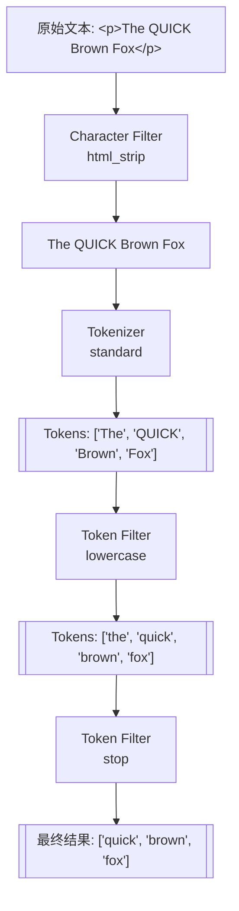

---

### 8.2 内置分词器介绍

ES 提供了多种内置分词器，可以直接使用。

#### 8.2.1 standard 分词器（默认）

这是 ES 的默认分词器，基于 Unicode 文本分割算法，适合大多数西方语言。

组成：
- Tokenizer：standard
- Token Filters：lowercase、stop（默认禁用）

```json
POST /_analyze
{
  "analyzer": "standard",
  "text": "The Quick Brown Fox jumps over the Lazy Dog"
}

// 结果
{
  "tokens": [
    { "token": "the", "start_offset": 0, "end_offset": 3, "position": 0 },
    { "token": "quick", "start_offset": 4, "end_offset": 9, "position": 1 },
    { "token": "brown", "start_offset": 10, "end_offset": 15, "position": 2 },
    { "token": "fox", "start_offset": 16, "end_offset": 19, "position": 3 },
    { "token": "jumps", "start_offset": 20, "end_offset": 25, "position": 4 },
    { "token": "over", "start_offset": 26, "end_offset": 30, "position": 5 },
    { "token": "the", "start_offset": 31, "end_offset": 34, "position": 6 },
    { "token": "lazy", "start_offset": 35, "end_offset": 39, "position": 7 },
    { "token": "dog", "start_offset": 40, "end_offset": 43, "position": 8 }
  ]
}
```

对中文的处理效果很差，会逐字切分：

```json
POST /_analyze
{
  "analyzer": "standard",
  "text": "我爱北京天安门"
}

// 结果：逐字切分，失去语义
{
  "tokens": [
    { "token": "我", "position": 0 },
    { "token": "爱", "position": 1 },
    { "token": "北", "position": 2 },
    { "token": "京", "position": 3 },
    { "token": "天", "position": 4 },
    { "token": "安", "position": 5 },
    { "token": "门", "position": 6 }
  ]
}
```

这就是为什么中文搜索需要专门的分词器。

#### 8.2.2 simple 分词器

按非字母字符切分，并转为小写。数字会被丢弃。

```json
POST /_analyze
{
  "analyzer": "simple",
  "text": "The Quick-Brown Fox 123"
}

// 结果：数字被丢弃
{
  "tokens": [
    { "token": "the", "position": 0 },
    { "token": "quick", "position": 1 },
    { "token": "brown", "position": 2 },
    { "token": "fox", "position": 3 }
  ]
}
```

#### 8.2.3 whitespace 分词器

仅按空白字符切分，不做任何其他处理（不转小写、不去标点）。

```json
POST /_analyze
{
  "analyzer": "whitespace",
  "text": "The Quick-Brown Fox"
}

// 结果：保留大小写和标点
{
  "tokens": [
    { "token": "The", "position": 0 },
    { "token": "Quick-Brown", "position": 1 },
    { "token": "Fox", "position": 2 }
  ]
}
```

#### 8.2.4 keyword 分词器

不进行任何分词，将整个文本作为一个词条。通常用于 keyword 类型字段的分析器。

```json
POST /_analyze
{
  "analyzer": "keyword",
  "text": "The Quick Brown Fox"
}

// 结果：整体作为一个词条
{
  "tokens": [
    { "token": "The Quick Brown Fox", "position": 0 }
  ]
}
```

#### 8.2.5 pattern 分词器

使用正则表达式切分文本。

```json
POST /_analyze
{
  "tokenizer": {
    "type": "pattern",
    "pattern": "[,;\\s]+"
  },
  "text": "apple,orange;banana grape"
}

// 结果：按逗号、分号、空白切分
{
  "tokens": [
    { "token": "apple", "position": 0 },
    { "token": "orange", "position": 1 },
    { "token": "banana", "position": 2 },
    { "token": "grape", "position": 3 }
  ]
}
```

#### 8.2.6 language 分词器

ES 为多种语言提供了专门的分词器，如 english、french、german 等。这些分词器包含了语言特定的停用词和词干提取。

```json
POST /_analyze
{
  "analyzer": "english",
  "text": "The foxes are running quickly"
}

// 结果：去除停用词，词干提取
{
  "tokens": [
    { "token": "fox", "position": 1 },      // foxes → fox
    { "token": "run", "position": 3 },      // running → run
    { "token": "quickli", "position": 4 }   // quickly → quickli
  ]
}
```

可惜没有内置的 chinese 分词器，需要使用插件。

#### 8.2.7 各分词器对比总结

| 分词器     | 切分规则     | 小写转换 | 停用词 | 适用场景       |
| ---------- | ------------ | -------- | ------ | -------------- |
| standard   | Unicode 算法 | ✅        | 可选   | 通用，默认选择 |
| simple     | 非字母字符   | ✅        | ❌      | 简单文本       |
| whitespace | 空白字符     | ❌        | ❌      | 保留格式       |
| keyword    | 不切分       | ❌        | ❌      | 精确匹配字段   |
| pattern    | 正则表达式   | 可选     | 可选   | 自定义规则     |
| english 等 | 语言特定     | ✅        | ✅      | 特定语言       |

---

### 8.3 IK 中文分词器

IK 分词器是最流行的 Elasticsearch 中文分词插件，由 medcl 开发维护，支持细粒度和智能切分两种模式。

#### 8.3.1 安装 IK 分词器

IK 分词器版本必须与 ES 版本完全一致。

**方式一：在线安装**

```bash
# 进入 ES 安装目录
cd /path/to/elasticsearch

# 安装（自动下载对应版本）
./bin/elasticsearch-plugin install https://github.com/medcl/elasticsearch-analysis-ik/releases/download/v8.11.0/elasticsearch-analysis-ik-8.11.0.zip

# 重启 ES
```

**方式二：离线安装**

```bash
# 1. 下载对应版本的 zip 包
wget https://github.com/medcl/elasticsearch-analysis-ik/releases/download/v8.11.0/elasticsearch-analysis-ik-8.11.0.zip

# 2. 解压到 plugins 目录
unzip elasticsearch-analysis-ik-8.11.0.zip -d /path/to/elasticsearch/plugins/ik

# 3. 重启 ES
```

**Docker 环境安装**

```bash
# 进入容器
docker exec -it elasticsearch bash

# 安装插件
./bin/elasticsearch-plugin install https://github.com/medcl/elasticsearch-analysis-ik/releases/download/v8.11.0/elasticsearch-analysis-ik-8.11.0.zip

# 退出并重启容器
exit
docker restart elasticsearch
```

验证安装成功：

```bash
# 查看已安装的插件
curl http://localhost:9200/_cat/plugins?v

# 或
GET /_cat/plugins?v

# 输出应包含 analysis-ik
```

#### 8.3.2 ik_smart vs ik_max_word

IK 分词器提供两种分词模式：

**ik_smart（智能切分）**

会做最粗粒度的切分，适合搜索时使用。一个词只会被切分一次，不会有重叠。

```json
POST /_analyze
{
  "analyzer": "ik_smart",
  "text": "中华人民共和国国歌"
}

// 结果
{
  "tokens": [
    { "token": "中华人民共和国", "start_offset": 0, "end_offset": 7, "position": 0 },
    { "token": "国歌", "start_offset": 7, "end_offset": 9, "position": 1 }
  ]
}
```

**ik_max_word（最细粒度切分）**

会将文本做最细粒度的切分，尽可能多地产生词条，适合索引时使用。

```json
POST /_analyze
{
  "analyzer": "ik_max_word",
  "text": "中华人民共和国国歌"
}

// 结果
{
  "tokens": [
    { "token": "中华人民共和国", "start_offset": 0, "end_offset": 7, "position": 0 },
    { "token": "中华人民", "start_offset": 0, "end_offset": 4, "position": 1 },
    { "token": "中华", "start_offset": 0, "end_offset": 2, "position": 2 },
    { "token": "华人", "start_offset": 1, "end_offset": 3, "position": 3 },
    { "token": "人民共和国", "start_offset": 2, "end_offset": 7, "position": 4 },
    { "token": "人民", "start_offset": 2, "end_offset": 4, "position": 5 },
    { "token": "共和国", "start_offset": 4, "end_offset": 7, "position": 6 },
    { "token": "共和", "start_offset": 4, "end_offset": 6, "position": 7 },
    { "token": "国", "start_offset": 6, "end_offset": 7, "position": 8 },
    { "token": "国歌", "start_offset": 7, "end_offset": 9, "position": 9 }
  ]
}
```

**最佳实践：索引时用 ik_max_word，搜索时用 ik_smart**

```json
PUT /articles
{
  "mappings": {
    "properties": {
      "title": {
        "type": "text",
        "analyzer": "ik_max_word",           // 索引时：最细粒度，更多匹配机会
        "search_analyzer": "ik_smart"         // 搜索时：智能切分，更精确
      },
      "content": {
        "type": "text",
        "analyzer": "ik_max_word",
        "search_analyzer": "ik_smart"
      }
    }
  }
}
```

为什么这样配置？

- 索引时使用 ik_max_word，可以让文档被更多的搜索词匹配到
- 搜索时使用 ik_smart，用户搜索"中华人民共和国"时，只会搜索这一个词，而不是搜索"中华"、"人民"等

#### 8.3.3 自定义词典

IK 分词器的词典位于 `plugins/ik/config/` 目录下：

```
config/
├── IKAnalyzer.cfg.xml          # 主配置文件
├── main.dic                    # 主词典
├── extra_dict.dic              # 扩展词典（自定义）
├── extra_stopword.dic          # 扩展停用词典
├── quantifier.dic              # 量词词典
├── suffix.dic                  # 后缀词典
├── surname.dic                 # 姓氏词典
└── stopword.dic                # 停用词典
```

**添加自定义词汇**

假设我们需要让分词器识别"掘金社区"、"Elasticsearch入门"等专有名词：

1. 创建自定义词典文件 `my_dict.dic`：

```
掘金社区
Elasticsearch入门
ES集群
微服务架构
SpringBoot
```

2. 修改 `IKAnalyzer.cfg.xml` 配置文件：

```xml
<?xml version="1.0" encoding="UTF-8"?>
<!DOCTYPE properties SYSTEM "http://java.sun.com/dtd/properties.dtd">
<properties>
    <comment>IK Analyzer 扩展配置</comment>
    
    <!-- 配置自定义扩展词典 -->
    <entry key="ext_dict">my_dict.dic</entry>
    
    <!-- 配置多个词典用分号分隔 -->
    <!-- <entry key="ext_dict">my_dict.dic;custom/product.dic</entry> -->
    
    <!-- 配置自定义扩展停用词词典 -->
    <entry key="ext_stopwords">my_stopwords.dic</entry>
</properties>
```

3. 重启 ES 使配置生效：

```bash
# 重启 ES
systemctl restart elasticsearch
# 或 Docker
docker restart elasticsearch
```

4. 验证分词效果：

```json
POST /_analyze
{
  "analyzer": "ik_smart",
  "text": "掘金社区是一个技术社区"
}

// 自定义词典生效后的结果
{
  "tokens": [
    { "token": "掘金社区", "position": 0 },
    { "token": "是", "position": 1 },
    { "token": "一个", "position": 2 },
    { "token": "技术", "position": 3 },
    { "token": "社区", "position": 4 }
  ]
}
```

**添加停用词**

停用词是指在搜索时需要过滤掉的词，如"的"、"是"、"在"等。创建 `my_stopwords.dic`：

```
的
是
在
了
啊
呢
吧
```

#### 8.3.4 热更新词典

每次修改词典都重启 ES 不太现实，IK 分词器支持热更新词典。

**方式一：基于本地文件的热更新**

IK 默认每 60 秒检查一次词典文件是否有更新。但这种方式需要同步文件到所有 ES 节点。

**方式二：基于远程词典的热更新（推荐）**

配置一个 HTTP 接口提供词典内容，IK 会定期请求获取更新。

1. 准备一个 HTTP 服务，返回词典内容：

```python
# Flask 示例
from flask import Flask, Response

app = Flask(__name__)

@app.route('/dict/ext.dic')
def ext_dict():
    words = """掘金社区
Elasticsearch
ChatGPT
大语言模型"""
    return Response(words, mimetype='text/plain; charset=utf-8',
                    headers={
                        'Last-Modified': 'Mon, 15 Jan 2024 10:00:00 GMT',
                        'ETag': 'v1.0'
                    })

@app.route('/dict/stopwords.dic')
def stopwords():
    words = """的
是
在"""
    return Response(words, mimetype='text/plain; charset=utf-8',
                    headers={
                        'Last-Modified': 'Mon, 15 Jan 2024 10:00:00 GMT',
                        'ETag': 'v1.0'
                    })

if __name__ == '__main__':
    app.run(host='0.0.0.0', port=8080)
```

2. 修改 `IKAnalyzer.cfg.xml`：

```xml
<?xml version="1.0" encoding="UTF-8"?>
<!DOCTYPE properties SYSTEM "http://java.sun.com/dtd/properties.dtd">
<properties>
    <comment>IK Analyzer 扩展配置</comment>
    
    <!-- 远程扩展词典 -->
    <entry key="remote_ext_dict">http://your-server:8080/dict/ext.dic</entry>
    
    <!-- 远程扩展停用词典 -->
    <entry key="remote_ext_stopwords">http://your-server:8080/dict/stopwords.dic</entry>
</properties>
```

IK 分词器会根据 HTTP 响应头的 `Last-Modified` 或 `ETag` 判断词典是否有更新。当这些值变化时，IK 会重新加载词典。

3. 更新词典后，修改 HTTP 响应的 `Last-Modified` 或 `ETag`，IK 会在下次检查时自动加载新词典，无需重启 ES。

---

### 8.4 其他中文分词器

除了 IK，还有一些其他的中文分词方案。

#### 8.4.1 HanLP 分词器

HanLP 是一个开源的自然语言处理工具包，分词只是其功能之一。elasticsearch-analysis-hanlp 插件将其集成到 ES。

**特点**：
- 支持多种分词模式
- 内置新词发现、命名实体识别等高级功能
- 词典更丰富

**安装**：

```bash
./bin/elasticsearch-plugin install https://github.com/KennFalworthy/elasticsearch-analysis-hanlp/releases/download/v8.11.0/elasticsearch-analysis-hanlp-8.11.0.zip
```

**使用**：

```json
POST /_analyze
{
  "analyzer": "hanlp",
  "text": "中华人民共和国国歌"
}
```

提供的分词器：
- `hanlp`：默认分词器
- `hanlp_standard`：标准分词
- `hanlp_index`：索引分词
- `hanlp_nlp`：NLP 分词
- `hanlp_crf`：CRF 分词

#### 8.4.2 jieba 分词器

jieba 是 Python 生态中最流行的中文分词库，也有 ES 插件版本。

**特点**：
- 支持精确模式、全模式、搜索引擎模式
- 支持自定义词典
- 社区活跃

**安装**：

```bash
./bin/elasticsearch-plugin install https://github.com/sing1ee/elasticsearch-jieba-plugin/releases/download/v8.11.0/elasticsearch-analysis-jieba-8.11.0.zip
```

**使用**：

```json
POST /_analyze
{
  "analyzer": "jieba_index",
  "text": "中华人民共和国国歌"
}
```

提供的分词器：
- `jieba_index`：索引模式
- `jieba_search`：搜索模式
- `jieba_other`：其他模式

#### 8.4.3 中文分词器选型建议

| 分词器    | 优点                 | 缺点          | 适用场景        |
| --------- | -------------------- | ------------- | --------------- |
| **IK**    | 轻量、稳定、文档丰富 | 词典需要维护  | 通用场景首选    |
| **HanLP** | 功能丰富、NLP 能力强 | 资源占用大    | 需要 NLP 功能时 |
| **jieba** | Python 生态熟悉      | ES 插件更新慢 | Python 技术栈   |

对于大多数项目，**IK 分词器是首选**，社区活跃、文档完善、经过大量生产验证。

---

### 8.5 自定义分词器

除了使用内置或插件分词器，ES 还支持组合各种组件创建自定义分词器。

#### 8.5.1 创建自定义分词器

```json
PUT /my_index
{
  "settings": {
    "analysis": {
      "char_filter": {
        "my_char_filter": {
          "type": "mapping",
          "mappings": [
            "& => and",
            "| => or"
          ]
        }
      },
      "tokenizer": {
        "my_tokenizer": {
          "type": "pattern",
          "pattern": "[\\s,;]+"
        }
      },
      "filter": {
        "my_stopwords": {
          "type": "stop",
          "stopwords": ["the", "a", "an", "is", "are"]
        }
      },
      "analyzer": {
        "my_analyzer": {
          "type": "custom",
          "char_filter": ["html_strip", "my_char_filter"],
          "tokenizer": "my_tokenizer",
          "filter": ["lowercase", "my_stopwords"]
        }
      }
    }
  },
  "mappings": {
    "properties": {
      "content": {
        "type": "text",
        "analyzer": "my_analyzer"
      }
    }
  }
}
```

测试自定义分词器：

```json
POST /my_index/_analyze
{
  "analyzer": "my_analyzer",
  "text": "<p>The Quick & Fast Fox</p>"
}

// 结果
{
  "tokens": [
    { "token": "quick", "position": 0 },
    { "token": "and", "position": 1 },
    { "token": "fast", "position": 2 },
    { "token": "fox", "position": 3 }
  ]
}
```

#### 8.5.2 拼音分词器

elasticsearch-analysis-pinyin 插件支持拼音搜索：

```bash
./bin/elasticsearch-plugin install https://github.com/medcl/elasticsearch-analysis-pinyin/releases/download/v8.11.0/elasticsearch-analysis-pinyin-8.11.0.zip
```

配置拼音分词器：

```json
PUT /my_index
{
  "settings": {
    "analysis": {
      "analyzer": {
        "pinyin_analyzer": {
          "tokenizer": "ik_max_word",
          "filter": ["pinyin_filter", "lowercase"]
        }
      },
      "filter": {
        "pinyin_filter": {
          "type": "pinyin",
          "keep_full_pinyin": true,           // 保留全拼：刘德华 → liu de hua
          "keep_joined_full_pinyin": true,    // 保留连续全拼：liudehua
          "keep_original": true,              // 保留原文
          "keep_first_letter": true,          // 保留首字母：ldh
          "limit_first_letter_length": 16,
          "remove_duplicated_term": true
        }
      }
    }
  },
  "mappings": {
    "properties": {
      "name": {
        "type": "text",
        "analyzer": "ik_max_word",
        "fields": {
          "pinyin": {
            "type": "text",
            "analyzer": "pinyin_analyzer"
          }
        }
      }
    }
  }
}
```

这样可以同时支持中文搜索和拼音搜索：

```json
// 中文搜索
GET /my_index/_search
{
  "query": {
    "match": { "name": "刘德华" }
  }
}

// 拼音搜索
GET /my_index/_search
{
  "query": {
    "match": { "name.pinyin": "liudehua" }
  }
}

// 首字母搜索
GET /my_index/_search
{
  "query": {
    "match": { "name.pinyin": "ldh" }
  }
}
```

#### 8.5.3 同义词配置

同义词可以扩大搜索范围，让用户用不同的词搜索到相同的结果。

```json
PUT /products
{
  "settings": {
    "analysis": {
      "filter": {
        "my_synonyms": {
          "type": "synonym",
          "synonyms": [
            "手机,移动电话,mobile phone",
            "笔记本,笔记本电脑,laptop",
            "电视,TV,电视机"
          ]
        }
      },
      "analyzer": {
        "ik_synonym": {
          "tokenizer": "ik_max_word",
          "filter": ["lowercase", "my_synonyms"]
        }
      }
    }
  },
  "mappings": {
    "properties": {
      "name": {
        "type": "text",
        "analyzer": "ik_max_word",
        "search_analyzer": "ik_synonym"      // 搜索时使用同义词
      }
    }
  }
}
```

也可以使用同义词文件：

```json
{
  "filter": {
    "my_synonyms": {
      "type": "synonym",
      "synonyms_path": "analysis/synonyms.txt"   // 相对于 config 目录
    }
  }
}
```

`config/analysis/synonyms.txt` 文件内容：

```
# 同义词文件，一行一组，逗号分隔
手机,移动电话,mobile phone
笔记本,笔记本电脑,laptop
苹果手机,iPhone,iphone
华为手机,Huawei,huawei phone
```

---

### 8.6 使用 _analyze API 调试分词

_analyze API 是调试分词效果的利器，强烈建议在设计 Mapping 时充分使用。

#### 8.6.1 基本用法

```json
// 使用指定分词器
POST /_analyze
{
  "analyzer": "ik_smart",
  "text": "Elasticsearch是一个分布式搜索引擎"
}

// 使用指定索引的字段分词器
POST /my_index/_analyze
{
  "field": "content",
  "text": "Elasticsearch是一个分布式搜索引擎"
}

// 自定义分词组件
POST /_analyze
{
  "tokenizer": "ik_max_word",
  "filter": ["lowercase"],
  "text": "Elasticsearch搜索引擎"
}

// 分析多段文本
POST /_analyze
{
  "analyzer": "ik_smart",
  "text": ["第一段文本", "第二段文本"]
}
```

#### 8.6.2 查看详细的分词信息

使用 `explain: true` 查看每个处理步骤的详细信息：

```json
POST /_analyze
{
  "analyzer": "standard",
  "text": "The QUICK Brown Fox",
  "explain": true
}

// 响应包含每个阶段的详细处理过程
{
  "detail": {
    "custom_analyzer": false,
    "charfilters": [],
    "tokenizer": {
      "name": "standard",
      "tokens": [
        {
          "token": "The",
          "start_offset": 0,
          "end_offset": 3,
          "type": "<ALPHANUM>",
          "position": 0
        },
        // ...
      ]
    },
    "tokenfilters": [
      {
        "name": "lowercase",
        "tokens": [
          {
            "token": "the",
            "start_offset": 0,
            "end_offset": 3,
            "type": "<ALPHANUM>",
            "position": 0
          },
          // ...
        ]
      }
    ]
  }
}
```

#### 8.6.3 常见分词问题排查

**问题一：搜索不到预期的结果**

先检查索引时的分词结果：

```json
POST /my_index/_analyze
{
  "field": "title",
  "text": "文档中的原始内容"
}
```

再检查搜索时的分词结果：

```json
// 搜索分词器可能与索引分词器不同
POST /_analyze
{
  "analyzer": "ik_smart",   // 如果配置了 search_analyzer
  "text": "用户的搜索词"
}
```

对比两者的 token，看是否有交集。

**问题二：特定词语没有被正确识别**

可能是词典问题，检查是否需要添加到自定义词典。

```json
// 检查分词结果
POST /_analyze
{
  "analyzer": "ik_smart",
  "text": "掘金社区很不错"
}

// 如果"掘金社区"被拆开了，需要加入自定义词典
```

---

### 本章小结

分词器是中文搜索的核心，本章的关键要点：

1. **分词器三部分**：Character Filter（字符过滤）→ Tokenizer（分词）→ Token Filter（词条处理）

2. **中文分词首选 IK**：ik_max_word 用于索引（更多词条），ik_smart 用于搜索（更精确）

3. **词典维护很重要**：业务相关的专有名词需要添加到自定义词典

4. **热更新词典**：通过远程词典接口实现不重启更新

5. **_analyze API**：调试分词效果的必备工具

6. **拼音和同义词**：可以显著提升搜索体验

---

## 九、集群架构：分布式的奥秘

> 🎯 Elasticsearch 天生就是分布式的。理解集群架构对于生产环境的部署、运维和问题排查至关重要。本章将深入讲解 ES 集群的工作原理。

### 9.1 集群基本概念

#### 9.1.1 集群与节点

**集群（Cluster）** 是一组拥有相同 `cluster.name` 的节点的集合。集群中的节点会自动发现彼此，共同存储数据并提供搜索能力。

**节点（Node）** 是集群中的一个运行实例，每个节点都有唯一的名称。节点在启动时会加入指定的集群，或创建新集群。

```yaml
# elasticsearch.yml
cluster.name: my-production-cluster   # 集群名称
node.name: node-1                     # 节点名称
```

查看集群和节点信息：

```json
// 查看集群健康状态
GET /_cluster/health

// 查看节点列表
GET /_cat/nodes?v

// 输出示例
ip         heap.percent ram.percent cpu load_1m node.role   master name
172.17.0.2           45          85  10    0.50 cdfhilmrstw *      node-1
172.17.0.3           38          72   5    0.30 cdfhilmrstw -      node-2
172.17.0.4           42          78   8    0.40 cdfhilmrstw -      node-3
```

#### 9.1.2 节点角色详解

ES 节点可以承担多种角色，每种角色负责不同的功能。在小规模集群中，一个节点可以同时承担多种角色；在大规模集群中，建议角色分离以获得更好的性能和稳定性。

**主节点（Master Node）**

负责集群层面的管理工作：
- 创建、删除索引
- 跟踪集群中的节点
- 决定分片分配到哪个节点
- 维护和更新集群状态（Cluster State）

配置方式：

```yaml
node.roles: [master]
# 或 ES 7.x 之前的配置
node.master: true
node.data: false
```

Master 节点对 CPU、内存要求不高，但需要稳定的网络。建议生产环境至少配置 3 个候选主节点以避免脑裂。

**数据节点（Data Node）**

负责数据的存储和处理：
- 存储分片数据
- 执行 CRUD、搜索、聚合操作
- 资源消耗大户（CPU、内存、磁盘IO）

配置方式：

```yaml
node.roles: [data]
# 或
node.master: false
node.data: true
```

数据节点需要高性能的 CPU、大内存和快速的磁盘（建议 SSD）。

**协调节点（Coordinating Node）**

也称为客户端节点，负责接收客户端请求并分发到相应的节点，然后汇总结果返回客户端。实际上，每个节点默认都具备协调功能。

专用协调节点配置：

```yaml
node.roles: []
# 或
node.master: false
node.data: false
node.ingest: false
```

专用协调节点适用于：
- 大量查询聚合的场景
- 需要隔离客户端请求和数据处理的场景

**Ingest 节点（预处理节点）**

负责文档的预处理（数据转换、富化）：

```yaml
node.roles: [ingest]
```

Ingest 节点可以在文档索引之前执行一系列处理，类似于简化版的 Logstash。

**其他专用角色（ES 7.9+）**

| 角色                    | 说明                     |
| ----------------------- | ------------------------ |
| `data_content`          | 存储常规内容数据         |
| `data_hot`              | 存储热数据（频繁访问）   |
| `data_warm`             | 存储温数据（较少访问）   |
| `data_cold`             | 存储冷数据（很少访问）   |
| `data_frozen`           | 存储冻结数据（极少访问） |
| `ml`                    | 机器学习节点             |
| `transform`             | 数据转换节点             |
| `remote_cluster_client` | 跨集群搜索               |

#### 9.1.3 集群规模与角色配置建议

**小规模集群（3 节点，开发/测试）**：

所有节点都是全角色：

```yaml
# 每个节点相同配置
node.roles: [master, data, ingest]
```

**中规模集群（5-10 节点，一般生产）**：

开始分离主节点和数据节点：

```
节点1-3: master + data（候选主节点兼数据节点）
节点4-7: data（纯数据节点）
```

**大规模集群（10+ 节点，大型生产）**：

完全角色分离：

```
节点1-3: master（专用主节点，配置较低即可）
节点4-N: data（专用数据节点，高配置）
节点X-Y: coordinating（专用协调节点，可选）
节点Z: ingest（专用预处理节点，可选）
```

---

### 9.2 集群状态监控

#### 9.2.1 集群健康状态

集群健康状态是运维中最重要的监控指标：

```json
GET /_cluster/health

// 响应
{
  "cluster_name": "my-cluster",
  "status": "green",                        // 核心指标：green/yellow/red
  "timed_out": false,
  "number_of_nodes": 3,
  "number_of_data_nodes": 3,
  "active_primary_shards": 10,
  "active_shards": 20,
  "relocating_shards": 0,                   // 正在迁移的分片
  "initializing_shards": 0,                 // 正在初始化的分片
  "unassigned_shards": 0,                   // 未分配的分片
  "delayed_unassigned_shards": 0,
  "number_of_pending_tasks": 0,
  "number_of_in_flight_fetch": 0,
  "task_max_waiting_in_queue_millis": 0,
  "active_shards_percent_as_number": 100.0
}
```

**三种健康状态的含义**：

| 状态         | 含义                             | 是否可用         | 数据是否安全   |
| ------------ | -------------------------------- | ---------------- | -------------- |
| 🟢 **Green**  | 所有主分片和副本分片都已分配     | ✅ 完全可用       | ✅ 有冗余保护   |
| 🟡 **Yellow** | 所有主分片已分配，部分副本未分配 | ✅ 可用           | ⚠️ 缺少冗余     |
| 🔴 **Red**    | 部分主分片未分配                 | ⚠️ 部分数据不可用 | ❌ 数据可能丢失 |

**查看特定索引的健康状态**：

```json
GET /_cluster/health/products

// 等待集群变为 green（用于脚本）
GET /_cluster/health?wait_for_status=green&timeout=50s
```

#### 9.2.2 _cat API 详解

_cat API 提供人类可读的集群信息输出，非常适合命令行监控：

```bash
# 常用 _cat 命令

# 节点列表
GET /_cat/nodes?v

# 索引列表
GET /_cat/indices?v

# 按索引大小排序
GET /_cat/indices?v&s=store.size:desc

# 分片分布
GET /_cat/shards?v

# 特定索引的分片
GET /_cat/shards/products?v

# 查看分片分配问题
GET /_cat/shards?v&h=index,shard,prirep,state,unassigned.reason

# 主节点信息
GET /_cat/master?v

# 待处理任务
GET /_cat/pending_tasks?v

# 线程池状态
GET /_cat/thread_pool?v

# 磁盘使用情况
GET /_cat/allocation?v

# 插件列表
GET /_cat/plugins?v

# 模板列表
GET /_cat/templates?v
```

常用参数：
- `v`：显示列头
- `h=column1,column2`：指定显示的列
- `s=column:desc`：按列排序
- `format=json`：JSON 格式输出

示例输出：

```bash
GET /_cat/shards/products?v

index    shard prirep state   docs  store ip         node
products 0     p      STARTED 1000 500kb  172.17.0.2 node-1
products 0     r      STARTED 1000 500kb  172.17.0.3 node-2
products 1     p      STARTED 1200 600kb  172.17.0.3 node-2
products 1     r      STARTED 1200 600kb  172.17.0.4 node-3
products 2     p      STARTED 800  400kb  172.17.0.4 node-3
products 2     r      STARTED 800  400kb  172.17.0.2 node-1
```

#### 9.2.3 Cluster State API

集群状态包含完整的集群元数据：

```json
// 查看集群状态（信息量很大）
GET /_cluster/state

// 只查看特定部分
GET /_cluster/state/nodes               // 节点信息
GET /_cluster/state/routing_table       // 路由表
GET /_cluster/state/metadata            // 元数据
GET /_cluster/state/blocks              // 集群阻塞

// 组合查看
GET /_cluster/state/metadata,routing_table/products
```

#### 9.2.4 集群统计信息

```json
// 集群统计
GET /_cluster/stats

// 节点统计
GET /_nodes/stats

// 特定节点
GET /_nodes/node-1/stats

// 特定指标
GET /_nodes/stats/jvm,os,process
```

重要统计指标：

```json
GET /_nodes/stats/jvm

// 关注的 JVM 指标
{
  "nodes": {
    "node_id": {
      "jvm": {
        "mem": {
          "heap_used_percent": 45,              // 堆内存使用率，建议 <75%
          "heap_used_in_bytes": 483183616,
          "heap_max_in_bytes": 1073741824
        },
        "gc": {
          "collectors": {
            "young": {
              "collection_count": 100,
              "collection_time_in_millis": 500
            },
            "old": {
              "collection_count": 5,             // Old GC 次数过多需关注
              "collection_time_in_millis": 2000
            }
          }
        }
      }
    }
  }
}
```

---

### 9.3 集群工作原理

#### 9.3.1 节点发现机制

当 ES 节点启动时，需要发现并加入集群。ES 7.x 使用基于 Zen Discovery 2 的发现机制。

**配置发现**：

```yaml
# elasticsearch.yml

# 集群名称，必须一致才能加入同一集群
cluster.name: my-cluster

# 发现种子节点（用于发现其他节点）
discovery.seed_hosts:
  - 192.168.1.101:9300
  - 192.168.1.102:9300
  - 192.168.1.103:9300

# 初始主节点（仅首次启动集群时需要）
cluster.initial_master_nodes:
  - node-1
  - node-2
  - node-3
```

发现过程：
1. 新节点启动，连接 seed_hosts 中的地址
2. 获取集群中其他节点的信息
3. 如果是候选主节点，参与主节点选举
4. 选出主节点后，新节点正式加入集群

#### 9.3.2 Master 选举过程

ES 使用基于 Raft 的共识算法进行主节点选举。

**选举触发条件**：
- 集群首次启动
- 当前主节点离开集群
- 候选主节点无法连接到主节点

**选举过程简述**：
1. 候选主节点发现无法连接主节点
2. 发起投票请求
3. 获得超过半数（quorum）候选节点的投票
4. 成为新的主节点
5. 发布新的集群状态

**Quorum（法定人数）计算**：

```
quorum = (候选主节点数 / 2) + 1
```

例如：
- 3 个候选主节点：quorum = 2
- 5 个候选主节点：quorum = 3

ES 7.x 自动计算 quorum，不再需要手动配置 `minimum_master_nodes`。

#### 9.3.3 脑裂问题与预防

脑裂（Split Brain）是指集群分裂成多个独立的部分，每个部分都选出了自己的主节点，导致数据不一致。

**脑裂产生的原因**：
- 网络分区：部分节点之间无法通信
- 主节点响应慢：被误判为失联
- 配置错误：quorum 设置不当

**ES 7.x 的脑裂预防**：

1. **自动 quorum 计算**：不再需要手动配置，减少配置错误

2. **投票配置排除**：当节点永久下线时，从投票配置中排除

```json
// 排除节点（用于节点永久下线）
POST /_cluster/voting_config_exclusions?node_names=node-4
```

3. **建议使用奇数个候选主节点**：3 或 5 个，便于达成多数一致

**生产环境建议**：

```yaml
# 3 节点集群配置
discovery.seed_hosts:
  - node-1.example.com
  - node-2.example.com
  - node-3.example.com

cluster.initial_master_nodes:
  - node-1
  - node-2
  - node-3
```

---

### 9.4 数据写入与读取流程

理解数据流转过程对于性能调优和问题排查非常重要。

#### 9.4.1 文档写入流程

当客户端发送写入请求时，经历以下步骤：

**第一步：请求路由**

客户端请求可以发送到任意节点（称为协调节点）。协调节点根据路由算法确定文档应该存储在哪个分片：

```
shard = hash(routing) % number_of_primary_shards
```

默认 routing 值是文档 ID，也可以自定义：

```json
PUT /products/_doc/1?routing=user_123
{
  "name": "iPhone"
}
```

**第二步：主分片写入**

协调节点将请求转发到主分片所在的节点。主分片执行以下操作：

1. **验证文档**：检查字段类型、映射等
2. **写入 Translog**：先写事务日志（保证持久性）
3. **写入内存 Buffer**：添加到内存索引缓冲区
4. **返回确认**：告知协调节点写入成功

**第三步：副本同步**

主分片写入成功后，并行地将请求发送到所有副本分片：

1. 每个副本分片执行相同的写入操作
2. 所有副本确认后，主分片向协调节点报告成功
3. 协调节点向客户端返回响应

**写入一致性控制**：

```json
// 控制等待多少副本确认
PUT /products/_doc/1?wait_for_active_shards=2
{
  "name": "iPhone"
}

// 可选值：
// 1: 只等待主分片
// all: 等待所有分片
// N: 等待 N 个分片
```

**第四步：Refresh（刷新）**

默认每 1 秒执行一次 Refresh：

1. 将内存 Buffer 中的文档写入 Segment（文件系统缓存）
2. 清空内存 Buffer
3. 新文档变得可搜索

这就是 ES "近实时"搜索的原因——文档写入后约 1 秒可被搜索到。

```json
// 手动刷新（不建议频繁调用）
POST /products/_refresh

// 写入后立即刷新
PUT /products/_doc/1?refresh=true
{
  "name": "iPhone"
}

// 等待下次刷新
PUT /products/_doc/1?refresh=wait_for
{
  "name": "iPhone"
}
```

**第五步：Flush（落盘）**

Flush 将文件系统缓存中的 Segment 持久化到磁盘，并清空 Translog：

1. 将 Segment fsync 到磁盘
2. 清空 Translog
3. 写入 Commit Point（提交点）

```json
// 手动 Flush
POST /products/_flush

// Flush 配置
PUT /products/_settings
{
  "translog.durability": "request",      // 每次请求都 fsync translog（更安全）
  "translog.flush_threshold_size": "512mb"  // translog 达到此大小触发 flush
}
```

#### 9.4.2 文档读取流程

**根据 ID 读取（GET）**：

1. 协调节点根据路由算法计算分片
2. 在该分片的所有副本（包括主分片）中轮询选择一个
3. 被选中的分片返回文档
4. 协调节点返回给客户端

```json
GET /products/_doc/1

// 指定偏好的分片
GET /products/_doc/1?preference=_local        // 优先本地分片
GET /products/_doc/1?preference=_primary      // 只从主分片读取
GET /products/_doc/1?preference=custom_value  // 相同值总是访问相同分片
```

**搜索请求（Search）**：

搜索是一个分散-聚合（Scatter-Gather）的过程：

**Query 阶段（分散）**：

1. 协调节点将请求发送到所有相关分片
2. 每个分片在本地执行查询
3. 返回匹配文档的 ID 和排序值（不返回完整文档）
4. 协调节点合并排序，确定最终的文档列表

**Fetch 阶段（聚合）**：

1. 协调节点向相关分片请求完整文档
2. 分片返回文档内容
3. 协调节点组装最终结果返回客户端

这就是为什么深分页（from + size 很大）性能差的原因：Query 阶段每个分片需要返回 `from + size` 个文档 ID。

---

### 9.5 分片分配策略与调优

#### 9.5.1 分片分配的基本原则

ES 自动分配分片时遵循以下原则：

1. **主副分离**：主分片和其副本不能在同一节点
2. **负载均衡**：尽量均匀分布分片
3. **感知机架/可用区**：可配置为避免单点故障

#### 9.5.2 分片分配相关配置

**集群级别配置**：

```json
PUT /_cluster/settings
{
  "persistent": {
    // 允许的分片类型
    "cluster.routing.allocation.enable": "all",  // all, primaries, new_primaries, none
    
    // 节点并发恢复分片数
    "cluster.routing.allocation.node_concurrent_recoveries": 2,
    
    // 同时进行的分片迁移数
    "cluster.routing.allocation.cluster_concurrent_rebalance": 2,
    
    // 磁盘水位线（重要！）
    "cluster.routing.allocation.disk.watermark.low": "85%",     // 不再分配新分片
    "cluster.routing.allocation.disk.watermark.high": "90%",    // 开始迁移分片
    "cluster.routing.allocation.disk.watermark.flood_stage": "95%"  // 设为只读
  }
}
```

**磁盘水位线详解**：

| 水位线      | 默认值 | 触发行为                 |
| ----------- | ------ | ------------------------ |
| Low         | 85%    | 停止向该节点分配新分片   |
| High        | 90%    | 开始将分片迁移到其他节点 |
| Flood Stage | 95%    | 将相关索引设为只读       |

当触发 Flood Stage 后，需要先清理空间，然后手动恢复写入：

```json
PUT /products/_settings
{
  "index.blocks.read_only_allow_delete": null
}
```

#### 9.5.3 索引级别的分片分配

```json
PUT /products/_settings
{
  // 分配到特定节点
  "index.routing.allocation.include._name": "node-1,node-2",
  
  // 排除特定节点
  "index.routing.allocation.exclude._name": "node-3",
  
  // 要求特定属性
  "index.routing.allocation.require.zone": "zone-1"
}
```

节点属性配置（在 elasticsearch.yml 中）：

```yaml
node.attr.zone: zone-1
node.attr.rack: rack-1
node.attr.size: large
```

**热温冷架构配置**：

```yaml
# 热节点配置
node.attr.data: hot
node.roles: [data_hot]

# 温节点配置
node.attr.data: warm
node.roles: [data_warm]

# 冷节点配置
node.attr.data: cold
node.roles: [data_cold]
```

```json
// 将索引分配到热节点
PUT /logs-2024-03/_settings
{
  "index.routing.allocation.require.data": "hot"
}

// 迁移到温节点
PUT /logs-2024-02/_settings
{
  "index.routing.allocation.require.data": "warm"
}
```

#### 9.5.4 手动分片管理

**移动分片**：

```json
POST /_cluster/reroute
{
  "commands": [
    {
      "move": {
        "index": "products",
        "shard": 0,
        "from_node": "node-1",
        "to_node": "node-2"
      }
    }
  ]
}
```

**取消分片恢复**：

```json
POST /_cluster/reroute
{
  "commands": [
    {
      "cancel": {
        "index": "products",
        "shard": 0,
        "node": "node-1"
      }
    }
  ]
}
```

**分配未分配的分片**：

```json
POST /_cluster/reroute
{
  "commands": [
    {
      "allocate_replica": {
        "index": "products",
        "shard": 0,
        "node": "node-2"
      }
    }
  ]
}
```

#### 9.5.5 诊断分片分配问题

当分片未分配时，查看原因：

```json
// 查看未分配分片
GET /_cat/shards?v&h=index,shard,prirep,state,unassigned.reason&s=state

// 详细的分配解释
GET /_cluster/allocation/explain
{
  "index": "products",
  "shard": 0,
  "primary": true
}
```

常见的未分配原因：

| 原因                  | 说明               | 解决方案           |
| --------------------- | ------------------ | ------------------ |
| `INDEX_CREATED`       | 新索引创建         | 等待自动分配       |
| `CLUSTER_RECOVERED`   | 集群恢复中         | 等待恢复完成       |
| `NODE_LEFT`           | 节点离开集群       | 节点恢复或重新分配 |
| `ALLOCATION_FAILED`   | 分配失败           | 检查节点状态       |
| `NO_VALID_SHARD_COPY` | 没有有效的分片副本 | 可能数据丢失       |
| `DISK_WATERMARK`      | 磁盘空间不足       | 清理磁盘或增加节点 |

#### 9.5.6 分片数量规划建议

分片数量影响性能和资源使用，需要合理规划：

**单个分片的建议**：
- 大小：10GB - 50GB（推荐 30GB 左右）
- 文档数：不超过 20 亿

**计算公式**：

```
主分片数 = 预期总数据量 / 单个分片目标大小

例如：
预期数据量 = 300GB
单个分片大小 = 30GB
主分片数 = 300 / 30 = 10 个
```

**考虑增长因素**：

```
主分片数 = (预期数据量 × 增长系数) / 单个分片目标大小

例如：
当前数据量 = 100GB
年增长率 = 50%
保留期 = 3年
最终数据量 = 100 × (1.5)^3 ≈ 340GB
主分片数 = 340 / 30 ≈ 12 个
```

**避免过度分片**：
- 每个分片都有开销（内存、文件句柄）
- 空分片也消耗资源
- 建议每个节点的分片数不超过 1000

---

### 本章小结

本章介绍了 ES 集群架构的核心知识：

**分词器要点**：
1. 分词器由 Character Filter、Tokenizer、Token Filter 三部分组成
2. 中文搜索推荐使用 IK 分词器
3. 索引用 ik_max_word，搜索用 ik_smart
4. 自定义词典和热更新是必备技能

**集群架构要点**：
1. 节点角色分为 Master、Data、Coordinating、Ingest 等
2. 集群健康状态（Green/Yellow/Red）是核心监控指标
3. 写入流程：协调节点 → 主分片 → 副本分片 → Refresh → Flush
4. 搜索流程：Query 阶段（分散）→ Fetch 阶段（聚合）
5. 分片数量需要合理规划，避免过多或过少

**生产环境建议**：
1. 至少 3 个候选主节点防止脑裂
2. 关注磁盘水位线配置
3. 合理规划分片数量（每个 30GB 左右）
4. 使用热温冷架构管理数据生命周期

下一章我们将学习如何使用 Java 客户端操作 ES，实现业务开发！

---


## 十、Java 客户端集成

> 🎯 在实际业务开发中，我们需要通过代码来操作 Elasticsearch。本章将详细介绍 Java 客户端的选型、Spring Boot 整合方式，以及构建一个完整的商品搜索服务。

### 10.1 客户端选型

ES 官方提供了多种 Java 客户端，经历了几代演进。选择正确的客户端对于项目的长期维护非常重要。

#### 10.1.1 客户端演进历史

| 客户端                    | 适用版本     | 状态     | 说明                         |
| ------------------------- | ------------ | -------- | ---------------------------- |
| Transport Client          | ES 7.x 之前  | ❌ 已废弃 | 使用 TCP 协议，ES 8.x 已移除 |
| RestHighLevelClient       | ES 6.x - 7.x | ⚠️ 已弃用 | 基于 HTTP，ES 7.15 标记弃用  |
| Elasticsearch Java Client | ES 7.15+     | ✅ 推荐   | 全新设计，ES 8.x 官方推荐    |
| Spring Data Elasticsearch | 所有版本     | ✅ 推荐   | Spring 生态，封装良好        |

**选型建议**：

- **新项目**：直接使用 Elasticsearch Java Client 或 Spring Data Elasticsearch
- **存量项目**：如果还在用 RestHighLevelClient，建议规划迁移
- **Spring 项目**：优先考虑 Spring Data Elasticsearch，开发效率高

#### 10.1.2 Transport Client（已废弃）

Transport Client 使用 ES 内部的 TCP 协议通信，曾经是最主流的选择。但由于与 ES 版本强耦合、难以维护等原因，已被废弃。

```java
// 不推荐使用！仅作历史了解
TransportClient client = new PreBuiltTransportClient(Settings.EMPTY)
    .addTransportAddress(new TransportAddress(InetAddress.getByName("localhost"), 9300));
```

如果你的老项目还在使用 Transport Client，强烈建议尽快迁移。

#### 10.1.3 RestHighLevelClient（已弃用）

RestHighLevelClient 基于 HTTP REST API，是 ES 7.x 时代的主流选择。虽然已标记弃用，但目前仍有大量项目在使用。

```java
// 仍可使用，但已弃用
RestHighLevelClient client = new RestHighLevelClient(
    RestClient.builder(
        new HttpHost("localhost", 9200, "http")
    )
);
```

弃用原因：
- 维护成本高，需要同时维护两套 API（底层 RestClient 和高层封装）
- 与 ES 版本耦合较重
- API 设计不够现代化

#### 10.1.4 Elasticsearch Java Client（推荐）

这是 ES 官方推出的新一代 Java 客户端，从 ES 7.15 开始提供，ES 8.x 正式成为默认推荐。

**主要特点**：

1. **流式 Builder API**：代码更简洁，可读性更好
2. **强类型支持**：编译时检查，减少运行时错误
3. **与 ES 版本解耦**：一个客户端版本可兼容多个 ES 版本
4. **支持异步操作**：原生支持 CompletableFuture
5. **Jackson 序列化**：与主流 JSON 库集成良好

```java
// 新客户端示例
ElasticsearchClient client = new ElasticsearchClient(transport);

// 流式 API，非常优雅
SearchResponse<Product> response = client.search(s -> s
    .index("products")
    .query(q -> q
        .match(m -> m
            .field("name")
            .query("手机")
        )
    ),
    Product.class
);
```

---

### 10.2 Spring Boot 整合

本节以 Spring Boot 3.x + Elasticsearch Java Client 为例，演示完整的整合过程。

#### 10.2.1 依赖配置

**Maven 配置**：

```xml
<?xml version="1.0" encoding="UTF-8"?>
<project xmlns="http://maven.apache.org/POM/4.0.0"
         xmlns:xsi="http://www.w3.org/2001/XMLSchema-instance"
         xsi:schemaLocation="http://maven.apache.org/POM/4.0.0 
         http://maven.apache.org/xsd/maven-4.0.0.xsd">
    <modelVersion>4.0.0</modelVersion>
    
    <parent>
        <groupId>org.springframework.boot</groupId>
        <artifactId>spring-boot-starter-parent</artifactId>
        <version>3.2.0</version>
    </parent>
    
    <groupId>com.example</groupId>
    <artifactId>es-demo</artifactId>
    <version>1.0.0</version>
    
    <properties>
        <java.version>17</java.version>
        <elasticsearch.version>8.11.0</elasticsearch.version>
    </properties>
    
    <dependencies>
        <!-- Spring Boot Web -->
        <dependency>
            <groupId>org.springframework.boot</groupId>
            <artifactId>spring-boot-starter-web</artifactId>
        </dependency>
        
        <!-- Elasticsearch Java Client -->
        <dependency>
            <groupId>co.elastic.clients</groupId>
            <artifactId>elasticsearch-java</artifactId>
            <version>${elasticsearch.version}</version>
        </dependency>
        
        <!-- 必须的 JSON 处理依赖 -->
        <dependency>
            <groupId>com.fasterxml.jackson.core</groupId>
            <artifactId>jackson-databind</artifactId>
        </dependency>
        
        <!-- Jakarta JSON API（ES 8.x 需要） -->
        <dependency>
            <groupId>jakarta.json</groupId>
            <artifactId>jakarta.json-api</artifactId>
            <version>2.1.2</version>
        </dependency>
        
        <!-- JSON-P 实现 -->
        <dependency>
            <groupId>org.eclipse.parsson</groupId>
            <artifactId>parsson</artifactId>
            <version>1.1.4</version>
        </dependency>
        
        <!-- Lombok（可选，简化代码） -->
        <dependency>
            <groupId>org.projectlombok</groupId>
            <artifactId>lombok</artifactId>
            <optional>true</optional>
        </dependency>
        
        <!-- 测试 -->
        <dependency>
            <groupId>org.springframework.boot</groupId>
            <artifactId>spring-boot-starter-test</artifactId>
            <scope>test</scope>
        </dependency>
    </dependencies>
</project>
```

**Gradle 配置**：

```groovy
plugins {
    id 'java'
    id 'org.springframework.boot' version '3.2.0'
    id 'io.spring.dependency-management' version '1.1.4'
}

group = 'com.example'
version = '1.0.0'

java {
    sourceCompatibility = '17'
}

repositories {
    mavenCentral()
}

dependencies {
    implementation 'org.springframework.boot:spring-boot-starter-web'
    implementation 'co.elastic.clients:elasticsearch-java:8.11.0'
    implementation 'com.fasterxml.jackson.core:jackson-databind'
    implementation 'jakarta.json:jakarta.json-api:2.1.2'
    implementation 'org.eclipse.parsson:parsson:1.1.4'
    
    compileOnly 'org.projectlombok:lombok'
    annotationProcessor 'org.projectlombok:lombok'
    
    testImplementation 'org.springframework.boot:spring-boot-starter-test'
}
```

#### 10.2.2 连接配置

**application.yml**：

```yaml
elasticsearch:
  host: localhost
  port: 9200
  username: elastic          # 如果开启了安全认证
  password: your_password
  connection-timeout: 5000   # 连接超时（毫秒）
  socket-timeout: 60000      # Socket 超时（毫秒）
```

**配置类**：

```java
package com.example.config;

import co.elastic.clients.elasticsearch.ElasticsearchClient;
import co.elastic.clients.json.jackson.JacksonJsonpMapper;
import co.elastic.clients.transport.ElasticsearchTransport;
import co.elastic.clients.transport.rest_client.RestClientTransport;
import com.fasterxml.jackson.databind.ObjectMapper;
import com.fasterxml.jackson.databind.SerializationFeature;
import com.fasterxml.jackson.datatype.jsr310.JavaTimeModule;
import org.apache.http.HttpHost;
import org.apache.http.auth.AuthScope;
import org.apache.http.auth.UsernamePasswordCredentials;
import org.apache.http.impl.client.BasicCredentialsProvider;
import org.elasticsearch.client.RestClient;
import org.elasticsearch.client.RestClientBuilder;
import org.springframework.beans.factory.annotation.Value;
import org.springframework.context.annotation.Bean;
import org.springframework.context.annotation.Configuration;

@Configuration
public class ElasticsearchConfig {

    @Value("${elasticsearch.host}")
    private String host;

    @Value("${elasticsearch.port}")
    private int port;

    @Value("${elasticsearch.username:}")
    private String username;

    @Value("${elasticsearch.password:}")
    private String password;

    @Value("${elasticsearch.connection-timeout:5000}")
    private int connectionTimeout;

    @Value("${elasticsearch.socket-timeout:60000}")
    private int socketTimeout;

    @Bean
    public RestClient restClient() {
        RestClientBuilder builder = RestClient.builder(
            new HttpHost(host, port, "http")
        );

        // 配置超时
        builder.setRequestConfigCallback(requestConfigBuilder ->
            requestConfigBuilder
                .setConnectTimeout(connectionTimeout)
                .setSocketTimeout(socketTimeout)
        );

        // 配置认证（如果需要）
        if (username != null && !username.isEmpty()) {
            BasicCredentialsProvider credentialsProvider = new BasicCredentialsProvider();
            credentialsProvider.setCredentials(
                AuthScope.ANY,
                new UsernamePasswordCredentials(username, password)
            );

            builder.setHttpClientConfigCallback(httpClientBuilder ->
                httpClientBuilder.setDefaultCredentialsProvider(credentialsProvider)
            );
        }

        return builder.build();
    }

    @Bean
    public ElasticsearchTransport elasticsearchTransport(RestClient restClient) {
        // 配置 Jackson ObjectMapper
        ObjectMapper objectMapper = new ObjectMapper();
        objectMapper.registerModule(new JavaTimeModule());
        objectMapper.disable(SerializationFeature.WRITE_DATES_AS_TIMESTAMPS);

        return new RestClientTransport(
            restClient,
            new JacksonJsonpMapper(objectMapper)
        );
    }

    @Bean
    public ElasticsearchClient elasticsearchClient(ElasticsearchTransport transport) {
        return new ElasticsearchClient(transport);
    }
}
```

**多节点配置**：

```java
@Bean
public RestClient restClient() {
    return RestClient.builder(
        new HttpHost("node1.example.com", 9200, "http"),
        new HttpHost("node2.example.com", 9200, "http"),
        new HttpHost("node3.example.com", 9200, "http")
    )
    .setRequestConfigCallback(requestConfigBuilder ->
        requestConfigBuilder
            .setConnectTimeout(connectionTimeout)
            .setSocketTimeout(socketTimeout)
    )
    .build();
}
```

#### 10.2.3 实体类定义

```java
package com.example.entity;

import com.fasterxml.jackson.annotation.JsonFormat;
import com.fasterxml.jackson.annotation.JsonIgnoreProperties;
import lombok.AllArgsConstructor;
import lombok.Builder;
import lombok.Data;
import lombok.NoArgsConstructor;

import java.math.BigDecimal;
import java.time.LocalDateTime;
import java.util.List;

@Data
@Builder
@NoArgsConstructor
@AllArgsConstructor
@JsonIgnoreProperties(ignoreUnknown = true)
public class Product {
    
    private Long id;
    
    private String name;
    
    private String brand;
    
    private String category;
    
    private BigDecimal price;
    
    private Integer stock;
    
    private Integer sales;
    
    private Boolean onSale;
    
    private String description;
    
    private List<String> tags;
    
    @JsonFormat(pattern = "yyyy-MM-dd HH:mm:ss")
    private LocalDateTime createTime;
    
    @JsonFormat(pattern = "yyyy-MM-dd HH:mm:ss")
    private LocalDateTime updateTime;
}
```

#### 10.2.4 基础 CRUD 操作

**Service 层实现**：

```java
package com.example.service;

import co.elastic.clients.elasticsearch.ElasticsearchClient;
import co.elastic.clients.elasticsearch._types.Result;
import co.elastic.clients.elasticsearch._types.query_dsl.Query;
import co.elastic.clients.elasticsearch.core.*;
import co.elastic.clients.elasticsearch.core.bulk.BulkOperation;
import co.elastic.clients.elasticsearch.core.bulk.BulkResponseItem;
import co.elastic.clients.elasticsearch.core.search.Hit;
import co.elastic.clients.elasticsearch.indices.CreateIndexRequest;
import co.elastic.clients.elasticsearch.indices.DeleteIndexRequest;
import co.elastic.clients.elasticsearch.indices.ExistsRequest;
import com.example.entity.Product;
import lombok.RequiredArgsConstructor;
import lombok.extern.slf4j.Slf4j;
import org.springframework.stereotype.Service;

import java.io.IOException;
import java.io.StringReader;
import java.util.ArrayList;
import java.util.List;
import java.util.Optional;

@Slf4j
@Service
@RequiredArgsConstructor
public class ProductService {

    private final ElasticsearchClient esClient;

    private static final String INDEX_NAME = "products";

    // ==================== 索引管理 ====================

    /**
     * 创建索引
     */
    public boolean createIndex() throws IOException {
        // 检查索引是否存在
        boolean exists = esClient.indices()
            .exists(ExistsRequest.of(e -> e.index(INDEX_NAME)))
            .value();

        if (exists) {
            log.info("索引 {} 已存在", INDEX_NAME);
            return false;
        }

        // 创建索引（使用 JSON 定义 mapping）
        String mappingJson = """
            {
              "settings": {
                "number_of_shards": 3,
                "number_of_replicas": 1,
                "analysis": {
                  "analyzer": {
                    "ik_smart_pinyin": {
                      "type": "custom",
                      "tokenizer": "ik_smart"
                    }
                  }
                }
              },
              "mappings": {
                "properties": {
                  "id": { "type": "long" },
                  "name": {
                    "type": "text",
                    "analyzer": "ik_max_word",
                    "search_analyzer": "ik_smart",
                    "fields": {
                      "keyword": { "type": "keyword" }
                    }
                  },
                  "brand": { "type": "keyword" },
                  "category": { "type": "keyword" },
                  "price": { "type": "scaled_float", "scaling_factor": 100 },
                  "stock": { "type": "integer" },
                  "sales": { "type": "integer" },
                  "onSale": { "type": "boolean" },
                  "description": { "type": "text", "analyzer": "ik_max_word" },
                  "tags": { "type": "keyword" },
                  "createTime": { "type": "date", "format": "yyyy-MM-dd HH:mm:ss||epoch_millis" },
                  "updateTime": { "type": "date", "format": "yyyy-MM-dd HH:mm:ss||epoch_millis" }
                }
              }
            }
            """;

        CreateIndexRequest request = CreateIndexRequest.of(builder -> builder
            .index(INDEX_NAME)
            .withJson(new StringReader(mappingJson))
        );

        boolean created = esClient.indices().create(request).acknowledged();
        log.info("索引 {} 创建{}", INDEX_NAME, created ? "成功" : "失败");
        return created;
    }

    /**
     * 删除索引
     */
    public boolean deleteIndex() throws IOException {
        boolean exists = esClient.indices()
            .exists(e -> e.index(INDEX_NAME))
            .value();

        if (!exists) {
            log.info("索引 {} 不存在", INDEX_NAME);
            return false;
        }

        boolean deleted = esClient.indices()
            .delete(DeleteIndexRequest.of(d -> d.index(INDEX_NAME)))
            .acknowledged();
        
        log.info("索引 {} 删除{}", INDEX_NAME, deleted ? "成功" : "失败");
        return deleted;
    }

    // ==================== 文档 CRUD ====================

    /**
     * 新增或更新文档
     */
    public boolean saveProduct(Product product) throws IOException {
        IndexResponse response = esClient.index(i -> i
            .index(INDEX_NAME)
            .id(String.valueOf(product.getId()))
            .document(product)
        );

        Result result = response.result();
        log.info("文档 {} 操作结果: {}", product.getId(), result);
        return result == Result.Created || result == Result.Updated;
    }

    /**
     * 根据 ID 查询文档
     */
    public Optional<Product> findById(Long id) throws IOException {
        GetResponse<Product> response = esClient.get(g -> g
            .index(INDEX_NAME)
            .id(String.valueOf(id)),
            Product.class
        );

        if (response.found()) {
            Product product = response.source();
            if (product != null) {
                product.setId(id);  // source 中可能没有 id
            }
            return Optional.ofNullable(product);
        }
        return Optional.empty();
    }

    /**
     * 根据 ID 删除文档
     */
    public boolean deleteById(Long id) throws IOException {
        DeleteResponse response = esClient.delete(d -> d
            .index(INDEX_NAME)
            .id(String.valueOf(id))
        );

        Result result = response.result();
        log.info("文档 {} 删除结果: {}", id, result);
        return result == Result.Deleted;
    }

    /**
     * 部分更新文档
     */
    public boolean updateProduct(Long id, Product partialProduct) throws IOException {
        UpdateResponse<Product> response = esClient.update(u -> u
            .index(INDEX_NAME)
            .id(String.valueOf(id))
            .doc(partialProduct),
            Product.class
        );

        Result result = response.result();
        log.info("文档 {} 更新结果: {}", id, result);
        return result == Result.Updated;
    }

    /**
     * 批量新增文档
     */
    public boolean bulkSave(List<Product> products) throws IOException {
        List<BulkOperation> operations = new ArrayList<>();
        
        for (Product product : products) {
            operations.add(BulkOperation.of(op -> op
                .index(idx -> idx
                    .index(INDEX_NAME)
                    .id(String.valueOf(product.getId()))
                    .document(product)
                )
            ));
        }

        BulkResponse response = esClient.bulk(b -> b.operations(operations));

        // 检查是否有错误
        if (response.errors()) {
            for (BulkResponseItem item : response.items()) {
                if (item.error() != null) {
                    log.error("文档 {} 操作失败: {}", item.id(), item.error().reason());
                }
            }
            return false;
        }

        log.info("批量保存 {} 条文档成功", products.size());
        return true;
    }

    /**
     * 批量删除文档
     */
    public boolean bulkDelete(List<Long> ids) throws IOException {
        List<BulkOperation> operations = new ArrayList<>();
        
        for (Long id : ids) {
            operations.add(BulkOperation.of(op -> op
                .delete(d -> d
                    .index(INDEX_NAME)
                    .id(String.valueOf(id))
                )
            ));
        }

        BulkResponse response = esClient.bulk(b -> b.operations(operations));
        
        if (response.errors()) {
            log.error("批量删除存在错误");
            return false;
        }

        log.info("批量删除 {} 条文档成功", ids.size());
        return true;
    }

    /**
     * 检查文档是否存在
     */
    public boolean existsById(Long id) throws IOException {
        return esClient.exists(e -> e
            .index(INDEX_NAME)
            .id(String.valueOf(id))
        ).value();
    }
}
```

#### 10.2.5 搜索查询实现

```java
package com.example.service;

import co.elastic.clients.elasticsearch.ElasticsearchClient;
import co.elastic.clients.elasticsearch._types.SortOrder;
import co.elastic.clients.elasticsearch._types.aggregations.*;
import co.elastic.clients.elasticsearch._types.query_dsl.*;
import co.elastic.clients.elasticsearch.core.SearchRequest;
import co.elastic.clients.elasticsearch.core.SearchResponse;
import co.elastic.clients.elasticsearch.core.search.Hit;
import co.elastic.clients.elasticsearch.core.search.TotalHits;
import com.example.dto.ProductSearchRequest;
import com.example.dto.ProductSearchResult;
import com.example.entity.Product;
import lombok.RequiredArgsConstructor;
import lombok.extern.slf4j.Slf4j;
import org.springframework.stereotype.Service;

import java.io.IOException;
import java.math.BigDecimal;
import java.util.*;

@Slf4j
@Service
@RequiredArgsConstructor
public class ProductSearchService {

    private final ElasticsearchClient esClient;

    private static final String INDEX_NAME = "products";

    /**
     * 简单关键词搜索
     */
    public List<Product> searchByKeyword(String keyword) throws IOException {
        SearchResponse<Product> response = esClient.search(s -> s
            .index(INDEX_NAME)
            .query(q -> q
                .match(m -> m
                    .field("name")
                    .query(keyword)
                )
            ),
            Product.class
        );

        return extractProducts(response);
    }

    /**
     * 多字段搜索
     */
    public List<Product> multiFieldSearch(String keyword) throws IOException {
        SearchResponse<Product> response = esClient.search(s -> s
            .index(INDEX_NAME)
            .query(q -> q
                .multiMatch(mm -> mm
                    .query(keyword)
                    .fields("name^3", "description^2", "brand", "tags")
                    .type(TextQueryType.BestFields)
                )
            )
            .highlight(h -> h
                .preTags("<em>")
                .postTags("</em>")
                .fields("name", f -> f)
                .fields("description", f -> f)
            ),
            Product.class
        );

        return extractProducts(response);
    }

    /**
     * 复杂条件搜索
     */
    public ProductSearchResult search(ProductSearchRequest request) throws IOException {
        // 构建 bool 查询
        BoolQuery.Builder boolQuery = new BoolQuery.Builder();

        // 关键词搜索（must）
        if (request.getKeyword() != null && !request.getKeyword().isEmpty()) {
            boolQuery.must(m -> m
                .multiMatch(mm -> mm
                    .query(request.getKeyword())
                    .fields("name^3", "description^2", "brand")
                    .type(TextQueryType.BestFields)
                    .fuzziness("AUTO")
                )
            );
        }

        // 品牌过滤（filter）
        if (request.getBrand() != null && !request.getBrand().isEmpty()) {
            boolQuery.filter(f -> f
                .term(t -> t
                    .field("brand")
                    .value(request.getBrand())
                )
            );
        }

        // 分类过滤
        if (request.getCategory() != null && !request.getCategory().isEmpty()) {
            boolQuery.filter(f -> f
                .term(t -> t
                    .field("category")
                    .value(request.getCategory())
                )
            );
        }

        // 价格范围过滤
        if (request.getMinPrice() != null || request.getMaxPrice() != null) {
            boolQuery.filter(f -> f
                .range(r -> {
                    r.field("price");
                    if (request.getMinPrice() != null) {
                        r.gte(co.elastic.clients.json.JsonData.of(request.getMinPrice()));
                    }
                    if (request.getMaxPrice() != null) {
                        r.lte(co.elastic.clients.json.JsonData.of(request.getMaxPrice()));
                    }
                    return r;
                })
            );
        }

        // 只显示在售商品
        if (Boolean.TRUE.equals(request.getOnlyOnSale())) {
            boolQuery.filter(f -> f
                .term(t -> t
                    .field("onSale")
                    .value(true)
                )
            );
        }

        // 构建搜索请求
        SearchRequest.Builder searchBuilder = new SearchRequest.Builder()
            .index(INDEX_NAME)
            .query(q -> q.bool(boolQuery.build()))
            .from(request.getPage() * request.getSize())
            .size(request.getSize());

        // 排序
        if ("price_asc".equals(request.getSort())) {
            searchBuilder.sort(sort -> sort.field(f -> f.field("price").order(SortOrder.Asc)));
        } else if ("price_desc".equals(request.getSort())) {
            searchBuilder.sort(sort -> sort.field(f -> f.field("price").order(SortOrder.Desc)));
        } else if ("sales".equals(request.getSort())) {
            searchBuilder.sort(sort -> sort.field(f -> f.field("sales").order(SortOrder.Desc)));
        } else {
            // 默认按相关性排序
            searchBuilder.sort(sort -> sort.score(sc -> sc.order(SortOrder.Desc)));
        }

        // 高亮
        searchBuilder.highlight(h -> h
            .preTags("<em class='highlight'>")
            .postTags("</em>")
            .fields("name", f -> f.numberOfFragments(0))
            .fields("description", f -> f.numberOfFragments(3).fragmentSize(100))
        );

        // 聚合
        searchBuilder
            .aggregations("brands", a -> a
                .terms(t -> t.field("brand").size(20))
            )
            .aggregations("categories", a -> a
                .terms(t -> t.field("category").size(20))
            )
            .aggregations("price_ranges", a -> a
                .range(r -> r
                    .field("price")
                    .ranges(
                        rng -> rng.key("0-1000").to("1000"),
                        rng -> rng.key("1000-3000").from("1000").to("3000"),
                        rng -> rng.key("3000-5000").from("3000").to("5000"),
                        rng -> rng.key("5000-10000").from("5000").to("10000"),
                        rng -> rng.key("10000+").from("10000")
                    )
                )
            );

        // 执行搜索
        SearchResponse<Product> response = esClient.search(searchBuilder.build(), Product.class);

        // 构建结果
        return buildSearchResult(response, request);
    }

    /**
     * 构建搜索结果
     */
    private ProductSearchResult buildSearchResult(SearchResponse<Product> response, 
                                                   ProductSearchRequest request) {
        ProductSearchResult result = new ProductSearchResult();

        // 总数
        TotalHits totalHits = response.hits().total();
        result.setTotal(totalHits != null ? totalHits.value() : 0);
        result.setPage(request.getPage());
        result.setSize(request.getSize());

        // 商品列表
        List<Product> products = new ArrayList<>();
        Map<String, List<String>> highlights = new HashMap<>();

        for (Hit<Product> hit : response.hits().hits()) {
            Product product = hit.source();
            if (product != null) {
                // 设置 ID
                product.setId(Long.parseLong(hit.id()));
                products.add(product);

                // 处理高亮
                if (hit.highlight() != null && !hit.highlight().isEmpty()) {
                    highlights.put(hit.id(), new ArrayList<>());
                    hit.highlight().forEach((field, fragments) -> {
                        highlights.get(hit.id()).addAll(fragments);
                    });
                }
            }
        }
        result.setProducts(products);
        result.setHighlights(highlights);

        // 处理聚合结果
        Map<String, Object> aggregations = new HashMap<>();

        // 品牌聚合
        if (response.aggregations() != null) {
            StringTermsAggregate brandAgg = response.aggregations()
                .get("brands")
                .sterms();
            
            Map<String, Long> brandCounts = new LinkedHashMap<>();
            for (StringTermsBucket bucket : brandAgg.buckets().array()) {
                brandCounts.put(bucket.key().stringValue(), bucket.docCount());
            }
            aggregations.put("brands", brandCounts);

            // 分类聚合
            StringTermsAggregate categoryAgg = response.aggregations()
                .get("categories")
                .sterms();
            
            Map<String, Long> categoryCounts = new LinkedHashMap<>();
            for (StringTermsBucket bucket : categoryAgg.buckets().array()) {
                categoryCounts.put(bucket.key().stringValue(), bucket.docCount());
            }
            aggregations.put("categories", categoryCounts);

            // 价格区间聚合
            RangeAggregate priceAgg = response.aggregations()
                .get("price_ranges")
                .range();
            
            Map<String, Long> priceRangeCounts = new LinkedHashMap<>();
            for (RangeBucket bucket : priceAgg.buckets().array()) {
                priceRangeCounts.put(bucket.key(), bucket.docCount());
            }
            aggregations.put("priceRanges", priceRangeCounts);
        }
        result.setAggregations(aggregations);

        return result;
    }

    /**
     * 从搜索响应中提取商品列表
     */
    private List<Product> extractProducts(SearchResponse<Product> response) {
        List<Product> products = new ArrayList<>();
        for (Hit<Product> hit : response.hits().hits()) {
            Product product = hit.source();
            if (product != null) {
                product.setId(Long.parseLong(hit.id()));
                products.add(product);
            }
        }
        return products;
    }

    /**
     * 搜索建议（自动补全）
     */
    public List<String> suggest(String prefix) throws IOException {
        SearchResponse<Product> response = esClient.search(s -> s
            .index(INDEX_NAME)
            .query(q -> q
                .matchPhrasePrefix(mpp -> mpp
                    .field("name")
                    .query(prefix)
                )
            )
            .size(10)
            .source(src -> src
                .filter(f -> f
                    .includes("name")
                )
            ),
            Product.class
        );

        List<String> suggestions = new ArrayList<>();
        for (Hit<Product> hit : response.hits().hits()) {
            if (hit.source() != null && hit.source().getName() != null) {
                suggestions.add(hit.source().getName());
            }
        }
        return suggestions;
    }
}
```

#### 10.2.6 DTO 类定义

```java
package com.example.dto;

import lombok.Data;
import java.math.BigDecimal;

@Data
public class ProductSearchRequest {
    
    private String keyword;              // 搜索关键词
    
    private String brand;                // 品牌筛选
    
    private String category;             // 分类筛选
    
    private BigDecimal minPrice;         // 最低价格
    
    private BigDecimal maxPrice;         // 最高价格
    
    private Boolean onlyOnSale = true;   // 只显示在售商品
    
    private String sort = "relevance";   // 排序方式：relevance, price_asc, price_desc, sales
    
    private Integer page = 0;            // 页码（从0开始）
    
    private Integer size = 20;           // 每页数量
}
```

```java
package com.example.dto;

import com.example.entity.Product;
import lombok.Data;
import java.util.List;
import java.util.Map;

@Data
public class ProductSearchResult {
    
    private Long total;                          // 总数
    
    private Integer page;                        // 当前页
    
    private Integer size;                        // 每页数量
    
    private List<Product> products;              // 商品列表
    
    private Map<String, List<String>> highlights; // 高亮结果
    
    private Map<String, Object> aggregations;    // 聚合结果
}
```

#### 10.2.7 Controller 层

```java
package com.example.controller;

import com.example.dto.ProductSearchRequest;
import com.example.dto.ProductSearchResult;
import com.example.entity.Product;
import com.example.service.ProductSearchService;
import com.example.service.ProductService;
import lombok.RequiredArgsConstructor;
import org.springframework.http.ResponseEntity;
import org.springframework.web.bind.annotation.*;

import java.io.IOException;
import java.util.List;

@RestController
@RequestMapping("/api/products")
@RequiredArgsConstructor
public class ProductController {

    private final ProductService productService;
    private final ProductSearchService productSearchService;

    // ==================== 索引管理 ====================

    @PostMapping("/index/create")
    public ResponseEntity<String> createIndex() throws IOException {
        boolean result = productService.createIndex();
        return ResponseEntity.ok(result ? "索引创建成功" : "索引已存在");
    }

    @DeleteMapping("/index")
    public ResponseEntity<String> deleteIndex() throws IOException {
        boolean result = productService.deleteIndex();
        return ResponseEntity.ok(result ? "索引删除成功" : "索引不存在");
    }

    // ==================== 文档 CRUD ====================

    @PostMapping
    public ResponseEntity<String> save(@RequestBody Product product) throws IOException {
        boolean result = productService.saveProduct(product);
        return ResponseEntity.ok(result ? "保存成功" : "保存失败");
    }

    @GetMapping("/{id}")
    public ResponseEntity<Product> getById(@PathVariable Long id) throws IOException {
        return productService.findById(id)
            .map(ResponseEntity::ok)
            .orElse(ResponseEntity.notFound().build());
    }

    @DeleteMapping("/{id}")
    public ResponseEntity<String> deleteById(@PathVariable Long id) throws IOException {
        boolean result = productService.deleteById(id);
        return ResponseEntity.ok(result ? "删除成功" : "删除失败");
    }

    @PutMapping("/{id}")
    public ResponseEntity<String> update(@PathVariable Long id, 
                                          @RequestBody Product product) throws IOException {
        boolean result = productService.updateProduct(id, product);
        return ResponseEntity.ok(result ? "更新成功" : "更新失败");
    }

    @PostMapping("/batch")
    public ResponseEntity<String> batchSave(@RequestBody List<Product> products) throws IOException {
        boolean result = productService.bulkSave(products);
        return ResponseEntity.ok(result ? "批量保存成功" : "批量保存失败");
    }

    // ==================== 搜索 ====================

    @GetMapping("/search")
    public ResponseEntity<List<Product>> simpleSearch(@RequestParam String keyword) throws IOException {
        List<Product> products = productSearchService.searchByKeyword(keyword);
        return ResponseEntity.ok(products);
    }

    @PostMapping("/search")
    public ResponseEntity<ProductSearchResult> search(@RequestBody ProductSearchRequest request) 
            throws IOException {
        ProductSearchResult result = productSearchService.search(request);
        return ResponseEntity.ok(result);
    }

    @GetMapping("/suggest")
    public ResponseEntity<List<String>> suggest(@RequestParam String prefix) throws IOException {
        List<String> suggestions = productSearchService.suggest(prefix);
        return ResponseEntity.ok(suggestions);
    }
}
```

---

### 10.3 Spring Data Elasticsearch

Spring Data Elasticsearch 是 Spring Data 项目的一部分，提供了更高层次的抽象，可以像操作 JPA 一样操作 ES。

#### 10.3.1 依赖配置

```xml
<dependencies>
    <!-- Spring Data Elasticsearch -->
    <dependency>
        <groupId>org.springframework.boot</groupId>
        <artifactId>spring-boot-starter-data-elasticsearch</artifactId>
    </dependency>
</dependencies>
```

注意：Spring Boot 3.x 对应 Spring Data Elasticsearch 5.x，使用的是新版 ES Java Client。

**application.yml**：

```yaml
spring:
  elasticsearch:
    uris: http://localhost:9200
    username: elastic
    password: your_password
    connection-timeout: 5s
    socket-timeout: 30s
```

#### 10.3.2 实体映射

使用注解定义索引结构：

```java
package com.example.entity;

import lombok.AllArgsConstructor;
import lombok.Builder;
import lombok.Data;
import lombok.NoArgsConstructor;
import org.springframework.data.annotation.Id;
import org.springframework.data.elasticsearch.annotations.*;

import java.math.BigDecimal;
import java.time.LocalDateTime;
import java.util.List;

@Data
@Builder
@NoArgsConstructor
@AllArgsConstructor
@Document(indexName = "products")
@Setting(settingPath = "/elasticsearch/settings.json")  // 可选：外部配置文件
public class Product {

    @Id
    private Long id;

    @MultiField(
        mainField = @Field(type = FieldType.Text, analyzer = "ik_max_word", searchAnalyzer = "ik_smart"),
        otherFields = {
            @InnerField(suffix = "keyword", type = FieldType.Keyword)
        }
    )
    private String name;

    @Field(type = FieldType.Keyword)
    private String brand;

    @Field(type = FieldType.Keyword)
    private String category;

    @Field(type = FieldType.Scaled_Float, scalingFactor = 100)
    private BigDecimal price;

    @Field(type = FieldType.Integer)
    private Integer stock;

    @Field(type = FieldType.Integer)
    private Integer sales;

    @Field(type = FieldType.Boolean)
    private Boolean onSale;

    @Field(type = FieldType.Text, analyzer = "ik_max_word")
    private String description;

    @Field(type = FieldType.Keyword)
    private List<String> tags;

    @Field(type = FieldType.Date, format = DateFormat.date_hour_minute_second)
    private LocalDateTime createTime;

    @Field(type = FieldType.Date, format = DateFormat.date_hour_minute_second)
    private LocalDateTime updateTime;
}
```

常用注解说明：

| 注解          | 说明                               |
| ------------- | ---------------------------------- |
| `@Document`   | 标识实体对应的索引                 |
| `@Id`         | 文档 ID 字段                       |
| `@Field`      | 字段映射配置                       |
| `@MultiField` | 多字段类型（一个字段多种索引方式） |
| `@Setting`    | 索引设置（可引用外部 JSON 文件）   |
| `@Mapping`    | 索引映射（可引用外部 JSON 文件）   |

#### 10.3.3 Repository 接口

**基础 Repository**：

```java
package com.example.repository;

import com.example.entity.Product;
import org.springframework.data.elasticsearch.repository.ElasticsearchRepository;
import org.springframework.stereotype.Repository;

import java.math.BigDecimal;
import java.util.List;

@Repository
public interface ProductRepository extends ElasticsearchRepository<Product, Long> {

    // 根据方法名自动生成查询
    
    // 根据品牌查询
    List<Product> findByBrand(String brand);

    // 根据品牌和分类查询
    List<Product> findByBrandAndCategory(String brand, String category);

    // 根据价格范围查询
    List<Product> findByPriceBetween(BigDecimal minPrice, BigDecimal maxPrice);

    // 根据名称模糊查询
    List<Product> findByNameContaining(String name);

    // 根据标签查询
    List<Product> findByTagsIn(List<String> tags);

    // 查询在售商品
    List<Product> findByOnSaleTrue();

    // 根据销量排序
    List<Product> findByOnSaleTrueOrderBySalesDesc();

    // 分页查询
    Page<Product> findByCategory(String category, Pageable pageable);

    // 统计数量
    long countByBrand(String brand);

    // 删除
    void deleteByBrand(String brand);

    // 是否存在
    boolean existsByName(String name);
}
```

**方法名查询规则**：

| 关键词      | 示例                        | 等价 ES 查询    |
| ----------- | --------------------------- | --------------- |
| And         | findByNameAndBrand          | must + term     |
| Or          | findByNameOrBrand           | should + term   |
| Is/Equals   | findByName                  | term            |
| Between     | findByPriceBetween          | range           |
| LessThan    | findByPriceLessThan         | range lt        |
| GreaterThan | findByPriceGreaterThan      | range gt        |
| Contains    | findByNameContaining        | match           |
| In          | findByBrandIn               | terms           |
| True/False  | findByOnSaleTrue            | term true/false |
| OrderBy     | findByBrandOrderBySalesDesc | sort            |
| Not         | findByBrandNot              | must_not        |
| Exists      | findByDescriptionExists     | exists          |

#### 10.3.4 自定义查询

**使用 @Query 注解**：

```java
@Repository
public interface ProductRepository extends ElasticsearchRepository<Product, Long> {

    // 使用原生 JSON 查询
    @Query("""
        {
          "bool": {
            "must": [
              { "match": { "name": "?0" } }
            ],
            "filter": [
              { "term": { "onSale": true } }
            ]
          }
        }
        """)
    List<Product> searchByName(String name);

    // 带高亮的查询
    @Highlight(fields = {
        @HighlightField(name = "name"),
        @HighlightField(name = "description")
    })
    @Query("""
        {
          "multi_match": {
            "query": "?0",
            "fields": ["name^3", "description"]
          }
        }
        """)
    SearchHits<Product> searchWithHighlight(String keyword);
}
```

**使用 ElasticsearchOperations**：

```java
package com.example.service;

import co.elastic.clients.elasticsearch._types.query_dsl.QueryBuilders;
import com.example.entity.Product;
import lombok.RequiredArgsConstructor;
import org.springframework.data.domain.PageRequest;
import org.springframework.data.domain.Sort;
import org.springframework.data.elasticsearch.client.elc.NativeQuery;
import org.springframework.data.elasticsearch.core.ElasticsearchOperations;
import org.springframework.data.elasticsearch.core.SearchHit;
import org.springframework.data.elasticsearch.core.SearchHits;
import org.springframework.data.elasticsearch.core.query.Criteria;
import org.springframework.data.elasticsearch.core.query.CriteriaQuery;
import org.springframework.data.elasticsearch.core.query.Query;
import org.springframework.stereotype.Service;

import java.math.BigDecimal;
import java.util.List;
import java.util.stream.Collectors;

@Service
@RequiredArgsConstructor
public class ProductSearchServiceV2 {

    private final ElasticsearchOperations elasticsearchOperations;

    /**
     * 使用 Criteria 查询（类似 JPA Criteria）
     */
    public List<Product> searchByCriteria(String keyword, String brand, 
                                           BigDecimal minPrice, BigDecimal maxPrice) {
        Criteria criteria = new Criteria();

        if (keyword != null && !keyword.isEmpty()) {
            criteria = criteria.and(new Criteria("name").matches(keyword));
        }

        if (brand != null && !brand.isEmpty()) {
            criteria = criteria.and(new Criteria("brand").is(brand));
        }

        if (minPrice != null) {
            criteria = criteria.and(new Criteria("price").greaterThanEqual(minPrice));
        }

        if (maxPrice != null) {
            criteria = criteria.and(new Criteria("price").lessThanEqual(maxPrice));
        }

        Query query = new CriteriaQuery(criteria)
            .setPageable(PageRequest.of(0, 20))
            .addSort(Sort.by(Sort.Direction.DESC, "sales"));

        SearchHits<Product> searchHits = elasticsearchOperations.search(query, Product.class);

        return searchHits.stream()
            .map(SearchHit::getContent)
            .collect(Collectors.toList());
    }

    /**
     * 使用 NativeQuery（原生查询，最灵活）
     */
    public List<Product> searchNative(String keyword) {
        Query query = NativeQuery.builder()
            .withQuery(q -> q
                .bool(b -> b
                    .must(m -> m
                        .multiMatch(mm -> mm
                            .query(keyword)
                            .fields("name^3", "description")
                        )
                    )
                    .filter(f -> f
                        .term(t -> t
                            .field("onSale")
                            .value(true)
                        )
                    )
                )
            )
            .withSort(s -> s
                .field(f -> f
                    .field("sales")
                    .order(co.elastic.clients.elasticsearch._types.SortOrder.Desc)
                )
            )
            .withPageable(PageRequest.of(0, 20))
            .build();

        SearchHits<Product> searchHits = elasticsearchOperations.search(query, Product.class);

        return searchHits.stream()
            .map(SearchHit::getContent)
            .collect(Collectors.toList());
    }

    /**
     * 带聚合的查询
     */
    public void searchWithAggregation(String keyword) {
        Query query = NativeQuery.builder()
            .withQuery(q -> q
                .match(m -> m
                    .field("name")
                    .query(keyword)
                )
            )
            .withAggregation("brands", a -> a
                .terms(t -> t.field("brand").size(20))
            )
            .withAggregation("price_stats", a -> a
                .stats(s -> s.field("price"))
            )
            .withMaxResults(0)  // 只要聚合结果，不要文档
            .build();

        SearchHits<Product> searchHits = elasticsearchOperations.search(query, Product.class);

        // 处理聚合结果
        if (searchHits.hasAggregations()) {
            // 获取聚合结果需要使用 ElasticsearchAggregations
            // 具体处理方式取决于 Spring Data Elasticsearch 版本
        }
    }
}
```

#### 10.3.5 索引生命周期管理

```java
package com.example.service;

import com.example.entity.Product;
import lombok.RequiredArgsConstructor;
import lombok.extern.slf4j.Slf4j;
import org.springframework.data.elasticsearch.core.ElasticsearchOperations;
import org.springframework.data.elasticsearch.core.IndexOperations;
import org.springframework.data.elasticsearch.core.mapping.IndexCoordinates;
import org.springframework.stereotype.Service;

import jakarta.annotation.PostConstruct;

@Slf4j
@Service
@RequiredArgsConstructor
public class IndexManagementService {

    private final ElasticsearchOperations elasticsearchOperations;

    /**
     * 应用启动时自动创建索引
     */
    @PostConstruct
    public void initIndex() {
        IndexOperations indexOps = elasticsearchOperations.indexOps(Product.class);

        if (!indexOps.exists()) {
            // 创建索引（使用实体类上的注解配置）
            indexOps.create();
            indexOps.putMapping(indexOps.createMapping());
            log.info("索引 products 创建成功");
        } else {
            log.info("索引 products 已存在");
        }
    }

    /**
     * 重建索引
     */
    public void reindex() {
        IndexOperations indexOps = elasticsearchOperations.indexOps(Product.class);

        // 1. 删除旧索引
        if (indexOps.exists()) {
            indexOps.delete();
            log.info("旧索引已删除");
        }

        // 2. 创建新索引
        indexOps.create();
        indexOps.putMapping(indexOps.createMapping());
        log.info("新索引已创建");

        // 3. 重新导入数据（根据业务逻辑实现）
        // ...
    }

    /**
     * 刷新索引
     */
    public void refresh() {
        IndexOperations indexOps = elasticsearchOperations.indexOps(Product.class);
        indexOps.refresh();
    }
}
```

---

### 10.4 实战：构建商品搜索服务

结合前面的知识，我们来构建一个完整的电商商品搜索服务。

#### 10.4.1 项目结构

```
src/main/java/com/example/
├── EsSearchApplication.java        # 启动类
├── config/
│   └── ElasticsearchConfig.java    # ES 配置
├── controller/
│   └── ProductController.java      # API 接口
├── dto/
│   ├── ProductSearchRequest.java   # 搜索请求
│   └── ProductSearchResult.java    # 搜索结果
├── entity/
│   └── Product.java                # 商品实体
├── repository/
│   └── ProductRepository.java      # 数据访问层
└── service/
    ├── ProductService.java         # 商品服务
    ├── ProductSearchService.java   # 搜索服务
    └── DataSyncService.java        # 数据同步服务
```

#### 10.4.2 数据同步方案

生产环境中，商品数据通常存储在 MySQL 等关系型数据库中，需要同步到 ES。常见的同步方案有三种：

**方案一：同步双写**

在业务代码中同时写入 MySQL 和 ES。

优点：实时性好，实现简单
缺点：代码耦合，事务处理复杂

```java
@Service
@RequiredArgsConstructor
public class ProductBizService {

    private final ProductMapper productMapper;      // MyBatis Mapper
    private final ProductService productService;    // ES 服务

    @Transactional
    public void saveProduct(Product product) {
        // 1. 保存到 MySQL
        productMapper.insert(product);

        // 2. 保存到 ES（异步执行更好）
        try {
            productService.saveProduct(product);
        } catch (IOException e) {
            // 记录日志，后续补偿处理
            log.error("同步 ES 失败", e);
        }
    }
}
```

**方案二：异步消息队列（推荐）**

通过 MQ 解耦数据库操作和 ES 同步。

优点：解耦，可靠性高
缺点：有一定延迟，架构复杂

```java
// 生产者：业务服务
@Service
@RequiredArgsConstructor
public class ProductBizService {

    private final ProductMapper productMapper;
    private final RabbitTemplate rabbitTemplate;

    @Transactional
    public void saveProduct(Product product) {
        // 1. 保存到 MySQL
        productMapper.insert(product);

        // 2. 发送消息
        rabbitTemplate.convertAndSend("product.exchange", "product.save", product);
    }
}

// 消费者：ES 同步服务
@Component
@RequiredArgsConstructor
@Slf4j
public class ProductSyncListener {

    private final ProductService productService;

    @RabbitListener(queues = "product.sync.queue")
    public void handleProductSync(Product product) {
        try {
            productService.saveProduct(product);
            log.info("商品 {} 同步到 ES 成功", product.getId());
        } catch (IOException e) {
            log.error("商品 {} 同步到 ES 失败", product.getId(), e);
            throw new RuntimeException(e);  // 触发重试
        }
    }
}
```

**方案三：Canal 增量同步**

使用阿里开源的 Canal 监听 MySQL Binlog，自动同步数据变更。

优点：对业务无侵入，可靠性高
缺点：需要额外组件，运维成本

```java
// Canal 客户端监听
@Component
@RequiredArgsConstructor
@Slf4j
public class CanalClient {

    private final ProductService productService;

    @PostConstruct
    public void start() {
        // 创建 Canal 连接器
        CanalConnector connector = CanalConnectors.newSingleConnector(
            new InetSocketAddress("localhost", 11111),
            "example",
            "",
            ""
        );

        try {
            connector.connect();
            connector.subscribe("product_db.products");

            while (true) {
                Message message = connector.getWithoutAck(100);
                long batchId = message.getId();
                
                if (batchId != -1 && !message.getEntries().isEmpty()) {
                    processEntries(message.getEntries());
                }
                
                connector.ack(batchId);
            }
        } finally {
            connector.disconnect();
        }
    }

    private void processEntries(List<Entry> entries) {
        for (Entry entry : entries) {
            if (entry.getEntryType() == EntryType.ROWDATA) {
                RowChange rowChange = RowChange.parseFrom(entry.getStoreValue());
                EventType eventType = rowChange.getEventType();

                for (RowData rowData : rowChange.getRowDatasList()) {
                    if (eventType == EventType.INSERT || eventType == EventType.UPDATE) {
                        Product product = parseProduct(rowData.getAfterColumnsList());
                        productService.saveProduct(product);
                    } else if (eventType == EventType.DELETE) {
                        Long id = parseId(rowData.getBeforeColumnsList());
                        productService.deleteById(id);
                    }
                }
            }
        }
    }
}
```

#### 10.4.3 异常处理与重试

```java
@Configuration
public class RetryConfig {

    @Bean
    public RetryTemplate retryTemplate() {
        RetryTemplate retryTemplate = new RetryTemplate();

        // 重试策略：最多重试 3 次
        SimpleRetryPolicy retryPolicy = new SimpleRetryPolicy();
        retryPolicy.setMaxAttempts(3);
        retryTemplate.setRetryPolicy(retryPolicy);

        // 退避策略：指数退避，初始间隔 1 秒
        ExponentialBackOffPolicy backOffPolicy = new ExponentialBackOffPolicy();
        backOffPolicy.setInitialInterval(1000);
        backOffPolicy.setMultiplier(2.0);
        backOffPolicy.setMaxInterval(10000);
        retryTemplate.setBackOffPolicy(backOffPolicy);

        return retryTemplate;
    }
}

@Service
@RequiredArgsConstructor
public class ProductServiceWithRetry {

    private final ProductService productService;
    private final RetryTemplate retryTemplate;

    public boolean saveWithRetry(Product product) {
        return retryTemplate.execute(context -> {
            try {
                return productService.saveProduct(product);
            } catch (IOException e) {
                throw new RuntimeException("ES 写入失败", e);
            }
        });
    }
}
```

#### 10.4.4 完整的搜索接口示例

```java
@RestController
@RequestMapping("/api/v1/search")
@RequiredArgsConstructor
@Slf4j
public class SearchController {

    private final ProductSearchService searchService;

    /**
     * 商品搜索接口
     * 
     * 请求示例：
     * POST /api/v1/search/products
     * {
     *   "keyword": "手机",
     *   "brand": "Apple",
     *   "category": "手机",
     *   "minPrice": 3000,
     *   "maxPrice": 10000,
     *   "onlyOnSale": true,
     *   "sort": "sales",
     *   "page": 0,
     *   "size": 20
     * }
     */
    @PostMapping("/products")
    public ResponseEntity<ApiResponse<ProductSearchResult>> searchProducts(
            @RequestBody @Valid ProductSearchRequest request) {
        
        long startTime = System.currentTimeMillis();
        
        try {
            ProductSearchResult result = searchService.search(request);
            
            long costTime = System.currentTimeMillis() - startTime;
            log.info("搜索关键词: {}, 命中: {}, 耗时: {}ms", 
                request.getKeyword(), result.getTotal(), costTime);
            
            return ResponseEntity.ok(ApiResponse.success(result));
            
        } catch (IOException e) {
            log.error("搜索失败", e);
            return ResponseEntity.status(500)
                .body(ApiResponse.error("搜索服务暂时不可用"));
        }
    }

    /**
     * 搜索建议接口
     */
    @GetMapping("/suggest")
    public ResponseEntity<ApiResponse<List<String>>> suggest(
            @RequestParam String prefix) {
        
        if (prefix == null || prefix.length() < 2) {
            return ResponseEntity.ok(ApiResponse.success(List.of()));
        }
        
        try {
            List<String> suggestions = searchService.suggest(prefix);
            return ResponseEntity.ok(ApiResponse.success(suggestions));
        } catch (IOException e) {
            log.error("获取搜索建议失败", e);
            return ResponseEntity.ok(ApiResponse.success(List.of()));
        }
    }

    /**
     * 热门搜索词接口
     */
    @GetMapping("/hot-keywords")
    public ResponseEntity<ApiResponse<List<String>>> hotKeywords() {
        // 从 Redis 或 ES 获取热门搜索词
        List<String> hotKeywords = List.of("iPhone 15", "华为 Mate60", "小米14", "手机壳");
        return ResponseEntity.ok(ApiResponse.success(hotKeywords));
    }
}

// 统一响应格式
@Data
@AllArgsConstructor
public class ApiResponse<T> {
    private int code;
    private String message;
    private T data;

    public static <T> ApiResponse<T> success(T data) {
        return new ApiResponse<>(200, "success", data);
    }

    public static <T> ApiResponse<T> error(String message) {
        return new ApiResponse<>(500, message, null);
    }
}
```

---

### 本章小结

本章详细介绍了 Java 客户端操作 Elasticsearch 的完整方案：

**客户端选型**：
1. 新项目推荐使用 Elasticsearch Java Client 或 Spring Data Elasticsearch
2. RestHighLevelClient 已弃用，应规划迁移
3. Transport Client 已废弃，不要使用

**Spring Boot 整合要点**：
1. 正确配置依赖（注意 JSON 处理库）
2. 配置类中初始化 ElasticsearchClient
3. 实现 CRUD 和搜索服务
4. 使用流式 Builder API 构建查询

**Spring Data Elasticsearch 要点**：
1. 使用注解定义实体映射
2. Repository 接口支持方法名查询
3. 复杂查询使用 @Query 或 ElasticsearchOperations
4. 支持 Criteria 查询和 NativeQuery

**数据同步方案**：
1. 同步双写：简单但耦合
2. 异步消息队列：推荐方案，解耦可靠
3. Canal 增量同步：无侵入但运维复杂

下一章我们将学习 ES 的性能优化和最佳实践，这对于生产环境的稳定运行至关重要！

---


## 十一、性能优化与最佳实践

> 🎯 ES 在生产环境中需要精心调优才能发挥最佳性能。本章将从索引设计、写入优化、查询优化、集群运维等方面介绍实战经验和最佳实践。

### 11.1 索引设计优化

良好的索引设计是高性能的基础，一旦索引创建后，很多配置无法修改，因此需要在设计阶段充分考虑。

#### 11.1.1 分片数量规划

分片数量直接影响性能和资源使用，需要根据数据量和查询模式合理规划。

**分片过少的问题**：
- 单个分片过大，查询和恢复速度慢
- 无法充分利用集群的并行处理能力
- 水平扩展受限

**分片过多的问题**：
- 每个分片都有开销（内存、文件句柄、CPU）
- 主节点需要管理更多的集群状态
- 小分片导致搜索效率降低

**推荐的分片大小**：

| 场景          | 单个分片大小     | 说明                           |
| ------------- | ---------------- | ------------------------------ |
| 日志/时序数据 | 30-50 GB         | 数据写入量大，查询多为时间范围 |
| 搜索业务数据  | 10-30 GB         | 查询复杂度高，需要更快响应     |
| 小数据量      | 不设副本或单分片 | 避免资源浪费                   |

**分片数量计算公式**：

```
# 基于数据量计算
主分片数 = ceil(预期数据量 / 单分片目标大小)

# 示例：预计 500GB 数据，目标分片大小 30GB
主分片数 = ceil(500 / 30) = 17 个

# 考虑增长因素
主分片数 = ceil(500GB × 1.5增长系数 / 30GB) = 25 个
```

**每个节点的分片数限制**：

ES 7.x 默认每个节点最多 1000 个分片。建议遵循以下原则：

```
每个节点的分片数 = 堆内存(GB) × 20

# 示例：节点配置 16GB 堆内存
建议分片数 <= 16 × 20 = 320 个
```

可以通过 API 查看当前分片分布：

```json
// 查看各节点分片数量
GET /_cat/allocation?v

// 输出
shards disk.indices disk.used disk.avail disk.total disk.percent host       node
   120       50.5gb    60.2gb    139.8gb      200gb           30 172.17.0.2 node-1
   118       48.3gb    58.5gb    141.5gb      200gb           29 172.17.0.3 node-2
   122       52.1gb    62.8gb    137.2gb      200gb           31 172.17.0.4 node-3
```

#### 11.1.2 Mapping 优化建议

Mapping 设计直接影响存储空间和查询性能。

**1. 选择合适的字段类型**

```json
PUT /products_optimized
{
  "mappings": {
    "properties": {
      // 需要全文搜索的字段用 text
      "name": {
        "type": "text",
        "analyzer": "ik_max_word",
        "search_analyzer": "ik_smart"
      },
      
      // 精确匹配、排序、聚合用 keyword
      "brand": {
        "type": "keyword"
      },
      
      // 状态类字段用 keyword 而非 text
      "status": {
        "type": "keyword"
      },
      
      // 价格使用 scaled_float 节省空间
      "price": {
        "type": "scaled_float",
        "scaling_factor": 100
      },
      
      // 小范围整数使用合适的类型
      "stock": {
        "type": "integer"        // 而非默认的 long
      },
      
      // 百分比等小数可以用 half_float
      "discount_rate": {
        "type": "half_float"
      }
    }
  }
}
```

**2. 禁用不需要的功能**

```json
{
  "properties": {
    // 不需要搜索的字段，禁用索引
    "internal_code": {
      "type": "keyword",
      "index": false           // 只存储，不索引
    },
    
    // 不需要排序和聚合的字段，禁用 doc_values
    "description": {
      "type": "text",
      "doc_values": false      // 默认 text 类型就是 false
    },
    
    // 不需要评分的字段，禁用 norms
    "category": {
      "type": "keyword",
      "norms": false           // 节省存储空间
    },
    
    // 完全不解析的对象字段
    "raw_data": {
      "type": "object",
      "enabled": false         // 只存储 JSON，不解析不索引
    }
  }
}
```

**3. 避免使用 dynamic mapping**

生产环境建议显式定义所有字段，避免意外的字段类型推断：

```json
PUT /products
{
  "mappings": {
    "dynamic": "strict",       // 遇到未定义字段报错
    "properties": {
      // 显式定义所有字段
    }
  }
}
```

`dynamic` 参数选项：

| 值        | 行为                       | 推荐场景 |
| --------- | -------------------------- | -------- |
| `true`    | 自动添加新字段（默认）     | 开发测试 |
| `false`   | 忽略新字段（存储但不索引） | 宽松要求 |
| `strict`  | 拒绝包含新字段的文档       | 生产环境 |
| `runtime` | 新字段作为运行时字段       | 灵活查询 |

**4. 使用 copy_to 优化多字段搜索**

```json
{
  "properties": {
    "title": {
      "type": "text",
      "copy_to": "search_text"
    },
    "content": {
      "type": "text",
      "copy_to": "search_text"
    },
    "tags": {
      "type": "keyword",
      "copy_to": "search_text"
    },
    "search_text": {
      "type": "text",
      "analyzer": "ik_max_word"
    }
  }
}

// 查询时只需搜索一个字段
GET /articles/_search
{
  "query": {
    "match": {
      "search_text": "Elasticsearch 入门"
    }
  }
}
```

#### 11.1.3 索引生命周期管理（ILM）

对于日志、监控等时序数据，使用 ILM 自动管理索引生命周期可以显著降低运维成本。

**ILM 的核心概念**：

| 阶段   | 说明                   | 典型操作                         |
| ------ | ---------------------- | -------------------------------- |
| Hot    | 热阶段，活跃写入和查询 | Rollover（滚动创建新索引）       |
| Warm   | 温阶段，较少查询       | 减少副本、合并分段、迁移到温节点 |
| Cold   | 冷阶段，很少查询       | 冻结索引、迁移到冷节点           |
| Frozen | 冻结阶段，极少查询     | 数据保留但几乎不占用资源         |
| Delete | 删除阶段               | 删除索引                         |

**创建 ILM 策略**：

```json
PUT /_ilm/policy/logs_policy
{
  "policy": {
    "phases": {
      "hot": {
        "min_age": "0ms",
        "actions": {
          "rollover": {
            "max_primary_shard_size": "30gb",    // 主分片达到 30GB 滚动
            "max_age": "1d"                       // 或者 1 天后滚动
          },
          "set_priority": {
            "priority": 100
          }
        }
      },
      "warm": {
        "min_age": "7d",                          // 7 天后进入温阶段
        "actions": {
          "shrink": {
            "number_of_shards": 1                 // 缩减为 1 个分片
          },
          "forcemerge": {
            "max_num_segments": 1                 // 合并为 1 个段
          },
          "allocate": {
            "require": {
              "data": "warm"                      // 迁移到温节点
            },
            "number_of_replicas": 0               // 减少副本
          },
          "set_priority": {
            "priority": 50
          }
        }
      },
      "cold": {
        "min_age": "30d",                         // 30 天后进入冷阶段
        "actions": {
          "allocate": {
            "require": {
              "data": "cold"
            }
          },
          "set_priority": {
            "priority": 0
          }
        }
      },
      "delete": {
        "min_age": "90d",                         // 90 天后删除
        "actions": {
          "delete": {}
        }
      }
    }
  }
}
```

**创建索引模板关联 ILM**：

```json
PUT /_index_template/logs_template
{
  "index_patterns": ["logs-*"],
  "template": {
    "settings": {
      "number_of_shards": 3,
      "number_of_replicas": 1,
      "index.lifecycle.name": "logs_policy",
      "index.lifecycle.rollover_alias": "logs"
    },
    "mappings": {
      "properties": {
        "@timestamp": { "type": "date" },
        "message": { "type": "text" },
        "level": { "type": "keyword" }
      }
    }
  }
}

// 创建初始索引并设置写入别名
PUT /logs-000001
{
  "aliases": {
    "logs": {
      "is_write_index": true
    }
  }
}

// 写入时使用别名
POST /logs/_doc
{
  "@timestamp": "2024-03-15T10:30:00Z",
  "message": "Application started",
  "level": "INFO"
}
```

**监控 ILM 执行状态**：

```json
// 查看索引的 ILM 状态
GET /logs-*/_ilm/explain

// 输出
{
  "indices": {
    "logs-000001": {
      "index": "logs-000001",
      "managed": true,
      "policy": "logs_policy",
      "lifecycle_date_millis": 1710489600000,
      "age": "5d",
      "phase": "hot",
      "action": "complete",
      "step": "complete"
    }
  }
}
```

---

### 11.2 写入性能优化

ES 的写入性能优化对于大数据量导入和高并发写入场景至关重要。

#### 11.2.1 批量写入（Bulk）

**基本原则**：永远使用 Bulk API 进行批量写入，避免逐条写入。

```json
POST /_bulk
{"index": {"_index": "products", "_id": "1"}}
{"name": "iPhone 15", "price": 7999}
{"index": {"_index": "products", "_id": "2"}}
{"name": "华为 Mate60", "price": 6999}
{"index": {"_index": "products", "_id": "3"}}
{"name": "小米14", "price": 3999}
```

**批量大小的选择**：

| 因素     | 建议                             |
| -------- | -------------------------------- |
| 文档大小 | 小文档可以更多条，大文档需要减少 |
| 网络带宽 | 每批 5-15 MB                     |
| 文档数量 | 1000-5000 条/批                  |
| 错误处理 | 批量太大，单个失败影响范围大     |

**最佳实践**：通过测试找到最佳批量大小

```java
// Java 示例：动态调整批量大小
public class BulkProcessor {
    
    private static final int MIN_BATCH_SIZE = 500;
    private static final int MAX_BATCH_SIZE = 5000;
    private static final long TARGET_BATCH_SIZE_BYTES = 10 * 1024 * 1024; // 10MB
    
    public void indexDocuments(List<Product> products) {
        List<Product> batch = new ArrayList<>();
        long batchSizeBytes = 0;
        
        for (Product product : products) {
            long docSize = estimateDocumentSize(product);
            
            if (batch.size() >= MAX_BATCH_SIZE || 
                (batchSizeBytes + docSize > TARGET_BATCH_SIZE_BYTES && batch.size() >= MIN_BATCH_SIZE)) {
                // 执行批量写入
                executeBulk(batch);
                batch.clear();
                batchSizeBytes = 0;
            }
            
            batch.add(product);
            batchSizeBytes += docSize;
        }
        
        // 处理剩余文档
        if (!batch.isEmpty()) {
            executeBulk(batch);
        }
    }
}
```

#### 11.2.2 调整 refresh_interval

ES 默认每秒执行一次 refresh，使新文档可被搜索。在大量写入时，可以临时延长或禁用自动刷新。

```json
// 批量导入前：禁用自动刷新
PUT /products/_settings
{
  "refresh_interval": "-1"
}

// 执行批量导入...

// 批量导入后：恢复刷新并手动刷新一次
PUT /products/_settings
{
  "refresh_interval": "1s"
}

POST /products/_refresh
```

**不同场景的 refresh_interval 建议**：

| 场景       | refresh_interval | 说明               |
| ---------- | ---------------- | ------------------ |
| 实时搜索   | 1s（默认）       | 1 秒内可搜索       |
| 近实时搜索 | 5s - 30s         | 可接受几秒延迟     |
| 批量导入   | -1（禁用）       | 导入完成后手动刷新 |
| 日志场景   | 30s - 60s        | 对实时性要求不高   |

#### 11.2.3 调整副本数量

在批量导入时，可以先将副本设为 0，导入完成后再增加副本。这样可以避免写入时的副本同步开销。

```json
// 导入前：移除副本
PUT /products/_settings
{
  "number_of_replicas": 0
}

// 执行批量导入...

// 导入后：恢复副本
PUT /products/_settings
{
  "number_of_replicas": 1
}
```

#### 11.2.4 Translog 配置优化

Translog 是 ES 的事务日志，保证数据持久性。可以根据场景调整配置。

```json
PUT /products/_settings
{
  "index": {
    // 异步刷盘（性能更好，但有数据丢失风险）
    "translog.durability": "async",
    
    // 异步刷盘间隔
    "translog.sync_interval": "5s",
    
    // translog 大小达到此值时触发 flush
    "translog.flush_threshold_size": "1gb"
  }
}
```

**translog.durability 选项**：

| 值        | 说明             | 性能 | 安全性         |
| --------- | ---------------- | ---- | -------------- |
| `request` | 每次请求都 fsync | 较慢 | 高（默认）     |
| `async`   | 异步 fsync       | 较快 | 有数据丢失风险 |

生产环境建议：
- 对数据安全要求高：使用 `request`
- 可接受少量数据丢失：使用 `async`

#### 11.2.5 线程池与队列配置

ES 使用不同的线程池处理不同类型的请求。写入相关的线程池配置：

```yaml
# elasticsearch.yml

# 写入线程池
thread_pool.write.size: 16              # 线程数，默认为 CPU 核心数
thread_pool.write.queue_size: 1000      # 队列大小，默认 200

# bulk 线程池（ES 7.x 之前）
# ES 8.x 已合并到 write 线程池
```

查看线程池状态：

```json
GET /_cat/thread_pool/write?v&h=node_name,name,active,queue,rejected

// 输出
node_name name  active queue rejected
node-1    write 8      50    0
node-2    write 6      30    0
node-3    write 7      45    0
```

如果 `rejected` 值持续增加，说明写入压力过大，需要：
1. 增加队列大小
2. 增加节点
3. 降低写入速率

#### 11.2.6 使用 Ingest Pipeline 优化

如果需要在写入时进行数据处理，使用 Ingest Pipeline 比在应用层处理更高效：

```json
// 创建 Pipeline
PUT /_ingest/pipeline/product_pipeline
{
  "description": "商品数据处理管道",
  "processors": [
    {
      "set": {
        "field": "index_time",
        "value": "{{_ingest.timestamp}}"
      }
    },
    {
      "lowercase": {
        "field": "brand"
      }
    },
    {
      "script": {
        "source": "ctx.search_text = ctx.name + ' ' + ctx.brand + ' ' + ctx.category"
      }
    }
  ]
}

// 使用 Pipeline 写入
POST /products/_doc?pipeline=product_pipeline
{
  "name": "iPhone 15",
  "brand": "Apple",
  "category": "手机"
}
```

---

### 11.3 查询性能优化

查询优化直接影响用户体验，是最常见的性能调优场景。

#### 11.3.1 避免深度分页

深度分页是 ES 性能杀手。from + size 方式在深分页时需要在每个分片获取 `from + size` 条数据，然后在协调节点排序。

**问题示例**：

```json
// 第 1000 页，每页 20 条
// 每个分片需要返回 20000 条数据！
GET /products/_search
{
  "from": 19980,
  "size": 20,
  "query": { "match_all": {} }
}
```

**解决方案对比**：

| 方案               | 适用场景           | 限制                |
| ------------------ | ------------------ | ------------------- |
| from + size        | 前几页             | from + size ≤ 10000 |
| search_after       | 深分页、无限滚动   | 不能跳页            |
| scroll             | 批量导出           | 不适合实时搜索      |
| PIT + search_after | 深分页（ES 7.10+） | 更稳定的分页        |

**search_after 示例**：

```json
// 第一页
GET /products/_search
{
  "size": 20,
  "sort": [
    { "create_time": "desc" },
    { "_id": "asc" }
  ]
}

// 后续页：使用上一页最后一条的排序值
GET /products/_search
{
  "size": 20,
  "search_after": [1710489600000, "product_1000"],
  "sort": [
    { "create_time": "desc" },
    { "_id": "asc" }
  ]
}
```

**PIT (Point In Time) + search_after（推荐）**：

```json
// 1. 创建 PIT
POST /products/_pit?keep_alive=5m

// 返回
{
  "id": "46ToAwMDaWR5BXV1aWQyKwZub2RlXzMAAAAAAAAAACoBYwADaWR4..."
}

// 2. 使用 PIT 进行搜索
GET /_search
{
  "size": 20,
  "pit": {
    "id": "46ToAwMDaWR5BXV1aWQyKwZub2RlXzMAAAAAAAAAACoBYwADaWR4...",
    "keep_alive": "5m"
  },
  "sort": [
    { "create_time": "desc" },
    { "_id": "asc" }
  ]
}

// 3. 后续页
GET /_search
{
  "size": 20,
  "pit": {
    "id": "46ToAwMDaWR5BXV1aWQyKwZub2RlXzMAAAAAAAAAACoBYwADaWR4...",
    "keep_alive": "5m"
  },
  "search_after": [1710489600000, "product_1000"],
  "sort": [
    { "create_time": "desc" },
    { "_id": "asc" }
  ]
}

// 4. 完成后关闭 PIT
DELETE /_pit
{
  "id": "46ToAwMDaWR5BXV1aWQyKwZub2RlXzMAAAAAAAAAACoBYwADaWR4..."
}
```

#### 11.3.2 合理使用 Filter

Filter 不计算评分，且结果会被缓存，性能比 Query 好很多。

**原则**：精确匹配、范围筛选等不需要评分的条件，都应该放在 filter 中。

```json
// 优化前：所有条件都在 must 中
GET /products/_search
{
  "query": {
    "bool": {
      "must": [
        { "match": { "name": "手机" } },
        { "term": { "brand": "Apple" } },
        { "term": { "status": "on_sale" } },
        { "range": { "price": { "gte": 3000, "lte": 8000 } } }
      ]
    }
  }
}

// 优化后：非评分条件放在 filter 中
GET /products/_search
{
  "query": {
    "bool": {
      "must": [
        { "match": { "name": "手机" } }     // 只有这个需要评分
      ],
      "filter": [
        { "term": { "brand": "Apple" } },
        { "term": { "status": "on_sale" } },
        { "range": { "price": { "gte": 3000, "lte": 8000 } } }
      ]
    }
  }
}
```

**Filter 缓存机制**：

ES 会自动缓存频繁使用的 filter 结果。但要注意：
- 缓存基于整个 filter 子句
- 范围查询（尤其是使用 `now`）可能无法有效缓存

```json
// 不好：每次查询 now 值都不同，无法缓存
{
  "filter": {
    "range": {
      "create_time": { "gte": "now-1d" }
    }
  }
}

// 更好：使用取整后的时间
{
  "filter": {
    "range": {
      "create_time": { "gte": "now-1d/d" }  // 取整到天
    }
  }
}
```

#### 11.3.3 优化字段选择

只返回需要的字段可以显著减少网络传输和序列化开销：

```json
GET /products/_search
{
  "_source": ["name", "price", "brand"],    // 只返回需要的字段
  "query": { "match": { "name": "手机" } }
}

// 或使用 includes/excludes
{
  "_source": {
    "includes": ["name", "price", "brand"],
    "excludes": ["description", "raw_data"]
  },
  "query": { "match": { "name": "手机" } }
}

// 完全不需要 _source 时
{
  "_source": false,
  "query": { "match": { "name": "手机" } }
}
```

对于只需要部分字段且这些字段启用了 `store`，可以使用 `stored_fields`：

```json
{
  "stored_fields": ["name", "price"],
  "_source": false,
  "query": { "match": { "name": "手机" } }
}
```

#### 11.3.4 使用 Profile API 分析慢查询

Profile API 可以详细分析查询的每个阶段耗时：

```json
GET /products/_search
{
  "profile": true,
  "query": {
    "bool": {
      "must": [
        { "match": { "name": "手机" } }
      ],
      "filter": [
        { "term": { "brand": "Apple" } }
      ]
    }
  }
}
```

响应中的 profile 部分会显示：
- 每个查询组件的耗时
- 每个分片的执行详情
- 耗时最长的部分

```json
{
  "profile": {
    "shards": [
      {
        "id": "[node-1][products][0]",
        "searches": [
          {
            "query": [
              {
                "type": "BooleanQuery",
                "description": "+name:手机 #brand:Apple",
                "time_in_nanos": 1523000,
                "breakdown": {
                  "score": 512000,
                  "build_scorer": 315000,
                  "create_weight": 185000,
                  "next_doc": 420000
                },
                "children": [...]
              }
            ]
          }
        ]
      }
    ]
  }
}
```

#### 11.3.5 配置慢日志

记录慢查询用于后续分析和优化：

```json
PUT /products/_settings
{
  "index.search.slowlog.threshold.query.warn": "5s",
  "index.search.slowlog.threshold.query.info": "2s",
  "index.search.slowlog.threshold.query.debug": "500ms",
  "index.search.slowlog.threshold.query.trace": "200ms",
  
  "index.search.slowlog.threshold.fetch.warn": "1s",
  "index.search.slowlog.threshold.fetch.info": "500ms",
  
  "index.indexing.slowlog.threshold.index.warn": "5s",
  "index.indexing.slowlog.threshold.index.info": "2s"
}
```

慢日志文件位于 `logs/<cluster_name>_index_search_slowlog.log`。

#### 11.3.6 预热缓存

对于重要的查询，可以预热缓存：

```json
// 预热 terms 聚合
GET /products/_search
{
  "size": 0,
  "aggs": {
    "brands": { "terms": { "field": "brand" } },
    "categories": { "terms": { "field": "category" } }
  }
}

// 预热常用 filter
GET /products/_search
{
  "size": 0,
  "query": {
    "bool": {
      "filter": [
        { "term": { "status": "on_sale" } }
      ]
    }
  }
}
```

---

### 11.4 集群运维

#### 11.4.1 JVM 配置建议

JVM 配置是 ES 性能的关键因素之一。

**堆内存设置（jvm.options）**：

```bash
# 最小和最大堆内存设置相同
-Xms16g
-Xmx16g
```

**堆内存设置原则**：

| 原则                 | 说明                                      |
| -------------------- | ----------------------------------------- |
| 最小 = 最大          | 避免运行时调整堆大小的开销                |
| 不超过物理内存的 50% | 留给文件系统缓存（Lucene 段）             |
| 不超过 32GB          | 超过后无法使用压缩指针（Compressed OOPs） |
| 建议 26GB-31GB       | 接近但不超过压缩指针阈值                  |

**验证是否使用了压缩指针**：

```json
GET /_nodes/stats/jvm?filter_path=nodes.*.jvm.mem

// 如果 heap_max_in_bytes < 32GB，则使用了压缩指针
```

**GC 配置**：

ES 8.x 默认使用 G1GC，通常不需要修改。如果需要调优：

```bash
# jvm.options
-XX:+UseG1GC
-XX:G1HeapRegionSize=16m
-XX:InitiatingHeapOccupancyPercent=40
-XX:G1ReservePercent=15
```

#### 11.4.2 磁盘与内存规划

**磁盘建议**：

| 项目     | 建议                             |
| -------- | -------------------------------- |
| 磁盘类型 | SSD（必须），NVMe 更佳           |
| RAID     | 不建议使用 RAID，ES 自带副本机制 |
| 文件系统 | ext4 或 xfs                      |
| 预留空间 | 至少 15% 可用空间                |

**监控磁盘使用**：

```json
GET /_cat/allocation?v

// 关注 disk.percent 列
shards disk.indices disk.used disk.avail disk.total disk.percent host  node
   120       50.5gb    60.2gb    139.8gb      200gb           30 node-1
```

**内存规划**：

```
总内存分配 = JVM 堆内存 + 系统/文件缓存

示例：64GB 内存的服务器
- JVM 堆：31GB
- 系统/Lucene 缓存：33GB
```

#### 11.4.3 关键监控指标

**集群级别**：

```json
// 集群健康
GET /_cluster/health

// 关键指标
{
  "status": "green",                    // 必须关注
  "number_of_nodes": 5,
  "active_primary_shards": 100,
  "active_shards": 200,
  "unassigned_shards": 0,               // 应该为 0
  "pending_tasks": 0                    // 应该接近 0
}
```

**节点级别**：

```json
// JVM 内存
GET /_nodes/stats/jvm

// CPU 和负载
GET /_nodes/stats/os

// 磁盘 IO
GET /_nodes/stats/fs

// 线程池
GET /_cat/thread_pool?v&h=node_name,name,active,queue,rejected
```

**关键告警阈值建议**：

| 指标            | 警告阈值 | 严重阈值 |
| --------------- | -------- | -------- |
| 集群状态        | Yellow   | Red      |
| 堆内存使用率    | 75%      | 85%      |
| 磁盘使用率      | 75%      | 85%      |
| CPU 使用率      | 80%      | 90%      |
| 线程池 rejected | > 0      | 持续增长 |
| GC 时间占比     | 5%       | 10%      |

#### 11.4.4 备份与恢复（Snapshot）

**创建仓库**：

```json
// 文件系统仓库
PUT /_snapshot/my_backup
{
  "type": "fs",
  "settings": {
    "location": "/mount/backups/es_backup",
    "compress": true
  }
}

// S3 仓库（需要安装 repository-s3 插件）
PUT /_snapshot/s3_backup
{
  "type": "s3",
  "settings": {
    "bucket": "my-es-backups",
    "region": "us-east-1",
    "base_path": "elasticsearch"
  }
}
```

**创建快照**：

```json
// 备份所有索引
PUT /_snapshot/my_backup/snapshot_1?wait_for_completion=true

// 备份指定索引
PUT /_snapshot/my_backup/snapshot_2?wait_for_completion=true
{
  "indices": "products,orders",
  "ignore_unavailable": true,
  "include_global_state": false
}
```

**恢复快照**：

```json
// 恢复所有索引
POST /_snapshot/my_backup/snapshot_1/_restore

// 恢复到不同的索引名
POST /_snapshot/my_backup/snapshot_1/_restore
{
  "indices": "products",
  "rename_pattern": "(.+)",
  "rename_replacement": "restored_$1"
}
```

**自动化备份策略（SLM）**：

```json
PUT /_slm/policy/daily-snapshots
{
  "schedule": "0 30 1 * * ?",           // 每天凌晨 1:30
  "name": "<daily-snap-{now/d}>",
  "repository": "my_backup",
  "config": {
    "indices": "*",
    "ignore_unavailable": true,
    "include_global_state": false
  },
  "retention": {
    "expire_after": "30d",              // 保留 30 天
    "min_count": 5,
    "max_count": 50
  }
}
```

---

### 11.5 安全配置

#### 11.5.1 启用安全特性

ES 8.x 默认启用安全特性。如果使用 7.x 或之前禁用了安全功能，需要手动启用：

```yaml
# elasticsearch.yml
xpack.security.enabled: true
xpack.security.enrollment.enabled: true

xpack.security.http.ssl.enabled: true
xpack.security.http.ssl.keystore.path: certs/http.p12

xpack.security.transport.ssl.enabled: true
xpack.security.transport.ssl.verification_mode: certificate
xpack.security.transport.ssl.keystore.path: certs/transport.p12
```

**设置内置用户密码**：

```bash
# 交互式设置
./bin/elasticsearch-setup-passwords interactive

# 或自动生成
./bin/elasticsearch-setup-passwords auto
```

#### 11.5.2 创建用户和角色

```json
// 创建角色
POST /_security/role/products_reader
{
  "cluster": ["monitor"],
  "indices": [
    {
      "names": ["products*"],
      "privileges": ["read", "view_index_metadata"],
      "field_security": {
        "grant": ["name", "price", "brand", "category"]
      }
    }
  ]
}

// 创建用户
POST /_security/user/product_service
{
  "password": "secure_password_123",
  "roles": ["products_reader"],
  "full_name": "Product Service Account"
}
```

#### 11.5.3 API Key 认证

对于服务间调用，推荐使用 API Key：

```json
// 创建 API Key
POST /_security/api_key
{
  "name": "product-service-key",
  "expiration": "365d",
  "role_descriptors": {
    "products_role": {
      "cluster": ["monitor"],
      "indices": [
        {
          "names": ["products*"],
          "privileges": ["read", "write"]
        }
      ]
    }
  }
}

// 返回
{
  "id": "abc123...",
  "name": "product-service-key",
  "api_key": "xyz789...",
  "encoded": "YWJjMTIzOnhs..."  // Base64(id:api_key)
}
```

使用 API Key：

```bash
curl -H "Authorization: ApiKey YWJjMTIzOnhs..." \
  "http://localhost:9200/products/_search"
```

---

## 十二、实战案例：电商搜索系统

> 🎯 本章将综合运用前面学到的知识，构建一个完整的电商商品搜索系统，包括索引设计、核心功能实现和系统架构。

### 12.1 需求分析

#### 12.1.1 业务背景

假设我们要为一个中型电商平台构建商品搜索服务，需要满足以下需求：

**功能需求**：
1. 关键词搜索：支持商品名称、描述、品牌等多字段搜索
2. 条件筛选：品牌、分类、价格区间、上架状态等
3. 结果排序：综合排序、价格排序、销量排序、新品排序
4. 聚合统计：品牌分布、分类分布、价格区间分布
5. 搜索建议：输入时自动补全
6. 高亮显示：关键词高亮

**非功能需求**：
1. 性能：P99 响应时间 < 200ms
2. 可用性：99.9% 以上
3. 数据量：100 万商品，日均 1000 万次搜索
4. 实时性：商品变更后 5 秒内可搜索

#### 12.1.2 数据规模估算

```
商品数量：100 万
单个文档大小：约 2KB（包含名称、描述、属性等）
索引总大小：100万 × 2KB ≈ 2GB（主分片）
含副本总大小：2GB × 2（1 副本）= 4GB

日增量数据：约 1 万商品更新
写入 QPS：约 100/s（峰值 500/s）
查询 QPS：约 100/s（峰值 500/s）
```

#### 12.1.3 技术选型

| 组件     | 选型                      | 说明               |
| -------- | ------------------------- | ------------------ |
| 搜索引擎 | Elasticsearch 8.x         | 核心搜索能力       |
| 中文分词 | IK 分词器                 | 成熟稳定           |
| 数据同步 | RabbitMQ                  | 异步解耦           |
| 缓存     | Redis                     | 热门搜索、搜索建议 |
| 后端框架 | Spring Boot 3.x           | 主流框架           |
| 客户端   | Elasticsearch Java Client | 官方推荐           |

---

### 12.2 索引设计

#### 12.2.1 商品索引 Mapping

```json
PUT /products_v1
{
  "settings": {
    "number_of_shards": 3,
    "number_of_replicas": 1,
    "refresh_interval": "1s",
    "max_result_window": 10000,
    "analysis": {
      "analyzer": {
        "ik_pinyin_analyzer": {
          "type": "custom",
          "tokenizer": "ik_max_word",
          "filter": ["lowercase", "pinyin_filter"]
        }
      },
      "filter": {
        "pinyin_filter": {
          "type": "pinyin",
          "keep_full_pinyin": true,
          "keep_joined_full_pinyin": true,
          "keep_original": true,
          "keep_first_letter": true,
          "limit_first_letter_length": 16,
          "remove_duplicated_term": true
        }
      }
    }
  },
  "mappings": {
    "dynamic": "strict",
    "properties": {
      "id": {
        "type": "long"
      },
      "name": {
        "type": "text",
        "analyzer": "ik_max_word",
        "search_analyzer": "ik_smart",
        "fields": {
          "keyword": {
            "type": "keyword",
            "ignore_above": 256
          },
          "pinyin": {
            "type": "text",
            "analyzer": "ik_pinyin_analyzer"
          }
        },
        "copy_to": "search_all"
      },
      "subtitle": {
        "type": "text",
        "analyzer": "ik_max_word",
        "search_analyzer": "ik_smart",
        "copy_to": "search_all"
      },
      "brand": {
        "type": "keyword",
        "copy_to": "search_all"
      },
      "brandName": {
        "type": "text",
        "analyzer": "ik_max_word",
        "fields": {
          "keyword": {
            "type": "keyword"
          }
        },
        "copy_to": "search_all"
      },
      "categoryId": {
        "type": "long"
      },
      "categoryName": {
        "type": "keyword",
        "copy_to": "search_all"
      },
      "categoryPath": {
        "type": "keyword"
      },
      "price": {
        "type": "scaled_float",
        "scaling_factor": 100
      },
      "originalPrice": {
        "type": "scaled_float",
        "scaling_factor": 100
      },
      "stock": {
        "type": "integer"
      },
      "sales": {
        "type": "integer"
      },
      "commentCount": {
        "type": "integer"
      },
      "goodCommentRate": {
        "type": "half_float"
      },
      "status": {
        "type": "keyword"
      },
      "isNew": {
        "type": "boolean"
      },
      "isHot": {
        "type": "boolean"
      },
      "isRecommend": {
        "type": "boolean"
      },
      "mainImage": {
        "type": "keyword",
        "index": false
      },
      "images": {
        "type": "keyword",
        "index": false
      },
      "tags": {
        "type": "keyword"
      },
      "attrs": {
        "type": "nested",
        "properties": {
          "attrId": { "type": "long" },
          "attrName": { "type": "keyword" },
          "attrValue": { "type": "keyword" }
        }
      },
      "shopId": {
        "type": "long"
      },
      "shopName": {
        "type": "keyword"
      },
      "createTime": {
        "type": "date",
        "format": "yyyy-MM-dd HH:mm:ss||epoch_millis"
      },
      "updateTime": {
        "type": "date",
        "format": "yyyy-MM-dd HH:mm:ss||epoch_millis"
      },
      "search_all": {
        "type": "text",
        "analyzer": "ik_max_word",
        "search_analyzer": "ik_smart"
      }
    }
  }
}
```

#### 12.2.2 创建索引别名

```json
POST /_aliases
{
  "actions": [
    {
      "add": {
        "index": "products_v1",
        "alias": "products",
        "is_write_index": true
      }
    }
  ]
}
```

#### 12.2.3 索引模板（用于未来扩展）

```json
PUT /_index_template/products_template
{
  "index_patterns": ["products_v*"],
  "priority": 100,
  "template": {
    "settings": {
      "number_of_shards": 3,
      "number_of_replicas": 1
    },
    "aliases": {
      "products_all": {}
    }
  }
}
```

---

### 12.3 功能实现

#### 12.3.1 搜索服务核心实现

```java
package com.example.search.service;

import co.elastic.clients.elasticsearch.ElasticsearchClient;
import co.elastic.clients.elasticsearch._types.FieldValue;
import co.elastic.clients.elasticsearch._types.SortOrder;
import co.elastic.clients.elasticsearch._types.aggregations.*;
import co.elastic.clients.elasticsearch._types.query_dsl.*;
import co.elastic.clients.elasticsearch.core.SearchRequest;
import co.elastic.clients.elasticsearch.core.SearchResponse;
import co.elastic.clients.elasticsearch.core.search.Hit;
import co.elastic.clients.json.JsonData;
import com.example.search.dto.*;
import com.example.search.entity.Product;
import lombok.RequiredArgsConstructor;
import lombok.extern.slf4j.Slf4j;
import org.springframework.stereotype.Service;

import java.io.IOException;
import java.util.*;

@Slf4j
@Service
@RequiredArgsConstructor
public class ProductSearchService {

    private final ElasticsearchClient esClient;
    private static final String INDEX_ALIAS = "products";

    /**
     * 商品搜索主方法
     */
    public SearchResult search(SearchParam param) throws IOException {
        long startTime = System.currentTimeMillis();
        
        // 构建查询
        SearchRequest request = buildSearchRequest(param);
        
        // 执行搜索
        SearchResponse<Product> response = esClient.search(request, Product.class);
        
        // 解析结果
        SearchResult result = parseSearchResponse(response, param);
        
        long costTime = System.currentTimeMillis() - startTime;
        log.info("搜索完成 - 关键词: {}, 命中: {}, 耗时: {}ms", 
            param.getKeyword(), result.getTotal(), costTime);
        
        return result;
    }

    /**
     * 构建搜索请求
     */
    private SearchRequest buildSearchRequest(SearchParam param) {
        SearchRequest.Builder builder = new SearchRequest.Builder()
            .index(INDEX_ALIAS);

        // 构建查询条件
        BoolQuery.Builder boolQuery = new BoolQuery.Builder();

        // 1. 关键词搜索
        if (hasText(param.getKeyword())) {
            boolQuery.must(m -> m
                .multiMatch(mm -> mm
                    .query(param.getKeyword())
                    .fields("name^10", "name.pinyin^3", "brandName^5", 
                            "categoryName^3", "subtitle^2", "search_all")
                    .type(TextQueryType.BestFields)
                    .minimumShouldMatch("75%")
                )
            );
        } else {
            boolQuery.must(m -> m.matchAll(ma -> ma));
        }

        // 2. 品牌筛选
        if (hasText(param.getBrand())) {
            boolQuery.filter(f -> f.term(t -> t.field("brand").value(param.getBrand())));
        }
        if (param.getBrands() != null && !param.getBrands().isEmpty()) {
            List<FieldValue> brandValues = param.getBrands().stream()
                .map(FieldValue::of)
                .toList();
            boolQuery.filter(f -> f.terms(t -> t.field("brand").terms(tv -> tv.value(brandValues))));
        }

        // 3. 分类筛选
        if (param.getCategoryId() != null) {
            boolQuery.filter(f -> f.term(t -> t.field("categoryId").value(param.getCategoryId())));
        }

        // 4. 价格范围
        if (param.getMinPrice() != null || param.getMaxPrice() != null) {
            boolQuery.filter(f -> f.range(r -> {
                r.field("price");
                if (param.getMinPrice() != null) {
                    r.gte(JsonData.of(param.getMinPrice()));
                }
                if (param.getMaxPrice() != null) {
                    r.lte(JsonData.of(param.getMaxPrice()));
                }
                return r;
            }));
        }

        // 5. 状态筛选（只显示上架商品）
        boolQuery.filter(f -> f.term(t -> t.field("status").value("on_sale")));

        // 6. 库存筛选（可选：只显示有货商品）
        if (Boolean.TRUE.equals(param.getInStock())) {
            boolQuery.filter(f -> f.range(r -> r.field("stock").gt(JsonData.of(0))));
        }

        // 7. 属性筛选（嵌套查询）
        if (param.getAttrs() != null && !param.getAttrs().isEmpty()) {
            for (AttrFilter attr : param.getAttrs()) {
                boolQuery.filter(f -> f.nested(n -> n
                    .path("attrs")
                    .query(q -> q.bool(b -> b
                        .must(m -> m.term(t -> t.field("attrs.attrId").value(attr.getAttrId())))
                        .must(m -> m.terms(t -> t
                            .field("attrs.attrValue")
                            .terms(tv -> tv.value(attr.getAttrValues().stream()
                                .map(FieldValue::of)
                                .toList()))
                        ))
                    ))
                ));
            }
        }

        // 设置查询
        builder.query(q -> q.bool(boolQuery.build()));

        // 分页
        int from = param.getPage() * param.getSize();
        builder.from(from).size(param.getSize());

        // 排序
        applySorting(builder, param);

        // 高亮
        builder.highlight(h -> h
            .preTags("<em class='keyword'>")
            .postTags("</em>")
            .fields("name", f -> f.numberOfFragments(0))
            .fields("subtitle", f -> f.numberOfFragments(1).fragmentSize(100))
        );

        // 聚合
        applyAggregations(builder, param);

        return builder.build();
    }

    /**
     * 应用排序
     */
    private void applySorting(SearchRequest.Builder builder, SearchParam param) {
        String sort = param.getSort();
        if (sort == null) sort = "default";

        switch (sort) {
            case "price_asc":
                builder.sort(s -> s.field(f -> f.field("price").order(SortOrder.Asc)));
                break;
            case "price_desc":
                builder.sort(s -> s.field(f -> f.field("price").order(SortOrder.Desc)));
                break;
            case "sales":
                builder.sort(s -> s.field(f -> f.field("sales").order(SortOrder.Desc)));
                break;
            case "new":
                builder.sort(s -> s.field(f -> f.field("createTime").order(SortOrder.Desc)));
                break;
            case "comment":
                builder.sort(s -> s.field(f -> f.field("commentCount").order(SortOrder.Desc)));
                break;
            default:
                // 综合排序：相关性 + 销量 + 好评率
                if (hasText(param.getKeyword())) {
                    // 有关键词时，使用 function_score
                    // 这里简化处理，实际可以更复杂
                    builder.sort(s -> s.score(sc -> sc.order(SortOrder.Desc)));
                    builder.sort(s -> s.field(f -> f.field("sales").order(SortOrder.Desc)));
                } else {
                    builder.sort(s -> s.field(f -> f.field("isRecommend").order(SortOrder.Desc)));
                    builder.sort(s -> s.field(f -> f.field("sales").order(SortOrder.Desc)));
                }
        }
        
        // 添加 _id 作为 tiebreaker，确保排序稳定
        builder.sort(s -> s.field(f -> f.field("_id").order(SortOrder.Asc)));
    }

    /**
     * 应用聚合
     */
    private void applyAggregations(SearchRequest.Builder builder, SearchParam param) {
        // 品牌聚合
        builder.aggregations("brand_agg", a -> a
            .terms(t -> t.field("brand").size(50))
            .aggregations("brand_name", sub -> sub
                .terms(t -> t.field("brandName.keyword").size(1))
            )
        );

        // 分类聚合
        builder.aggregations("category_agg", a -> a
            .terms(t -> t.field("categoryId").size(50))
            .aggregations("category_name", sub -> sub
                .terms(t -> t.field("categoryName").size(1))
            )
        );

        // 价格区间聚合
        builder.aggregations("price_range_agg", a -> a
            .range(r -> r
                .field("price")
                .ranges(
                    rng -> rng.key("0-100").to("100"),
                    rng -> rng.key("100-500").from("100").to("500"),
                    rng -> rng.key("500-1000").from("500").to("1000"),
                    rng -> rng.key("1000-3000").from("1000").to("3000"),
                    rng -> rng.key("3000-5000").from("3000").to("5000"),
                    rng -> rng.key("5000+").from("5000")
                )
            )
        );

        // 属性聚合（嵌套）
        builder.aggregations("attr_agg", a -> a
            .nested(n -> n.path("attrs"))
            .aggregations("attr_id_agg", sub -> sub
                .terms(t -> t.field("attrs.attrId").size(20))
                .aggregations("attr_name_agg", subsub -> subsub
                    .terms(t -> t.field("attrs.attrName").size(1))
                )
                .aggregations("attr_value_agg", subsub -> subsub
                    .terms(t -> t.field("attrs.attrValue").size(20))
                )
            )
        );
    }

    /**
     * 解析搜索响应
     */
    private SearchResult parseSearchResponse(SearchResponse<Product> response, SearchParam param) {
        SearchResult result = new SearchResult();

        // 总数
        result.setTotal(response.hits().total() != null ? response.hits().total().value() : 0);
        result.setPage(param.getPage());
        result.setSize(param.getSize());
        result.setTotalPages((int) Math.ceil((double) result.getTotal() / param.getSize()));

        // 商品列表
        List<ProductVO> products = new ArrayList<>();
        for (Hit<Product> hit : response.hits().hits()) {
            Product source = hit.source();
            if (source != null) {
                ProductVO vo = convertToVO(source);
                vo.setScore(hit.score());
                
                // 处理高亮
                if (hit.highlight() != null) {
                    if (hit.highlight().containsKey("name")) {
                        vo.setHighlightName(hit.highlight().get("name").get(0));
                    }
                    if (hit.highlight().containsKey("subtitle")) {
                        vo.setHighlightSubtitle(String.join("...", hit.highlight().get("subtitle")));
                    }
                }
                
                products.add(vo);
            }
        }
        result.setProducts(products);

        // 解析聚合
        if (response.aggregations() != null) {
            result.setBrands(parseBrandAggregation(response.aggregations().get("brand_agg")));
            result.setCategories(parseCategoryAggregation(response.aggregations().get("category_agg")));
            result.setPriceRanges(parsePriceRangeAggregation(response.aggregations().get("price_range_agg")));
            result.setAttrs(parseAttrAggregation(response.aggregations().get("attr_agg")));
        }

        return result;
    }

    /**
     * 解析品牌聚合
     */
    private List<BrandVO> parseBrandAggregation(Aggregate aggregate) {
        List<BrandVO> brands = new ArrayList<>();
        if (aggregate != null && aggregate.isSterms()) {
            for (StringTermsBucket bucket : aggregate.sterms().buckets().array()) {
                BrandVO vo = new BrandVO();
                vo.setBrandCode(bucket.key().stringValue());
                vo.setCount(bucket.docCount());
                
                // 获取品牌名称
                Aggregate brandNameAgg = bucket.aggregations().get("brand_name");
                if (brandNameAgg != null && brandNameAgg.isSterms() 
                    && !brandNameAgg.sterms().buckets().array().isEmpty()) {
                    vo.setBrandName(brandNameAgg.sterms().buckets().array().get(0).key().stringValue());
                }
                
                brands.add(vo);
            }
        }
        return brands;
    }

    // 其他解析方法类似...

    private boolean hasText(String str) {
        return str != null && !str.trim().isEmpty();
    }

    private ProductVO convertToVO(Product product) {
        ProductVO vo = new ProductVO();
        vo.setId(product.getId());
        vo.setName(product.getName());
        vo.setSubtitle(product.getSubtitle());
        vo.setBrand(product.getBrand());
        vo.setPrice(product.getPrice());
        vo.setMainImage(product.getMainImage());
        vo.setSales(product.getSales());
        vo.setCommentCount(product.getCommentCount());
        vo.setGoodCommentRate(product.getGoodCommentRate());
        vo.setIsNew(product.getIsNew());
        vo.setIsHot(product.getIsHot());
        return vo;
    }
}
```

#### 12.3.2 搜索建议实现

```java
@Service
@RequiredArgsConstructor
public class SuggestService {

    private final ElasticsearchClient esClient;
    private final RedisTemplate<String, String> redisTemplate;

    private static final String INDEX_ALIAS = "products";
    private static final String HOT_SEARCH_KEY = "search:hot:keywords";

    /**
     * 搜索建议（自动补全）
     */
    public List<String> suggest(String prefix) throws IOException {
        if (prefix == null || prefix.length() < 1) {
            return Collections.emptyList();
        }

        SearchResponse<Product> response = esClient.search(s -> s
            .index(INDEX_ALIAS)
            .query(q -> q
                .bool(b -> b
                    .should(sh -> sh
                        .matchPhrasePrefix(mpp -> mpp
                            .field("name")
                            .query(prefix)
                        )
                    )
                    .should(sh -> sh
                        .matchPhrasePrefix(mpp -> mpp
                            .field("name.pinyin")
                            .query(prefix)
                        )
                    )
                    .minimumShouldMatch("1")
                )
            )
            .size(10)
            .source(src -> src.filter(f -> f.includes("name"))),
            Product.class
        );

        Set<String> suggestions = new LinkedHashSet<>();
        for (Hit<Product> hit : response.hits().hits()) {
            if (hit.source() != null && hit.source().getName() != null) {
                suggestions.add(hit.source().getName());
            }
        }

        return new ArrayList<>(suggestions);
    }

    /**
     * 记录搜索词（用于热门搜索）
     */
    public void recordKeyword(String keyword) {
        if (hasText(keyword)) {
            redisTemplate.opsForZSet().incrementScore(HOT_SEARCH_KEY, keyword, 1);
        }
    }

    /**
     * 获取热门搜索词
     */
    public List<String> getHotKeywords(int size) {
        Set<String> keywords = redisTemplate.opsForZSet()
            .reverseRange(HOT_SEARCH_KEY, 0, size - 1);
        return keywords != null ? new ArrayList<>(keywords) : Collections.emptyList();
    }

    /**
     * 搜索历史（基于用户）
     */
    public void recordHistory(Long userId, String keyword) {
        if (userId != null && hasText(keyword)) {
            String key = "search:history:" + userId;
            redisTemplate.opsForList().leftPush(key, keyword);
            redisTemplate.opsForList().trim(key, 0, 19);  // 只保留最近 20 条
            redisTemplate.expire(key, 30, java.util.concurrent.TimeUnit.DAYS);
        }
    }

    public List<String> getHistory(Long userId) {
        if (userId == null) return Collections.emptyList();
        String key = "search:history:" + userId;
        List<String> history = redisTemplate.opsForList().range(key, 0, 9);
        return history != null ? history : Collections.emptyList();
    }

    private boolean hasText(String str) {
        return str != null && !str.trim().isEmpty();
    }
}
```

#### 12.3.3 综合排序实现（function_score）

```java
/**
 * 构建综合排序查询
 * 综合考虑：相关性、销量、好评率、新品、推广等因素
 */
private Query buildComprehensiveScoreQuery(BoolQuery baseQuery, SearchParam param) {
    return Query.of(q -> q
        .functionScore(fs -> fs
            .query(bq -> bq.bool(baseQuery))
            .functions(
                // 1. 销量加分
                FunctionScore.of(f -> f
                    .fieldValueFactor(fvf -> fvf
                        .field("sales")
                        .factor(1.2)
                        .modifier(FieldValueFactorModifier.Log1p)
                        .missing(1.0)
                    )
                    .weight(3.0)
                ),
                
                // 2. 好评率加分
                FunctionScore.of(f -> f
                    .fieldValueFactor(fvf -> fvf
                        .field("goodCommentRate")
                        .factor(1.0)
                        .modifier(FieldValueFactorModifier.None)
                        .missing(0.5)
                    )
                    .weight(2.0)
                ),
                
                // 3. 新品加分
                FunctionScore.of(f -> f
                    .filter(fq -> fq.term(t -> t.field("isNew").value(true)))
                    .weight(1.5)
                ),
                
                // 4. 热门商品加分
                FunctionScore.of(f -> f
                    .filter(fq -> fq.term(t -> t.field("isHot").value(true)))
                    .weight(1.3)
                ),
                
                // 5. 推荐商品加分
                FunctionScore.of(f -> f
                    .filter(fq -> fq.term(t -> t.field("isRecommend").value(true)))
                    .weight(1.5)
                ),
                
                // 6. 时间衰减（越新的商品得分越高）
                FunctionScore.of(f -> f
                    .gauss(g -> g
                        .field("createTime")
                        .placement(p -> p
                            .origin(JsonData.of("now"))
                            .scale(JsonData.of("30d"))
                            .decay(0.5)
                        )
                    )
                    .weight(1.0)
                ),
                
                // 7. 有库存的商品加分
                FunctionScore.of(f -> f
                    .filter(fq -> fq.range(r -> r.field("stock").gt(JsonData.of(0))))
                    .weight(1.2)
                )
            )
            .scoreMode(FunctionScoreMode.Sum)
            .boostMode(FunctionBoostMode.Multiply)
        )
    );
}
```

---

### 12.4 数据同步方案

#### 12.4.1 同步架构设计

对于电商系统，商品数据通常存储在 MySQL 中，需要同步到 ES。推荐使用异步消息队列方案：

```
MySQL 数据变更 → 业务服务发送消息 → RabbitMQ → 同步服务消费 → Elasticsearch
```

#### 12.4.2 消息定义

```java
@Data
public class ProductSyncMessage {
    
    public enum Action {
        INSERT, UPDATE, DELETE
    }
    
    private Action action;
    private Long productId;
    private Product product;      // INSERT/UPDATE 时携带完整数据
    private Long timestamp;
}
```

#### 12.4.3 消息发送

```java
@Service
@RequiredArgsConstructor
public class ProductBizService {

    private final ProductMapper productMapper;
    private final RabbitTemplate rabbitTemplate;

    private static final String EXCHANGE = "product.exchange";
    private static final String ROUTING_KEY = "product.sync";

    @Transactional
    public void createProduct(Product product) {
        // 1. 保存到 MySQL
        productMapper.insert(product);
        
        // 2. 发送同步消息
        sendSyncMessage(ProductSyncMessage.Action.INSERT, product);
    }

    @Transactional
    public void updateProduct(Product product) {
        productMapper.updateById(product);
        sendSyncMessage(ProductSyncMessage.Action.UPDATE, product);
    }

    @Transactional
    public void deleteProduct(Long productId) {
        productMapper.deleteById(productId);
        
        ProductSyncMessage message = new ProductSyncMessage();
        message.setAction(ProductSyncMessage.Action.DELETE);
        message.setProductId(productId);
        message.setTimestamp(System.currentTimeMillis());
        
        rabbitTemplate.convertAndSend(EXCHANGE, ROUTING_KEY, message);
    }

    private void sendSyncMessage(ProductSyncMessage.Action action, Product product) {
        ProductSyncMessage message = new ProductSyncMessage();
        message.setAction(action);
        message.setProductId(product.getId());
        message.setProduct(product);
        message.setTimestamp(System.currentTimeMillis());
        
        rabbitTemplate.convertAndSend(EXCHANGE, ROUTING_KEY, message);
    }
}
```

#### 12.4.4 消息消费

```java
@Component
@RequiredArgsConstructor
@Slf4j
public class ProductSyncListener {

    private final ProductService productService;

    @RabbitListener(
        bindings = @QueueBinding(
            value = @Queue(value = "product.sync.queue", durable = "true"),
            exchange = @Exchange(value = "product.exchange", type = "topic"),
            key = "product.sync"
        ),
        concurrency = "3-10"
    )
    public void handleProductSync(ProductSyncMessage message, Channel channel, 
                                   @Header(AmqpHeaders.DELIVERY_TAG) long tag) {
        try {
            log.info("接收到同步消息: action={}, productId={}", 
                message.getAction(), message.getProductId());

            switch (message.getAction()) {
                case INSERT:
                case UPDATE:
                    productService.saveProduct(message.getProduct());
                    break;
                case DELETE:
                    productService.deleteById(message.getProductId());
                    break;
            }

            // 手动确认
            channel.basicAck(tag, false);
            
        } catch (Exception e) {
            log.error("同步失败: productId={}", message.getProductId(), e);
            try {
                // 重试或进入死信队列
                channel.basicNack(tag, false, true);
            } catch (IOException ex) {
                log.error("消息确认失败", ex);
            }
        }
    }
}
```

#### 12.4.5 全量同步工具

```java
@Service
@RequiredArgsConstructor
@Slf4j
public class FullSyncService {

    private final ProductMapper productMapper;
    private final ProductService productService;

    /**
     * 全量同步（用于初始化或数据修复）
     */
    public void fullSync() {
        log.info("开始全量同步...");
        long startTime = System.currentTimeMillis();
        
        int pageSize = 1000;
        int page = 0;
        int totalSynced = 0;

        while (true) {
            // 分页查询 MySQL
            List<Product> products = productMapper.selectPage(page * pageSize, pageSize);
            
            if (products.isEmpty()) {
                break;
            }

            try {
                // 批量写入 ES
                productService.bulkSave(products);
                totalSynced += products.size();
                log.info("已同步 {} 条数据", totalSynced);
            } catch (IOException e) {
                log.error("批量同步失败, page={}", page, e);
            }

            page++;
            
            // 避免对 MySQL 造成太大压力
            try {
                Thread.sleep(100);
            } catch (InterruptedException e) {
                Thread.currentThread().interrupt();
                break;
            }
        }

        long costTime = System.currentTimeMillis() - startTime;
        log.info("全量同步完成, 共同步 {} 条数据, 耗时 {} 秒", totalSynced, costTime / 1000);
    }
}
```

---

### 12.5 系统架构

#### 12.5.1 整体架构图

```
┌─────────────────────────────────────────────────────────────────────────────┐
│                                   客户端                                     │
│                    (Web / App / 小程序)                                      │
└─────────────────────────────────────────────────────────────────────────────┘
                                      │
                                      ▼
┌─────────────────────────────────────────────────────────────────────────────┐
│                              负载均衡 (Nginx)                                │
└─────────────────────────────────────────────────────────────────────────────┘
                                      │
                    ┌─────────────────┼─────────────────┐
                    ▼                 ▼                 ▼
          ┌─────────────────┐ ┌─────────────────┐ ┌─────────────────┐
          │   搜索服务 #1   │ │   搜索服务 #2   │ │   搜索服务 #3   │
          │  (Spring Boot)  │ │  (Spring Boot)  │ │  (Spring Boot)  │
          └─────────────────┘ └─────────────────┘ └─────────────────┘
                    │                 │                 │
                    └─────────────────┼─────────────────┘
                                      │
          ┌───────────────────────────┼───────────────────────────┐
          ▼                           ▼                           ▼
┌──────────────────┐        ┌──────────────────┐        ┌──────────────────┐
│      Redis       │        │   Elasticsearch  │        │    RabbitMQ      │
│   (缓存/热搜)    │        │    (3节点集群)   │        │   (消息队列)     │
└──────────────────┘        └──────────────────┘        └──────────────────┘
                                      │                           │
                                      │                           │
                                      │                 ┌─────────────────┐
                                      │                 │   同步服务      │
                                      │                 │ (消息消费者)    │
                                      │                 └─────────────────┘
                                      │                           │
                            ┌─────────────────┐                   │
                            │   商品服务      │◄──────────────────┘
                            │ (业务写入)      │
                            └─────────────────┘
                                      │
                                      ▼
                            ┌─────────────────┐
                            │     MySQL       │
                            │  (主数据库)     │
                            └─────────────────┘
```

#### 12.5.2 ES 集群配置建议

对于 100 万商品的场景：

| 配置项   | 建议值    | 说明                 |
| -------- | --------- | -------------------- |
| 节点数   | 3         | 最小生产集群         |
| 节点配置 | 8C32G     | 中等配置             |
| 主分片数 | 3         | 数据量不大，3 个足够 |
| 副本数   | 1         | 保证高可用           |
| 堆内存   | 16GB      | 物理内存的 50%       |
| 磁盘     | SSD 200GB | 预留增长空间         |

#### 12.5.3 性能测试参考

在以上配置下的性能参考：

| 场景          | QPS         | 平均响应时间 | P99 响应时间 |
| ------------- | ----------- | ------------ | ------------ |
| 简单搜索      | 1000+       | 10ms         | 50ms         |
| 复杂搜索+聚合 | 500+        | 30ms         | 100ms        |
| 搜索建议      | 2000+       | 5ms          | 20ms         |
| 批量写入      | 5000 docs/s | -            | -            |

---

### 本章小结

本章介绍了 ES 在生产环境中的性能优化和实战案例。

**性能优化核心要点**：

1. **索引设计**：合理规划分片数量（每个 10-50GB），选择合适的字段类型，禁用不需要的功能
2. **写入优化**：使用 Bulk 批量写入，调整 refresh_interval，临时关闭副本
3. **查询优化**：避免深分页，合理使用 Filter，只返回需要的字段
4. **运维管理**：JVM 堆内存不超过 32GB，监控关键指标，定期备份

**电商搜索实战要点**：

1. **索引设计**：使用 copy_to 简化多字段搜索，nested 处理属性筛选
2. **搜索功能**：多字段搜索 + 条件筛选 + 聚合统计 + 高亮显示
3. **综合排序**：function_score 综合多个因素计算得分
4. **数据同步**：异步消息队列解耦，保证最终一致性
5. **搜索建议**：前缀匹配 + 拼音搜索 + Redis 热门词缓存

---


## 十三、常见问题与排查

> 🎯 在使用 Elasticsearch 的过程中，难免会遇到各种问题。本章整理了最常见的问题及其解决方案，帮助你快速定位和解决问题。

### 13.1 启动常见问题

#### 13.1.1 内存相关错误

**问题一：max virtual memory areas vm.max_map_count [65530] is too low**

这是最常见的启动错误，ES 需要更多的虚拟内存映射区域。

```bash
# 错误日志
[1]: max virtual memory areas vm.max_map_count [65530] is too low, increase to at least [262144]
```

**解决方案**：

```bash
# 临时生效
sudo sysctl -w vm.max_map_count=262144

# 永久生效
echo "vm.max_map_count=262144" | sudo tee -a /etc/sysctl.conf
sudo sysctl -p
```

**问题二：max file descriptors [4096] for elasticsearch process is too low**

文件描述符数量不足。

```bash
# 临时生效
ulimit -n 65535

# 永久生效：编辑 /etc/security/limits.conf
elasticsearch soft nofile 65535
elasticsearch hard nofile 65535

# 或针对所有用户
* soft nofile 65535
* hard nofile 65535
```

**问题三：Java heap space / OutOfMemoryError**

JVM 堆内存不足。

```bash
# 错误日志
java.lang.OutOfMemoryError: Java heap space
```

**解决方案**：

```bash
# 编辑 config/jvm.options
-Xms4g
-Xmx4g

# 或通过环境变量设置
export ES_JAVA_OPTS="-Xms4g -Xmx4g"
```

注意事项：
- 最小堆（Xms）和最大堆（Xmx）设置相同
- 不要超过物理内存的 50%
- 不要超过 31-32GB（压缩指针阈值）

#### 13.1.2 权限相关错误

**问题：AccessDeniedException / Permission denied**

```bash
# 错误日志
java.nio.file.AccessDeniedException: /path/to/data
```

**解决方案**：

```bash
# 修改目录所有者
sudo chown -R elasticsearch:elasticsearch /path/to/elasticsearch
sudo chown -R elasticsearch:elasticsearch /path/to/data
sudo chown -R elasticsearch:elasticsearch /path/to/logs

# 确保权限正确
sudo chmod -R 755 /path/to/elasticsearch
```

**问题：can not run elasticsearch as root**

ES 出于安全考虑，不允许以 root 用户运行。

```bash
# 创建专用用户
sudo useradd elasticsearch
sudo chown -R elasticsearch:elasticsearch /path/to/elasticsearch

# 切换用户运行
su - elasticsearch -c "/path/to/elasticsearch/bin/elasticsearch"
```

#### 13.1.3 网络与端口问题

**问题：BindException: Address already in use**

端口被占用。

```bash
# 查看端口占用
netstat -tlnp | grep 9200
lsof -i:9200

# 解决方案1：停止占用端口的进程
kill -9 <PID>

# 解决方案2：修改 ES 端口
# elasticsearch.yml
http.port: 9201
transport.port: 9301
```

**问题：无法从外部访问**

```yaml
# elasticsearch.yml
# 默认只监听本地，需要修改为
network.host: 0.0.0.0

# 或指定具体 IP
network.host: 192.168.1.100
```

修改 `network.host` 后，ES 会进入生产模式，需要满足所有启动检查项。

#### 13.1.4 集群发现问题

**问题：master not discovered yet**

新节点无法发现集群或无法选举主节点。

```bash
# 错误日志
master not discovered yet, this node has not previously joined a bootstrapped cluster
```

**解决方案**：

```yaml
# elasticsearch.yml
# 1. 确保集群名称一致
cluster.name: my-cluster

# 2. 配置发现种子节点
discovery.seed_hosts:
  - 192.168.1.101:9300
  - 192.168.1.102:9300
  - 192.168.1.103:9300

# 3. 首次启动集群时，配置初始主节点
cluster.initial_master_nodes:
  - node-1
  - node-2
  - node-3
```

**注意**：`cluster.initial_master_nodes` 只在首次启动集群时使用，集群形成后应该移除此配置。

---

### 13.2 集群状态问题排查

#### 13.2.1 集群状态为 Yellow

Yellow 状态表示所有主分片都已分配，但部分副本分片未分配。这不影响数据可用性，但会影响高可用。

**常见原因及解决方案**：

| 原因               | 排查方法             | 解决方案             |
| ------------------ | -------------------- | -------------------- |
| 节点数少于副本数+1 | 检查节点数和副本配置 | 增加节点或减少副本数 |
| 磁盘空间不足       | 检查磁盘使用率       | 清理磁盘或增加存储   |
| 分片分配被禁用     | 检查集群设置         | 重新启用分配         |
| 节点刚重启         | 等待恢复完成         | 等待或检查恢复进度   |

**排查步骤**：

```json
// 1. 查看集群健康状态
GET /_cluster/health

// 2. 查看未分配的分片
GET /_cat/shards?v&h=index,shard,prirep,state,unassigned.reason&s=state

// 3. 查看分片分配解释
GET /_cluster/allocation/explain

// 4. 检查磁盘使用情况
GET /_cat/allocation?v
```

**解决单节点集群的 Yellow 问题**：

单节点集群无法分配副本（主分片和副本不能在同一节点），可以将副本数设为 0：

```json
PUT /_settings
{
  "index.number_of_replicas": 0
}

// 或针对特定索引
PUT /my_index/_settings
{
  "number_of_replicas": 0
}
```

#### 13.2.2 集群状态为 Red

Red 状态表示部分主分片未分配，存在数据不可用的风险，需要立即处理。

**排查步骤**：

```json
// 1. 查看哪些索引是 Red
GET /_cat/indices?v&health=red

// 2. 查看具体哪些分片未分配
GET /_cat/shards?v&h=index,shard,prirep,state,unassigned.reason&s=state:desc

// 3. 获取未分配原因的详细解释
GET /_cluster/allocation/explain
{
  "index": "问题索引名",
  "shard": 0,
  "primary": true
}
```

**常见原因及解决方案**：

**原因1：节点故障导致数据丢失**

```json
// 如果数据不重要，可以强制分配空分片
POST /_cluster/reroute
{
  "commands": [
    {
      "allocate_empty_primary": {
        "index": "问题索引名",
        "shard": 0,
        "node": "目标节点名",
        "accept_data_loss": true
      }
    }
  ]
}
```

**原因2：磁盘空间触发 Flood Stage**

```json
// 1. 清理磁盘空间

// 2. 手动解除只读限制
PUT /_all/_settings
{
  "index.blocks.read_only_allow_delete": null
}

// 或针对特定索引
PUT /问题索引名/_settings
{
  "index.blocks.read_only_allow_delete": null
}
```

**原因3：分片损坏**

```bash
# 尝试使用 elasticsearch-shard 工具修复
./bin/elasticsearch-shard remove-corrupted-data --index 索引名 --shard-id 0
```

#### 13.2.3 Unassigned Shards 详细排查

`_cluster/allocation/explain` 返回的常见原因：

| unassigned.reason      | 说明             | 解决方案               |
| ---------------------- | ---------------- | ---------------------- |
| `INDEX_CREATED`        | 索引刚创建       | 等待自动分配           |
| `CLUSTER_RECOVERED`    | 集群恢复中       | 等待恢复完成           |
| `NODE_LEFT`            | 节点离开         | 等待节点恢复或重新分配 |
| `ALLOCATION_FAILED`    | 分配失败         | 检查具体错误原因       |
| `NO_VALID_SHARD_COPY`  | 无有效副本       | 数据可能丢失           |
| `REROUTE_CANCELLED`    | 重路由被取消     | 重试分配               |
| `REINITIALIZED`        | 分片重新初始化   | 等待完成               |
| `REALLOCATED_REPLICA`  | 副本重新分配     | 等待完成               |
| `PRIMARY_FAILED`       | 主分片失败       | 检查节点状态           |
| `FORCED_EMPTY_PRIMARY` | 强制分配空主分片 | 正常现象               |
| `MANUAL_ALLOCATION`    | 手动分配         | 正常现象               |

---

### 13.3 性能问题排查

#### 13.3.1 查询响应慢

**排查步骤**：

```json
// 1. 使用 Profile API 分析查询
GET /products/_search
{
  "profile": true,
  "query": {
    "match": { "name": "手机" }
  }
}

// 2. 检查慢查询日志
// 先配置慢查询阈值
PUT /products/_settings
{
  "index.search.slowlog.threshold.query.warn": "2s",
  "index.search.slowlog.threshold.query.info": "1s",
  "index.search.slowlog.threshold.fetch.warn": "1s"
}

// 3. 检查线程池状态
GET /_cat/thread_pool/search?v&h=node_name,name,active,queue,rejected

// 4. 检查节点热点
GET /_nodes/hot_threads
```

**常见原因及优化**：

| 原因          | 表现                | 优化方案                  |
| ------------- | ------------------- | ------------------------- |
| 深分页        | from 值很大         | 改用 search_after         |
| 高亮字段过多  | highlight 耗时长    | 减少高亮字段或使用 fvh    |
| 聚合过于复杂  | aggregations 耗时长 | 简化聚合或增加缓存        |
| 分片过多      | 每个分片都需要查询  | 合理规划分片数            |
| 未使用 Filter | 所有条件都计算得分  | 精确匹配用 filter         |
| 脚本排序      | script 排序慢       | 预计算存储或用 doc_values |

#### 13.3.2 写入性能差

**排查步骤**：

```json
// 1. 检查写入线程池
GET /_cat/thread_pool/write?v&h=node_name,name,active,queue,rejected

// 2. 检查 bulk 拒绝情况
GET /_nodes/stats/thread_pool/write

// 3. 检查 translog 状态
GET /products/_stats/translog

// 4. 检查 refresh 和 flush 情况
GET /products/_stats/refresh,flush
```

**常见原因及优化**：

| 原因                  | 优化方案                          |
| --------------------- | --------------------------------- |
| 未使用 bulk           | 使用 _bulk API 批量写入           |
| refresh_interval 太短 | 增加 refresh_interval             |
| 副本数过多            | 批量导入时临时设为 0              |
| mapping 过于复杂      | 简化 mapping，禁用不需要的功能    |
| translog 配置不当     | 调整 translog.durability 为 async |
| 硬件瓶颈              | 使用 SSD，增加内存                |

#### 13.3.3 内存使用过高

**排查步骤**：

```json
// 1. 检查 JVM 内存使用
GET /_nodes/stats/jvm

// 2. 检查各类内存使用
GET /_cat/nodes?v&h=name,heap.percent,ram.percent,cpu,load_1m

// 3. 检查 fielddata 使用
GET /_cat/fielddata?v

// 4. 检查 segments 内存
GET /_cat/segments?v&h=index,shard,segment,size.memory
```

**内存占用大户及优化**：

```json
// 1. 清理 fielddata 缓存
POST /_cache/clear?fielddata=true

// 2. 限制 fielddata 大小
PUT /_cluster/settings
{
  "persistent": {
    "indices.fielddata.cache.size": "20%"
  }
}

// 3. 强制合并减少 segments
POST /products/_forcemerge?max_num_segments=1

// 4. 对于不再写入的索引，可以冻结
POST /old_index/_freeze
```

---

### 13.4 OOM 问题分析

#### 13.4.1 OOM 类型识别

ES 常见的 OOM 类型：

| 类型            | 日志特征                            | 原因         |
| --------------- | ----------------------------------- | ------------ |
| Java heap space | `OutOfMemoryError: Java heap space` | 堆内存不足   |
| GC overhead     | `GC overhead limit exceeded`        | GC 时间过长  |
| Direct buffer   | `Direct buffer memory`              | 直接内存不足 |
| Map failed      | `Map failed`                        | 无法映射文件 |

#### 13.4.2 堆内存 OOM 排查

```bash
# 1. 检查 JVM 参数配置
cat config/jvm.options | grep -E "Xms|Xmx"

# 2. 分析堆转储文件（如果配置了）
# jvm.options 中添加：
-XX:+HeapDumpOnOutOfMemoryError
-XX:HeapDumpPath=/path/to/heapdumps

# 3. 使用 MAT 或 jvisualvm 分析堆转储

# 4. 检查当前内存使用
curl -s "localhost:9200/_nodes/stats/jvm?pretty" | grep -A 20 "mem"
```

**常见原因及解决方案**：

| 原因           | 解决方案                            |
| -------------- | ----------------------------------- |
| 堆内存设置过小 | 增加 Xms/Xmx（不超过 32GB）         |
| 聚合结果集过大 | 限制聚合桶数量，使用 composite 聚合 |
| 批量请求过大   | 减小 bulk 请求大小                  |
| 字段数据过多   | 限制 fielddata 缓存大小             |
| 深分页         | 使用 search_after 或 scroll         |
| 高基数聚合     | 增加 fielddata circuit breaker      |

#### 13.4.3 Circuit Breaker（熔断器）配置

ES 使用熔断器防止 OOM：

```json
// 查看当前熔断器状态
GET /_nodes/stats/breaker

// 配置熔断器限制
PUT /_cluster/settings
{
  "persistent": {
    // 总熔断器（默认 95%）
    "indices.breaker.total.limit": "95%",
    
    // fielddata 熔断器（默认 40%）
    "indices.breaker.fielddata.limit": "40%",
    
    // 请求熔断器（默认 60%）
    "indices.breaker.request.limit": "60%",
    
    // in-flight 请求熔断器（默认 100%）
    "network.breaker.inflight_requests.limit": "100%"
  }
}
```

**熔断器触发后的处理**：

```json
// 错误信息示例
{
  "error": {
    "type": "circuit_breaking_exception",
    "reason": "[parent] Data too large, data for [<transport_request>] would be [1234567890/1.1gb], which is larger than the limit of [1073741824/1gb]"
  }
}

// 解决方案：
// 1. 减小请求大小
// 2. 增加堆内存
// 3. 调整熔断器阈值（谨慎）
```

---

### 13.5 版本升级注意事项

#### 13.5.1 升级路径规划

ES 升级需要遵循特定的路径，不能跨多个大版本直接升级：

```
支持的升级路径：
5.x → 5.6 → 6.8 → 7.17 → 8.x

不支持直接升级：
5.x → 7.x ❌
6.x → 8.x ❌
```

#### 13.5.2 升级前检查清单

```json
// 1. 检查废弃 API 使用
GET /_migration/deprecations

// 2. 确保集群健康
GET /_cluster/health
// 状态必须是 green

// 3. 禁用分片分配
PUT /_cluster/settings
{
  "persistent": {
    "cluster.routing.allocation.enable": "primaries"
  }
}

// 4. 停止不必要的索引任务
POST /_flush/synced

// 5. 备份数据
PUT /_snapshot/my_backup/pre_upgrade_snapshot?wait_for_completion=true
```

#### 13.5.3 升级后检查

```json
// 1. 重新启用分片分配
PUT /_cluster/settings
{
  "persistent": {
    "cluster.routing.allocation.enable": null
  }
}

// 2. 等待集群恢复
GET /_cluster/health?wait_for_status=green&timeout=5m

// 3. 检查所有节点版本
GET /_cat/nodes?v&h=name,version

// 4. 验证索引可访问
GET /_cat/indices?v

// 5. 运行基本的搜索测试
GET /test_index/_search
{
  "query": { "match_all": {} }
}
```

#### 13.5.4 版本间的重要变化

**ES 6.x → 7.x 主要变化**：
- 移除 Type（类型）概念
- 默认主分片数从 5 改为 1
- Lucene 版本升级
- 集群协调层重写

**ES 7.x → 8.x 主要变化**：

- 默认启用安全特性
- 移除 RestHighLevelClient，推荐新 Java Client
- 向量搜索增强
- Lucene 9 升级

---

## 十四、总结与学习资源

### 14.1 ES 学习路线图

```mermaid
flowchart TD
    A[ES 学习路线] --> B[入门篇<br/>1-2周]
    A --> C[进阶篇<br/>2-4周]
    A --> D[高级篇<br/>持续]
    
    B --> B1["• 核心概念<br/>• 环境搭建<br/>• 基础CRUD<br/>• Mapping"]
    
    C --> C1["• Query DSL<br/>• 聚合分析<br/>• 分词器<br/>• Java客户端"]
    
    D --> D1["• 集群运维<br/>• 性能调优<br/>• 源码阅读<br/>• 二次开发<br/>• 大规模集群"]
    
    style A fill:#2196F3,color:#fff
    style B fill:#4CAF50,color:#fff
    style C fill:#FF9800,color:#fff
    style D fill:#F44336,color:#fff
    style B1 fill:#E8F5E8
    style C1 fill:#FFF3E0
    style D1 fill:#FFEBEE
```

#### 14.1.1 入门阶段（1-2 周）

**学习目标**：
- 理解 ES 是什么，能做什么
- 搭建本地开发环境
- 掌握基本的 CRUD 操作
- 理解核心概念（索引、文档、映射、分片）

**实践任务**：
1. Docker 部署 ES + Kibana
2. 使用 Dev Tools 完成文档 CRUD
3. 设计一个简单的索引 Mapping
4. 实现简单的关键词搜索

#### 14.1.2 进阶阶段（2-4 周）

**学习目标**：
- 熟练使用 Query DSL
- 掌握各类聚合分析
- 配置中文分词器
- 使用 Java 客户端开发

**实践任务**：
1. 实现复杂的 bool 查询
2. 完成多维度聚合统计
3. 配置 IK 分词器和自定义词典
4. Spring Boot 整合 ES

#### 14.1.3 高级阶段（持续学习）

**学习目标**：
- 理解集群架构和原理
- 掌握性能调优方法
- 具备运维和故障处理能力
- 能够设计大规模搜索系统

**实践任务**：
1. 搭建生产级 ES 集群
2. 实现完整的搜索系统
3. 进行性能压测和调优
4. 建立监控和告警体系

---

### 14.2 核心知识点回顾

#### 14.2.1 必须掌握的概念

| 概念            | 说明                       | 重要程度 |
| --------------- | -------------------------- | -------- |
| 倒排索引        | ES 快速搜索的核心原理      | ⭐⭐⭐⭐⭐    |
| 分片与副本      | 分布式存储和高可用的基础   | ⭐⭐⭐⭐⭐    |
| Mapping         | 定义文档结构，影响搜索行为 | ⭐⭐⭐⭐⭐    |
| Query vs Filter | 影响性能和评分的关键区分   | ⭐⭐⭐⭐⭐    |
| 分词器          | 中文搜索的核心             | ⭐⭐⭐⭐     |
| 相关性评分      | 理解搜索结果排序           | ⭐⭐⭐⭐     |
| 聚合分析        | 数据统计和分析能力         | ⭐⭐⭐⭐     |
| 集群健康        | 运维监控的基础             | ⭐⭐⭐⭐     |

#### 14.2.2 最佳实践总结

**索引设计**：
```
✅ 创建索引前完成 Mapping 设计
✅ 使用显式 Mapping，设置 dynamic: strict
✅ 选择合适的字段类型（text vs keyword）
✅ 合理规划分片数量（每个 10-50GB）
✅ 使用索引别名实现零停机迁移
```

**查询优化**：

```
✅ 精确匹配条件放在 filter 中
✅ 避免深分页，使用 search_after
✅ 只返回需要的字段（_source filtering）
✅ 合理使用缓存（filter 结果会缓存）
✅ 避免使用 wildcard 查询开头通配符
```

**写入优化**：
```
✅ 使用 bulk API 批量写入
✅ 批量导入时临时关闭 refresh 和副本
✅ 合理设置 refresh_interval
✅ 使用 Ingest Pipeline 预处理数据
```

**运维管理**：
```
✅ 堆内存不超过物理内存 50%，不超过 32GB
✅ 使用 SSD 存储
✅ 监控集群健康状态和关键指标
✅ 定期备份（Snapshot）
✅ 配置慢查询日志
```

---

### 14.3 官方文档与社区

#### 14.3.1 官方资源

| 资源     | 地址                                                         | 说明               |
| -------- | ------------------------------------------------------------ | ------------------ |
| 官方文档 | https://www.elastic.co/guide/en/elasticsearch/reference/current/index.html | 最权威的参考资料   |
| 官方博客 | https://www.elastic.co/blog/                                 | 最新特性和最佳实践 |
| GitHub   | https://github.com/elastic/elasticsearch                     | 源码和 Issue       |
| 讨论区   | https://discuss.elastic.co/                                  | 官方社区问答       |
| YouTube  | https://www.youtube.com/c/Abortyalien                        | 官方视频教程       |

#### 14.3.2 中文社区

| 资源             | 地址                                     | 说明           |
| ---------------- | ---------------------------------------- | -------------- |
| Elastic 中文社区 | https://elasticsearch.cn/                | 中文问答和文章 |
| 掘金 ES 专栏     | 搜索 Elasticsearch                       | 技术文章       |
| InfoQ            | https://www.infoq.cn/topic/elasticsearch | 深度文章       |

#### 14.3.3 常用工具

| 工具               | 用途           | 地址                                                   |
| ------------------ | -------------- | ------------------------------------------------------ |
| Kibana             | 官方可视化工具 | 随 ES 发布                                             |
| Cerebro            | 集群管理       | https://github.com/lmenezes/cerebro                    |
| Elasticvue         | 浏览器插件     | https://elasticvue.com/                                |
| elasticsearch-head | 集群管理       | https://github.com/mobz/elasticsearch-head             |
| IK 分词器          | 中文分词       | https://github.com/medcl/elasticsearch-analysis-ik     |
| Pinyin 分词器      | 拼音搜索       | https://github.com/medcl/elasticsearch-analysis-pinyin |

---

### 14.4 推荐书籍与课程

#### 14.4.1 推荐书籍

| 书籍                                 | 作者             | 说明                     |
| ------------------------------------ | ---------------- | ------------------------ |
| 《Elasticsearch 权威指南》           | Elastic 官方     | 经典入门书籍（注意版本） |
| 《Elasticsearch 实战》               | Radu Gheorghe 等 | 实战导向                 |
| 《深入理解 Elasticsearch》           | 朱林             | 原理深入讲解             |
| 《Elasticsearch 源码解析与优化实战》 | 张超             | 源码级深入               |

#### 14.4.2 在线课程

| 课程              | 平台       | 说明         |
| ----------------- | ---------- | ------------ |
| Elastic 官方培训  | Elastic    | 官方认证课程 |
| ES 核心技术与实战 | 极客时间   | 阮一鸣老师   |
| ES 从入门到精通   | B站/慕课网 | 视频教程     |

---

### 14.5 结语

恭喜你完成了这篇 Elasticsearch 入门到实战的学习！让我们回顾一下这篇文章涵盖的内容：

**基础篇**：
- 理解了 ES 的核心概念和倒排索引原理
- 学会了环境搭建和基本操作
- 掌握了索引设计和 Mapping 配置

**进阶篇**：
- 深入学习了 Query DSL 的各种查询
- 掌握了聚合分析的强大功能
- 配置了中文分词器

**实战篇**：
- 了解了集群架构和工作原理
- 学会了 Java 客户端的使用
- 完成了电商搜索系统的设计

**运维篇**：
- 掌握了性能优化的关键技巧
- 学会了常见问题的排查方法
- 了解了生产环境的最佳实践

Elasticsearch 是一个博大精深的系统，本文只是帮你打开了一扇门。要真正掌握它，还需要在实际项目中不断实践、踩坑、总结。

**学习建议**：

1. **动手实践**：不要只看不练，搭建环境亲自操作
2. **阅读文档**：官方文档是最好的学习资料
3. **参与社区**：在社区提问和回答问题
4. **关注更新**：ES 更新很快，持续学习新特性
5. **结合业务**：在实际项目中应用所学知识

希望这篇文章能够帮助你快速入门 Elasticsearch，在搜索领域创造更多价值！

---

## 附录：常用 API 速查表

### 索引操作

```json
// 创建索引
PUT /index_name
{ "settings": {...}, "mappings": {...} }

// 删除索引
DELETE /index_name

// 查看索引
GET /index_name
GET /_cat/indices?v

// 修改设置
PUT /index_name/_settings
{ "number_of_replicas": 1 }

// 查看映射
GET /index_name/_mapping

// 添加字段
PUT /index_name/_mapping
{ "properties": { "new_field": { "type": "keyword" } } }
```

### 文档操作

```json
// 创建/更新文档
PUT /index_name/_doc/1
{ "field": "value" }

// 自动生成 ID
POST /index_name/_doc
{ "field": "value" }

// 获取文档
GET /index_name/_doc/1

// 删除文档
DELETE /index_name/_doc/1

// 更新文档
POST /index_name/_update/1
{ "doc": { "field": "new_value" } }

// 批量操作
POST /_bulk
{"index": {"_index": "index_name", "_id": "1"}}
{"field": "value"}
```

### 搜索操作

```json
// 基本搜索
GET /index_name/_search
{ "query": { "match": { "field": "value" } } }

// Bool 查询
GET /index_name/_search
{
  "query": {
    "bool": {
      "must": [...],
      "filter": [...],
      "should": [...],
      "must_not": [...]
    }
  }
}

// 聚合
GET /index_name/_search
{
  "size": 0,
  "aggs": {
    "agg_name": { "terms": { "field": "field_name" } }
  }
}
```

### 集群管理

```json
// 集群健康
GET /_cluster/health

// 节点信息
GET /_cat/nodes?v

// 分片信息
GET /_cat/shards?v

// 分片分配解释
GET /_cluster/allocation/explain

// 集群设置
PUT /_cluster/settings
{ "persistent": {...} }
```

---

**全文完。感谢阅读！** 🎉
