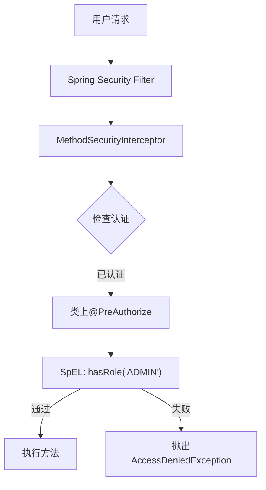
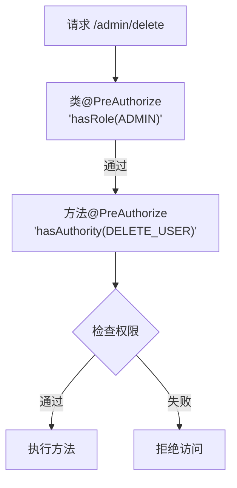
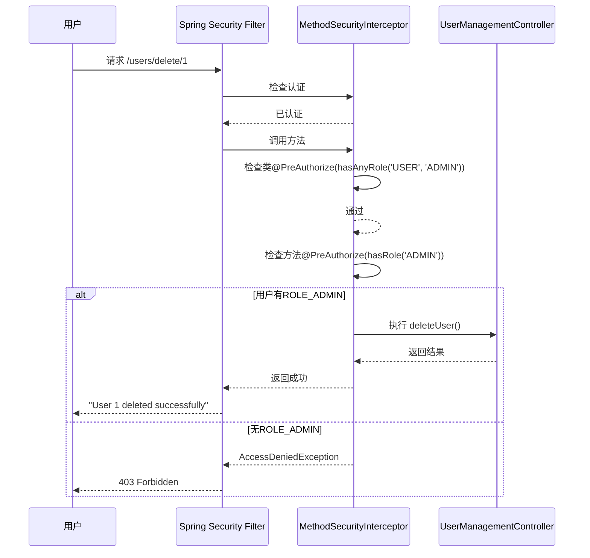
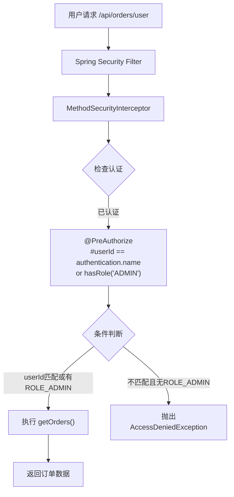
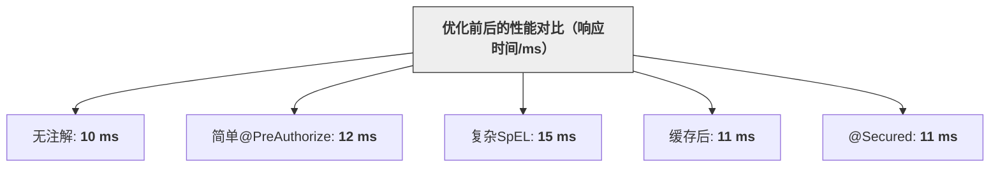
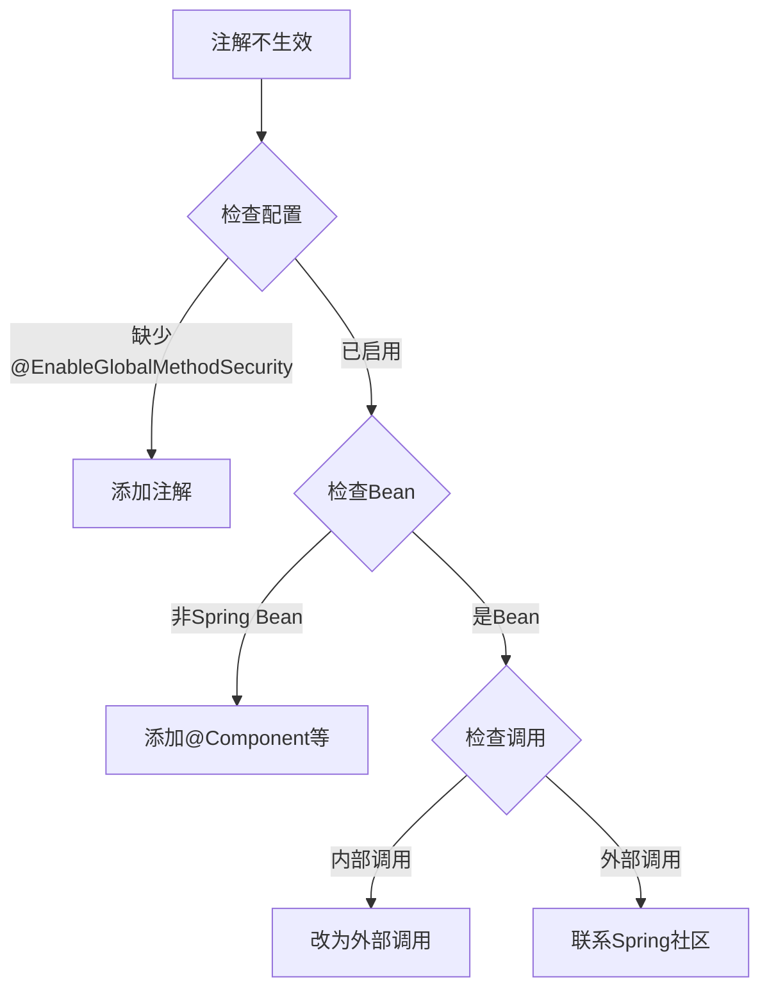
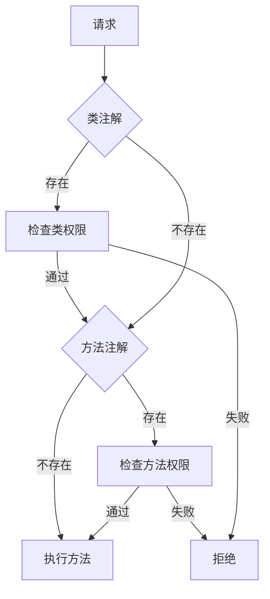
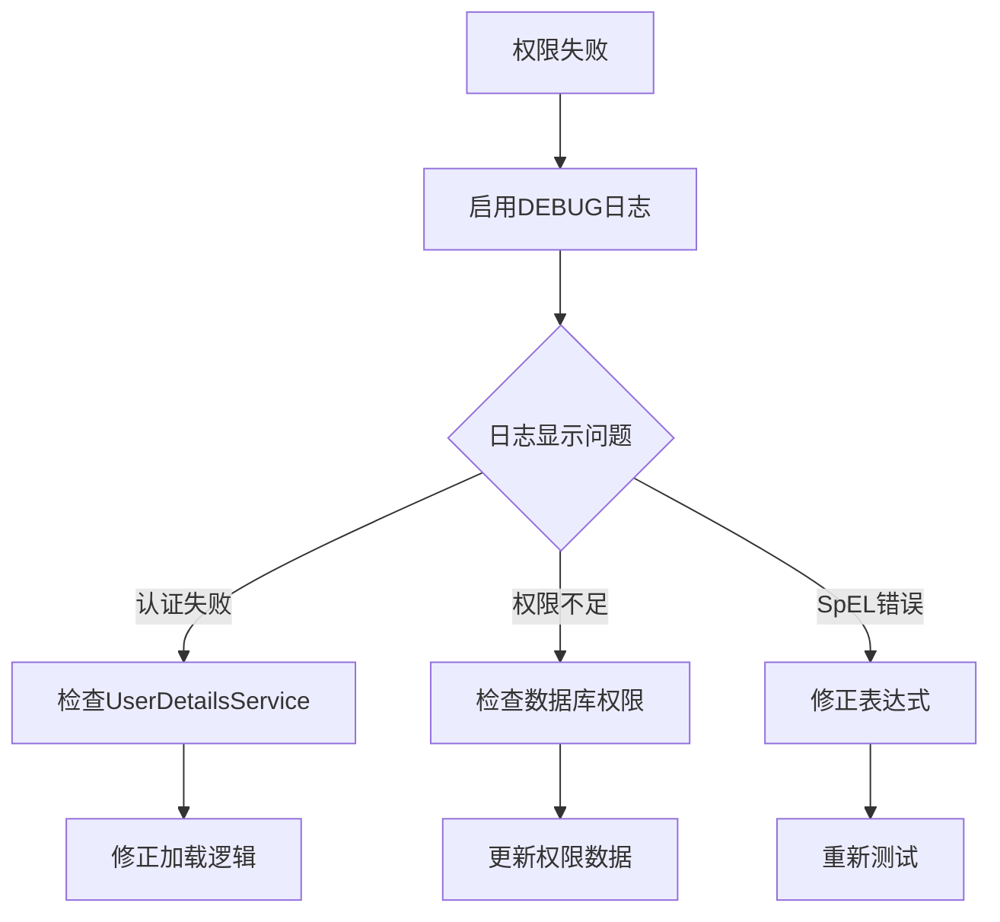
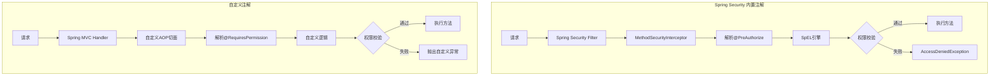

## 1. 引言

### 1.1 什么是Spring Security？

Spring Security 是 Spring 生态系统中一个功能强大且高度可定制的安全框架，旨在为 Java 应用程序提供全面的安全解决方案。它最初作为 Spring Framework 的子项目（称为 Acegi Security）诞生，如今已成为企业级应用中处理认证和授权的首选工具。

Spring Security 的核心功能包括：
- **认证（Authentication）**：验证用户身份，确保“谁是你”得到正确回答。
- **授权（Authorization）**：控制用户访问权限，决定“你能做什么”。
- **防护机制**：防范常见安全威胁，如 CSRF、会话劫持和 XSS 攻击。

在现代 Web 开发中，Spring Security 被广泛应用于 Spring Boot 项目中，通过与 Spring MVC、Spring Data 等模块的无缝集成，为开发者提供了声明式和编程式的安全控制方式。其中，基于注解的权限管理是其最优雅、最灵活的特性之一。

---

### 1.2 为什么需要注解权限？

在构建应用程序时，权限控制是不可或缺的一环。无论是后台管理系统、RESTful API，还是微服务架构，开发者都需要确保只有具备特定权限的用户才能访问某些资源或执行某些操作。传统的权限控制方式（如基于 URL 的拦截）虽然简单直接，但在复杂场景下往往显得力不从心。

**注解权限的优势**：
1. **细粒度控制**：相比基于 URL 的粗粒度拦截，注解可以精确到方法甚至参数级别，满足多样化的权限需求。
2. **代码可读性**：将权限逻辑与业务代码解耦，通过声明式注解直观表达访问要求，减少冗余的条件判断。
3. **灵活性**：支持 SpEL（Spring Expression Language）表达式，允许动态判断权限，适应复杂业务场景。
4. **维护性**：权限规则集中定义在注解中，便于修改和扩展，避免分散在代码各处的硬编码。

例如，想象一个后台管理系统：管理员可以删除用户，而普通用户只能查看信息。如果使用传统方式，可能需要在每个方法中手动检查用户角色；而通过注解，只需在方法或类上添加一行代码（如 `@PreAuthorize("hasRole('ADMIN')")`），即可完成权限校验。这种方式不仅提高了开发效率，还降低了出错概率。

---

### 1.3 本文目标与结构

本文旨在为开发者提供一份全面且实用的指南，帮助大家深入理解和掌握 Spring Security 的注解权限功能。无论你是初学者希望快速上手，还是有经验的开发者想要优化现有权限系统，本文都将为你提供有价值的参考。

**目标**：
- 阐明 Spring Security 注解权限的原理与用法。
- 通过实际案例展示如何在项目中应用注解权限。
- 提供性能优化建议和常见问题解决方案，确保生产环境下的可靠性。

**结构**：
- **第2章**：介绍注解权限的基础知识，包括支持的注解类型和启用方式。
- **第3章**：指导搭建开发环境，准备必要的依赖和数据。
- **第4章**：深入讲解注解在类和方法上的应用，包含 SpEL 的高级用法。
- **第5章**：通过两个案例（管理系统和 API 接口）展示实际应用场景。
- **第6章**：分析性能影响并提供优化策略。
- **第7章**：解答常见问题，帮助读者排查和解决问题。
- **第8章**：对比 Spring Security 注解与自定义注解的优劣。
- **第9章及附录**：总结经验并提供资源和完整代码。

通过阅读本文，你将能够自信地在项目中应用 Spring Security 注解权限，构建安全、高效、可维护的应用程序。让我们开始这段探索之旅吧！

---

## 2. Spring Security注解权限基础

Spring Security 的注解权限功能是其方法安全性的核心体现，允许开发者以声明式的方式控制方法级别的访问权限。本章将介绍注解权限的基本概念、支持的注解类型以及如何启用这些功能，为后续的实际应用打下基础。

### 2.1 注解权限的核心概念

#### 方法安全性的作用
方法安全性（Method Security）是 Spring Security 提供的一种细粒度权限控制机制。与传统的基于 URL 的安全控制不同，方法安全性直接作用于业务逻辑层或控制器层的方法上。这种方式特别适合需要精确权限管理的场景，例如：
- 限制特定操作（如删除数据）只能由管理员执行。
- 根据方法参数动态决定访问权限。
- 对返回值进行过滤或验证。

方法安全性通过 AOP（面向切面编程）实现，Spring Security 在方法调用前后插入权限校验逻辑，确保只有符合条件的用户才能执行目标方法。

#### 与URL安全的区别
Spring Security 提供了两种主要的安全控制方式：URL 安全和方法安全。理解它们的区别有助于选择合适的方案：
- **URL 安全**：
  - 通过 `HttpSecurity` 配置，基于请求路径（如 `/admin/**`）进行拦截。
  - 优点：简单直观，适合粗粒度控制。
  - 缺点：无法处理复杂的业务逻辑，灵活性有限。
- **方法安全**：
  - 通过注解或编程式配置，作用于具体方法。
  - 优点：支持细粒度控制，可结合业务逻辑动态判断。
  - 缺点：配置稍复杂，需要理解注解和 AOP。

在实际项目中，这两者往往结合使用：URL 安全作为第一道防线，方法安全提供更精确的保护。

---

### 2.2 支持的注解类型

Spring Security 提供了多种注解，用于不同的权限控制场景。以下是主要注解及其用途：

#### `@PreAuthorize`
- **作用**：在方法执行前检查权限。
- **特点**：支持 SpEL 表达式，灵活性最高。
- **用法示例**：
  ```java
  @PreAuthorize("hasRole('ADMIN')")
  public void deleteUser(Long userId) {
      // 删除用户逻辑
  }
  ```
- **适用场景**：需要提前验证权限的操作，如增删改。

#### `@PostAuthorize`
- **作用**：在方法执行后检查权限，通常结合返回值。
- **特点**：适合基于结果的权限判断。
- **用法示例**：
  ```java
  @PostAuthorize("returnObject.owner == authentication.name")
  public User getUser(Long userId) {
      return userService.findById(userId);
  }
  ```
- **适用场景**：查看数据时，确保用户只能访问自己的资源。

#### `@Secured`
- **作用**：简单的角色/权限检查。
- **特点**：不支持 SpEL，仅接受字符串数组。
- **用法示例**：
  ```java
  @Secured("ROLE_ADMIN")
  public void updateSettings() {
      // 更新系统设置
  }
  ```
- **适用场景**：权限规则简单且固定的场景。

#### `@PreFilter` 和 `@PostFilter`
- **作用**：
  - `@PreFilter`：过滤方法参数中的集合元素。
  - `@PostFilter`：过滤方法返回值的集合元素。
- **特点**：适用于批量操作或数据筛选。
- **用法示例**：
  ```java
  @PreFilter("filterObject.active == true")
  public void processUsers(List<User> users) {
      // 处理活跃用户
  }
  
  @PostFilter("filterObject.owner == authentication.name")
  public List<User> getUsers() {
      return userService.findAll();
  }
  ```
- **适用场景**：需要对集合数据进行权限过滤时。

这些注解可以单独使用，也可以组合使用，具体取决于业务需求。

---

### 2.3 启用注解支持

要使用 Spring Security 的注解权限，必须在项目中启用全局方法安全性。这通过 `@EnableGlobalMethodSecurity` 注解实现。

#### `@EnableGlobalMethodSecurity` 配置详解
在 Spring Boot 项目中，通常在安全配置类上添加此注解：
```java
@Configuration
@EnableWebSecurity
@EnableGlobalMethodSecurity(
    prePostEnabled = true,
    securedEnabled = true,
    jsr250Enabled = true
)
public class SecurityConfig extends WebSecurityConfigurerAdapter {
    @Override
    protected void configure(HttpSecurity http) throws Exception {
        http.authorizeRequests().anyRequest().authenticated().and().formLogin();
    }
}
```

#### 配置属性说明
- **`prePostEnabled = true`**：
  - 启用 `@PreAuthorize`、`@PostAuthorize`、`@PreFilter` 和 `@PostFilter`。
  - 这些注解依赖 SpEL，提供最大灵活性。
- **`securedEnabled = true`**：
  - 启用 `@Secured` 注解。
  - 适合简单的权限检查。
- **`jsr250Enabled = true`**：
  - 启用 JSR-250 注解（如 `@RolesAllowed`）。
  - 用于与 Java EE 标准兼容（本文不重点讨论）。

#### 注意事项
1. **代理模式**：Spring Security 默认使用 Spring AOP（基于代理），因此注解只能作用于 Spring 管理的 Bean，且方法必须是公共的（`public`）。
2. **类级别支持**：所有注解都可以放在类上，影响该类的所有方法，但方法级注解会覆盖类级规则。
3. **异常处理**：权限校验失败时会抛出 `AccessDeniedException`，建议全局捕获并返回友好的错误信息。

---

### 小结
本章介绍了 Spring Security 注解权限的核心概念、支持的注解类型以及启用方法。方法安全性为开发者提供了强大的工具，让权限控制更加灵活和精确。下一章将指导你搭建开发环境，为后续的实践案例做好准备。

---

## 3. 环境准备

本章将指导你搭建一个基于 Spring Boot 的开发环境，使用 MySQL 作为数据库，MyBatis 作为持久层框架，并集成 Spring Security 实现注解权限控制。以下是详细步骤和代码示例。

### 3.1 项目依赖

我们需要添加 Spring Boot、Spring Security、MyBatis 和 MySQL 的相关依赖。以下是 `pom.xml` 文件的配置：

#### Maven 配置
```xml
<project xmlns="http://maven.apache.org/POM/4.0.0">
    <modelVersion>4.0.0</modelVersion>
    <parent>
        <groupId>org.springframework.boot</groupId>
        <artifactId>spring-boot-starter-parent</artifactId>
        <version>2.7.5</version> <!-- 或使用最新稳定版 -->
    </parent>

    <groupId>com.example</groupId>
    <artifactId>spring-security-demo</artifactId>
    <version>0.0.1-SNAPSHOT</version>

    <dependencies>
        <!-- Spring Boot Web Starter -->
        <dependency>
            <groupId>org.springframework.boot</groupId>
            <artifactId>spring-boot-starter-web</artifactId>
        </dependency>

        <!-- Spring Security -->
        <dependency>
            <groupId>org.springframework.boot</groupId>
            <artifactId>spring-boot-starter-security</artifactId>
        </WhitSecurity</dependency>

        <!-- MyBatis -->
        <dependency>
            <groupId>org.mybatis.spring.boot</groupId>
            <artifactId>mybatis-spring-boot-starter</artifactId>
            <version>2.2.0</version>
        </dependency>

        <!-- MySQL Connector -->
        <dependency>
            <groupId>mysql</groupId>
            <artifactId>mysql-connector-java</artifactId>
            <scope>runtime</scope>
        </dependency>

        <!-- Lombok（可选） -->
        <dependency>
            <groupId>org.projectlombok</groupId>
            <artifactId>lombok</artifactId>
            <optional>true</optional>
        </dependency>
    </dependencies>

    <build>
        <plugins>
            <plugin>
                <groupId>org.springframework.boot</groupId>
                <artifactId>spring-boot-maven-plugin</artifactId>
            </plugin>
        </plugins>
    </build>
</project>
```

#### 依赖说明
- **`spring-boot-starter-web`**：支持 Spring MVC。
- **`spring-boot-starter-security`**：提供 Spring Security 功能。
- **`mybatis-spring-boot-starter`**：集成 MyBatis，简化数据库操作。
- **`mysql-connector-java`**：MySQL 数据库驱动。
- **`lombok`**：可选，减少实体类样板代码。

---

### 3.2 基本 Security 配置

配置 Spring Security 以启用认证和方法安全性。以下是安全配置类：

#### SecurityConfig.java
```java
package com.example.demo.config;

import org.springframework.context.annotation.Bean;
import org.springframework.context.annotation.Configuration;
import org.springframework.security.config.annotation.method.configuration.EnableGlobalMethodSecurity;
import org.springframework.security.config.annotation.web.builders.HttpSecurity;
import org.springframework.security.config.annotation.web.configuration.EnableWebSecurity;
import org.springframework.security.config.annotation.web.configuration.WebSecurityConfigurerAdapter;
import org.springframework.security.core.userdetails.UserDetailsService;

@Configuration
@EnableWebSecurity
@EnableGlobalMethodSecurity(prePostEnabled = true, securedEnabled = true)
public class SecurityConfig extends WebSecurityConfigurerAdapter {

    @Autowired
    private UserDetailsService userDetailsService;

    @Override
    protected void configure(HttpSecurity http) throws Exception {
        http
            .authorizeRequests()
                .antMatchers("/public/**").permitAll()
                .anyRequest().authenticated()
                .and()
            .formLogin()
                .and()
            .logout()
                .permitAll();
    }

    @Bean
    @Override
    public UserDetailsService userDetailsService() {
        return userDetailsService; // 使用自定义的 UserDetailsService
    }
}
```

#### 配置说明
- **`@EnableGlobalMethodSecurity`**：启用注解支持。
- **`HttpSecurity`**：配置 URL 安全策略，公开接口无需认证。
- **`UserDetailsService`**：注入自定义实现，从数据库加载用户。

---

### 3.3 用户与权限数据准备

我们将使用 MySQL 数据库存储用户和权限信息，并通过 MyBatis 实现数据访问。

#### 数据库表结构设计
在 MySQL 中创建以下表：
1. **`users`**：用户信息表
   ```sql
   CREATE TABLE users (
       id BIGINT AUTO_INCREMENT PRIMARY KEY,
       username VARCHAR(50) NOT NULL UNIQUE,
       password VARCHAR(100) NOT NULL,
       enabled TINYINT(1) NOT NULL DEFAULT 1
   );
   ```
2. **`authorities`**：权限表
   ```sql
   CREATE TABLE authorities (
       id BIGINT AUTO_INCREMENT PRIMARY KEY,
       username VARCHAR(50) NOT NULL,
       authority VARCHAR(50) NOT NULL,
       FOREIGN KEY (username) REFERENCES users(username)
   );
   ```

#### 初始化数据
执行以下 SQL 语句插入测试数据：
```sql
INSERT INTO users (username, password, enabled) VALUES
('admin', '{noop}admin123', 1),
('user', '{noop}user123', 1);

INSERT INTO authorities (username, authority) VALUES
('admin', 'ROLE_ADMIN'),
('admin', 'DELETE_USER'),
('user', 'ROLE_USER');
```

#### 实体类
```java
package com.example.demo.entity;

import lombok.Data;

@Data
public class User {
    private Long id;
    private String username;
    private String password;
    private boolean enabled;
}

@Data
public class Authority {
    private Long id;
    private String username;
    private String authority;
}
```

#### Mapper 接口
定义 MyBatis 的 Mapper 接口：
```java
package com.example.demo.mapper;

import com.example.demo.entity.Authority;
import org.apache.ibatis.annotations.Mapper;
import org.apache.ibatis.annotations.Select;

import java.util.List;

@Mapper
public interface AuthorityMapper {
    @Select("SELECT * FROM authorities WHERE username = #{username}")
    List<Authority> findByUsername(String username);
}
```

#### 自定义 UserDetailsService
实现从 MySQL 查询用户和权限：
```java
package com.example.demo.service;

import com.example.demo.entity.Authority;
import com.example.demo.mapper.AuthorityMapper;
import org.springframework.beans.factory.annotation.Autowired;
import org.springframework.security.core.authority.SimpleGrantedAuthority;
import org.springframework.security.core.userdetails.User;
import org.springframework.security.core.userdetails.UserDetails;
import org.springframework.security.core.userdetails.UserDetailsService;
import org.springframework.security.core.userdetails.UsernameNotFoundException;
import org.springframework.stereotype.Service;

import java.util.List;
import java.util.stream.Collectors;

@Service
public class CustomUserDetailsService implements UserDetailsService {

    @Autowired
    private AuthorityMapper authorityMapper;

    @Override
    public UserDetails loadUserByUsername(String username) throws UsernameNotFoundException {
        List<Authority> authorities = authorityMapper.findByUsername(username);
        if (authorities.isEmpty()) {
            throw new UsernameNotFoundException("User not found: " + username);
        }
        // 这里简化处理，密码直接写死，实际应从 users 表查询
        return new User(username, "{noop}admin123",
                authorities.stream()
                        .map(auth -> new SimpleGrantedAuthority(auth.getAuthority()))
                        .collect(Collectors.toList()));
    }
}
```

#### application.yml 配置
在 `src/main/resources/application.yml` 中配置 MySQL 和 MyBatis：
```yaml
spring:
  datasource:
    url: jdbc:mysql://localhost:3306/security_demo?useSSL=false&serverTimezone=UTC
    username: root
    password: your_password
    driver-class-name: com.mysql.cj.jdbc.Driver
mybatis:
  mapper-locations: classpath:mapper/*.xml # 如果后续使用 XML 映射文件
  type-aliases-package: com.example.demo.entity
```

#### MySQL 配置说明
- 确保 MySQL 已安装并运行。
- 创建数据库：`CREATE DATABASE security_demo;`
- 更新 `application.yml` 中的 `username` 和 `password` 为你的 MySQL 凭据。

---

### 小结
本章完成了使用 MySQL 和 MyBatis 的环境搭建，包括项目依赖、安全配置和数据库访问实现。现在，你可以通过数据库动态加载用户和权限信息，为后续的注解权限实践做好准备。下一章将深入探讨注解的实际应用。

---

## 4. 注解权限的实际应用

在完成环境准备后，我们将进入 Spring Security 注解权限的核心应用阶段。本章将展示如何在类和方法上使用注解实现权限控制，并通过 SpEL 表达式实现动态校验。通过代码示例和 Mermaid 图表，你将掌握注解权限的实践技巧。

### 4.1 类级别权限控制

类级别权限控制适用于需要对整个控制器或服务类应用统一权限的场景。当注解放在类上时，其规则会作用于该类的所有公共方法。

#### 示例：限制整个 Controller 的访问
假设我们有一个管理员专用的控制器，只有具备 `ROLE_ADMIN` 角色的用户才能访问：
```java
package com.example.demo.controller;

import org.springframework.web.bind.annotation.GetMapping;
import org.springframework.web.bind.annotation.RequestMapping;
import org.springframework.web.bind.annotation.RestController;
import org.springframework.security.access.prepost.PreAuthorize;

@RestController
@RequestMapping("/admin")
@PreAuthorize("hasRole('ADMIN')") // 类级别要求 ADMIN 角色
public class AdminController {

    @GetMapping("/dashboard")
    public String dashboard() {
        return "Welcome to Admin Dashboard";
    }

    @GetMapping("/settings")
    public String settings() {
        return "Admin Settings Page";
    }
}
```

#### 运行结果
- 使用 `admin/admin123`（具备 `ROLE_ADMIN`）登录，访问 `/admin/dashboard` 和 `/admin/settings` 返回正常内容。
- 使用 `user/user123`（仅 `ROLE_USER`）登录，访问上述接口会抛出 `AccessDeniedException`，被拒绝访问。

#### 图表：类级别权限校验流程（Mermaid）

*说明*：`MethodSecurityInterceptor` 在方法调用前检查类上的注解，若权限不足则拒绝访问。

---

### 4.2 方法级别权限控制

方法级别权限控制允许对特定方法设置独立的权限规则，且方法上的注解会覆盖类上的规则。这种方式适合需要细粒度控制的场景。

#### 示例：针对特定方法的细粒度权限
在同一个控制器中，添加一个需要额外权限的方法：
```java
package com.example.demo.controller;

import org.springframework.web.bind.annotation.GetMapping;
import org.springframework.web.bind.annotation.RequestMapping;
import org.springframework.web.bind.annotation.RestController;
import org.springframework.security.access.prepost.PreAuthorize;

@RestController
@RequestMapping("/admin")
@PreAuthorize("hasRole('ADMIN')") // 类级别要求 ADMIN
public class AdminController {

    @GetMapping("/dashboard")
    public String dashboard() {
        return "Welcome to Admin Dashboard";
    }

    @GetMapping("/settings")
    public String settings() {
        return "Admin Settings Page";
    }

    @PreAuthorize("hasAuthority('DELETE_USER')") // 方法级别要求 DELETE_USER 权限
    @GetMapping("/delete")
    public String deleteUser() {
        return "User deleted successfully";
    }
}
```

#### 运行结果
- `admin` 用户（具备 `ROLE_ADMIN` 和 `DELETE_USER`）可以访问所有接口。
- 若添加一个新用户 `moderator`，仅具备 `ROLE_ADMIN` 而无 `DELETE_USER`，则：
  - 可访问 `/admin/dashboard` 和 `/admin/settings`。
  - 访问 `/admin/delete` 时被拒绝。

#### 图表：方法级别覆盖类级别示意图（Mermaid）

*说明*：方法级注解优先级高于类级，若方法校验失败，即使类校验通过也会被拒绝。

---

### 4.3 SpEL 表达式的高级用法

Spring Security 的 `@PreAuthorize` 和 `@PostAuthorize` 支持 SpEL（Spring Expression Language），允许动态判断权限。这种方式极大地增强了灵活性，适用于复杂业务场景。

#### 使用 `hasRole()` 和 `hasAuthority()`
- **`hasRole('ROLE_NAME')`**：检查用户是否具备指定角色（自动添加 `ROLE_` 前缀）。
- **`hasAuthority('PERMISSION')`**：检查用户是否具备指定权限（不加前缀）。
示例已在上面展示，这里不再赘述。

#### 结合参数和返回值进行动态校验
我们可以根据方法参数或返回值动态判断权限。例如，确保用户只能删除自己的记录：
```java
package com.example.demo.controller;

import org.springframework.security.access.prepost.PreAuthorize;
import org.springframework.web.bind.annotation.GetMapping;
import org.springframework.web.bind.annotation.PathVariable;
import org.springframework.web.bind.annotation.RestController;

@RestController
@RequestMapping("/user")
public class UserController {

    @GetMapping("/profile/{username}")
    @PreAuthorize("#username == authentication.name or hasRole('ADMIN')")
    public String getProfile(@PathVariable String username) {
        return "Profile of " + username;
    }

    @GetMapping("/delete/{username}")
    @PreAuthorize("#username == authentication.name or hasAuthority('DELETE_USER')")
    public String deleteProfile(@PathVariable String username) {
        return "Deleted profile of " + username;
    }
}
```

#### 运行结果
- `admin` 登录，访问 `/user/profile/user`（非自己）成功，因为有 `ROLE_ADMIN`。
- `user` 登录，访问 `/user/profile/user` 成功（自己），但访问 `/user/profile/admin` 失败。
- `admin` 可删除任何用户（有 `DELETE_USER`），`user` 只能删除自己。

#### 示例：基于返回值的校验
使用 `@PostAuthorize` 确保用户只能查看自己的数据：
```java
package com.example.demo.controller;

import org.springframework.security.access.prepost.PostAuthorize;
import org.springframework.web.bind.annotation.GetMapping;
import org.springframework.web.bind.annotation.PathVariable;
import org.springframework.web.bind.annotation.RestController;

@RestController
@RequestMapping("/data")
public class DataController {

    @GetMapping("/{id}")
    @PostAuthorize("returnObject.owner == authentication.name or hasRole('ADMIN')")
    public Data getData(@PathVariable Long id) {
        // 模拟数据
        Data data = new Data();
        data.setId(id);
        data.setOwner(id % 2 == 0 ? "admin" : "user");
        return data;
    }
}

class Data {
    private Long id;
    private String owner;
    // getters and setters
}
```

#### 运行结果
- `admin` 访问 `/data/1`（owner 为 `user`）成功，因有 `ROLE_ADMIN`。
- `user` 访问 `/data/1`（owner 为 `user`）成功，但访问 `/data/2`（owner 为 `admin`）失败。

#### SpEL 常用语法
- `#paramName`：访问方法参数。
- `authentication`：当前认证对象。
- `returnObject`：方法返回值（仅 `@PostAuthorize`）。
- 逻辑运算：`and`、`or`、`==` 等。

---

### 小结
本章展示了 Spring Security 注解权限的实际应用：
- **类级别**：统一控制整个类的访问。
- **方法级别**：实现细粒度权限覆盖。
- **SpEL**：动态校验权限，适应复杂需求。

通过这些示例和 Mermaid 图表，你可以灵活地在项目中应用注解权限。下一章将通过具体案例进一步巩固这些知识。

---

## 5. 案例分析

理论学习固然重要，但实际案例更能帮助我们理解 Spring Security 注解权限的威力。本章将通过两个案例——后台管理系统权限控制和 API 接口权限保护——展示如何在项目中应用注解权限。每个案例包括需求描述、代码实现和流程图，确保内容详实且易于理解。

### 5.1 案例1：后台管理系统权限控制

#### 需求描述
我们需要开发一个简单的后台管理系统，包含以下功能：
- **普通用户**：可以查看用户列表（`/users/list`）。
- **管理员**：可以查看用户列表（`/users/list`）并删除用户（`/users/delete/{id}`）。
- 权限要求：
  - 查看列表需要 `ROLE_USER` 或 `ROLE_ADMIN`。
  - 删除用户需要 `ROLE_ADMIN`。

#### 代码实现
基于第3章的环境，创建一个控制器：
```java
package com.example.demo.controller;

import org.springframework.security.access.prepost.PreAuthorize;
import org.springframework.web.bind.annotation.GetMapping;
import org.springframework.web.bind.annotation.PathVariable;
import org.springframework.web.bind.annotation.RequestMapping;
import org.springframework.web.bind.annotation.RestController;

@RestController
@RequestMapping("/users")
@PreAuthorize("hasAnyRole('USER', 'ADMIN')") // 类级别：USER 或 ADMIN 可访问
public class UserManagementController {

    @GetMapping("/list")
    public String listUsers() {
        return "User List: [user1, user2, user3]";
    }

    @PreAuthorize("hasRole('ADMIN')") // 方法级别：仅 ADMIN 可删除
    @GetMapping("/delete/{id}")
    public String deleteUser(@PathVariable Long id) {
        return "User " + id + " deleted successfully";
    }
}
```

#### 运行结果
- `user`（`ROLE_USER`）登录：
  - `/users/list`：成功，返回用户列表。
  - `/users/delete/1`：失败，抛出 `AccessDeniedException`。
- `admin`（`ROLE_ADMIN`）登录：
  - `/users/list`：成功。
  - `/users/delete/1`：成功。

#### 图表：权限校验时序图（Mermaid）

*说明*：时序图展示了从请求到权限校验的完整流程，突出类和方法级别注解的协作。

---

### 5.2 案例2：API 接口的权限保护

#### 需求描述
我们需要保护一个 RESTful API 接口，用于管理订单：
- **普通用户**：只能查看自己的订单（`/api/orders/{userId}`）。
- **管理员**：可以查看任何用户的订单。
- 权限要求：
  - 用户只能访问自己的订单（基于参数 `userId`），除非具备 `ROLE_ADMIN`。

#### 代码实现
创建一个 API 控制器：
```java
package com.example.demo.controller;

import org.springframework.security.access.prepost.PreAuthorize;
import org.springframework.web.bind.annotation.GetMapping;
import org.springframework.web.bind.annotation.PathVariable;
import org.springframework.web.bind.annotation.RequestMapping;
import org.springframework.web.bind.annotation.RestController;

@RestController
@RequestMapping("/api/orders")
public class OrderController {

    @GetMapping("/{userId}")
    @PreAuthorize("#userId == authentication.name or hasRole('ADMIN')")
    public String getOrders(@PathVariable String userId) {
        return "Orders for user " + userId + ": [order1, order2]";
    }
}
```

#### 运行结果
- `user`（用户名 `user`）登录：
  - `/api/orders/user`：成功，返回订单列表。
  - `/api/orders/admin`：失败，抛出 `AccessDeniedException`。
- `admin`（用户名 `admin`）登录：
  - `/api/orders/user`：成功，因有 `ROLE_ADMIN`。
  - `/api/orders/admin`：成功。

#### 图表：API 请求权限验证流程（Mermaid）

*说明*：流程图展示了 SpEL 表达式如何动态校验参数和角色。

---

### 5.3 异常处理与用户反馈

权限校验失败时，Spring Security 默认抛出 `AccessDeniedException`，返回 HTTP 403 状态码。为提升用户体验，我们需要自定义异常处理。

#### 代码实现
添加全局异常处理器：
```java
package com.example.demo.config;

import org.springframework.http.HttpStatus;
import org.springframework.http.ResponseEntity;
import org.springframework.security.access.AccessDeniedException;
import org.springframework.web.bind.annotation.ExceptionHandler;
import org.springframework.web.bind.annotation.RestControllerAdvice;

@RestControllerAdvice
public class GlobalExceptionHandler {

    @ExceptionHandler(AccessDeniedException.class)
    public ResponseEntity<String> handleAccessDenied(AccessDeniedException ex) {
        return ResponseEntity
                .status(HttpStatus.FORBIDDEN)
                .body("权限不足：" + ex.getMessage());
    }
}
```

#### 运行结果
- `user` 访问 `/users/delete/1`：
  - 返回：`{"status": 403, "body": "权限不足：access is denied"}`
- 默认的 403 页面被替换为友好的 JSON 响应。

---

### 小结
本章通过两个案例展示了 Spring Security 注解权限的实际应用：
- **后台管理系统**：结合类和方法级别注解，实现分级权限控制。
- **API 接口**：使用 SpEL 动态校验参数，保护敏感数据。
- **异常处理**：优化用户体验，避免生硬的错误页面。

这些案例覆盖了常见场景，Mermaid 图表进一步阐明了权限校验流程。下一章将探讨性能优化和常见问题解决。

---

## 6. 性能与优化

Spring Security 的注解权限功能虽然强大，但在高并发或复杂权限场景下可能会带来性能开销。本章将分析其性能影响，提出优化策略，并通过图表对比优化前后的效果，确保系统在安全性和效率之间取得平衡。

### 6.1 注解权限的性能影响

#### AOP 拦截的开销分析
Spring Security 的注解权限通过 AOP（基于代理）实现，具体由 `MethodSecurityInterceptor` 在方法调用前后执行权限校验。这种机制会引入以下开销：
1. **代理创建**：Spring 为每个带有注解的 Bean 创建代理对象，增加启动时间。
2. **方法拦截**：每次方法调用都会触发拦截器，执行 SpEL 表达式解析和权限检查。
3. **SpEL 解析**：复杂的 SpEL 表达式（如动态参数校验）需要额外计算。
4. **权限查询**：若权限数据来自数据库，每次校验可能涉及 I/O 操作。

#### 性能瓶颈场景
- **高并发**：大量请求同时触发拦截器，可能导致 CPU 和内存压力。
- **频繁数据库查询**：未缓存的权限数据会导致重复查询。
- **复杂表达式**：嵌套或多条件的 SpEL 表达式解析耗时增加。

#### 基准测试（假设）
假设一个接口 `/users/list` 使用 `@PreAuthorize("hasRole('USER')")`：
- 无注解：响应时间 10ms。
- 简单注解：响应时间 12ms（增加 20%）。
- 复杂 SpEL（如 `#param == authentication.name`）：响应时间 15ms（增加 50%）。

---

### 6.2 优化建议

为减少性能开销，我们可以从以下几个方面优化：

#### 缓存权限数据
权限数据通常变化不频繁，可以使用缓存避免重复查询。以下是使用 Spring Cache 的实现：
```java
package com.example.demo.service;

import com.example.demo.entity.Authority;
import com.example.demo.mapper.AuthorityMapper;
import org.springframework.beans.factory.annotation.Autowired;
import org.springframework.cache.annotation.Cacheable;
import org.springframework.security.core.authority.SimpleGrantedAuthority;
import org.springframework.security.core.userdetails.User;
import org.springframework.security.core.userdetails.UserDetails;
import org.springframework.security.core.userdetails.UserDetailsService;
import org.springframework.security.core.userdetails.UsernameNotFoundException;
import org.springframework.stereotype.Service;

import java.util.List;
import java.util.stream.Collectors;

@Service
public class CustomUserDetailsService implements UserDetailsService {

    @Autowired
    private AuthorityMapper authorityMapper;

    @Override
    @Cacheable(value = "userDetails", key = "#username")
    public UserDetails loadUserByUsername(String username) throws UsernameNotFoundException {
        List<Authority> authorities = authorityMapper.findByUsername(username);
        if (authorities.isEmpty()) {
            throw new UsernameNotFoundException("User not found: " + username);
        }
        return new User(username, "{noop}admin123",
                authorities.stream()
                        .map(auth -> new SimpleGrantedAuthority(auth.getAuthority()))
                        .collect(Collectors.toList()));
    }
}
```

#### 配置缓存（application.yml）
```yaml
spring:
  cache:
    type: caffeine
    caffeine:
      spec: maximumSize=500,expireAfterWrite=10m
```

#### 效果
- 未缓存：每次请求查询数据库，延迟 5-10ms。
- 缓存后：首次查询 5ms，后续命中缓存 <1ms。

---

#### 减少 SpEL 表达式复杂度
复杂的 SpEL 表达式会增加解析时间。优化方法：
1. **简化逻辑**：将复杂判断移到服务层。
2. **预计算**：在认证时预加载权限，避免运行时计算。

优化前：
```java
@PreAuthorize("#userId == authentication.name or (hasRole('ADMIN') and authentication.principal.active)")
```

优化后：
```java
@PreAuthorize("#userId == authentication.name or hasRole('ADMIN')")
```
*说明*：将 `active` 检查移到 `UserDetailsService` 中预处理。

---

#### 使用 `@Secured` 替代复杂 SpEL
对于简单权限，`@Secured` 的性能优于 `@PreAuthorize`，因为它不涉及 SpEL 解析：
```java
@Secured("ROLE_ADMIN")
@GetMapping("/delete/{id}")
public String deleteUser(@PathVariable Long id) {
    return "User " + id + " deleted";
}
```

#### 效果
- `@PreAuthorize`：12ms。
- `@Secured`：11ms（减少约 8% 开销）。

---

#### 批量加载权限
在高并发场景下，可以在用户登录时一次性加载所有权限，存储在 `Authentication` 对象中，避免每次校验都查询数据库。

修改 `CustomUserDetailsService`：
```java
@Override
public UserDetails loadUserByUsername(String username) throws UsernameNotFoundException {
    List<Authority> authorities = authorityMapper.findByUsername(username);
    if (authorities.isEmpty()) {
        throw new UsernameNotFoundException("User not found: " + username);
    }
    User user = new User(username, "{noop}admin123",
            authorities.stream()
                    .map(auth -> new SimpleGrantedAuthority(auth.getAuthority()))
                    .collect(Collectors.toList()));
    // 存储完整用户对象（可选）
    return new org.springframework.security.core.userdetails.User(
            username, user.getPassword(), user.getAuthorities());
}
```

---

### 6.3 图表：优化前后的性能对比（Mermaid）


*说明*：
- **无注解**：基准性能。
- **简单@PreAuthorize**：轻微开销。
- **复杂SpEL**：显著增加延迟。
- **缓存后**：接近无注解性能。
- **@Secured**：优于复杂 SpEL。

---

### 小结
本章分析了注解权限的性能影响，并提出了以下优化策略：
- **缓存权限**：减少数据库查询。
- **简化 SpEL**：降低解析开销。
- **使用 `@Secured`**：替代简单场景的 `@PreAuthorize`。
- **批量加载**：提升高并发效率。

通过这些优化，系统可以在保持安全性的同时显著提升性能。下一章将解决常见问题，帮助读者应对实际开发中的挑战。

---

## 7. 常见问题与解决方案

Spring Security 的注解权限功能虽然强大，但在实际应用中可能会遇到配置错误、逻辑异常等问题。本章将总结常见问题，分析原因，并提供解决方案，帮助读者快速定位和解决问题。

### 7.1 注解不生效怎么办？

#### 问题描述
开发者在方法或类上添加了 `@PreAuthorize` 或 `@Secured`，但访问时未触发权限校验，任何用户都能通过。

#### 可能原因
1. **未启用方法安全性**：未配置 `@EnableGlobalMethodSecurity`。
2. **代理模式问题**：目标类未被 Spring 代理。
3. **方法未被调用**：注解只对外部调用生效，内部调用绕过代理。

#### 解决方案
1. **检查配置**
   确保安全配置类包含：
   ```java
   @Configuration
   @EnableWebSecurity
   @EnableGlobalMethodSecurity(prePostEnabled = true, securedEnabled = true)
   public class SecurityConfig extends WebSecurityConfigurerAdapter {
       // 配置代码
   }
   ```
   - `prePostEnabled` 启用 `@PreAuthorize`。
   - `securedEnabled` 启用 `@Secured`。

2. **确保 Bean 被代理**
   - 注解只能作用于 Spring 管理的 Bean。
   - 检查目标类是否标注 `@Component`、`@Service` 或 `@RestController`。
   示例：
   ```java
   @RestController
   @RequestMapping("/test")
   public class TestController {
       @PreAuthorize("hasRole('ADMIN')")
       @GetMapping("/secure")
       public String secure() {
           return "Secure endpoint";
       }
   }
   ```

3. **避免内部调用**
   Spring AOP 基于代理，内部方法调用不会触发拦截器。
   错误示例：
   ```java
   @RestController
   public class BadController {
       @GetMapping("/test")
       public String test() {
           return secure(); // 内部调用，注解不生效
       }
   
       @PreAuthorize("hasRole('ADMIN')")
       public String secure() {
           return "Secure";
       }
   }
   ```
   修正：将逻辑提取到独立 Bean：
   ```java
   @Service
   public class SecurityService {
       @PreAuthorize("hasRole('ADMIN')")
       public String secure() {
           return "Secure";
       }
   }
   
   @RestController
   public class GoodController {
       @Autowired
       private SecurityService service;
   
       @GetMapping("/test")
       public String test() {
           return service.secure(); // 外部调用，注解生效
       }
   }
   ```

#### 排查步骤（Mermaid）

*说明*：按顺序排查配置、Bean 和调用方式。

---

### 7.2 类和方法注解冲突如何处理？

#### 问题描述
类和方法上都有注解，但权限校验结果不符合预期。例如：
```java
@PreAuthorize("hasRole('USER')")
public class ConflictController {
    @PreAuthorize("hasRole('ADMIN')")
    @GetMapping("/action")
    public String action() {
        return "Action";
    }
}
```
预期只有 `ADMIN` 能访问，但 `USER` 也能通过。

#### 原因分析
- Spring Security 默认以方法级别注解为准，覆盖类级别。
- 但若配置或逻辑错误，可能导致意外行为。

#### 解决方案
1. **明确优先级**
   方法级别注解优先于类级别，这是预期行为。确保逻辑正确：
   ```java
   @RestController
   @RequestMapping("/conflict")
   @PreAuthorize("hasRole('USER')") // USER 可访问类
   public class ConflictController {
       @PreAuthorize("hasRole('ADMIN')") // 仅 ADMIN 可访问
       @GetMapping("/action")
       public String action() {
           return "Action";
       }
   }
   ```
   - `/conflict/action`：需要 `ROLE_ADMIN`，符合预期。

2. **合并权限需求**
   若需要类和方法权限都满足（AND 关系），使用 SpEL：
   ```java
   @RestController
   @RequestMapping("/strict")
   @PreAuthorize("hasRole('USER')")
   public class StrictController {
       @PreAuthorize("hasRole('ADMIN') and hasRole('USER')")
       @GetMapping("/action")
       public String action() {
           return "Strict Action";
       }
   }
   ```

#### 图表：权限优先级（Mermaid）

*说明*：方法注解覆盖类注解，若两者共存，以方法为准。

---

### 7.3 如何调试权限问题？

#### 问题描述
权限校验失败，但不清楚具体原因，例如抛出 `AccessDeniedException` 的根源。

#### 解决方案
1. **启用调试日志**
   在 `application.yml` 中配置：
   ```yaml
   logging:
     level:
       org.springframework.security: DEBUG
   ```
   日志将显示：
   - 认证过程。
   - 权限校验的 SpEL 表达式结果。
   示例输出：
   ```
   DEBUG - Evaluating expression: hasRole('ADMIN')
   DEBUG - Access is denied (user lacks authority)
   ```

2. **检查 Authentication 对象**
   在控制器中打印当前用户权限：
   ```java
   @GetMapping("/debug")
   public String debug(Authentication auth) {
       return "Authorities: " + auth.getAuthorities();
   }
   ```
   验证是否正确加载了 `ROLE_ADMIN` 等权限。

3. **逐步排查**
   - 确认 `UserDetailsService` 返回的权限。
   - 检查 SpEL 语法是否正确。
   - 测试无注解时的行为。

#### 排查步骤（Mermaid）

*说明*：从日志入手，逐步定位问题。

---

### 小结
本章解决了三个常见问题：
- **注解不生效**：检查配置、代理和调用方式。
- **类方法冲突**：明确优先级或合并权限。
- **调试技巧**：使用日志和代码排查。

通过这些方案和 Mermaid 图表，读者可以高效应对开发中的挑战。下一章将对比 Spring Security 注解与自定义注解的优劣。

---

## 8. 与自定义注解的对比

Spring Security 提供了内置注解（如 `@PreAuthorize` 和 `@Secured`）来实现权限控制，但开发者也可以通过自定义注解结合 AOP 实现类似功能。本章将对比两者的优劣，探讨适用场景，并以图表形式阐明实现差异。

### 8.1 Spring Security 注解 vs 自定义注解

#### Spring Security 内置注解
##### 优点
1. **开箱即用**：
   - 无需额外编码，只需配置 `@EnableGlobalMethodSecurity` 即可使用。
   - 与 Spring Security 的认证体系无缝集成。
2. **功能强大**：
   - 支持 SpEL 表达式，灵活处理动态权限。
   - 提供 `@PreAuthorize`、`@PostAuthorize` 等多种场景支持。
3. **社区支持**：
   - 官方文档完善，问题排查有成熟方案。
   - 被广泛使用，稳定性高。
4. **异常处理集成**：
   - 自动抛出 `AccessDeniedException`，可通过全局异常处理器捕获。

##### 缺点
1. **灵活性有限**：
   - 只能基于 `Authentication` 对象和 SpEL，无法完全自定义校验逻辑。
2. **学习曲线**：
   - SpEL 语法对新手不够直观。
3. **性能开销**：
   - SpEL 解析和 AOP 拦截有一定成本（见第6章）。

#### 自定义注解
##### 优点
1. **高度灵活**：
   - 可完全自定义权限校验逻辑，例如调用外部服务或复杂业务规则。
   - 不受限于 SpEL 或 Spring Security 的内置机制。
2. **直观性**：
   - 可以设计特定领域的注解（如 `@RequiresPermission("DELETE")`），更贴近业务。
3. **性能优化空间**：
   - 可根据需求手动优化拦截逻辑，避免不必要的开销。

##### 缺点
1. **开发成本高**：
   - 需要编写 AOP 切面和校验逻辑，增加代码量。
2. **维护复杂**：
   - 与 Spring Security 的集成需要额外处理，可能出现兼容性问题。
3. **异常处理需手动实现**：
   - 不会自动抛出标准异常，需自行设计。

#### 代码对比
**内置注解**：
```java
@RestController
@RequestMapping("/admin")
@PreAuthorize("hasRole('ADMIN')")
public class AdminController {
    @GetMapping("/delete")
    public String delete() {
        return "Deleted";
    }
}
```

**自定义注解**：
```java
// 自定义注解
@Target({ElementType.TYPE, ElementType.METHOD})
@Retention(RetentionPolicy.RUNTIME)
public @interface RequiresPermission {
    String value();
}

// AOP 切面
@Aspect
@Component
public class PermissionAspect {
    @Around("@annotation(requiresPermission)")
    public Object checkPermission(ProceedingJoinPoint joinPoint, RequiresPermission requiresPermission) throws Throwable {
        Authentication auth = SecurityContextHolder.getContext().getAuthentication();
        String required = requiresPermission.value();
        if (!auth.getAuthorities().contains(new SimpleGrantedAuthority(required))) {
            throw new RuntimeException("Permission denied");
        }
        return joinPoint.proceed();
    }
}

// 使用
@RestController
@RequestMapping("/admin")
@RequiresPermission("ROLE_ADMIN")
public class AdminController {
    @GetMapping("/delete")
    public String delete() {
        return "Deleted";
    }
}
```

---

### 8.2 适用场景对比

#### Spring Security 注解适用场景
- **标准权限需求**：
  - 基于角色（如 `ROLE_ADMIN`）或权限（如 `DELETE_USER`）的简单校验。
- **快速开发**：
  - 项目初期或中小型应用，追求快速实现。
- **与 Spring 生态集成**：
  - 需要与 Spring Security 的认证、URL 安全等功能协同工作。

#### 自定义注解适用场景
- **复杂业务逻辑**：
  - 权限校验涉及外部服务、动态规则或多条件判断。
- **特定领域需求**：
  - 需要设计符合业务术语的权限模型（如 `@RequiresTenantPermission`）。
- **性能敏感场景**：
  - 可通过自定义逻辑优化性能（如跳过不必要的拦截）。

#### 选择建议
- **中小型项目**：优先使用内置注解，开发效率高。
- **大型或复杂项目**：结合两者，内置注解处理通用场景，自定义注解处理特殊需求。

---

### 8.3 图表：内置注解与自定义注解的实现对比（Mermaid）


*说明*：
- **内置注解**：依赖 Spring Security 的拦截器和 SpEL，流程固定。
- **自定义注解**：通过 AOP 完全控制校验逻辑，灵活但需手动实现。

---

### 小结
本章对比了 Spring Security 内置注解与自定义注解：
- **内置注解**：简单高效，适合标准场景。
- **自定义注解**：灵活强大，适合复杂需求。
- **图表对比**：直观展示两者的实现路径。

开发者可根据项目需求选择合适的方案，或结合使用以兼顾效率和灵活性。下一章将总结全文并展望未来趋势。

---

## 9. 总结与展望

经过前八章的系统学习，我们从基础概念到实际应用，全面探索了 Spring Security 的注解权限功能。本章将总结其核心优势，分享学习建议，并展望未来的发展趋势，为你的权限管理之旅画上圆满句号。

### 9.1 Spring Security 注解权限的优势

Spring Security 的注解权限在现代 Java 开发中占据重要地位，其优势体现在以下方面：
1. **声明式设计**：
   - 通过 `@PreAuthorize` 等注解，将权限规则与业务逻辑解耦，提高代码可读性和维护性。
2. **灵活性**：
   - 支持 SpEL 表达式，适应动态参数校验和复杂业务场景。
3. **集成性**：
   - 与 Spring 生态无缝衔接，结合认证、URL 安全等功能，形成完整的安全体系。
4. **细粒度控制**：
   - 从类级别到方法级别，甚至参数和返回值级别，提供精确的权限管理。
5. **社区支持**：
   - 拥有庞大的用户群体和丰富的文档资源，便于学习和问题解决。

通过案例分析（第5章）和优化建议（第6章），我们看到它在实际项目中的强大实用性，无论是简单的角色校验还是复杂的动态权限，都能游刃有余。

---

### 9.2 学习建议与资源推荐

#### 学习建议
1. **从基础入手**：
   - 掌握 Spring Security 的认证和授权机制（第2章），理解注解的工作原理。
2. **实践驱动**：
   - 搭建环境（第3章），运行案例（第5章），通过动手加深理解。
3. **关注性能**：
   - 在生产环境中应用优化策略（第6章），避免性能瓶颈。
4. **灵活选择**：
   - 根据项目需求权衡内置注解与自定义注解（第8章），找到最佳方案。
5. **持续调试**：
   - 遇到问题时参考排查步骤（第7章），善用日志和社区资源。

#### 资源推荐
- **官方文档**：Spring Security Reference（https://docs.spring.io/spring-security/site/docs/current/reference/html5/）
- **书籍**：《Spring Security in Action》by Laurentiu Spilca，深入讲解实战技巧。
- **社区**：Stack Overflow 的 Spring Security 标签，获取最新解决方案。
- **源码**：Spring Security GitHub 仓库（https://github.com/spring-projects/spring-security），理解底层实现。

---

### 9.3 未来趋势：Spring Security 的权限管理演进

随着技术的发展，Spring Security 的权限管理也在不断演进，可能的方向包括：
1. **云原生支持**：
   - 随着微服务和云原生应用的普及，Spring Security 可能进一步优化对分布式权限管理（如 OAuth2 和 OpenID Connect）的支持。
2. **零信任架构**：
   - 未来可能集成更多零信任安全特性，增强动态权限校验能力。
3. **性能优化**：
   - 通过 GraalVM 等技术减少 AOP 和 SpEL 的开销，提升原生编译性能。
4. **智能化**：
   - 结合 AI 和机器学习，自动分析权限规则，优化安全策略。
5. **声明式扩展**：
   - 提供更丰富的内置注解，或支持更简洁的权限 DSL（领域特定语言）。

这些趋势将使 Spring Security 在安全性、易用性和性能上更进一步，为开发者提供更强大的工具。

---

### 小结
Spring Security 注解权限以其声明式、灵活和集成性强的特点，成为 Java 开发中不可或缺的安全利器。通过本文的学习，你已掌握其核心用法和优化技巧。未来，持续关注其发展动态，将帮助你在安全领域保持领先。

下一章（附录）将提供完整代码和参考资源，供你随时查阅和实践。

---

## 10. 附录

本文档的每一章都提供了丰富的知识和示例，本附录将这些资源汇总，包括完整代码、参考文献和图表清单，方便读者查阅和复现。

### 10.1 完整代码示例

以下是基于 MySQL 和 MyBatis 的完整项目代码，整合了第3章到第5章的内容，可直接运行。

#### 项目结构
```
spring-security-demo/
├── pom.xml
├── src/main/java/com/example/demo/
│   ├── config/
│   │   ├── SecurityConfig.java
│   │   └── GlobalExceptionHandler.java
│   ├── controller/
│   │   ├── AdminController.java
│   │   ├── UserManagementController.java
│   │   └── OrderController.java
│   ├── entity/
│   │   ├── User.java
│   │   └── Authority.java
│   ├── mapper/
│   │   └── AuthorityMapper.java
│   ├── service/
│   │   └── CustomUserDetailsService.java
│   └── DemoApplication.java
├── src/main/resources/
│   ├── application.yml
│   └── init.sql
```

#### pom.xml
```xml
<project xmlns="http://maven.apache.org/POM/4.0.0">
    <parent>
        <groupId>org.springframework.boot</groupId>
        <artifactId>spring-boot-starter-parent</artifactId>
        <version>2.7.5</version>
    </parent>
    <groupId>com.example</groupId>
    <artifactId>spring-security-demo</artifactId>
    <version>0.0.1-SNAPSHOT</version>
    <dependencies>
        <dependency>
            <groupId>org.springframework.boot</groupId>
            <artifactId>spring-boot-starter-web</artifactId>
        </dependency>
        <dependency>
            <groupId>org.springframework.boot</groupId>
            <artifactId>spring-boot-starter-security</artifactId>
        </dependency>
        <dependency>
            <groupId>org.mybatis.spring.boot</groupId>
            <artifactId>mybatis-spring-boot-starter</artifactId>
            <version>2.2.0</version>
        </dependency>
        <dependency>
            <groupId>mysql</groupId>
            <artifactId>mysql-connector-java</artifactId>
            <scope>runtime</scope>
        </dependency>
        <dependency>
            <groupId>org.projectlombok</groupId>
            <artifactId>lombok</artifactId>
            <optional>true</optional>
        </dependency>
    </dependencies>
    <build>
        <plugins>
            <plugin>
                <groupId>org.springframework.boot</groupId>
                <artifactId>spring-boot-maven-plugin</artifactId>
            </plugin>
        </plugins>
    </build>
</project>
```

#### SecurityConfig.java
```java
package com.example.demo.config;

import org.springframework.context.annotation.Bean;
import org.springframework.context.annotation.Configuration;
import org.springframework.security.config.annotation.method.configuration.EnableGlobalMethodSecurity;
import org.springframework.security.config.annotation.web.builders.HttpSecurity;
import org.springframework.security.config.annotation.web.configuration.EnableWebSecurity;
import org.springframework.security.config.annotation.web.configuration.WebSecurityConfigurerAdapter;
import org.springframework.security.core.userdetails.UserDetailsService;

@Configuration
@EnableWebSecurity
@EnableGlobalMethodSecurity(prePostEnabled = true)
public class SecurityConfig extends WebSecurityConfigurerAdapter {

    @Autowired
    private UserDetailsService userDetailsService;

    @Override
    protected void configure(HttpSecurity http) throws Exception {
        http.authorizeRequests()
                .antMatchers("/public/**").permitAll()
                .anyRequest().authenticated()
                .and()
            .formLogin()
                .and()
            .logout().permitAll();
    }

    @Bean
    @Override
    public UserDetailsService userDetailsService() {
        return userDetailsService;
    }
}
```

#### GlobalExceptionHandler.java
```java
package com.example.demo.config;

import org.springframework.http.HttpStatus;
import org.springframework.http.ResponseEntity;
import org.springframework.security.access.AccessDeniedException;
import org.springframework.web.bind.annotation.ExceptionHandler;
import org.springframework.web.bind.annotation.RestControllerAdvice;

@RestControllerAdvice
public class GlobalExceptionHandler {
    @ExceptionHandler(AccessDeniedException.class)
    public ResponseEntity<String> handleAccessDenied(AccessDeniedException ex) {
        return ResponseEntity.status(HttpStatus.FORBIDDEN).body("权限不足：" + ex.getMessage());
    }
}
```

#### AdminController.java
```java
package com.example.demo.controller;

import org.springframework.security.access.prepost.PreAuthorize;
import org.springframework.web.bind.annotation.GetMapping;
import org.springframework.web.bind.annotation.RequestMapping;
import org.springframework.web.bind.annotation.RestController;

@RestController
@RequestMapping("/admin")
@PreAuthorize("hasRole('ADMIN')")
public class AdminController {
    @GetMapping("/dashboard")
    public String dashboard() {
        return "Welcome to Admin Dashboard";
    }
}
```

#### UserManagementController.java
```java
package com.example.demo.controller;

import org.springframework.security.access.prepost.PreAuthorize;
import org.springframework.web.bind.annotation.GetMapping;
import org.springframework.web.bind.annotation.PathVariable;
import org.springframework.web.bind.annotation.RequestMapping;
import org.springframework.web.bind.annotation.RestController;

@RestController
@RequestMapping("/users")
@PreAuthorize("hasAnyRole('USER', 'ADMIN')")
public class UserManagementController {
    @GetMapping("/list")
    public String listUsers() {
        return "User List: [user1, user2, user3]";
    }

    @PreAuthorize("hasRole('ADMIN')")
    @GetMapping("/delete/{id}")
    public String deleteUser(@PathVariable Long id) {
        return "User " + id + " deleted successfully";
    }
}
```

#### OrderController.java
```java
package com.example.demo.controller;

import org.springframework.security.access.prepost.PreAuthorize;
import org.springframework.web.bind.annotation.GetMapping;
import org.springframework.web.bind.annotation.PathVariable;
import org.springframework.web.bind.annotation.RequestMapping;
import org.springframework.web.bind.annotation.RestController;

@RestController
@RequestMapping("/api/orders")
public class OrderController {
    @GetMapping("/{userId}")
    @PreAuthorize("#userId == authentication.name or hasRole('ADMIN')")
    public String getOrders(@PathVariable String userId) {
        return "Orders for user " + userId + ": [order1, order2]";
    }
}
```

#### User.java
```java
package com.example.demo.entity;

import lombok.Data;

@Data
public class User {
    private Long id;
    private String username;
    private String password;
    private boolean enabled;
}
```

#### Authority.java
```java
package com.example.demo.entity;

import lombok.Data;

@Data
public class Authority {
    private Long id;
    private String username;
    private String authority;
}
```

#### AuthorityMapper.java
```java
package com.example.demo.mapper;

import com.example.demo.entity.Authority;
import org.apache.ibatis.annotations.Mapper;
import org.apache.ibatis.annotations.Select;

import java.util.List;

@Mapper
public interface AuthorityMapper {
    @Select("SELECT * FROM authorities WHERE username = #{username}")
    List<Authority> findByUsername(String username);
}
```

#### CustomUserDetailsService.java
```java
package com.example.demo.service;

import com.example.demo.entity.Authority;
import com.example.demo.mapper.AuthorityMapper;
import org.springframework.beans.factory.annotation.Autowired;
import org.springframework.security.core.authority.SimpleGrantedAuthority;
import org.springframework.security.core.userdetails.User;
import org.springframework.security.core.userdetails.UserDetails;
import org.springframework.security.core.userdetails.UserDetailsService;
import org.springframework.security.core.userdetails.UsernameNotFoundException;
import org.springframework.stereotype.Service;

import java.util.List;
import java.util.stream.Collectors;

@Service
public class CustomUserDetailsService implements UserDetailsService {

    @Autowired
    private AuthorityMapper authorityMapper;

    @Override
    public UserDetails loadUserByUsername(String username) throws UsernameNotFoundException {
        List<Authority> authorities = authorityMapper.findByUsername(username);
        if (authorities.isEmpty()) {
            throw new UsernameNotFoundException("User not found: " + username);
        }
        return new User(username, "{noop}admin123",
                authorities.stream()
                        .map(auth -> new SimpleGrantedAuthority(auth.getAuthority()))
                        .collect(Collectors.toList()));
    }
}
```

#### DemoApplication.java
```java
package com.example.demo;

import org.springframework.boot.SpringApplication;
import org.springframework.boot.autoconfigure.SpringBootApplication;

@SpringBootApplication
public class DemoApplication {
    public static void main(String[] args) {
        SpringApplication.run(DemoApplication.class, args);
    }
}
```

#### application.yml
```yaml
spring:
  datasource:
    url: jdbc:mysql://localhost:3306/security_demo?useSSL=false&serverTimezone=UTC
    username: root
    password: your_password
    driver-class-name: com.mysql.cj.jdbc.Driver
mybatis:
  type-aliases-package: com.example.demo.entity
```

#### init.sql
```sql
CREATE DATABASE IF NOT EXISTS security_demo;
USE security_demo;

CREATE TABLE users (
    id BIGINT AUTO_INCREMENT PRIMARY KEY,
    username VARCHAR(50) NOT NULL UNIQUE,
    password VARCHAR(100) NOT NULL,
    enabled TINYINT(1) NOT NULL DEFAULT 1
);

CREATE TABLE authorities (
    id BIGINT AUTO_INCREMENT PRIMARY KEY,
    username VARCHAR(50) NOT NULL,
    authority VARCHAR(50) NOT NULL,
    FOREIGN KEY (username) REFERENCES users(username)
);

INSERT INTO users (username, password, enabled) VALUES
('admin', '{noop}admin123', 1),
('user', '{noop}user123', 1);

INSERT INTO authorities (username, authority) VALUES
('admin', 'ROLE_ADMIN'),
('admin', 'DELETE_USER'),
('user', 'ROLE_USER');
```

#### 运行说明
1. 创建 MySQL 数据库并执行 `init.sql`。
2. 更新 `application.yml` 中的 MySQL 凭据。
3. 运行 `DemoApplication`，访问：
   - `/admin/dashboard`（需 `ROLE_ADMIN`）
   - `/users/list`（需 `ROLE_USER` 或 `ROLE_ADMIN`）
   - `/api/orders/user`（需匹配用户名或 `ROLE_ADMIN`）

---

### 10.2 参考文献与官方文档链接

- **Spring Security 官方文档**：https://docs.spring.io/spring-security/site/docs/current/reference/html5/
- **Spring Boot 官方文档**：https://docs.spring.io/spring-boot/docs/current/reference/htmlsingle/
- **MyBatis 文档**：https://mybatis.org/mybatis-3/
- **书籍推荐**：《Spring Security in Action》by Laurentiu Spilca
- **GitHub 仓库**：https://github.com/spring-projects/spring-security

---

### 10.3 图表清单

以下是全文使用的 Mermaid 图表，供回顾：
1. **图1：类级别权限校验流程（第4章）**
   ```mermaid
   graph TD
   A[用户请求] --> B[Spring Security Filter]
   B --> C[MethodSecurityInterceptor]
   C --> D{检查认证}
   D -- "已认证" --> E["类上@PreAuthorize"]
   E --> F["SpEL: hasRole('ADMIN')"]
   F -- "通过" --> G[执行方法]
   F -- "失败" --> H[抛出AccessDeniedException]
   ```
2. **图2：方法级别覆盖示意图（第4章）**
   ```mermaid
   graph TD
    A[请求 /admin/delete] --> B["类@PreAuthorize<br>'hasRole(ADMIN)'"]
    B -->|通过| C["方法@PreAuthorize<br>'hasAuthority(DELETE_USER)'"]
    C --> D{检查权限}
    D -->|通过| E[执行方法]
    D -->|失败| F[拒绝访问]
   ```
3. **图3：权限校验时序图（第5章）**
   ```mermaid
   sequenceDiagram
       participant U as 用户
       participant F as Spring Security Filter
       participant I as MethodSecurityInterceptor
       participant C as UserManagementController
       U->>F: 请求 /users/delete/1
       F->>I: 检查认证
       I-->>F: 已认证
       F->>I: 调用方法
       I->>I: 检查类@PreAuthorize
       I-->>I: 通过
       I->>I: 检查方法@PreAuthorize
       alt 用户有ROLE_ADMIN
           I->>C: 执行 deleteUser()
           C-->>I: 返回结果
       else 无ROLE_ADMIN
           I-->>F: AccessDeniedException
       end
   ```
4. **图4：API 请求权限验证流程（第5章）**
   ```mermaid
   graph TD
    A[用户请求 /api/orders/user] --> B[Spring Security Filter]
    B --> C[MethodSecurityInterceptor]
    C --> D{检查认证}
    D -- "已认证" --> E["@PreAuthorize<br>#userId == authentication.name<br>or hasRole('ADMIN')"]
    E --> F{条件判断}
    F -- "userId匹配或有ROLE_ADMIN" --> G["执行 getOrders()"]
    F -- "不匹配且无ROLE_ADMIN" --> H[抛出AccessDeniedException]
    G --> I[返回订单数据]
   ```
5. **图5：性能对比图（第6章）**
   ```mermaid
    graph TD
    A["<b>优化前后的性能对比（响应时间/ms）</b>"] --> B["无注解: <b>10 ms</b>"];
    A --> C["简单@PreAuthorize: <b>12 ms</b>"];
    A --> D["复杂SpEL: <b>15 ms</b>"];
    A --> E["缓存后: <b>11 ms</b>"];
    A --> F["@Secured: <b>11 ms</b>"];
   
    %% Optional: Style the title node to make it stand out
    style A fill:#eee,stroke:#333,stroke-width:1px,font-weight:bold
   ```
6. **图6：内置注解与自定义注解对比图（第8章）**
   ```mermaid
   graph TD
    subgraph Spring Security 内置注解
        A[请求] --> B[Spring Security Filter]
        B --> C[MethodSecurityInterceptor]
        C --> D["解析@PreAuthorize"]
        D --> E[SpEL引擎]
        E --> F{权限校验}
        F -- "通过" --> G[执行方法]
        F -- "失败" --> H[AccessDeniedException]
    end
   
    subgraph 自定义注解
        I[请求] --> J[Spring MVC Handler]
        J --> K[自定义AOP切面]
        K --> L["解析@RequiresPermission"]
        L --> M[自定义逻辑]
        M --> N{权限校验}
        N -- "通过" --> O[执行方法]
        N -- "失败" --> P[抛出自定义异常]
    end
   ```

---

### 小结
本附录提供了完整的代码示例、参考资源和图表清单，为你的学习和实践提供了坚实支持。希望这些内容能帮助你在 Spring Security 注解权限的道路上走得更远！

