Docker网络是容器化技术的关键一环，决定了容器如何通信与协作。本文将带你从零开始，全面掌握Docker网络的原理与实践。通过基础概念解析、五大网络模式详解、配置实战、优化技巧及真实案例，你将学会搭建高效的容器网络，解决通信难题，并为生产环境做好准备。无论你是初学者还是进阶用户，这篇指南都将为你提供清晰的路径和实用的工具，助你在Docker世界中游刃有余。

------

## **1. 引言**

Docker作为容器化技术的代表，已经深刻改变了软件开发、测试和部署的方式。而在Docker生态中，网络扮演着至关重要的角色。无论是单机上的容器通信，还是分布式系统中的多主机协作，Docker网络都提供了灵活且强大的支持。然而，对于许多初学者和进阶用户来说，Docker网络的概念和配置往往显得复杂而抽象。本章将带你了解为什么学习Docker网络是值得投入的，以及它在实际应用中的价值。

### 1.1 为什么需要学习Docker网络？

Docker的核心价值在于隔离与便携性，而网络则是连接这些隔离容器的桥梁。试想一下：如果你部署了一个Web应用，前端容器需要与后端API通信，后端API又需要访问数据库——这些交互都依赖于Docker网络的正确配置。如果没有对网络的深入理解，你可能会遇到容器无法通信、端口冲突或性能瓶颈等问题。

学习Docker网络的理由可以总结为以下几点：
- **解决实际问题**：掌握网络知识可以帮助你快速排查和修复容器间的通信故障。
- **提升部署效率**：通过合理的网络设计，可以简化多容器应用的部署流程。
- **适应复杂场景**：在微服务架构或分布式系统中，网络配置是不可或缺的一环。
- **职业竞争力**：随着容器化技术的普及，Docker网络技能已成为DevOps和后端开发者的必备能力。

举个例子，假设你在本地运行一个简单的Nginx容器，但外部无法访问它的80端口——这可能涉及端口映射或网络模式的配置问题。通过学习Docker网络，你不仅能解决这类问题，还能进一步优化应用的性能和安全性。

### **1.2 Docker网络的重要性与应用场景**

Docker网络的重要性体现在它如何支持现代应用的开发与运行。传统的虚拟机通过虚拟网卡和主机网络桥接实现通信，而Docker则利用Linux内核的网络命名空间（Network Namespace）为每个容器提供独立的网络环境。这种设计既保证了隔离性，又提供了灵活的连接方式。

以下是一些常见的Docker网络应用场景：
- **单机多容器应用**：如WordPress（Web服务+MySQL数据库），需要容器间通过网络通信。
- **微服务架构**：多个服务（如用户认证、支付网关）运行在不同容器中，通过网络协作。
- **CI/CD流水线**：测试环境中的容器需要与构建工具或外部服务交互。
- **分布式系统**：在Docker Swarm或Kubernetes集群中，跨主机的容器通信依赖Overlay网络。

例如，在一个电商平台的开发中，你可能需要配置前端容器通过桥接网络访问后端API，同时通过Overlay网络将多个后端实例部署到不同主机上，以实现负载均衡和高可用性。Docker网络的灵活性使得这些场景得以高效实现。

### **1.3 本文的目标与结构**

本文的目标是帮助你从零开始掌握Docker网络的核心概念、常见模式和实用技巧。无论你是初次接触Docker的开发者，还是希望深入理解网络机制的工程师，这篇博文都将为你提供清晰的指引。

文章的结构如下：
- **第2章：Docker网络基础**  
  介绍网络的基本概念和默认驱动，帮助你建立初步认知。
- **第3章：Docker网络模式详解**  
 逐一剖析Bridge、Host、Overlay等网络模式，包含原理和使用场景。
- **第4章：Docker网络配置实战**  
 提供具体操作步骤，教你创建网络、连接容器并解决常见问题。
- **第5章：高级主题**  
 探讨网络优化和故障排查技巧，提升你的实战能力。
- **第6章：实战案例**  
 通过真实案例带你应用所学知识。
- **第7章：总结与进阶学习**  
 回顾要点并推荐进一步学习的资源。

通过循序渐进的学习，你将能够自信地配置和管理Docker网络，甚至在复杂项目中游刃有余。接下来，让我们从基础开始，逐步揭开Docker网络的神秘面纱！

------

## **2. Docker网络基础**

在深入探讨Docker网络的各种模式和配置之前，我们需要先理解它的基本概念和工作原理。Docker网络的本质是为容器提供通信能力，无论是容器之间还是容器与外部世界的交互。本章将带你了解Docker网络是什么、它的核心概念，以及默认网络驱动的概览，为后续章节的学习铺平道路。

### **2.1 Docker网络是什么？**

简单来说，Docker网络是Docker提供的一种机制，用于管理容器之间的通信以及容器与主机、外部网络的连接。它基于Linux操作系统的网络功能，通过虚拟网络接口、桥接和路由规则，将容器组织成一个灵活的网络生态。

当你运行一个Docker容器时，Docker会自动为它分配一个网络环境。这个环境决定了容器如何与外界交互。例如，你可能见过这样的场景：启动一个容器后，它可以通过`localhost`访问宿主机的服务，或者通过容器间的IP地址互相通信。这些功能背后都依赖于Docker网络的支撑。

Docker网络的实现依赖于Linux内核的特性，比如网络命名空间（Network Namespace）、虚拟以太网设备（veth）和桥接设备（Bridge）。这些技术共同为容器创建了一个“隔离但可连接”的网络空间。

**图表：Docker网络基本结构**
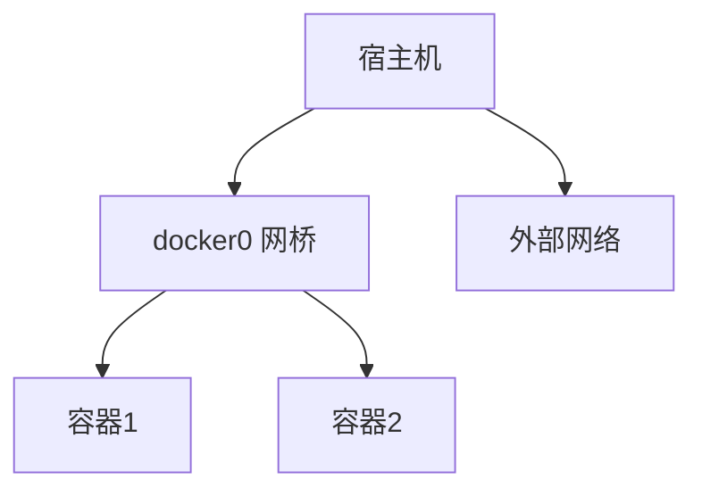
*说明：宿主机通过docker0网桥连接容器，外部网络通过端口映射访问容器服务。*

### **2.2 Docker网络的核心概念**

要理解Docker网络的运作方式，以下几个核心概念是必须掌握的：

#### 2.2.1 容器间的通信
Docker容器本质上是独立的进程，运行在各自的网络命名空间中。为了让它们互相通信，Docker提供了多种网络模式。例如，默认的Bridge网络会为每个容器分配一个IP地址，并通过虚拟网桥（通常命名为`docker0`）实现容器间的数据交换。

举个例子：假设你启动了两个容器，一个运行Nginx，另一个运行Redis。如果它们在同一个Bridge网络中，你可以用Redis容器的IP地址或名称直接访问它，而无需手动配置复杂的网络规则。

**图表：容器间通信（Bridge网络）**
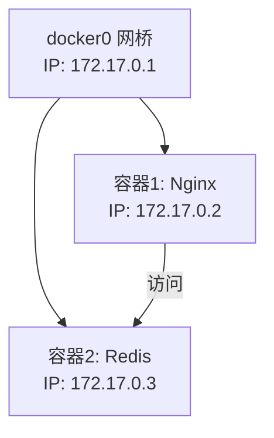
*说明：Nginx容器通过网桥访问Redis容器，IP由Docker自动分配。*

#### 2.2.2 网络命名空间（Network Namespace）
网络命名空间是Linux提供的一种隔离机制，每个Docker容器都有自己的网络命名空间。这意味着每个容器拥有独立的网络堆栈，包括网卡、路由表和防火墙规则。这种隔离保证了容器之间不会互相干扰，但也需要通过特定的网络配置来实现通信。

你可以通过命令`docker inspect <container_id>`查看容器的网络命名空间信息，通常表现为一个唯一的IP地址和网络接口。

**图表：网络命名空间隔离**
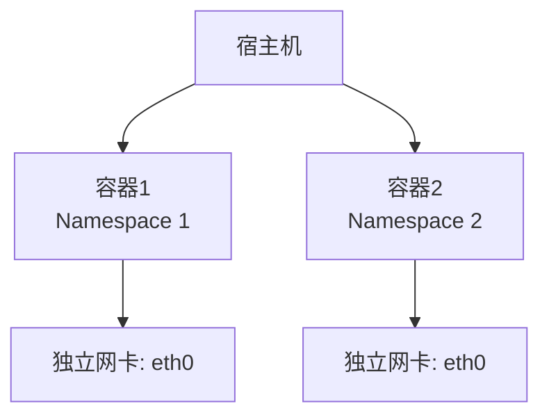
*说明：每个容器有独立的网络命名空间，与宿主机隔离。*

#### 2.2.3 桥接与端口映射
桥接是Docker默认使用的网络方式。通过虚拟网桥`docker0`，容器可以与宿主机和其他容器通信。同时，为了让外部访问容器内的服务，Docker提供了端口映射功能。例如，运行`docker run -p 8080:80 nginx`会将宿主机的8080端口映射到容器的80端口，从而允许外部通过宿主机的IP访问Nginx服务。

端口映射的背后是iptables规则，Docker会动态修改宿主机的NAT表，将外部流量转发到对应的容器。

**图表：桥接与端口映射**
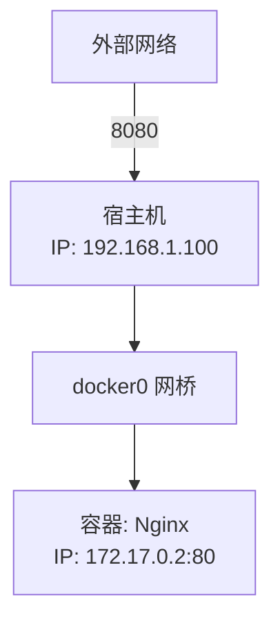
*说明：外部通过宿主机端口8080访问容器内部的80端口。*

### **2.3 Docker默认网络驱动简介**

Docker内置了几种网络驱动（Network Drivers），用于支持不同的网络模式。默认情况下，Docker提供了以下三种网络类型，分别适用于不同的场景：

- **Bridge（桥接网络）**  
  默认网络模式，适用于单主机上的容器通信。每个容器会连接到`docker0`网桥，获取一个私有IP地址（通常是`172.17.x.x`段）。这是最常用的网络类型，适合大多数单机应用。
  
- **Host（主机网络）**  
  容器直接使用宿主机的网络堆栈，没有网络隔离。这种模式下，容器与宿主共享IP地址和端口，性能较高，但牺牲了隔离性，适用于需要极致性能的场景。

- **None（无网络）**  
  容器完全没有网络功能，仅有回环接口（loopback）。这种模式适合运行不需要网络的独立任务，例如某些计算型容器。

运行`docker network ls`命令，你可以看到当前系统中存在的网络驱动和实例。例如，默认情况下会有一个名为`bridge`的网络，对应Bridge模式。

这些网络驱动是Docker网络的基石，后续章节将详细讲解它们的实现原理和使用方法。此外，Docker还支持Overlay和Macvlan等高级网络驱动，适用于多主机和复杂场景，我们将在第3章深入探讨。

---

## **3. Docker网络模式详解**

Docker提供了多种网络模式，每种模式都有其独特的工作原理和适用场景。本章将详细介绍Bridge、Host、None、Overlay和Macvlan网络模式，并通过示例和Mermaid图表帮助你理解它们的功能与用法。无论你是运行单机应用还是构建分布式系统，这些知识都将是你的利器。

### **3.1 Bridge网络（桥接网络）**

#### 工作原理
Bridge网络是Docker的默认网络模式，适用于单主机上的容器通信。它通过一个虚拟网桥（通常是`docker0`）连接所有容器，形成一个局域网。每个容器会被分配一个私有IP地址（默认子网为`172.17.0.0/16`），并通过网桥与宿主机或其他容器通信。

**图表：Bridge网络结构**

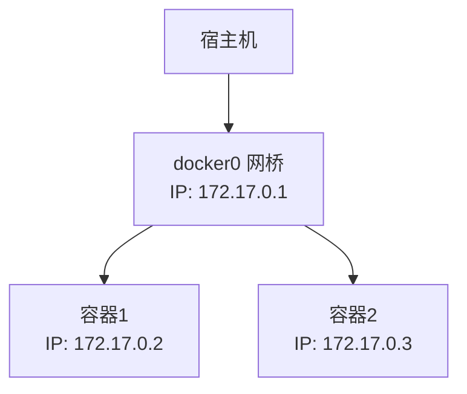
*说明：容器通过veth设备连接到docker0网桥，外部访问需通过端口映射。*

#### 使用场景
- 单主机上运行多个容器，需要容器间通信。
- 需要将容器服务暴露给外部网络（通过端口映射）。

#### 配置示例
1. 创建一个自定义Bridge网络：
   ```bash
   docker network create --driver bridge my_bridge
   ```
2. 运行两个容器并连接到该网络：
   ```bash
   docker run -d --name web --network my_bridge nginx
   docker run -d --name db --network my_bridge redis
   ```
3. 在`web`容器中测试与`db`的通信：
   ```bash
   docker exec -it web ping db
   ```
   *输出：PING db (172.18.0.3): 56 data bytes...*
   容器可以通过名称（如`db`）互相访问，这是Docker内置DNS服务的功劳。

### **3.2 Host网络（主机网络）**

#### 工作原理
Host网络模式下，容器直接使用宿主机的网络堆栈，没有独立的网络命名空间。容器与宿主机共享IP地址和端口，消除了网络隔离，但提升了性能。

**图表：Host网络结构**
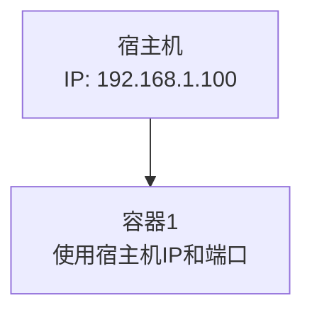
*说明：容器没有独立的IP，直接绑定宿主机的网络接口。*

#### 特点与局限性
- **优点**：网络性能最佳，无NAT开销。
- **局限性**：端口冲突风险高，不适合需要隔离的应用。

#### 使用场景
- 需要极致网络性能的场景（如高吞吐量的代理服务）。
- 测试或调试时需要直接使用宿主机网络。

#### 配置示例
运行一个Nginx容器，使用Host网络：
```bash
docker run -d --name nginx_host --network host nginx
```
访问`http://localhost:80`，即可看到Nginx欢迎页，因为容器直接使用了宿主机的80端口。

### **3.3 None网络（无网络）**

#### 工作原理
None网络模式下，容器没有任何网络接口，仅保留回环接口（`lo`）。这意味着容器无法与外部或其它容器通信，完全隔离。

**图表：None网络结构**
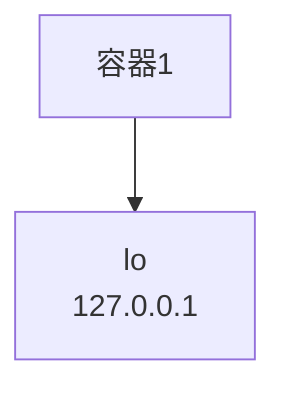
*说明：无外部连接，仅支持容器内部操作。*

#### 适用情况与配置
- **适用情况**：运行不需要网络的独立任务（如数据处理脚本）。
- **配置**：
  ```bash
  docker run -d --name no_net --network none busybox sleep 3600
  docker exec -it no_net ip addr
  ```
  *输出：仅显示`lo`接口，无其他网络设备。*

### **3.4 Overlay网络（覆盖网络）**

#### 多主机通信原理
Overlay网络用于多主机间的容器通信，常与Docker Swarm配合使用。它通过VXLAN技术在物理网络之上创建一个虚拟网络层，容器可以跨主机通信。

**图表：Overlay网络结构**
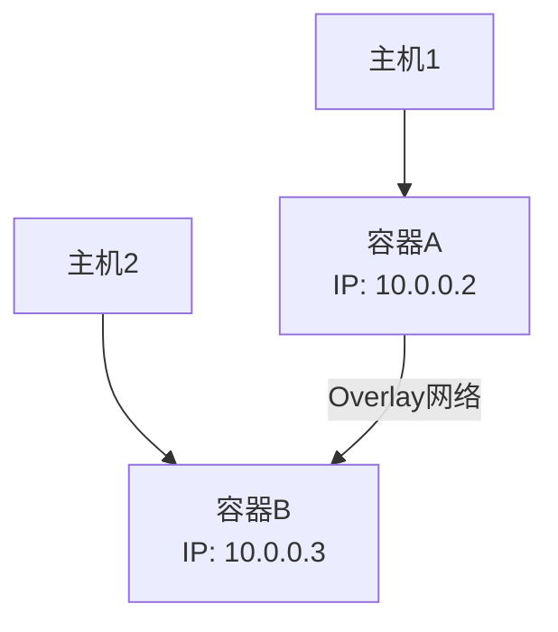
*说明：容器通过虚拟网络跨主机通信，底层依赖VXLAN隧道。*

#### Swarm模式下的应用
在Swarm集群中，Overlay网络自动为服务分配IP，并支持服务发现。

#### 配置示例
1. 初始化Swarm集群：
   ```bash
   docker swarm init
   ```
2. 创建Overlay网络：
   ```bash
   docker network create --driver overlay --attachable my_overlay
   ```
3. 运行跨主机服务：
   ```bash
   docker run -d --name app1 --network my_overlay nginx
   ```
   在另一台主机加入Swarm后运行类似命令，容器即可通信。

### **3.5 Macvlan网络**

#### 直接分配物理网络接口
Macvlan允许容器直接连接到宿主机的物理网络接口，每个容器拥有独立的MAC地址和IP，看起来像物理主机上的独立设备。

**图表：Macvlan网络结构**
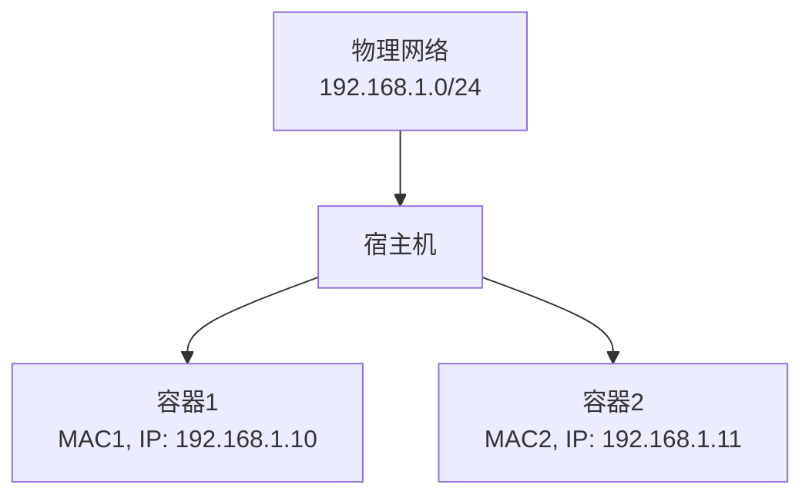
*说明：容器直接获取物理网络IP，与宿主机同级。*

#### 配置与注意事项
- **配置**：
  ```bash
  docker network create -d macvlan \
    --subnet=192.168.1.0/24 \
    --gateway=192.168.1.1 \
    -o parent=eth0 my_macvlan
  docker run -d --name mac1 --network my_macvlan --ip=192.168.1.10 busybox
  ```
- **注意事项**：需要确保物理网络支持，且可能需要开启混杂模式。

### **3.6 自定义网络驱动**

#### 如何创建自定义网络
Docker支持通过插件开发自定义网络驱动。例如，可以使用第三方插件（如Weave）扩展网络功能：
```bash
docker plugin install weaveworks/net-plugin
docker network create --driver weave my_weave
```

自定义网络适用于特定需求，如集成SDN（软件定义网络）。

**图表**：网络模式对比

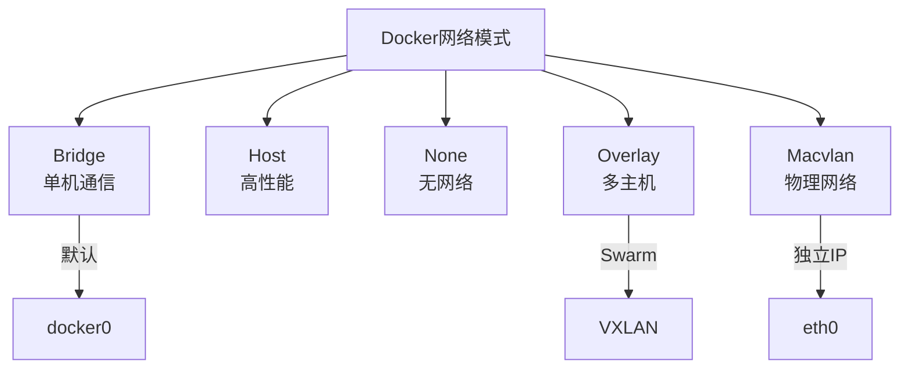

---

## **4. Docker网络配置实战**

理解了Docker网络的各种模式后，接下来我们将进入实战环节。本章将通过具体的配置示例，教你如何创建和管理网络、连接容器、配置端口映射以及设置DNS和服务发现。无论你是初学者还是有一定经验的用户，这些实用技巧都能帮助你更好地管理Docker网络。

### **4.1 创建和管理网络**

Docker允许用户创建自定义网络，并通过命令行工具进行管理。以下是核心操作步骤。

#### `docker network create`命令详解
创建网络是配置的第一步。你可以指定驱动类型、子网等参数。
- 示例：创建一个自定义Bridge网络
  ```bash
  docker network create --driver bridge --subnet 172.20.0.0/16 --gateway 172.20.0.1 my_custom_net
  ```
  - `--driver`：指定网络驱动（如`bridge`、`overlay`）。
  - `--subnet`：定义网络的IP范围。
  - `--gateway`：设置网关地址。

#### 查看与删除网络
- 查看所有网络：
  ```bash
  docker network ls
  ```
  *输出示例：*
  ```
  NETWORK ID     NAME            DRIVER    SCOPE
  a1b2c3d4e5f6   my_custom_net   bridge    local
  ```
- 检查网络详情：
  ```bash
  docker network inspect my_custom_net
  ```
  *输出：包含IP范围、连接的容器等信息。*
- 删除网络：
  ```bash
  docker network rm my_custom_net
  ```
  *注意：网络上有运行中的容器时无法删除，需先断开容器。*

### **4.2 容器连接网络**

容器可以动态连接或断开网络，也可以启动时指定网络。

#### 动态连接与断开
- 将已有容器连接到网络：
  ```bash
  docker network connect my_custom_net my_container
  ```
- 断开连接：
  ```bash
  docker network disconnect my_custom_net my_container
  ```
- 检查容器网络：
  ```bash
  docker inspect my_container --format '{{ .NetworkSettings.Networks }}'
  ```

#### 指定网络运行容器
直接在`docker run`时指定网络：
```bash
docker run -d --name web --network my_custom_net nginx
```
*验证：进入容器查看IP*
```bash
docker exec -it web ip addr
```
*输出：显示容器分配的IP，如`172.20.0.2`。*

### **4.3 端口映射与外部访问**

端口映射是让外部访问容器服务的关键功能，常用于Web服务或API。

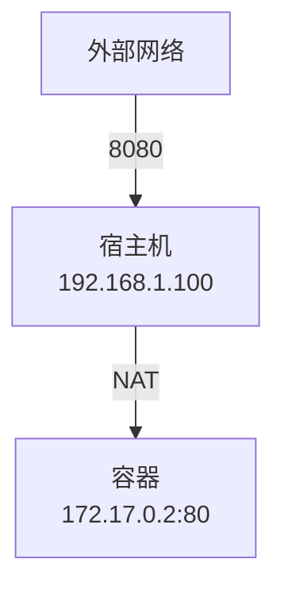

#### `-p`与`--publish`的使用
- 将容器端口映射到宿主机：
  ```bash
  docker run -d --name nginx -p 8080:80 nginx
  ```
  - `8080`：宿主机端口。
  - `80`：容器内部端口。
- 验证外部访问：
  在浏览器输入`http://localhost:8080`，应看到Nginx欢迎页。

- 映射多个端口：
  ```bash
  docker run -d -p 8080:80 -p 8443:443 nginx
  ```

#### 常见问题排查
- **端口占用**：如果8080端口被占用，启动会失败。检查：
  ```bash
  sudo netstat -tuln | grep 8080
  ```
  解决：更换端口或释放占用。
- **防火墙限制**：确保宿主机防火墙允许外部访问（如`ufw allow 8080`）。

### **4.4 DNS配置与服务发现**

Docker网络内置了DNS功能，支持容器间通过名称通信。

#### 容器间通过名字访问
在同一用户定义的Bridge网络中，容器可以互相通过名称访问。
- 示例：
  1. 创建网络并运行两个容器：
     ```bash
     docker network create my_net
     docker run -d --name app1 --network my_net nginx
     docker run -d --name app2 --network my_net busybox
     ```
  2. 在`app2`中测试访问`app1`：
     ```bash
     docker exec -it app2 ping app1
     ```
     *输出：PING app1 (172.18.0.2): 56 data bytes...*
- **注意**：默认Bridge网络（`bridge`）不支持DNS解析，需使用自定义网络。

#### 自定义DNS设置
- 指定DNS服务器：
  ```bash
  docker run -d --name test --network my_net --dns 8.8.8.8 busybox
  ```
- 验证DNS：
  ```bash
  docker exec -it test nslookup google.com
  ```
  *输出：确认解析使用8.8.8.8。*
- 修改全局DNS配置：
  编辑`/etc/docker/daemon.json`：
  ```json
  {
    "dns": ["8.8.8.8", "8.8.4.4"]
  }
  ```
  重启Docker：`sudo systemctl restart docker`。

---

## **5. 高级主题：Docker网络优化与排错**

掌握了Docker网络的基本配置后，你可能会遇到一些更复杂的需求，比如提升网络性能或解决通信故障。本章将探讨如何优化Docker网络的延迟和吞吐量，分析常见问题的解决方法，并介绍用于调试的工具。通过这些高级技巧，你可以让Docker网络在生产环境中更加稳定和高效。

### **5.1 网络性能优化**

Docker网络的性能直接影响应用的响应速度和吞吐量。以下是一些优化建议。

#### 减少延迟与提高吞吐量
- **使用Host网络**：  
  如果隔离性要求不高，Host网络模式可以避免NAT和桥接的开销。例如：
  ```bash
  docker run -d --network host nginx
  ```
  *适用场景*：高性能Web服务或实时应用。
- **调整MTU（最大传输单元）**：  
  默认MTU为1500，但在某些网络（如云环境）中可能需要调整。创建网络时指定：
  ```bash
  docker network create --opt com.docker.network.driver.mtu=1450 my_net
  ```
  *验证*：在容器内运行`ifconfig`，检查MTU值。
- **限制容器带宽**：  
  使用`--ulimit`或cgroup避免单一容器占用过多资源：
  ```bash
  docker run -d --name limited --network my_net --ulimit nproc=65535 nginx
  ```
- **启用DNS缓存**：  
  在容器内安装工具如`dnsmasq`，减少DNS查询延迟。

### **5.2 常见网络问题与解决方案**

Docker网络使用中常会遇到一些问题，以下是典型案例及解决方法。

#### 容器无法通信
- **症状**：容器间ping不通，或服务无法访问。

- **排查**：
  1. 检查网络连接：
     ```bash
     docker inspect <container_name> | grep NetworkMode
     ```
     确认是否在同一网络。
  2. 测试DNS：
     ```bash
     docker exec -it <container_name> ping <target_name>
     ```
     如果失败，可能是DNS问题。
  
- **解决**：
  - 确保容器在同一用户定义网络（如`my_net`）。
  - 重启Docker守护进程：`sudo systemctl restart docker`。

#### 端口冲突处理
- **症状**：启动容器时提示`Bind for 0.0.0.0:80 failed: port is already allocated`。
- **排查**：
  ```bash
  sudo netstat -tuln | grep :80
  ```
  查看占用进程。
- **解决**：
  - 更换端口：`-p 8080:80`。
  - 停止冲突进程：`sudo kill -9 <pid>`。

### **5.3 使用工具分析网络**

调试网络问题需要借助工具，以下是几种常用方法。

#### `docker network inspect`
- **作用**：查看网络的详细信息，包括子网、网关和连接的容器。
- **示例**：
  ```bash
  docker network inspect my_net
  ```
  *输出示例*：
  ```json
  {
    "Name": "my_net",
    "Driver": "bridge",
    "IPAM": {
      "Config": [{"Subnet": "172.20.0.0/16"}]
    },
    "Containers": {
      "abc123": {"Name": "web", "IPv4Address": "172.20.0.2/16"}
    }
  }
  ```

#### `tcpdump`与`Wireshark`
- **tcpdump**：捕获网络流量。
  - 在宿主机上捕获`docker0`流量：
    ```bash
    sudo tcpdump -i docker0 -n
    ```
    *输出*：显示数据包的源IP、目标IP等。
  - 在容器内捕获：
    ```bash
    docker exec -it <container_name> tcpdump -i eth0
    ```
    *注意*：需先安装tcpdump（`apk add tcpdump`或`apt install tcpdump`）。
    
    ```mermaid
    sequenceDiagram
        participant H as 宿主机
        participant D as docker0
        participant C as 容器
        H->>D: tcpdump -i docker0
        D->>C: 捕获流量
        C-->>H: 返回数据包
    ```
- **Wireshark**：图形化分析工具。
  
  - 步骤：将`tcpdump`捕获的数据保存为`.pcap`文件，然后用Wireshark打开：
    ```bash
    sudo tcpdump -i docker0 -w capture.pcap
    ```
    用Wireshark分析流量模式，定位丢包或延迟问题。

#### 其他实用命令
- 查看容器IP：
  ```bash
  docker inspect -f '{{range .NetworkSettings.Networks}}{{.IPAddress}}{{end}}' <container_name>
  ```
- 测试连通性：
  ```bash
  docker exec -it <container_name> curl http://<target_ip>:<port>
  ```

---

## **6. 实战案例**

理论和配置技巧固然重要，但真正的掌握来自于实践。本章将通过三个实战案例，带你应用之前学习的Docker网络知识，解决常见的应用部署需求。从单机多容器应用到多主机集群部署，再到与外部服务集成，这些案例将帮助你巩固所学，并为生产环境做好准备。

### **6.1 单机多容器应用部署**

#### 目标
在单机上部署一个简单的Web应用，包括Nginx（前端）和Redis（后端），使用Bridge网络实现容器间通信。

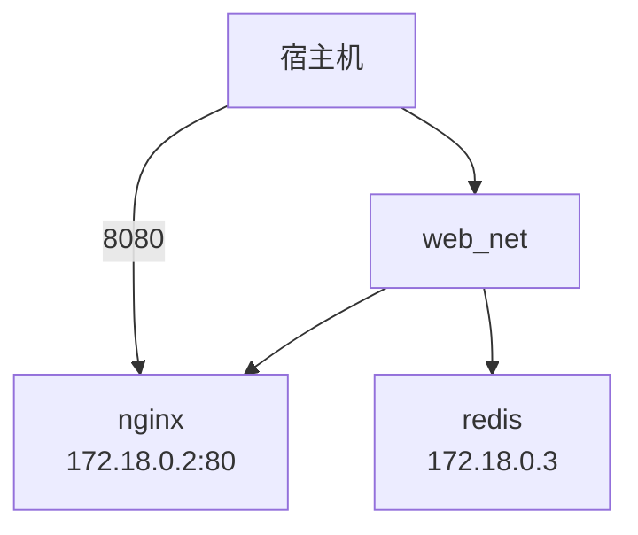


#### 步骤
1. **创建自定义Bridge网络**：
   ```bash
   docker network create web_net
   ```
2. **启动Redis容器**：
   ```bash
   docker run -d --name redis --network web_net redis
   ```
3. **启动Nginx容器**：
   ```bash
   docker run -d --name nginx --network web_net -p 8080:80 nginx
   ```
4. **验证通信**：
   - 检查网络：
     ```bash
     docker network inspect web_net
     ```
     *输出*：确认`redis`和`nginx`都在`web_net`中，IP如`172.18.0.2`和`172.18.0.3`。
   - 测试连通性：
     ```bash
     docker exec -it nginx ping redis
     ```
     *输出*：PING redis (172.18.0.2): 56 data bytes...
   - 访问Nginx：
     在浏览器输入`http://localhost:8080`，应看到Nginx欢迎页。

#### 收获
通过这个案例，你学会了使用Bridge网络实现容器间的通信，并通过端口映射暴露服务。

### **6.2 多主机集群网络配置**

#### 目标
在两台主机上使用Overlay网络部署一个分布式应用，确保容器跨主机通信。

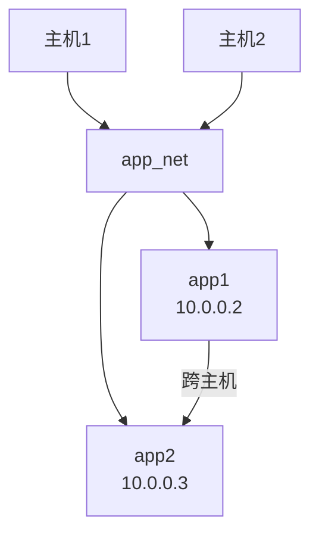


#### 步骤
1. **准备环境**：
   - 主机1：IP为`192.168.1.10`。
   - 主机2：IP为`192.168.1.11`。
   - 确保两台主机Docker版本一致且防火墙允许Swarm通信（2377、7946、4789端口）。

2. **初始化Swarm集群**：
   在主机1上：
   ```bash
   docker swarm init --advertise-addr 192.168.1.10
   ```
   *输出*：生成加入集群的命令，如`docker swarm join --token <token> 192.168.1.10:2377`。

3. **主机2加入集群**：
   在主机2上运行上一步生成的`docker swarm join`命令。

4. **创建Overlay网络**：
   在主机1上：
   ```bash
   docker network create --driver overlay --attachable app_net
   ```

5. **部署容器**：
   - 主机1：
     ```bash
     docker run -d --name app1 --network app_net nginx
     ```
   - 主机2：
     ```bash
     docker run -d --name app2 --network app_net busybox sleep 3600
     ```

6. **验证通信**：
   - 在主机2的`app2`中测试：
     ```bash
     docker exec -it app2 ping app1
     ```
     *输出*：PING app1 (10.0.0.2): 56 data bytes...
   - 检查Swarm状态：
     ```bash
     docker node ls
     ```
     *输出*：显示两个节点均为`Ready`。

#### 收获
这个案例展示了Overlay网络在多主机环境下的威力，以及Swarm模式的基本使用。

### **6.3 与外部服务集成**

#### 目标
将Docker容器与外部数据库和负载均衡器集成，使用Macvlan网络让容器直接接入物理网络。

#### 步骤
1. **假设外部服务**：
   - 外部数据库：`192.168.1.100:3306`（MySQL）。
   - 负载均衡器：`192.168.1.200`。

2. **创建Macvlan网络**：
   ```bash
   docker network create -d macvlan \
     --subnet=192.168.1.0/24 \
     --gateway=192.168.1.1 \
     -o parent=eth0 app_macvlan
   ```

3. **运行Web容器**：
   ```bash
   docker run -d --name web --network app_macvlan --ip 192.168.1.10 nginx
   ```

4. **测试与外部服务通信**：
   - 访问数据库：
     ```bash
     docker exec -it web ping 192.168.1.100
     ```
     *输出*：PING 192.168.1.100: 56 data bytes...
   - 配置负载均衡器（假设使用Nginx反向代理）：
     在`192.168.1.200`上添加`192.168.1.10`为后端节点。

5. **验证**：
   - 从外部访问`192.168.1.200`，应看到Nginx欢迎页（通过负载均衡器转发）。
   - 检查容器IP：
     ```bash
     docker inspect web | grep IPAddress
     ```
     *输出*：确认IP为`192.168.1.10`。

#### 收获
通过Macvlan网络，你学会了如何让容器直接接入物理网络，与外部服务无缝集成。

---

## **7. 总结与进阶学习**

经过前六章的学习，你已经从Docker网络的基础概念走到了实战应用，掌握了配置、优化和故障排查的核心技能。本章将回顾关键要点，推荐进阶学习资源，并展望下一步的方向——如探索Kubernetes网络。让我们一起总结这段旅程，并为未来做好准备！

### **7.1 Docker网络的关键要点回顾**

- **基础概念**：Docker网络基于Linux网络命名空间和虚拟网桥，为容器提供隔离与连接能力。Bridge、Host和None是默认模式，奠定了单机应用的基础。
- **网络模式**：Overlay和Macvlan扩展了功能，支持多主机通信和物理网络集成。每种模式都有其适用场景，如Bridge适合单机，Overlay适合集群。
- **配置实战**：你学会了创建网络、连接容器、映射端口和设置DNS，解决了容器通信和外部访问的需求。
- **优化与排错**：通过调整MTU、使用Host网络提升性能，以及借助`tcpdump`等工具定位问题，你的网络管理能力更上一层楼。
- **实战案例**：从单机Web应用到多主机集群，再到外部服务集成，展示了Docker网络的灵活性和实用性。

这些知识点不仅是Docker的核心，也是现代容器化技术的基石。无论你是在开发环境调试，还是在生产环境部署，Docker网络都将成为你的得力助手。

### **7.2 进一步学习的资源推荐**

想更深入掌握Docker网络或扩展技能？以下资源值得一试：

#### 官方文档
- **Docker网络官方文档**：  
  [https://docs.docker.com/network/](https://docs.docker.com/network/)  
  详细介绍了每种网络驱动的配置选项和限制，是权威参考资料。
- **Docker Swarm文档**：  
  [https://docs.docker.com/engine/swarm/](https://docs.docker.com/engine/swarm/)  
  深入学习Overlay网络和集群管理。

#### 社区与书籍
- **《Docker in Action》**（Jeff Nickoloff & Stephen Kuenzli）：  
  一本经典书籍，涵盖Docker网络的原理和实践。
- **Docker社区论坛**：  
  [https://forums.docker.com/](https://forums.docker.com/)  
  与全球开发者交流，解决具体问题。
- **Reddit - r/docker**：  
  [https://www.reddit.com/r/docker/](https://www.reddit.com/r/docker/)  
  获取最新动态和实用技巧。

#### 在线课程
- **Udemy - Docker Mastery**（Bret Fisher）：  
  实操性强的课程，包含网络配置案例。
- **Linux Foundation - Introduction to Kubernetes**：  
  免费课程，适合从Docker过渡到Kubernetes。

### **7.3 下一步：探索Kubernetes网络**

Docker网络是容器化世界的起点，而Kubernetes（K8s）则是容器编排的标准。如果你已经熟悉Docker Swarm的Overlay网络，那么向Kubernetes迈进将是一个自然的选择。以下是Kubernetes网络的入门提示：
- **核心概念**：  
  Kubernetes使用CNI（Container Network Interface）管理网络，支持Flannel、Calico等插件，与Docker的驱动有所不同。
- **快速上手**：  
  安装Minikube（单机K8s环境），运行：
  ```bash
  minikube start
  kubectl run nginx --image=nginx
  ```
  体验Pod间的通信。
- **推荐资源**：  
  - 《Kubernetes in Action》（Marko Lukša）：权威书籍。  
  - 官方文档：[https://kubernetes.io/docs/concepts/networking/](https://kubernetes.io/docs/concepts/networking/)。

从Docker到Kubernetes，你将进入一个更广阔的容器生态，解锁微服务和高可用部署的潜力。

---

## **8. 附录**

学习Docker网络的过程中，你可能会需要一些快速参考资料或常见问题的解答。本附录整理了常用命令、术语解释和FAQ，方便你在实践时查阅。无论是新手还是老手，这些内容都能为你节省时间，提升效率。

### **8.1 常用Docker网络命令速查**

以下是Docker网络管理的核心命令，按功能分类：

#### 网络管理
- 创建网络：
  ```bash
  docker network create --driver <driver> <network_name>
  ```
- 查看网络列表：
  ```bash
  docker network ls
  ```
- 检查网络详情：
  ```bash
  docker network inspect <network_name>
  ```
- 删除网络：
  ```bash
  docker network rm <network_name>
  ```

#### 容器网络操作
- 运行容器并指定网络：
  ```bash
  docker run -d --name <name> --network <network_name> <image>
  ```
- 连接容器到网络：
  ```bash
  docker network connect <network_name> <container_name>
  ```
- 断开容器网络：
  ```bash
  docker network disconnect <network_name> <container_name>
  ```

#### 端口映射与调试
- 映射端口：
  ```bash
  docker run -d -p <host_port>:<container_port> <image>
  ```
- 查看容器IP：
  ```bash
  docker inspect -f '{{range .NetworkSettings.Networks}}{{.IPAddress}}{{end}}' <container_name>
  ```
- 测试连通性：
  ```bash
  docker exec -it <container_name> ping <target>
  ```

### **8.2 术语表**

以下是Docker网络中常见的术语及其解释：
- **Bridge（桥接）**：Docker默认网络模式，通过虚拟网桥（如`docker0`）连接容器。
- **Overlay（覆盖）**：用于多主机通信的网络模式，基于VXLAN技术。
- **Macvlan**：允许容器直接使用物理网络接口，分配独立MAC和IP。
- **Network Namespace（网络命名空间）**：Linux内核功能，为容器提供独立的网络环境。
- **veth（虚拟以太网设备）**：连接容器与网桥的虚拟网络接口对。
- **NAT（网络地址转换）**：将容器私有IP映射到宿主机IP，用于外部访问。
- **Swarm**：Docker内置的集群管理工具，支持Overlay网络。

### **8.3 FAQ：读者常见问题解答**

以下是读者在学习Docker网络时可能遇到的问题及其答案：

#### Q1：为什么我的容器无法互相ping通？
- **A**：可能是容器不在同一网络，或默认Bridge网络未启用DNS。  
  - 检查：`docker network inspect <network_name>`，确认容器列表。
  - 解决：将容器连接到同一用户定义网络，如`docker network connect <network_name> <container_name>`。

#### Q2：端口映射失败，提示端口被占用怎么办？
- **A**：宿主机端口已被其他进程占用。  
  - 检查：`sudo netstat -tuln | grep <port>`。
  - 解决：更换端口（如`-p 8081:80`）或释放占用（`sudo kill -9 <pid>`）。

#### Q3：Overlay网络在Swarm中不起作用？
- **A**：可能是防火墙限制或Swarm未正确初始化。  
  - 检查：`docker node ls`确认节点状态；确保端口2377、7946、4789开放。
  - 解决：重启Swarm（`docker swarm leave --force`后重新`init`）。

#### Q4：如何查看容器的实时网络流量？
- **A**：使用`tcpdump`捕获流量。  
  - 示例：在宿主机运行`sudo tcpdump -i docker0 -n`，或容器内安装后运行`tcpdump -i eth0`。

#### Q5：Macvlan网络配置后无法上网？
- **A**：可能是物理网络不支持，或网卡未启用混杂模式。  
  - 解决：运行`sudo ip link set eth0 promisc on`，并确保子网和网关正确。

---

## **番外篇：`docker0`网桥的实现原理**

`docker0`是Docker默认Bridge网络的核心组件，它是一个Linux网桥（Bridge），负责在宿主机上连接容器并管理它们的通信。理解`docker0`的实现原理，可以帮助你更深入地掌握Docker网络的工作机制。以下是其原理的详细拆解：

#### **1. Linux网桥的基础**
Linux网桥是一种虚拟的二层网络设备，类似于物理交换机，运行在内核态。它可以将多个网络接口（如容器的`veth`接口）连接起来，并在这些接口之间转发数据帧。`docker0`由Docker守护进程在启动时自动创建，默认命名为`docker0`，并绑定一个私有IP地址（如`172.17.0.1`）作为网关。

- **创建过程**：  
  Docker使用`ip link add`命令创建网桥：
  ```bash
  sudo ip link add name docker0 type bridge
  sudo ip addr add 172.17.0.1/16 dev docker0
  sudo ip link set docker0 up
  ```
  这将`docker0`设置为一个活动的桥接设备。

#### **2. 虚拟以太网设备（veth）**
为了将容器连接到`docker0`，Docker为每个容器创建一对虚拟以太网设备（veth pair）。veth pair像一根虚拟网线，一端连接到容器的网络命名空间，另一端连接到`docker0`网桥。

- **工作方式**：
  - 容器内的接口（通常命名为`eth0`）位于容器的网络命名空间中。
  - 宿主机端的接口（随机命名，如`veth123456`）绑定到`docker0`。
- **示例**：  
  创建容器时，Docker自动生成veth pair并连接：
  ```bash
  # 假设容器IP为172.17.0.2
  ip link add veth0 type veth peer name veth123456
  ip link set veth0 netns <container_pid>
  ip link set veth123456 master docker0
  ```
  容器内的`eth0`通过veth与`docker0`通信。

#### **3. IP地址分配与路由**
`docker0`网桥不仅是数据转发的枢纽，还充当容器的默认网关。Docker通过`IPAM`（IP Address Management）插件为每个容器分配一个唯一的IP地址，默认子网为`172.17.0.0/16`。

- **IP分配**：  
  容器启动时，Docker从子网中分配IP（如`172.17.0.2`），并配置容器的路由表，使其默认网关指向`docker0`的IP（`172.17.0.1`）。
- **路由表**：  
  在容器内运行`ip route`：
  ```
  default via 172.17.0.1 dev eth0
  172.17.0.0/16 dev eth0 proto kernel scope link src 172.17.0.2
  ```
- **NAT转发**：  
  当容器访问外部网络时，`docker0`通过iptables的NAT规则将流量转发到宿主机的物理网卡。例如：
  ```bash
  iptables -t nat -A POSTROUTING -s 172.17.0.0/16 -o eth0 -j MASQUERADE
  ```

#### **4. 数据包转发流程**
以下是`docker0`处理数据包的典型流程：
- **容器间通信**：  
  1. 容器1（`172.17.0.2`）发送数据包到容器2（`172.17.0.3`）。
  2. 数据包通过`veth`到达`docker0`。
  3. `docker0`根据MAC地址表转发到容器2的`veth`接口。
- **容器到外部**：  
  1. 容器发送数据包到外部IP（如`8.8.8.8`）。
  2. 数据包到达`docker0`，通过NAT转换为宿主机IP。
  3. 宿主机网卡（`eth0`）将数据发送到外部网络。
- **外部到容器**：  
  1. 外部通过宿主机端口（如`8080`）访问。
  2. iptables将流量转发到容器IP和端口（如`172.17.0.2:80`）。
  3. `docker0`将数据包送达容器。

#### **5. 关键特性与限制**
- **特性**：
  - **隔离性**：通过网络命名空间实现容器间独立。
  - **灵活性**：支持用户定义的Bridge网络，扩展默认行为。
- **限制**：
  - 默认Bridge网络（`bridge`）不支持容器名称解析，需用自定义网络。
  - 单主机范围，跨主机通信需Overlay等模式。

#### **6. 验证实现**
你可以通过以下命令观察`docker0`的工作：
- 查看网桥状态：
  ```bash
  ip link show docker0
  bridge link
  ```
- 检查iptables规则：
  ```bash
  iptables -t nat -L -n
  ```
- 捕获流量：
  ```bash
  sudo tcpdump -i docker0 -n
  ```

`docker0`原理：

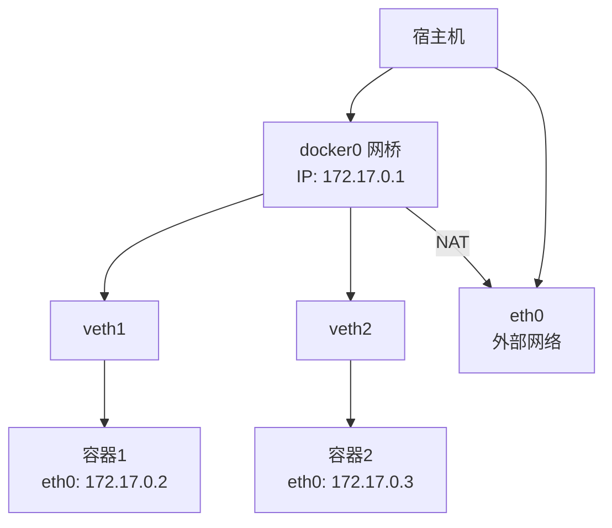

*说明*：展示`docker0`如何连接容器和外部网络，veth pair实现容器通信。

