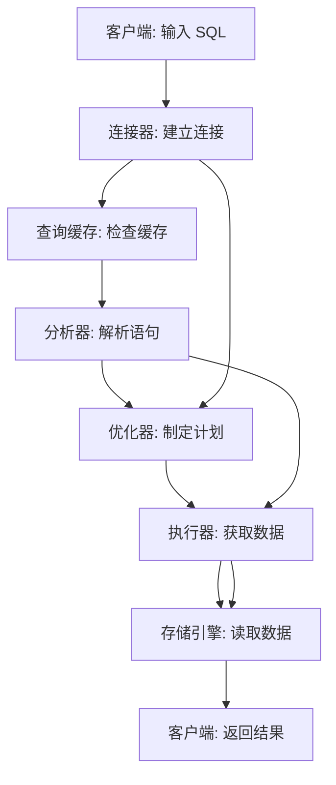
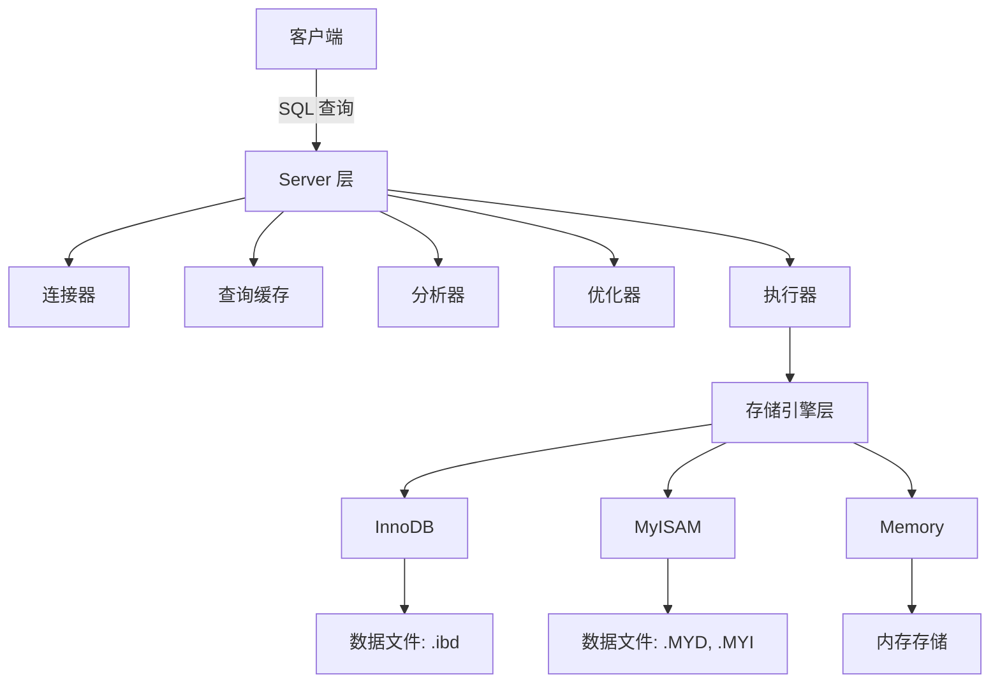
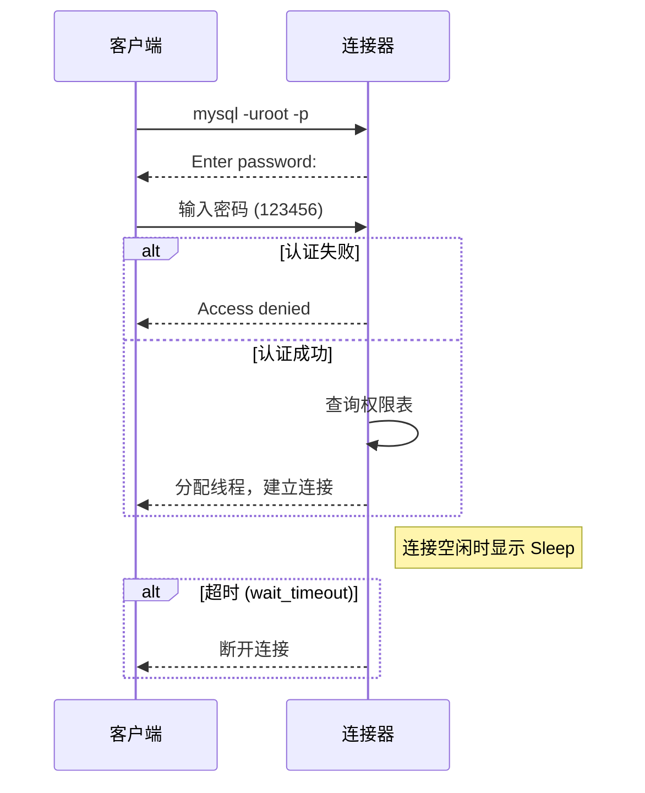
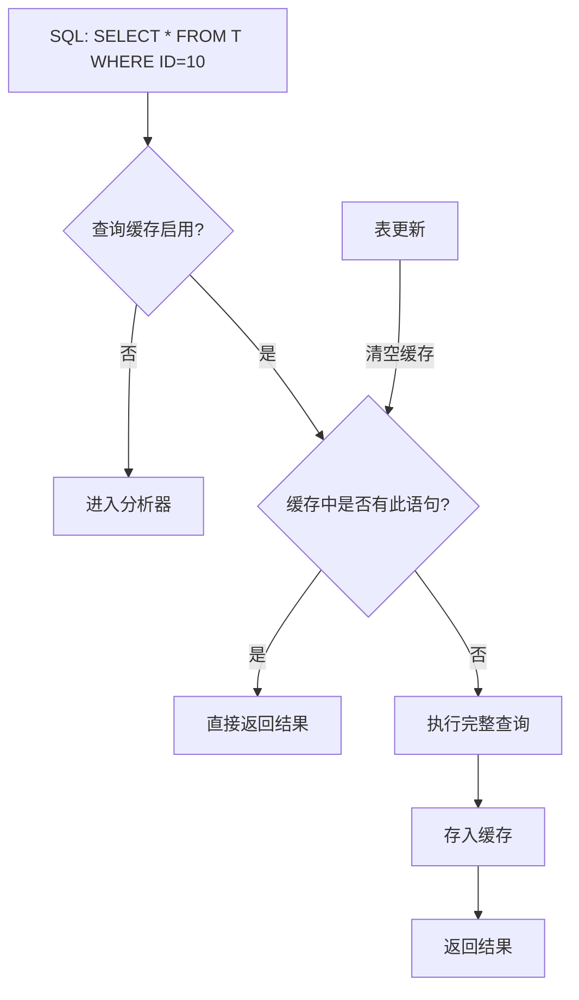
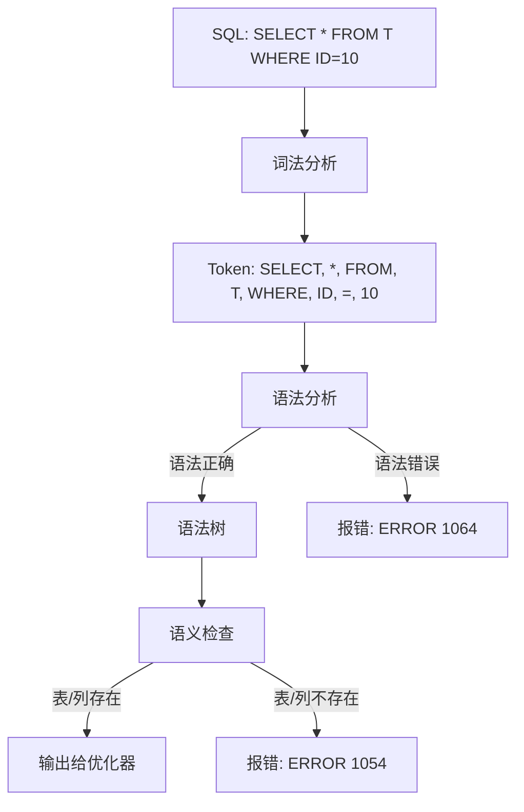
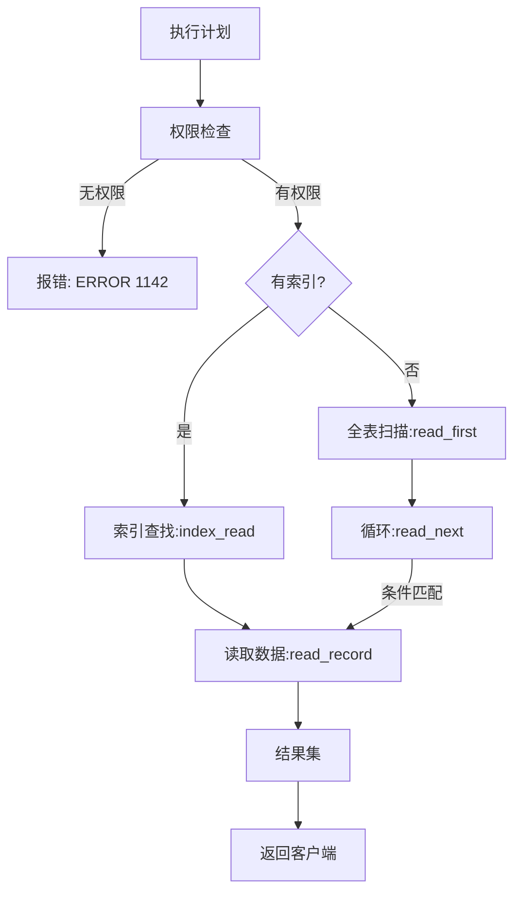
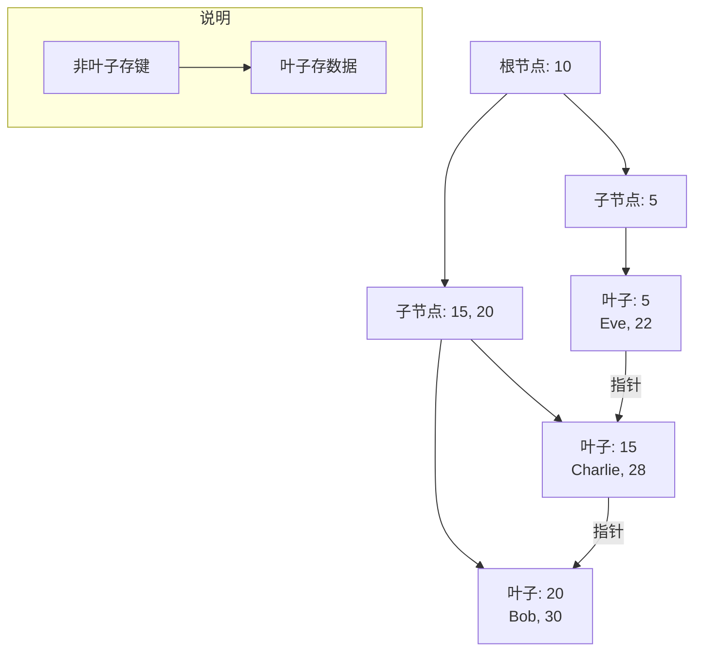
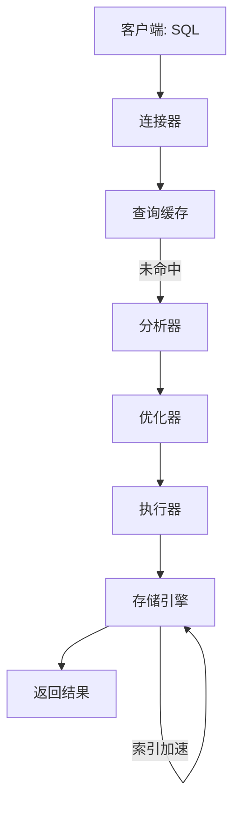

你有没有想过，当你敲下一条简单的 SQL 查询，比如 `SELECT * FROM T WHERE ID = 10`，MySQL 是怎么在眨眼间从海量数据中找出结果的？表面上看，这不过是输入一行代码，输出几行数据，但背后却是一场精密的“接力赛”。在这篇文章中，我们将化身侦探，追踪一条查询的完整旅程，从敲下回车的那一刻，到结果跳上屏幕的全过程。连接器、分析器、优化器、索引……每一个“站点”都有秘密等着我们揭开。无论你是想优化慢查询，还是单纯好奇 MySQL 的“魔法”，这场数据查询之旅都会给你答案。准备好了吗？让我们出发吧！

## **1. 引言**

-----

### **1.1 为什么需要了解 SQL 查询的内部过程？**

在我们日常开发或使用数据库时，SQL 查询几乎无处不在。无论是查询用户信息、统计订单数据，还是生成报表，SQL 都像一把万能钥匙，帮我们从数据库中提取所需的信息。然而，你有没有想过，当你敲下键盘、输入一条查询语句后，MySQL 是如何在短短几毫秒内从海量数据中找到你想要的那一行，并返回结果的？这看似简单的操作，背后却隐藏着复杂的机制。

了解 SQL 查询的内部过程，不仅仅是满足好奇心，更有实际意义。具体来说，它能带来以下好处：

- **性能优化**：假如你的查询运行得很慢，动辄几秒甚至超时，知道 MySQL 的执行流程就能帮你找到瓶颈——是索引没用上，还是优化器选错了路径？这样你就可以有的放矢地优化，而不是盲目尝试。
- **问题排查**：当数据库报错时，比如“权限不足”或“列不存在”，理解查询的每个阶段就能快速定位问题出在哪里，而不是盯着错误提示抓瞎。
- **设计提升**：在创建表结构或编写 SQL 时，提前了解 MySQL 的工作原理，能让你设计出更高效的 schema，比如合理使用索引或避免低效的子查询。
- **技术成长**：从更高的视角理解数据库的运作，不仅能提升你的技术深度，还能让你在面试或团队讨论中更有底气。

举个例子，假设你是一个电商平台的开发工程师，负责查询某个用户的订单记录。如果这条查询在高峰期拖慢了整个系统，你该怎么办？是加服务器，还是改代码？如果不懂 MySQL 内部机制，你可能只能靠猜。而一旦掌握了查询的“旅程”，你就能通过分析执行计划、调整索引等方式，轻松解决问题。这就是为什么我们要掀开 MySQL 的“黑盒”，看看它到底是怎么工作的。

----

### **1.2 以简单查询为例引入主题：`SELECT * FROM T WHERE ID = 10`**

为了让这次探索之旅更直观，我们需要一个具体的“向导”。让我们以一条最简单的查询语句作为起点：

```sql
SELECT * FROM T WHERE ID = 10;
```

这条语句再简单不过了：从表 `T` 中找出 `ID` 等于 10 的记录，然后返回所有列的数据。假设表 `T` 的结构如下：

```sql
CREATE TABLE T (
    ID INT PRIMARY KEY,
    name VARCHAR(50),
    age INT
);
```

表里可能有几行数据，比如：

| ID   | name    | age  |
| ---- | ------- | ---- |
| 10   | Alice   | 25   |
| 20   | Bob     | 30   |
| 30   | Charlie | 35   |

当你执行这条查询时，MySQL 会返回：

```tex
ID  | name  | age
----|-------|----
10  | Alice | 25
```

表面上看，这一切都太自然了——输入一条命令，得到一个结果，就像点外卖一样简单。但实际上，这条语句在 MySQL 内部经历了一场“奇幻之旅”。它需要经过连接认证、语句解析、路径优化，最后才能从存储引擎中取出数据。这条查询就像一个旅行者，从客户端出发，经过 MySQL 的各个“关卡”，最终带着结果返回。我们将以这条语句为主线，逐步揭开它旅程中的每一个秘密。

你可能会问：“这么简单的查询有啥好研究的？”别急，正是因为它简单，我们才能更清晰地看到 MySQL 的每个部件如何协作。一旦理解了这些基础，等到处理复杂的多表 JOIN 或大数据量查询时，你就会发现这些知识有多么宝贵。

----

### **1.3 目标：揭示 MySQL 的“黑盒”秘密**

MySQL 对很多人来说就像一个“黑盒”：你丢进去一条 SQL，出来一个结果，至于中间发生了什么，似乎不需要关心。但这种“不知道也没关系”的状态，往往让我们在遇到问题时束手无策。比如：

- 为什么这条查询这么慢？
- 为什么加了索引还是没效果？
- 这个错误是怎么回事？

本文的目标，就是带你打开这个“黑盒”，看看 MySQL 是如何处理一条查询的。我们会从客户端输入开始，沿着查询的路径，逐一探索 MySQL 的核心组件——连接器、查询缓存、分析器、优化器、执行器，以及底层的存储引擎。通过这次旅程，你将：

- 理解每个组件的作用和原理。
- 掌握查询执行的完整流程。
- 学会如何利用这些知识优化查询或排查问题。

更重要的是，这不仅是一次技术的拆解，还是一次思维的升华。当你明白 MySQL 如何从混乱的数据中精确找到目标时，你会感受到数据库设计的精妙，也会对如何更好地与它合作有新的认识。

为了让内容更直观，我们会用图表展示流程，用示例解释细节。比如，下面是 MySQL 查询旅程的简化示意图，给你一个初步印象：



接下来，我们将沿着这条路径，逐步深入每个环节。准备好了吗？让我们开始这场 MySQL 数据查询之旅吧！

---

## **2. MySQL 架构概览**

在开始探索 SQL 查询的具体旅程之前，我们先要了解 MySQL 的“地形图”——它的架构。只有知道 MySQL 内部有哪些“部门”和“工具”，我们才能明白一条查询语句是如何被一步步处理的。MySQL 的架构可以用一句话概括：它是一个分工明确、模块化设计的系统，主要分为 **Server 层** 和 **存储引擎层** 两大块。接下来，我们就来拆解这两部分，看看它们各自负责什么，以及它们如何协作完成查询任务。

---

### **2.1 Server 层与存储引擎层的分工**

MySQL 的架构就像一个高效的工厂，Server 层是“管理层”，存储引擎层是“生产车间”。它们各司其职，又紧密配合。

#### Server 层：大脑与指挥中心

Server 层是 MySQL 的核心，负责处理查询的“大脑工作”。它包括以下几个关键组件：

- **连接器**：管理客户端的连接，验证身份和权限。
- **查询缓存**：尝试用缓存加速查询（MySQL 8.0 前）。
- **分析器**：解析 SQL 语句，弄明白你要干什么。
- **优化器**：制定最优的执行计划，决定怎么干效率最高。
- **执行器**：按照计划调用存储引擎，完成实际操作。

除了这些核心模块，Server 层还提供了一些“通用服务”：

- **内置函数**：比如 `NOW()` 获取当前时间，`SUM()` 计算总数。
- **跨引擎功能**：如存储过程、触发器、视图，这些功能不依赖具体存储引擎，全由 Server 层实现。

打个比方，Server 层就像一个餐厅的服务员团队：他们接待顾客（连接器）、听懂点单（分析器）、优化送餐路线（优化器），最后把任务交给厨房（执行器）。无论厨房用什么设备（存储引擎），服务员都能确保流程顺畅。

#### 存储引擎层：数据处理的“车间”

存储引擎层是 MySQL 的“干活主力”，负责数据的存储和读取。它不参与 SQL 的解析或优化，只是按照 Server 层的指令，从磁盘或内存中取出数据，或者写入新数据。具体来说：

- 它管理物理文件，比如表的数据文件（`.ibd` 文件）和索引文件。
- 它提供数据的存取接口，比如“给我第 10 行”或“用索引找 ID=10 的记录”。
- 它的实现决定了查询的底层效率。

Server 层和存储引擎层的关系可以用一个简单的例子说明。假设你执行：

```sql
SELECT * FROM T WHERE ID = 10;
```

- Server 层负责理解这条语句，决定是否用索引查找，然后生成执行计划。
- 存储引擎层收到指令后，真的去表里找到 `ID = 10` 的那一行数据。

这种分工的好处是清晰高效：Server 层专注于逻辑处理，存储引擎层专注数据操作。而且，存储引擎层是可替换的，这就引出了它的一个独特特点——插件式设计。

---

### **2.2 插件式存储引擎的特点**

MySQL 的存储引擎层采用了一种灵活的“插件式”架构，允许用户根据需求选择不同的引擎。你可以把存储引擎想象成汽车的发动机：同一个车架（Server 层）可以装不同的发动机（存储引擎），每种发动机有自己的特长。

#### 常见的存储引擎

MySQL 支持多种存储引擎，以下是几个典型的例子：

1. **InnoDB**：
    - **特点**：支持事务（ACID）、行锁、外键，适合高并发和数据一致性要求高的场景。
    - **默认引擎**：从 MySQL 5.5.5 开始，InnoDB 成为默认选择。
    - **文件格式**：数据和索引存储在 `.ibd` 文件中。
2. **MyISAM**：
    - **特点**：不支持事务，表锁，查询和插入速度快，但并发性能较差。
    - **文件格式**：数据（`.MYD`）、索引（`.MYI`）分开存储。
3. **Memory**：
    - **特点**：数据存在内存中，速度极快，但断电丢失，适合临时表。
    - **限制**：不支持复杂事务。

#### 如何选择存储引擎

建表时，你可以通过 `ENGINE` 关键字指定存储引擎。例如：

```sql
CREATE TABLE T (
    ID INT PRIMARY KEY,
    name VARCHAR(50)
) ENGINE=InnoDB;
```

如果不写 `ENGINE`，默认用 InnoDB。如果你想要内存表，可以改成：

```sql
CREATE TABLE T (
    ID INT PRIMARY KEY,
    name VARCHAR(50)
) ENGINE=Memory;
```

不同引擎的存取方式和功能差异很大。比如，InnoDB 的 B+树索引适合范围查询，而 MyISAM 的表锁在高并发写入时容易阻塞。这意味着，存储引擎的选择直接影响查询性能。

#### 插件式的优势

- **灵活性**：可以根据业务需求切换引擎，比如读多用 MyISAM，事务多用 InnoDB。
- **可扩展性**：开发者可以自定义存储引擎，插入 MySQL 使用。
- **统一接口**：Server 层通过标准接口与存储引擎通信，无论用哪种引擎，上层逻辑不变。

举个例子，假设你有一个日志表，只需要快速插入和查询，不关心事务，可以用 MyISAM。如果是订单表，需要事务支持，那就选 InnoDB。这种灵活性让 MySQL 适应了从小型应用到企业级系统的各种场景。

---

### **2.3 架构图展示**

为了更直观地理解 Server 层和存储引擎层的分工，我们来看一张 MySQL 的架构图：



#### 图表解读

- **客户端**：你输入 SQL 的地方，比如命令行或应用。
- **Server 层**：从连接到执行的完整流程都在这里。
- **存储引擎层**：根据表定义，调用对应引擎处理数据。
- **数据文件**：最终数据落地的物理存储。

以 `SELECT * FROM T WHERE ID = 10` 为例：

1. Server 层接收这条语句，解析它，选择执行路径。
2. 执行器调用存储引擎（假设是 InnoDB），从 `.ibd` 文件中读取数据。
3. 结果通过 Server 层返回客户端。

这个图就像一张地图，标出了查询旅程的每一个“站点”。接下来的章节，我们将沿着这张地图，深入每个站点，看看它们具体是怎么工作的。

---

## **3. 查询之旅的起点：连接器**

我们的查询之旅正式开始，而第一站就是 **连接器**。无论多么复杂的 SQL 语句，都得先通过连接器这道“关卡”进入 MySQL 的世界。连接器就像 MySQL 的“门卫”，负责接待客户端、验证身份、分配资源，确保查询旅程有个顺利的开端。接下来，我们将详细拆解它的作用、连接过程，以及一些需要注意的细节。

---

### **3.1 连接器的作用与职责**

连接器是 MySQL Server 层的第一个模块，它的任务可以用三个词概括：**连接、认证、管理**。具体来说，它负责：

- **建立连接**：让客户端（如命令行工具、应用程序）与 MySQL 服务器“握手”，建立通信通道。
- **身份验证**：检查你的用户名和密码，确保你是“合法访客”。
- **权限分配**：查询你的权限范围（比如能否执行 `SELECT`），并为这次连接分配一个线程。
- **连接管理**：维持连接状态，处理空闲或断开的情况。

想象一下，你去一家餐厅吃饭，第一步是走到门口，服务员（连接器）会问你：“请问有预约吗？”（验证身份），然后带你入座（分配资源）。在 MySQL 中，连接器就是这样一个“接待员”，没有它的许可，任何查询都无法进入下一步。

在实际场景中，你可能用过这样的命令连接数据库：

```bash
mysql -h127.0.0.1 -P3306 -uroot -p
```

这条命令告诉连接器：“我要连到本地的 MySQL 服务器，端口是 3306，用户是 root，请让我进去。”连接器收到请求后，就会开始它的工作。

---

### **3.2 连接过程：认证与权限**

连接器的核心任务是建立连接并验证身份。让我们一步步看看这个过程。

#### 连接建立

1. **网络握手**：

    - 客户端通过 TCP/IP 协议与 MySQL 服务器建立连接。
    - 如果是本地连接（比如 `mysql -uroot -p`），可以用 UNIX socket，速度更快。
    - MySQL 默认监听 3306 端口（`-P3306`），可以通过配置文件 `my.cnf` 修改。

2. **客户端请求**：

    - 输入上述命令后，按回车，系统提示输入密码：

      ```
      Enter password:
      ```

    - 你输入密码（比如 `123456`），客户端将用户名和密码加密后发送给服务器。

#### 身份验证

3. **认证检查**：

    - 连接器接收到请求后，从权限表（通常是 `mysql.user` 表）中查找用户 `root`。

    - 比对密码（存储的是加密后的哈希值，比如 SHA1 或 SHA256）。

    - 如果匹配失败，返回错误：

      ```
      ERROR 1045 (28000): Access denied for user 'root'@'localhost' (using password: YES)
      ```

    - 如果成功，进入下一步。

4. **权限分配**：

    - 连接器查询你的权限，比如：

      ```sql
      SELECT * FROM mysql.user WHERE user = 'root' AND host = 'localhost';
      ```

    - 返回的权限字段（如 `Select_priv`、`Insert_priv`）决定你能做什么。

    - 权限一旦确定，在本次连接中就固定了。即使管理员中途修改权限（比如 `REVOKE SELECT ON db.T FROM 'root'@'localhost'`），现有连接也不受影响，只有新连接会应用新权限。

#### 线程分配

5. **分配资源**：

    - 连接器为本次连接分配一个线程（或从线程池复用，取决于配置）。

    - 你可以用 `SHOW PROCESSLIST` 查看当前连接状态：

      ```tex
      mysql> SHOW PROCESSLIST;
      +----+------+-----------+------+---------+------+----------+------------------+
      | Id | User | Host      | db   | Command | Time | State    | Info             |
      +----+------+-----------+------+---------+------+----------+------------------+
      |  5 | root | localhost | NULL | Sleep   |  120 |          | NULL             |
      +----+------+-----------+------+---------+------+----------+------------------+
      ```

    - `Command` 为 `Sleep` 表示连接空闲，`Time` 是空闲秒数。

#### 小细节

- 密码安全：不要在命令行直接写密码（`-p123456`），容易泄露。
- 连接超时：如果连接后长时间不动，连接器会自动断开，默认超时由参数 `wait_timeout` 控制（默认 8 小时，28800 秒）。

---

### **3.3 长连接与短连接的利弊**

连接建立后，你的选择会影响后续体验。MySQL 支持两种连接模式：**长连接** 和 **短连接**。

#### 长连接

- **定义**：连接建立后持续复用，适合频繁查询的场景。
- **优点**：
    - 避免重复建立连接的开销（TCP 握手、认证等耗时）。
    - 提升效率，尤其在高并发应用中。
- **缺点**：
    - MySQL 在连接中会分配临时内存（比如排序缓冲区），这些资源只有连接断开时释放。
    - 如果长连接积累过多，可能导致内存溢出（OOM），甚至 MySQL 被系统杀掉，重启。
- **现象**：内存占用突然飙升，日志报 `Out of memory`。

#### 短连接

- **定义**：查询完就断开，下次再重连，适合偶尔查询的场景。

- **优点**：

    - 内存占用可控，每次断开都释放资源。

- **缺点**：

    - 频繁重连增加开销，尤其在网络不稳定时更明显。

- **现象**：如果连接断开后再次请求，报错：

  ```bash
  Lost connection to MySQL server during query
  ```

#### 应对策略

1. **定期断开长连接**：

    - 在程序中检测大查询后主动断开（`mysql_close()`），然后重连。

2. **重置连接**：

    - MySQL 5.7+ 提供 `mysql_reset_connection` 函数，不用重连就能清理内存，恢复连接到初始状态。

    - 示例：

      ```c
      mysql_reset_connection(conn);
      ```

3. **调整超时**：

    - 设置 `wait_timeout=3600`（1 小时），让空闲连接更快断开。

#### 选择建议

- Web 应用：用连接池管理长连接。
- 脚本任务：用短连接，避免资源占用。

---

### **3.4 图表：连接流程**

为了更直观地理解连接器的工作，我们来看一张流程图：



#### 图表解读

- **认证阶段**：从请求到权限分配的完整路径。
- **状态管理**：显示空闲和超时的处理。
- **交互性**：客户端与连接器的每一步对话。

---

### **小结**

连接器是查询之旅的起点，它不仅负责“开门”，还决定了你能走多远。通过认证和权限检查，它确保只有合法用户才能进入；通过线程分配和连接管理，它为后续查询铺平道路。下一站，我们将看看查询是否能走“捷径”——查询缓存。如果连接器让你顺利进来，旅程才刚刚开始！

---

## **4. 查询缓存：可能的“捷径”**

通过连接器的“关卡”后，我们的查询之旅进入了第二站：**查询缓存**。想象一下，你刚走进一家餐厅，服务员还没来得及把菜单递给你，就直接端上来一道菜，说：“这是你上次点的，给你留着呢！”这就是查询缓存的作用——如果 MySQL 发现你这次查询和之前一模一样，它会直接把之前的结果给你，省去后面复杂的“烹饪”过程。这一站是一个可能的“捷径”，但它也有自己的局限。接下来，我们就来详细看看查询缓存是怎么工作的，以及它为什么不总是“香饽饽”。

---

### **4.1 查询缓存的工作原理**

查询缓存是 MySQL Server 层的一个可选功能，它的目标是加速查询。它的核心逻辑很简单：把曾经执行过的查询和结果存起来，下次再遇到相同的查询时，直接返回结果，跳过后续步骤。

#### 缓存的存储方式

- **形式**：以键值对（key-value）的方式存储在内存中。
    - **Key**：完整的 SQL 语句，包括大小写、空格等（完全匹配）。
    - **Value**：查询的结果集。
- **位置**：Server 层的内存区域，由参数 `query_cache_size` 控制大小（默认 1MB）。

#### 执行流程

假设你执行：

```sql
SELECT * FROM T WHERE ID = 10;
```

1. **检查缓存**：
    - MySQL 用这条语句生成一个哈希值，去查询缓存中查找。
    - 如果找到匹配的 Key（语句完全一致），直接返回对应的 Value（结果集）。
2. **未命中**：
    - 如果没找到，查询继续向下走，进入分析器等后续阶段。
    - 执行完成后，结果会被存入缓存（如果缓存启用且有空间）。

#### 示例

假如表 `T` 数据如下：

| ID   | name  | age  |
| ---- | ----- | ---- |
| 10   | Alice | 25   |
| 20   | Bob   | 30   |

第一次执行 `SELECT * FROM T WHERE ID = 10`，MySQL 会完整走一遍流程，返回：

```tex
ID  | name  | age
----|-------|----
10  | Alice | 25
```

并将语句和结果存入缓存。第二次再执行相同语句时，MySQL 直接从缓存返回结果，速度快得像“秒送外卖”。

#### 配置参数

- `query_cache_type`：控制缓存行为。

    - `OFF`：关闭缓存。

    - `ON`：默认启用。

    - `DEMAND`：按需使用，需显式指定 `SQL_CACHE`：

      ```sql
      SELECT SQL_CACHE * FROM T WHERE ID = 10;
      ```

- `query_cache_size`：缓存总大小，比如 `16M`。

- `query_cache_limit`：单条结果最大值，默认 1MB。

可以用以下命令查看缓存状态：

```sql
SHOW VARIABLES LIKE 'query_cache%';
```

---

### **4.2 缓存的优缺点分析**

查询缓存听起来很美，但实际用起来却是个“双刃剑”。让我们看看它的利弊。

#### 优点

- **高效率**：命中缓存时，跳过了解析、优化、执行等步骤，响应时间从毫秒级降到微秒级。

- **适合静态数据**：对于不常更新的表（比如系统配置表），缓存能显著提升性能。

    - 示例：一个配置表 `settings`，存储网站参数：

      ```sql
      SELECT value FROM settings WHERE key = 'site_name';
      ```

      这种查询结果几乎不变，缓存命中率很高。

#### 缺点

- **失效频繁**：只要表有任何更新（`INSERT`、`UPDATE`、`DELETE`），该表的所有缓存都会被清空。

    - 假设 `T` 表有 100 个缓存查询，你执行：

      ```sql
      UPDATE T SET name = 'Alicia' WHERE ID = 10;
      ```

      所有与 `T` 相关的缓存（包括 `SELECT * FROM T WHERE ID = 20`）都会失效，哪怕更新只影响一行。

- **命中率低**：对于频繁更新的表（如订单表），缓存几乎没用，刚存进去就失效。

- **内存压力**：缓存占内存，如果设置过大，可能挤占其他关键资源。

#### 性能影响

可以用 `SHOW STATUS` 查看缓存效果：

```sql
SHOW STATUS LIKE 'Qcache%';
```

- `Qcache_hits`：命中次数。
- `Qcache_inserts`：缓存写入次数。
- `Qcache_free_memory`：剩余缓存空间。

如果 `Qcache_hits` 很低，说明缓存没发挥作用。

#### 建议

- **不推荐常态使用**：除非你的表是纯静态的，否则缓存弊大于利。
- **典型场景**：报表系统中的历史数据查询，可能适合启用缓存。

---

### **4.3 MySQL 8.0 的变化**

MySQL 的开发者显然也意识到了查询缓存的局限性。从 **MySQL 8.0** 开始，查询缓存功能被彻底移除。官方给出的理由包括：

- **低命中率**：现代应用多为动态数据，缓存效果有限。
- **维护成本**：缓存的失效机制增加了代码复杂性。
- **替代方案**：应用层缓存（如 Redis）更灵活高效。

在 8.0 之前，你可以用 `query_cache_type=ON` 启用缓存；8.0 之后，这些参数无效，查询总是走完整流程。这意味着我们的“捷径”在最新版本中消失了，旅程只能老老实实继续向下走。

对于老版本用户，如果你依赖缓存，升级到 8.0 时需要调整策略，比如用外部缓存工具。

---

### **4.4 图表：缓存命中流程**

为了更直观地理解查询缓存的工作方式，我们来看一张流程图：



#### 图表解读

- **起点**：检查缓存是否可用。
- **命中路径**：找到缓存，直接返回。
- **未命中路径**：走完整流程，并尝试缓存结果。
- **失效提示**：提醒更新导致的缓存清空。

---

### **小结**

查询缓存就像一条可能的“捷径”，当条件合适时，它能让查询快如闪电。但它的局限性——频繁失效和低命中率——让它在大多数场景下成了“鸡肋”。MySQL 8.0 干脆砍掉这一功能，迫使我们依赖更高效的执行流程或外部缓存。离开这一站，如果缓存没帮上忙，我们的查询旅程将继续前行，下一站是 **分析器**，MySQL 将开始真正“读懂”你的语句。

---

## **5. 分析器：读懂你的意图**

离开查询缓存这一站，如果没有命中“捷径”，我们的查询之旅来到了第三站：**分析器**。在这里，MySQL 开始真正“读懂”你的 SQL 语句。就像你在餐厅点菜，服务员要把你的话翻译成厨房能理解的指令一样，分析器的任务是把你输入的字符串拆解开，弄清楚你到底想干什么。如果说连接器是“开门”，查询缓存是“找现成的”，那么分析器就是“听懂需求”，为接下来的优化和执行奠定基础。接下来，我们将详细拆解分析器的两大步骤，以及它如何处理错误。

---

### **5.1 词法分析：分解语句**

分析器的第一步是 **词法分析**，它的目标是把一条 SQL 语句拆成一个个小块（称为 token），并识别每个块的含义。SQL 语句本质上是一串字符，比如：

```sql
SELECT * FROM T WHERE ID = 10;
```

对我们来说，这句话的意思很清楚，但在 MySQL 眼里，它只是一个字符串。词法分析就像把这句话“拆词”，让 MySQL 明白每个部分的作用。

#### 过程

- **分解为 token**：
    - `SELECT` → 查询关键字，表示要查找数据。
    - `*` → 通配符，表示所有列。
    - `FROM` → 关键字，表示数据来源。
    - `T` → 表名。
    - `WHERE` → 条件关键字。
    - `ID` → 列名。
    - `=` → 比较运算符。
    - `10` → 常量值。
    - `;` → 语句结束符。
- **识别含义**：
    - MySQL 通过内置的词法规则，判断每个 token 是关键字、标识符（表名、列名）、运算符还是值。
    - 比如，`SELECT` 被识别为查询操作，`T` 被标记为表名。

#### 小细节

- **大小写敏感**：词法分析阶段不关心大小写，`select` 和 `SELECT` 是一样的。
- **空格无关**：`SELECT * FROM T` 和 `SELECT    *    FROM    T` 会被拆成相同的 token。
- **引号处理**：如果表名或列名用反引号（`` ` ``），比如 `` `T` ``，会被识别为标识符。

#### 输出

词法分析的结果是一组有序的 token 列表，交给下一步的语法分析使用。你可以把这想象成把一句话拆成单词，然后标注每个单词的词性（动词、名词等）。

---

### **5.2 语法分析：验证规则**

有了 token 列表，分析器进入第二步：**语法分析**。这一步的任务是根据 MySQL 的语法规则，检查这些 token 是否能组成一个合法的句子。如果词法分析是“拆词”，语法分析就是“造句”，确保你的语句符合 MySQL 的“语言规范”。

#### 过程

- **构建语法树**：
    - MySQL 使用一种叫“上下文无关文法”的规则，验证 token 的排列是否正确。
    - 对于 `SELECT * FROM T WHERE ID = 10`，语法分析会确认：
        - `SELECT` 后面可以跟 `*`（表示所有列）。
        - `FROM` 后面必须有表名（`T`）。
        - `WHERE` 后面是一个条件表达式（`ID = 10`）。
    - 最终生成一棵语法树（parse tree），表示语句的结构。
- **语义检查**：
    - 检查表名和列名是否存在（需要访问数据库元数据，比如 `information_schema`）。
    - 验证条件的逻辑是否合理（比如 `ID = 10` 中的 `10` 是整数，符合预期）。

#### 语法树的简单示例

对于 `SELECT * FROM T WHERE ID = 10`，语法树大致如下：

```tex
       SELECT
      /      \
     *       FROM
            /    \
           T     WHERE
                  |
                 ID = 10
```

这棵树清晰地表达了语句的层次结构，供后续优化器使用。

#### 小细节

- **严格匹配**：语法规则非常严格，漏掉一个关键字或拼错都会失败。
- **上下文无关**：分析器只看语法，不关心表 `T` 是否真的存在（那是预处理或执行阶段的事）。

---

### **5.3 示例：错误提示解析**

如果你的语句有问题，分析器会毫不留情地报错，并指出问题所在。让我们看几个常见的例子：

#### 示例 1：拼写错误

```sql
SELEC * FROM T WHERE ID = 10;
```

- **报错**：

  ```tex
  ERROR 1064 (42000): You have an error in your SQL syntax; check the manual that corresponds to your MySQL server version for the right syntax to use near 'SELEC * FROM T WHERE ID = 10' at line 1
  ```

- **解析**：

    - 词法分析发现 `SELEC` 不是合法 token（应为 `SELECT`）。
    - 错误提示中的 `near 'SELEC'` 表示问题从这里开始。

#### 示例 2：缺少关键字

```sql
* FROM T WHERE ID = 10;
```

- **报错**：

  ```tex
  ERROR 1064 (42000): You have an error in your SQL syntax; check the manual that corresponds to your MySQL server version for the right syntax to use near '* FROM T WHERE ID = 10' at line 1
  ```

- **解析**：

    - 语法分析发现缺少 `SELECT`，无法构成合法查询。

#### 示例 3：未知列

```sql
SELECT * FROM T WHERE k = 1;
```

- **报错**：

  ```tex
  ERROR 1054 (42S22): Unknown column 'k' in 'where clause'
  ```

- **解析**：

    - 词法和语法上没问题，但语义检查发现 `T` 表没有 `k` 列。
    - 这个错误发生在分析器的后期（语义验证），需要访问表的元数据。

#### 提示解读

- **ERROR 1064**：语法错误，通常是拼写或结构问题。
- **near**：指明错误起点，帮助你定位。
- **ERROR 1054**：语义错误，表明列名无效。

这些错误提示就像分析器的“诊断报告”，告诉你哪里出了问题。

---

### **5.4 图表：分析过程**

为了更直观地理解分析器的工作，我们来看一张流程图：



#### 图表解读

- **词法分析**：从字符串到 token 的分解。
- **语法分析**：验证结构，生成语法树。
- **语义检查**：确保逻辑合理。
- **错误分支**：展示常见的失败路径。

---

### **小结**

分析器是 MySQL 理解你意图的关键一站。它通过词法分析把语句拆成“单词”，通过语法分析把“单词”组成“句子”，最后通过语义检查确认“句子”有意义。如果一切顺利，分析器会生成一棵语法树，交给下一站——优化器。如果出错，它会毫不客气地拦下你的查询，提醒你修好再来。离开分析器，我们的旅程进入了更智能的阶段：优化器将决定如何高效地执行你的请求。

----

## **6. 优化器：选择最佳路径**

通过分析器的“翻译”，MySQL 已经明白你要干什么了。但光知道目标还不够，如何高效地达成目标才是关键。这就到了我们的查询之旅的第四站：**优化器**。优化器就像一个聪明的导航仪，它不会傻乎乎地直接执行你的命令，而是先分析所有可能的“路线”，然后挑出一条最省时省力的交给下一步。无论是单表查询还是复杂的多表关联，优化器都在幕后默默为你选择最佳路径。接下来，我们将详细拆解它的任务、决策过程和实际应用。

---

### **6.1 优化器的核心任务**

优化器的核心任务是 **生成执行计划**，并从中选择成本最低的一个。简单来说，分析器告诉你“要去哪儿”，优化器决定“怎么去”。它的工作可以用三个步骤概括：

1. **列举可能路径**：根据 SQL 语句，生成所有可行的执行方式。
2. **估算成本**：评估每条路径的资源消耗（主要是 I/O 和 CPU）。
3. **选择最优计划**：挑出成本最低的方案，交给执行器。

打个比方，你要从家去公司，可以走路、骑车或开车。优化器就像你的导航软件，会根据距离、交通状况和你的偏好，推荐一条最快或最省力的路线。在 MySQL 中，优化器考虑的因素更多，比如索引、表大小和查询条件。

以我们的主线查询为例：

```sql
SELECT * FROM T WHERE ID = 10;
```

优化器会问自己：

- 是直接扫描全表（全表扫描）？
- 还是用 `ID` 上的索引（索引查找）？

它的答案取决于成本，而成本的计算是个复杂的“数学题”。

---

### **6.2 单表与多表优化的区别**

优化器的任务因查询复杂度而异。我们分别看看单表和多表的情况。

#### 单表查询优化

对于单表查询，优化器主要关注：

- **是否使用索引**：如果 `ID` 有索引，可能走索引查找；否则，只能全表扫描。
- **条件过滤**：评估 `WHERE` 的选择性，决定扫描多少数据。

假设表 `T` 结构如下：

```sql
CREATE TABLE T (
    ID INT PRIMARY KEY,
    name VARCHAR(50),
    age INT,
    INDEX idx_age (age)
);
```

查询：

```sql
SELECT * FROM T WHERE age = 25;
```

优化器会考虑：

- 用 `idx_age` 索引查找 `age = 25` 的行。
- 直接扫描全表，再过滤出 `age = 25` 的行。
- 如果 `age` 的值分布均匀，索引可能更快；如果表很小，全表扫描可能更省事。

#### 多表查询优化

对于多表查询（如 JOIN），优化器的挑战更大。它需要决定：

- **连接顺序**：先查哪张表，后关联哪张表。
- **连接方式**：用嵌套循环（Nested Loop Join）还是哈希连接（Hash Join）。

示例：

```sql
SELECT * FROM T1 JOIN T2 USING (ID) WHERE T1.c = 10 AND T2.d = 20;
```

假设表结构：

- `T1`：10万行，有索引 `idx_c`。
- `T2`：1000行，无索引。

优化器可能考虑：

1. 先查 `T1` 的 `c = 10`，得到少量行，再关联 `T2`。
2. 先查 `T2` 的 `d = 20`，再关联 `T1`。
3. 直接全表扫描两张表，再过滤。

它会选择第一种，因为 `T1` 的索引能大幅减少扫描行数，再关联小表 `T2` 成本更低。

---

### **6.3 决策依据：统计信息与成本**

优化器不是“拍脑袋”决定，而是基于数据和算法。它的两大依据是：

#### 统计信息

- **表大小**：行数（`SHOW TABLE STATUS` 中的 `Rows`）。
- **索引基数**：每个索引的唯一值数量（`SHOW INDEX FROM T` 中的 `Cardinality`）。
- **列分布**：值的均匀性（通过 `ANALYZE TABLE` 更新）。

例如：

```sql
ANALYZE TABLE T;
SHOW INDEX FROM T;
```

| Table | Non_unique | Key_name | Column_name | Cardinality |
| ----- | ---------- | -------- | ----------- | ----------- |
| T     | 0          | PRIMARY  | ID          | 100000      |
| T     | 1          | idx_age  | age         | 50          |

- `ID` 的基数高（100000），说明值分散，索引选择性好。
- `age` 的基数低（50），说明重复值多，索引效果有限。

#### 成本估算

- **I/O 成本**：读取数据页的次数。
- **CPU 成本**：比较、计算的开销。
- **内存使用**：临时表或排序的消耗。

优化器用一个成本模型（cost model）计算每条路径的总成本，选择最低的。比如，索引查找可能 I/O 少但 CPU 多，全表扫描 I/O 多但 CPU 少。

#### 小细节

- **统计更新**：如果表数据变化大而未运行 `ANALYZE TABLE`，统计信息可能不准，导致优化器选错。

- **提示**：可以用 `FORCE INDEX` 干预优化器：

  ```sql
  SELECT * FROM T FORCE INDEX (idx_age) WHERE age = 25;
  ```

---

### **6.4 示例：`EXPLAIN` 输出分析**

想知道优化器选了哪条路？可以用 `EXPLAIN` 查看执行计划。以主线查询为例：

```sql
EXPLAIN SELECT * FROM T WHERE ID = 10;
```

输出：

| id   | select_type | table | type  | possible_keys | key     | key_len | ref   | rows | Extra |
| ---- | ----------- | ----- | ----- | ------------- | ------- | ------- | ----- | ---- | ----- |
| 1    | SIMPLE      | T     | const | PRIMARY       | PRIMARY | 4       | const | 1    |       |

#### 字段解读

- **type**：`const`，表示通过主键精确查找一行。
- **possible_keys**：可能用到的索引（`PRIMARY`）。
- **key**：实际用的索引（`PRIMARY`）。
- **rows**：预估扫描行数（1 行）。
- **Extra**：额外信息，这里为空。

#### 多表示例

```sql
EXPLAIN SELECT * FROM T1 JOIN T2 USING (ID) WHERE T1.c = 10;
```

| id   | select_type | table | type   | key     | rows | Extra       |
| ---- | ----------- | ----- | ------ | ------- | ---- | ----------- |
| 1    | SIMPLE      | T1    | ref    | idx_c   | 100  | Using where |
| 1    | SIMPLE      | T2    | eq_ref | PRIMARY | 1    | Using index |

- `T1` 用 `idx_c` 查找，预估 100 行。
- `T2` 用主键关联，每行匹配 1 行。

`EXPLAIN` 就像优化器的“导航记录”，告诉你它为什么这么选。

---

### **小结**

优化器是查询之旅的“智脑”，它通过分析统计信息和估算成本，为每条 SQL 找到最优路径。无论是单表还是多表，它都能在众多可能性中挑出“最聪明”的方案。离开这一站，执行计划已经就绪，下一站——执行器将把计划变成现实。如果优化器选得好，查询就能事半功倍；选得不好，可能事倍功半。

----

## **7. 执行器：从计划到结果**

优化器为我们选好了“最佳路径”，现在查询之旅来到了第五站：**执行器**。如果说优化器是导航仪，告诉我们要走哪条路，那么执行器就是司机，真正开车上路，把计划变成现实。执行器负责按照优化器制定的方案，从存储引擎中取出数据，并最终返回结果。这一站是查询旅程的“落地”阶段，也是我们拿到结果的最后一环。接下来，我们将详细拆解执行器的工作机制，以及它如何处理不同的场景。

---

### **7.1 执行器的运作机制**

执行器的任务很简单：**执行计划，获取数据，返回结果**。但简单并不意味着轻松，它需要与存储引擎紧密协作，完成数据的实际读取。执行器的运作可以用三个步骤概括：

1. **接收计划**：从优化器拿到执行计划，知道要干什么。
2. **调用接口**：通过存储引擎提供的标准接口，读取或操作数据。
3. **返回结果**：将数据整理成结果集，送回客户端。

以我们的主线查询为例：

```sql
SELECT * FROM T WHERE ID = 10;
```

假设表结构是：

```sql
CREATE TABLE T (
    ID INT PRIMARY KEY,
    name VARCHAR(50),
    age INT
);
```

优化器可能决定用主键索引查找。执行器收到这个计划后，会：

- 调用存储引擎的接口，定位 `ID = 10` 的行。
- 读取完整数据（`ID, name, age`）。
- 把结果返回给客户端。

执行器就像一个“指挥官”，它不亲自存取数据，而是通过存储引擎的“士兵”完成任务。存储引擎可能是 InnoDB、MyISAM 或其他类型，但执行器并不关心这些细节，只管发出指令。

---

### **7.2 无索引与有索引的执行差异**

执行器的具体行为取决于优化器的计划，尤其是是否使用索引。让我们对比两种情况。

#### 无索引：全表扫描

假设 `T` 表没有索引，优化器选择全表扫描。执行器的流程如下：

1. **取第一行**：
    - 调用存储引擎接口 `read_first()`，读取表的第一行。
    - 检查 `ID = 10`，不符合就跳过。
2. **循环取下一行**：
    - 调用 `read_next()`，逐行读取。
    - 每行都判断 `ID = 10`，符合就加入结果集。
3. **结束**：
    - 读到最后一行，停止循环，返回结果。

示例数据：

| ID   | name  | age  |
| ---- | ----- | ---- |
| 5    | Eve   | 22   |
| 10   | Alice | 25   |
| 20   | Bob   | 30   |

执行器会：

- 检查第 1 行（`ID = 5`），跳过。
- 检查第 2 行（`ID = 10`），加入结果。
- 检查第 3 行（`ID = 20`），跳过。
- 返回：

```
ID  | name  | age
----|-------|----
10  | Alice | 25
```

#### 有索引：索引查找

假设 `ID` 是主键（自带索引），优化器选择索引查找。执行器的流程变为：

1. **定位索引**：
    - 调用存储引擎接口 `index_read()`，通过主键索引直接找到 `ID = 10` 的位置。
2. **读取数据**：
    - 用 `read_record()` 获取整行数据。
3. **返回**：
    - 直接返回结果，无需扫描其他行。

同样的数据，执行器只访问 `ID = 10` 那一行，效率大幅提升。`EXPLAIN` 输出可能是：

| id   | select_type | table | type  | key     | rows | Extra |
| ---- | ----------- | ----- | ----- | ------- | ---- | ----- |
| 1    | SIMPLE      | T     | const | PRIMARY | 1    |       |

#### 差异分析

- **无索引**：扫描所有行，成本与表大小成正比。
- **有索引**：精准定位，成本几乎恒定。
- **慢查询日志**：字段 `rows_examined` 记录扫描行数，无索引时可能是全表行数，有索引时可能只有 1。

---

### **7.3 权限检查与结果返回**

执行器并非一接到计划就立刻执行，它还有个重要职责：**权限检查**。

#### 权限验证

在打开表之前，执行器会检查你是否有权限：

- 查询用户对表 `T` 的 `SELECT` 权限（来自 `mysql` 数据库的权限表）。

- 如果无权限，返回：

  ```bash
  ERROR 1142 (42000): SELECT command denied to user 'user'@'localhost' for table 'T'
  ```

注意：

- 如果命中查询缓存，权限检查在缓存返回时进行。
- 否则，在执行器调用存储引擎前完成。

#### 结果返回

权限通过后，执行器完成数据读取，将结果集通过网络发回客户端。对于我们的查询，结果是单行数据，客户端收到后显示为表格格式。过程涉及：

- **缓冲区**：结果先写入服务器的缓冲区（参数 `net_buffer_length` 控制）。
- **网络传输**：通过 TCP 协议发送。

如果结果很大（比如几百万行），会分批返回，客户端需要逐步读取。

---

### **7.4 图表：执行流程**

为了更直观地理解执行器的工作，我们来看一张流程图：



#### 图表解读

- **权限关卡**：确保合法性。
- **路径分叉**：索引与全表的两种执行方式。
- **数据读取**：存储引擎接口的调用。
- **结果输出**：最终返回。

---

### **小结**

执行器是查询之旅的“实干家”，它把优化器的计划变成实际结果。无论是有索引的高效查找，还是无索引的逐行扫描，执行器都忠实地执行任务，并确保权限和数据传输不出差错。离开这一站，我们的查询旅程基本完成，但还有一个关键问题没解决：索引为什么这么重要？下一站，我们将深入探索索引的秘密，看看它如何成为查询的“加速器”。

----

## **8. 索引的秘密武器**

执行器带着结果返回后，我们的查询之旅似乎画上了句号。但你有没有想过，为什么同样的查询，有时候快如闪电，有时候慢如蜗牛？答案就在于 **索引**——MySQL 的“秘密武器”。索引就像书的目录，能让 MySQL 迅速定位数据，而不是翻遍全书。在这一站，我们将揭开索引的神秘面纱，探索它的作用、类型和结构，理解它如何为查询加速。

---

### **8.1 索引的作用与类型**

#### 作用

索引是数据库性能优化的核心工具。它的作用可以用一句话概括：**减少扫描的数据量，提升查询效率**。没有索引，MySQL 只能全表扫描，像大海捞针；有了索引，它就能精准定位，像查字典一样快。

以主线查询为例：

```sql
SELECT * FROM T WHERE ID = 10;
```

- **无索引**：扫描所有行，检查每行的 `ID`，时间复杂度 O(n)。
- **有索引**：直接找到 `ID = 10` 的位置，时间复杂度接近 O(1) 或 O(log n)。

假设表 `T` 有 100 万行，无索引时可能扫描 100 万次，有索引时可能只查几次，性能差距可达千倍。

#### 常见类型

MySQL 支持多种索引，每种有不同的适用场景：

1. **B+树索引**：
    - **特点**：树形结构，适合范围查询和等值查询。
    - **场景**：主键索引、普通索引（如 `INDEX idx_age (age)`）。
    - **引擎**：InnoDB、MyISAM。
2. **哈希索引**：
    - **特点**：基于哈希表，仅支持等值查询。
    - **场景**：精确匹配（如 `WHERE ID = 10`）。
    - **引擎**：Memory，InnoDB（自适应哈希索引）。
3. **全文索引**：
    - **特点**：针对文本搜索，支持关键词匹配。
    - **场景**：`MATCH(column) AGAINST('keyword')`。
    - **引擎**：MyISAM，InnoDB（5.6+）。
4. **唯一索引**：
    - **特点**：确保列值唯一，如主键或 `UNIQUE` 约束。
    - **场景**：防止重复数据。

我们重点关注 B+树索引，因为它是 InnoDB 的默认选择，也是最常用的类型。

---

### **8.2 B+树索引的结构与优势**

#### 结构

B+树是一种平衡多叉树，专为磁盘存储优化设计。它的结构有以下特点：

- **非叶子节点**：只存键值（比如 `ID`），不存数据。
- **叶子节点**：存键值和完整数据（或数据指针），通过双向指针相连。
- **平衡性**：所有叶子节点在同一层，高度一致。

假设表 `T` 有主键索引：

```sql
CREATE TABLE T (
    ID INT PRIMARY KEY,
    name VARCHAR(50),
    age INT
);
```

插入数据：

| ID   | name    | age  |
| ---- | ------- | ---- |
| 5    | Eve     | 22   |
| 10   | Alice   | 25   |
| 15   | Charlie | 28   |
| 20   | Bob     | 30   |

B+树可能是：

```tex
       [10]
      /    \
   [5]     [15, 20]
   /       /     \
[5]    [15]    [20]
|       |       |
Eve    Charlie  Bob
```

- 根节点存 `10`，分割左右子树。
- 叶子节点存所有键值和数据，顺序排列。

#### 查询过程

对于 `SELECT * FROM T WHERE ID = 10`：

1. 从根节点（`10`）开始。
2. `ID = 10` 等于根节点，直接进入右子树。
3. 在叶子节点找到 `10`，读取数据 `Alice, 25`。

对于范围查询 `WHERE ID BETWEEN 5 AND 15`：

1. 找到 `5`。
2. 通过叶子节点的指针，顺序读取 `5, 10, 15`。

#### 优势

- **范围查询高效**：叶子节点链表结构，顺序读取很快。
- **磁盘优化**：非叶子节点只存键值，一个页面存更多键，减少 I/O。
- **稳定性能**：平衡树保证查询深度一致。

#### 与 B 树对比

- B 树：节点存键和数据，范围查询需回溯。
- B+树：数据集中于叶子，查询更高效。

---

### **8.3 图表：B+树结构示意**

以下是 B+树索引的简单示意图：



#### 图表解读

- **层级**：根到叶子的路径。
- **指针**：叶子间的链接，便于范围查询。
- **数据分布**：集中于叶子，减少冗余。

#### 性能对比

假设表有 100 万行：

- **无索引**：扫描 100 万行，耗时约 1 秒。
- **B+树索引**：树高 3 层，查 3 次 I/O，耗时约 0.001 秒。

---

### **小结**

索引是 MySQL 的“秘密武器”，它通过减少扫描量，让查询从“大海捞针”变成“指哪打哪”。B+树索引凭借其高效的结构，成为 InnoDB 的主力军，为等值和范围查询提供了强大支持。理解索引的作用和原理，我们就能更好地设计表结构和 SQL。下一站，我们将进入实战，探讨如何利用索引和其他技巧优化查询，让旅程更顺畅。

-----

## **9. 查询优化的实战技巧**

揭开索引的秘密后，我们已经知道它是如何加速查询的“神器”。但光有索引还不够，如何写出高效的 SQL、如何让优化器选对路，这些都需要实战技巧。这一站，我们将从理论转向实践，探讨查询优化的具体方法。无论是避免全表扫描，还是优化 JOIN 和子查询，这些技巧都能让你的查询更快、更稳。接下来，我们将通过实例和对比，带你掌握这些“武功秘籍”。

---

### **9.1 避免全表扫描**

全表扫描是查询性能的大敌，尤其在数据量大的时候。优化器的目标是尽量用索引，但如果 SQL 写得不好，它可能“无路可走”。以下是避免全表扫描的几个关键点。

#### 为 WHERE 条件加索引

- **原则**：WHERE 子句中的过滤字段应该有索引。

- **示例**：

  ```sql
  SELECT * FROM T WHERE age = 25;
  ```

    - 如果 `age` 无索引，全表扫描。

    - 添加索引：

      ```sql
      CREATE INDEX idx_age ON T(age);
      ```

    - `EXPLAIN` 对比：

        - 无索引：`type = ALL`，`rows = 总行数`。
        - 有索引：`type = ref`，`rows = 少量`。

#### 避免函数或计算

- **问题**：对字段用函数会导致索引失效。

- **示例**：

  ```sql
  SELECT * FROM T WHERE YEAR(birthday) = 1999;
  ```

    - `YEAR(birthday)` 破坏索引，无法使用。

    - **优化**：

      ```sql
      SELECT * FROM T WHERE birthday BETWEEN '1999-01-01' AND '1999-12-31';
      ```

    - 如果 `birthday` 有索引，就能命中。

#### 检查 LIKE 的用法

- **规则**：前缀匹配可以用索引，前后模糊不行。

- **示例**：

  ```sql
  SELECT * FROM T WHERE name LIKE '%Alice%';  -- 全表扫描
  SELECT * FROM T WHERE name LIKE 'Alice%';  -- 用索引
  ```

#### 小细节

- **复合索引**：多条件查询时，建复合索引：

  ```sql
  CREATE INDEX idx_age_name ON T(age, name);
  SELECT * FROM T WHERE age = 25 AND name = 'Alice';
  ```

- **覆盖索引**：只查索引包含的列，避免回表：

  ```sql
  SELECT ID, age FROM T WHERE age = 25;  -- 用 idx_age 覆盖
  ```

---

### **9.2 优化 JOIN 与子查询**

多表查询和子查询是性能瓶颈的常见来源。优化它们，能大幅提升效率。

#### JOIN 优化

- **原则**：小表驱动大表，减少中间结果。

- **示例**：

  ```sql
  SELECT * FROM T1 JOIN T2 ON T1.ID = T2.ID WHERE T1.c = 10;
  ```

    - `T1` 10万行，`T2` 1000行。
    - 优化器可能先查 `T1.c = 10`（假设有索引），得到少量行，再关联 `T2`。

- **技巧**：

    - 为 JOIN 字段加索引（如 `T2.ID`）。

    - 用 `STRAIGHT_JOIN` 强制顺序：

      ```sql
      SELECT * FROM T1 STRAIGHT_JOIN T2 ON T1.ID = T2.ID WHERE T1.c = 10;
      ```

#### 子查询优化

- **问题**：子查询可能导致重复扫描。

- **示例**：

  ```sql
  SELECT * FROM T WHERE ID IN (SELECT ID FROM T2 WHERE d = 20);
  ```

    - 子查询每次执行，效率低。

- **优化为 JOIN**：

  ```sql
  SELECT T.* FROM T JOIN T2 ON T.ID = T2.ID WHERE T2.d = 20;
  ```

    - 一遍扫描，性能提升。

- **EXPLAIN 对比**：

    - 子查询：可能有 `DEPENDENT SUBQUERY`，多次执行。
    - JOIN：`SIMPLE`，单次关联。

#### 小细节

- **存在性检查**：用 `EXISTS` 替代 `IN`：

  ```sql
  SELECT * FROM T WHERE EXISTS (SELECT 1 FROM T2 WHERE T2.ID = T.ID AND T2.d = 20);
  ```

- **临时表**：复杂查询可能生成临时表，检查 `EXPLAIN` 的 `Extra`（如 `Using temporary`）。

---

### **9.3 示例：SQL 重写对比**

让我们通过一个完整案例，看看优化的实际效果。

#### 原始 SQL

```sql
SELECT * FROM orders
WHERE customer_id IN (SELECT id FROM customers WHERE region = 'North')
AND order_date > '2023-01-01';
```

- **表结构**：
    - `orders`：100万行，`customer_id` 无索引。
    - `customers`：1万行，`region` 无索引。
- **问题**：
    - 子查询反复执行。
    - 全表扫描两张表。

#### 优化后 SQL

```sql
SELECT o.*
FROM orders o
JOIN customers c ON o.customer_id = c.id
WHERE c.region = 'North' AND o.order_date > '2023-01-01';
```

- **加索引**：

  ```sql
  CREATE INDEX idx_region ON customers(region);
  CREATE INDEX idx_customer_id ON orders(customer_id);
  CREATE INDEX idx_order_date ON orders(order_date);
  ```

- **效果**：

    - 用 `idx_region` 过滤 `customers`，减少行数。
    - 用 `idx_customer_id` 高效 JOIN。
    - 用 `idx_order_date` 过滤 `orders`。

#### 性能对比

- **原始**：耗时 5 秒，扫描 100 万行。
- **优化后**：耗时 0.05 秒，扫描几百行。
- **EXPLAIN**：
    - 原始：`type = ALL`，`rows = 100万`。
    - 优化后：`type = ref`，`rows = 几百`。

---

### **小结**

查询优化是实战中的“武功”，通过避免全表扫描、优化 JOIN 和子查询，我们能让 SQL 跑得更快。这些技巧的核心是：**让优化器用上索引，减少无谓的扫描**。下一站，我们将通过一个完整案例，回顾这条查询之旅的全程，看看这些知识如何落地。如果你有慢查询，不妨试试这些方法，或许会有惊喜！

----

## **10. 案例分析：一条查询的完整旅程**

走到这一站，我们已经探索了 MySQL 查询的每一个关键环节，从连接器到索引优化，每一步都为高效查询奠定了基础。现在，是时候把这些知识串起来，通过一个实际案例，完整地走一遍查询之旅。我们将以一条具体的查询为主线，分析它如何经过连接、解析、优化和执行，最终返回结果。这不仅是对前面内容的复习，更是一个让你“眼见为实”的机会。准备好了吗？让我们开始！

---

### **10.1 表结构与查询语句**

#### 表结构

假设我们有一个简单的用户表 `users`，用于存储用户信息：

```sql
CREATE TABLE users (
    id INT PRIMARY KEY,
    name VARCHAR(50),
    age INT,
    INDEX idx_age (age)
);
```

- **字段说明**：
    - `id`：主键，自带 B+树索引。
    - `name`：用户名，无索引。
    - `age`：年龄，有普通索引 `idx_age`。
- **数据量**：假设表中有 10 万行数据。

插入一些示例数据：

| id   | name    | age  |
| ---- | ------- | ---- |
| 1    | Alice   | 25   |
| 2    | Bob     | 30   |
| 3    | Charlie | 25   |
| ...  | ...     | ...  |

#### 查询语句

我们选择一条常见的查询：

```sql
SELECT * FROM users WHERE age = 25;
```

- **目标**：找出所有年龄为 25 岁的用户。
- **预期结果**：返回 `id=1`（Alice）和 `id=3`（Charlie）等符合条件的行。

接下来，我们将追踪这条查询在 MySQL 中的完整旅程。

---

### **10.2 每个阶段的详细过程**

#### 连接器：建立沟通桥梁

1. **发起连接**：

    - 用户通过客户端输入：

      ```bash
      mysql -h127.0.0.1 -P3306 -uroot -p
      ```

    - 输入密码（假设为 `123456`），触发 TCP 握手。

2. **身份验证**：

    - 连接器查询 `mysql.user` 表，验证 `root` 的密码。

    - 验证通过，分配一个线程，状态显示为：

      ```sql
      SHOW PROCESSLIST;
      -- Id: 5, User: root, Command: Sleep
      ```

3. **权限检查**：

    - 确认 `root` 对 `users` 表有 `SELECT` 权限。

#### 查询缓存：检查捷径

1. **缓存状态**：
    - 假设使用 MySQL 5.7，`query_cache_type=ON`，`query_cache_size=16M`。
2. **检查缓存**：
    - 计算语句的哈希，查找缓存。
    - 第一次执行，未命中缓存，继续向下走。
3. **后续影响**：
    - 执行完成后，结果存入缓存，下次相同查询可直接返回。

#### 分析器：读懂意图

1. **词法分析**：

    - 分解为 token：`SELECT`, `*`, `FROM`, `users`, `WHERE`, `age`, `=`, `25`, `;`。
    - 识别 `SELECT` 为查询，`users` 为表名，`age = 25` 为条件。

2. **语法分析**：

    - 验证结构合法，生成语法树：

      ```tex
                SELECT
               /      \
             *        FROM
                     /    \
                   users  WHERE
                           |
                        CONDITION
                        /   |   \
                      age   =    25
      ```

3. **语义检查**：

    - 确认 `users` 表存在，`age` 是合法列。

#### 优化器：选择最佳路径

1. **可能路径**：
    - **全表扫描**：扫描 10 万行，过滤 `age = 25`。
    - **索引查找**：用 `idx_age` 定位 `age = 25` 的行。
2. **统计信息**：
    - `SHOW INDEX FROM users`：
        - `idx_age` 的基数（Cardinality）约为 100（假设年龄分布较分散）。
    - 预估 `age = 25` 的行数：约 1000 行（10 万 / 100）。
3. **成本估算**：
    - 全表扫描：10 万次 I/O。
    - 索引查找：查 B+树几次 + 1000 次回表。
    - 优化器选择索引查找，成本更低。
4. **执行计划**：
    - 用 `idx_age` 扫描，读取匹配的行。

#### 执行器：获取结果

1. **权限验证**：
    - 确认 `root` 有权限，打开 `users` 表。
2. **执行流程**：
    - 调用 InnoDB 引擎接口：
        - `index_read(idx_age, 25)`：定位 `age = 25` 的第一条记录。
        - 遍历索引，找到所有匹配行（约 1000 条）。
        - `read_record()`：回表读取完整数据（`id, name, age`）。
3. **返回结果**：
    - 结果集（1000 行）写入缓冲区，通过网络返回客户端。

---

### **10.3 执行计划验证**

让我们用 `EXPLAIN` 检查优化器的选择是否正确：

```sql
EXPLAIN SELECT * FROM users WHERE age = 25;
```

输出：

| id   | select_type | table | type | possible_keys | key     | key_len | ref   | rows | Extra       |
| ---- | ----------- | ----- | ---- | ------------- | ------- | ------- | ----- | ---- | ----------- |
| 1    | SIMPLE      | users | ref  | idx_age       | idx_age | 4       | const | 1000 | Using where |

#### 解读

- **type**：`ref`，表示非唯一索引的等值查询。
- **possible_keys**：`idx_age`，可能用到的索引。
- **key**：`idx_age`，实际使用的索引。
- **rows**：预估扫描 1000 行，远低于 10 万。
- **Extra**：`Using where`，表示有条件过滤。

#### 验证效果

- **无索引**：
    - 假设删除索引：`DROP INDEX idx_age ON users;`。
    - 再跑 `EXPLAIN`：
        - `type = ALL`，`rows = 100000`，全表扫描。
- **有索引**：实际扫描 1000 行，效率提升 100 倍。

可以用慢查询日志进一步确认：

- `rows_examined`：有索引时约为 1000，无索引时为 10 万。

---

### **小结**

通过这个案例，我们完整追踪了 `SELECT * FROM users WHERE age = 25` 的旅程：

- **连接器**：确保顺利进入。
- **查询缓存**：未命中，走完整流程。
- **分析器**：解析语句，生成语法树。
- **优化器**：选择索引查找，避开全表扫描。
- **执行器**：高效执行，返回结果。

这个过程展示了 MySQL 如何通过分工协作，将一条简单查询变成高效操作。索引的作用尤为关键，它让优化器和执行器有了“捷径”。下一站，我们将总结这场旅程，提炼收获，并留下一个思考题。如果你有类似的查询，不妨用 `EXPLAIN` 试试，看看自己的旅程是否顺利！

---

## **11. 总结与思考**

经过十章的探索，我们从一条简单的 SQL 查询开始，走完了 MySQL 的完整旅程。从连接器的“开门”到执行器的“结果送达”，每一步都揭示了 MySQL 如何高效处理我们的请求。这一站，我们将回顾这场旅程的全貌，提炼它的核心收获，并留下一个思考题，激发你进一步探索的兴趣。让我们一起为这场数据查询之旅画上句号吧！

---

### **11.1 查询流程的整体回顾**

我们的旅程以这条查询为主线：

```sql
SELECT * FROM T WHERE ID = 10;
```

它经历了以下五个核心站点：

1. **连接器**：旅程的起点。你通过客户端敲开 MySQL 的大门，连接器验证身份、分配线程，确保你能顺利进入。如果认证失败（比如密码错误），旅程直接终止。
    - **关键词**：TCP 握手、权限检查、长连接管理。

2. **查询缓存**：可能的“捷径”。MySQL 检查是否能直接给你“现成答案”，但缓存因频繁失效和 8.0 移除，作用有限。
    - **关键词**：键值对、失效机制、版本变化。

3. **分析器**：读懂你的意图。它把 SQL 拆成 token、验证语法、生成语法树。如果语句有误（比如拼错 `SELECT`），这里就会拦下你。
    - **关键词**：词法分析、语法树、语义检查。

4. **优化器**：选择最佳路径。它像导航仪，分析索引和统计信息，决定是用索引查找还是全表扫描，为效率保驾护航。
    - **关键词**：执行计划、成本估算、统计信息。

5. **执行器**：从计划到结果。它按照优化器的方案，调用存储引擎取数据，返回结果。如果权限不足或数据不存在，旅程也会受阻。
    - **关键词**：接口调用、索引使用、结果返回。

这些站点由 **Server 层** 串联，底层则靠 **存储引擎层**（如 InnoDB）支撑。索引贯穿全程，是加速的关键。整个流程可以用一张简图概括：



---

### **11.2 学习收获与应用场景**

这场旅程不仅让我们看到了 MySQL 的“内部零件”，还带来了实实在在的收获：

#### 收获

1. **全面理解**：从连接到执行，每一步的逻辑清晰可见。你不再把 MySQL 当成“黑盒”，而能拆解它的运作。
2. **性能优化**：掌握了索引的作用和优化技巧，能写出更高效的 SQL，避免慢查询。
3. **问题定位**：遇到错误（如语法错误、权限问题），能快速判断出在哪个阶段出错。
4. **设计洞察**：明白了存储引擎和索引的原理，能更好地设计表结构和查询策略。

#### 应用场景

- **慢查询排查**：用 `EXPLAIN` 检查执行计划，找出全表扫描的瓶颈。
- **高并发优化**：合理管理长连接，避免内存溢出。
- **复杂查询改进**：将子查询改为 JOIN，提升多表查询效率。
- **数据库设计**：为频繁查询的字段加索引，平衡读写性能。

举个例子，假设你在电商平台负责订单查询，遇到这条慢 SQL：

```sql
SELECT * FROM orders WHERE YEAR(order_date) = 2023;
```

通过旅程的知识，你知道：

- `YEAR(order_date)` 导致索引失效（分析器识别，优化器无索引可用）。

- 优化为：

  ```sql
  SELECT * FROM orders WHERE order_date BETWEEN '2023-01-01' AND '2023-12-31';
  ```

- 加索引：`CREATE INDEX idx_date ON orders(order_date);`。

- 结果：查询从秒级变为毫秒级。

这场旅程的意义，不仅是技术提升，更是解决问题能力的飞跃。

---

### **11.3 思考题：错误发生在哪？**

旅程的最后，我想留一个思考题给你：

假设表 `T` 的结构是：

```sql
CREATE TABLE T (
    ID INT PRIMARY KEY,
    name VARCHAR(50)
);
```

你执行了这条查询：

```sql
SELECT * FROM T WHERE k = 1;
```

结果报错：

```
ERROR 1054 (42S22): Unknown column 'k' in 'where clause'
```

请问，这个错误发生在查询流程的哪个阶段？为什么？

#### 提示

- 回顾每个阶段的作用：
    - 连接器：认证和连接。
    - 查询缓存：检查缓存。
    - 分析器：解析语句。
    - 优化器：生成计划。
    - 执行器：执行操作。
- 想想 `k` 是个什么问题，MySQL 什么时候会发现它。

答案将在评论区揭晓（或你自己推理一下），欢迎留言讨论！这不仅考验你对流程的理解，也能加深记忆。

---

### **结语**

从输入 `SELECT * FROM T WHERE ID = 10` 到拿到结果，这条查询之旅带我们穿过了 MySQL 的每一个角落。我们看到了连接器的严格把关、分析器的细致拆解、优化器的聪明决策、执行器的踏实执行，以及索引的神奇加速。这不仅是一条 SQL 的旅程，更是我们理解数据库、提升能力的旅程。

希望这篇文章能成为你探索 MySQL 的起点。如果你有慢查询要优化，或者对某个阶段有疑问，随时留言交流。数据查询的世界很大，这只是开始——下一场旅程，你准备好了吗？感谢你的陪伴，我们下篇再见！
