在Java并发编程中，锁机制是确保线程安全和数据一致性的基石。本文将深入剖析Java锁的原理、实现与优化，结合实战案例，带你从理论到实践全面掌握并发控制的精髓。

## 1. 引言

### 1.1 并发编程中的挑战与锁的作用

并发编程是现代软件开发中不可或缺的一部分，尤其在多核处理器和高并发场景（如Web服务、分布式系统）中，通过多线程充分利用计算资源能够显著提升系统性能。然而，多线程编程带来了复杂性，主要挑战包括：

- **数据竞争（Data Race）**：多个线程同时访问共享资源，且至少一个线程执行写操作，可能导致数据不一致。
- **线程安全（Thread Safety）**：确保共享资源在多线程环境下保持状态一致性和正确性。
- **性能瓶颈**：锁竞争可能导致线程阻塞，降低系统吞吐量。
- **死锁与活锁**：不当的锁使用可能导致线程无法继续执行。

锁（Lock）作为并发控制的核心机制，通过**互斥性**（Mutual Exclusion）和**内存可见性**（Visibility）解决上述问题。Java提供了强大的锁机制，包括内置的`synchronized`关键字和`java.util.concurrent.locks`包中的显式锁（如`ReentrantLock`、`ReentrantReadWriteLock`），这些工具为开发者提供了灵活的并发控制手段。

**图表1：并发问题的分类与锁的解决方案**

| 并发问题       | 描述                               | 锁的解决方案                 | 示例场景                    |
| -------------- | ---------------------------------- | ---------------------------- | --------------------------- |
| 数据竞争       | 多个线程同时修改共享资源导致不一致 | 互斥锁（如`synchronized`）   | 计数器、共享缓存            |
| 死锁           | 线程间循环等待资源导致程序卡死     | 锁顺序、超时机制             | 数据库事务、资源分配        |
| 性能瓶颈       | 锁竞争导致线程阻塞，降低吞吐量     | 细粒度锁、读写分离、无锁结构 | 高并发Web服务、热点数据访问 |
| 内存可见性问题 | 线程间共享变量修改不可见           | 锁的内存屏障机制             | 状态标志、配置更新          |

### 1.2 Java锁机制的历史演进

Java的锁机制随着语言和JVM的演进不断优化，逐步从简单粗糙到灵活高效：

- **Java 1.0 - 1.4**：早期Java依赖`synchronized`关键字，基于JVM内置的**监视器（Monitor）**实现锁。每个Java对象都关联一个Monitor，`synchronized`通过Monitor的进入和退出实现互斥。由于早期JVM对Monitor的实现较为简单，高并发场景下性能开销较大（重量级锁依赖操作系统内核）。
- **Java 5**：引入`java.util.concurrent`包，提供了`Lock`接口及其实现类（如`ReentrantLock`、`ReentrantReadWriteLock`），基于**抽象队列同步器（AQS）**实现。显式锁支持可中断锁、定时锁、公平锁等高级功能，极大地提升了灵活性和性能。
- **Java 6**：JVM引入了**偏向锁（Biased Locking）**和**轻量级锁（Lightweight Locking）**，优化`synchronized`在低竞争场景的性能，使其与显式锁的性能差距缩小。
- **Java 8**：新增`StampedLock`，引入乐观锁机制，针对读多写少的场景进一步优化性能。
- **Java 9及以后**：JVM通过**锁消除（Lock Elision）**和**锁粗化（Lock Coarsening）**等优化技术，进一步提升锁的执行效率。

**时间线图：Java锁机制演进**

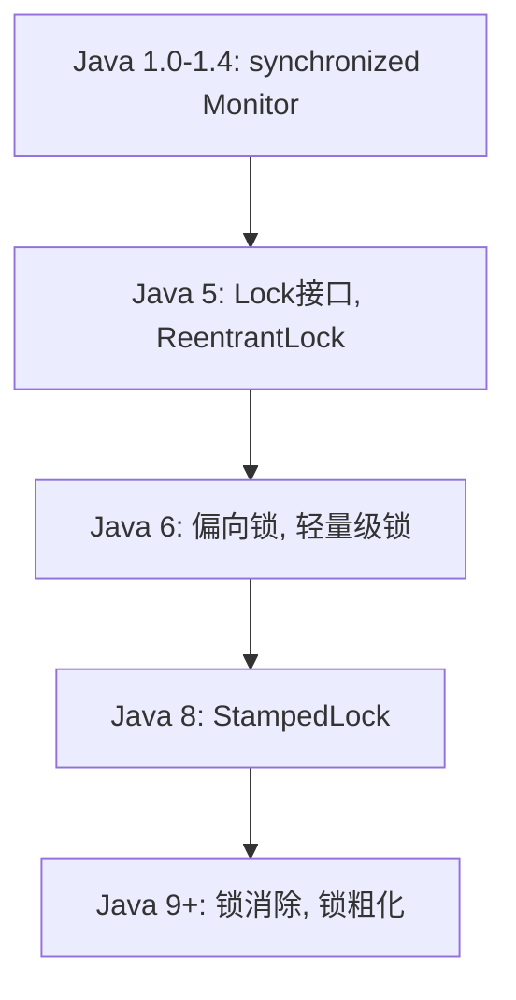

### 1.3 本文的目标与结构

本文的目标是帮助开发者从理论到实践全面掌握Java锁机制，涵盖锁的底层原理、实现细节、性能优化以及实际应用场景。文章结构如下：

- **基础知识**：介绍锁的核心概念和分类。
- **内置锁与显式锁**：深入剖析`synchronized`和`ReentrantLock`的实现与使用。
- **高级锁机制**：探讨读写锁、`StampedLock`等工具。
- **性能优化**：分享锁优化的最佳实践。
- **实战案例**：通过代码示例展示锁的实际应用。

本文将结合图表、代码示例和源码分析，确保内容既深入又易于理解。

------

## 2. Java锁机制基础

### 2.1 锁的定义与并发控制的核心概念

锁是一种并发控制机制，用于协调多线程对共享资源的访问，确保线程安全。锁的核心功能包括：

1. **互斥性（Mutual Exclusion）**：在任意时刻，只有一个线程可以持有锁并访问共享资源，其他线程必须等待锁释放。
2. **内存可见性（Visibility）**：锁通过Java内存模型（JMM）的`happens-before`规则，确保线程在释放锁时对共享资源的修改对后续获取锁的线程可见。
3. **原子性（Atomicity）**：锁保护的临界区代码作为一个整体执行，不会被其他线程中断。

**锁的基本工作流程**：

- **获取锁**：线程尝试获取锁，若锁已被占用，则进入阻塞或等待状态。
- **执行临界区**：持有锁的线程安全地访问共享资源。
- **释放锁**：线程完成操作后释放锁，允许其他线程竞争。

**示例代码：无锁导致的数据竞争**

```java
public class UnsafeCounter {
    private int count = 0;

    public void increment() {
        count++; // 非线程安全：count++分解为读取-修改-写入
    }

    public int getCount() {
        return count;
    }
}
```

在多线程环境下，`count++`操作可能导致数据丢失。例如，两个线程同时读取`count=0`，各自加1后写入，结果可能是`count=1`而非预期`count=2`。

**解决方法：加锁**

```java
public class SafeCounter {
    private int count = 0;

    public synchronized void increment() {
        count++; // 通过synchronized确保互斥性
    }

    public int getCount() {
        return count;
    }
}
```

### 2.2 线程安全与数据竞争问题

**线程安全**是指在多线程环境下，程序能够正确执行且不产生意外行为。一个类或方法是线程安全的，当且仅当其在并发访问时能够保证：

- **正确性**：共享资源的状态始终一致。
- **无竞争条件**：不会因线程调度顺序导致结果不一致。

**数据竞争**发生在以下条件同时满足：

1. 多个线程访问同一共享资源。
2. 至少一个线程执行写操作。
3. 访问之间没有同步机制。

**图表2：数据竞争示例（无锁计数器）**

| 时间点 | 线程A       | 线程B       | count值 |
| ------ | ----------- | ----------- | ------- |
| T1     | 读取count=0 |             | 0       |
| T2     |             | 读取count=0 | 0       |
| T3     | 计算count=1 |             | 0       |
| T4     |             | 计算count=1 | 0       |
| T5     | 写入count=1 |             | 1       |
| T6     |             | 写入count=1 | 1       |

**结果**：预期`count=2`，实际`count=1`，数据丢失。

使用锁可以确保线程按顺序执行临界区代码，避免数据竞争。

### 2.3 Java中锁的分类：内置锁与显式锁

Java中的锁机制分为两类：

1. **内置锁（Intrinsic Lock）**：
   - 通过`synchronized`关键字实现。
   - 每个Java对象都关联一个**监视器（Monitor）**，`synchronized`通过Monitor的`enter`和`exit`操作实现互斥。
   - **优点**：语法简单，JVM自动管理锁的获取与释放。
   - **缺点**：缺乏灵活性（如不支持中断或超时），早期版本性能较低。
2. **显式锁（Explicit Lock）**：
   - 基于`java.util.concurrent.locks`包中的`Lock`接口，主要实现类包括`ReentrantLock`和`ReentrantReadWriteLock`。
   - 基于**抽象队列同步器（AQS，AbstractQueuedSynchronizer）**，通过CAS（Compare-And-Swap）操作和线程队列实现高效锁机制。
   - **优点**：支持中断、超时、公平锁、条件变量等高级功能。
   - **缺点**：需要手动管理锁的获取与释放，代码复杂度较高。

**图表3：内置锁与显式锁的详细对比**

| 特性            | synchronized                 | ReentrantLock                 |
| --------------- | ---------------------------- | ----------------------------- |
| **实现机制**    | JVM内置，基于对象Monitor     | Java类库，基于AQS框架         |
| **锁获取/释放** | 自动管理，try-finally不必要  | 需手动调用lock()/unlock()     |
| **灵活性**      | 仅支持互斥锁，无法中断或超时 | 支持中断、超时、公平锁等      |
| **性能**        | Java 6+优化后性能接近显式锁  | 高并发场景下更灵活、可优化    |
| **条件变量**    | 依赖Object的wait()/notify()  | 支持Condition对象，灵活性更高 |
| **使用场景**    | 简单并发场景                 | 复杂并发控制，如生产者-消费者 |

**代码示例：synchronized vs. ReentrantLock**

```java
// 使用synchronized
public class SynchronizedCounter {
    private int count = 0;

    public synchronized void increment() {
        count++;
    }
}

// 使用ReentrantLock
public class LockCounter {
    private int count = 0;
    private final ReentrantLock lock = new ReentrantLock();

    public void increment() {
        lock.lock();
        try {
            count++;
        } finally {
            lock.unlock();
        }
    }
}
```

### 2.4 锁与Java内存模型（JMM）的关系

Java内存模型（JMM）定义了线程间共享变量的访问规则，锁通过JMM的`happens-before`关系确保内存可见性和操作顺序：

- **加锁规则**：线程获取锁时，会清空本地内存中的共享变量值，强制从主内存加载最新值。
- **解锁规则**：线程释放锁时，会将本地内存中的共享变量值刷新到主内存。

**JMM中的锁相关happens-before规则**：

- 锁的释放操作`happens-before`后续对同一锁的获取操作。
- 对共享变量的写操作在锁释放前完成，读操作在锁获取后执行。

**代码示例：锁确保内存可见性**

```java
public class VisibilityDemo {
    private int value = 0;
    private final ReentrantLock lock = new ReentrantLock();

    public void setValue(int newValue) {
        lock.lock();
        try {
            value = newValue; // 写操作，释放锁时刷新到主内存
        } finally {
            lock.unlock();
        }
    }

    public int getValue() {
        lock.lock();
        try {
            return value; // 读操作，加锁时从主内存加载
        } finally {
            lock.unlock();
        }
    }
}
```

**图表4：锁与JMM的内存可见性**

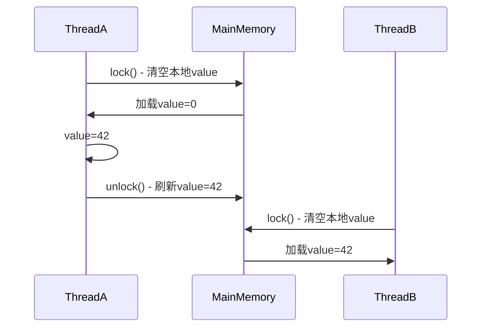

**关键点**：

- 锁通过内存屏障（Memory Barrier）确保变量的可见性。
- `synchronized`和`ReentrantLock`在释放锁时都会插入**写屏障**，在获取锁时插入**读屏障**。

------

## 3. 内置锁：synchronized关键字深入解析

### 3.1 synchronized的工作原理

`synchronized`是Java内置的锁机制，依赖于每个Java对象或类关联的**监视器（Monitor）**实现。监视器是JVM层面的同步原语，确保互斥性，即同一时刻只有一个线程可以持有锁。线程进入`synchronized`块或方法时获取监视器，退出时释放。

**工作机制**：

- **监视器进入**：JVM执行`monitorenter`字节码指令，尝试获取对象的监视器。如果监视器已被其他线程持有，当前线程进入阻塞状态，加入监视器的**入口集（Entry Set）**。
- **监视器退出**：JVM执行`monitorexit`字节码指令，释放监视器，允许其他线程竞争。
- **对象头**：每个Java对象包含一个**对象头（Object Header）**，其中的**标记字（Mark Word）**存储锁状态、持有线程ID等信息。
- **可重入性**：`synchronized`支持可重入锁，同一线程可以多次获取同一锁，JVM通过维护一个重入计数器记录获取次数。

**监视器结构**：

- **入口集（Entry Set）**：存储等待获取锁的线程。
- **等待集（Wait Set）**：存储通过`wait()`方法等待的线程。
- **拥有者（Owner）**：当前持有锁的线程。

**图表：synchronized监视器工作流程**

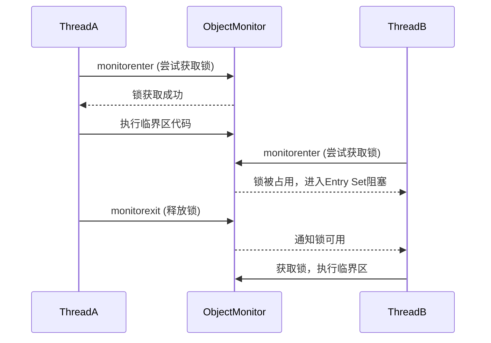

### 3.2 同步方法与同步代码块

`synchronized`可以应用于方法和代码块，分别对应不同的使用场景：

1. **同步方法**：

   - 使用`synchronized`修饰方法，锁对象是**当前实例（this）**（实例方法）或**类对象（Class）**（静态方法）。
   - 语法简洁，适合保护整个方法体的线程安全。

   ```java
   public class SynchronizedMethodDemo {
       private int count = 0;
   
       public synchronized void increment() {
           count++;
       }
   
       public static synchronized void staticIncrement() {
           // 锁为Class对象
       }
   }
   ```

2. **同步代码块**：

   - 使用`synchronized(obj)`指定锁对象，保护特定代码段。
   - 允许更细粒度的锁控制，减少锁范围以提高性能。

   ```java
   public class SynchronizedBlockDemo {
       private int count = 0;
       private final Object lock = new Object();
   
       public void increment() {
           synchronized (lock) {
               count++;
           }
       }
   }
   ```

**选择建议**：

- 使用同步方法时，锁范围较大，可能导致性能瓶颈。
- 使用同步代码块可以精确控制锁范围，推荐在高并发场景中使用。

### 3.3 synchronized的锁升级过程

早期Java的`synchronized`依赖重量级锁（涉及操作系统内核），性能开销较大。从Java 6开始，JVM引入了**锁优化**机制，通过**偏向锁**、**轻量级锁**和**重量级锁**的动态升级，显著提升性能。

**锁状态与升级流程**：

1. **无锁状态**：对象初始状态，无线程竞争。
2. 偏向锁（Biased Locking）：
   - 适用于单线程反复获取同一锁的场景。
   - JVM将对象头的标记字记录为偏向线程ID，避免频繁的锁竞争。
   - 通过`-XX:+UseBiasedLocking`启用（Java 6+默认开启）。
3. 轻量级锁（Lightweight Locking）：
   - 当有轻微竞争时，JVM使用CAS（Compare-And-Swap）操作在栈帧中创建**锁记录（Lock Record）**，避免内核态切换。
   - 适用于竞争短暂的场景。
4. 重量级锁（Heavyweight Locking）：
   - 当竞争加剧，JVM将锁膨胀为重量级锁，依赖操作系统互斥量（Mutex）。
   - 性能开销较大，涉及线程阻塞和上下文切换。

**图表：synchronized锁升级流程**

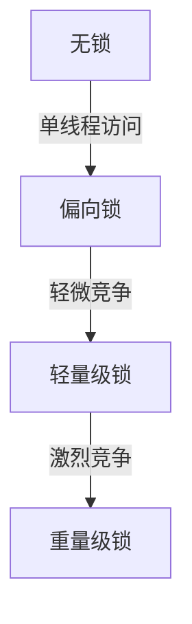

**锁升级的关键点**：

- 锁升级是单向的（不可降级），以避免复杂的状态管理。
- JVM通过对象头的**标记字**和**锁记录**动态管理锁状态。
- 偏向锁和轻量级锁在低竞争场景下显著降低开销。

**代码示例：锁升级的场景**

```java
public class LockUpgradeDemo {
    private int count = 0;

    public void increment() {
        synchronized (this) {
            count++; // 可能触发偏向锁->轻量级锁->重量级锁
        }
    }
}
```

### 3.4 synchronized的优缺点分析

**优点**：

- **简单易用**：语法简洁，JVM自动管理锁的获取和释放，无需显式解锁。
- **内存可见性**：通过`happens-before`规则确保共享变量的可见性。
- **优化成熟**：Java 6+的锁优化（如偏向锁、轻量级锁）使其性能接近显式锁。

**缺点**：

- **灵活性低**：不支持中断、超时或公平锁。
- **锁范围固定**：同步方法锁住整个方法体，可能导致性能瓶颈。
- **调试困难**：无法直接获取锁状态或等待队列信息。

### 3.5 使用synchronized的典型场景

- **简单并发控制**：如线程安全的计数器、单例模式。
- **对象级锁**：保护实例变量的访问。
- **类级锁**：保护静态资源的访问（如全局配置）。

**示例：线程安全的单例模式**

```java
public class Singleton {
    private static Singleton instance;

    private Singleton() {}

    public static synchronized Singleton getInstance() {
        if (instance == null) {
            instance = new Singleton();
        }
        return instance;
    }
}
```

------

## 4. 显式锁：Lock接口与ReentrantLock详解

### 4.1 Lock接口简介

`java.util.concurrent.locks.Lock`接口是Java 5引入的显式锁机制，提供了比`synchronized`更灵活的并发控制功能。`Lock`接口定义了锁的基本操作，包括：

- `lock()`：获取锁，阻塞直到成功。
- `tryLock()`：尝试获取锁，立即返回是否成功。
- `tryLock(long time, TimeUnit unit)`：在指定时间内尝试获取锁。
- `unlock()`：释放锁。
- `newCondition()`：创建条件变量，用于线程间协调。

**主要实现类**：

- `ReentrantLock`：可重入互斥锁，支持公平和非公平模式。
- `ReentrantReadWriteLock`：读写分离锁，适用于读多写少场景（详见第5章）。

### 4.2 ReentrantLock的特性

`ReentrantLock`是`Lock`接口的核心实现，基于**抽象队列同步器（AQS，AbstractQueuedSynchronizer）**，具有以下特性：

1. **可重入性**：
   - 同一线程可以多次获取同一锁，AQS维护一个重入计数器。
   - 示例：线程调用嵌套方法时，无需担心死锁。
2. **公平锁与非公平锁**：
   - **公平锁**：线程按请求顺序获取锁（通过构造参数`new ReentrantLock(true)`启用）。
   - **非公平锁**（默认）：允许线程插队，减少上下文切换，提高吞吐量。
   - 公平锁性能较低，适用于需要严格顺序的场景。
3. **条件变量（Condition）**：
   - 支持多个`Condition`对象，允许线程在不同条件下等待或唤醒。
   - 比`synchronized`的`wait()/notify()`更灵活。

**代码示例：使用ReentrantLock**

```java
import java.util.concurrent.locks.ReentrantLock;

public class ReentrantLockDemo {
    private int count = 0;
    private final ReentrantLock lock = new ReentrantLock();

    public void increment() {
        lock.lock();
        try {
            count++;
        } finally {
            lock.unlock(); // 确保锁释放
        }
    }
}
```

### 4.3 ReentrantLock的源码分析

`ReentrantLock`基于AQS实现，AQS的核心是一个**状态变量（state）**和一个**FIFO队列**：

- **状态变量**：表示锁的持有状态（0表示未被持有，>0表示被持有，数值表示重入次数）。
- **队列**：存储等待锁的线程，使用CAS操作管理队列。

**核心方法**：

- ```
  lock()：通过AQS的acquire
  ```

  方法获取锁，涉及：

  1. CAS尝试设置`state`。
  2. 若失败，线程加入AQS的等待队列。

- `unlock()`：通过AQS的`release`方法释放锁，更新`state`并唤醒队列中的下一个线程。

**公平锁与非公平锁的区别**：

- 非公平锁：新线程可能通过CAS“抢占”锁，减少阻塞。
- 公平锁：检查队列是否为空，确保先到先得。

**伪代码：ReentrantLock的lock()逻辑**

```java
void lock() {
    if (compareAndSetState(0, 1)) { // CAS尝试获取锁
        setExclusiveOwnerThread(currentThread);
    } else {
        acquire(1); // 加入AQS队列，阻塞等待
    }
}
```

### 4.4 ReentrantLock与synchronized的对比

| 特性         | synchronized          | ReentrantLock               |
| ------------ | --------------------- | --------------------------- |
| **锁管理**   | 自动获取/释放         | 手动lock()/unlock()         |
| **中断支持** | 不支持                | 支持（lockInterruptibly()） |
| **超时机制** | 不支持                | 支持（tryLock(timeout)）    |
| **公平性**   | 非公平                | 可选公平/非公平             |
| **条件变量** | 单条件（wait/notify） | 多条件（Condition对象）     |
| **性能**     | 优化后接近显式锁      | 高并发场景更灵活            |

**选择建议**：

- 使用`synchronized`：简单场景，代码量少，JVM优化充分。
- 使用`ReentrantLock`：需要中断、超时、公平锁或多条件变量的复杂场景。

### 4.5 ReentrantLock的高级用法

1. **可中断锁**：

   - `lockInterruptibly()`允许线程在等待锁时响应中断，适用于需要取消的任务。

   ```java
   public void interruptibleLock() throws InterruptedException {
       lock.lockInterruptibly();
       try {
           // 业务逻辑
       } finally {
           lock.unlock();
       }
   }
   ```

2. **定时锁**：

   - `tryLock(long time, TimeUnit unit)`在指定时间内尝试获取锁，超时返回false。

   ```java
   public boolean tryLockWithTimeout() throws InterruptedException {
       if (lock.tryLock(1, TimeUnit.SECONDS)) {
           try {
               // 业务逻辑
               return true;
           } finally {
               lock.unlock();
           }
       }
       return false;
   }
   ```

3. **条件变量**：

   - 使用`Condition`实现线程间精确协调，如生产者-消费者模型。

   ```java
   import java.util.concurrent.locks.ReentrantLock;
   import java.util.concurrent.locks.Condition;
   
   public class ProducerConsumer {
       private final ReentrantLock lock = new ReentrantLock();
       private final Condition notFull = lock.newCondition();
       private final Condition notEmpty = lock.newCondition();
       private final int[] buffer = new int[10];
       private int count = 0;
   
       public void produce(int item) throws InterruptedException {
           lock.lock();
           try {
               while (count == buffer.length) {
                   notFull.await(); // 缓冲区满，等待
               }
               buffer[count++] = item;
               notEmpty.signal(); // 通知消费者
           } finally {
               lock.unlock();
           }
       }
   
       public int consume() throws InterruptedException {
           lock.lock();
           try {
               while (count == 0) {
                   notEmpty.await(); // 缓冲区空，等待
               }
               int item = buffer[--count];
               notFull.signal(); // 通知生产者
               return item;
           } finally {
               lock.unlock();
           }
       }
   }
   ```

**图表：ReentrantLock的条件变量工作流程**

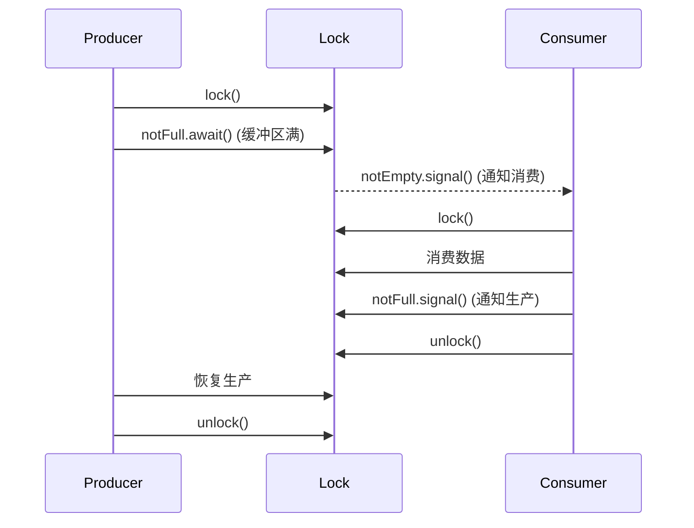

------

## 5. 读写锁：ReentrantReadWriteLock深入剖析

### 5.1 读写锁的概念与适用场景

在高并发场景中，许多应用程序具有**读多写少**的特性，例如缓存系统、数据库查询或配置文件访问。传统的互斥锁（如`synchronized`或`ReentrantLock`）在读操作频繁时会导致不必要的阻塞，因为即使多个读操作不会修改数据，也必须排队等待锁。**读写锁**通过区分读操作（共享）和写操作（独占），显著提升并发性能。

`ReentrantReadWriteLock`是Java `java.util.concurrent.locks`包中的读写锁实现，包含两个锁：

- **读锁（Read Lock）**：允许多个线程同时持有，适合并发读取。
- **写锁（Write Lock）**：独占锁，仅一个线程可持有，适合数据修改。

**适用场景**：

- 缓存系统：多线程读取缓存数据，偶尔更新缓存。
- 数据库查询：查询操作频繁，更新操作较少。
- 配置文件管理：多个线程读取配置，偶尔修改。

**图表：读写锁与互斥锁的并发性对比**

| 锁类型 | 读-读并发 | 读-写并发 | 写-写并发 | 适用场景             |
| ------ | --------- | --------- | --------- | -------------------- |
| 互斥锁 | 不允许    | 不允许    | 不允许    | 通用并发控制         |
| 读写锁 | 允许      | 不允许    | 不允许    | 读多写少的高并发场景 |

### 5.2 ReentrantReadWriteLock的实现机制

`ReentrantReadWriteLock`基于**抽象队列同步器（AQS）**实现，通过一个32位`state`变量管理读锁和写锁状态：

- 高16位表示读锁的持有计数（包括重入）。
- 低16位表示写锁的重入计数。

**核心特性**：

1. **读锁共享**：多个线程可同时获取读锁，AQS通过计数器记录读锁持有数。
2. **写锁独占**：写锁获取时，需等待所有读锁和写锁释放。
3. **可重入性**：读锁和写锁均支持同一线程多次获取。
4. **锁降级**：支持写锁降级为读锁（先获取写锁，再获取读锁，最后释放写锁），但不支持读锁升级为写锁（防止死锁）。

**内部实现**：

- 使用AQS的`state`变量和两个队列（读锁队列和写锁队列）管理线程。
- 读锁获取：通过CAS操作递增读锁计数。
- 写锁获取：通过CAS设置独占状态，等待读锁清零。

**代码示例：使用ReentrantReadWriteLock实现缓存**

```java
import java.util.HashMap;
import java.util.Map;
import java.util.concurrent.locks.ReentrantReadWriteLock;

public class CacheDemo {
    private final Map<String, String> cache = new HashMap<>();
    private final ReentrantReadWriteLock rwLock = new ReentrantReadWriteLock();

    public String get(String key) {
        rwLock.readLock().lock();
        try {
            return cache.get(key);
        } finally {
            rwLock.readLock().unlock();
        }
    }

    public void put(String key, String value) {
        rwLock.writeLock().lock();
        try {
            cache.put(key, value);
        } finally {
            rwLock.writeLock().unlock();
        }
    }
}
```

**锁降级示例**：

```java
public void updateAndRead(String key, String newValue) {
    rwLock.writeLock().lock();
    try {
        cache.put(key, newValue); // 修改缓存
        rwLock.readLock().lock(); // 获取读锁
        try {
            // 释放写锁前确保读锁已获取
            String value = cache.get(key);
            // 进行读操作
        } finally {
            rwLock.readLock().unlock();
        }
    } finally {
        rwLock.writeLock().unlock(); // 释放写锁（锁降级完成）
    }
}
```

**图表：读写锁的工作流程**

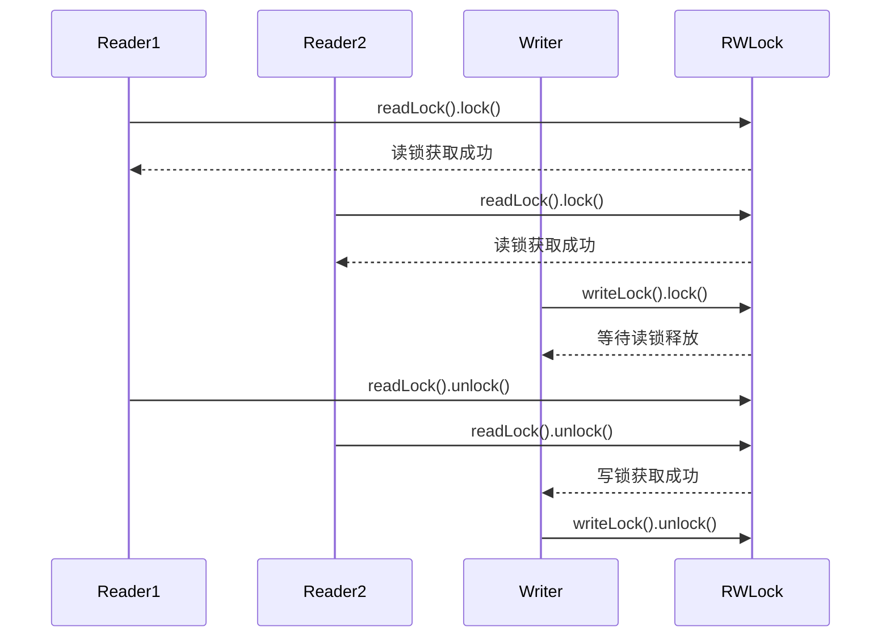

### 5.3 读写锁的性能优势与局限性

**性能优势**：

- **高并发读**：允许多个读线程同时访问，提升读密集场景的吞吐量。
- **锁降级**：在写后读场景中，锁降级避免了线程重新竞争读锁的开销。
- **灵活性**：支持公平和非公平模式（通过构造参数配置）。

**局限性**：

- **复杂性**：需要手动管理读锁和写锁，代码复杂度高于`synchronized`。
- **写饥饿**：在读线程极多的情况下，写线程可能长时间无法获取锁。
- **不支持锁升级**：读锁无法直接升级为写锁，需先释放读锁再获取写锁，可能导致数据竞争。

**使用建议**：

- 在读多写少场景中优先考虑`ReentrantReadWriteLock`。
- 避免在高写频场景中使用，以防止写饥饿。
- 确保正确释放锁（使用`try-finally`）。

### 5.4 使用读写锁的典型案例

**案例：线程安全的缓存系统**

```java
import java.util.HashMap;
import java.util.Map;
import java.util.concurrent.locks.ReentrantReadWriteLock;

public class ThreadSafeCache {
    private final Map<String, String> cache = new HashMap<>();
    private final ReentrantReadWriteLock rwLock = new ReentrantReadWriteLock();

    public String get(String key) {
        rwLock.readLock().lock();
        try {
            return cache.getOrDefault(key, "Not Found");
        } finally {
            rwLock.readLock().unlock();
        }
    }

    public void put(String key, String value) {
        rwLock.writeLock().lock();
        try {
            cache.put(key, value);
        } finally {
            rwLock.writeLock().unlock();
        }
    }

    public void clear() {
        rwLock.writeLock().lock();
        try {
            cache.clear();
        } finally {
            rwLock.writeLock().unlock();
        }
    }
}
```

**场景分析**：

- 读操作（如`get`）允许多线程并发执行。
- 写操作（如`put`、`clear`）独占访问，确保数据一致性。
- 适用于Web应用的热点数据缓存或配置管理。

------

## 6. 高级锁机制与工具

### 6.1 StampedLock：Java 8的乐观锁机制

`StampedLock`是Java 8引入的一种高级锁，针对读多写少场景进一步优化性能。与`ReentrantReadWriteLock`不同，`StampedLock`支持**乐观读（Optimistic Reading）**，避免了读锁的开销。

**核心特性**：

1. 三种锁模式：
   - **写锁**：独占锁，类似`ReentrantReadWriteLock`的写锁。
   - **读锁**：共享锁，允许多线程并发读。
   - **乐观读**：无锁读操作，通过版本号（stamp）验证数据一致性。
2. **非可重入**：`StampedLock`不支持锁重入，需谨慎使用以避免死锁。
3. **锁转换**：支持读锁升级为写锁、写锁降级为读锁或乐观读。

**代码示例：使用StampedLock进行乐观读**

```java
import java.util.concurrent.locks.StampedLock;

public class Point {
    private double x, y;
    private final StampedLock lock = new StampedLock();

    public void move(double deltaX, double deltaY) {
        long stamp = lock.writeLock(); // 获取写锁
        try {
            x += deltaX;
            y += deltaY;
        } finally {
            lock.unlockWrite(stamp);
        }
    }

    public double distanceFromOrigin() {
        long stamp = lock.tryOptimisticRead(); // 尝试乐观读
        double currentX = x, currentY = y;
        if (lock.validate(stamp)) { // 验证数据未被修改
            return Math.sqrt(currentX * currentX + currentY * currentY);
        } else {
            // 数据被修改，退回到悲观读锁
            stamp = lock.readLock();
            try {
                currentX = x;
                currentY = y;
                return Math.sqrt(currentX * currentX + currentY * currentY);
            } finally {
                lock.unlockRead(stamp);
            }
        }
    }
}
```

**图表：StampedLock乐观读流程**

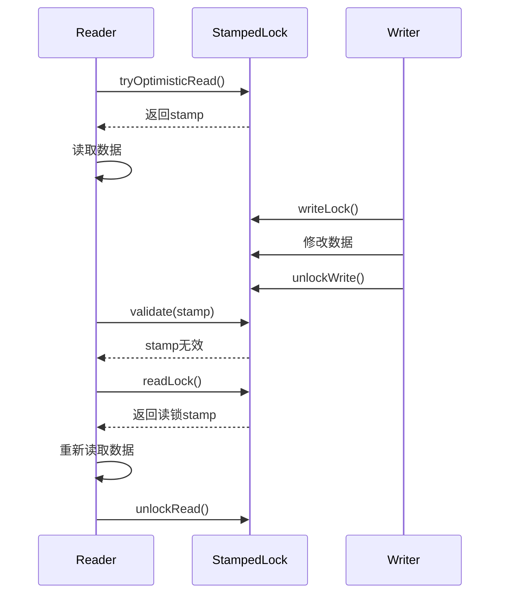

#### 6.1.1 乐观读（Optimistic Reading）

- 乐观读通过获取一个版本号（stamp）记录当前状态，读取数据后验证版本号是否变化。
- 若无变化，说明读期间数据未被修改，结果可靠；否则需退回到悲观读锁。
- 适用于读操作极频繁、写操作极少的场景，如实时统计或监控系统。

#### 6.1.2 StampedLock的使用场景与注意事项

**使用场景**：

- 高并发读场景，如实时数据仪表盘。
- 需要锁转换的复杂逻辑，如先读后写。

**注意事项**：

- **非可重入**：避免在同一线程多次获取同一锁，防止死锁。
- **验证开销**：乐观读需要验证`stamp`，在写频繁场景中可能频繁退回到悲观读。
- **正确释放**：必须使用正确的`stamp`调用`unlock`方法。

### 6.2 volatile关键字与锁的协同使用

`volatile`关键字不直接提供互斥性，但通过内存屏障确保变量的**可见性**和**有序性**，常与锁结合使用以优化性能。

**volatile的核心作用**：

- **可见性**：写操作后立即刷新到主内存，读操作从主内存加载最新值。
- **禁止重排序**：确保指令按预期顺序执行。

**与锁的结合**：

- 使用`volatile`标记状态变量，减少锁的使用范围。
- 适用于读多写少的场景，如状态标志或单次初始化。

**代码示例：volatile与锁协同**

```java
import java.util.concurrent.locks.ReentrantLock;

public class VolatileLockDemo {
    private volatile boolean initialized = false;
    private final ReentrantLock lock = new ReentrantLock();
    private String config;

    public String getConfig() {
        if (!initialized) {
            lock.lock();
            try {
                if (!initialized) { // 双重检查锁定
                    config = loadConfig();
                    initialized = true;
                }
            } finally {
                lock.unlock();
            }
        }
        return config;
    }

    private String loadConfig() {
        // 模拟加载配置
        return "config_data";
    }
}
```

**说明**：

- `volatile`的`initialized`确保初始化状态对所有线程可见。
- 锁保护初始化逻辑，避免重复初始化。

### 6.3 Semaphore与CountDownLatch中的锁应用

**Semaphore**：

- 用于控制并发访问资源的线程数，内部基于AQS实现。
- 常用于限流场景，如数据库连接池。

**代码示例：Semaphore限流**

```java
import java.util.concurrent.Semaphore;

public class ResourcePool {
    private final Semaphore semaphore = new Semaphore(3); // 限制3个并发访问

    public void accessResource() throws InterruptedException {
        semaphore.acquire();
        try {
            // 访问资源
            System.out.println("Thread " + Thread.currentThread().getName() + " accessing resource");
            Thread.sleep(1000);
        } finally {
            semaphore.release();
        }
    }
}
```

**CountDownLatch**：

- 用于线程同步，等待一组操作完成，内部也基于AQS。
- 常用于任务分解或初始化等待。

**代码示例：CountDownLatch同步**

```java
import java.util.concurrent.CountDownLatch;

public class TaskCoordinator {
    private final CountDownLatch latch = new CountDownLatch(3);

    public void performTask() throws InterruptedException {
        // 模拟任务
        Thread.sleep(1000);
        latch.countDown();
    }

    public void waitForTasks() throws InterruptedException {
        latch.await(); // 等待3个任务完成
    }
}
```

### 6.4 CyclicBarrier与锁的结合

`CyclicBarrier`用于让一组线程在某个点同步，适用于需要多线程协作的场景（如并行计算）。虽然`CyclicBarrier`本身基于`ReentrantLock`实现，开发者也可以结合其他锁机制增强控制。

**代码示例：CyclicBarrier与锁**

```java
import java.util.concurrent.CyclicBarrier;
import java.util.concurrent.locks.ReentrantLock;

public class ParallelComputation {
    private final CyclicBarrier barrier = new CyclicBarrier(3);
    private final ReentrantLock lock = new ReentrantLock();
    private int sharedResult = 0;

    public void compute(int value) throws Exception {
        // 模拟计算
        Thread.sleep(1000);
        lock.lock();
        try {
            sharedResult += value;
        } finally {
            lock.unlock();
        }
        barrier.await(); // 等待其他线程
    }

    public int getResult() {
        return sharedResult;
    }
}
```

**图表：CyclicBarrier工作流程**

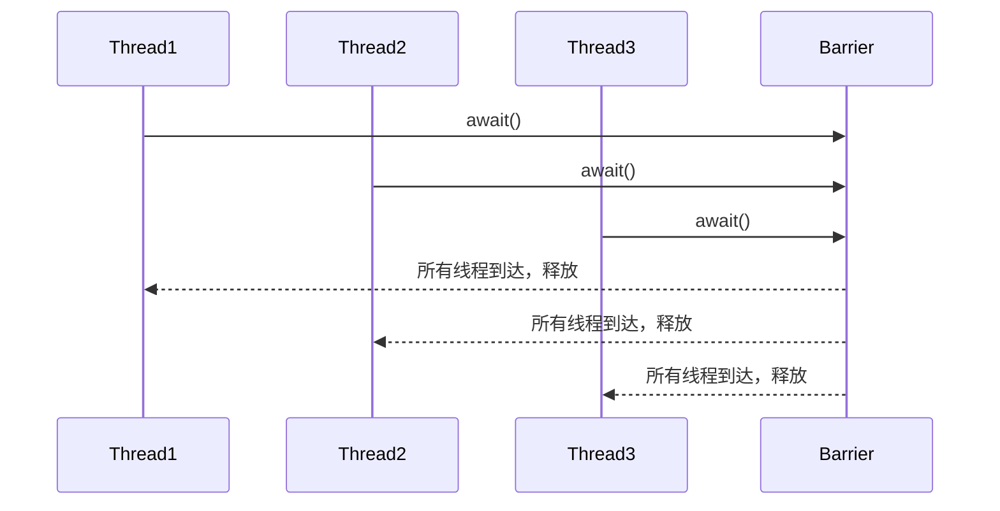

------

## 7. 锁的性能优化与最佳实践

锁机制在确保线程安全的同时可能引入性能开销，尤其在高并发场景下，锁竞争会导致线程阻塞和上下文切换，降低系统吞吐量。本章探讨锁性能优化的核心策略，包括锁粒度优化、锁拆分、减少锁持有时间以及无锁数据结构的结合使用，并提供最佳实践建议。

### 7.1 锁粒度的选择：粗粒度锁 vs 细粒度锁

**锁粒度**指锁保护的共享资源范围，分为粗粒度锁和细粒度锁：

- **粗粒度锁**：锁住较大的代码块或整个对象，代码简单但并发性低。
- **细粒度锁**：锁住更小的代码块或特定资源，提高并发性但增加代码复杂性。

**示例：粗粒度锁**

```java
public class CoarseGrainedLock {
    private int count = 0;

    public synchronized void increment() {
        count++; // 锁住整个方法
    }
}
```

**示例：细粒度锁**

```java
public class FineGrainedLock {
    private int count = 0;
    private final Object lock = new Object();

    public void increment() {
        synchronized (lock) {
            count++; // 仅锁住count操作
        }
    }
}
```

**权衡**：

- 粗粒度锁：适合简单场景，减少代码复杂度，但可能导致不必要的阻塞。
- 细粒度锁：适合高并发场景，但需小心避免死锁和复杂性。

**图表：粗粒度锁 vs 细粒度锁**

| 特性           | 粗粒度锁             | 细粒度锁             |
| -------------- | -------------------- | -------------------- |
| **并发性**     | 较低，线程排队等待   | 较高，减少阻塞       |
| **代码复杂性** | 简单，无需额外锁对象 | 较复杂，需管理多个锁 |
| **适用场景**   | 低并发，简单逻辑     | 高并发，复杂资源访问 |

### 7.2 锁拆分（Lock Splitting）与锁剥离（Lock Striping）

**锁拆分**：将一个大锁拆分为多个小锁，每个锁保护独立的资源，减少竞争。

**示例：锁拆分**

```java
public class LockSplittingDemo {
    private int counterA = 0;
    private int counterB = 0;
    private final Object lockA = new Object();
    private final Object lockB = new Object();

    public void incrementA() {
        synchronized (lockA) {
            counterA++;
        }
    }

    public void incrementB() {
        synchronized (lockB) {
            counterB++;
        }
    }
}
```

**锁剥离**：将锁拆分为固定数量的“条带”（stripes），每个条带保护一部分数据，常用于集合类（如`ConcurrentHashMap`）。

**示例：锁剥离（简化的ConcurrentHashMap思想）**

```java
import java.util.concurrent.locks.ReentrantLock;

public class StripedLockMap {
    private final ReentrantLock[] locks = new ReentrantLock[16]; // 16个锁条带
    private final int[] counters = new int[16];

    public StripedLockMap() {
        for (int i = 0; i < locks.length; i++) {
            locks[i] = new ReentrantLock();
        }
    }

    public void increment(int key) {
        int index = key % locks.length; // 哈希到锁条带
        locks[index].lock();
        try {
            counters[index]++;
        } finally {
            locks[index].unlock();
        }
    }
}
```

**效果**：

- 锁拆分和锁剥离通过减少锁竞争范围，显著提高并发性能。
- 适用于多线程访问独立资源或分区数据的场景，如并发集合。

### 7.3 减少锁持有时间的技术

锁持有时间直接影响并发性能，缩短锁持有时间是优化的关键。

**策略**：

1. **缩小临界区**：仅将必要操作放入锁保护范围。
2. **预计算**：将不依赖共享资源的计算移出锁。
3. **异步操作**：将耗时操作移到锁外异步执行。

**示例：减少锁持有时间**

```java
public class OptimizedLock {
    private int count = 0;
    private final ReentrantLock lock = new ReentrantLock();

    public void incrementAndProcess() {
        int temp;
        lock.lock();
        try {
            temp = ++count; // 仅锁住count修改
        } finally {
            lock.unlock();
        }
        // 耗时操作移到锁外
        process(temp);
    }

    private void process(int value) {
        // 模拟耗时操作
        try {
            Thread.sleep(1000);
        } catch (InterruptedException e) {
            Thread.currentThread().interrupt();
        }
    }
}
```

### 7.4 使用无锁数据结构降低锁依赖

在某些场景下，无锁（Lock-Free）数据结构（如`ConcurrentHashMap`、`ConcurrentLinkedQueue`）或原子操作（如`AtomicInteger`）可以替代锁，减少阻塞。

**示例：使用AtomicInteger替代锁**

```java
import java.util.concurrent.atomic.AtomicInteger;

public class AtomicCounter {
    private final AtomicInteger count = new AtomicInteger(0);

    public void increment() {
        count.incrementAndGet(); // 无锁原子操作
    }

    public int getCount() {
        return count.get();
    }
}
```

**优势**：

- 无锁结构基于CAS操作，避免线程阻塞。
- 适用于高并发、简单更新的场景，如计数器、队列。

**局限性**：

- CAS可能导致ABA问题或高竞争下的性能下降。
- 复杂逻辑仍需锁支持。

### 7.5 性能监控与锁优化的工具推荐

**工具**：

1. **JVisualVM**：监控锁竞争、线程状态和阻塞时间。
2. **JMH（Java Microbenchmark Harness）**：基准测试锁性能。
3. **Thread Dump分析**：使用`jstack`诊断死锁和锁竞争。
4. **Java Flight Recorder (JFR)**：分析锁等待和性能瓶颈。

**最佳实践**：

- **分析竞争**：使用JFR监控锁等待时间，识别热点。
- **测试优化**：通过JMH对比不同锁策略的性能。
- **日志记录**：在锁操作中添加日志，便于调试和分析。

**图表：锁优化策略总结**

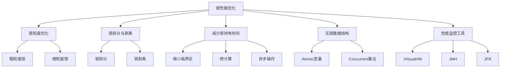

------

## 8. 锁相关问题与解决方案

锁使用不当可能导致死锁、活锁、饥饿或性能瓶颈。本章分析常见问题及其解决方案，结合示例和调试技巧，帮助开发者规避陷阱。

### 8.1 死锁（Deadlock）：成因、检测与避免

**死锁定义**：多个线程因循环等待对方持有的锁而永久阻塞。

**死锁的四个必要条件**：

1. **互斥**：资源只能被一个线程持有。
2. **占有并等待**：线程持有至少一个资源并等待其他资源。
3. **不可抢占**：资源只能由持有者主动释放。
4. **循环等待**：线程间形成资源等待的闭环。

**示例：死锁场景**

```java
public class DeadlockDemo {
    private final Object lockA = new Object();
    private final Object lockB = new Object();

    public void methodA() {
        synchronized (lockA) {
            System.out.println("Thread A: Holding lockA");
            try { Thread.sleep(100); } catch (InterruptedException e) {}
            synchronized (lockB) {
                System.out.println("Thread A: Acquired lockB");
            }
        }
    }

    public void methodB() {
        synchronized (lockB) {
            System.out.println("Thread B: Holding lockB");
            try { Thread.sleep(100); } catch (InterruptedException e) {}
            synchronized (lockA) {
                System.out.println("Thread B: Acquired lockA");
            }
        }
    }
}
```

**死锁场景**：

- 线程A持有`lockA`，等待`lockB`。
- 线程B持有`lockB`，等待`lockA`。
- 结果：双方循环等待，形成死锁。

**图表：死锁循环等待**

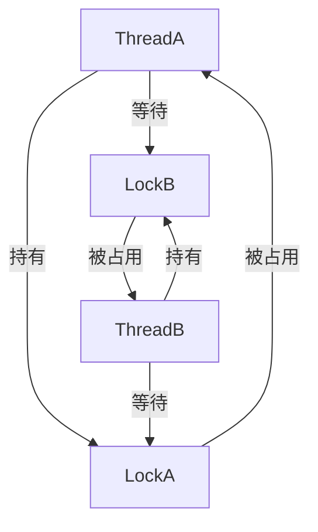

**检测与避免**：

1. 检测：
   - 使用`jstack`生成线程转储，查找`Blocked`状态和锁依赖。
   - JVisualVM或JFR可可视化死锁。
2. 避免：
   - **固定锁顺序**：所有线程按相同顺序获取锁。
   - **超时机制**：使用`ReentrantLock`的`tryLock(timeout)`避免无限等待。
   - **资源分层**：将资源访问分层，避免交叉依赖。

**示例：固定锁顺序避免死锁**

```java
public class FixedDeadlockDemo {
    private final Object lockA = new Object();
    private final Object lockB = new Object();

    public void methodA() {
        synchronized (lockA) {
            synchronized (lockB) {
                // 操作
            }
        }
    }

    public void methodB() {
        synchronized (lockA) {
            synchronized (lockB) {
                // 操作
            }
        }
    }
}
```

### 8.2 活锁（Livelock）与饥饿（Starvation）

**活锁**：

- 定义：线程不断尝试获取锁但无法成功，陷入“假活跃”状态。
- 场景：两个线程相互礼让锁，导致反复重试。
- 解决：引入随机等待或优先级机制。

**饥饿**：

- 定义：某些线程因优先级低或锁竞争激烈而无法获取锁。
- 场景：非公平锁（如`ReentrantLock`默认模式）下，低优先级线程被高优先级线程抢占。
- 解决：
  - 使用公平锁（`new ReentrantLock(true)`）。
  - 优化锁竞争，减少高优先级线程的频繁访问。

**示例：饥饿问题**

```java
import java.util.concurrent.locks.ReentrantLock;

public class StarvationDemo {
    private final ReentrantLock lock = new ReentrantLock(); // 非公平锁

    public void task() {
        lock.lock();
        try {
            // 模拟高优先级线程频繁占用
            Thread.sleep(100);
        } catch (InterruptedException e) {
            Thread.currentThread().interrupt();
        } finally {
            lock.unlock();
        }
    }
}
```

**解决：使用公平锁**

```java
private final ReentrantLock lock = new ReentrantLock(true); // 公平锁
```

### 8.3 锁竞争导致的性能瓶颈分析

**问题**：

- 高并发下，多个线程竞争同一锁导致阻塞和上下文切换。
- 锁范围过大或持有时间过长，降低吞吐量。

**分析方法**：

- 使用JFR监控锁等待时间和竞争频率。
- 通过JMH基准测试比较不同锁策略的性能。

**优化策略**：

- 使用细粒度锁或锁剥离（见7.2）。
- 采用无锁数据结构（如`ConcurrentHashMap`）。
- 分离读写操作，使用`ReentrantReadWriteLock`或`StampedLock`。

### 8.4 锁使用中的常见误区与调试技巧

**常见误区**：

1. **忘记释放锁**：`ReentrantLock`未在`finally`块中调用`unlock()`。
2. **嵌套锁顺序错误**：导致死锁。
3. **过度使用锁**：锁住不需要保护的资源，降低性能。
4. **忽略中断**：未处理`InterruptedException`，导致线程无法取消。

**调试技巧**：

- **线程转储**：使用`jstack <pid>`分析锁状态。
- **日志记录**：在锁获取和释放时记录线程信息。
- **性能监控**：使用JVisualVM或JFR定位锁竞争热点。

**示例：添加调试日志**

```java
import java.util.concurrent.locks.ReentrantLock;

public class DebugLockDemo {
    private final ReentrantLock lock = new ReentrantLock();

    public void task() {
        System.out.println(Thread.currentThread().getName() + " attempting to acquire lock");
        lock.lock();
        try {
            System.out.println(Thread.currentThread().getName() + " acquired lock");
            // 业务逻辑
        } finally {
            lock.unlock();
            System.out.println(Thread.currentThread().getName() + " released lock");
        }
    }
}
```

------

## 9. 实战案例与代码示例

本章通过五个实战案例，展示如何在实际场景中使用Java锁机制解决并发问题。每个案例结合具体的业务场景，涵盖`synchronized`、`ReentrantLock`、`ReentrantReadWriteLock`、`StampedLock`以及多线程事务管理，旨在帮助读者将理论知识应用于实践。

### 9.1 使用synchronized实现线程安全的计数器

**场景**：实现一个高并发的计数器，确保多线程环境下计数准确。

**代码示例**：

```java
public class SynchronizedCounter {
    private int count = 0;

    public synchronized void increment() {
        count++;
    }

    public synchronized int getCount() {
        return count;
    }
}
```

**分析**：

- 使用`synchronized`保护`count`的读写操作，确保线程安全。
- 简单场景下，`synchronized`语法简洁，JVM优化（如偏向锁、轻量级锁）使其性能可靠。
- **缺点**：锁粒度较粗，高并发下可能导致竞争。

**测试代码**：

```java
public class CounterTest {
    public static void main(String[] args) throws InterruptedException {
        SynchronizedCounter counter = new SynchronizedCounter();
        Runnable task = counter::increment;
        Thread[] threads = new Thread[10];
        for (int i = 0; i < threads.length; i++) {
            threads[i] = new Thread(task);
            threads[i].start();
        }
        for (Thread thread : threads) {
            thread.join();
        }
        System.out.println("Final count: " + counter.getCount()); // 预期输出：10
    }
}
```

**图表：多线程计数器执行流程**

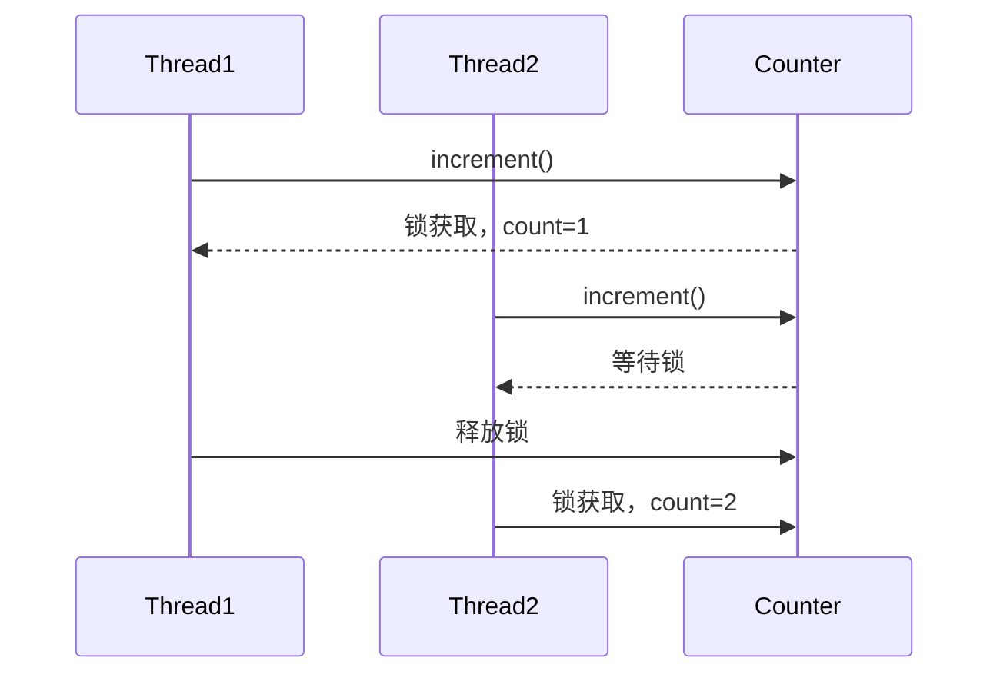

### 9.2 使用ReentrantLock实现生产者-消费者模型

**场景**：实现一个生产者-消费者模型，多个生产者线程向缓冲区添加数据，多个消费者线程从中取出数据。

**代码示例**：

```java
import java.util.concurrent.locks.ReentrantLock;
import java.util.concurrent.locks.Condition;

public class ProducerConsumerQueue {
    private final int[] buffer = new int[10];
    private int count = 0;
    private final ReentrantLock lock = new ReentrantLock();
    private final Condition notFull = lock.newCondition();
    private final Condition notEmpty = lock.newCondition();

    public void produce(int item) throws InterruptedException {
        lock.lock();
        try {
            while (count == buffer.length) {
                notFull.await(); // 缓冲区满，等待
            }
            buffer[count++] = item;
            notEmpty.signal(); // 通知消费者
        } finally {
            lock.unlock();
        }
    }

    public int consume() throws InterruptedException {
        lock.lock();
        try {
            while (count == 0) {
                notEmpty.await(); // 缓冲区空，等待
            }
            int item = buffer[--count];
            notFull.signal(); // 通知生产者
            return item;
        } finally {
            lock.unlock();
        }
    }
}
```

**测试代码**：

```java
public class ProducerConsumerTest {
    public static void main(String[] args) {
        ProducerConsumerQueue queue = new ProducerConsumerQueue();
        Runnable producer = () -> {
            try {
                queue.produce(1);
            } catch (InterruptedException e) {
                Thread.currentThread().interrupt();
            }
        };
        Runnable consumer = () -> {
            try {
                System.out.println("Consumed: " + queue.consume());
            } catch (InterruptedException e) {
                Thread.currentThread().interrupt();
            }
        };
        new Thread(producer).start();
        new Thread(consumer).start();
    }
}
```

**分析**：

- `ReentrantLock`结合`Condition`实现精确的线程协调。
- 比`synchronized`的`wait()/notify()`更灵活，支持多个条件变量。
- **注意**：必须在`finally`块中释放锁，避免死锁。

### 9.3 使用ReentrantReadWriteLock优化缓存系统

**场景**：实现一个线程安全的缓存系统，支持高并发读取和低频写入。

**代码示例**：

```java
import java.util.HashMap;
import java.util.Map;
import java.util.concurrent.locks.ReentrantReadWriteLock;

public class ThreadSafeCache {
    private final Map<String, String> cache = new HashMap<>();
    private final ReentrantReadWriteLock rwLock = new ReentrantReadWriteLock();

    public String get(String key) {
        rwLock.readLock().lock();
        try {
            return cache.getOrDefault(key, "Not Found");
        } finally {
            rwLock.readLock().unlock();
        }
    }

    public void put(String key, String value) {
        rwLock.writeLock().lock();
        try {
            cache.put(key, value);
        } finally {
            rwLock.writeLock().unlock();
        }
    }
}
```

**测试代码**：

```java
public class CacheTest {
    public static void main(String[] args) throws InterruptedException {
        ThreadSafeCache cache = new ThreadSafeCache();
        Runnable writer = () -> cache.put("key", "value");
        Runnable reader = () -> System.out.println("Value: " + cache.get("key"));
        Thread[] threads = new Thread[5];
        threads[0] = new Thread(writer);
        for (int i = 1; i < threads.length; i++) {
            threads[i] = new Thread(reader);
        }
        for (Thread thread : threads) {
            thread.start();
        }
        for (Thread thread : threads) {
            thread.join();
        }
    }
}
```

**分析**：

- 读锁允许多线程并发读取，提高吞吐量。
- 写锁确保数据一致性，适合读多写少的场景。
- **优化建议**：若写操作更频繁，可考虑其他机制（如`ConcurrentHashMap`）。

### 9.4 使用StampedLock处理高并发读写场景

**场景**：实现一个坐标点类，支持高并发读取距离（读多），偶尔更新坐标（写少）。

**代码示例**：

```java
import java.util.concurrent.locks.StampedLock;

public class Point {
    private double x, y;
    private final StampedLock lock = new StampedLock();

    public void move(double deltaX, double deltaY) {
        long stamp = lock.writeLock();
        try {
            x += deltaX;
            y += deltaY;
        } finally {
            lock.unlockWrite(stamp);
        }
    }

    public double distanceFromOrigin() {
        long stamp = lock.tryOptimisticRead(); // 乐观读
        double currentX = x, currentY = y;
        if (lock.validate(stamp)) {
            return Math.sqrt(currentX * currentX + currentY * currentY);
        } else {
            // 退回到悲观读锁
            stamp = lock.readLock();
            try {
                currentX = x;
                currentY = y;
                return Math.sqrt(currentX * currentX + currentY * currentY);
            } finally {
                lock.unlockRead(stamp);
            }
        }
    }
}
```

**分析**：

- 乐观读减少锁开销，适合读频繁场景。
- 验证`stamp`确保数据一致性，失败时退回到悲观读锁。
- **注意**：`StampedLock`不可重入，需避免嵌套锁。

### 9.5 多线程环境下的事务管理与锁应用

**场景**：模拟数据库事务，多个线程并发更新账户余额，确保事务原子性。

**代码示例**：

```java
import java.util.concurrent.locks.ReentrantLock;

public class AccountManager {
    private final ReentrantLock lock = new ReentrantLock();
    private final Map<String, Double> accounts = new HashMap<>();

    public void transfer(String from, String to, double amount) throws InterruptedException {
        lock.lock();
        try {
            // 模拟事务
            Double fromBalance = accounts.getOrDefault(from, 0.0);
            if (fromBalance < amount) {
                throw new IllegalStateException("Insufficient balance");
            }
            accounts.put(from, fromBalance - amount);
            accounts.put(to, accounts.getOrDefault(to, 0.0) + amount);
        } finally {
            lock.unlock();
        }
    }
}
```

**测试代码**：

```java
public class TransferTest {
    public static void main(String[] args) throws InterruptedException {
        AccountManager manager = new AccountManager();
        manager.transfer("A", "B", 0); // 初始化账户
        Runnable transfer = () -> {
            try {
                manager.transfer("A", "B", 100);
            } catch (InterruptedException e) {
                Thread.currentThread().interrupt();
            }
        };
        Thread[] threads = new Thread[5];
        for (int i = 0; i < threads.length; i++) {
            threads[i] = new Thread(transfer);
            threads[i].start();
        }
        for (Thread thread : threads) {
            thread.join();
        }
    }
}
```

**分析**：

- 使用`ReentrantLock`确保事务操作原子性。
- 锁保护整个事务，避免数据不一致。
- **优化建议**：若涉及多个账户，可使用细粒度锁或分布式锁。

**图表：事务管理锁流程**

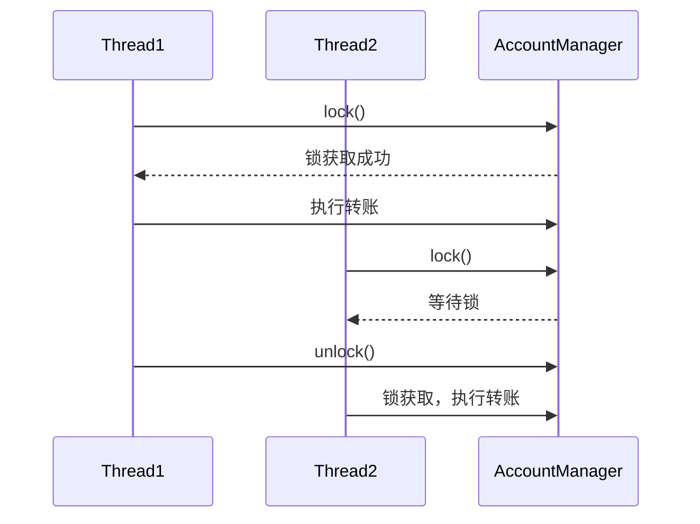

------

## 10. Java锁的底层实现与JVM优化

本章深入探讨Java锁的底层实现机制以及JVM的锁优化技术，帮助读者理解锁在JVM和操作系统层面的工作原理。

### 10.1 JVM中的Monitor实现原理

`synchronized`依赖JVM内置的**监视器（Monitor）**实现，每个Java对象关联一个Monitor。Monitor的核心组件包括：

- **Mark Word**：对象头的标记字，存储锁状态、线程ID、重入计数。
- **Entry Set**：等待获取锁的线程队列。
- **Wait Set**：通过`wait()`进入等待的线程集合。

**Monitor操作**：

- **monitorenter**：尝试获取锁，成功则更新Mark Word，失败则进入Entry Set。
- **monmexit**：释放锁，唤醒Entry Set中的线程。
- **wait/notify**：线程在Wait Set中等待或被唤醒。

**图表：Monitor结构**

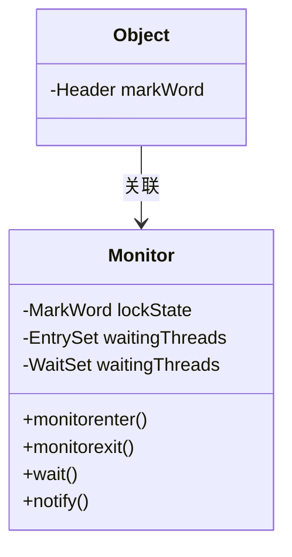

### 10.2 锁膨胀与锁消除的JVM优化机制

JVM通过以下优化技术降低`synchronized`的开销：

1. **锁膨胀（Lock Inflation）**：

   - 偏向锁 → 轻量级锁 → 重量级锁（见第3.3节）。
   - 动态升级根据竞争程度选择最优锁类型。

2. **锁消除（Lock Elision）**：

   - JVM通过逃逸分析（Escape Analysis）检测锁是否逃逸到其他线程。
   - 若锁仅在单线程内使用，JVM移除锁操作。

   **示例：锁消除**

   ```java
   public String concat(String a, String b) {
       StringBuilder sb = new StringBuilder();
       synchronized (sb) { // JVM可消除此锁
           sb.append(a).append(b);
       }
       return sb.toString();
   }
   ```

3. **锁粗化（Lock Coarsening）**：

   - JVM将多个小范围锁合并为一个大范围锁，减少锁操作开销。

   **示例：锁粗化**

   ```java
   public void coarseLock() {
       synchronized (this) { count++; }
       synchronized (this) { count++; }
       // JVM可能优化为：
       // synchronized (this) { count++; count++; }
   }
   ```

### 10.3 Java锁与操作系统的关系

- **重量级锁**：依赖操作系统互斥量（Mutex），涉及用户态到内核态切换。
- **轻量级锁/偏向锁**：通过CAS操作在用户态完成，避免内核态开销。
- **线程阻塞**：重量级锁的阻塞线程由操作系统调度，涉及上下文切换。

**图表：锁与操作系统交互**

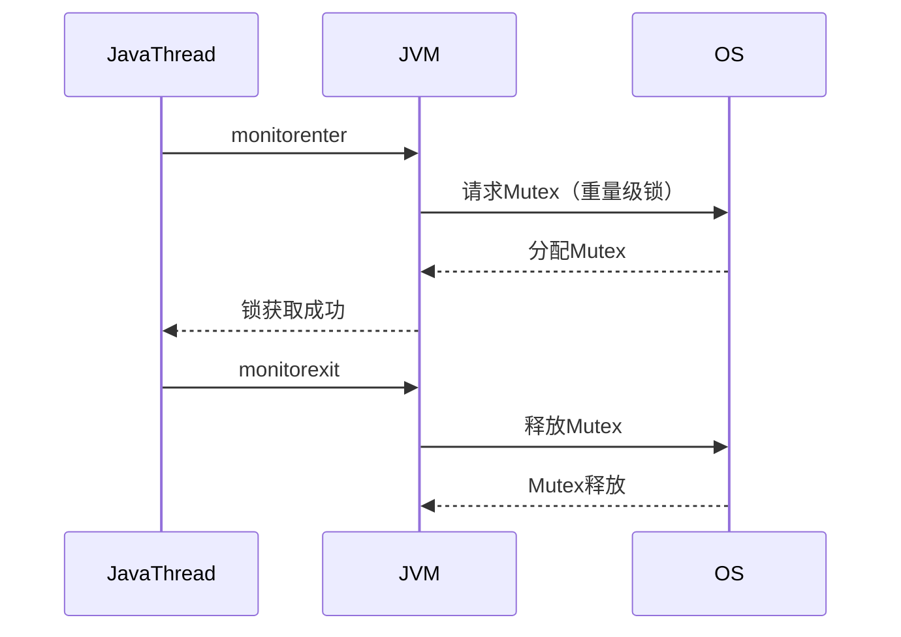

### 10.4 HotSpot JVM对锁的优化策略

HotSpot JVM通过以下技术优化锁性能：

- 自旋锁（Spin Lock）：高竞争时，线程短暂自旋而非立即阻塞，减少上下文切换。
  - 配置：`-XX:+UseSpinning`（默认启用）。
- **自适应自旋**：JVM根据历史竞争情况动态调整自旋次数。
- **锁消除与粗化**：通过JIT编译器优化锁操作。
- **偏向锁延迟**：避免对象创建初期频繁偏向切换（`-XX:BiasedLockingStartupDelay`）。

**性能影响**：

- 偏向锁和轻量级锁在低竞争场景下性能接近无锁。
- 重量级锁适合高竞争场景，但需优化锁粒度。

------

## 11. 总结与未来展望

本章对Java锁机制进行总结，回顾关键要点，并展望并发控制技术的未来发展趋势，帮助读者巩固知识并了解行业方向。

### 11.1 Java锁机制的总结与关键要点

Java的锁机制是并发编程的核心，提供了从简单到复杂的工具，满足不同场景的需求。以下是本文覆盖的核心内容和关键要点：

1. **锁的基础与分类**：
   - 锁通过**互斥性**和**内存可见性**解决数据竞争和线程安全问题。
   - Java锁分为**内置锁**（`synchronized`）和**显式锁**（`Lock`接口，如`ReentrantLock`、`ReentrantReadWriteLock`、`StampedLock`）。
   - 内置锁简单易用，显式锁提供更高灵活性（如中断、超时、条件变量）。
2. **主要锁机制**：
   - **`synchronized`**：基于JVM的Monitor实现，支持锁升级（偏向锁、轻量级锁、重量级锁），适合简单场景。
   - **`ReentrantLock`**：基于AQS，支持公平锁、条件变量，适合复杂并发控制。
   - **`ReentrantReadWriteLock`**：读写分离，优化读多写少场景。
   - **`StampedLock`**：支持乐观读，进一步提升高并发读性能。
   - **其他工具**：`Semaphore`、`CountDownLatch`、`CyclicBarrier`等结合锁实现特定同步需求。
3. **性能优化**：
   - 优化锁粒度、拆分锁、减少锁持有时间和使用无锁数据结构（如`ConcurrentHashMap`、`AtomicInteger`）可显著提高性能。
   - JVM优化（如锁消除、锁粗化、自旋锁）使`synchronized`在低竞争场景下性能接近显式锁。
4. **常见问题**：
   - 死锁、活锁、饥饿和性能瓶颈是锁使用的常见陷阱。
   - 解决方案包括固定锁顺序、使用超时机制、性能监控和调试工具（如JVisualVM、JFR）。
5. **实战应用**：
   - 通过计数器、生产者-消费者、缓存系统、坐标点和事务管理等案例，展示了锁在实际场景中的应用。
   - 选择合适的锁机制需平衡性能、复杂性和场景需求。

**图表：Java锁机制总结**

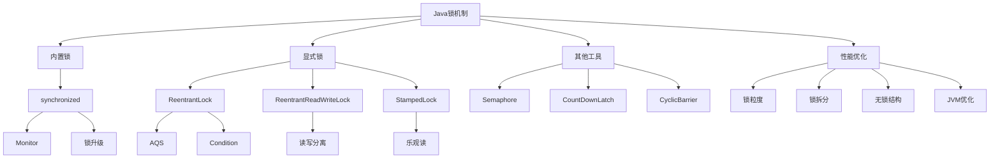

### 11.2 锁机制在现代并发编程中的角色

锁机制在现代并发编程中扮演着不可或缺的角色，尤其在以下场景：

- **高并发Web服务**：如缓存系统、会话管理，需高效的读写锁或无锁结构。
- **分布式系统**：锁机制常与分布式锁（如ZooKeeper、Redis）结合，确保跨进程同步。
- **实时数据处理**：如流处理系统，需低延迟的锁或无锁方案。
- **多核处理器优化**：锁优化和并行计算技术充分利用多核性能。

然而，随着无锁编程、响应式编程和并发框架（如Project Loom）的兴起，锁的使用在某些场景下被更高效的替代方案取代。开发者需根据场景选择合适的并发工具。

### 11.3 未来Java并发控制的趋势与技术演进

Java并发控制技术持续演进，以下是未来可能的发展方向：

1. **Project Loom与虚拟线程**：
   - Project Loom引入**虚拟线程（Virtual Threads）**，显著降低线程创建和切换开销。
   - 虚拟线程可能减少对传统锁的依赖，通过结构化并发（Structured Concurrency）简化同步。
   - 示例：虚拟线程可直接运行大量轻量级任务，减少锁竞争。
2. **无锁与并发集合的普及**：
   - `ConcurrentHashMap`、`ConcurrentLinkedQueue`等无锁数据结构在高并发场景中表现出色。
   - 未来的Java可能进一步扩展无锁工具，如更高效的原子操作类。
3. **响应式编程的兴起**：
   - 框架如Reactor和RxJava通过事件驱动和异步流处理数据，减少锁的使用。
   - 锁机制可能更多用于底层框架，而上层应用倾向于响应式模型。
4. **JVM优化的持续改进**：
   - HotSpot JVM将继续优化锁性能，如更智能的自旋锁策略、更高效的锁消除。
   - 未来的JVM可能集成更多并发原语，直接支持复杂同步模式。
5. **分布式并发控制**：
   - 随着微服务和分布式系统的普及，分布式锁（如基于etcd、Consul）与本地锁结合将成为趋势。
   - Java可能引入更原生的分布式并发支持。

**展望**：

- 开发者应关注新兴并发模型（如虚拟线程、响应式编程），并结合传统锁机制灵活应对复杂场景。
- 性能监控和调试工具将更加重要，帮助开发者优化并发程序。

**代码示例：虚拟线程初步体验（基于Java 21+）**

```java
import java.util.concurrent.Executors;

public class VirtualThreadDemo {
    public static void main(String[] args) {
        try (var executor = Executors.newVirtualThreadPerTaskExecutor()) {
            for (int i = 0; i < 1000; i++) {
                executor.submit(() -> {
                    // 模拟并发任务
                    System.out.println("Task running in virtual thread: " + Thread.currentThread());
                    try {
                        Thread.sleep(100);
                    } catch (InterruptedException e) {
                        Thread.currentThread().interrupt();
                    }
                });
            }
        }
    }
}
```

**分析**：

- 虚拟线程轻量高效，适合高并发任务，减少锁竞争。
- 未来可能结合`StructuredTaskScope`实现更简洁的并发控制。

**图表：并发控制技术演进**

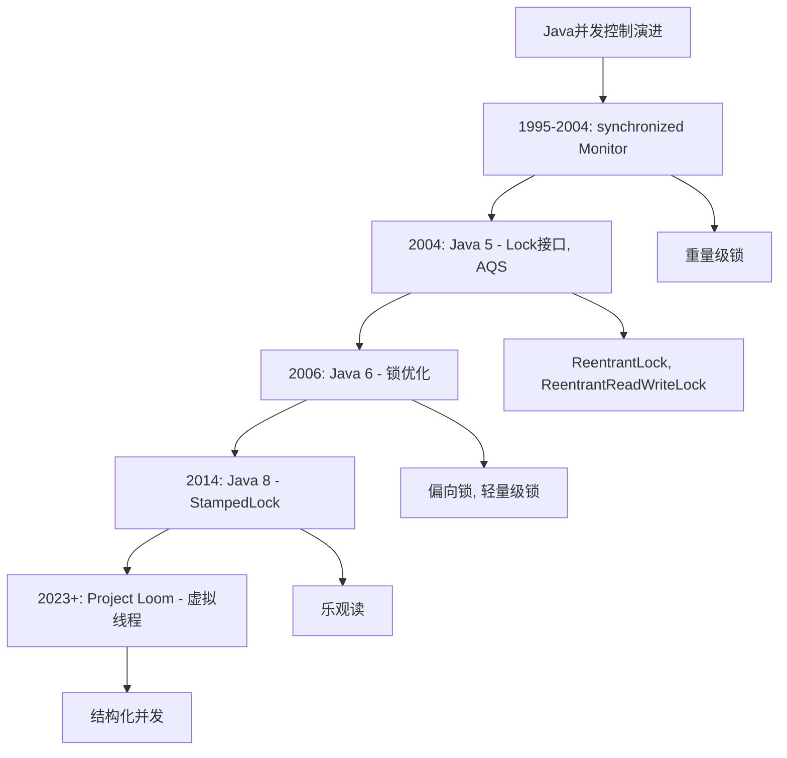
