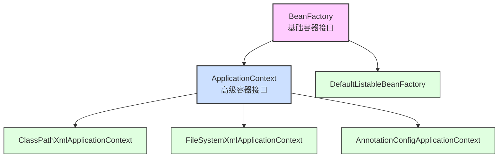
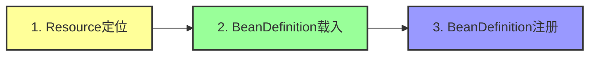
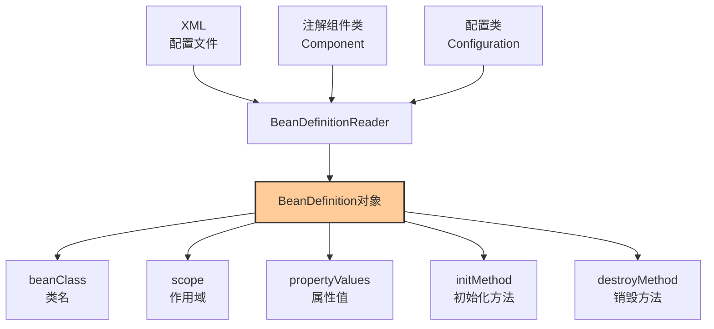
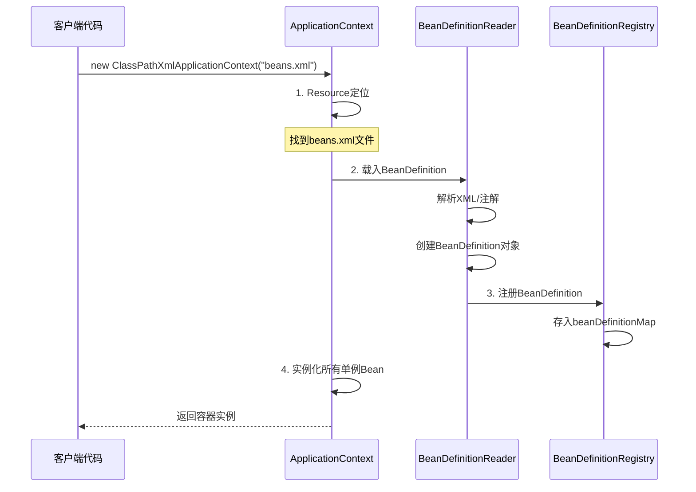
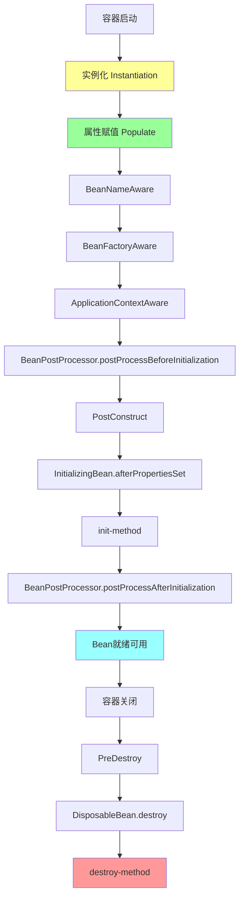
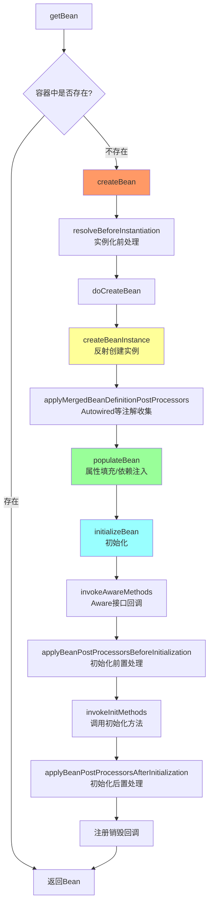
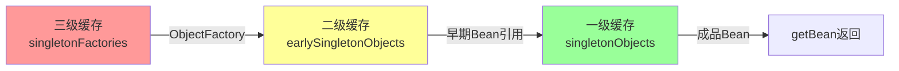
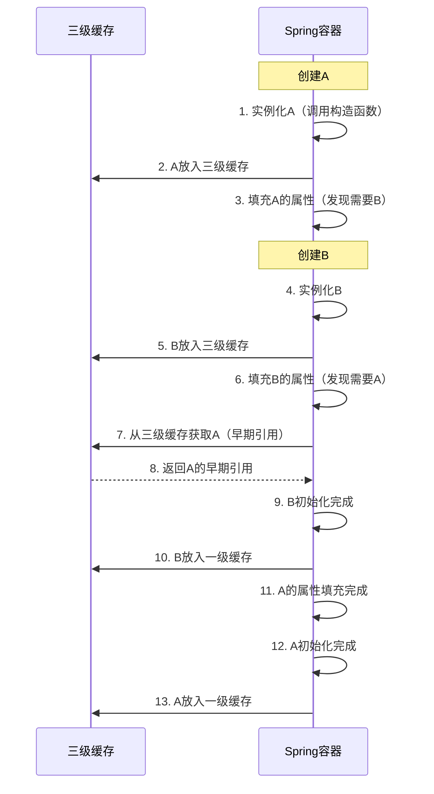
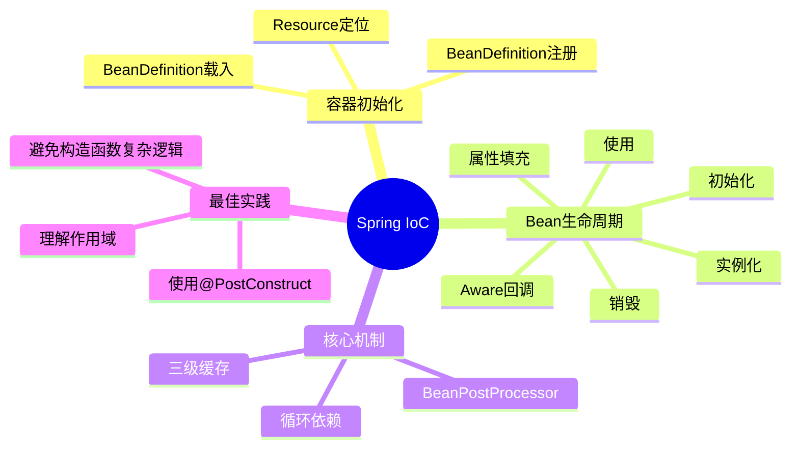

## 📚 一、IoC容器概述

IoC（Inversion of Control，控制反转）是Spring框架的核心。简单来说，就是**把对象的创建和管理权交给Spring容器**，而不是由我们自己在代码中new对象。

### 1.1 容器的两大家族



**区别：**

- **BeanFactory**：基础容器，懒加载（用到才创建Bean）
- **ApplicationContext**：高级容器，启动时就创建所有单例Bean，提供更多企业级功能

## 🔄 二、IoC容器初始化三部曲



### 2.1 第一步：Resource定位

**作用**：找到配置文件的位置（XML、注解、Java配置等）

```java
// 示例1: 从类路径加载
ApplicationContext context = new ClassPathXmlApplicationContext("applicationContext.xml");

// 示例2: 从文件系统加载
ApplicationContext context = new FileSystemXmlApplicationContext("D:/config/beans.xml");

// 示例3: 注解配置
ApplicationContext context = new AnnotationConfigApplicationContext(AppConfig.class);
```

### 2.2 第二步：BeanDefinition载入

**作用**：将配置信息解析成Spring内部的数据结构——BeanDefinition



**BeanDefinition示例：**

```java
// XML配置
<bean id="userService" class="com.example.UserService" 
      scope="singleton" init-method="init" destroy-method="cleanup">
    <property name="userDao" ref="userDao"/>
</bean>

// 对应的BeanDefinition内部结构
BeanDefinition bd = new GenericBeanDefinition();
bd.setBeanClassName("com.example.UserService");
bd.setScope("singleton");
bd.setInitMethodName("init");
bd.setDestroyMethodName("cleanup");
// ... 属性依赖信息
```

### 2.3 第三步：BeanDefinition注册

**作用**：将BeanDefinition存入IoC容器的HashMap中

```java
// DefaultListableBeanFactory 核心源码
public class DefaultListableBeanFactory {
    // 存储所有BeanDefinition的Map，key是beanName
    private final Map<String, BeanDefinition> beanDefinitionMap = 
        new ConcurrentHashMap<>(256);
    
    // 注册BeanDefinition
    public void registerBeanDefinition(String beanName, BeanDefinition beanDefinition) {
        this.beanDefinitionMap.put(beanName, beanDefinition);
    }
}
```

### 完整初始化流程图



## 🌱 三、Bean的完整生命周期

### 3.1 生命周期概览



### 3.2 详细生命周期说明

| 阶段                  | 时机       | 作用                    | 示例                        |
| --------------------- | ---------- | ----------------------- | --------------------------- |
| **1. 实例化**         | Bean创建   | 调用构造函数            | `new UserService()`         |
| **2. 属性填充**       | 实例化后   | 依赖注入（DI）          | 注入`@Autowired`的字段      |
| **3. Aware接口回调**  | 属性填充后 | 注入Spring内部对象      | 获取BeanName、BeanFactory等 |
| **4. 初始化前置处理** | 初始化前   | AOP代理创建时机之一     | `@PostConstruct`执行前      |
| **5. 初始化**         | 前置处理后 | 自定义初始化逻辑        | 数据库连接池初始化          |
| **6. 初始化后置处理** | 初始化后   | **AOP代理主要创建时机** | 返回代理对象                |
| **7. 使用中**         | 初始化完成 | Bean正常工作            | 业务调用                    |
| **8. 销毁**           | 容器关闭   | 释放资源                | 关闭连接池                  |

## 💻 四、完整代码示例

### 4.1 创建一个完整的Bean

```java
package com.example;

import org.springframework.beans.BeansException;
import org.springframework.beans.factory.*;
import org.springframework.context.ApplicationContext;
import org.springframework.context.ApplicationContextAware;
import org.springframework.stereotype.Component;
import javax.annotation.PostConstruct;
import javax.annotation.PreDestroy;

@Component
public class LifecycleBean implements 
    BeanNameAware, 
    BeanFactoryAware,
    ApplicationContextAware, 
    InitializingBean, 
    DisposableBean {

    private String property;

    // ========== 1. 实例化 ==========
    public LifecycleBean() {
        System.out.println("1. 构造函数：Bean实例化");
    }

    // ========== 2. 属性填充 ==========
    public void setProperty(String property) {
        this.property = property;
        System.out.println("2. 属性填充：setProperty() = " + property);
    }

    // ========== 3. Aware接口回调 ==========
    @Override
    public void setBeanName(String name) {
        System.out.println("3. BeanNameAware：Bean名称 = " + name);
    }

    @Override
    public void setBeanFactory(BeanFactory beanFactory) throws BeansException {
        System.out.println("4. BeanFactoryAware：注入BeanFactory");
    }

    @Override
    public void setApplicationContext(ApplicationContext applicationContext) 
        throws BeansException {
        System.out.println("5. ApplicationContextAware：注入ApplicationContext");
    }

    // ========== 4. 初始化前 (@PostConstruct) ==========
    @PostConstruct
    public void postConstruct() {
        System.out.println("6. @PostConstruct：初始化前回调");
    }

    // ========== 5. InitializingBean接口 ==========
    @Override
    public void afterPropertiesSet() throws Exception {
        System.out.println("7. InitializingBean.afterPropertiesSet()");
    }

    // ========== 6. 自定义init-method ==========
    public void customInit() {
        System.out.println("8. init-method：自定义初始化方法");
    }

    // ========== 7. 使用中 ==========
    public void doSomething() {
        System.out.println(">>> Bean正在工作中...");
    }

    // ========== 8. 销毁前 (@PreDestroy) ==========
    @PreDestroy
    public void preDestroy() {
        System.out.println("9. @PreDestroy：销毁前回调");
    }

    // ========== 9. DisposableBean接口 ==========
    @Override
    public void destroy() throws Exception {
        System.out.println("10. DisposableBean.destroy()");
    }

    // ========== 10. 自定义destroy-method ==========
    public void customDestroy() {
        System.out.println("11. destroy-method：自定义销毁方法");
    }
}
```

### 4.2 自定义BeanPostProcessor

```java
package com.example;

import org.springframework.beans.BeansException;
import org.springframework.beans.factory.config.BeanPostProcessor;
import org.springframework.stereotype.Component;

@Component
public class MyBeanPostProcessor implements BeanPostProcessor {

    @Override
    public Object postProcessBeforeInitialization(Object bean, String beanName) 
        throws BeansException {
        if (bean instanceof LifecycleBean) {
            System.out.println(">>> BeanPostProcessor.postProcessBeforeInitialization");
        }
        return bean;
    }

    @Override
    public Object postProcessAfterInitialization(Object bean, String beanName) 
        throws BeansException {
        if (bean instanceof LifecycleBean) {
            System.out.println(">>> BeanPostProcessor.postProcessAfterInitialization");
            // 这里可以返回代理对象（AOP就是在这里实现的）
        }
        return bean;
    }
}
```

### 4.3 配置类

```java
package com.example;

import org.springframework.context.annotation.Bean;
import org.springframework.context.annotation.ComponentScan;
import org.springframework.context.annotation.Configuration;

@Configuration
@ComponentScan("com.example")
public class AppConfig {

    @Bean(initMethod = "customInit", destroyMethod = "customDestroy")
    public LifecycleBean lifecycleBean() {
        return new LifecycleBean();
    }
}
```

### 4.4 测试类

```java
package com.example;

import org.springframework.context.annotation.AnnotationConfigApplicationContext;

public class Main {
    public static void main(String[] args) {
        System.out.println("========== 容器初始化开始 ==========");
        
        AnnotationConfigApplicationContext context = 
            new AnnotationConfigApplicationContext(AppConfig.class);
        
        System.out.println("\n========== 容器初始化完成 ==========\n");
        
        LifecycleBean bean = context.getBean(LifecycleBean.class);
        bean.doSomething();
        
        System.out.println("\n========== 容器开始关闭 ==========");
        context.close();
        System.out.println("========== 容器关闭完成 ==========");
    }
}
```

### 4.5 运行输出

```tex
========== 容器初始化开始 ==========
1. 构造函数：Bean实例化
2. 属性填充：setProperty() = null
3. BeanNameAware：Bean名称 = lifecycleBean
4. BeanFactoryAware：注入BeanFactory
5. ApplicationContextAware：注入ApplicationContext
>>> BeanPostProcessor.postProcessBeforeInitialization
6. @PostConstruct：初始化前回调
7. InitializingBean.afterPropertiesSet()
8. init-method：自定义初始化方法
>>> BeanPostProcessor.postProcessAfterInitialization

========== 容器初始化完成 ==========

>>> Bean正在工作中...

========== 容器开始关闭 ==========
9. @PreDestroy：销毁前回调
10. DisposableBean.destroy()
11. destroy-method：自定义销毁方法
========== 容器关闭完成 ==========
```

## 🔍 五、核心源码分析

### 5.1 AbstractApplicationContext.refresh()

这是IoC容器初始化的**总指挥**方法：

```java
public void refresh() throws BeansException, IllegalStateException {
    synchronized (this.startupShutdownMonitor) {
        // 1. 准备刷新上下文环境
        prepareRefresh();
        
        // 2. 获取BeanFactory（DefaultListableBeanFactory）
        ConfigurableListableBeanFactory beanFactory = obtainFreshBeanFactory();
        
        // 3. BeanFactory的预准备工作
        prepareBeanFactory(beanFactory);
        
        try {
            // 4. BeanFactory准备工作完成后的后置处理
            postProcessBeanFactory(beanFactory);
            
            // 5. 执行BeanFactoryPostProcessor
            invokeBeanFactoryPostProcessors(beanFactory);
            
            // 6. 注册BeanPostProcessor
            registerBeanPostProcessors(beanFactory);
            
            // 7. 初始化MessageSource（国际化）
            initMessageSource();
            
            // 8. 初始化事件派发器
            initApplicationEventMulticaster();
            
            // 9. 子类扩展点：初始化特殊Bean
            onRefresh();
            
            // 10. 注册监听器
            registerListeners();
            
            // 11. 【重点】实例化所有剩余的单例Bean
            finishBeanFactoryInitialization(beanFactory);
            
            // 12. 完成刷新，发布事件
            finishRefresh();
        } catch (BeansException ex) {
            // 销毁已创建的Bean
            destroyBeans();
            cancelRefresh(ex);
            throw ex;
        }
    }
}
```

### 5.2 Bean创建流程



### 5.3 核心方法源码

```java
// AbstractAutowireCapableBeanFactory.doCreateBean()
protected Object doCreateBean(String beanName, RootBeanDefinition mbd, Object[] args) {
    // 1. 实例化Bean
    BeanWrapper instanceWrapper = createBeanInstance(beanName, mbd, args);
    Object bean = instanceWrapper.getWrappedInstance();
    
    // 2. 属性填充（依赖注入）
    populateBean(beanName, mbd, instanceWrapper);
    
    // 3. 初始化Bean
    Object exposedObject = initializeBean(beanName, bean, mbd);
    
    return exposedObject;
}

// 初始化Bean
protected Object initializeBean(String beanName, Object bean, RootBeanDefinition mbd) {
    // 3.1 调用Aware接口
    invokeAwareMethods(beanName, bean);
    
    // 3.2 初始化前置处理
    Object wrappedBean = applyBeanPostProcessorsBeforeInitialization(bean, beanName);
    
    // 3.3 调用初始化方法
    invokeInitMethods(beanName, wrappedBean, mbd);
    
    // 3.4 初始化后置处理（AOP代理）
    wrappedBean = applyBeanPostProcessorsAfterInitialization(wrappedBean, beanName);
    
    return wrappedBean;
}
```

## 📊 六、重要知识点总结

### 6.1 单例Bean的缓存

Spring使用**三级缓存**解决循环依赖：



```java
public class DefaultSingletonBeanRegistry {
    // 一级缓存：存放完全初始化好的Bean
    private final Map<String, Object> singletonObjects = new ConcurrentHashMap<>(256);
    
    // 二级缓存：存放早期Bean引用（已实例化但未初始化）
    private final Map<String, Object> earlySingletonObjects = new HashMap<>(16);
    
    // 三级缓存：存放Bean工厂对象
    private final Map<String, ObjectFactory<?>> singletonFactories = new HashMap<>(16);
}
```

### 6.2 循环依赖解决示例

```java
@Component
class A {
    @Autowired
    private B b;  // A依赖B
}

@Component
class B {
    @Autowired
    private A a;  // B依赖A
}
```



### 6.3 作用域对比

| 作用域        | 说明         | 创建时机      | 生命周期         |
| ------------- | ------------ | ------------- | ---------------- |
| **singleton** | 单例（默认） | 容器启动时    | 与容器同生共死   |
| **prototype** | 多例         | 每次getBean() | Spring不管理销毁 |
| **request**   | 每个HTTP请求 | 请求到来时    | 请求结束销毁     |
| **session**   | 每个HTTP会话 | 会话创建时    | 会话结束销毁     |

```java
// 单例Bean
@Component
@Scope("singleton")  // 默认值，可省略
public class SingletonBean { }

// 多例Bean
@Component
@Scope("prototype")
public class PrototypeBean { }
```

## 🎯 七、最佳实践建议

### 7.1 初始化方法选择优先级


**推荐理由：**

1. `@PostConstruct`：JSR-250标准，不依赖Spring API
2. `InitializingBean`：Spring接口，耦合Spring
3. `init-method`：XML配置，最灵活但不直观

### 7.2 避免在构造函数中执行复杂逻辑

```java
// ❌ 不推荐
public class BadBean {
    public BadBean() {
        // 构造函数中连接数据库，此时依赖可能未注入
        connectDatabase();
    }
}

// ✅ 推荐
public class GoodBean {
    @Autowired
    private DataSource dataSource;
    
    @PostConstruct
    public void init() {
        // 此时所有依赖已注入
        connectDatabase();
    }
}
```

## 🎓 总结



**核心要点：**

1. IoC容器启动 = 定位 + 载入 + 注册
2. Bean创建 = 实例化 + 填充 + 初始化
3. BeanPostProcessor是扩展关键（AOP基于此实现）
4. 三级缓存解决循环依赖
